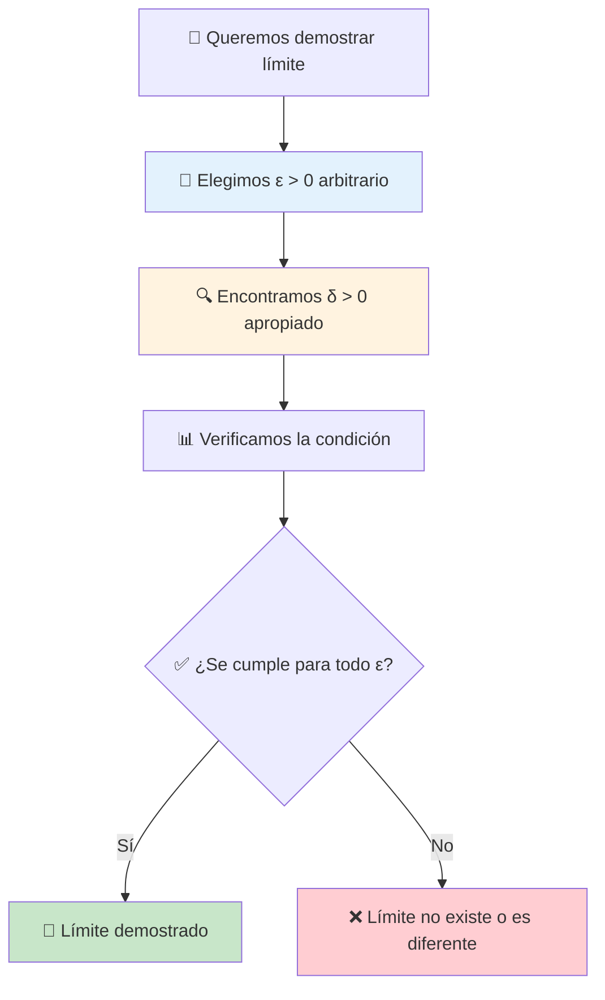

# Definición Épsilon-Delta 🔬

> [!tip] 🎯 Concepto Central La **definición épsilon-delta** es la formalización matemática rigurosa del concepto de límite. Es como establecer las "reglas del juego" de manera precisa: podemos acercarnos tanto como queramos al límite, siempre que nos acerquemos lo suficiente al punto de interés.

## La Definición Formal 📐

> [!info] 🔬 Definición Rigurosa de Límite **Decimos que** $\lim_{x \to a} f(x) = L$ **si y solo si:**
> 
> Para todo $\varepsilon > 0$, existe un $\delta > 0$ tal que:
> 
> $$\text{Si } 0 < |x - a| < \delta \text{, entonces } |f(x) - L| < \varepsilon$$
> 
> **En otras palabras:** No importa qué tan pequeño sea $\varepsilon$ (qué tan cerca queremos estar del límite), siempre podemos encontrar un $\delta$ (qué tan cerca debemos estar del punto) que garantice esa precisión.



## Interpretación Geométrica 📊

> [!example] 🎨 Visualización Gráfica **La definición épsilon-delta se traduce en:**
> 
> - **📏 Banda horizontal:** $L - \varepsilon < f(x) < L + \varepsilon$
> - **📏 Banda vertical:** $a - \delta < x < a + \delta$ (excluyendo $x = a$)
> - **🎯 Condición:** Toda la función en la banda vertical debe quedar dentro de la banda horizontal
> 
> |Elemento|Significado Geométrico|Representación|
> |---|---|---|
> |$\varepsilon$|Mitad del ancho de la banda horizontal|$\pm \varepsilon$ alrededor de $L$|
> |$\delta$|Mitad del ancho de la banda vertical|$\pm \delta$ alrededor de $a$|
> |$\|f(x) - L\|$|Distancia vertical entre $f(x)$ y $L$|Altura desde la función al límite|
> |$\|x - a\|$|Distancia horizontal entre $x$ y $a$|Distancia desde $x$ al punto de interés|

> [!note] 🖼️ Interpretación Visual
> 
> ```mermaid
> graph LR
>    A["🎯 Punto (a,L)"] --> B["📏 Banda ε alrededor de L"]
>    A --> C["📏 Banda δ alrededor de a"]
>    B --> D["✅ f(x) debe quedar dentro"]
>    C --> E["🔍 Para toda x en esta banda"]
>    D --> F["🎉 Definición satisfecha"]
>    E --> F
>    
>    style F fill:#c8e6c9
>    style B fill:#e8f5e8
>    style C fill:#fff3e0
> ```

## Análisis de los Componentes 🔍

> [!info] 🧮 Disección de la Definición
> 
> ### 📏 Épsilon ($\varepsilon$) - La Tolerancia
> 
> - **🎯 Representa:** Qué tan cerca queremos que $f(x)$ esté de $L$
> - **📊 Controla:** La precisión vertical (en el eje $y$)
> - **🔢 Rango:** Cualquier número positivo, por pequeño que sea
> - **💭 Interpretación:** "Margen de error" permitido
> 
> ### 📏 Delta ($\delta$) - La Respuesta
> 
> - **🎯 Representa:** Qué tan cerca de $a$ debe estar $x$
> - **📊 Controla:** El rango horizontal (en el eje $x$)
> - **🔗 Dependencia:** Generalmente depende de $\varepsilon$: $\delta = \delta(\varepsilon)$
> - **💭 Interpretación:** "Radio de acción" alrededor de $a$

> [!warning] ⚠️ Condiciones Importantes
> 
> ### 🚫 Exclusiones Críticas
> 
> - **$0 < |x - a|$:** Excluimos $x = a$ (no nos importa $f(a)$)
> - **$x \neq a$:** La función puede no estar definida en $a$
> - **$\varepsilon > 0$:** Solo consideramos tolerancias positivas
> - **$\delta > 0$:** Solo consideramos rangos positivos

## Estrategia de Demostración 🎯

> [!tip] 📝 Método Sistemático para Demostraciones
> 
> ### **Paso 1: Configuración Inicial** 🎬
> 
> - Sea $\varepsilon > 0$ arbitrario (dado)
> - Queremos encontrar $\delta > 0$ tal que la implicación se cumpla
> 
> ### **Paso 2: Análisis Algebraico** 🧮
> 
> - Partimos de $|f(x) - L| < \varepsilon$
> - Manipulamos algebraicamente para obtener una condición en $|x - a|$
> - Identificamos qué $\delta$ funcionará
> 
> ### **Paso 3: Elección de Delta** 🎯
> 
> - Elegimos $\delta$ basado en el análisis anterior
> - A menudo $\delta = \min{\text{valor}_1, \text{valor}_2, ...}$
> 
> ### **Paso 4: Verificación** ✅
> 
> - Asumimos $0 < |x - a| < \delta$
> - Demostramos que esto implica $|f(x) - L| < \varepsilon$

## Ejemplos Fundamentales 📚

### Ejemplo 1: Función Lineal 📈

> [!example] 🎯 Demostrar que $\lim_{x \to 3} (2x + 1) = 7$
> 
> **Configuración:**
> 
> - Queremos probar: $\lim_{x \to 3} (2x + 1) = 7$
> - Sea $\varepsilon > 0$ arbitrario
> 
> **Análisis:** $|f(x) - L| = |(2x + 1) - 7| = |2x - 6| = 2|x - 3|$
> 
> **Queremos:** $2|x - 3| < \varepsilon$ **Esto significa:** $|x - 3| < \frac{\varepsilon}{2}$
> 
> **Elección de Delta:** Elegimos $\delta = \frac{\varepsilon}{2}$
> 
> **Verificación:** Si $0 < |x - 3| < \delta = \frac{\varepsilon}{2}$, entonces: $|f(x) - L| = 2|x - 3| < 2 \cdot \frac{\varepsilon}{2} = \varepsilon$ ✅
> 
> **Conclusión:** El límite está demostrado 🎉

### Ejemplo 2: Función Cuadrática 📊

## 🎯 Demostrar que $\lim_{x \to 2} x^2 = 4$

### Configuración:

- Queremos probar: $\lim_{x \to 2} x^2 = 4$
- Sea $\varepsilon > 0$ arbitrario

### Análisis:
$$
|f(x) - L| = |x^2 - 4| = |(x - 2)(x + 2)| = |x - 2| \cdot |x + 2|
$$

### Restricción preliminar:

Supongamos $|x - 2| < 1$, entonces $1 < x < 3$, así que $3 < x + 2 < 5$  
Por tanto: $|x + 2| < 5$

### Condición deseada:
$$
|x^2 - 4| = |x - 2| \cdot |x + 2| < |x - 2| \cdot 5 < \varepsilon
$$

Esto requiere: $|x - 2| < \frac{\varepsilon}{5}$

### Elección de Delta:
$$
\delta = \min\left\{1, \frac{\varepsilon}{5}\right\}
$$

### Verificación:

Si $0 < |x - 2| < \delta = \min\left\{1, \frac{\varepsilon}{5}\right\}$, entonces:

- $|x - 2| < 1$, lo que implica $1 < x < 3$, por tanto $3 < x + 2 < 5$, así $|x + 2| < 5$
- $|x - 2| < \frac{\varepsilon}{5}$

Por tanto:
$$
|x^2 - 4| = |x - 2| \cdot |x + 2| < \frac{\varepsilon}{5} \cdot 5 = \varepsilon \quad \blacksquare
$$


### Ejemplo 3: Función Racional 📉

> [!example] 🎯 Demostrar que $\lim_{x \to 1} \frac{x^2 - 1}{x - 1} = 2$
> 
> **Configuración:**
> 
> - Función: $f(x) = \frac{x^2 - 1}{x - 1} = \frac{(x-1)(x+1)}{x-1} = x + 1$ (para $x \neq 1$)
> - Queremos probar: $\lim_{x \to 1} f(x) = 2$
> 
> **Análisis:** Para $x \neq 1$: $|f(x) - L| = |(x + 1) - 2| = |x - 1|$
> 
> **Condición:** $|x - 1| < \varepsilon$
> 
> **Elección de Delta:** $\delta = \varepsilon$
> 
> **Verificación:** Si $0 < |x - 1| < \delta = \varepsilon$, entonces: $|f(x) - 2| = |x - 1| < \varepsilon$ ✅
> 
> 📝 **Nota:** La simplicidad surge porque la función se simplifica a una forma lineal.

## Propiedades y Teoremas 📜

> [!info] ⚖️ Propiedades Fundamentales
> 
> ### 🎯 Unicidad del Límite
> 
> **Si** $\lim_{x \to a} f(x) = L_1$ **y** $\lim_{x \to a} f(x) = L_2$, **entonces** $L_1 = L_2$
> 
> ### ➕ Límite de la Suma
> 
> **Si** $\lim_{x \to a} f(x) = L$ **y** $\lim_{x \to a} g(x) = M$, **entonces:** $\lim_{x \to a} [f(x) + g(x)] = L + M$
> 
> ### ✖️ Límite del Producto
> 
> $\lim_{x \to a} [f(x) \cdot g(x)] = L \cdot M$
> 
> ### ➗ Límite del Cociente
> 
> $\lim_{x \to a} \frac{f(x)}{g(x)} = \frac{L}{M}$ (si $M \neq 0$)

## Aplicaciones de la Definición 🌍

> [!example] 🔬 Demostrar que un Límite NO Existe **Para probar que** $\lim_{x \to a} f(x)$ **no existe:**
> 
> Encontramos un $\varepsilon_0 > 0$ tal que para cualquier $\delta > 0$, existe al menos un $x$ con $0 < |x - a| < \delta$ pero $|f(x) - L| \geq \varepsilon_0$
> 
> **Ejemplo:** Función escalón $f(x) = \begin{cases} 0 & \text{si } x < 0 \ 1 & \text{si } x \geq 0 \end{cases}$
> 
> **En $x = 0$:** No importa qué valor de $L$ propongamos, siempre podemos encontrar puntos cerca de 0 donde $f(x)$ está lejos de $L$.

## Relación con Límites Laterales ↔️

> [!info] 🔗 Conexión Épsilon-Delta con Límites Laterales
> 
> **Límite por la izquierda:** $\lim_{x \to a^-} f(x) = L$ Para todo $\varepsilon > 0$, existe $\delta > 0$ tal que: Si $a - \delta < x < a$, entonces $|f(x) - L| < \varepsilon$
> 
> **Límite por la derecha:** $\lim_{x \to a^+} f(x) = L$ Para todo $\varepsilon > 0$, existe $\delta > 0$ tal que: Si $a < x < a + \delta$, entonces $|f(x) - L| < \varepsilon$

## Errores Comunes ⚠️

> [!warning] 🚨 Trampas en Demostraciones Épsilon-Delta
> 
> ### ❌ Error 1: Delta dependiente de x
> 
> **Problema:** Elegir $\delta$ que dependa de $x$ **Correcto:** $\delta$ solo debe depender de $\varepsilon$ (y posiblemente de $a$ y $L$)
> 
> ### ❌ Error 2: Asumir el resultado
> 
> **Problema:** Comenzar asumiendo $|f(x) - L| < \varepsilon$ **Correcto:** Comenzar con la condición de $\delta$ y llegar a la de $\varepsilon$
> 
> ### ❌ Error 3: No manejar casos extremos
> 
> **Problema:** No considerar restricciones adicionales necesarias **Correcto:** Usar $\min$ para combinar múltiples restricciones en $\delta$

## Importancia Histórica 📖

> [!note] 🏛️ Contexto Histórico **Desarrollo por:**
> 
> - **Karl Weierstrass** (1815-1897) - Formalización rigurosa
> - **Augustin-Louis Cauchy** (1789-1857) - Trabajos preliminares
> - **Bernard Bolzano** (1781-1848) - Contribuciones tempranas
> 
> **Importancia:**
> 
> - 🔬 Eliminó la vaguedad del concepto intuitivo
> - 📐 Permitió demostraciones rigurosas
> - 🏗️ Base para todo el análisis matemático moderno
> - 🌍 Fundamento para derivadas, integrales y continuidad

## Técnica de Estudio: Mnemotecnia "ÉPSILON" 🧠

> [!tip] 🎓 Para Recordar el Proceso de Demostración **É**ligE un épsilon arbitrario > 0 **P**artE de la condición |f(x) - L| < ε **S**implifica algebraicamente la expresión **I**dentifica la relación con |x - a| **L**ogra una condición de la forma |x - a| < algo **O**ptimiza eligiendo δ apropiado **N**avega la verificación final

## Referencias 📚

> [!quote] 🔗 Notas Relacionadas
> 
> - [[Concepto Intuitivo de Límite]] - Base conceptual informal
> - [[Límites por la Izquierda y Derecha]] - Extensión lateral
> - [[Continuidad de Funciones]] - Aplicación directa
> - [[Teoremas de Límites]] - Propiedades demostradas rigurosamente

## Notas Recomendadas 💡

> [!note] 📖 Para Profundizar
> 
> - [[Análisis Real]] - Contexto matemático completo
> - [[Topología Básica]] - Conceptos de vecindades
> - [[Historia del Cálculo]] - Desarrollo histórico
> - [[Demostraciones Matemáticas]] - Técnicas de prueba
> - [[Fundamentos de Análisis]] - Teoría avanzada de límites
> - [[Espacios Métricos]] - Generalización abstracta

---

**Tags:** #calculo #limites #definicion-formal #epsilon-delta #rigor-matematico #demostraciones #weierstrass #analisis-real #fundamentos #matematica-pura #teoria-limites