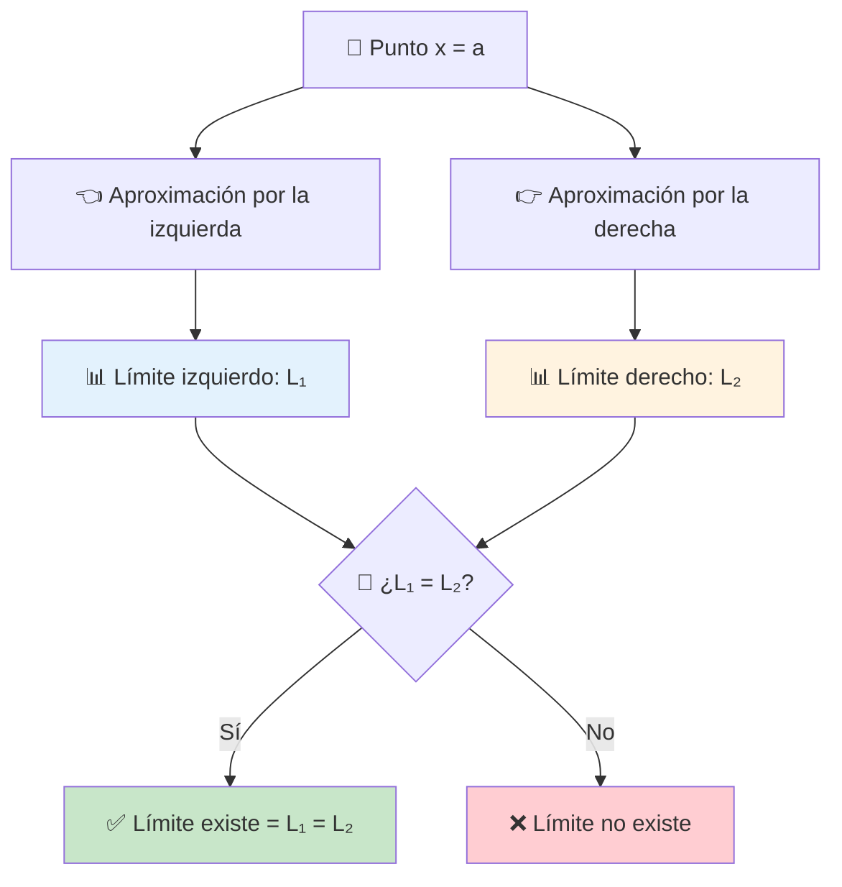
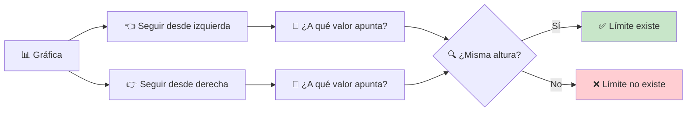

# Límites por la Izquierda y Derecha ↔️

> [!tip] 🎯 Concepto Central Los **límites laterales** nos permiten analizar el comportamiento de una función acercándonos a un punto desde **una sola dirección**. Son como examinar una intersección desde cada calle por separado antes de decidir si es seguro cruzar.

## Definiciones Fundamentales 📝

> [!info] 👈 Límite por la Izquierda (Límite Lateral Izquierdo) **Notación:** $\lim_{x \to a^-} f(x) = L_1$
> 
> Significa que cuando $x$ se acerca a $a$ **solo con valores menores que $a$** (desde la izquierda), $f(x)$ se acerca a $L_1$.
> 
> **En otras palabras:** $x < a$ y $x \to a$

> [!info] 👉 Límite por la Derecha (Límite Lateral Derecho) **Notación:** $\lim_{x \to a^+} f(x) = L_2$
> 
> Significa que cuando $x$ se acerca a $a$ **solo con valores mayores que $a$** (desde la derecha), $f(x)$ se acerca a $L_2$.
> 
> **En otras palabras:** $x > a$ y $x \to a$

## Teorema Fundamental de Límites Laterales 🔑

> [!warning] ⚖️ Condición de Existencia del Límite **El límite $\lim_{x \to a} f(x)$ existe si y solo si:**
> 
> 1. **✅ Ambos límites laterales existen**
> 2. **✅ Son iguales:** $\lim_{x \to a^-} f(x) = \lim_{x \to a^+} f(x)$
> 
> **Cuando esto ocurre:** $$\lim_{x \to a} f(x) = \lim_{x \to a^-} f(x) = \lim_{x \to a^+} f(x)$$

## Técnicas de Cálculo 🧮

> [!example] 🔢 Método de Aproximación Numérica Para calcular $\lim_{x \to a^-} f(x)$:
> 
> **Tabla desde la izquierda:**
> 
> |$x$ (valores < a)|$f(x)$|
> |---|---|
> |$a - 0.1$|$f(a-0.1)$|
> |$a - 0.01$|$f(a-0.01)$|
> |$a - 0.001$|$f(a-0.001)$|
> 
> **Tabla desde la derecha:**
> 
> |$x$ (valores > a)|$f(x)$|
> |---|---|
> |$a + 0.1$|$f(a+0.1)$|
> |$a + 0.01$|$f(a+0.01)$|
> |$a + 0.001$|$f(a+0.001)$|

## Casos Fundamentales 🎭

### Caso 1: Límites Laterales Iguales ✅

> [!example] 🌊 Función Continua **Ejemplo:** $f(x) = x^2$ en $x = 2$
> 
> **Cálculo:**
> 
> - $\lim_{x \to 2^-} x^2 = 4$
> - $\lim_{x \to 2^+} x^2 = 4$
> - Como son iguales: $\lim_{x \to 2} x^2 = 4$ ✨
> 
> **Verificación numérica:**
> 
> |Desde la izquierda|$f(x) = x^2$|Desde la derecha|$f(x) = x^2$|
> |---|---|---|---|
> |$x = 1.9$|$3.61$|$x = 2.1$|$4.41$|
> |$x = 1.99$|$3.9601$|$x = 2.01$|$4.0401$|
> |$x = 1.999$|$3.996001$|$x = 2.001$|$4.004001$|
> 
> 🎯 **Ambos se acercan a 4**

### Caso 2: Discontinuidad Removible 🕳️

> [!example] ⚪ Función con Hueco **Ejemplo:** $g(x) = \frac{x^2 - 4}{x - 2}$ en $x = 2$
> 
> **Análisis algebraico:** $g(x) = \frac{x^2 - 4}{x - 2} = \frac{(x-2)(x+2)}{x - 2} = x + 2$ (para $x \neq 2$)
> 
> **Límites laterales:**
> 
> - $\lim_{x \to 2^-} g(x) = \lim_{x \to 2^-} (x + 2) = 4$
> - $\lim_{x \to 2^+} g(x) = \lim_{x \to 2^+} (x + 2) = 4$
> - **Resultado:** $\lim_{x \to 2} g(x) = 4$ ✅
> 
> 📝 **Nota:** Aunque $g(2)$ no existe, el límite sí existe

### Caso 3: Discontinuidad de Salto 📈📉

> [!warning] ❌ Límites Laterales Diferentes **Ejemplo:** Función escalón $h(x) = \begin{cases} x + 1 & \text{si } x < 3 \ 2x - 2 & \text{si } x \geq 3 \end{cases}$
> 
> **En $x = 3$:**
> 
> - $\lim_{x \to 3^-} h(x) = \lim_{x \to 3^-} (x + 1) = 4$
> - $\lim_{x \to 3^+} h(x) = \lim_{x \to 3^+} (2x - 2) = 4$
> - Como $4 = 4$: $\lim_{x \to 3} h(x) = 4$ ✅
> 
> **Ejemplo de salto real:** $k(x) = \begin{cases} x & \text{si } x < 1 \ x + 2 & \text{si } x \geq 1 \end{cases}$
> 
> **En $x = 1$:**
> 
> - $\lim_{x \to 1^-} k(x) = 1$
> - $\lim_{x \to 1^+} k(x) = 3$
> - Como $1 \neq 3$: $\lim_{x \to 1} k(x)$ **no existe** ❌

### Caso 4: Límites Infinitos ♾️

> [!warning] ♾️ Asíntotas Verticales **Ejemplo:** $f(x) = \frac{1}{x - 2}$ en $x = 2$
> 
> **Análisis por signos:**
> 
> - Para $x < 2$: $(x - 2) < 0$ → $f(x) < 0$
> - Para $x > 2$: $(x - 2) > 0$ → $f(x) > 0$
> 
> **Límites laterales:**
> 
> - $\lim_{x \to 2^-} \frac{1}{x - 2} = -\infty$
> - $\lim_{x \to 2^+} \frac{1}{x - 2} = +\infty$
> - **Resultado:** $\lim_{x \to 2} \frac{1}{x - 2}$ **no existe** (pero ambos límites laterales son infinitos)

## Análisis Visual en Gráficas 📊

> [!info] 👀 Identificación Gráfica de Límites Laterales
> 
> |Tipo Visual|Límite Izquierdo|Límite Derecho|Límite Total|
> |---|---|---|---|
> |🌊 Curva continua|✅ Existe|✅ Existe|✅ Existe|
> |🕳️ Hueco|✅ Existe|✅ Existe|✅ Existe|
> |📈📉 Salto|✅ Existe|✅ Existe|❌ No existe|
> |♾️ Asíntota vertical|♾️ Infinito|♾️ Infinito|Depende del caso|

## Funciones Definidas por Partes 🧩

> [!example] 🎯 Estrategia para Funciones por Partes **Para evaluar límites laterales en $x = a$:**
> 
> 1. **📋 Identifica** qué fórmula usar para $x < a$ (límite izquierdo)
> 2. **📋 Identifica** qué fórmula usar para $x > a$ (límite derecho)
> 3. **🧮 Calcula** cada límite lateral por separado
> 4. **⚖️ Compara** los resultados

> [!example] 🔍 Ejemplo Detallado $f(x) = \begin{cases} x^2 & \text{si } x < 0 \ 2 & \text{si } x = 0 \ x + 1 & \text{si } x > 0 \end{cases}$
> 
> **Análisis en $x = 0$:**
> 
> - **👈 Límite izquierdo:** $\lim_{x \to 0^-} f(x) = \lim_{x \to 0^-} x^2 = 0$
> - **👉 Límite derecho:** $\lim_{x \to 0^+} f(x) = \lim_{x \to 0^+} (x + 1) = 1$
> - **⚖️ Comparación:** $0 \neq 1$
> - **🚫 Conclusión:** $\lim_{x \to 0} f(x)$ no existe
> 
> 📝 **Nota:** Aunque $f(0) = 2$, esto no afecta la existencia del límite

## Propiedades de Límites Laterales ⚖️

> [!info] 📜 Teoremas Importantes Si $\lim_{x \to a^-} f(x) = L_1$ y $\lim_{x \to a^+} f(x) = L_2$:
> 
> **Operaciones:**
> 
> - **Suma:** $\lim_{x \to a^{\pm}} [f(x) + g(x)] = \lim_{x \to a^{\pm}} f(x) + \lim_{x \to a^{\pm}} g(x)$
> - **Producto:** $\lim_{x \to a^{\pm}} [f(x) \cdot g(x)] = \lim_{x \to a^{\pm}} f(x) \cdot \lim_{x \to a^{\pm}} g(x)$
> - **Cociente:** $\lim_{x \to a^{\pm}} \frac{f(x)}{g(x)} = \frac{\lim_{x \to a^{\pm}} f(x)}{\lim_{x \to a^{\pm}} g(x)}$ (si el denominador ≠ 0)

## Aplicaciones Prácticas 🌍

> [!example] 🚗 Aplicación: Velocidad Instantánea Un auto se mueve según $s(t) = \begin{cases} 2t^2 & \text{si } 0 \leq t < 3 \ 18 + 3(t-3) & \text{si } t \geq 3 \end{cases}$
> 
> **¿Cuál es la velocidad en $t = 3$?**
> 
> La velocidad es $v(t) = s'(t)$:
> 
> - **👈 Antes de $t = 3$:** $v(t) = \frac{d}{dt}(2t^2) = 4t$
> - $\lim_{t \to 3^-} v(t) = 4(3) = 12$ m/s
> - **👉 Después de $t = 3$:** $v(t) = \frac{d}{dt}[18 + 3(t-3)] = 3$
> - $\lim_{t \to 3^+} v(t) = 3$ m/s
> 
> **Conclusión:** Como $12 \neq 3$, hay un cambio abrupto de velocidad en $t = 3$

## Errores Comunes ⚠️

> [!warning] 🚨 Trampas Frecuentes
> 
> ### ❌ Error 1: Usar la función equivocada en los límites laterales
> 
> **Problema:** En funciones por partes, usar la fórmula incorrecta **Solución:** Verificar cuidadosamente qué expresión corresponde a cada lado
> 
> ### ❌ Error 2: Confundir límites laterales con el valor de la función
> 
> **Problema:** Pensar que $f(a)$ determina los límites laterales **Solución:** Los límites laterales dependen del comportamiento cerca de $a$, no en $a$
> 
> ### ❌ Error 3: Concluir existencia sin verificar ambos lados
> 
> **Problema:** Calcular solo un límite lateral **Solución:** Siempre verificar ambos límites laterales antes de concluir

## Técnica de Estudio: Mnemotecnia "LATERAL" 🧠

> [!tip] 🎓 Para Recordar el Proceso **L**ocaliza el punto de interés x = a **A**naliza desde ambos lados por separado **T**abula valores acercándose desde cada lado **E**valúa hacia dónde tiende cada límite lateral **R**evisa si los límites laterales son iguales **A**firma la existencia del límite solo si coinciden **L**ee el resultado: existe o no existe

## Referencias 📚

> [!quote] 🔗 Notas Relacionadas
> 
> - [[Concepto Intuitivo de Límite]] - Fundamentos básicos
> - [[Límites en Gráficas]] - Interpretación visual
> - [[Funciones y Continuidad]] - Relación con continuidad
> - [[Funciones Definidas por Partes]] - Casos especiales

## Notas Recomendadas 💡

> [!note] 📖 Para Profundizar
> 
> - [[Definición Formal del Límite]] - Formalización rigurosa
> - [[Límites por Sustitución Directa]] - Técnicas de cálculo
> - [[Asíntotas Verticales]] - Límites infinitos laterales
> - [[Derivadas Laterales]] - Aplicación en derivabilidad
> - [[Teorema del Sandwich]] - Técnicas avanzadas de límites

---

**Tags:** #calculo #limites #limites-laterales #discontinuidades #funciones-por-partes #izquierda-derecha #existencia-limites #continuidad #matematicas #analisis