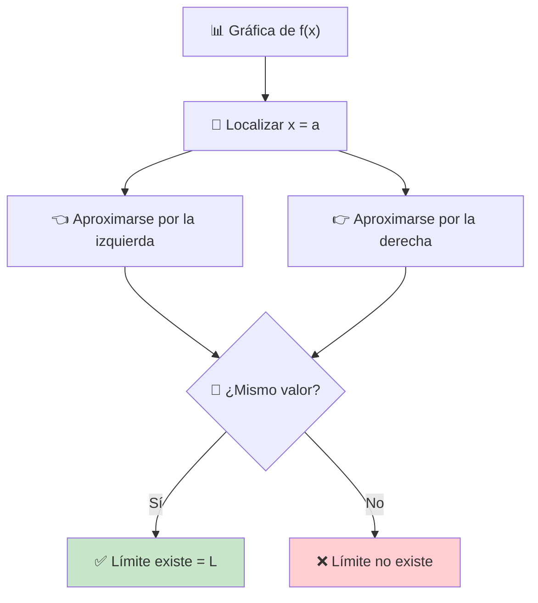

# Límites en Gráficas 📈

> [!tip] 🎯 Concepto Central **Leer límites en gráficas** es como ser un detective visual: observamos hacia dónde "apunta" la función cuando nos acercamos a un punto, sin importar qué pase exactamente en ese punto. La gráfica nos cuenta la historia completa del comportamiento de la función.

## Cómo Leer Límites Visualmente 👀

> [!info] 🔍 Técnica de Lectura Visual Para encontrar $\lim_{x \to a} f(x)$ en una gráfica:
> 
> 1. **📍 Localiza** el punto $x = a$ en el eje horizontal
> 2. **👈👉 Acércate** al punto desde ambos lados
> 3. **👀 Observa** hacia dónde "apuntan" los valores de $f(x)$
> 4. **🎯 Determina** si ambos lados convergen al mismo valor



## Casos Visuales Fundamentales 🎭

### Caso 1: Función Continua 🌊

> [!example] ✅ Límite Existe y Coincide con el Valor de la Función
> 
> ```mermaid
> graph LR
>    A["📈 Función suave"] --> B["📍 Punto en a"]
>    B --> C["🎯 Límite = f(a)"]
>    
>    style B fill:#e8f5e8
>    style C fill:#c8e6c9
> ```
> 
> **Características visuales:**
> 
> - 🌊 La curva es "suave" y sin interrupciones
> - 📍 Hay un punto sólido en $(a, f(a))$
> - ➡️ La función se acerca naturalmente al punto
> 
> **Resultado:** $\lim_{x \to a} f(x) = f(a)$ ✨

### Caso 2: Discontinuidad Removible (Hueco) 🕳️

> [!example] ✅ Límite Existe pero Diferente del Valor de la Función
> 
> **Características visuales:**
> 
> - ⚪ Círculo vacío (hueco) en el punto $(a, f(a))$
> - 🔴 Posible punto sólido en otra altura
> - ➡️ La curva "apunta" hacia donde debería estar el punto
> 
> |Situación|Descripción Visual|Límite|
> |---|---|---|
> |🕳️ Solo hueco|Círculo vacío en $(a, L)$|$\lim_{x \to a} f(x) = L$|
> |🔴🕳️ Hueco + punto|Hueco en $(a, L)$, punto en $(a, M)$|$\lim_{x \to a} f(x) = L$|

### Caso 3: Discontinuidad de Salto 📈📉

> [!warning] ❌ Límite No Existe - Salto Finito
> 
> **Características visuales:**
> 
> - 📈 La función "salta" de un nivel a otro
> - ⬆️ Límite por la izquierda ≠ Límite por la derecha
> - 🔴⚪ Puede haber combinación de puntos sólidos y huecos
> 
> **Ejemplo típico:** Función escalón
> 
> - 👈 Desde la izquierda: se acerca a un valor $L_1$
> - 👉 Desde la derecha: se acerca a un valor $L_2 \neq L_1$
> - 🚫 Como $L_1 \neq L_2$, el límite no existe

### Caso 4: Discontinuidad Infinita (Asíntota Vertical) ♾️

> [!warning] ♾️ Límite Infinito - Asíntota Vertical
> 
> **Características visuales:**
> 
> - 📏 Línea vertical punteada (asíntota)
> - ⬆️⬇️ La función crece o decrece sin límite
> - 🚀 Los valores de $f(x)$ van hacia $+\infty$ o $-\infty$
> 
> **Casos posibles:**
> 
> - $\lim_{x \to a^-} f(x) = +\infty$ y $\lim_{x \to a^+} f(x) = +\infty$ → $\lim_{x \to a} f(x) = +\infty$
> - $\lim_{x \to a^-} f(x) = -\infty$ y $\lim_{x \to a^+} f(x) = -\infty$ → $\lim_{x \to a} f(x) = -\infty$
> - Límites laterales diferentes → Límite no existe

## Análisis Detallado por Tipos 🔬

> [!info] 📊 Tabla de Identificación Visual
> 
> |Tipo de Gráfica|Símbolo Visual|Límite|Continuidad|
> |---|---|---|---|
> |🌊 Curva suave|🔴 Punto sólido|✅ Existe = f(a)|✅ Continua|
> |🕳️ Con hueco|⚪ Círculo vacío|✅ Existe ≠ f(a)|❌ Discontinua|
> |🔴🕳️ Hueco + punto|⚪🔴 Vacío + sólido|✅ Existe ≠ f(a)|❌ Discontinua|
> |📈📉 Salto|🔴⚪ Sólido + vacío|❌ No existe|❌ Discontinua|
> |♾️ Asíntota vertical|📏 Línea punteada|♾️ Infinito|❌ Discontinua|

## Estrategias de Lectura Visual 🎯

> [!tip] 🔍 Método "MIRA" **M**arca el punto x = a en el eje horizontal **I**magina líneas verticales acercándose al punto **R**astra hacia dónde apuntan los valores de f(x) **A**naliza si ambos lados convergen al mismo valor

### Técnica del "Dedo Seguidor" 👆

> [!example] 🖱️ Estrategia Práctica
> 
> 1. **👆 Coloca tu dedo** en un punto alejado de $x = a$
> 2. **➡️ Deslízalo** lentamente siguiendo la curva hacia $x = a$
> 3. **👀 Observa** hacia dónde se dirige tu dedo en el eje $y$
> 4. **🔄 Repite** desde el otro lado
> 5. **🤝 Compara** ambas direcciones

## Casos Especiales Visuales 🎪

### Funciones Oscilantes 〰️

> [!warning] 🌀 Comportamiento Oscilatorio **¿Cuándo no existe el límite por oscilación?**
> 
> - 〰️ La función "vibra" infinitamente cerca del punto
> - 📈📉 No se estabiliza en un valor específico
> - 🌪️ Ejemplo clásico: $f(x) = \sin\left(\frac{1}{x}\right)$ cerca de $x = 0$
> 
> **Identificación visual:**
> 
> - Ondas que se vuelven más frecuentes cerca del punto
> - No hay una "dirección clara" hacia donde apunta

### Límites al Infinito 🚀

> [!info] ♾️ Comportamiento Asintótico Horizontal Para $\lim_{x \to \infty} f(x)$ o $\lim_{x \to -\infty} f(x)$:
> 
> **Buscar:**
> 
> - 📏 Líneas horizontales punteadas (asíntotas horizontales)
> - ➡️ Comportamiento de la función cuando $x$ va muy a la derecha
> - ⬅️ Comportamiento de la función cuando $x$ va muy a la izquierda
> 
> **Casos:**
> 
> - 📏 Se acerca a una línea horizontal → Límite = valor de esa línea
> - ⬆️ Crece sin límite → Límite = $+\infty$
> - ⬇️ Decrece sin límite → Límite = $-\infty$

## Ejemplos Prácticos de Lectura 📚

> [!example] 🔍 Ejemplo 1: Función Racional Para $f(x) = \frac{x^2 - 1}{x - 1}$:
> 
> **Observaciones visuales:**
> 
> - 🕳️ Hueco en $x = 1$
> - 📈 La función parece una recta $y = x + 1$ excepto en $x = 1$
> - 👀 Al acercarse a $x = 1$, apunta hacia $y = 2$
> 
> **Conclusión:** $\lim_{x \to 1} \frac{x^2 - 1}{x - 1} = 2$ ✨

> [!example] 🔍 Ejemplo 2: Función Definida por Partes $g(x) = \begin{cases} x + 1 & \text{si } x < 2 \ 3 & \text{si } x = 2 \ 2x - 1 & \text{si } x > 2 \end{cases}$
> 
> **Análisis visual en x = 2:**
> 
> - 👈 Desde la izquierda: sigue $y = x + 1$ → se acerca a $3$
> - 👉 Desde la derecha: sigue $y = 2x - 1$ → se acerca a $3$
> - 🔴 Punto sólido en $(2, 3)$
> 
> **Conclusión:** $\lim_{x \to 2} g(x) = 3 = g(2)$ (función continua) ✅

## Errores Visuales Comunes ⚠️

> [!warning] 🚨 Trampas en la Lectura Gráfica
> 
> ### ❌ Error 1: Confundir el valor de la función con el límite
> 
> **Problema:** Mirar solo el punto sólido **Solución:** Observar hacia dónde apunta la curva, no solo los puntos
> 
> ### ❌ Error 2: No verificar ambos lados
> 
> **Problema:** Solo mirar desde un lado del punto **Solución:** Siempre verificar límites laterales
> 
> ### ❌ Error 3: Confundir escalas
> 
> **Problema:** No leer correctamente los valores en los ejes **Solución:** Prestar atención a las escalas y unidades

## Herramientas Tecnológicas 💻

> [!tip] 🛠️ Recursos para Práctica Visual **Software recomendado:**
> 
> - 📊 **Desmos Graphing Calculator** - Gráficas interactivas
> - 🧮 **GeoGebra** - Visualización dinámica
> - 📱 **Wolfram Alpha** - Gráficas y análisis
> - 🖥️ **Mathematica/Maple** - Análisis avanzado
> 
> **Ventajas:**
> 
> - 🔍 Zoom para ver detalles
> - 🎚️ Manipulación de parámetros
> - 📏 Medición precisa de valores

## Técnica de Estudio: Mnemotecnia "VISUAL" 🧠

> [!tip] 🎓 Para Leer Límites en Gráficas **V**e hacia el punto de interés en x = a **I**dentifica el tipo de comportamiento (continuo, salto, hueco, etc.) **S**igue la curva desde ambos lados **U**bica hacia dónde apuntan los valores de f(x) **A**naliza si los límites laterales coinciden **L**ee el valor final del límite (si existe)

## Referencias 📚

> [!quote] 🔗 Notas Relacionadas
> 
> - [[Concepto General del Límite]] - Base conceptual
> - [[Límites Laterales]] - Límites laterales
> - [[Funciones y Continuidad]] - Tipos de discontinuidades
> - [[Asíntotas y Comportamiento]] - Comportamiento asintótico

## Notas Recomendadas 💡

> [!note] 📖 Para Profundizar
> 
> - [[Límites por Sustitución Directa]] - Cálculo algebraico
> - [[Teoremas de Límites]] - Propiedades fundamentales
> - [[Derivadas Geométricamente]] - Interpretación de la pendiente
> - [[Análisis Gráfico de Funciones]] - Técnicas avanzadas
> - [[Software Matemático]] - Herramientas de graficación

---

**Tags:** #calculo #limites #graficas #interpretacion-visual #continuidad #discontinuidades #asitotas #lectura-grafica #analisis-visual #matematicas #funciones