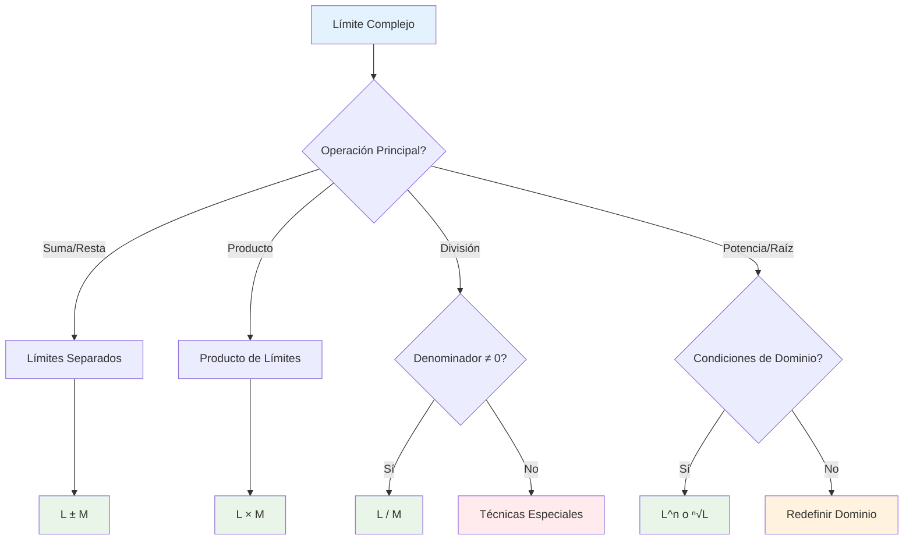

# ⚖️ Propiedades de los Límites

## 🎯 Álgebra de Límites

> [!info]- 💡 Definición Fundamental Las **propiedades de los límites** (también llamadas **álgebra de límites**) son reglas que nos permiten calcular límites de funciones complejas a partir de límites más simples.
> 
> **Condición previa:** Todas las propiedades requieren que los límites individuales **existan y sean finitos**.
> 
> Si $\lim_{x \to a} f(x) = L$ y $\lim_{x \to a} g(x) = M$, donde $L$ y $M$ son números reales, entonces se cumplen las siguientes propiedades fundamentales.

### 📊 Propiedades Básicas

> [!success]- ✅ Propiedad del Límite de una Constante **Regla:** El límite de una constante es la constante misma.
> 
> $$\lim_{x \to a} k = k$$
> 
> donde $k$ es cualquier número real.
> 
> **Ejemplos:**
> 
> - $\lim_{x \to 3} 7 = 7$
> - $\lim_{x \to -2} \pi = \pi$
> - $\lim_{x \to \infty} (-5) = -5$

> [!success]- ✅ Propiedad del Límite de la Variable **Regla:** El límite de la variable independiente es el valor al que tiende.
> 
> $$\lim_{x \to a} x = a$$
> 
> **Ejemplos:**
> 
> - $\lim_{x \to 5} x = 5$
> - $\lim_{x \to -3} x = -3$
> - $\lim_{t \to 0} t = 0$

## 🧮 Propiedades Aritméticas

### ➕ Suma y Resta

> [!example]- 📊 Propiedad de la Suma **Regla:** El límite de una suma es la suma de los límites.
> 
> $$\lim_{x \to a} [f(x) + g(x)] = \lim_{x \to a} f(x) + \lim_{x \to a} g(x) = L + M$$
> 
> **Extensión:** Para múltiples funciones: $$\lim_{x \to a} [f_1(x) + f_2(x) + \cdots + f_n(x)] = \lim_{x \to a} f_1(x) + \lim_{x \to a} f_2(x) + \cdots + \lim_{x \to a} f_n(x)$$
> 
> **Ejemplos:**
> 
> - $\lim_{x \to 2} (x^2 + 3x) = \lim_{x \to 2} x^2 + \lim_{x \to 2} 3x = 4 + 6 = 10$
> - $\lim_{x \to 1} (2x + 5 + \sin x) = 2 + 5 + \sin(1) = 7 + \sin(1)$

> [!example]- 📊 Propiedad de la Resta **Regla:** El límite de una diferencia es la diferencia de los límites.
> 
> $$\lim_{x \to a} [f(x) - g(x)] = \lim_{x \to a} f(x) - \lim_{x \to a} g(x) = L - M$$
> 
> **Ejemplos:**
> 
> - $\lim_{x \to 3} (x^2 - 2x) = \lim_{x \to 3} x^2 - \lim_{x \to 3} 2x = 9 - 6 = 3$
> - $\lim_{x \to 0} (\cos x - 1) = \cos(0) - 1 = 1 - 1 = 0$

### ✖️ Multiplicación

> [!example]- 📊 Propiedad del Producto **Regla:** El límite de un producto es el producto de los límites.
> 
> $$\lim_{x \to a} [f(x) \cdot g(x)] = \lim_{x \to a} f(x) \cdot \lim_{x \to a} g(x) = L \cdot M$$
> 
> **Caso especial - Múltiple constante:** $$\lim_{x \to a} [k \cdot f(x)] = k \cdot \lim_{x \to a} f(x) = k \cdot L$$
> 
> **Ejemplos:**
> 
> - $\lim_{x \to 2} (x \cdot x^2) = \lim_{x \to 2} x \cdot \lim_{x \to 2} x^2 = 2 \cdot 4 = 8$
> - $\lim_{x \to 1} (5 \cdot x^3) = 5 \cdot \lim_{x \to 1} x^3 = 5 \cdot 1 = 5$
> - $\lim_{x \to 0} (x \sin x) = \lim_{x \to 0} x \cdot \lim_{x \to 0} \sin x = 0 \cdot 0 = 0$

### ➗ División

> [!example]- 📊 Propiedad del Cociente **Regla:** El límite de un cociente es el cociente de los límites, **siempre que el denominador no sea cero**.
> 
> $$\lim_{x \to a} \frac{f(x)}{g(x)} = \frac{\lim_{x \to a} f(x)}{\lim_{x \to a} g(x)} = \frac{L}{M}$$
> 
> **Condición crucial:** $M = \lim_{x \to a} g(x) \neq 0$
> 
> **Ejemplos:**
> 
> - $\lim_{x \to 3} \frac{x^2 + 1}{x - 1} = \frac{\lim_{x \to 3} (x^2 + 1)}{\lim_{x \to 3} (x - 1)} = \frac{10}{2} = 5$
> - $\lim_{x \to 1} \frac{2x + 3}{x^2 + 4} = \frac{5}{5} = 1$
> 
> **⚠️ Cuidado:** Si $M = 0$, la propiedad NO aplica y necesitamos otras técnicas.

## 🔢 Propiedades de Potencias y Raíces

### 📈 Potencias

> [!tip]- 🚀 Propiedad de Potencias **Regla:** El límite de una potencia es la potencia del límite.
> 
> $$\lim_{x \to a} [f(x)]^n = \left[\lim_{x \to a} f(x)\right]^n = L^n$$
> 
> donde $n$ es cualquier entero positivo.
> 
> **Casos especiales:**
> 
> - **Cuadrados:** $\lim_{x \to a} [f(x)]^2 = [L]^2$
> - **Cubos:** $\lim_{x \to a} [f(x)]^3 = [L]^3$
> - **Polinomios:** $\lim_{x \to a} x^n = a^n$
> 
> **Ejemplos:**
> 
> - $\lim_{x \to 2} x^4 = 2^4 = 16$
> - $\lim_{x \to 1} (x + 1)^3 = (1 + 1)^3 = 8$
> - $\lim_{x \to 3} (x^2 - 1)^2 = (9 - 1)^2 = 64$

### 🔍 Raíces

> [!tip]- 🌱 Propiedad de Raíces **Regla:** El límite de una raíz es la raíz del límite.
> 
> $$\lim_{x \to a} \sqrt[n]{f(x)} = \sqrt[n]{\lim_{x \to a} f(x)} = \sqrt[n]{L}$$
> 
> **Condiciones:**
> 
> - Si $n$ es par: $L \geq 0$
> - Si $n$ es impar: $L$ puede ser cualquier valor real
> 
> **Casos comunes:**
> 
> - **Raíz cuadrada:** $\lim_{x \to a} \sqrt{f(x)} = \sqrt{L}$ (si $L \geq 0$)
> - **Raíz cúbica:** $\lim_{x \to a} \sqrt[3]{f(x)} = \sqrt[3]{L}$
> 
> **Ejemplos:**
> 
> - $\lim_{x \to 4} \sqrt{x + 5} = \sqrt{4 + 5} = 3$
> - $\lim_{x \to 1} \sqrt[3]{x^3 - 1} = \sqrt[3]{0} = 0$
> - $\lim_{x \to 8} \sqrt[3]{\frac{x}{2}} = \sqrt[3]{4}$

## 📊 Tabla Resumen de Propiedades

> [!note]- 📋 Resumen Completo
> 
> |Operación|Propiedad|Condición|
> |---|---|---|
> |**Constante**|$\lim_{x \to a} k = k$|Ninguna|
> |**Variable**|$\lim_{x \to a} x = a$|Ninguna|
> |**Suma**|$\lim_{x \to a} [f(x) + g(x)] = L + M$|$L, M$ finitos|
> |**Resta**|$\lim_{x \to a} [f(x) - g(x)] = L - M$|$L, M$ finitos|
> |**Producto**|$\lim_{x \to a} [f(x) \cdot g(x)] = L \cdot M$|$L, M$ finitos|
> |**Cociente**|$\lim_{x \to a} \frac{f(x)}{g(x)} = \frac{L}{M}$|$L, M$ finitos, $M \neq 0$|
> |**Potencia**|$\lim_{x \to a} [f(x)]^n = L^n$|$L$ finito|
> |**Raíz par**|$\lim_{x \to a} \sqrt[n]{f(x)} = \sqrt[n]{L}$|$L \geq 0$|
> |**Raíz impar**|$\lim_{x \to a} \sqrt[n]{f(x)} = \sqrt[n]{L}$|$L$ finito|

## 🧠 Técnica de Estudio: Método "SCPR"

> [!tip]- 🎓 Mnemotecnia "SCPR"
> 
> **S** - **S**uma y resta directas **C** - **C**onstantes se mantienen **P** - **P**roducto de límites **R** - **R**azón cuidando el denominador
> 
> **Frase nemotécnica:** _"Siempre Calculo Propiedades Rápidamente"_
> 
> **Proceso de aplicación:**
> 
> 1. 🎯 Identificar la operación principal
> 2. ✅ Verificar que los límites individuales existan
> 3. 🔍 Comprobar condiciones especiales (denominador ≠ 0)
> 4. 🧮 Aplicar la propiedad correspondiente

## 📊 Algoritmo de Aplicación

## ⚠️ Casos Especiales y Limitaciones

### 🚫 Cuando las Propiedades NO Aplican

> [!warning]- 🛑 Limitaciones Importantes
> 
> **1. Límites no existen:**
> 
> - Si $\lim_{x \to a} f(x)$ no existe, las propiedades no aplican
> - Ejemplo: $\lim_{x \to 0} \frac{1}{x}$ no existe
> 
> **2. Límites infinitos:**
> 
> - Las propiedades básicas no aplican directamente
> - Necesitamos reglas especiales para $\pm\infty$
> 
> **3. Formas indeterminadas:**
> 
> - $\frac{0}{0}$, $\frac{\infty}{\infty}$, $0 \cdot \infty$, $\infty - \infty$
> - Requieren técnicas como L'Hôpital
> 
> **4. División por cero:**
> 
> - Si $\lim_{x \to a} g(x) = 0$, no podemos usar la propiedad del cociente directamente

### 🔄 Formas Indeterminadas Comunes

> [!danger]- ⚡ Casos Problemáticos
> 
> |Forma|Ejemplo|Técnica Alternativa|
> |---|---|---|
> |$\frac{0}{0}$|$\lim_{x \to 0} \frac{\sin x}{x}$|L'Hôpital, Emparedado|
> |$\frac{\infty}{\infty}$|$\lim_{x \to \infty} \frac{x^2}{e^x}$|L'Hôpital|
> |$0 \cdot \infty$|$\lim_{x \to 0^+} x \ln x$|Transformación|
> |$\infty - \infty$|$\lim_{x \to \infty} (x - \sqrt{x^2 + 1})$|Racionalización|
> |$1^{\infty}$|$\lim_{x \to \infty} (1 + \frac{1}{x})^x$|Logaritmos|
> |$0^0$, $\infty^0$|$\lim_{x \to 0^+} x^x$|Logaritmos|

## 🌟 Propiedades Avanzadas

### 🔗 Composición de Funciones

> [!note]- 🎭 Límite de Función Compuesta
> 
> **Teorema:** Si $\lim_{x \to a} g(x) = L$ y $f$ es continua en $L$, entonces:
> 
> $$\lim_{x \to a} f(g(x)) = f(\lim_{x \to a} g(x)) = f(L)$$
> 
> **Aplicaciones comunes:**
> 
> - $\lim_{x \to a} \sin(g(x)) = \sin(\lim_{x \to a} g(x))$
> - $\lim_{x \to a} e^{g(x)} = e^{\lim_{x \to a} g(x)}$
> - $\lim_{x \to a} \ln(g(x)) = \ln(\lim_{x \to a} g(x))$ (si $L > 0$)
> 
> **Ejemplos:**
> 
> - $\lim_{x \to 0} \sin(x^2) = \sin(0) = 0$
> - $\lim_{x \to 1} e^{x-1} = e^0 = 1$
> - $\lim_{x \to 2} \ln(x + 1) = \ln(3)$

### 📈 Límites Unilaterales

> [!note]- 🔄 Propiedades para Límites Laterales
> 
> **Todas las propiedades se extienden a límites laterales:**
> 
> - **Por la derecha:** $\lim_{x \to a^+}$
> - **Por la izquierda:** $\lim_{x \to a^-}$
> 
> **Ejemplo:** $$\lim_{x \to 2^+} [f(x) + g(x)] = \lim_{x \to 2^+} f(x) + \lim_{x \to 2^+} g(x)$$
> 
> **Condición de existencia:** Un límite existe si y solo si ambos límites laterales existen y son iguales.

## 💡 Estrategias de Resolución

### 🎯 Método de Descomposición

> [!example]- 🔧 Estrategia Paso a Paso
> 
> **Para evaluar límites complejos:**
> 
> 1. **Identificar la estructura:**
>     - ¿Suma, producto, cociente, composición?
> 2. **Descomponer en partes simples:**
>     - Separar cada operación
> 3. **Evaluar límites individuales:**
>     - Usar sustitución directa cuando sea posible
> 4. **Aplicar propiedades:**
>     - Combinar resultados según las reglas
> 
> **Ejemplo completo:** $$\lim_{x \to 2} \frac{x^3 + 2x^2 - 3x + 1}{x^2 - 1}$$
> 
> **Solución:**
> 
> - Numerador: $\lim_{x \to 2} (x^3 + 2x^2 - 3x + 1) = 8 + 8 - 6 + 1 = 11$
> - Denominador: $\lim_{x \to 2} (x^2 - 1) = 4 - 1 = 3$
> - Resultado: $\frac{11}{3}$

## 📖 Ejercicios de Práctica Progresiva

> [!example]- 💪 Secuencia de Entrenamiento
> 
> **Nivel 1 - Operaciones Básicas:** 🟢
> 
> - $\lim_{x \to 3} (x^2 + 2x - 1)$
> - $\lim_{x \to 1} (4x - 3)$
> - $\lim_{x \to 2} \sqrt{x + 7}$
> 
> **Nivel 2 - Productos y Cocientes:** 🟡
> 
> - $\lim_{x \to 4} \frac{x^2 - 16}{x - 4}$
> - $\lim_{x \to 0} x \cdot \sin(x)$
> - $\lim_{x \to 1} \frac{2x + 3}{x^2 + 5}$
> 
> **Nivel 3 - Funciones Compuestas:** 🟠
> 
> - $\lim_{x \to 0} \sin(x^2 + 2x)$
> - $\lim_{x \to 1} e^{x^2 - 1}$
> - $\lim_{x \to 4} \ln(\sqrt{x})$
> 
> **Nivel 4 - Combinaciones Complejas:** 🔴
> 
> - $\lim_{x \to 2} \frac{\sin(x-2)}{x^2-4}$
> - $\lim_{x \to 0} \frac{e^x - 1}{x}$
> - $\lim_{x \to \infty} \frac{3x^2 + 2x - 1}{x^2 - 5}$

## 🎨 Ejemplos Trabajados Completos

### 📊 Ejemplo Integral: Función Racional

> [!example]- 📝 Problema Resuelto
> 
> **Problema:** Evaluar $\lim_{x \to 3} \frac{2x^3 - x^2 + 4x - 7}{x^2 + 2x - 1}$
> 
> **Solución paso a paso:**
> 
> **Paso 1:** Verificar continuidad en $x = 3$
> 
> - Denominador en $x = 3$: $9 + 6 - 1 = 14 \neq 0$ ✅
> 
> **Paso 2:** Aplicar propiedad del cociente $$\lim_{x \to 3} \frac{2x^3 - x^2 + 4x - 7}{x^2 + 2x - 1} = \frac{\lim_{x \to 3} (2x^3 - x^2 + 4x - 7)}{\lim_{x \to 3} (x^2 + 2x - 1)}$$
> 
> **Paso 3:** Evaluar numerador $$\lim_{x \to 3} (2x^3 - x^2 + 4x - 7) = 2(27) - 9 + 12 - 7 = 54 - 9 + 12 - 7 = 50$$
> 
> **Paso 4:** Evaluar denominador $$\lim_{x \to 3} (x^2 + 2x - 1) = 9 + 6 - 1 = 14$$
> 
> **Paso 5:** Resultado final $$\lim_{x \to 3} \frac{2x^3 - x^2 + 4x - 7}{x^2 + 2x - 1} = \frac{50}{14} = \frac{25}{7}$$

### 🌊 Ejemplo con Funciones Trigonométricas

> [!example]- 🎯 Problema Trigonométrico
> 
> **Problema:** Evaluar $\lim_{x \to \pi/6} (\sin x \cdot \cos x + 2x)$
> 
> **Solución:**
> 
> **Paso 1:** Aplicar propiedad de suma $$\lim_{x \to \pi/6} (\sin x \cdot \cos x + 2x) = \lim_{x \to \pi/6} (\sin x \cdot \cos x) + \lim_{x \to \pi/6} (2x)$$
> 
> **Paso 2:** Evaluar primer término usando producto $$\lim_{x \to \pi/6} (\sin x \cdot \cos x) = \lim_{x \to \pi/6} \sin x \cdot \lim_{x \to \pi/6} \cos x$$ $$= \sin(\pi/6) \cdot \cos(\pi/6) = \frac{1}{2} \cdot \frac{\sqrt{3}}{2} = \frac{\sqrt{3}}{4}$$
> 
> **Paso 3:** Evaluar segundo término $$\lim_{x \to \pi/6} (2x) = 2 \cdot \frac{\pi}{6} = \frac{\pi}{3}$$
> 
> **Paso 4:** Combinar resultados $$\lim_{x \to \pi/6} (\sin x \cdot \cos x + 2x) = \frac{\sqrt{3}}{4} + \frac{\pi}{3}$$

## 🔗 Conexiones con Otros Temas

> [!quote]- 📚 Enlaces a Otras Notas
> 
> **Prerrequisitos:**
> 
> - [[Límites por Sustitución Directa]] - Casos básicos
> - [[Definición de Límite]] - Fundamento teórico
> - [[Continuidad de Funciones]] - Base para aplicación
> 
> **Temas relacionados:**
> 
> - [[Límites Indeterminados]] - Casos donde las propiedades fallan
> - [[Regla de L'Hôpital]] - Técnica para formas indeterminadas
> - [[Teorema del Emparedado]] - Técnica alternativa
> 
> **Aplicaciones:**
> 
> - [[Derivadas]] - Límites en la definición de derivada
> - [[Continuidad]] - Criterio de continuidad
> - [[Límites al Infinito]] - Comportamiento asintótico
> 
> **Extensiones:**
> 
> - [[Límites de Sucesiones]] - Límites discretos
> - [[Límites Multivariables]] - Extensión a varias variables

---

**Tags:** #matemáticas #cálculo #límites #álgebra-límites #propiedades-límites #operaciones-límites #técnicas-límites #continuidad #university #calculus-fundamentals #mathematical-properties