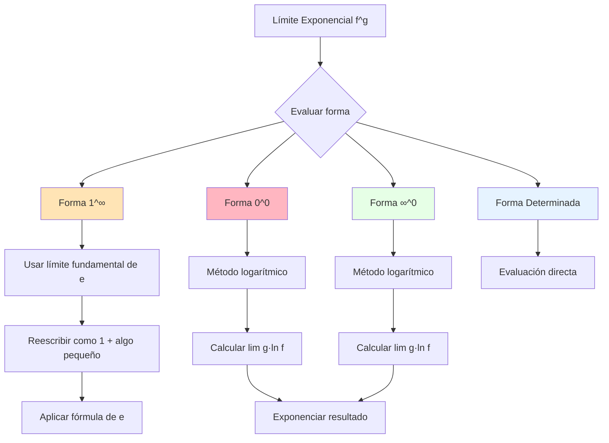
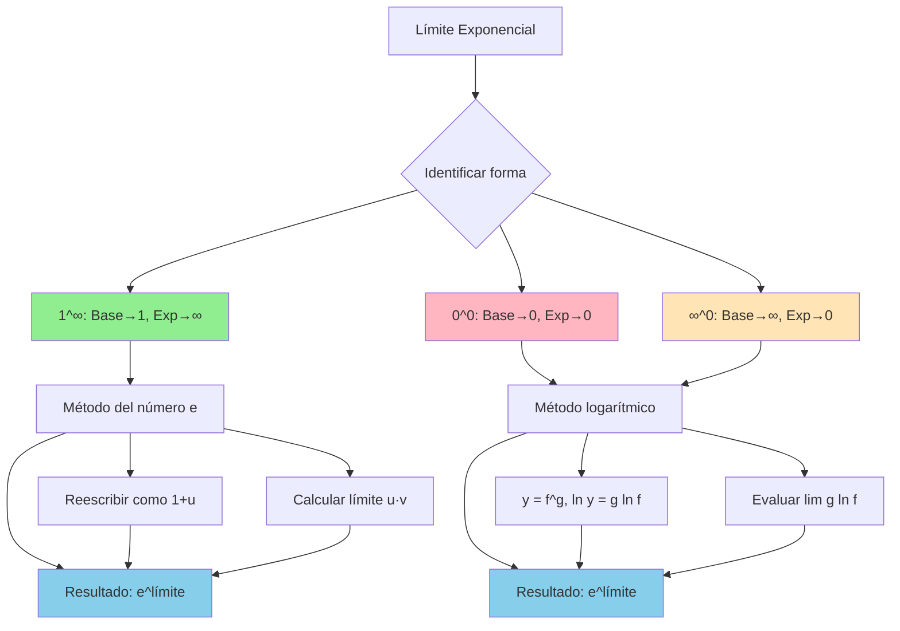

# Límites Exponenciales 📈

> [!tip] 💡 **Concepto Clave** Los **límites exponenciales** involucran funciones de la forma $f(x)^{g(x)}$ donde tanto la base como el exponente dependen de la variable. Son fundamentales para entender el crecimiento exponencial, el número $e$, y formas indeterminadas del tipo $1^\infty$, $0^0$, y $\infty^0$.

## El Límite Fundamental: Definición del Número e

> [!info] 📚 **El Límite más Importante**
> 
> ### Definición del Número e de Euler
> 
> $$e = \lim_{n \to \infty} \left(1 + \frac{1}{n}\right)^n = \lim_{x \to 0} (1 + x)^{\frac{1}{x}}$$
> 
> **Valor aproximado:** $e \approx 2.71828182845...$
> 
> ### Formas Equivalentes del Límite Fundamental:
> 
> |Forma|Expresión|Condición|
> |---|---|---|
> |**Forma básica**|$\lim_{x \to \infty} \left(1 + \frac{1}{x}\right)^x = e$|$x \to +\infty$|
> |**Forma generalizada**|$\lim_{x \to 0} (1 + x)^{\frac{1}{x}} = e$|$x \to 0$|
> |**Con función**|$\lim_{x \to a} \left(1 + \frac{f(x)}{g(x)}\right)^{h(x)} = e^{\lim_{x \to a} \frac{f(x) \cdot h(x)}{g(x)}}$|Cuando $\frac{f(x)}{g(x)} \to 0$ y $h(x) \to \infty$|

> [!warning] ⚠️ **Cuidado con las Formas** El límite fundamental solo se aplica cuando:
> 
> - La base tiende a $1$
> - El exponente tiende a $\infty$
> - Se cumple la forma $(1 + \text{algo pequeño})^{\text{algo grande}}$

## Formas Indeterminadas Exponenciales

> [!tip] 🤔 **Las Tres Formas Indeterminadas Principales**
> 
> ### Clasificación de Indeterminaciones:
> 
> |Forma|Ejemplo|Estrategia Principal|
> |---|---|---|
> |**$1^\infty$**|$\lim_{x \to \infty} \left(1 + \frac{2}{x}\right)^x$|Límite fundamental de $e$|
> |**$0^0$**|$\lim_{x \to 0^+} x^x$|Logaritmos: $\ln(f^g) = g \ln f$|
> |**$\infty^0$**|$\lim_{x \to \infty} x^{1/x}$|Logaritmos: $\ln(f^g) = g \ln f$|

## Método del Límite Fundamental de e

> [!tip] 🧮 **Estrategia para Formas $1^\infty$**
> 
> ### Proceso Sistemático:
> 
> **Paso 1:** Identificar que tenemos la forma $1^\infty$ **Paso 2:** Reescribir en la forma $(1 + u)^v$ donde $u \to 0$ y $v \to \infty$ **Paso 3:** Aplicar la transformación: $(1 + u)^v = \left[(1 + u)^{1/u}\right]^{uv}$ **Paso 4:** Usar que $\lim_{u \to 0} (1 + u)^{1/u} = e$ **Paso 5:** Evaluar $\lim uv$
> 
> ### Fórmula General:
> 
> $$\lim_{x \to a} \left(1 + f(x)\right)^{g(x)} = e^{\lim_{x \to a} f(x) \cdot g(x)}$$ **Condición:** $f(x) \to 0$ y $g(x) \to \infty$

> [!info] 📝 **Ejemplo 1: Límite Fundamental Clásico**
> 
> Calcular $\lim_{x \to \infty} \left(1 + \frac{3}{x}\right)^{2x}$
> 
> **Solución:**
> 
> 1. **Identificar:** Forma $1^\infty$ ya que $1 + \frac{3}{x} \to 1$ y $2x \to \infty$
> 2. **Reescribir:** $f(x) = \frac{3}{x} \to 0$ y $g(x) = 2x \to \infty$
> 3. **Aplicar fórmula:** $e^{\lim_{x \to \infty} \frac{3}{x} \cdot 2x} = e^{\lim_{x \to \infty} 6} = e^6$
> 4. **Resultado:** $\lim_{x \to \infty} \left(1 + \frac{3}{x}\right)^{2x} = e^6$

> [!info] 📝 **Ejemplo 2: Con Transformación Algebraica**
> 
> Calcular $\lim_{x \to \infty} \left(\frac{x+2}{x-1}\right)^x$
> 
> **Solución:**
> 
> 1. **Reescribir la base:** $\frac{x+2}{x-1} = \frac{x-1+3}{x-1} = 1 + \frac{3}{x-1}$
> 2. **Identificar:** $(1 + u)^v$ donde $u = \frac{3}{x-1} \to 0$ y $v = x \to \infty$
> 3. **Calcular $uv$:** $\frac{3}{x-1} \cdot x = \frac{3x}{x-1} = \frac{3}{1-\frac{1}{x}} \to 3$
> 4. **Resultado:** $\lim_{x \to \infty} \left(\frac{x+2}{x-1}\right)^x = e^3$

## Método Logarítmico para Formas $0^0$ y $\infty^0$

> [!tip] 🔍 **Técnica del Logaritmo Natural**
> 
> ### Proceso General:
> 
> Para evaluar $\lim_{x \to a} f(x)^{g(x)}$ cuando es $0^0$ o $\infty^0$:
> 
> **Paso 1:** Sea $y = f(x)^{g(x)}$, entonces $\ln y = g(x) \ln f(x)$ **Paso 2:** Evaluar $L = \lim_{x \to a} g(x) \ln f(x)$ **Paso 3:** Si el límite $L$ existe, entonces $\lim_{x \to a} f(x)^{g(x)} = e^L$
> 
> ### Transformaciones Útiles:
> 
> - $0^0$: Se convierte en $0 \cdot (-\infty)$ → Reescribir como $\frac{\ln f}{\frac{1}{g}}$ (forma $\frac{-\infty}{\infty}$)
> - $\infty^0$: Se convierte en $\infty \cdot 0$ → Reescribir como $\frac{\ln f}{\frac{1}{g}}$ (forma $\frac{\infty}{\infty}$)

> [!info] 📝 **Ejemplo 3: Forma $0^0$**
> 
> Calcular $\lim_{x \to 0^+} x^x$
> 
> **Solución:**
> 
> 1. **Identificar:** Forma $0^0$
> 2. **Aplicar logaritmo:** $\ln(x^x) = x \ln x$
> 3. **Evaluar:** $\lim_{x \to 0^+} x \ln x$ (forma $0 \cdot (-\infty)$)
> 4. **Reescribir:** $\lim_{x \to 0^+} \frac{\ln x}{\frac{1}{x}}$ (forma $\frac{-\infty}{\infty}$)
> 5. **L'Hôpital:** $\lim_{x \to 0^+} \frac{\frac{1}{x}}{-\frac{1}{x^2}} = \lim_{x \to 0^+} (-x) = 0$
> 6. **Resultado:** $\lim_{x \to 0^+} x^x = e^0 = 1$

> [!info] 📝 **Ejemplo 4: Forma $\infty^0$**
> 
> Calcular $\lim_{x \to \infty} x^{1/x}$
> 
> **Solución:**
> 
> 1. **Identificar:** Forma $\infty^0$
> 2. **Aplicar logaritmo:** $\ln(x^{1/x}) = \frac{\ln x}{x}$
> 3. **Evaluar:** $\lim_{x \to \infty} \frac{\ln x}{x}$ (forma $\frac{\infty}{\infty}$)
> 4. **L'Hôpital:** $\lim_{x \to \infty} \frac{\frac{1}{x}}{1} = \lim_{x \to \infty} \frac{1}{x} = 0$
> 5. **Resultado:** $\lim_{x \to \infty} x^{1/x} = e^0 = 1$

## Límites Exponenciales con Funciones Trigonométricas

> [!warning] 🌊 **Casos Especiales con Trigonométricas**
> 
> ### Límites Importantes con seno y coseno:
> 
> |Límite|Resultado|Método|
> |---|---|---|
> |$\lim_{x \to 0} \left(\cos x\right)^{1/x^2}$|$e^{-1/2}$|Expansión de Taylor + Límite fundamental|
> |$\lim_{x \to 0} \left(1 + \sin x\right)^{1/x}$|$e$|Sustitución directa|
> |$\lim_{x \to 0} \left(\frac{\sin x}{x}\right)^{1/x^2}$|$e^{-1/6}$|Taylor + Método logarítmico|

> [!info] 📝 **Ejemplo 5: Con Función Trigonométrica**
> 
> Calcular $\lim_{x \to 0} (1 + \tan x)^{1/x}$
> 
> **Solución:**
> 
> 1. **Identificar:** Forma $1^\infty$
> 2. **Usar expansión:** $\tan x \approx x + \frac{x^3}{3} + ...$ cerca de $x = 0$
> 3. **Para $x$ pequeño:** $\tan x \approx x$
> 4. **Aproximar:** $(1 + \tan x)^{1/x} \approx (1 + x)^{1/x}$
> 5. **Resultado:** $\lim_{x \to 0} (1 + \tan x)^{1/x} = e$

## Tabla de Límites Exponenciales Importantes

> [!tip] 📋 **Límites de Referencia**
> 
> ### Límites Fundamentales para Memorizar:
> 
> |Límite|Resultado|Observaciones|
> |---|---|---|
> |$\lim_{n \to \infty} \left(1 + \frac{1}{n}\right)^n$|$e$|Definición de $e$|
> |$\lim_{x \to 0} (1 + x)^{1/x}$|$e$|Forma continua|
> |$\lim_{x \to 0^+} x^x$|$1$|Caso $0^0$|
> |$\lim_{x \to \infty} x^{1/x}$|$1$|Caso $\infty^0$|
> |$\lim_{x \to 0} \left(1 + ax\right)^{b/x}$|$e^{ab}$|Generalización|
> |$\lim_{x \to \infty} \left(1 + \frac{a}{x}\right)^{bx}$|$e^{ab}$|Forma al infinito|

---

> [!quote] 📚 **Referencias**
> 
> - [[Límites al Infinito]] - Para comportamiento asintótico de exponenciales
> - [[Límites Infinitos]] - Casos donde exponenciales tienden a infinito
> - [[Regla de L'Hôpital]] - Herramienta para formas indeterminadas
> - [[Serie de Taylor]] - Para aproximaciones de funciones
> - [[Función Exponencial]] - Propiedades de $e^x$ y $a^x$

> [!info] 📖 **Notas Recomendadas para Complementar**
> 
> ### Prerrequisitos:
> 
> - [[Definición Formal del Límite Épsilon-Delta]] - Conceptos fundamentales
> - [[Propiedades de Logaritmos]] - Esencial para método logarítmico
> - [[Límites Fundamentales]] - Base para límites trigonométricos
> - [[Formas Indeterminadas]] - Clasificación general
> 
> ### Temas Relacionados:
> 
> - [[Crecimiento Exponencial]] - Aplicaciones en modelado
> - [[Interés Compuesto Continuo]] - Aplicación práctica del número $e$
> - [[Ecuaciones Diferenciales]] - Donde aparecen naturalmente
> - [[Análisis Asintótico]] - Comportamiento a largo plazo

> [!tip] 🧠 **Técnica de Estudio: "LOG-E" (Logaritmo-Exponencial)**
> 
> ### Mnemotecnia para Límites Exponenciales:
> 
> **L**ogaritmo para formas $0^0$ e $\infty^0$ **O**bserva la forma indeterminada **G**eneraliza usando el número $e$  
> **E**xponencia el resultado final
> 
> ### Método de Estudio "Escalera de Formas":
> 
> 1. **Nivel 1:** Dominar $\lim_{n \to \infty} (1 + 1/n)^n = e$
> 2. **Nivel 2:** Generalizar a $\lim (1 + f(x))^{g(x)} = e^{\lim f \cdot g}$
> 3. **Nivel 3:** Aplicar método logarítmico a $0^0$ e $\infty^0$
> 4. **Nivel 4:** Combinar con L'Hôpital para casos complejos
> 5. **Nivel 5:** Integrar con series de Taylor
> 
> ### Estrategia de Práctica:
> 
> - **Lunes:** 3 ejercicios forma $1^\infty$
> - **Miércoles:** 3 ejercicios forma $0^0$ e $\infty^0$
> - **Viernes:** 2 ejercicios mixtos con trigonométricas
> - **Domingo:** 1 problema aplicado (interés compuesto, crecimiento)

---

**Tags:** #limites #limites-exponenciales #numero-e #formas-indeterminadas #metodo-logaritmico #calculo #funciones-exponenciales #crecimiento-exponencial