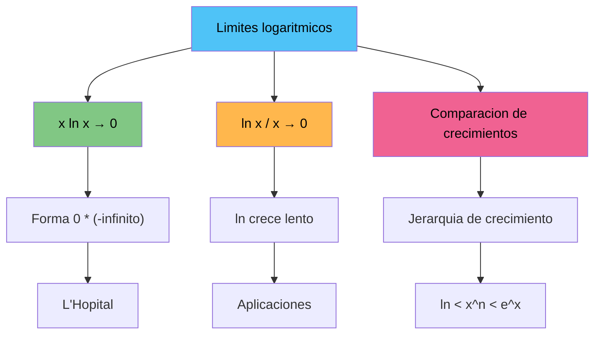

# Límites Logarítmicos 🔢

## Límites Fundamentales

> [!tip] 📚 Límite Principal 1
> 
> ### $\lim_{x \to 0^+} x \ln x = 0$
> 
> Este límite representa una forma indeterminada del tipo $0 \cdot (-\infty)$
> 
> **Demostración usando L'Hôpital:** $$\lim_{x \to 0^+} x \ln x = \lim_{x \to 0^+} \frac{\ln x}{1/x}$$
> 
> Forma $\frac{-\infty}{\infty}$, aplicamos L'Hôpital: $$= \lim_{x \to 0^+} \frac{1/x}{-1/x^2} = \lim_{x \to 0^+} (-x) = 0$$
> 
> **Interpretación geométrica:** 🎯 La función $f(x) = x \ln x$ se aproxima suavemente al origen por la derecha

> [!info] 📊 Límite Principal 2
> 
> ### $\lim_{x \to \infty} \frac{\ln x}{x} = 0$
> 
> Este límite demuestra que **el logaritmo crece más lento que cualquier función lineal**
> 
> **Demostración usando L'Hôpital:** $$\lim_{x \to \infty} \frac{\ln x}{x} = \lim_{x \to \infty} \frac{1/x}{1} = 0$$
> 
> |x|ln(x)|x|ln(x)/x|
> |---|---|---|---|
> |10|2.30|10|0.23|
> |100|4.61|100|0.046|
> |1000|6.91|1000|0.007|
> 
> **Conclusión:** El cociente tiende a 0 ⬇️

## Comparación de Crecimientos

> [!warning] ⚡ Jerarquía de Crecimiento
> 
> ### Orden de crecimiento (de menor a mayor):
> 
> ```mermaid
> graph LR
>    A[ln x] --> B[x^α, α > 0]
>    B --> C[e^x]
>    C --> D[x!]
>    
>    style A fill:#e1f5fe
>    style B fill:#f3e5f5
>    style C fill:#fff3e0
>    style D fill:#ffebee
> ```
> 
> 1. **Logarítmico**: $\ln x$ 🐌
> 2. **Polinomial**: $x^n$ (n > 0) 🚶
> 3. **Exponencial**: $e^x$ 🏃
> 4. **Factorial**: $x!$ 🚀
> 
> **Regla nemotécnica:** "**L**ento **P**aso **E**xplosivo **F**antástico"

> [!tip] 🔍 Propiedades Importantes
> 
> ### Límites relacionados:
> 
> - $\lim_{x \to \infty} \frac{\ln x}{x^n} = 0$ para cualquier $n > 0$
> - $\lim_{x \to \infty} \frac{x^n}{\ln x} = \infty$ para cualquier $n > 0$
> - $\lim_{x \to \infty} \frac{e^x}{x^n} = \infty$ para cualquier $n$
> 
> **Mnemotecnia:** 🧠 "**El logaritmo siempre pierde contra potencias, las potencias siempre pierden contra exponenciales**"

## Aplicaciones y Ejemplos

> [!info] 🎯 Ejemplos Prácticos
> 
> ### Ejemplo 1: $\lim_{x \to 0^+} x^2 \ln x$
> 
> $$\lim_{x \to 0^+} x^2 \ln x = \lim_{x \to 0^+} x \cdot (x \ln x) = 0 \cdot 0 = 0$$
> 
> ### Ejemplo 2: $\lim_{x \to \infty} \frac{\ln(x^2)}{x}$
> 
> $$\lim_{x \to \infty} \frac{\ln(x^2)}{x} = \lim_{x \to \infty} \frac{2\ln x}{x} = 2 \cdot 0 = 0$$
> 
> ### Ejemplo 3: Comparar $\ln x$ vs $\sqrt{x}$
> 
> $$\lim_{x \to \infty} \frac{\ln x}{\sqrt{x}} = \lim_{x \to \infty} \frac{\ln x}{x^{1/2}} = 0$$



## Técnica de Estudio: Método SHARP 🎯

> [!tip] 📖 Estrategia SHARP para Límites Logarítmicos
> 
> - **S**implifica: Identifica el tipo de indeterminación
> - **H**erramientas: Usa L'Hôpital o sustituciones
> - **A**naliza: Observa el comportamiento asintótico
> - **R**elaciona: Conecta con la jerarquía de crecimiento
> - **P**ractica: Resuelve variaciones del límite
> 
> **Regla mnemotécnica para recordar los resultados:** "**L**os **L**ogaritmos **L**legan **L**ento pero **L**legan" (5 L's = los 5 conceptos clave)

## Referencias 🔗

> [!quote] Enlaces a otras notas
> 
> - [[Regla de L'Hôpital]] - Herramienta principal para resolver estas indeterminaciones
> - [[Funciones Logarítmicas]] - Propiedades fundamentales del logaritmo
> - [[Límites al Infinito]] - Comportamiento asintótico general
> - [[Formas Indeterminadas]] - Clasificación completa de indeterminaciones
> - [[Crecimiento Asintótico]] - Comparación detallada de funciones

## Notas Recomendadas 📚

> [!info] 🎓 Prerrequisitos y Complementos
> 
> **Prerrequisitos necesarios:**
> 
> - [[Límites Básicos]] - Fundamentos de límites
> - [[Propiedades del Logaritmo]] - ln(ab) = ln(a) + ln(b), etc.
> - [[Derivadas Básicas]] - Para aplicar L'Hôpital
> 
> **Para profundizar:**
> 
> - [[Límites Exponenciales]] - Contrapartida de estos límites
> - [[Series de Taylor]] - Desarrollo alternativo para algunos límites
> - [[Análisis Asintótico]] - Estudio avanzado de comportamientos límite
> - [[Aplicaciones en Optimización]] - Uso práctico de estos conceptos

---

**Tags:** #límites #logaritmos #calculo #lhopital #crecimiento-asintotico #formas-indeterminadas #matematicas #analisis-matematico