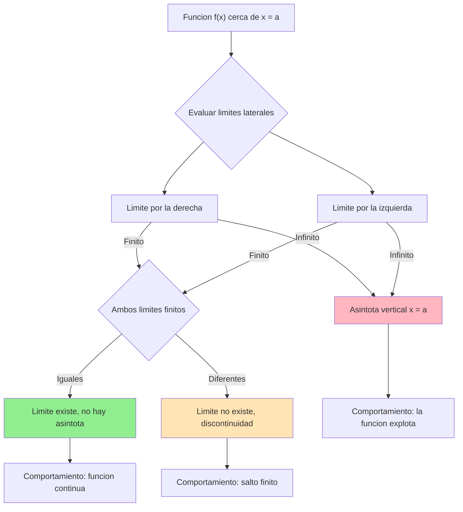
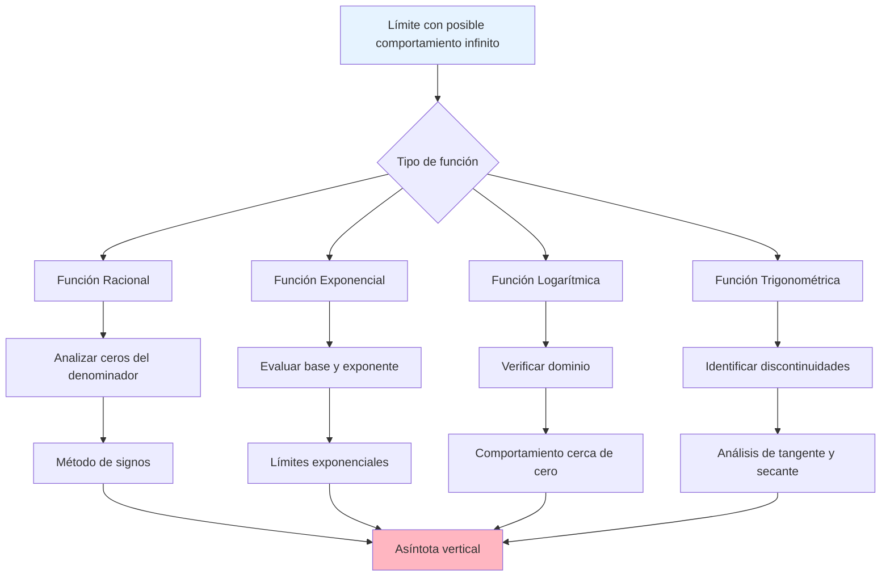

# Límites Infinitos ∞

> [!tip] 💡 **Concepto Clave** Los **límites infinitos** ocurren cuando una función crece o decrece sin límite cuando la variable independiente se aproxima a un valor específico. A diferencia de los límites al infinito, aquí **x se acerca a un punto finito**, pero **f(x) tiende a infinito**.

## Definición y Notación de Límites Infinitos

> [!info] 📚 **Definición Formal**
> 
> ### Límite Infinito Positivo
> 
> Decimos que $\lim_{x \to a} f(x) = +\infty$ si para todo número $M > 0$, existe $\delta > 0$ tal que: $$f(x) > M \text{ siempre que } 0 < |x - a| < \delta$$
> 
> ### Límite Infinito Negativo
> 
> Decimos que $\lim_{x \to a} f(x) = -\infty$ si para todo número $M > 0$, existe $\delta > 0$ tal que: $$f(x) < -M \text{ siempre que } 0 < |x - a| < \delta$$

> [!warning] ⚠️ **Importante: Los Límites Infinitos NO EXISTEN** Cuando escribimos $\lim_{x \to a} f(x) = \infty$, estamos describiendo un **comportamiento específico** de la función, pero técnicamente **el límite no existe** porque infinito no es un número real.
> 
> **Notación correcta:**
> 
> - ✅ $\lim_{x \to a} f(x) = +\infty$ (comportamiento específico)
> - ❌ "El límite existe y vale infinito" (incorrecto conceptualmente)

### Tabla de Comportamientos

|Tipo de Límite|Notación|Comportamiento de f(x)|Interpretación Gráfica|
|---|---|---|---|
|**Infinito positivo**|$\lim_{x \to a} f(x) = +\infty$|Crece sin límite|Asíntota vertical, función sube|
|**Infinito negativo**|$\lim_{x \to a} f(x) = -\infty$|Decrece sin límite|Asíntota vertical, función baja|
|**Límites laterales diferentes**|$\lim_{x \to a^+} f(x) = +\infty$, $\lim_{x \to a^-} f(x) = -\infty$|Comportamientos opuestos|Asíntota vertical con salto|

## Asíntotas Verticales

> [!tip] 📈 **Definición de Asíntota Vertical** La recta vertical $x = a$ es una **asíntota vertical** de la función $f(x)$ si al menos uno de los siguientes límites es infinito:
> 
> - $\lim_{x \to a^+} f(x) = \pm\infty$ (límite lateral derecho)
> - $\lim_{x \to a^-} f(x) = \pm\infty$ (límite lateral izquierdo)

> [!info] 🎯 **Tipos de Asíntotas Verticales**
> 
> ### Según el comportamiento lateral:
> 
> |Comportamiento|Límites Laterales|Ejemplo Visual|
> |---|---|---|
> |**Tipo I**|$\lim_{x \to a^-} f(x) = +\infty$ y $\lim_{x \to a^+} f(x) = +\infty$|Ambos lados suben|
> |**Tipo II**|$\lim_{x \to a^-} f(x) = -\infty$ y $\lim_{x \to a^+} f(x) = -\infty$|Ambos lados bajan|
> |**Tipo III**|$\lim_{x \to a^-} f(x) = +\infty$ y $\lim_{x \to a^+} f(x) = -\infty$|Un lado sube, otro baja|
> |**Tipo IV**|$\lim_{x \to a^-} f(x) = -\infty$ y $\lim_{x \to a^+} f(x) = +\infty$|Un lado baja, otro sube|

## Determinación de Límites Infinitos

> [!tip] 🧮 **Estrategias para Encontrar Límites Infinitos**
> 
> ### 1. Funciones Racionales $f(x) = \frac{P(x)}{Q(x)}$
> 
> **Regla fundamental:** Si $Q(a) = 0$ pero $P(a) \neq 0$, entonces existe asíntota vertical en $x = a$.
> 
> **Proceso de análisis:**
> 
> 1. **Factoriza** numerador y denominador
> 2. **Identifica** puntos donde el denominador se anula
> 3. **Evalúa** el signo del numerador en esos puntos
> 4. **Analiza** el comportamiento lateral del denominador

> [!warning] 🔍 **Método del Análisis de Signos**
> 
> ### Para $f(x) = \frac{P(x)}{Q(x)}$ cerca de $x = a$ donde $Q(a) = 0$:
> 
> **Paso 1:** Determina el signo de $P(a)$ **Paso 2:** Analiza el signo de $Q(x)$ en intervalos $(a-\delta, a)$ y $(a, a+\delta)$ **Paso 3:** Aplica la regla de signos para cocientes
> 
> |$P(a)$|$Q(x)$ cerca de $a^-$|$Q(x)$ cerca de $a^+$|Límite por izquierda|Límite por derecha|
> |---|---|---|---|---|
> |$+$|$+$|$+$|$+\infty$|$+\infty$|
> |$+$|$+$|$-$|$+\infty$|$-\infty$|
> |$+$|$-$|$+$|$-\infty$|$+\infty$|
> |$+$|$-$|$-$|$-\infty$|$-\infty$|
> |$-$|$+$|$+$|$-\infty$|$-\infty$|
> |$-$|$+$|$-$|$-\infty$|$+\infty$|
> |$-$|$-$|$+$|$+\infty$|$-\infty$|
> |$-$|$-$|$-$|$+\infty$|$+\infty$|

### Ejemplos Trabajados

> [!info] 📝 **Ejemplo 1: Función Racional Simple**
> 
> Encontrar $\lim_{x \to 2} \frac{x+1}{x-2}$
> 
> **Solución:**
> 
> 1. **Identificar:** $Q(2) = 2-2 = 0$, $P(2) = 2+1 = 3 > 0$
> 2. **Análizar signos de $Q(x) = x-2$:**
> 
> - Para $x < 2$: $x-2 < 0$ (negativo)
> - Para $x > 2$: $x-2 > 0$ (positivo)
> 
> 3. **Aplicar regla de signos:**
> 
> - $\lim_{x \to 2^-} \frac{x+1}{x-2} = \frac{(+)}{(-)} = -\infty$
> - $\lim_{x \to 2^+} \frac{x+1}{x-2} = \frac{(+)}{(+)} = +\infty$
> 
> 4. **Conclusión:** $x = 2$ es asíntota vertical tipo IV

> [!info] 📝 **Ejemplo 2: Con Factorización**
> 
> Encontrar $\lim_{x \to 3} \frac{x^2-9}{(x-3)^2}$
> 
> **Solución:**
> 
> 5. **Factorizar:** $\frac{x^2-9}{(x-3)^2} = \frac{(x-3)(x+3)}{(x-3)^2} = \frac{x+3}{x-3}$ (para $x \neq 3$)
> 6. **Evaluar:** $\lim_{x \to 3} \frac{x+3}{x-3}$
> 7. **Análizar:** $P(3) = 6 > 0$, $Q(x) = x-3$ cambia de signo en $x = 3$
> 8. **Resultado:**
> 
> - $\lim_{x \to 3^-} \frac{x+3}{x-3} = -\infty$
> - $\lim_{x \to 3^+} \frac{x+3}{x-3} = +\infty$

## Propiedades y Álgebra de Límites Infinitos

> [!tip] ⚖️ **Reglas Algebraicas**
> 
> ### Operaciones con Límites Infinitos
> 
> |Operación|Resultado|Condición|
> |---|---|---|
> |$\infty + \infty$|$\infty$|Mismo signo|
> |$\infty - \infty$|**Indeterminada**|Requiere análisis especial|
> |$\infty \cdot c$|$\infty$ si $c > 0$, $-\infty$ si $c < 0$|$c \neq 0$|
> |$\frac{\infty}{\infty}$|**Indeterminada**|Requiere L'Hôpital o factorización|
> |$\frac{c}{\infty}$|$0$|$c$ finito|
> |$\frac{c}{0}$|$\pm\infty$|Depende del signo de $c$ y aproximación a $0$|

> [!warning] 🚨 **Formas Indeterminadas Relacionadas**
> 
> ### Casos que requieren técnicas especiales:
> 
> - $\infty - \infty$: Factorización o racionalización
> - $\frac{\infty}{\infty}$: L'Hôpital o comparación de grados
> - $0 \cdot \infty$: Reescribir como cociente
> - $\frac{0}{0}$ que puede llevar a $\infty$: Factorización y simplificación

---

> [!quote] 📚 **Referencias**
> 
> - [[Límites al Infinito]] - Comportamiento cuando x tiende a infinito
> - [[Asíntotas]] - Estudio completo de comportamiento asintótico
> - [[Continuidad]] - Relación con discontinuidades infinitas
> - [[Límites Laterales]] - Herramienta fundamental para el análisis
> - [[Funciones Racionales]] - Casos más comunes de límites infinitos

> [!info] 📖 **Notas Recomendadas para Complementar**
> 
> ### Prerrequisitos:
> 
> - [[Definición de Límite]] - Conceptos fundamentales
> - [[Factorización de Polinomios]] - Técnica algebraica esencial
> - [[Análisis de Signos]] - Para determinar comportamiento
> - [[Límites Laterales]] - Base para límites infinitos
> 
> ### Temas Relacionados:
> 
> - [[Regla de L'Hôpital]] - Para formas indeterminadas
> - [[Discontinuidades]] - Clasificación completa
> - [[Gráficas de Funciones]] - Interpretación visual
> - [[Comportamiento Asintótico]] - Análisis avanzado

> [!tip] 🧠 **Técnica de Estudio: "FASE" (Factoriza-Analiza-Signos-Evalúa)**
> 
> ### Mnemotecnia para Límites Infinitos:
> 
> **F**actoriza numerador y denominador **A**naliza dónde se anula el denominador  
> **S**ignos: determina el signo en cada lado **E**valúa el comportamiento lateral
> 
> ### Método de Estudio Activo - "Tabla de Signos Sistemática":
> 
> 1. **Dibuja** una tabla con columnas: $x$, $P(x)$, $Q(x)$, $\frac{P(x)}{Q(x)}$
> 2. **Marca** valores críticos y puntos de prueba
> 3. **Practica** 5 ejemplos diarios variando complejidad
> 4. **Visualiza** cada función con software gráfico
> 5. **Conecta** con aplicaciones: crecimiento poblacional, circuitos RC, etc.
> 
> ### Tarjetas de Memorización:
> 
> - **Anverso:** Función con denominador que se anula
> - **Reverso:** Tabla de signos y límites laterales completos

---

**Tags:** #limites #limites-infinitos #asintotas-verticales #funciones-racionales #calculo #discontinuidades #comportamiento-asintotico #analisis-signos