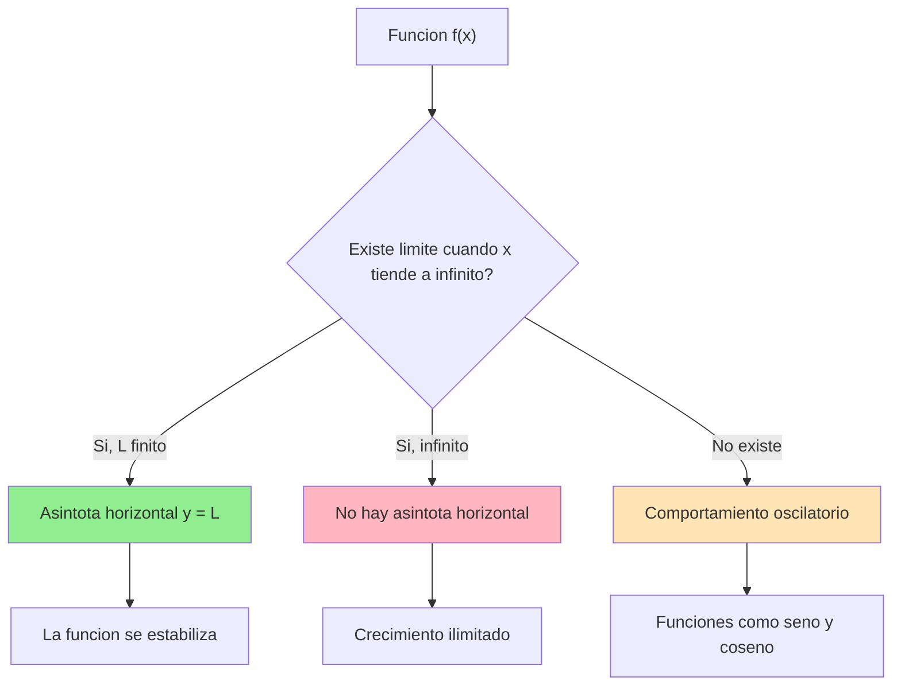
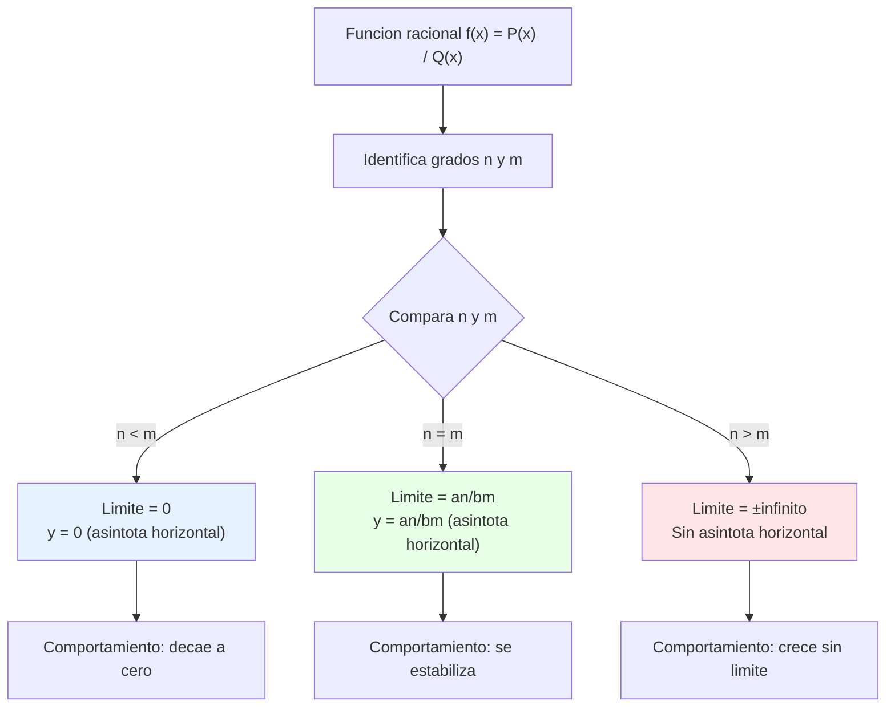

# Límites al Infinito 🚀

> [!tip] 💡 **Concepto Clave** Los límites al infinito nos permiten estudiar el **comportamiento de funciones cuando la variable independiente crece o decrece sin límite**. Son fundamentales para entender el comportamiento asintótico y las tendencias a largo plazo de las funciones.

## $\lim_{x \to \infty} f(x)$ - Definición y Notación

> [!info] 📚 **Definición Formal** Decimos que $\lim_{x \to \infty} f(x) = L$ si para todo $\varepsilon > 0$, existe un número $M > 0$ tal que:
> 
> $$|f(x) - L| < \varepsilon \text{ siempre que } x > M$$
> 
> **Tipos de límites al infinito:**
> 
> - $\lim_{x \to +\infty} f(x) = L$ (límite cuando x tiende a $+\infty$)
> - $\lim_{x \to -\infty} f(x) = L$ (límite cuando x tiende a $-\infty$)
> - $\lim_{x \to \infty} f(x) = \infty$ (límite infinito)

> [!warning] ⚠️ **Cuidado con la Notación**
> 
> - $x \to \infty$ significa que x crece sin límite
> - $x \to -\infty$ significa que x decrece sin límite
> - El símbolo $\infty$ **no es un número**, es una notación para expresar comportamiento

### Casos Especiales

|Caso|Notación|Significado|
|---|---|---|
|**Límite finito**|$\lim_{x \to \infty} f(x) = L$|La función se aproxima a un valor L|
|**Límite infinito positivo**|$\lim_{x \to \infty} f(x) = +\infty$|La función crece sin límite|
|**Límite infinito negativo**|$\lim_{x \to \infty} f(x) = -\infty$|La función decrece sin límite|
|**No existe**|$\lim_{x \to \infty} f(x) = \nexists$|La función oscila o no tiene comportamiento definido|

## Comportamiento Asintótico Horizontal

> [!tip] 📈 **Asíntotas Horizontales** Una **asíntota horizontal** es una recta horizontal $y = L$ tal que la gráfica de la función se aproxima a esta recta cuando $x \to \pm\infty$.
> 
> **Condición:** $y = L$ es asíntota horizontal si:
> 
> - $\lim_{x \to +\infty} f(x) = L$ y/o
> - $\lim_{x \to -\infty} f(x) = L$

> [!info] 🎯 **Interpretación Geométrica**
> 
> ### Características del Comportamiento Asintótico:
> 
> - **Aproximación gradual**: La función se acerca cada vez más a la asíntota
> - **Nunca se toca**: La función puede acercarse indefinidamente sin tocar la asíntota
> - **Estabilidad**: Para valores grandes de x, f(x) ≈ L
> 
> ### Ejemplos Visuales:
> 
> - $f(x) = \frac{1}{x}$ tiene asíntota horizontal $y = 0$
> - $f(x) = e^{-x}$ tiene asíntota horizontal $y = 0$ cuando $x \to +\infty$
> - $f(x) = \arctan(x)$ tiene asíntotas horizontales $y = \pm\frac{\pi}{2}$

## Límites de Funciones Racionales

> [!tip] 🧮 **Regla Fundamental para Funciones Racionales** Para una función racional $f(x) = \frac{P(x)}{Q(x)}$ donde $P(x)$ y $Q(x)$ son polinomios:
> 
> $$f(x) = \frac{a_n x^n + a_{n-1}x^{n-1} + \cdots + a_0}{b_m x^m + b_{m-1}x^{m-1} + \cdots + b_0}$$
> 
> El límite cuando $x \to \infty$ depende de los **grados** de los polinomios:

### Tabla de Casos para Funciones Racionales

|Relación de Grados|Resultado del Límite|Ejemplo|
|---|---|---|
|$n < m$ (grado numerador < denominador)|$\lim_{x \to \infty} f(x) = 0$|$\frac{x^2}{x^3 + 1} \to 0$|
|$n = m$ (grados iguales)|$\lim_{x \to \infty} f(x) = \frac{a_n}{b_m}$|$\frac{3x^2 + 1}{2x^2 - 5} \to \frac{3}{2}$|
|$n > m$ (grado numerador > denominador)|$\lim_{x \to \infty} f(x) = \pm\infty$|$\frac{x^3 + 2}{x^2 - 1} \to \infty$|

> [!warning] 🔍 **Método de Resolución**
> 
> ### Estrategia "Dividir por la Mayor Potencia":
> 
> 1. **Identifica** la mayor potencia de x en denominador
> 2. **Divide** numerador y denominador por esa potencia
> 3. **Evalúa** el límite usando que $\lim_{x \to \infty} \frac{1}{x^k} = 0$ para $k > 0$
> 
> **Ejemplo:** $$\lim_{x \to \infty} \frac{3x^2 - 5x + 2}{2x^2 + x - 1}$$
> 
> Dividimos por $x^2$: $$\lim_{x \to \infty} \frac{3 - \frac{5}{x} + \frac{2}{x^2}}{2 + \frac{1}{x} - \frac{1}{x^2}} = \frac{3 - 0 + 0}{2 + 0 - 0} = \frac{3}{2}$$

### Casos Especiales y Formas Indeterminadas

> [!info] 🤔 **Formas Indeterminadas Comunes**
> 
> |Forma|Ejemplo|Estrategia de Resolución|
> |---|---|---|
> |$\frac{\infty}{\infty}$|$\lim_{x \to \infty} \frac{x^2}{x^2 + 1}$|Dividir por mayor potencia|
> |$\infty - \infty$|$\lim_{x \to \infty} (x^2 - x^2)$|Factorizar o racionalizar|
> |$1^\infty$|$\lim_{x \to \infty} \left(1 + \frac{1}{x}\right)^x$|Usar límites exponenciales|

---

> [!quote] 📚 **Referencias**
> 
> - [[Definición Formal del Límite Épsilon-Delta]] - Fundamentos teóricos
> - [[Límites Laterales]] - Para casos puntuales
> - [[Asíntotas]] - Comportamiento gráfico completo
> - [[Continuidad]] - Relación con límites
> - [[Derivadas y Definición Formal]] - Aplicación en tasas de cambio

> [!info] 📖 **Notas Recomendadas para Complementar**
> 
> ### Prerrequisitos:
> 
> - [[Funciones Polinómicas]] - Base algebraica necesaria
> - [[Álgebra de Límites]] - Propiedades operacionales
> - [[Función Racional]] - Características específicas
> 
> ### Temas Relacionados:
> 
> - [[Límites Indeterminados]] - Casos complejos
> - [[Regla de L'Hôpital]] - Herramienta avanzada
> - [[Series Infinitas]] - Comportamiento asintótico avanzado

> [!tip] 🧠 **Técnica de Estudio: Mnemotecnia "GMD"**
> 
> ### Para recordar el comportamiento de funciones racionales:
> 
> **G**rado **M**ayor **D**etermina:
> 
> - **G**rado mayor arriba (numerador) → Límite **∞**
> - **G**rado mayor abajo (denominador) → Límite **0**
> - **G**rados iguales → Límite = **coeficientes principales**
> 
> ### Método de Estudio Activo:
> 
> 1. **Practica** con 3 ejemplos diarios de cada tipo
> 2. **Dibuja** las gráficas para visualizar comportamiento
> 3. **Verifica** siempre dividiendo por la mayor potencia
> 4. **Conecta** con aplicaciones físicas (velocidad límite, concentraciones)

---

**Tags:** #limites #infinito #asíntotas #funciones-racionales #calculo #matematicas #comportamiento-asintótico