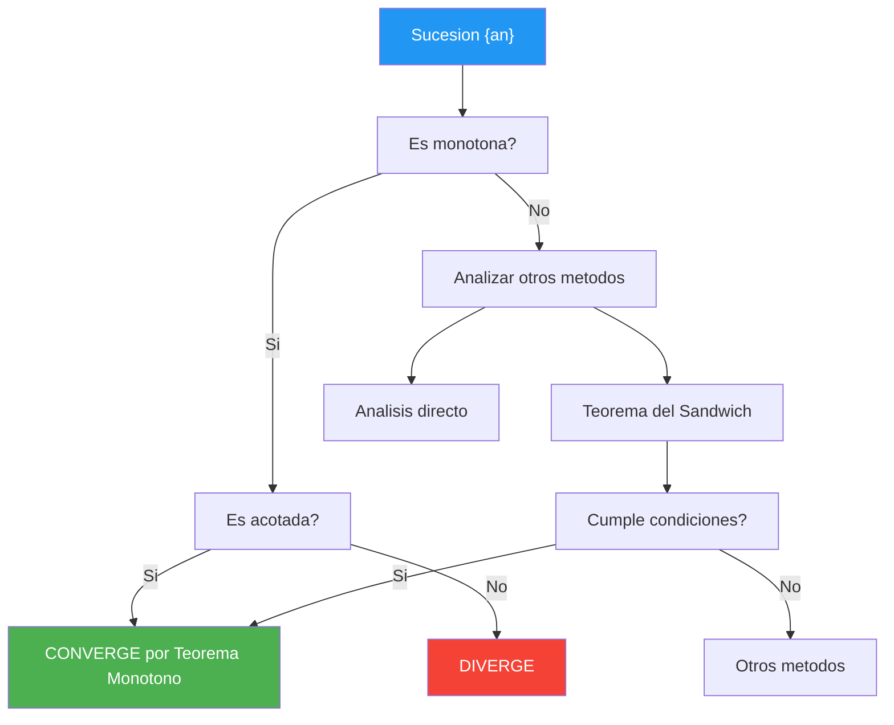

# Límites de Sucesiones 📊

## Definición Fundamental

> [!tip] 🎯 Concepto de Convergencia
> 
> ### Definición formal de límite de sucesión
> 
> Una sucesión $(a_n)$ **converge** al límite $L$ si: $$\forall \varepsilon > 0, \exists N \in \mathbb{N} : n > N \Rightarrow |a_n - L| < \varepsilon$$
> 
> **Notación:** $\lim_{n \to \infty} a_n = L$ o $a_n \to L$
> 
> **Interpretación geométrica:** 🎪 A partir de cierto término $N$, todos los términos de la sucesión están dentro de una "banda" de anchura $2\varepsilon$ alrededor de $L$
> 
> ```mermaid
> graph LR
>    A[a₁] --> B[a₂] --> C[a₃] --> D[...] --> E[aₙ] --> F[L]
>    
>    style F fill:#4caf50,color:#fff
>    style E fill:#81c784,color:#000
>    style A fill:#ffcdd2,color:#000
> ```

## Convergencia de Sucesiones

> [!info] 📈 Tipos de Comportamiento
> 
> ### Clasificación de sucesiones
> 
> |Tipo|Definición|Ejemplo|Comportamiento|
> |---|---|---|---|
> |**Convergente**|$\lim_{n \to \infty} a_n = L \in \mathbb{R}$|$\frac{1}{n} \to 0$|Se acerca a un valor finito 🎯|
> |**Divergente a ∞**|$\lim_{n \to \infty} a_n = +\infty$|$n^2 \to +\infty$|Crece sin límite ⬆️|
> |**Divergente a -∞**|$\lim_{n \to \infty} a_n = -\infty$|$-n \to -\infty$|Decrece sin límite ⬇️|
> |**Oscilante**|No tiene límite|$(-1)^n$|Alterna entre valores 〰️|
> 
> **Mnemotecnia:** "**C**onverge **C**erca, **D**iverge **D**istante, **O**scila **O**nda"

> [!tip] 🧮 Propiedades de Límites
> 
> ### Álgebra de límites
> 
> Si $\lim_{n \to \infty} a_n = A$ y $\lim_{n \to \infty} b_n = B$, entonces:
> 
> - **Suma:** $\lim_{n \to \infty} (a_n + b_n) = A + B$
> - **Producto:** $\lim_{n \to \infty} (a_n \cdot b_n) = A \cdot B$
> - **Cociente:** $\lim_{n \to \infty} \frac{a_n}{b_n} = \frac{A}{B}$ (si $B \neq 0$)
> - **Potencia:** $\lim_{n \to \infty} a_n^k = A^k$
> 
> **⚠️ Formas indeterminadas:** $\frac{0}{0}$, $\frac{\infty}{\infty}$, $0 \cdot \infty$, $\infty - \infty$

## Teorema del Sandwich 🥪

> [!warning] 🔒 Teorema de Compresión (Sandwich)
> 
> ### Enunciado del teorema
> 
> Si $(a_n)$, $(b_n)$ y $(c_n)$ son sucesiones tales que:
> 
> 1. $a_n \leq b_n \leq c_n$ para todo $n$ suficientemente grande
> 2. $\lim_{n \to \infty} a_n = \lim_{n \to \infty} c_n = L$
> 
> **Entonces:** $\lim_{n \to \infty} b_n = L$
> 
> ```mermaid
> graph TD
>    A[Sucesión aₙ] --> D[Límite L]
>    B[Sucesión bₙ] --> D
>    C[Sucesión cₙ] --> D
>    
>    A -.->|"≤"| B
>    B -.->|"≤"| C
>    
>    style D fill:#4caf50,color:#fff
>    style B fill:#ffeb3b,color:#000
>    style A fill:#2196f3,color:#fff
>    style C fill:#f44336,color:#fff
> ```
> 
> **Visualización:** La sucesión $b_n$ está "atrapada" entre dos sucesiones que convergen al mismo límite 🎯

> [!info] 🎲 Ejemplos del Teorema del Sandwich
> 
> ### Ejemplo 1: $\lim_{n \to \infty} \frac{\sin n}{n}$
> 
> Como $-1 \leq \sin n \leq 1$, entonces: $$-\frac{1}{n} \leq \frac{\sin n}{n} \leq \frac{1}{n}$$
> 
> Dado que $\lim_{n \to \infty} \left(-\frac{1}{n}\right) = \lim_{n \to \infty} \frac{1}{n} = 0$
> 
> **Por el teorema del sandwich:** $\lim_{n \to \infty} \frac{\sin n}{n} = 0$ ✅
> 
> ### Ejemplo 2: $\lim_{n \to \infty} \frac{1}{n} \cos(n^2)$
> 
> Como $-1 \leq \cos(n^2) \leq 1$: $$-\frac{1}{n} \leq \frac{\cos(n^2)}{n} \leq \frac{1}{n}$$
> 
> **Resultado:** $\lim_{n \to \infty} \frac{\cos(n^2)}{n} = 0$ ✅

## Sucesiones Monótonas Acotadas 📈

> [!tip] 🎢 Teorema de Convergencia Monótona
> 
> ### Teorema fundamental
> 
> **Toda sucesión monótona y acotada es convergente**
> 
> **Casos específicos:**
> 
> - **Creciente y acotada superiormente** → converge al **supremo**
> - **Decreciente y acotada inferiormente** → converge al **ínfimo**
> 
> |Tipo|Definición|Convergencia|Ejemplo|
> |---|---|---|---|
> |**Monótona creciente**|$a_n \leq a_{n+1}$|Converge si acotada superiormente 📈|$a_n = 1 - \frac{1}{n}$|
> |**Monótona decreciente**|$a_n \geq a_{n+1}$|Converge si acotada inferiormente 📉|$a_n = \frac{1}{n}$|
> |**Estrictamente creciente**|$a_n < a_{n+1}$|Mismas condiciones ⬆️|$a_n = n$ (no acotada)|
> |**Estrictamente decreciente**|$a_n > a_{n+1}$|Mismas condiciones ⬇️|$a_n = -n$ (no acotada)|

> [!warning] 🔍 Criterios de Monotonía
> 
> ### Métodos para determinar monotonía
> 
> **1. Diferencia de términos consecutivos:**
> 
> - Si $a_{n+1} - a_n \geq 0$ → creciente
> - Si $a_{n+1} - a_n \leq 0$ → decreciente
> 
> **2. Cociente de términos consecutivos:**
> 
> - Si $\frac{a_{n+1}}{a_n} \geq 1$ (y $a_n > 0$) → creciente
> - Si $\frac{a_{n+1}}{a_n} \leq 1$ (y $a_n > 0$) → decreciente
> 
> **3. Función asociada:**
> 
> - Si $f(x) = a_x$ y $f'(x) \geq 0$ → creciente
> - Si $f(x) = a_x$ y $f'(x) \leq 0$ → decreciente

> [!info] 🎯 Ejemplos Clásicos
> 
> ### Ejemplo 1: Sucesión $a_n = \frac{2n + 1}{n + 3}$
> 
> **Análisis de monotonía:** $$a_{n+1} - a_n = \frac{2(n+1) + 1}{(n+1) + 3} - \frac{2n + 1}{n + 3}$$ $$= \frac{(2n + 3)(n + 3) - (2n + 1)(n + 4)}{(n + 4)(n + 3)} = \frac{5}{(n + 4)(n + 3)} > 0$$
> 
> **Conclusión:** Estrictamente creciente ⬆️
> 
> **Acotación:** $a_n = 2 - \frac{5}{n + 3} < 2$
> 
> **Resultado:** Converge a $\lim_{n \to \infty} a_n = 2$ ✅
> 
> ### Ejemplo 2: Sucesión de Fibonacci normalizada
> 
> $$a_n = \frac{F_{n+1}}{F_n}$$ donde $F_n$ es la n-ésima término de Fibonacci
> 
> **Resultado:** Converge al **número áureo** $\phi = \frac{1 + \sqrt{5}}{2} \approx 1.618$ 🌟



## Técnica de Estudio: Método CLIMB 🧗

> [!tip] 📚 Estrategia CLIMB para Sucesiones
> 
> - **C**onvergencia: Determina si la sucesión converge
> - **L**ímite: Calcula el valor límite si existe
> - **I**dentifica: El tipo de sucesión (monótona, oscilante, etc.)
> - **M**étodo: Elige la herramienta apropiada (sandwich, monotonía, etc.)
> - **B**ound: Verifica las cotas si es necesario
> 
> **Regla mnemotécnica para recordar criterios:** "**M**onótona **A**cotada **S**iempre **C**onverge" (MASC)

## Referencias 🔗

> [!quote] Enlaces a otras notas
> 
> - [[Límites de Funciones]] - Relación entre límites funcionales y sucesiones
> - [[Series Numéricas]] - Aplicación de sucesiones en series
> - [[Continuidad]] - Caracterización secuencial de continuidad
> - [[Topología de los Reales]] - Conceptos de supremo e ínfimo
> - [[Criterios de Convergencia]] - Herramientas avanzadas para series

## Notas Recomendadas 📚

> [!info] 🎓 Prerrequisitos y Complementos
> 
> **Prerrequisitos necesarios:**
> 
> - [[Números Reales]] - Propiedades de completitud
> - [[Desigualdades]] - Manipulación de inecuaciones
> - [[Límites Básicos]] - Conceptos fundamentales
> - [[Funciones Elementales]] - Para sucesiones definidas por funciones
> 
> **Para profundizar:**
> 
> - [[Sucesiones de Cauchy]] - Caracterización alternativa de convergencia
> - [[Límites Superior e Inferior]] - Conceptos avanzados
> - [[Compacidad]] - Teorema de Bolzano-Weierstrass
> - [[Espacios Métricos]] - Generalización de conceptos
> - [[Análisis Real Avanzado]] - Teoría completa de sucesiones

---

**Tags:** #sucesiones #limites #convergencia #teorema-sandwich #monotonia #analisis-real #calculo #matematicas #acotacion #supremo-infimo