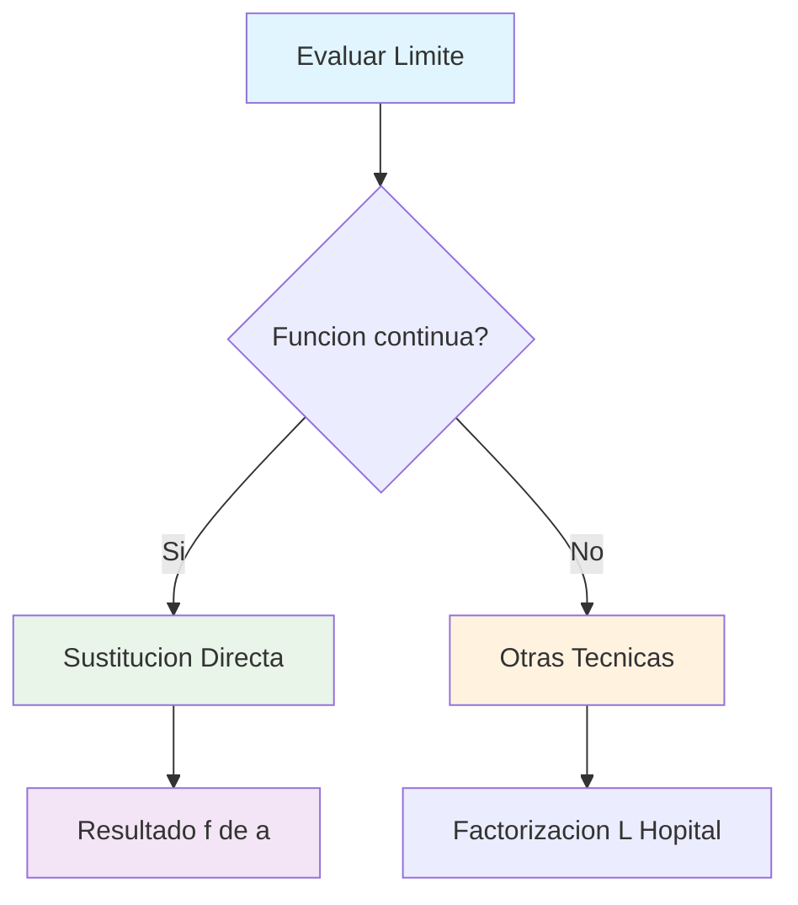
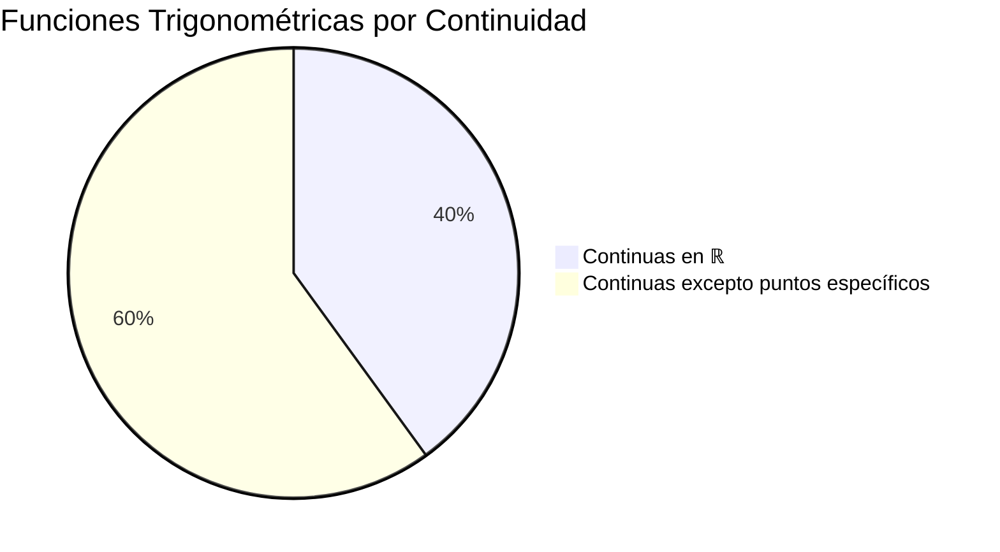
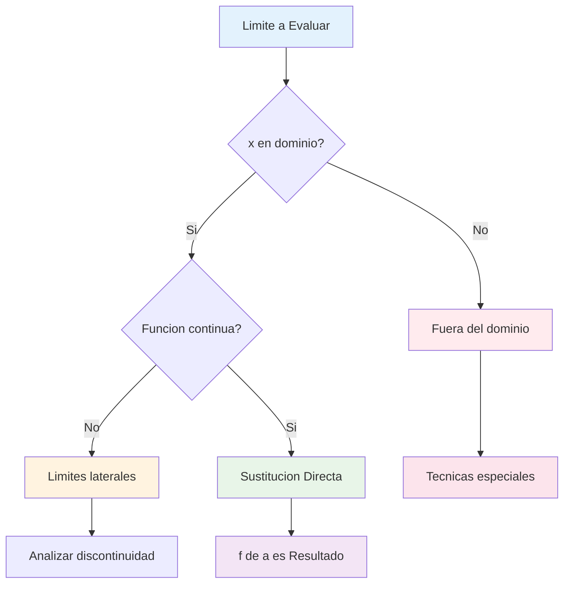

# 📈 Límites Básicos y Directos

## 🎯 Límites por Sustitución Directa

> [!info] 💡 Definición Fundamental Los **límites por sustitución directa** se pueden calcular cuando la función es **continua** en el punto de aproximación. En estos casos: $$\lim_{x \to a} f(x) = f(a)$$
> 
> Simplemente **sustituimos** el valor de $a$ directamente en la función.

### 📊 Funciones Continuas

> [!success] ✅ Características de Continuidad Una función $f(x)$ es **continua** en $x = a$ si:
> 
> 1. $f(a)$ está definida
> 2. $\lim_{x \to a} f(x)$ existe
> 3. $\lim_{x \to a} f(x) = f(a)$
> 
> **Condición clave:** Si la función es continua → Aplicamos sustitución directa

### 🔢 Polinomios y Funciones Racionales

> [!example] 📝 Polinomios Los **polinomios** son continuos en todos los números reales: $$P(x) = a_nx^n + a_{n-1}x^{n-1} + ... + a_1x + a_0$$
> 
> **Ejemplo:** $$\lim_{x \to 2} (3x^3 - 2x^2 + x - 5)$$
> 
> **Solución:** $P(2) = 3(8) - 2(4) + 2 - 5 = 24 - 8 + 2 - 5 = 13$

> [!example] 🔄 Funciones Racionales Para funciones racionales $f(x) = \frac{P(x)}{Q(x)}$:
> 
> - **Continuas** cuando $Q(a) ≠ 0$
> - **Discontinuas** cuando $Q(a) = 0$
> 
> **Ejemplo:** $$\lim_{x \to 3} \frac{x^2 + 2x - 1}{x - 1}$$
> 
> **Verificación:** $Q(3) = 3 - 1 = 2 ≠ 0$ ✅ **Solución:** $\frac{9 + 6 - 1}{2} = \frac{14}{2} = 7$

|Tipo de Función|Dominio de Continuidad|Ejemplo|Límite en x = 1|
|---|---|---|---|
|Polinomial|$\mathbb{R}$ (todos los reales)|$x^2 + 3x - 2$|$1 + 3 - 2 = 2$|
|Racional|$\mathbb{R}$ excepto donde denominador = 0|$\frac{x+2}{x-3}$|$\frac{3}{-2} = -\frac{3}{2}$|

### 📐 Funciones Trigonométricas

> [!tip] 🌊 Continuidad Trigonométrica Las funciones trigonométricas básicas tienen dominios específicos de continuidad:

|Función|Dominio de Continuidad|Puntos de Discontinuidad|
|---|---|---|
|$\sin(x)$|$\mathbb{R}$|Ninguno|
|$\cos(x)$|$\mathbb{R}$|Ninguno|
|$\tan(x)$|$\mathbb{R} - {\frac{\pi}{2} + n\pi}$|$x = \frac{\pi}{2} + n\pi$|
|$\cot(x)$|$\mathbb{R} - {n\pi}$|$x = n\pi$|

> [!example] 📊 Ejemplos Trigonométricos **Ejemplo 1:** $\lim_{x \to \pi/6} \sin(x) = \sin(\pi/6) = \frac{1}{2}$
> 
> **Ejemplo 2:** $\lim_{x \to \pi/4} \cos(x) = \cos(\pi/4) = \frac{\sqrt{2}}{2}$
> 
> **Ejemplo 3:** $\lim_{x \to \pi/3} \tan(x) = \tan(\pi/3) = \sqrt{3}$

### 📈 Funciones Exponenciales y Logarítmicas

> [!success] 🚀 Exponenciales Las funciones exponenciales $f(x) = a^x$ donde $a > 0, a ≠ 1$:
> 
> - **Continuas** en todos los números reales
> - **Dominio:** $\mathbb{R}$
> - **Rango:** $(0, +∞)$

> [!success] 📊 Logarítmicas  
> Las funciones logarítmicas $f(x) = \log_a(x)$ donde $a > 0, a ≠ 1$:
> 
> - **Continuas** para $x > 0$
> - **Dominio:** $(0, +∞)$
> - **Rango:** $\mathbb{R}$

|Función|Ejemplo de Límite|Sustitución|Resultado|
|---|---|---|---|
|Exponencial|$\lim_{x \to 2} e^x$|$e^2$|$≈ 7.39$|
|Exponencial|$\lim_{x \to 0} 2^x$|$2^0$|$1$|
|Logarítmica|$\lim_{x \to 1} \ln(x)$|$\ln(1)$|$0$|
|Logarítmica|$\lim_{x \to e} \ln(x)$|$\ln(e)$|$1$|

> [!warning] ⚠️ Casos Problemáticos **NO usar sustitución directa cuando:**
> 
> - La función no está definida en el punto
> - Resulta en formas indeterminadas: $\frac{0}{0}$, $\frac{∞}{∞}$, $0 \cdot ∞$
> - Hay discontinuidades en el punto de evaluación
> 
> **En estos casos:** Usar factorización, racionalización, L'Hôpital, etc.

## 🧠 Técnica de Estudio: Mnemotecnia "CESD"

> [!tip] 🎓 Método "CESD" para Límites Directos
> 
> **C** - **C**ontinuidad verificada **E** - **E**valuación posible  
> **S** - **S**ustitución directa **D** - **D**irecto al resultado
> 
> **Frase nemotécnica:** _"Cuando Es Seguro, Directamente"_
> 
> **Proceso:**
> 
> 1. ✅ Verificar continuidad en el punto
> 2. 🎯 Sustituir el valor directamente
> 3. 📊 Obtener el resultado

## 📊 Algoritmo de Decisión

## 📚 Referencias y Conexiones

> [!quote] 🔗 Enlaces a Otras Notas
> 
> - [[Continuidad de Funciones]] - Fundamento teórico para sustitución directa
> - [[Límites Indeterminados]] - Casos donde NO aplicar sustitución
> - [[Dominio y Rango]] - Verificación previa a la evaluación
> - [[Funciones Elementales]] - Catálogo de funciones continuas
> - [[Gráficas de Funciones]] - Interpretación visual de continuidad

## 📖 Notas Recomendadas para Estudio Complementario

> [!info] 📝 Ruta de Aprendizaje Sugerida
> 
> **Prerrequisitos:**
> 
> 1. **[[Definición de Función]]** - Conceptos básicos
> 2. **[[Definición Informal de Límite]]** - Intuición geométrica
> 
> **Temas Paralelos:** 3. **[[Álgebra de Límites]]** - Operaciones con límites 4. **[[Límites en Gráficas]]** - Visualización de límites
> 
> **Siguientes Pasos:** 5. **[[Límites Laterales]]** - Extensión del concepto 6. **[[Formas Indeterminadas]]** - Casos complejos

## 🎯 Ejercicios de Práctica Progresiva

> [!example] 💪 Secuencia de Entrenamiento
> 
> **Nivel 1 - Funciones Básicas:** 🟢
> 
> - $\lim_{x \to 2} (x^2 + 3x - 1)$
> - $\lim_{x \to -1} (2x^3 - x + 4)$
> 
> **Nivel 2 - Funciones Racionales:** 🟡
> 
> - $\lim_{x \to 3} \frac{x^2 - 1}{x + 2}$
> - $\lim_{x \to 0} \frac{2x + 1}{x^2 + 4}$
> 
> **Nivel 3 - Trigonométricas:** 🟠
> 
> - $\lim_{x \to \pi/2} \cos(x)$
> - $\lim_{x \to \pi/6} (2\sin(x) + 1)$
> 
> **Nivel 4 - Exponenciales:** 🔴
> 
> - $\lim_{x \to 1} e^{2x-1}$
> - $\lim_{x \to 2} \ln(x^2 - 3)$

---

**Tags:** #matemáticas #cálculo #límites #continuidad #sustitución-directa #funciones-continuas #polinomios #trigonométricas #exponenciales #logarítmicas #técnicas-estudio #university #calculus-fundamentals