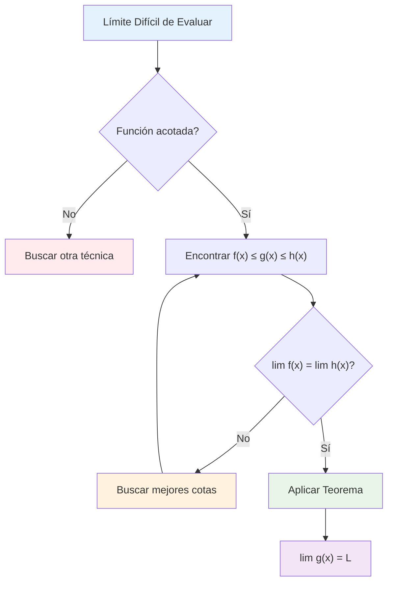

# 🥪 Teorema del Emparedado (Sándwich/Squeeze)

## 🎯 Definición del Teorema del Emparedado

> [!info]- 💡 Definición Fundamental El **Teorema del Emparedado** (también conocido como **Teorema del Sandwich** o **Squeeze Theorem**) establece que:
> 
> Si tenemos tres funciones $f(x)$, $g(x)$ y $h(x)$ tales que:
> 
> 1. $f(x) \leq g(x) \leq h(x)$ para todos los $x$ en un intervalo que contiene $a$ (excepto posiblemente en $a$)
> 2. $\lim_{x \to a} f(x) = \lim_{x \to a} h(x) = L$
> 
> Entonces: $$\lim_{x \to a} g(x) = L$$
> 
> **Intuición:** Si una función está "emparedada" entre otras dos que tienden al mismo límite, entonces ella también debe tender a ese límite.

### 📊 Visualización Geométrica

> [!success]- ✅ Interpretación Gráfica
> 
> ```mermaid
> graph TD
>     A[Función Superior h(x)] --> B[Función Emparedada g(x)]
>     B --> C[Función Inferior f(x)]
>     D[Límite Común L] --> E[Todas convergen a L]
>     
>     style A fill:#ffcdd2
>     style B fill:#e8f5e8
>     style C fill:#bbdefb
>     style D fill:#f3e5f5
>     style E fill:#fff3e0
> ```
> 
> **Características visuales:**
> 
> - $h(x)$ es la función "techo" (superior)
> - $g(x)$ está atrapada en el medio
> - $f(x)$ es la función "piso" (inferior)
> - Todas convergen al mismo punto $L$ cuando $x \to a$

### 🔢 Condiciones de Aplicación

> [!example]- 🎨 Condiciones Necesarias Para aplicar el teorema necesitamos verificar:
> 
> **Condición 1: Desigualdad** $$f(x) \leq g(x) \leq h(x)$$
> 
> **Condición 2: Límites iguales** $$\lim_{x \to a} f(x) = \lim_{x \to a} h(x) = L$$
> 
> **Condición 3: Vecindad** Las desigualdades deben cumplirse en una vecindad de $a$ (excepto posiblemente en $a$ mismo)
> 
> |Verificación|Símbolo|Descripción|
> |---|---|---|
> |Orden|$f \leq g \leq h$|Función emparedada|
> |Límites|$\lim f = \lim h$|Convergencia común|
> |Dominio|Vecindad de $a$|Validez local|

## 🧮 Ejemplos Clásicos

### 📐 Ejemplo 1: Límite Trigonométrico Fundamental

> [!example]- 📊 Límite $\lim_{x \to 0} \frac{\sin x}{x} = 1$
> 
> **Problema:** Demostrar que $\lim_{x \to 0} \frac{\sin x}{x} = 1$
> 
> **Solución usando emparedado:**
> 
> Para $0 < |x| < \frac{\pi}{2}$, se puede demostrar geométricamente que: $$\cos x < \frac{\sin x}{x} < 1$$
> 
> **Paso 1:** Definir las funciones
> 
> - $f(x) = \cos x$ (función inferior)
> - $g(x) = \frac{\sin x}{x}$ (función emparedada)
> - $h(x) = 1$ (función superior)
> 
> **Paso 2:** Verificar límites $$\lim_{x \to 0} \cos x = \cos(0) = 1$$ $$\lim_{x \to 0} 1 = 1$$
> 
> **Paso 3:** Aplicar teorema Como $\cos x \leq \frac{\sin x}{x} \leq 1$ y ambos extremos tienden a $1$: $$\lim_{x \to 0} \frac{\sin x}{x} = 1$$

### 🔢 Ejemplo 2: Función Oscilante Acotada

> [!example]- 🌊 Límite $\lim_{x \to 0} x^2 \sin(\frac{1}{x}) = 0$
> 
> **Problema:** Evaluar $\lim_{x \to 0} x^2 \sin(\frac{1}{x})$
> 
> **Análisis:** La función $\sin(\frac{1}{x})$ oscila infinitamente cerca de $x = 0$
> 
> **Solución:**
> 
> **Paso 1:** Usar la propiedad $-1 \leq \sin(\frac{1}{x}) \leq 1$
> 
> **Paso 2:** Multiplicar por $x^2$ (asumiendo $x \neq 0$): $$-x^2 \leq x^2 \sin(\frac{1}{x}) \leq x^2$$
> 
> **Paso 3:** Definir funciones
> 
> - $f(x) = -x^2$
> - $g(x) = x^2 \sin(\frac{1}{x})$
> - $h(x) = x^2$
> 
> **Paso 4:** Calcular límites extremos $$\lim_{x \to 0} (-x^2) = 0$$ $$\lim_{x \to 0} x^2 = 0$$
> 
> **Conclusión:** $\lim_{x \to 0} x^2 \sin(\frac{1}{x}) = 0$

### 💫 Ejemplo 3: Función Exponencial con Oscilación

> [!example]- 🚀 Límite con Exponencial
> 
> **Problema:** Evaluar $\lim_{x \to +\infty} \frac{\sin x}{e^x}$
> 
> **Solución:**
> 
> **Paso 1:** Acotar el seno: $-1 \leq \sin x \leq 1$
> 
> **Paso 2:** Dividir por $e^x > 0$: $$\frac{-1}{e^x} \leq \frac{\sin x}{e^x} \leq \frac{1}{e^x}$$
> 
> **Paso 3:** Evaluar límites extremos: $$\lim_{x \to +\infty} \frac{-1}{e^x} = 0$$ $$\lim_{x \to +\infty} \frac{1}{e^x} = 0$$
> 
> **Conclusión:** $\lim_{x \to +\infty} \frac{\sin x}{e^x} = 0$

## 🎪 Variantes del Teorema

### 📈 Límites Laterales

> [!tip]- 🔄 Aplicación a Límites Laterales
> 
> El teorema también se aplica a límites laterales:
> 
> **Límite por la derecha:** Si $f(x) \leq g(x) \leq h(x)$ para $x > a$ cerca de $a$, y $\lim_{x \to a^+} f(x) = \lim_{x \to a^+} h(x) = L$
> 
> Entonces: $\lim_{x \to a^+} g(x) = L$
> 
> **Límite por la izquierda:** Análogamente para $x \to a^-$

### ∞ Límites al Infinito

> [!tip]- 🌌 Límites en el Infinito
> 
> **Para $x \to +\infty$:** Si $f(x) \leq g(x) \leq h(x)$ para $x$ suficientemente grande, y $\lim_{x \to +\infty} f(x) = \lim_{x \to +\infty} h(x) = L$
> 
> Entonces: $\lim_{x \to +\infty} g(x) = L$
> 
> **Para $x \to -\infty$:** Análogamente

## 🧠 Técnica de Estudio: Método "DAVE"

> [!tip]- 🎓 Mnemotecnia "DAVE"
> 
> **D** - **D**esigualdad establecida **A** - **A**cotar la función problema **V** - **V**erificar límites extremos **E** - **E**mparedar y concluir
> 
> **Frase nemotécnica:** _"Dave Atrapa Valores Exactos"_
> 
> **Proceso paso a paso:**
> 
> 1. 🎯 Identificar función a emparedar
> 2. 📏 Encontrar cotas superior e inferior
> 3. ✅ Verificar que las cotas tienen el mismo límite
> 4. 🏆 Aplicar el teorema para concluir

## 📊 Algoritmo de Aplicación



## 🚫 Errores Comunes

> [!warning]- ⚠️ Errores Frecuentes
> 
> **Error 1: Desigualdades incorrectas**
> 
> - ❌ No verificar que $f(x) \leq g(x) \leq h(x)$
> - ✅ Siempre comprobar el orden correcto
> 
> **Error 2: Límites diferentes**
> 
> - ❌ Asumir que si $\lim f \neq \lim h$, no se puede aplicar
> - ✅ Los límites extremos DEBEN ser iguales
> 
> **Error 3: Dominio insuficiente**
> 
> - ❌ Las desigualdades solo en puntos aislados
> - ✅ Deben cumplirse en una vecindad de $a$
> 
> **Error 4: Confundir dirección**
> 
> - ❌ Intercambiar funciones superior e inferior
> - ✅ Mantener consistencia en las desigualdades

## 🎯 Cuándo NO Usar el Teorema

> [!danger]- 🛑 Limitaciones del Teorema
> 
> **Casos donde NO aplica:**
> 
> 1. **Límites extremos diferentes:**
>     - Si $\lim_{x \to a} f(x) \neq \lim_{x \to a} h(x)$
> 2. **Desigualdades no mantenidas:**
>     - Si las cotas no se mantienen cerca de $a$
> 3. **Función no acotada:**
>     - Si $g(x)$ no está entre dos funciones conocidas
> 4. **Alternativas más simples:**
>     - Si el límite se puede calcular directamente
> 
> |Situación|¿Usar Emparedado?|Alternativa|
> |---|---|---|
> |Función continua|❌|Sustitución directa|
> |Forma 0/0|❌|L'Hôpital|
> |Función oscilante acotada|✅|-|
> |Límites infinitos|❌|Análisis asintótico|

## 📚 Aplicaciones Importantes

### 🌟 En Análisis Real

> [!note]- 🔬 Aplicaciones Teóricas
> 
> **1. Demostración de límites trigonométricos:**
> 
> - $\lim_{x \to 0} \frac{\sin x}{x} = 1$
> - $\lim_{x \to 0} \frac{1 - \cos x}{x^2} = \frac{1}{2}$
> 
> **2. Estudio de funciones oscilantes:**
> 
> - Productos de funciones acotadas por funciones que tienden a cero
> 
> **3. Criterios de convergencia:**
> 
> - Series y sucesiones con términos acotados

### 🧮 En Cálculo Aplicado

> [!note]- 🔧 Aplicaciones Prácticas
> 
> **1. Análisis de errores:**
> 
> - Acotar errores de aproximación
> 
> **2. Estabilidad numérica:**
> 
> - Análisis de algoritmos con perturbaciones
> 
> **3. Física matemática:**
> 
> - Comportamiento de sistemas oscilantes con amortiguamiento

## 📖 Ejercicios de Práctica Progresiva

> [!example]- 💪 Secuencia de Entrenamiento
> 
> **Nivel 1 - Básicos:** 🟢
> 
> - $\lim_{x \to 0} x \sin(\frac{1}{x})$
> - $\lim_{x \to 0} x^2 \cos(\frac{2}{x})$
> 
> **Nivel 2 - Intermedios:** 🟡
> 
> - $\lim_{x \to 0} \frac{x \sin(x)}{x^2 + 1}$
> - $\lim_{x \to \infty} \frac{\sin(x^2)}{x}$
> 
> **Nivel 3 - Avanzados:** 🟠
> 
> - $\lim_{x \to 0} \frac{\sin x - x \cos x}{x^3}$
> - $\lim_{x \to 0} x^{3/2} \sin(\frac{1}{\sqrt{x}})$
> 
> **Nivel 4 - Experto:** 🔴
> 
> - $\lim_{x \to 0^+} x^x$
> - $\lim_{x \to 0} \frac{e^x - 1 - x - \frac{x^2}{2}}{x^3}$

## 🔗 Conexiones con Otros Temas

> [!quote]- 📚 Enlaces a Otras Notas
> 
> **Prerrequisitos:**
> 
> - [[Límites por Sustitución Directa]] - Base para casos simples
> - [[Definición Formal del Límite Épsilon-Delta]] - Fundamento teórico
> - [[Desigualdades]] - Herramienta para acotar
> 
> **Temas relacionados:**
> 
> - [[Límites Trigonométricos Fundamentales]] - Aplicaciones específicas
> - [[Continuidad y Límites]] - Conexión con funciones continuas
> - [[Límites al Infinito]] - Extensión del teorema
> 
> **Aplicaciones:**
> 
> - [[Regla de L'Hôpital]] - Técnica alternativa
> - [[Series de Taylor]] - Desarrollo y acotaciones
> - [[Integrales Impropias]] - Criterios de convergencia

---

**Tags:** #matemáticas #cálculo #límites #teorema-emparedado #squeeze-theorem #funciones-trigonométricas #funciones-oscilantes #técnicas-límites #análisis-real #university #calculus-advanced #mathematical-proofs