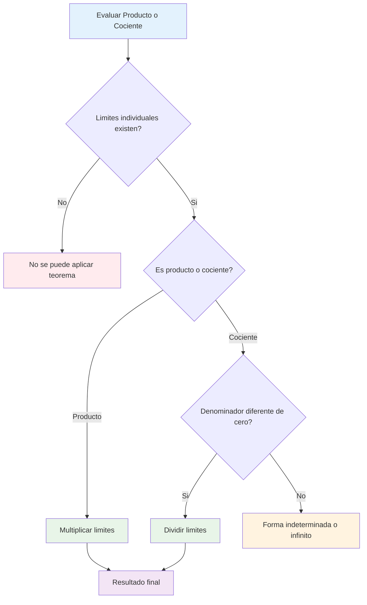
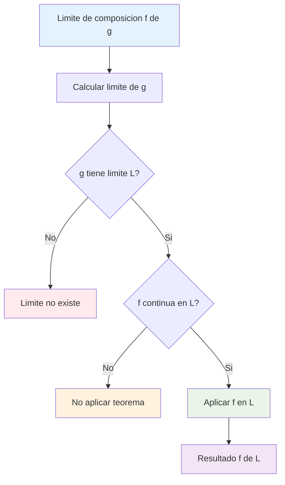

# 📜 Teoremas de Límites

## 🎯 Límite de una suma/diferencia

> [!info] 📐 Teorema de Suma y Diferencia Si $\lim_{x \to a} f(x) = L$ y $\lim_{x \to a} g(x) = M$, entonces:
> 
> **Suma:** $\lim_{x \to a} [f(x) + g(x)] = L + M$
> 
> **Diferencia:** $\lim_{x \to a} [f(x) - g(x)] = L - M$
> 
> 🔑 **Principio:** El límite de una suma es la suma de los límites

### 📊 Propiedades de la Suma/Diferencia

> [!success] ✅ Reglas Fundamentales
> 
> **1. Límite de una constante:** $$\lim_{x \to a} c = c$$
> 
> **2. Límite del múltiplo de una constante:** $$\lim_{x \to a} [c \cdot f(x)] = c \cdot \lim_{x \to a} f(x)$$
> 
> **3. Límite de múltiples funciones:** $$\lim_{x \to a} [f_1(x) + f_2(x) + ... + f_n(x)] = \lim_{x \to a} f_1(x) + \lim_{x \to a} f_2(x) + ... + \lim_{x \to a} f_n(x)$$

|Operación|Notación|Resultado|Condición|
|---|---|---|---|
|Suma|$\lim [f + g]$|$L + M$|Ambos límites existen|
|Diferencia|$\lim [f - g]$|$L - M$|Ambos límites existen|
|Constante por función|$\lim [c \cdot f]$|$c \cdot L$|Límite de f existe|
|Suma múltiple|$\lim [f_1 + f_2 + ... + f_n]$|$L_1 + L_2 + ... + L_n$|Todos los límites existen|

> [!example] 💡 Ejemplos Prácticos
> 
> **Ejemplo 1: Suma simple** $$\lim_{x \to 2} [(x^2 + 3) + (2x - 1)]$$
> 
> **Solución:**
> 
> - $\lim_{x \to 2} (x^2 + 3) = 4 + 3 = 7$
> - $\lim_{x \to 2} (2x - 1) = 4 - 1 = 3$
> - **Resultado:** $7 + 3 = 10$
> 
> **Ejemplo 2: Diferencia con constante** $$\lim_{x \to 1} [3x^2 - 5x + 2]$$
> 
> **Solución:**
> 
> - $\lim_{x \to 1} 3x^2 = 3 \cdot 1 = 3$
> - $\lim_{x \to 1} 5x = 5 \cdot 1 = 5$
> - $\lim_{x \to 1} 2 = 2$
> - **Resultado:** $3 - 5 + 2 = 0$

## 🔢 Límite de un producto/cociente

> [!info] 🎯 Teorema de Producto y Cociente Si $\lim_{x \to a} f(x) = L$ y $\lim_{x \to a} g(x) = M$, entonces:
> 
> **Producto:** $\lim_{x \to a} [f(x) \cdot g(x)] = L \cdot M$
> 
> **Cociente:** $\lim_{x \to a} \frac{f(x)}{g(x)} = \frac{L}{M}$ (si $M ≠ 0$)

### 📈 Casos Especiales del Producto

> [!tip] ⚡ Reglas del Producto
> 
> **1. Potencia natural:** $$\lim_{x \to a} [f(x)]^n = [L]^n$$
> 
> **2. Producto de múltiples funciones:** $$\lim_{x \to a} [f_1 \cdot f_2 \cdot ... \cdot f_n] = L_1 \cdot L_2 \cdot ... \cdot L_n$$
> 
> **3. Raíz n-ésima:** $$\lim_{x \to a} \sqrt[n]{f(x)} = \sqrt[n]{L}$$ (si la raíz está definida)

### 🔄 Casos Especiales del Cociente

> [!warning] ⚠️ Precauciones del Cociente
> 
> **Condición necesaria:** $M ≠ 0$
> 
> **Casos problemáticos:**
> 
> - Si $M = 0$ y $L ≠ 0$ → Límite no existe (∞)
> - Si $M = 0$ y $L = 0$ → Forma indeterminada $\frac{0}{0}$
> - Si $L = ∞$ y $M = ∞$ → Forma indeterminada $\frac{∞}{∞}$

|Situación|$\lim f(x)$|$\lim g(x)$|$\lim \frac{f(x)}{g(x)}$|Observación|
|---|---|---|---|---|
|Normal|$L$|$M ≠ 0$|$\frac{L}{M}$|✅ Aplicar teorema|
|Infinito|$L ≠ 0$|$0$|$±∞$|❌ Límite no existe|
|Indeterminada|$0$|$0$|?|🔧 Usar otras técnicas|
|Indeterminada|$∞$|$∞$|?|🔧 Usar L'Hôpital|

> [!example] 📝 Ejemplos de Producto y Cociente
> 
> **Ejemplo 1: Producto** $$\lim_{x \to 3} [(x + 1)(2x - 1)]$$
> 
> **Solución:**
> 
> - $\lim_{x \to 3} (x + 1) = 4$
> - $\lim_{x \to 3} (2x - 1) = 5$
> - **Resultado:** $4 \cdot 5 = 20$
> 
> **Ejemplo 2: Cociente válido** $$\lim_{x \to 2} \frac{x^2 - 1}{x + 3}$$
> 
> **Solución:**
> 
> - $\lim_{x \to 2} (x^2 - 1) = 3$
> - $\lim_{x \to 2} (x + 3) = 5 ≠ 0$ ✅
> - **Resultado:** $\frac{3}{5}$

## 📊 Límite de una potencia

> [!info] 🚀 Teorema de la Potencia Si $\lim_{x \to a} f(x) = L$ existe, entonces:
> 
> **Potencia entera:** $\lim_{x \to a} [f(x)]^n = L^n$ (para $n \in \mathbb{Z}$)
> 
> **Raíz n-ésima:** $\lim_{x \to a} \sqrt[n]{f(x)} = \sqrt[n]{L}$ (si la raíz está definida)

### 🔢 Tipos de Potencias

> [!success] 📈 Clasificación por Exponente
> 
> **1. Exponente entero positivo:** $$\lim_{x \to a} [f(x)]^n = L^n, \quad n \in \mathbb{N}$$
> 
> **2. Exponente entero negativo:** $$\lim_{x \to a} [f(x)]^{-n} = \frac{1}{L^n}, \quad L ≠ 0$$
> 
> **3. Exponente racional:** $$\lim_{x \to a} [f(x)]^{p/q} = L^{p/q}, \quad \text{si } L^{p/q} \text{ está definida}$$

|Tipo de Potencia|Condiciones|Ejemplo|Resultado|
|---|---|---|---|
|Cuadrado|$L$ cualquier|$\lim_{x \to 2} (x-1)^2$|$(2-1)^2 = 1$|
|Cubo|$L$ cualquier|$\lim_{x \to 3} (x+1)^3$|$(3+1)^3 = 64$|
|Raíz cuadrada|$L \geq 0$|$\lim_{x \to 4} \sqrt{x-3}$|$\sqrt{4-3} = 1$|
|Raíz cúbica|$L$ cualquier|$\lim_{x \to -1} \sqrt[3]{x+9}$|$\sqrt[3]{-1+9} = 2$|
|Potencia negativa|$L ≠ 0$|$\lim_{x \to 1} (x+1)^{-2}$|$(1+1)^{-2} = \frac{1}{4}$|

### ⚠️ Casos Especiales y Restricciones

> [!warning] 🚨 Condiciones Importantes
> 
> **Para raíces pares:** $L \geq 0$ (en números reales) **Para raíces impares:** $L$ puede ser cualquier número real **Para exponentes negativos:** $L ≠ 0$ **Para exponentes fraccionarios:** Verificar dominio y restricciones

> [!example] 🎯 Ejemplos de Potencias
> 
> **Ejemplo 1: Potencia positiva** $$\lim_{x \to 2} (x^2 - 1)^3$$
> 
> **Solución:**
> 
> - $\lim_{x \to 2} (x^2 - 1) = 4 - 1 = 3$
> - **Resultado:** $3^3 = 27$
> 
> **Ejemplo 2: Raíz cuadrada** $$\lim_{x \to 5} \sqrt{2x - 1}$$
> 
> **Solución:**
> 
> - $\lim_{x \to 5} (2x - 1) = 10 - 1 = 9$
> - Verificar: $9 \geq 0$ ✅
> - **Resultado:** $\sqrt{9} = 3$
> 
> **Ejemplo 3: Potencia negativa** $$\lim_{x \to 1} \frac{1}{(x + 2)^2}$$
> 
> **Solución:**
> 
> - $\lim_{x \to 1} (x + 2) = 3 ≠ 0$ ✅
> - **Resultado:** $\frac{1}{3^2} = \frac{1}{9}$

## 🔗 Límite de composición de funciones

> [!info] 🎭 Teorema de Composición Si $\lim_{x \to a} g(x) = L$ y $f$ es continua en $L$, entonces: $$\lim_{x \to a} f(g(x)) = f\left(\lim_{x \to a} g(x)\right) = f(L)$$
> 
> **Condición clave:** $f$ debe ser continua en el punto $L$

### 🔄 Proceso de Evaluación

> [!tip] 📋 Algoritmo para Composiciones
> 
> **Paso 1:** Calcular $\lim_{x \to a} g(x) = L$
> 
> **Paso 2:** Verificar que $f$ es continua en $L$
> 
> **Paso 3:** Aplicar $\lim_{x \to a} f(g(x)) = f(L)$

### 📊 Tipos Comunes de Composiciones

> [!success] 🎯 Ejemplos Típicos
> 
> **1. Función dentro de trigonométrica:** $$\lim_{x \to a} \sin(g(x)) = \sin\left(\lim_{x \to a} g(x)\right)$$
> 
> **2. Función dentro de exponencial:** $$\lim_{x \to a} e^{g(x)} = e^{\lim_{x \to a} g(x)}$$
> 
> **3. Función dentro de logaritmo:** $$\lim_{x \to a} \ln(g(x)) = \ln\left(\lim_{x \to a} g(x)\right)$$ (si $\lim g(x) > 0$)

|Función Externa $f$|Condición en $L$|Ejemplo|Evaluación|
|---|---|---|---|
|$\sin(u)$|Siempre continua|$\lim_{x \to 0} \sin(x^2)$|$\sin(0) = 0$|
|$e^u$|Siempre continua|$\lim_{x \to 1} e^{2x-2}$|$e^{0} = 1$|
|$\ln(u)$|$L > 0$|$\lim_{x \to 2} \ln(x^2)$|$\ln(4)$|
|$\sqrt{u}$|$L \geq 0$|$\lim_{x \to 3} \sqrt{x+1}$|$\sqrt{4} = 2$|
|$\frac{1}{u}$|$L ≠ 0$|$\lim_{x \to 1} \frac{1}{x+2}$|$\frac{1}{3}$|

> [!example] 🎨 Ejemplos de Composición
> 
> **Ejemplo 1: Trigonométrica compuesta** $$\lim_{x \to \pi/4} \cos(2x)$$
> 
> **Solución:**
> 
> - Sea $g(x) = 2x$, entonces $\lim_{x \to \pi/4} g(x) = \pi/2$
> - $f(u) = \cos(u)$ es continua en $\pi/2$
> - **Resultado:** $\cos(\pi/2) = 0$
> 
> **Ejemplo 2: Exponencial compuesta** $$\lim_{x \to 0} e^{x^2 + 2x}$$
> 
> **Solución:**
> 
> - Sea $g(x) = x^2 + 2x$, entonces $\lim_{x \to 0} g(x) = 0$
> - $f(u) = e^u$ es continua en $0$
> - **Resultado:** $e^0 = 1$
> 
> **Ejemplo 3: Logaritmo compuesto** $$\lim_{x \to 2} \ln(x^2 - 3)$$
> 
> **Solución:**
> 
> - Sea $g(x) = x^2 - 3$, entonces $\lim_{x \to 2} g(x) = 1$
> - Verificar: $1 > 0$ ✅
> - $f(u) = \ln(u)$ es continua en $1$
> - **Resultado:** $\ln(1) = 0$

## 🧠 Técnica de Estudio: Mnemotecnia "SPCP"

> [!tip] 🎓 Método "SPCP" para Teoremas de Límites
> 
> **S** - **S**uma: límite de suma = suma de límites **P** - **P**roducto: límite de producto = producto de límites  
> **C** - **C**ociente: límite de cociente = cociente de límites (denominador ≠ 0) **P** - **P**otencia: límite de potencia = potencia del límite
> 
> **Frase nemotécnica:** _"Suma, Producto, Cociente, Potencia - Siempre Preservan Cálculos Precisos"_
> 
> **Regla adicional para composición:** _"Componer Funciones: Límite interno + Continuidad externa"_

## 📊 Tabla Resumen de Teoremas

> [!info] 📋 Referencia Rápida
> 
> |Operación|Teorema|Condiciones|Ejemplo|
> |---|---|---|---|
> |**Suma**|$\lim [f ± g] = \lim f ± \lim g$|Ambos límites existen|$\lim (x+1) + \lim (2x) = 3+4 = 7$|
> |**Producto**|$\lim [f \cdot g] = \lim f \cdot \lim g$|Ambos límites existen|$\lim (x) \cdot \lim (x+1) = 2 \cdot 3 = 6$|
> |**Cociente**|$\lim [f/g] = \frac{\lim f}{\lim g}$|Ambos existen, $\lim g ≠ 0$|$\frac{\lim (x+1)}{\lim (x-1)} = \frac{3}{1} = 3$|
> |**Potencia**|$\lim [f^n] = (\lim f)^n$|Límite existe, potencia definida|$\lim (x+1)^2 = 3^2 = 9$|
> |**Composición**|$\lim f(g(x)) = f(\lim g(x))$|$\lim g$ existe, $f$ continua|$\lim \sin(x) = \sin(0) = 0$|

## 📚 Referencias y Conexiones

> [!quote] 🔗 Enlaces a Otras Notas
> 
> - [[Límites por Sustitución Directa]] - Aplicación práctica de los teoremas
> - [[Continuidad de Funciones]] - Requisito para composición
> - [[Límites Indeterminados]] - Casos donde los teoremas no aplican directamente
> - [[Álgebra de Funciones]] - Operaciones básicas entre funciones
> - [[Funciones Compuestas]] - Teoría de composición de funciones

## 📖 Notas Recomendadas para Estudio Complementario

> [!info] 📝 Secuencia de Aprendizaje Óptima
> 
> **Fundamentos:**
> 
> 1. **[[Definición Formal del Límite Épsilon-Delta]]** - Base conceptual
> 2. **[[Propiedades de los Números Reales]]** - Operaciones algebraicas
> 
> **Aplicaciones:** 3. **[[Técnicas de Factorización]]** - Para casos indeterminados 4. **[[Regla de L'Hôpital]]** - Alternativa para formas indeterminadas
> 
> **Extensiones:** 5. **[[Límites al Infinito]]** - Comportamiento asintótico 6. **[[Derivadas y Definición Formal]]** - Aplicación práctica de límites

## 🎯 Ejercicios Progresivos

> [!example] 💪 Práctica Estructurada
> 
> **Nivel 1 - Operaciones Básicas:** 🟢
> 
> - $\lim_{x \to 2} [(x^2 + 1) + (3x - 1)]$
> - $\lim_{x \to 1} [(2x + 3)(x - 1)]$
> - $\lim_{x \to 3} \frac{x^2 - 1}{x + 1}$
> 
> **Nivel 2 - Potencias y Raíces:** 🟡
> 
> - $\lim_{x \to 4} (x - 3)^3$
> - $\lim_{x \to 8} \sqrt[3]{x + 1}$
> - $\lim_{x \to 2} \frac{1}{(x + 1)^2}$
> 
> **Nivel 3 - Composiciones:** 🟠
> 
> - $\lim_{x \to 0} \sin(x^2 + x)$
> - $\lim_{x \to 1} e^{2x - 2}$
> - $\lim_{x \to 3} \ln(x^2 - 8)$
> 
> **Nivel 4 - Combinados:** 🔴
> 
> - $\lim_{x \to 2} \frac{(x+1)^2 \cdot \sin(x-2)}{e^{x-2} - 1}$
> - $\lim_{x \to 0} \sqrt{1 + x^2} \cdot \cos(2x)$

## 🔍 Casos Especiales y Advertencias

> [!warning] ⚠️ Situaciones Problemáticas Comunes
> 
> **1. División por cero:**
> 
> - Verificar siempre que el denominador no sea cero
> - Si es cero, usar técnicas especiales
> 
> **2. Raíces de números negativos:**
> 
> - Para raíces pares: verificar que el argumento sea ≥ 0
> - Para raíces impares: sin restricciones
> 
> **3. Logaritmos de números no positivos:**
> 
> - Verificar que el argumento sea > 0
> - Si no, el límite puede no existir
> 
> **4. Composiciones discontinuas:**
> 
> - La función externa debe ser continua en el límite interno
> - Si no, no se puede aplicar el teorema

---

**Tags:** #matemáticas #cálculo #límites #teoremas #álgebra-límites #suma #producto #cociente #potencia #composición #técnicas-estudio #university #calculus-theorems #análisis-matemático