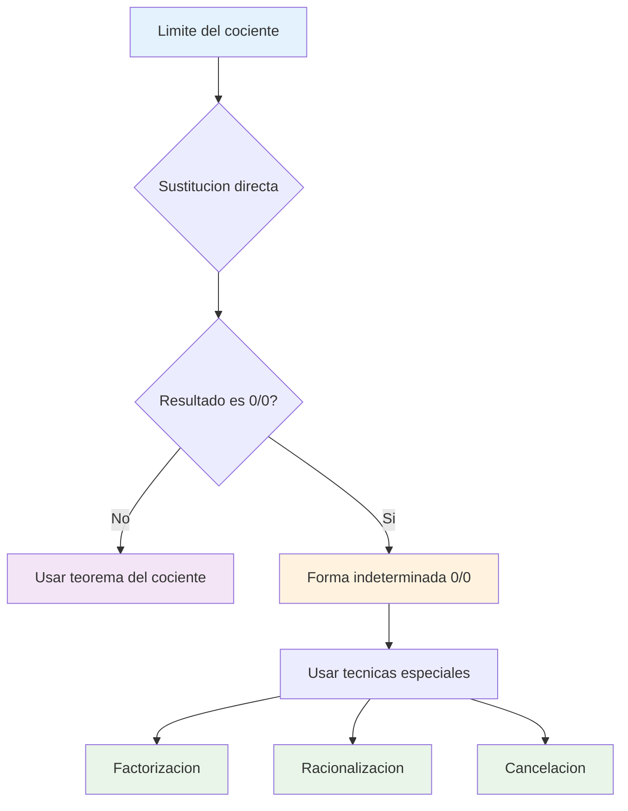
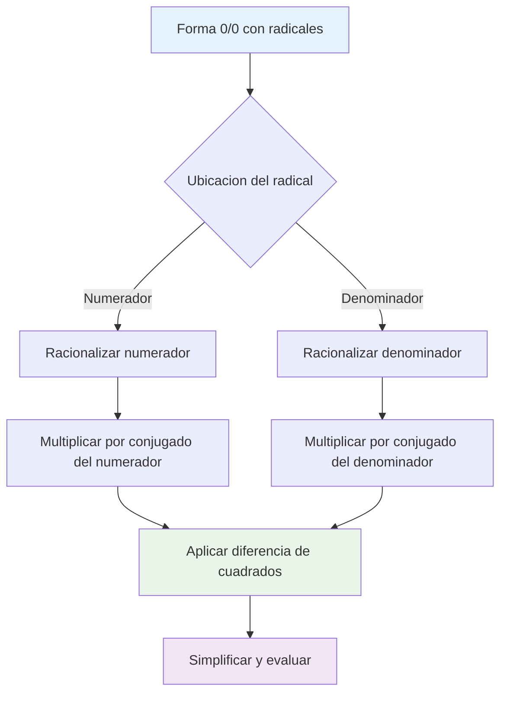
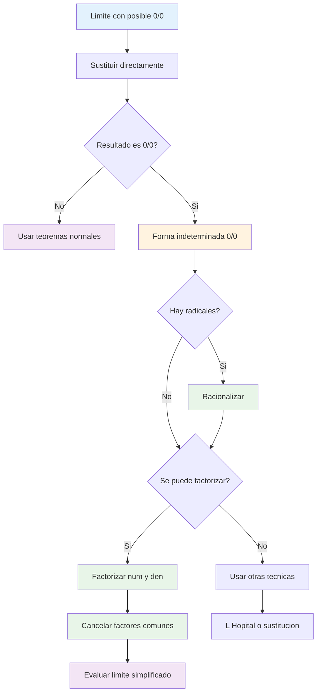

# ❓ Formas Indeterminadas 0/0

## 🎯 ¿Qué es una Forma Indeterminada 0/0?

> [!info] 🔍 Definición Fundamental Una **forma indeterminada** $\frac{0}{0}$ surge cuando: $$\lim_{x \to a} \frac{f(x)}{g(x)}$$ donde $\lim_{x \to a} f(x) = 0$ y $\lim_{x \to a} g(x) = 0$
> 
> 🚫 **No podemos aplicar** el teorema del cociente de límites porque obtendríamos $\frac{0}{0}$, que **no está definido**.

> [!warning] ⚠️ Por qué es "Indeterminada" La forma $\frac{0}{0}$ es indeterminada porque **puede tomar cualquier valor** dependiendo de cómo las funciones se aproximen a cero.
> 
> **Ejemplos:**
> 
> - $\lim_{x \to 0} \frac{x}{x} = 1$ (ambos tienden a 0, resultado = 1)
> - $\lim_{x \to 0} \frac{2x}{x} = 2$ (ambos tienden a 0, resultado = 2)
> - $\lim_{x \to 0} \frac{x^2}{x} = 0$ (ambos tienden a 0, resultado = 0)

## 🔢 Factorización Algebraica

> [!success] 🎯 Estrategia de Factorización **Objetivo:** Factorizar numerador y denominador para **cancelar factores comunes** que causan la indeterminación.
> 
> **Proceso:**
> 
> 1. Factorizar completamente el numerador
> 2. Factorizar completamente el denominador
> 3. Cancelar factores comunes
> 4. Evaluar el límite resultante

### 📊 Técnicas de Factorización Principales

> [!tip] 🔧 Métodos de Factorización
> 
> **1. Diferencia de cuadrados:** $$a^2 - b^2 = (a+b)(a-b)$$
> 
> **2. Trinomio cuadrado perfecto:** $$a^2 + 2ab + b^2 = (a+b)^2$$ $$a^2 - 2ab + b^2 = (a-b)^2$$
> 
> **3. Factor común:** $$ax + bx = x(a + b)$$
> 
> **4. Trinomio de segundo grado:** $$ax^2 + bx + c = (px + q)(rx + s)$$

|Tipo de Factorización|Patrón|Ejemplo|Factorizado|
|---|---|---|---|
|Diferencia de cuadrados|$a^2 - b^2$|$x^2 - 4$|$(x+2)(x-2)$|
|Cuadrado perfecto|$(a \pm b)^2$|$x^2 + 6x + 9$|$(x+3)^2$|
|Factor común|$x(a + b)$|$3x^2 + 6x$|$3x(x+2)$|
|Trinomio general|$ax^2 + bx + c$|$2x^2 + 7x + 3$|$(2x+1)(x+3)$|
|Diferencia de cubos|$a^3 - b^3$|$x^3 - 8$|$(x-2)(x^2+2x+4)$|

> [!example] 📝 Ejemplos de Factorización
> 
> **Ejemplo 1: Diferencia de cuadrados** $$\lim_{x \to 2} \frac{x^2 - 4}{x - 2}$$
> 
> **Solución:**
> 
> - Verificar: $\frac{2^2 - 4}{2 - 2} = \frac{0}{0}$ ✓ (Forma indeterminada)
> - Factorizar: $x^2 - 4 = (x+2)(x-2)$
> - Simplificar: $\frac{(x+2)(x-2)}{x-2} = x+2$ (para $x ≠ 2$)
> - Evaluar: $\lim_{x \to 2} (x+2) = 4$
> 
> **Ejemplo 2: Trinomio cuadrático** $$\lim_{x \to -1} \frac{x^2 + 3x + 2}{x^2 - 1}$$
> 
> **Solución:**
> 
> - Verificar: $\frac{1 - 3 + 2}{1 - 1} = \frac{0}{0}$ ✓
> - Factorizar numerador: $x^2 + 3x + 2 = (x+1)(x+2)$
> - Factorizar denominador: $x^2 - 1 = (x+1)(x-1)$
> - Simplificar: $\frac{(x+1)(x+2)}{(x+1)(x-1)} = \frac{x+2}{x-1}$ (para $x ≠ -1$)
> - Evaluar: $\lim_{x \to -1} \frac{x+2}{x-1} = \frac{1}{-2} = -\frac{1}{2}$

### 🎲 Casos Especiales de Factorización

> [!tip] ⚡ Factorizaciones Avanzadas
> 
> **Suma y diferencia de cubos:**
> 
> - $a^3 + b^3 = (a+b)(a^2 - ab + b^2)$
> - $a^3 - b^3 = (a-b)(a^2 + ab + b^2)$
> 
> **Factorización por agrupación:**
> 
> - $ax + ay + bx + by = a(x+y) + b(x+y) = (a+b)(x+y)$
> 
> **Sustitución trigonométrica:**
> 
> - Usar identidades como $\sin^2 x + \cos^2 x = 1$

> [!example] 🎯 Ejemplo Avanzado $$\lim_{x \to 2} \frac{x^3 - 8}{x^2 - 4}$$
> 
> **Solución:**
> 
> - Verificar: $\frac{8 - 8}{4 - 4} = \frac{0}{0}$ ✓
> - Factorizar numerador: $x^3 - 8 = (x-2)(x^2 + 2x + 4)$
> - Factorizar denominador: $x^2 - 4 = (x-2)(x+2)$
> - Simplificar: $\frac{(x-2)(x^2 + 2x + 4)}{(x-2)(x+2)} = \frac{x^2 + 2x + 4}{x+2}$
> - Evaluar: $\lim_{x \to 2} \frac{4 + 4 + 4}{4} = \frac{12}{4} = 3$

## 📐 Racionalización

> [!info] 🔄 Técnica de Racionalización **Objetivo:** Eliminar **radicales del denominador** o numerador multiplicando por el **conjugado**.
> 
> **Conjugado:** Si tenemos $\sqrt{a} + \sqrt{b}$, su conjugado es $\sqrt{a} - \sqrt{b}$
> 
> **Propiedad clave:** $(\sqrt{a} + \sqrt{b})(\sqrt{a} - \sqrt{b}) = a - b$

### 🌊 Tipos de Racionalización

> [!success] 🎯 Estrategias de Racionalización
> 
> **1. Racionalización simple:** $$\frac{1}{\sqrt{a}} \cdot \frac{\sqrt{a}}{\sqrt{a}} = \frac{\sqrt{a}}{a}$$
> 
> **2. Racionalización con conjugado:** $$\frac{1}{\sqrt{a} + \sqrt{b}} \cdot \frac{\sqrt{a} - \sqrt{b}}{\sqrt{a} - \sqrt{b}} = \frac{\sqrt{a} - \sqrt{b}}{a - b}$$
> 
> **3. Racionalización del numerador:** $$\frac{\sqrt{a} - \sqrt{b}}{c} \cdot \frac{\sqrt{a} + \sqrt{b}}{\sqrt{a} + \sqrt{b}} = \frac{a - b}{c(\sqrt{a} + \sqrt{b})}$$

|Situación|Multiplicar por|Resultado|Uso típico|
|---|---|---|---|
|$\frac{A}{\sqrt{x}}$|$\frac{\sqrt{x}}{\sqrt{x}}$|$\frac{A\sqrt{x}}{x}$|Denominador con una raíz|
|$\frac{A}{\sqrt{x} + \sqrt{y}}$|$\frac{\sqrt{x} - \sqrt{y}}{\sqrt{x} - \sqrt{y}}$|$\frac{A(\sqrt{x} - \sqrt{y})}{x - y}$|Suma de raíces en denominador|
|$\frac{\sqrt{x} - \sqrt{y}}{A}$|$\frac{\sqrt{x} + \sqrt{y}}{\sqrt{x} + \sqrt{y}}$|$\frac{x - y}{A(\sqrt{x} + \sqrt{y})}$|Resta de raíces en numerador|

> [!example] 📊 Ejemplos de Racionalización
> 
> **Ejemplo 1: Racionalización básica** $$\lim_{x \to 0} \frac{\sqrt{x + 1} - 1}{x}$$
> 
> **Solución:**
> 
> - Verificar: $\frac{\sqrt{1} - 1}{0} = \frac{0}{0}$ ✓
> - Multiplicar por conjugado: $\frac{\sqrt{x + 1} - 1}{x} \cdot \frac{\sqrt{x + 1} + 1}{\sqrt{x + 1} + 1}$
> - Aplicar diferencia de cuadrados: $\frac{(x + 1) - 1}{x(\sqrt{x + 1} + 1)} = \frac{x}{x(\sqrt{x + 1} + 1)}$
> - Simplificar: $\frac{1}{\sqrt{x + 1} + 1}$ (para $x ≠ 0$)
> - Evaluar: $\lim_{x \to 0} \frac{1}{\sqrt{1} + 1} = \frac{1}{2}$
> 
> **Ejemplo 2: Racionalización compleja** $$\lim_{x \to 4} \frac{\sqrt{x} - 2}{x - 4}$$
> 
> **Solución:**
> 
> - Verificar: $\frac{2 - 2}{4 - 4} = \frac{0}{0}$ ✓
> - Multiplicar por conjugado: $\frac{\sqrt{x} - 2}{x - 4} \cdot \frac{\sqrt{x} + 2}{\sqrt{x} + 2}$
> - Simplificar numerador: $\frac{x - 4}{(x - 4)(\sqrt{x} + 2)}$
> - Cancelar: $\frac{1}{\sqrt{x} + 2}$ (para $x ≠ 4$)
> - Evaluar: $\lim_{x \to 4} \frac{1}{\sqrt{4} + 2} = \frac{1}{4}$

### 🔍 Patrones Comunes en Racionalización

> [!tip] 🎯 Identificación Rápida **¿Cuándo racionalizar?**
> 
> - Hay raíces cuadradas en numerador o denominador
> - La sustitución directa da $\frac{0}{0}$
> - Se pueden formar conjugados útiles
> 
> **¿Qué conjugado usar?**
> 
> - Para $\sqrt{a} + b$ usar $\sqrt{a} - b$
> - Para $\sqrt{a} - \sqrt{b}$ usar $\sqrt{a} + \sqrt{b}$
> - Para $a + \sqrt{b}$ usar $a - \sqrt{b}$

## ✂️ Cancelación de Factores Comunes

> [!success] 🎯 Proceso de Cancelación **Objetivo:** Eliminar los **factores que causan la indeterminación** mediante cancelación algebraica.
> 
> **Pasos fundamentales:**
> 
> 1. **Identificar** el factor problemático
> 2. **Factorizar** tanto numerador como denominador
> 3. **Cancelar** factores comunes
> 4. **Evaluar** el límite simplificado

### 🔄 Tipos de Cancelación

> [!tip] ⚡ Métodos de Cancelación
> 
> **1. Cancelación directa:** $$\frac{(x-a) \cdot P(x)}{(x-a) \cdot Q(x)} = \frac{P(x)}{Q(x)} \quad (x ≠ a)$$
> 
> **2. Cancelación múltiple:** $$\frac{(x-a)^2 \cdot P(x)}{(x-a) \cdot Q(x)} = \frac{(x-a) \cdot P(x)}{Q(x)} \quad (x ≠ a)$$
> 
> **3. Cancelación con factorización previa:** $$\frac{f(x)}{g(x)} \to \frac{A(x)(x-a)}{B(x)(x-a)} = \frac{A(x)}{B(x)}$$

|Situación|Antes de Cancelar|Después de Cancelar|Factor Cancelado|
|---|---|---|---|
|Factor lineal|$\frac{(x-2)(x+1)}{(x-2)(x+3)}$|$\frac{x+1}{x+3}$|$(x-2)$|
|Factor cuadrático|$\frac{(x^2-1)(x+2)}{(x^2-1)(x-3)}$|$\frac{x+2}{x-3}$|$(x^2-1)$|
|Múltiples factores|$\frac{(x-1)^2(x+2)}{(x-1)(x+5)}$|$\frac{(x-1)(x+2)}{x+5}$|$(x-1)$|
|Con constantes|$\frac{2(x-3)(x+1)}{4(x-3)}$|$\frac{(x+1)}{2}$|$2(x-3)$|

> [!example] 🎨 Ejemplos de Cancelación
> 
> **Ejemplo 1: Cancelación simple** $$\lim_{x \to 3} \frac{x^2 - 9}{x - 3}$$
> 
> **Solución:**
> 
> - Verificar: $\frac{9 - 9}{3 - 3} = \frac{0}{0}$ ✓
> - Factorizar: $\frac{(x+3)(x-3)}{x-3}$
> - Cancelar: $\frac{(x+3)\cancel{(x-3)}}{\cancel{x-3}} = x+3$ (para $x ≠ 3$)
> - Evaluar: $\lim_{x \to 3} (x+3) = 6$
> 
> **Ejemplo 2: Cancelación múltiple** $$\lim_{x \to -2} \frac{x^3 + 8}{x^2 + 4x + 4}$$
> 
> **Solución:**
> 
> - Verificar: $\frac{-8 + 8}{4 - 8 + 4} = \frac{0}{0}$ ✓
> - Factorizar numerador: $x^3 + 8 = (x+2)(x^2 - 2x + 4)$
> - Factorizar denominador: $x^2 + 4x + 4 = (x+2)^2$
> - Cancelar: $\frac{(x+2)(x^2 - 2x + 4)}{(x+2)^2} = \frac{x^2 - 2x + 4}{x+2}$ (para $x ≠ -2$)
> - Evaluar: $\lim_{x \to -2} \frac{4 + 4 + 4}{0}$ → Límite no existe (∞)

### 🚨 Precauciones en la Cancelación

> [!warning] ⚠️ Cuidados Importantes
> 
> **1. Verificar la indeterminación:**
> 
> - Siempre confirmar que se obtiene $\frac{0}{0}$ antes de cancelar
> 
> **2. Restricción de dominio:**
> 
> - Recordar que $x ≠ a$ después de la cancelación
> - El límite evalúa el comportamiento cerca de $a$, no en $a$
> 
> **3. Cancelación completa:**
> 
> - Asegurar que todos los factores problemáticos se cancelen
> - Si queda un factor $(x-a)$ en denominador → límite infinito
> 
> **4. Factorización correcta:**
> 
> - Verificar cada factorización antes de cancelar

> [!example] 🔍 Ejemplo con Múltiples Técnicas $$\lim_{x \to 1} \frac{\sqrt{x+3} - 2}{x^2 - 1}$$
> 
> **Solución combinada:**
> 
> - Verificar: $\frac{\sqrt{4} - 2}{1 - 1} = \frac{0}{0}$ ✓
> - **Racionalizar numerador:** Multiplicar por $\frac{\sqrt{x+3} + 2}{\sqrt{x+3} + 2}$
> - Numerador: $(\sqrt{x+3})^2 - 4 = x + 3 - 4 = x - 1$
> - **Factorizar denominador:** $x^2 - 1 = (x-1)(x+1)$
> - **Cancelar factor común:** $\frac{x-1}{(x-1)(x+1)(\sqrt{x+3} + 2)} = \frac{1}{(x+1)(\sqrt{x+3} + 2)}$
> - **Evaluar:** $\lim_{x \to 1} \frac{1}{(2)(\sqrt{4} + 2)} = \frac{1}{2 \cdot 4} = \frac{1}{8}$

## 🧠 Técnica de Estudio: Mnemotecnia "FRC"

> [!tip] 🎓 Método "FRC" para Formas Indeterminadas 0/0
> 
> **F** - **F**actorizar (buscar factores comunes) **R** - **R**acionalizar (si hay radicales) **C** - **C**ancelar (eliminar factores problemáticos)
> 
> **Algoritmo de decisión:**
> 
> 1. **Verificar** si es forma $\frac{0}{0}$
> 2. **¿Hay radicales?** → Racionalizar primero
> 3. **¿Se puede factorizar?** → Factorizar
> 4. **¿Hay factores comunes?** → Cancelar
> 5. **Evaluar** el límite simplificado
> 
> **Frase nemotécnica:** _"Factoriza, Racionaliza, Cancela"_

## 📊 Diagrama de Flujo Completo

## 📚 Referencias y Conexiones

> [!quote] 🔗 Enlaces a Otras Notas
> 
> - [[Teoremas de Límites]] - Base teórica para entender por qué fallan
> - [[Técnicas de Factorización]] - Herramientas algebraicas fundamentales
> - [[Conjugados y Racionalización]] - Técnicas específicas para radicales
> - [[Regla de L'Hôpital]] - Método alternativo para formas indeterminadas
> - [[Límites Trigonométricos]] - Casos especiales con funciones trigonométricas

## 📖 Notas Recomendadas para Estudio Complementario

> [!info] 📝 Secuencia de Aprendizaje Progresiva
> 
> **Prerrequisitos:**
> 
> 1. **[[Álgebra de Polinomios]]** - Factorización básica
> 2. **[[Productos Notables]]** - Patrones algebraicos
> 3. **[[Radicales y Conjugados]]** - Operaciones con raíces
> 
> **Temas Paralelos:** 4. **[[Gráficas y Discontinuidades]]** - Interpretación visual 5. **[[Simplificación Algebraica]]** - Técnicas de reducción
> 
> **Siguientes Pasos:** 6. **[[Otras Formas Indeterminadas]]** - ∞/∞, 0·∞, etc. 7. **[[Regla de L'Hôpital]]** - Método sistemático 8. **[[Límites Trigonométricos Especiales]]** - Casos avanzados

## 🎯 Ejercicios de Práctica Estructurada

> [!example] 💪 Entrenamiento por Técnicas
> 
> **Nivel 1 - Factorización Básica:** 🟢
> 
> - $\lim_{x \to 3} \frac{x^2 - 9}{x - 3}$
> - $\lim_{x \to -2} \frac{x^2 + 4x + 4}{x + 2}$
> - $\lim_{x \to 1} \frac{x^3 - 1}{x^2 - 1}$
> 
> **Nivel 2 - Racionalización Simple:** 🟡
> 
> - $\lim_{x \to 0} \frac{\sqrt{x + 4} - 2}{x}$
> - $\lim_{x \to 9} \frac{\sqrt{x} - 3}{x - 9}$
> - $\lim_{x \to 1} \frac{x - 1}{\sqrt{x} - 1}$
> 
> **Nivel 3 - Técnicas Combinadas:** 🟠
> 
> - $\lim_{x \to 4} \frac{x^2 - 16}{\sqrt{x + 5} - 3}$
> - $\lim_{x \to 2} \frac{\sqrt{x + 7} - 3}{x^2 - 4}$
> - $\lim_{x \to 0} \frac{(1 + x)^2 - 1}{x}$
> 
> **Nivel 4 - Casos Complejos:** 🔴
> 
> - $\lim_{x \to 1} \frac{x^4 - 1}{x^3 - 1}$
> - $\lim_{x \to 8} \frac{\sqrt[3]{x} - 2}{x - 8}$
> - $\lim_{x \to 0} \frac{\sqrt{1 + 2x} - \sqrt{1 - 2x}}{x}$

## 🔍 Casos Especiales y Patrones Frecuentes

> [!tip] 📊 Patrones Comunes a Reconocer
> 
> **1. Diferencia de cuadrados en numerador:** $$\frac{x^2 - a^2}{x - a} = x + a$$
> 
> **2. Cuadrado perfecto en denominador:** $$\frac{f(x)}{(x-a)^2} \text{ después de cancelar } (x-a)$$
> 
> **3. Radical menos constante:** $$\frac{\sqrt{x + c} - \sqrt{c}}{x} = \frac{1}{\sqrt{x + c} + \sqrt{c}}$$
> 
> **4. Diferencia de cubos:** $$\frac{x^3 - a^3}{x - a} = x^2 + ax + a^2$$

> [!warning] 🚨 Errores Comunes a Evitar
> 
> **1. No verificar la forma indeterminada:**
> 
> - Siempre sustituir primero para confirmar $\frac{0}{0}$
> 
> **2. Factorización incorrecta:**
> 
> - Verificar cada paso de factorización
> 
> **3. Cancelación prematura:**
> 
> - No cancelar antes de factorizar completamente
> 
> **4. Olvidar restricciones de dominio:**
> 
> - Recordar que $x ≠ a$ en la expresión simplificada

---

**Tags:** #matemáticas #cálculo #límites #formas-indeterminadas #factorización #racionalización #cancelación #algebra #técnicas-estudio #university #calculus-advanced #análisis-matemático #resolución-problemas