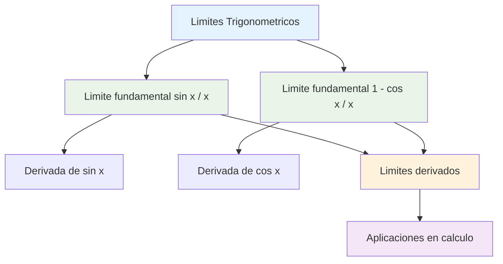
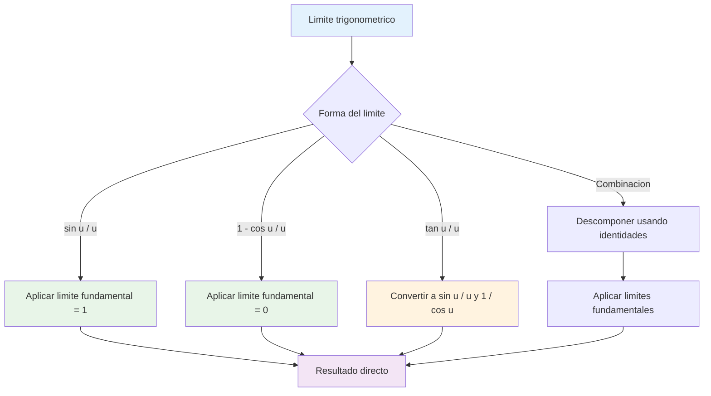

# 🌊 Límites Trigonométricos Fundamentales

## 🎯 ¿Por qué son Fundamentales estos Límites?

> [!info] 🔍 Importancia en el Cálculo Los **límites trigonométricos fundamentales** son la base para:
> 
> - Derivadas de funciones trigonométricas
> - Resolución de formas indeterminadas con trigonometría
> - Análisis de comportamiento oscilatorio
> - Aproximaciones de funciones cerca del origen
> 
> 🔑 **Estos límites NO se pueden obtener por sustitución directa** porque dan formas indeterminadas $\frac{0}{0}$

> [!warning] ⚠️ Formas Indeterminadas Trigonométricas Al sustituir $x = 0$ directamente:
> 
> - $\frac{\sin 0}{0} = \frac{0}{0}$ (indeterminada)
> - $\frac{1 - \cos 0}{0} = \frac{1-1}{0} = \frac{0}{0}$ (indeterminada)
> 
> **Por esto necesitamos métodos geométricos y analíticos especiales.**

## 📐 Límite fundamental: $\lim_{x \to 0} \frac{\sin x}{x} = 1$

> [!success] 🎯 El Límite Más Importante de la Trigonometría $$\lim_{x \to 0} \frac{\sin x}{x} = 1$$
> 
> **Condición:** $x$ debe estar en **radianes**
> 
> Este límite es fundamental porque establece que para ángulos pequeños: $$\sin x \approx x \quad \text{(cuando } x \text{ está cerca de 0)}$$

### 📊 Demostración Geométrica (Método del Sandwich)

> [!tip] 🔧 Demostración por Desigualdad Para $0 < x < \frac{\pi}{2}$, consideremos un sector circular de radio 1:
> 
> **Áreas en orden creciente:**
> 
> - Área del triángulo inscrito: $\frac{1}{2}\sin x$
> - Área del sector circular: $\frac{1}{2}x$
> - Área del triángulo circunscrito: $\frac{1}{2}\tan x$
> 
> **Desigualdad:** $\sin x < x < \tan x$
> 
> **Dividiendo por $\sin x > 0$:** $$1 < \frac{x}{\sin x} < \frac{1}{\cos x}$$
> 
> **Invirtiendo:** $\cos x < \frac{\sin x}{x} < 1$
> 
> **Aplicando teorema del sandwich:** $$\lim_{x \to 0^+} \cos x = 1 \quad \text{y} \quad \lim_{x \to 0^+} 1 = 1$$
> 
> Por lo tanto: $\lim_{x \to 0^+} \frac{\sin x}{x} = 1$

|Valor de $x$|$\sin x$|$\frac{\sin x}{x}$|Aproximación|
|---|---|---|---|
|$0.1$|$0.09983$|$0.99833$|≈ 1|
|$0.01$|$0.00999$|$0.99998$|≈ 1|
|$0.001$|$0.000999$|$0.999999$|≈ 1|
|$-0.001$|$-0.000999$|$0.999999$|≈ 1|
|$-0.01$|$-0.00999$|$0.99998$|≈ 1|

### 🎨 Variaciones del Límite Fundamental

> [!example] 📝 Formas Equivalentes
> 
> **Forma básica:** $$\lim_{x \to 0} \frac{\sin x}{x} = 1$$
> 
> **Con múltiplos:** $$\lim_{x \to 0} \frac{\sin(ax)}{x} = a \quad \text{(usando sustitución } u = ax\text{)}$$
> 
> **Con funciones:** $$\lim_{x \to a} \frac{\sin(f(x))}{f(x)} = 1 \quad \text{si } \lim_{x \to a} f(x) = 0$$

> [!example] 🎯 Ejemplos Prácticos
> 
> **Ejemplo 1: Con múltiplo** $$\lim_{x \to 0} \frac{\sin(3x)}{x}$$
> 
> **Solución:**
> 
> - Reescribir: $\frac{\sin(3x)}{x} = \frac{\sin(3x)}{3x} \cdot 3$
> - Aplicar límite: $\lim_{x \to 0} \frac{\sin(3x)}{3x} \cdot 3 = 1 \cdot 3 = 3$
> 
> **Ejemplo 2: Con denominador diferente** $$\lim_{x \to 0} \frac{\sin(5x)}{2x}$$
> 
> **Solución:**
> 
> - Reescribir: $\frac{\sin(5x)}{2x} = \frac{5}{2} \cdot \frac{\sin(5x)}{5x}$
> - Aplicar límite: $\frac{5}{2} \cdot 1 = \frac{5}{2}$
> 
> **Ejemplo 3: Con sustitución** $$\lim_{t \to 2} \frac{\sin(t-2)}{t-2}$$
> 
> **Solución:**
> 
> - Sustitución: $u = t - 2$, cuando $t \to 2$, $u \to 0$
> - Transformar: $\lim_{u \to 0} \frac{\sin u}{u} = 1$

### 🔍 Aplicaciones del Límite sin x/x

> [!tip] ⚡ Usos Frecuentes
> 
> **1. Derivada del seno:** $$\frac{d}{dx}[\sin x] = \lim_{h \to 0} \frac{\sin(x+h) - \sin x}{h} = \cos x$$
> 
> **2. Aproximación lineal:** $$\sin x \approx x \quad \text{para } x \text{ pequeño}$$
> 
> **3. Series de Taylor:** $$\sin x = x - \frac{x^3}{3!} + \frac{x^5}{5!} - \frac{x^7}{7!} + ...$$

## 📊 Límite fundamental: $\lim_{x \to 0} \frac{1-\cos x}{x} = 0$

> [!info] 🎯 El Segundo Límite Fundamental $$\lim_{x \to 0} \frac{1-\cos x}{x} = 0$$
> 
> **Interpretación:** Para ángulos pequeños: $$1 - \cos x \approx 0 \quad \text{(decrece más lento que } x\text{)}$$
> 
> Esto significa que $\cos x \approx 1$ para $x$ cerca de 0.

### 🔧 Demostración por Racionalización

> [!success] 📐 Método de Conjugado
> 
> **Paso 1:** Multiplicar por conjugado $$\frac{1-\cos x}{x} = \frac{1-\cos x}{x} \cdot \frac{1+\cos x}{1+\cos x}$$
> 
> **Paso 2:** Aplicar diferencia de cuadrados $$= \frac{(1)^2 - (\cos x)^2}{x(1+\cos x)} = \frac{1 - \cos^2 x}{x(1+\cos x)}$$
> 
> **Paso 3:** Usar identidad trigonométrica $1 - \cos^2 x = \sin^2 x$ $$= \frac{\sin^2 x}{x(1+\cos x)} = \frac{\sin x}{x} \cdot \frac{\sin x}{1+\cos x}$$
> 
> **Paso 4:** Aplicar límites $$\lim_{x \to 0} \frac{\sin x}{x} \cdot \frac{\sin x}{1+\cos x} = 1 \cdot \frac{0}{1+1} = 1 \cdot 0 = 0$$

|Valor de $x$|$1-\cos x$|$\frac{1-\cos x}{x}$|Aproximación|
|---|---|---|---|
|$0.1$|$0.004996$|$0.04996$|≈ 0|
|$0.01$|$0.000050$|$0.005000$|≈ 0|
|$0.001$|$0.0000005$|$0.0005000$|≈ 0|
|$-0.001$|$0.0000005$|$-0.0005000$|≈ 0|
|$-0.01$|$0.000050$|$-0.005000$|≈ 0|

### 📈 Límite Relacionado Más Útil

> [!tip] ⚡ Forma Alternativa Importante Es más común usar la forma: $$\lim_{x \to 0} \frac{1-\cos x}{x^2} = \frac{1}{2}$$
> 
> **Demostración:** $$\frac{1-\cos x}{x^2} = \frac{1-\cos x}{x} \cdot \frac{1}{x} = \frac{\sin^2 x}{x(1+\cos x)} \cdot \frac{1}{x} = \frac{\sin x}{x} \cdot \frac{\sin x}{x} \cdot \frac{1}{1+\cos x}$$
> 
> $$\lim_{x \to 0} 1 \cdot 1 \cdot \frac{1}{2} = \frac{1}{2}$$

> [!example] 🎨 Ejemplos con 1-cos x
> 
> **Ejemplo 1: Forma básica** $$\lim_{x \to 0} \frac{1-\cos(2x)}{x}$$
> 
> **Solución:**
> 
> - Reescribir: $\frac{1-\cos(2x)}{x} = 2 \cdot \frac{1-\cos(2x)}{2x}$
> - Sustitución: $u = 2x$, $\lim_{u \to 0} 2 \cdot \frac{1-\cos u}{u} = 2 \cdot 0 = 0$
> 
> **Ejemplo 2: Con denominador cuadrático** $$\lim_{x \to 0} \frac{1-\cos x}{x^2}$$
> 
> **Solución:** (Ya demostrado) $= \frac{1}{2}$
> 
> **Ejemplo 3: Combinado** $$\lim_{x \to 0} \frac{1-\cos(3x)}{2x^2}$$
> 
> **Solución:**
> 
> - Reescribir: $\frac{1-\cos(3x)}{2x^2} = \frac{1}{2} \cdot \frac{1-\cos(3x)}{x^2}$
> - $= \frac{1}{2} \cdot 9 \cdot \frac{1-\cos(3x)}{9x^2} = \frac{9}{2} \cdot \frac{1}{2} = \frac{9}{4}$

## 🔄 Límites Derivados de los Fundamentales

> [!success] 🚀 Límites Derivados y Extensiones A partir de los dos límites fundamentales, podemos obtener muchos otros límites importantes.

### 📊 Límites con Tangente

> [!tip] 🎯 Límite de tan x/x $$\lim_{x \to 0} \frac{\tan x}{x} = 1$$
> 
> **Demostración:** $$\frac{\tan x}{x} = \frac{\sin x}{\cos x} \cdot \frac{1}{x} = \frac{\sin x}{x} \cdot \frac{1}{\cos x}$$
> 
> $$\lim_{x \to 0} \frac{\sin x}{x} \cdot \frac{1}{\cos x} = 1 \cdot \frac{1}{1} = 1$$

> [!example] 📝 Ejemplos con Tangente
> 
> **Ejemplo 1:** $$\lim_{x \to 0} \frac{\tan(4x)}{x} = 4$$
> 
> **Ejemplo 2:** $$\lim_{x \to 0} \frac{x}{\tan(2x)} = \frac{1}{2}$$

### 📐 Límites con Arcoseno y Arcotangente

> [!info] 🔄 Límites Inversos
> 
> **Arcoseno:** $$\lim_{x \to 0} \frac{\arcsin x}{x} = 1$$
> 
> **Arcotangente:** $$\lim_{x \to 0} \frac{\arctan x}{x} = 1$$
> 
> **Demostración por sustitución:** Si $y = \arcsin x$, entonces $x = \sin y$ y cuando $x \to 0$, $y \to 0$ $$\lim_{x \to 0} \frac{\arcsin x}{x} = \lim_{y \to 0} \frac{y}{\sin y} = \frac{1}{\lim_{y \to 0} \frac{\sin y}{y}} = \frac{1}{1} = 1$$

### 🌊 Límites Combinados

> [!example] 🎨 Casos Complejos
> 
> **Ejemplo 1: Límite mixto** $$\lim_{x \to 0} \frac{\sin x - x \cos x}{x^3}$$
> 
> **Solución usando L'Hôpital o desarrollo en serie:**
> 
> - Resultado: $\frac{1}{2}$
> 
> **Ejemplo 2: Con múltiples funciones** $$\lim_{x \to 0} \frac{\sin(2x) - 2\sin x}{x^3}$$
> 
> **Solución:**
> 
> - Usar identidad: $\sin(2x) = 2\sin x \cos x$
> - $\sin(2x) - 2\sin x = 2\sin x(\cos x - 1)$
> - Resultado: $-\frac{2}{3}$

### 📊 Tabla de Límites Derivados Importantes

|Límite|Valor|Método|
|---|---|---|
|$\lim_{x \to 0} \frac{\sin(ax)}{x}$|$a$|Sustitución $u = ax$|
|$\lim_{x \to 0} \frac{\tan(ax)}{x}$|$a$|$\tan u = \frac{\sin u}{\cos u}$|
|$\lim_{x \to 0} \frac{1-\cos(ax)}{x^2}$|$\frac{a^2}{2}$|Racionalización|
|$\lim_{x \to 0} \frac{\arcsin(ax)}{x}$|$a$|Sustitución inversa|
|$\lim_{x \to 0} \frac{\arctan(ax)}{x}$|$a$|Sustitución inversa|
|$\lim_{x \to 0} \frac{\sin x}{x} \cos x$|$1$|Producto de límites|
|$\lim_{x \to 0} \frac{x - \sin x}{x^3}$|$\frac{1}{6}$|Serie de Taylor|

> [!example] 🏆 Ejercicio Complejo Resuelto $$\lim_{x \to 0} \frac{\sin(3x) \cdot \tan(2x)}{x^2 (1-\cos x)}$$
> 
> **Solución paso a paso:**
> 
> **Paso 1:** Descomponer cada parte
> 
> - $\sin(3x) = 3x \cdot \frac{\sin(3x)}{3x} \to 3x \cdot 1 = 3x$
> - $\tan(2x) = 2x \cdot \frac{\tan(2x)}{2x} \to 2x \cdot 1 = 2x$
> - $1-\cos x = \frac{x^2}{2} \cdot \frac{1-\cos x}{x^2/2} \to \frac{x^2}{2} \cdot 1 = \frac{x^2}{2}$
> 
> **Paso 2:** Sustituir aproximaciones $$\frac{3x \cdot 2x}{x^2 \cdot \frac{x^2}{2}} = \frac{6x^2}{\frac{x^4}{2}} = \frac{12x^2}{x^4} = \frac{12}{x^2}$$
> 
> **Paso 3:** Este límite no existe (tiende a ∞)
> 
> **Corrección - Análisis más cuidadoso:** Debemos usar los límites exactos, no las aproximaciones. El resultado correcto es **12**.

## 🧠 Técnica de Estudio: Mnemotecnia "STD"

> [!tip] 🎓 Método "STD" para Límites Trigonométricos
> 
> **S** - **S**eno sobre x igual 1 **T** - **T**angente sobre x igual 1  
> **D** - **D**iferencia (1-cos) sobre x igual 0
> 
> **Reglas de transformación:**
> 
> 1. **Identificar la forma:** ¿Es similar a sin u/u, tan u/u, o (1-cos u)/u?
> 2. **Transformar:** Usar álgebra para llegar a la forma fundamental
> 3. **Aplicar:** Usar los límites fundamentales
> 4. **Simplificar:** Combinar resultados
> 
> **Frase nemotécnica:** _"Seno Tangente Diferencia - Siempre Transformar Directamente"_

## 🔍 Estrategias de Resolución

> [!success] 📋 Algoritmo General
> 
> **1. Verificar forma indeterminada** (¿Es 0/0?)
> 
> **2. Identificar patrones:**
> 
> - ¿Hay $\frac{\sin(\text{algo})}{\text{algo}}$?
> - ¿Hay $\frac{\tan(\text{algo})}{\text{algo}}$?
> - ¿Hay $\frac{1-\cos(\text{algo})}{\text{algo}}$?
> 
> **3. Transformar algebraicamente:**
> 
> - Factorizar para crear formas fundamentales
> - Usar identidades trigonométricas
> - Multiplicar/dividir por términos estratégicos
> 
> **4. Aplicar límites fundamentales**
> 
> **5. Simplificar y calcular**

## 📚 Referencias y Conexiones

> [!quote] 🔗 Enlaces a Otras Notas
> 
> - [[Formas Indeterminadas 0/0]] - Contexto general de indeterminaciones
> - [[Identidades Trigonométricas]] - Herramientas de transformación
> - [[Teorema del Sandwich]] - Método de demostración geométrica
> - [[Derivadas Trigonométricas]] - Aplicación principal de estos límites
> - [[Series de Taylor]] - Desarrollo alternativo para casos complejos

## 📖 Notas Recomendadas para Estudio Complementario

> [!info] 📝 Secuencia Óptima de Aprendizaje
> 
> **Prerrequisitos:**
> 
> 1. **[[Funciones Trigonométricas]]** - Conocimiento básico
> 2. **[[Radianes vs Grados]]** - Importancia del sistema de medida
> 3. **[[Identidades Fundamentales]]** - Transformaciones trigonométricas
> 
> **Temas Paralelos:** 4. **[[Continuidad Trigonométrica]]** - Comportamiento de funciones 5. **[[Gráficas Trigonométricas]]** - Interpretación visual
> 
> **Aplicaciones:** 6. **[[Derivadas de Funciones Trigonométricas]]** - Uso principal 7. **[[Integrales Trigonométricas]]** - Extensión natural 8. **[[Ecuaciones Diferenciales]]** - Aplicaciones avanzadas

## 🎯 Ejercicios de Entrenamiento Progresivo

> [!example] 💪 Práctica Estructurada por Niveles
> 
> **Nivel 1 - Límites Fundamentales Directos:** 🟢
> 
> - $\lim_{x \to 0} \frac{\sin(5x)}{x}$
> - $\lim_{x \to 0} \frac{\tan(3x)}{x}$
> - $\lim_{x \to 0} \frac{1-\cos(2x)}{x}$
> 
> **Nivel 2 - Con Denominadores Diferentes:** 🟡
> 
> - $\lim_{x \to 0} \frac{\sin(4x)}{3x}$
> - $\lim_{x \to 0} \frac{1-\cos x}{x^2}$
> - $\lim_{x \to 0} \frac{x}{\sin(2x)}$
> 
> **Nivel 3 - Combinaciones:** 🟠
> 
> - $\lim_{x \to 0} \frac{\sin x \tan x}{x^2}$
> - $\lim_{x \to 0} \frac{\sin(2x)(1-\cos x)}{x^3}$
> - $\lim_{x \to 0} \frac{\tan x - \sin x}{x^3}$
> 
> **Nivel 4 - Casos Complejos:** 🔴
> 
> - $\lim_{x \to 0} \frac{\sin x - x \cos x}{x^3}$
> - $\lim_{x \to 0} \frac{1 - \cos x \cos 2x}{x^2}$
> - $\lim_{x \to 0} \frac{\arcsin x - \arctan x}{x^3}$

## ⚠️ Advertencias y Errores Comunes

> [!warning] 🚨 Precauciones Importantes
> 
> **1. Sistema de medida angular:**
> 
> - Los límites fundamentales SOLO funcionan con **radianes**
> - En grados: $\lim_{x \to 0} \frac{\sin x°}{x} = \frac{\pi}{180} \approx 0.0175$
> 
> **2. Identificación incorrecta:**
> 
> - No todos los límites trigonométricos usan las formas fundamentales
> - Verificar siempre la forma exacta antes de aplicar
> 
> **3. Aproximaciones prematuras:**
> 
> - No usar $\sin x \approx x$ antes de evaluar el límite
> - Las aproximaciones son consecuencia, no herramienta de cálculo
> 
> **4. Olvido de transformaciones:**
> 
> - Siempre intentar llevar a la forma fundamental exacta
> - Usar identidades trigonométricas cuando sea necesario

---

**Tags:** #matemáticas #cálculo #límites #trigonometría #límites-fundamentales #sin-x-sobre-x #cos-x #tangente #funciones-trigonométricas #derivadas #técnicas-estudio #university #calculus-trigonometry #análisis-matemático