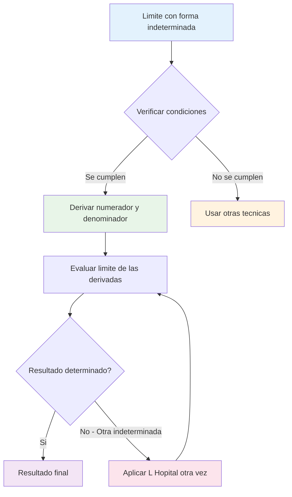
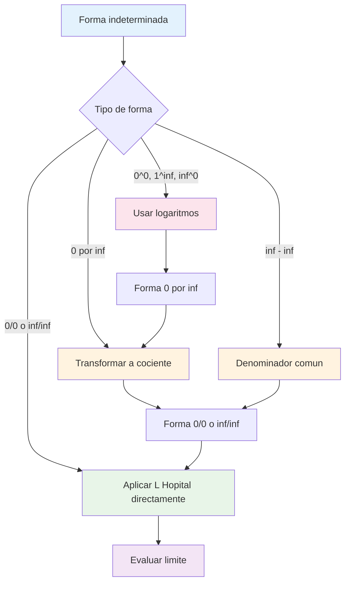

# 🎯 Regla de L'Hôpital

## 🎯 ¿Qué es la Regla de L'Hôpital?

> [!info] 🔍 Definición y Propósito La **Regla de L'Hôpital** es una técnica sistemática para evaluar límites que resultan en **formas indeterminadas**.
> 
> **Principio fundamental:** Si tenemos una forma indeterminada, podemos reemplazar las funciones por sus derivadas y el límite se mantiene.
> 
> $$\text{Si } \lim_{x \to a} \frac{f(x)}{g(x)} \text{ es indeterminada, entonces } \lim_{x \to a} \frac{f(x)}{g(x)} = \lim_{x \to a} \frac{f'(x)}{g'(x)}$$

> [!warning] ⚠️ Importancia Histórica Aunque se llama "Regla de L'Hôpital" por Guillaume de l'Hôpital (1661-1704), **fue desarrollada por Johann Bernoulli**. L'Hôpital la publicó en el primer libro de cálculo de la historia.



## ✅ Condiciones de Aplicación

> [!success] 🎯 Requisitos Obligatorios La Regla de L'Hôpital **SOLO** se puede aplicar cuando se cumplen **TODAS** estas condiciones:
> 
> **1. Forma indeterminada:** El límite debe ser de la forma $\frac{0}{0}$ o $\frac{∞}{∞}$
> 
> **2. Funciones diferenciables:** $f(x)$ y $g(x)$ deben ser diferenciables en un intervalo alrededor de $a$
> 
> **3. Denominador derivado no cero:** $g'(x) ≠ 0$ en un intervalo alrededor de $a$ (excepto posiblemente en $a$)
> 
> **4. Límite de derivadas existe:** $\lim_{x \to a} \frac{f'(x)}{g'(x)}$ debe existir (finito o infinito)

### 📊 Verificación de Condiciones

|Condición|¿Cómo verificar?|Ejemplo|✓/✗|
|---|---|---|---|
|Forma indeterminada|Sustituir directamente|$\lim_{x \to 0} \frac{\sin x}{x} = \frac{0}{0}$|✓|
|Diferenciabilidad|Verificar que existen $f'(x)$ y $g'(x)$|$f(x) = \sin x$, $f'(x) = \cos x$|✓|
|$g'(x) ≠ 0$|Calcular $g'(x)$ y verificar|$g(x) = x$, $g'(x) = 1 ≠ 0$|✓|
|Límite existe|Evaluar $\lim \frac{f'(x)}{g'(x)}$|$\lim_{x \to 0} \frac{\cos x}{1} = 1$|✓|

> [!example] 📝 Verificación Paso a Paso $$\lim_{x \to 0} \frac{e^x - 1}{x}$$
> 
> **Verificación:**
> 
> 1. **Forma:** $\frac{e^0 - 1}{0} = \frac{0}{0}$ ✓
> 2. **Diferenciables:** $f'(x) = e^x$, $g'(x) = 1$ ✓
> 3. **$g'(x) ≠ 0$:** $g'(x) = 1 ≠ 0$ ✓
> 4. **Límite existe:** $\lim_{x \to 0} \frac{e^x}{1} = 1$ ✓
> 
> **Aplicación:** $\lim_{x \to 0} \frac{e^x - 1}{x} = \lim_{x \to 0} \frac{e^x}{1} = 1$

## 🔢 Formas Indeterminadas 0/0

> [!info] 📐 Casos Típicos de 0/0 La forma $\frac{0}{0}$ es la más común y directa para aplicar L'Hôpital.
> 
> **Patrón general:** $$\lim_{x \to a} \frac{f(x)}{g(x)} = \frac{0}{0} \Rightarrow \lim_{x \to a} \frac{f'(x)}{g'(x)}$$

### 📊 Ejemplos Básicos con 0/0

> [!example] 🎯 Casos Fundamentales
> 
> **Ejemplo 1: Polinomios** $$\lim_{x \to 2} \frac{x^2 - 4}{x - 2}$$
> 
> **Solución:**
> 
> - Verificar: $\frac{4-4}{2-2} = \frac{0}{0}$ ✓
> - Derivar: $\frac{d}{dx}(x^2-4) = 2x$, $\frac{d}{dx}(x-2) = 1$
> - Aplicar: $\lim_{x \to 2} \frac{2x}{1} = 4$
> 
> **Ejemplo 2: Exponenciales** $$\lim_{x \to 0} \frac{e^{2x} - 1}{x}$$
> 
> **Solución:**
> 
> - Verificar: $\frac{1-1}{0} = \frac{0}{0}$ ✓
> - Derivar: $\frac{d}{dx}(e^{2x}-1) = 2e^{2x}$, $\frac{d}{dx}(x) = 1$
> - Aplicar: $\lim_{x \to 0} \frac{2e^{2x}}{1} = 2$
> 
> **Ejemplo 3: Trigonométricas** $$\lim_{x \to 0} \frac{\sin(3x)}{\tan(2x)}$$
> 
> **Solución:**
> 
> - Verificar: $\frac{0}{0}$ ✓
> - Derivar: $\frac{d}{dx}\sin(3x) = 3\cos(3x)$, $\frac{d}{dx}\tan(2x) = 2\sec^2(2x)$
> - Aplicar: $\lim_{x \to 0} \frac{3\cos(3x)}{2\sec^2(2x)} = \frac{3 \cdot 1}{2 \cdot 1} = \frac{3}{2}$

### 🔄 Aplicaciones Múltiples de L'Hôpital

> [!tip] ⚡ Cuando Aplicar Varias Veces Si después de aplicar L'Hôpital una vez obtenemos otra forma indeterminada, podemos aplicarlo de nuevo.
> 
> **Regla:** Continuar aplicando hasta obtener un resultado determinado o concluir que el límite no existe.

> [!example] 🎨 Ejemplo con Aplicación Múltiple $$\lim_{x \to 0} \frac{1 - \cos x - \frac{x^2}{2}}{x^4}$$
> 
> **Primera aplicación:**
> 
> - Verificar: $\frac{1-1-0}{0} = \frac{0}{0}$ ✓
> - Derivar: $\frac{d}{dx}(1-\cos x - \frac{x^2}{2}) = \sin x - x$, $\frac{d}{dx}(x^4) = 4x^3$
> - Resultado: $\lim_{x \to 0} \frac{\sin x - x}{4x^3} = \frac{0}{0}$ (otra indeterminada)
> 
> **Segunda aplicación:**
> 
> - Derivar: $\frac{d}{dx}(\sin x - x) = \cos x - 1$, $\frac{d}{dx}(4x^3) = 12x^2$
> - Resultado: $\lim_{x \to 0} \frac{\cos x - 1}{12x^2} = \frac{0}{0}$ (otra indeterminada)
> 
> **Tercera aplicación:**
> 
> - Derivar: $\frac{d}{dx}(\cos x - 1) = -\sin x$, $\frac{d}{dx}(12x^2) = 24x$
> - Resultado: $\lim_{x \to 0} \frac{-\sin x}{24x} = \frac{0}{0}$ (otra indeterminada)
> 
> **Cuarta aplicación:**
> 
> - Derivar: $\frac{d}{dx}(-\sin x) = -\cos x$, $\frac{d}{dx}(24x) = 24$
> - Resultado: $\lim_{x \to 0} \frac{-\cos x}{24} = \frac{-1}{24}$ ✓

## ♾️ Formas Indeterminadas ∞/∞

> [!info] 🚀 Casos con Infinitos La forma $\frac{∞}{∞}$ aparece frecuentemente con:
> 
> - Polinomios de alto grado
> - Funciones exponenciales
> - Límites al infinito
> 
> **L'Hôpital es especialmente útil** para estos casos.

### 📈 Ejemplos con ∞/∞

> [!example] 📊 Casos Típicos
> 
> **Ejemplo 1: Polinomios al infinito** $$\lim_{x \to ∞} \frac{3x^2 + 2x}{2x^2 - x + 1}$$
> 
> **Solución:**
> 
> - Verificar: $\frac{∞}{∞}$ ✓
> - Derivar: $\frac{d}{dx}(3x^2+2x) = 6x+2$, $\frac{d}{dx}(2x^2-x+1) = 4x-1$
> - Aplicar: $\lim_{x \to ∞} \frac{6x+2}{4x-1} = \frac{∞}{∞}$ (otra indeterminada)
> - Segunda aplicación: $\lim_{x \to ∞} \frac{6}{4} = \frac{3}{2}$
> 
> **Ejemplo 2: Exponencial vs Polinomial** $$\lim_{x \to ∞} \frac{e^x}{x^3}$$
> 
> **Solución:**
> 
> - Verificar: $\frac{∞}{∞}$ ✓
> - Primera aplicación: $\lim_{x \to ∞} \frac{e^x}{3x^2} = \frac{∞}{∞}$
> - Segunda aplicación: $\lim_{x \to ∞} \frac{e^x}{6x} = \frac{∞}{∞}$
> - Tercera aplicación: $\lim_{x \to ∞} \frac{e^x}{6} = ∞$
> 
> **Ejemplo 3: Logaritmo vs Polinomial** $$\lim_{x \to ∞} \frac{\ln x}{x}$$
> 
> **Solución:**
> 
> - Verificar: $\frac{∞}{∞}$ ✓
> - Aplicar: $\lim_{x \to ∞} \frac{1/x}{1} = \lim_{x \to ∞} \frac{1}{x} = 0$

### 🔍 Jerarquía de Infinitos

> [!tip] 📊 Orden de Crecimiento (de menor a mayor) $$\ln x \ll x^a \ll e^{bx} \ll x! \ll x^x$$
> 
> **Regla práctica:** Las funciones de la derecha "ganan" sobre las de la izquierda cuando $x \to ∞$

## 🔄 Otras Formas Indeterminadas

> [!warning] 📐 Formas que Requieren Transformación L'Hôpital **NO se aplica directamente** a estas formas. Primero debemos transformarlas a $\frac{0}{0}$ o $\frac{∞}{∞}$.

### 🎭 Formas Indeterminadas Principales

|Forma|Transformación|Método|
|---|---|---|
|$0 \cdot ∞$|$\frac{0}{1/∞}$ o $\frac{∞}{1/0}$|Reescribir como cociente|
|$∞ - ∞$|$∞(1 - \frac{∞}{∞})$|Factor común o denominador común|
|$0^0$|$e^{0 \cdot \ln 0}$|Logaritmo → forma $0 \cdot ∞$|
|$1^∞$|$e^{∞ \cdot \ln 1}$|Logaritmo → forma $∞ \cdot 0$|
|$∞^0$|$e^{0 \cdot \ln ∞}$|Logaritmo → forma $0 \cdot ∞$|

> [!example] 🎯 Ejemplos de Transformación
> 
> **Ejemplo 1: Forma 0 · ∞** $$\lim_{x \to 0^+} x \ln x$$
> 
> **Transformación:** $x \ln x = \frac{\ln x}{1/x}$ (forma $\frac{-∞}{∞}$) **Aplicar L'Hôpital:** $\lim_{x \to 0^+} \frac{1/x}{-1/x^2} = \lim_{x \to 0^+} \frac{x^2}{-x} = \lim_{x \to 0^+} (-x) = 0$
> 
> **Ejemplo 2: Forma ∞ - ∞** $$\lim_{x \to 0^+} \left(\frac{1}{x} - \frac{1}{\sin x}\right)$$
> 
> **Transformación:** $\frac{1}{x} - \frac{1}{\sin x} = \frac{\sin x - x}{x \sin x}$ (forma $\frac{0}{0}$) **Aplicar L'Hôpital:** $\lim_{x \to 0^+} \frac{\cos x - 1}{x \cos x + \sin x} = \frac{-1+1}{0+0} = \frac{0}{0}$ (Requiere más aplicaciones)
> 
> **Ejemplo 3: Forma 1^∞** $$\lim_{x \to ∞} \left(1 + \frac{1}{x}\right)^x$$
> 
> **Transformación:** Sea $y = \left(1 + \frac{1}{x}\right)^x$, entonces $\ln y = x \ln\left(1 + \frac{1}{x}\right)$ **Evaluar:** $\lim_{x \to ∞} x \ln\left(1 + \frac{1}{x}\right)$ (forma $∞ \cdot 0$) **Reescribir:** $\lim_{x \to ∞} \frac{\ln(1 + 1/x)}{1/x}$ (forma $\frac{0}{0}$) **L'Hôpital:** Resultado = 1, por tanto $\lim y = e^1 = e$



## ⚠️ Limitaciones y Precauciones

> [!warning] 🚨 Cuándo NO Usar L'Hôpital
> 
> **1. Forma no indeterminada:** $$\lim_{x \to 0} \frac{\sin x}{1} = \frac{0}{1} = 0$$ (NO necesita L'Hôpital)
> 
> **2. Funciones no diferenciables:** $$\lim_{x \to 0} \frac{|x|}{x}$$ (NO existe derivada en $x = 0$)
> 
> **3. Límite de derivadas no existe:** $$\lim_{x \to ∞} \frac{x + \sin x}{x}$$ (derivadas oscilan sin límite)

### 🔍 Errores Comunes

> [!danger] 🚫 Errores Frecuentes a Evitar
> 
> **1. No verificar condiciones:**
> 
> ```
> INCORRECTO: lim(x→1) (x²)/(x) = lim(x→1) (2x)/(1) = 2
> CORRECTO: lim(x→1) (x²)/(x) = 1²/1 = 1 (sustitucion directa)
> ```
> 
> **2. Aplicar regla del cociente por error:**
> 
> ```
> INCORRECTO: d/dx[f(x)/g(x)] = f'(x)/g'(x)
> CORRECTO: d/dx[f(x)/g(x)] = [f'(x)g(x) - f(x)g'(x)]/[g(x)]²
> ```
> 
> **3. No simplificar antes de derivar:**
> 
> ```
> ANTES: lim(x→0) (sin 2x)/(2x) puede simplificarse sin L'Hôpital
> DESPUÉS: Reconocer como limite fundamental = 1
> ```

### 📊 Cuándo Usar Métodos Alternativos

|Situación|Método Alternativo|Ejemplo|
|---|---|---|
|Límite trigonométrico básico|Límites fundamentales|$\lim_{x \to 0} \frac{\sin x}{x} = 1$|
|Factorización posible|Cancelación algebraica|$\lim_{x \to 2} \frac{x^2-4}{x-2}$|
|Racionalización aplicable|Conjugados|$\lim_{x \to 0} \frac{\sqrt{1+x}-1}{x}$|
|Sustitución trigonométrica|Identidades|$\lim_{x \to 0} \frac{1-\cos x}{x^2}$|

> [!tip] 🎯 Estrategia Óptima **Orden de preferencia:**
> 
> 1. **Sustitución directa** (si no es indeterminada)
> 2. **Técnicas algebraicas** (factorización, racionalización)
> 3. **Límites fundamentales** conocidos
> 4. **L'Hôpital** como último recurso para casos complejos

## 🧠 Técnica de Estudio: Mnemotecnia "VDAE"

> [!tip] 🎓 Método "VDAE" para L'Hôpital
> 
> **V** - **V**erificar forma indeterminada (0/0 o ∞/∞) **D** - **D**erivar numerador y denominador por separado **A** - **A**plicar el límite a las derivadas **E** - **E**valuar o repetir si es necesario
> 
> **Checklist antes de aplicar:**
> 
> - [ ] ¿Es forma 0/0 o ∞/∞?
> - [ ] ¿Son diferenciables f(x) y g(x)?
> - [ ] ¿g'(x) ≠ 0 cerca de a?
> - [ ] ¿Existe el límite de las derivadas?
> 
> **Frase nemotécnica:** _"Verificar, Derivar, Aplicar, Evaluar"_

## 📚 Referencias y Conexiones

> [!quote] 🔗 Enlaces a Otras Notas
> 
> - [[Forma Indeterminadas 0 Sobre 0]] - Métodos alternativos
> - [[Derivadas y Definición Formal]] - Herramienta fundamental para L'Hôpital
> - [[Límites Trigonométricos Fundamentales]] - Casos donde L'Hôpital no es necesario
> - [[Límites al Infinito]] - Contexto para formas ∞/∞
> - [[Logaritmos y Exponenciales]] - Para formas 0^0, 1^∞, ∞^0
> - [[Series de Taylor]] - Método alternativo para casos complejos

## 📖 Notas Recomendadas para Estudio Complementario

> [!info] 📝 Ruta de Aprendizaje Estructurada
> 
> **Prerrequisitos esenciales:**
> 
> 1. **[[Derivadas Básicas]]** - Técnicas de derivación
> 2. **[[Reglas de Derivación]]** - Regla de la cadena, producto, cociente
> 3. **[[Formas Indeterminadas]]** - Conceptos previos
> 
> **Temas paralelos:** 4. **[[Límites Fundamentales]]** - Cuándo NO usar L'Hôpital 5. **[[Derivabilidad y Continuidad]]** - Condiciones de aplicación
> 
> **Aplicaciones avanzadas:** 6. **[[Análisis de Funciones]]** - Comportamiento asintótico 7. **[[Optimización]]** - Máximos y mínimos 8. **[[Series Infinitas]]** - Criterios de convergencia

## 🎯 Ejercicios de Práctica Progresiva

> [!example] 💪 Entrenamiento por Tipos de Indeterminación
> 
> **Nivel 1 - Formas 0/0 Básicas:** 🟢
> 
> - $\lim_{x \to 0} \frac{e^x - 1}{x}$
> - $\lim_{x \to 0} \frac{\ln(1+x)}{x}$
> - $\lim_{x \to 1} \frac{x^2 - 1}{x - 1}$
> 
> **Nivel 2 - Formas ∞/∞:** 🟡
> 
> - $\lim_{x \to ∞} \frac{x^2}{e^x}$
> - $\lim_{x \to ∞} \frac{\ln x}{x}$
> - $\lim_{x \to ∞} \frac{x^3 + 2x}{2x^3 - x^2}$
> 
> **Nivel 3 - Aplicaciones Múltiples:** 🟠
> 
> - $\lim_{x \to 0} \frac{x - \sin x}{x^3}$
> - $\lim_{x \to 0} \frac{e^x - 1 - x}{x^2}$
> - $\lim_{x \to ∞} \frac{x^2 e^{-x}}{1}$ (forma 0 · ∞)
> 
> **Nivel 4 - Formas Complejas:** 🔴
> 
> - $\lim_{x \to 0^+} x^x$ (forma 0^0)
> - $\lim_{x \to ∞} \left(\frac{x}{x+1}\right)^x$ (forma 1^∞)
> - $\lim_{x \to 0^+} \left(\frac{1}{x} - \frac{1}{\sin x}\right)$ (forma ∞ - ∞)
> 
> **Nivel 5 - Casos Especiales:** 🔥
> 
> - $\lim_{x \to 0} \frac{\sin x - x \cos x}{x^3}$
> - $\lim_{x \to ∞} x(\ln(x+1) - \ln x)$
> - $\lim_{x \to 1} \frac{x^{1/(x-1)} - e}{x-1}$

## 🔍 Casos Especiales y Patrones Avanzados

> [!tip] 📊 Reconocimiento de Patrones
> 
> **Patrón 1: Exponenciales vs Polinomios**
> 
> - $e^x$ siempre "gana" sobre $x^n$ cuando $x \to ∞$
> - Requiere $n$ aplicaciones de L'Hôpital para $\frac{e^x}{x^n}$
> 
> **Patrón 2: Logaritmos vs Polinomios**
> 
> - $x^n$ siempre "gana" sobre $\ln x$ cuando $x \to ∞$
> - Una sola aplicación resuelve $\frac{\ln x}{x^n}$
> 
> **Patrón 3: Funciones trigonométricas**
> 
> - Verificar si se pueden usar límites fundamentales antes
> - L'Hôpital útil para combinaciones complejas

---

**Tags:** #matemáticas #cálculo #límites #lhopital #formas-indeterminadas #derivadas #técnicas-avanzadas #análisis-matemático #university #calculus-advanced #resolución-problemas #bernoulli