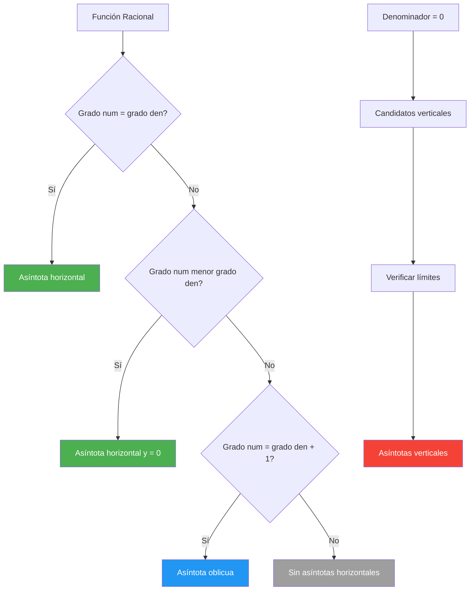

# Asíntotas y Comportamiento 🎯

## Concepto General de Asíntotas

> [!tip] 🎪 Definición Fundamental de Asíntota
> 
> ### ¿Qué es una asíntota?
> 
> Una **asíntota** es una recta a la cual se aproxima indefinidamente una curva sin llegar nunca a tocarla (excepto posiblemente en un número finito de puntos).
> 
> **Interpretación intuitiva:** 📐 "La función se comporta como la recta cuando nos alejamos hacia el infinito o nos acercamos a ciertos puntos problemáticos"
> 
> **Tipos de asíntotas:** 🗂️
> 
> - **Horizontales:** $y = k$ (comportamiento en $\pm\infty$)
> - **Verticales:** $x = a$ (comportamiento cerca de discontinuidades)
> - **Oblicuas:** $y = mx + b$ (comportamiento lineal asintótico)
> 
> **Mnemotecnia:** "**H**orizontal **V**ertical **O**blicua = **HVO** (como 'hablo')"

## Asíntotas Horizontales

> [!info] ➡️ Asíntotas Horizontales
> 
> ### Definición y criterios
> 
> La recta $y = L$ es **asíntota horizontal** de $f(x)$ si: $$\lim_{x \to +\infty} f(x) = L \quad \text{o} \quad \lim_{x \to -\infty} f(x) = L$$
> 
> **Casos posibles:** 📊
> 
> - **Misma asíntota:** $\lim_{x \to +\infty} f(x) = \lim_{x \to -\infty} f(x) = L$
> - **Asíntotas diferentes:** $\lim_{x \to +\infty} f(x) = L_1$, $\lim_{x \to -\infty} f(x) = L_2$
> - **Solo una asíntota:** Uno de los límites existe, el otro no
> - **Sin asíntotas horizontales:** Ningún límite existe o es infinito
> 
> |Comportamiento|Límite en $+\infty$|Límite en $-\infty$|Asíntotas|
> |---|---|---|---|
> |**Estable**|$L$|$L$|Una: $y = L$ ➡️|
> |**Bifurcado**|$L_1$|$L_2$|Dos: $y = L_1$, $y = L_2$ ↔️|
> |**Parcial**|$L$|$\pm\infty$|Una: $y = L$ (solo un lado) ⚡|
> |**Explosivo**|$\pm\infty$|$\pm\infty$|Ninguna 💥|

> [!warning] 🔍 Técnicas para Encontrar Asíntotas Horizontales
> 
> ### Análisis según el tipo de función
> 
> **1. Funciones racionales** $f(x) = \frac{P(x)}{Q(x)}$ donde $P$ y $Q$ son polinomios:
> 
> - **Si $\deg P < \deg Q$:** $y = 0$
> - **Si $\deg P = \deg Q$:** $y = \frac{a_n}{b_n}$ (coeficientes principales)
> - **Si $\deg P > \deg Q$:** No hay asíntota horizontal
> 
> **2. Funciones exponenciales:**
> 
> - $\lim_{x \to +\infty} e^x = +\infty$, $\lim_{x \to -\infty} e^x = 0$ → $y = 0$
> - $\lim_{x \to +\infty} e^{-x} = 0$, $\lim_{x \to -\infty} e^{-x} = +\infty$ → $y = 0$
> 
> **3. Funciones trigonométricas acotadas:**
> 
> - $\lim_{x \to \pm\infty} \frac{\sin x}{x} = 0$ → $y = 0$
> - $\sin x$, $\cos x$ no tienen asíntotas (oscilan)

> [!tip] 🎯 Ejemplos Paso a Paso
> 
> ### Casos representativos
> 
> **Ejemplo 1:** $f(x) = \frac{3x^2 + 2x - 1}{x^2 - 4}$
> 
> - Grados iguales: $\deg P = \deg Q = 2$
> - Asíntota: $y = \frac{3}{1} = 3$ ✅
> 
> **Ejemplo 2:** $f(x) = \frac{2x - 1}{x^2 + 1}$
> 
> - $\deg P = 1 < \deg Q = 2$
> - Asíntota: $y = 0$ ✅
> 
> **Ejemplo 3:** $f(x) = 2 + \frac{3}{x}$
> 
> - $\lim_{x \to \pm\infty} \left(2 + \frac{3}{x}\right) = 2$
> - Asíntota: $y = 2$ ✅
> 
> **Ejemplo 4:** $f(x) = x \cdot e^{-x}$
> 
> - $\lim_{x \to +\infty} x e^{-x} = 0$ (exponencial domina)
> - $\lim_{x \to -\infty} x e^{-x} = 0$ (producto negativo × positivo muy grande)
> - Asíntota: $y = 0$ ✅

## Asíntotas Verticales

> [!warning] ↕️ Asíntotas Verticales
> 
> ### Definición y detección
> 
> La recta $x = a$ es **asíntota vertical** de $f(x)$ si al menos uno de estos límites es infinito: $$\lim_{x \to a^-} f(x) = \pm\infty \quad \text{o} \quad \lim_{x \to a^+} f(x) = \pm\infty$$
> 
> **Tipos de comportamiento:** 🎢
> 
> |Límites laterales|Tipo de asíntota|Comportamiento|
> |---|---|---|
> |$+\infty$, $+\infty$|Vertical simple|Ambos lados suben ⬆️⬆️|
> |$-\infty$, $-\infty$|Vertical simple|Ambos lados bajan ⬇️⬇️|
> |$+\infty$, $-\infty$|Vertical con salto|Un lado sube, otro baja ⬆️⬇️|
> |$-\infty$, $+\infty$|Vertical con salto|Un lado baja, otro sube ⬇️⬆️|
> 
> **Fuentes comunes de asíntotas verticales:** 🔍
> 
> - Denominadores que se anulan
> - Logaritmos de expresiones que tienden a 0⁺
> - Tangentes en múltiplos impares de $\frac{\pi}{2}$
> - Raíces con exponentes negativos

> [!info] 🕵️ Algoritmo de Búsqueda
> 
> ### Pasos sistemáticos para encontrar asíntotas verticales
> 
> **Proceso completo:**
> 
> 1. **Identificar candidatos:** Valores donde $f(x)$ no está definida
> 2. **Verificar discontinuidad:** Confirmar que no son discontinuidades evitables
> 3. **Calcular límites laterales:** $\lim_{x \to a^-} f(x)$ y $\lim_{x \to a^+} f(x)$
> 4. **Clasificar comportamiento:** Según la tabla anterior
> 5. **Verificar mediante gráfica:** Confirmar el comportamiento visualmente
> 
> **Casos especiales a considerar:** ⚠️
> 
> - **Discontinuidades evitables:** No generan asíntotas verticales
> - **Funciones definidas por partes:** Verificar cada rama
> - **Composiciones:** Analizar función interna y externa por separado

> [!tip] 🎪 Ejemplos Detallados
> 
> ### Análisis completo de casos típicos
> 
> **Ejemplo 1:** $f(x) = \frac{1}{x - 2}$
> 
> - Candidato: $x = 2$ (denominador se anula)
> - $\lim_{x \to 2^-} \frac{1}{x-2} = -\infty$
> - $\lim_{x \to 2^+} \frac{1}{x-2} = +\infty$
> - **Asíntota vertical:** $x = 2$ (con salto) ✅
> 
> **Ejemplo 2:** $f(x) = \frac{x^2}{(x-1)^2}$
> 
> - Candidato: $x = 1$
> - $\lim_{x \to 1^-} \frac{x^2}{(x-1)^2} = +\infty$
> - $\lim_{x \to 1^+} \frac{x^2}{(x-1)^2} = +\infty$
> - **Asíntota vertical:** $x = 1$ (simple) ✅
> 
> **Ejemplo 3:** $f(x) = \ln(x - 3)$
> 
> - Candidato: $x = 3$ (argumento del logaritmo se anula)
> - $\lim_{x \to 3^+} \ln(x-3) = -\infty$
> - No existe límite por la izquierda (dominio: $x > 3$)
> - **Asíntota vertical:** $x = 3$ (unilateral) ✅
> 
> **Contraejemplo:** $f(x) = \frac{x^2 - 4}{x - 2} = \frac{(x-2)(x+2)}{x-2} = x + 2$ (para $x \neq 2$)
> 
> - En $x = 2$: discontinuidad evitable, NO asíntota vertical ❌

## Asíntotas Oblicuas

> [!info] ↗️ Asíntotas Oblicuas
> 
> ### Definición y condiciones de existencia
> 
> La recta $y = mx + b$ es **asíntota oblicua** de $f(x)$ si: $$\lim_{x \to \pm\infty} [f(x) - (mx + b)] = 0$$
> 
> **Condición necesaria:** 📋 No debe existir asíntota horizontal (es decir, $\lim_{x \to \pm\infty} f(x) = \pm\infty$)
> 
> **Fórmulas para calcular $m$ y $b$:** 🧮 $$m = \lim_{x \to \pm\infty} \frac{f(x)}{x}$$ $$b = \lim_{x \to \pm\infty} [f(x) - mx]$$
> 
> **Jerarquía de asíntotas:** 🏆
> 
> 1. Si existe asíntota horizontal → No hay oblicua
> 2. Si no existe asíntota horizontal → Buscar oblicua
> 3. Una función puede tener máximo una asíntota oblicua por cada dirección ($+\infty$ y $-\infty$)

> [!warning] 🎯 Proceso de Cálculo
> 
> ### Algoritmo paso a paso
> 
> **Para encontrar asíntota oblicua en $x \to +\infty$:**
> 
> 4. **Verificar ausencia de asíntota horizontal:** $\lim_{x \to +\infty} f(x) = \pm\infty$
> 5. **Calcular la pendiente:** $m = \lim_{x \to +\infty} \frac{f(x)}{x}$
> 6. **Si $m$ existe y es finita:** $b = \lim_{x \to +\infty} [f(x) - mx]$
> 7. **Si $b$ existe y es finita:** La asíntota es $y = mx + b$
> 8. **Repetir para $x \to -\infty$ si es necesario**
> 
> **Casos especiales:** ⚠️
> 
> - Si $m = 0$: Tenemos asíntota horizontal $y = b$
> - Si $m = \pm\infty$: No hay asíntota oblicua
> - Si $b = \pm\infty$: No hay asíntota oblicua

> [!tip] 🔬 Ejemplos Completos
> 
> ### Análisis detallado de funciones
> 
> **Ejemplo 1:** $f(x) = \frac{x^2 + x + 1}{x + 1}$
> 
> _Paso 1:_ Verificar ausencia de asíntota horizontal
> 
> - $\lim_{x \to \pm\infty} f(x) = \pm\infty$ ✅
> 
> _Paso 2:_ Calcular $m$ $$m = \lim_{x \to +\infty} \frac{x^2 + x + 1}{x(x + 1)} = \lim_{x \to +\infty} \frac{x^2 + x + 1}{x^2 + x} = 1$$
> 
> _Paso 3:_ Calcular $b$ $$b = \lim_{x \to +\infty} \left[\frac{x^2 + x + 1}{x + 1} - x\right] = \lim_{x \to +\infty} \frac{x^2 + x + 1 - x(x + 1)}{x + 1} = \lim_{x \to +\infty} \frac{1}{x + 1} = 0$$
> 
> **Asíntota oblicua:** $y = x$ ✅
> 
> **Ejemplo 2:** $f(x) = x + \frac{2}{x}$
> 
> _Calculamos directamente:_ $$m = \lim_{x \to \pm\infty} \frac{x + \frac{2}{x}}{x} = \lim_{x \to \pm\infty} \left(1 + \frac{2}{x^2}\right) = 1$$ $$b = \lim_{x \to \pm\infty} \left[x + \frac{2}{x} - x\right] = \lim_{x \to \pm\infty} \frac{2}{x} = 0$$
> 
> **Asíntota oblicua:** $y = x$ ✅

## Gráficas de Funciones

> [!tip] 📊 Análisis Completo de Funciones
> 
> ### Metodología sistemática para graficar
> 
>```mermaid
flowchart TD
   A["Función f(x)"] --> B["Dominio y Rango"]
   B --> C["Interceptos"]
   C --> D["Simetrías"]
   D --> E["Asíntotas"]
   E --> F["Derivada f(x)"]
   F --> G["Crecimiento y Extremos"]
   G --> H["Segunda Derivada f(x)"]
   H --> I["Concavidad e Inflexión"]
   I --> J["Gráfica Final"]
   E --> K["Horizontales"]
   E --> L["Verticales"] 
   E --> M["Oblicuas"]
   style J fill:#4caf50,color:#fff
   style E fill:#ff9800,color:#fff
   style K fill:#2196f3,color:#fff
   style L fill:#f44336,color:#fff
   style M fill:#9c27b0,color:#fff

   
> [!info] 🎨 Pasos para Construcción de Gráficas
> 
> ### Lista de verificación completa
> 
> **1. Análisis preliminar** 📋
> 
> - **Dominio:** ¿Dónde está definida la función?
> - **Rango:** ¿Qué valores puede tomar?
> - **Interceptos:** Con ejes $x$ e $y$
> - **Simetrías:** Par, impar, periódica
> 
> **2. Comportamiento asintótico** 🎯
> 
> - **Asíntotas verticales:** Denominadores = 0, discontinuidades
> - **Asíntotas horizontales:** Límites en $\pm\infty$
> - **Asíntotas oblicuas:** Si no hay horizontales
> 
> **3. Análisis con derivadas** 📈
> 
> - **Primera derivada:** Crecimiento, decrecimiento, extremos
> - **Segunda derivada:** Concavidad, puntos de inflexión
> 
> **4. Puntos especiales** ⭐
> 
> - **Máximos y mínimos locales:** $f'(x) = 0$
> - **Puntos de inflexión:** $f''(x) = 0$ y cambio de signo
> - **Puntos críticos:** Donde $f'$ no existe
> 
> |Aspecto|Herramienta|Información obtenida|
> |---|---|---|
> |**Dominio**|Análisis algebraico|Restricciones de $x$ 🔒|
> |**Asíntotas**|Límites|Comportamiento límite 🎯|
> |**Monotonía**|$f'(x)$|Crecimiento/decrecimiento 📈📉|
> |**Extremos**|$f'(x) = 0$|Máximos y mínimos 🏔️🕳️|
> |**Concavidad**|$f''(x)$|Curvatura de la función 🌙|
> |**Inflexión**|$f''(x) = 0$|Cambios de concavidad 🔄|

> [!warning] 🎪 Ejemplo Integrador Completo
> 
> ### Análisis de $f(x) = \frac{x^2}{x^2 - 4}$
> 
> **1. Dominio y puntos problemáticos:**
> 
> - Dominio: $\mathbb{R} \setminus {-2, 2}$
> - Candidatos a asíntotas verticales: $x = -2, x = 2$
> 
> **2. Asíntotas verticales:**
> 
> - $\lim_{x \to 2^{\pm}} \frac{x^2}{x^2 - 4} = \lim_{x \to 2^{\pm}} \frac{4}{0^{\mp}} = \pm\infty$
> - $\lim_{x \to (-2)^{\pm}} \frac{x^2}{x^2 - 4} = \lim_{x \to (-2)^{\pm}} \frac{4}{0^{\mp}} = \pm\infty$
> - **Asíntotas verticales:** $x = -2$ y $x = 2$ ✅
> 
> **3. Asíntotas horizontales:**
> 
> - $\lim_{x \to \pm\infty} \frac{x^2}{x^2 - 4} = \lim_{x \to \pm\infty} \frac{1}{1 - \frac{4}{x^2}} = 1$
> - **Asíntota horizontal:** $y = 1$ ✅
> 
> **4. Interceptos:**
> 
> - Con $y$: $f(0) = \frac{0}{-4} = 0$ → $(0,0)$
> - Con $x$: $f(x) = 0$ → $x^2 = 0$ → $x = 0$ → $(0,0)$
> 
> **5. Simetría:**
> 
> - $f(-x) = \frac{(-x)^2}{(-x)^2 - 4} = \frac{x^2}{x^2 - 4} = f(x)$
> - **Función par:** simétrica respecto al eje $y$ ✅
> 
> **6. Análisis con derivadas:** $$f'(x) = \frac{2x(x^2 - 4) - x^2(2x)}{(x^2 - 4)^2} = \frac{-8x}{(x^2 - 4)^2}$$
> 
> - $f'(x) = 0$ cuando $x = 0$ (mínimo local)
> - $f'(x) > 0$ cuando $x < 0$ (creciente)
> - $f'(x) < 0$ cuando $x > 0$ (decreciente)



## Técnica de Estudio: Método GRAPH

> [!tip] 📖 Estrategia GRAPH para Análisis de Funciones
> 
> - **G**ráfica preliminar: Esboza el comportamiento general
> - **R**estricciones: Identifica dominio y puntos problemáticos
> - **A**síntotas: Encuentra todas las asíntotas (H, V, O)
> - **P**untos clave: Interceptos, extremos, inflexiones
> - **H**erramientas: Usa derivadas para análisis completo
> 
> **Regla mnemotécnica para asíntotas:** "**H**orizontal **V**ertical **O**blicua = **HVO** (como 'hablo')"
> 
> **Para recordar el orden de búsqueda:** "**P**rimero **H**orizontales, **L**uego **V**erticales, **F**inalmente **O**blicuas = **PHLFO**"
> 
> **Tipos de límites infinitos:** "**S**ube **S**ube, **B**aja **B**aja, **S**ube **B**aja, **B**aja **S**ube = **SSBB-SB-BS**"

## Referencias

> [!quote] Enlaces a otras notas
> 
> - [[Límites al Infinito]] - Base teórica para asíntotas horizontales
> - [[Límites Laterales]] - Fundamental para asíntotas verticales
> - [[Funciones Racionales]] - Tipo más común con asíntotas
> - [[Derivadas y Gráficas]] - Análisis completo de funciones
> - [[Continuidad]] - Relación con discontinuidades
> - [[Optimización]] - Aplicación de extremos y comportamiento

## Notas Recomendadas

> [!info] 🎓 Prerrequisitos y Complementos
> 
> **Prerrequisitos necesarios:**
> 
> - [[Límites Básicos]] - Cálculo de límites en general
> - [[Límites al Infinito]] - Para asíntotas horizontales y oblicuas
> - [[Límites Laterales]] - Para asíntotas verticales
> - [[Funciones y Dominio]] - Análisis de restricciones
> - [[Algebra de Polinomios]] - Para funciones racionales
> 
> **Para profundizar:**
> 
> - [[Análisis Completo de Funciones]] - Integración con derivadas
> - [[Funciones Trascendentes]] - Asíntotas en exponenciales y logaritmos
> - [[Cálculo Diferencial Avanzado]] - Técnicas de graficación
> - [[Geometría Analítica]] - Ecuaciones de rectas asintóticas
> - [[Aplicaciones del Cálculo]] - Modelado con funciones asintóticas
> - [[Software Matemático]] - Verificación gráfica con tecnología

---

**Tags:** #asintotas #limites #graficas #funciones-racionales #comportamiento-asintotico #analisis-funciones #calculo #geometria-analitica #limites-infinito #discontinuidades