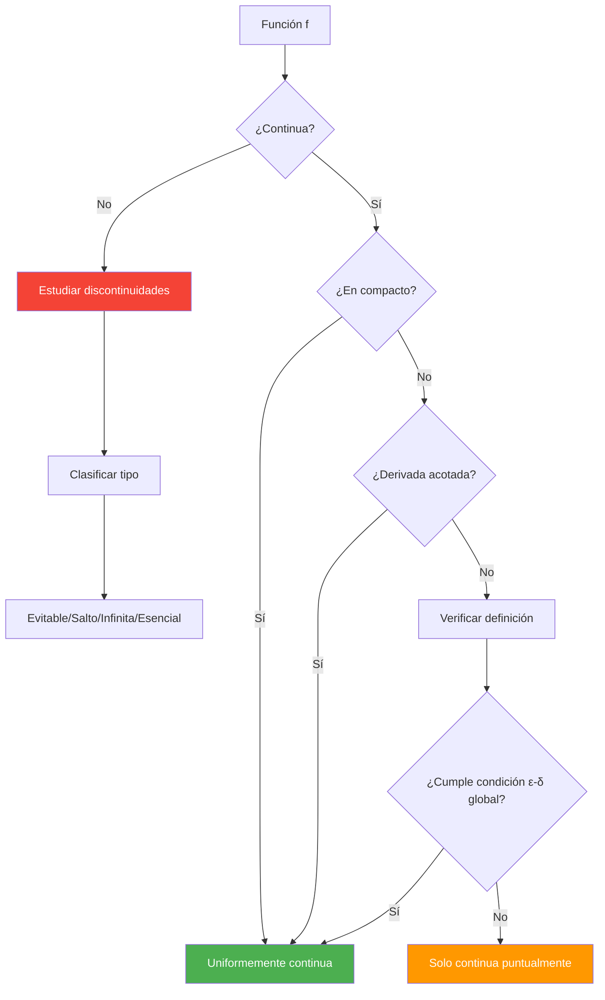

# Continuidad y Límites 🔗

## Definición de Continuidad

> [!tip] 🎯 Concepto Fundamental de Continuidad
> 
> ### Definición formal (epsilon-delta)
> 
> Una función $f(x)$ es **continua** en un punto $x = a$ si: $$\forall \varepsilon > 0, \exists \delta > 0 : |x - a| < \delta \Rightarrow |f(x) - f(a)| < \varepsilon$$
> 
> **Interpretación intuitiva:** 🎪 "Pequeños cambios en $x$ producen pequeños cambios en $f(x)$"
> 
> **Condiciones equivalentes para continuidad en $a$:**
> 
> 1. $\lim_{x \to a} f(x) = f(a)$
> 2. $\lim_{x \to a^-} f(x) = \lim_{x \to a^+} f(x) = f(a)$
> 3. Para toda sucesión $(x_n) \to a$: $f(x_n) \to f(a)$

> [!info] 📊 Álgebra de Funciones Continuas
> 
> ### Propiedades operacionales
> 
> Si $f$ y $g$ son continuas en $x = a$, entonces también son continuas:
> 
> |Operación|Fórmula|Condición|
> |---|---|---|
> |**Suma**|$(f + g)(x) = f(x) + g(x)$|Siempre ✅|
> |**Producto**|$(f \cdot g)(x) = f(x) \cdot g(x)$|Siempre ✅|
> |**Cociente**|$\left(\frac{f}{g}\right)(x) = \frac{f(x)}{g(x)}$|Si $g(a) \neq 0$ ⚠️|
> |**Composición**|$(f \circ g)(x) = f(g(x))$|Si $g$ continua en $a$ y $f$ continua en $g(a)$ 🔗|
> |**Valor absoluto**|$|f|
> 
> **Mnemotecnia:** "**S**uma **P**roducto **C**ociente **C**omposición **A**bsoluto = **SPCCA**"

## Tipos de Discontinuidades

> [!warning] 🚫 Clasificación de Discontinuidades
> 
> ### Taxonomía completa de discontinuidades
> 
> ```mermaid
> flowchart TD
>    A[Discontinuidad en x = a] --> B[Evitable/Removible]
>    A --> C[No Evitable]
>    
>    C --> D[Salto Finito]
>    C --> E[Salto Infinito]
>    C --> F[Esencial/Oscilante]
>    
>    B --> G["límite existe pero ≠ f(a)"]
>    D --> H["Límites laterales finitos pero distintos"]
>    E --> I["Al menos un límite lateral infinito"]
>    F --> J["Límite no existe por oscilación"]
>    
>    style A fill:#f44336,color:#fff
>    style B fill:#4caf50,color:#fff
>    style C fill:#ff9800,color:#fff
>    style D fill:#2196f3,color:#fff
>    style E fill:#9c27b0,color:#fff
>    style F fill:#607d8b,color:#fff
> ```

> [!info] 📈 Ejemplos de Cada Tipo
> 
> ### 1. **Discontinuidad Evitable** 🔧
> 
> $$f(x) = \begin{cases} \frac{\sin x}{x} & \text{si } x \neq 0 \ 0 & \text{si } x = 0 \end{cases}$$
> 
> - $\lim_{x \to 0} f(x) = 1$ pero $f(0) = 0$
> - **Se puede "arreglar"** redefiniendo $f(0) = 1$
> 
> ### 2. **Discontinuidad de Salto** 🦘
> 
> $$f(x) = \begin{cases} x + 1 & \text{si } x < 0 \ x + 2 & \text{si } x \geq 0 \end{cases}$$
> 
> - $\lim_{x \to 0^-} f(x) = 1$, $\lim_{x \to 0^+} f(x) = 2$
> - **Salto:** $2 - 1 = 1$
> 
> ### 3. **Discontinuidad Infinita** ♾️
> 
> $$f(x) = \frac{1}{x}$$
> 
> - $\lim_{x \to 0^-} f(x) = -\infty$, $\lim_{x \to 0^+} f(x) = +\infty$
> - **Asíntota vertical** en $x = 0$
> 
> ### 4. **Discontinuidad Esencial** 〰️
> 
> $$f(x) = \sin\left(\frac{1}{x}\right)$$
> 
> - $\lim_{x \to 0} f(x)$ **no existe** por oscilación infinita
> - La función oscila entre $-1$ y $1$ infinitamente rápido

> [!tip] 🔍 Detección de Discontinuidades
> 
> ### Algoritmo sistemático
> 
> **Pasos para analizar continuidad en $x = a$:**
> 
> 1. **Verificar dominio:** ¿Está $a$ en el dominio de $f$?
> 2. **Calcular límites laterales:** $\lim_{x \to a^-} f(x)$ y $\lim_{x \to a^+} f(x)$
> 3. **Comparar:** ¿Son iguales los límites laterales?
> 4. **Evaluar función:** ¿Qué vale $f(a)$?
> 5. **Decidir tipo:** Según la tabla de clasificación
> 
> **Regla mnemotécnica:** "**D**ominio **L**ímites **C**omparar **E**valuar **D**ecidir = **DLCED**"

## Teorema del Valor Intermedio

> [!warning] 🌉 Teorema del Valor Intermedio (TVI)
> 
> ### Enunciado del teorema
> 
> Si $f$ es **continua** en $[a,b]$ y $k$ es un valor entre $f(a)$ y $f(b)$, entonces: $$\exists c \in (a,b) : f(c) = k$$
> 
> **Versión geométrica:** 📐 Una función continua que conecta dos puntos debe pasar por todos los valores intermedios
> 
> ```mermaid
> graph LR
>    A["f(a)"] --> B["k"] --> C["f(b)"]
>    D[a] --> E[c] --> F[b]
>    
>    A -.-> D
>    B -.-> E
>    C -.-> F
>    
>    style B fill:#4caf50,color:#fff
>    style E fill:#4caf50,color:#fff
> ```
> 
> **Condiciones necesarias:** ⚠️
> 
> 1. $f$ continua en $[a,b]$
> 2. $k \in [\min{f(a),f(b)}, \max{f(a),f(b)}]$

> [!info] 🎯 Aplicaciones del TVI
> 
> ### Aplicación 1: Existencia de Raíces
> 
> Para demostrar que $f(x) = 0$ tiene solución en $(a,b)$:
> 
> - Verificar que $f$ es continua en $[a,b]$
> - Mostrar que $f(a) \cdot f(b) < 0$ (signos opuestos)
> 
> **Ejemplo:** $f(x) = x^3 + x - 1$
> 
> - $f(0) = -1 < 0$
> - $f(1) = 1 > 0$
> - Por TVI: $\exists c \in (0,1) : f(c) = 0$ ✅
> 
> ### Aplicación 2: Ecuaciones Trigonométricas
> 
> Demostrar que $\cos x = x$ tiene solución:
> 
> - $g(x) = \cos x - x$ continua en $[0, \pi/2]$
> - $g(0) = 1 > 0$, $g(\pi/2) = -\pi/2 < 0$
> - Por TVI: existe la intersección 🎯
> 
> ### Aplicación 3: Problema de la Renta
> 
> Si el salario varía continuamente de $1000 a $5000, entonces existe alguien que gana exactamente $3000 💰

## Continuidad Uniforme

> [!tip] 🌐 Continuidad Uniforme vs Puntual
> 
> ### Definición de continuidad uniforme
> 
> $f$ es **uniformemente continua** en $A$ si: $$\forall \varepsilon > 0, \exists \delta > 0 : \forall x,y \in A, |x-y| < \delta \Rightarrow |f(x)-f(y)| < \varepsilon$$
> 
> **Diferencia clave:** 🔑
> 
> - **Continuidad puntual:** $\delta$ puede depender de $x$ 📍
> - **Continuidad uniforme:** $\delta$ funciona para **todos** los puntos 🌍
> 
> |Tipo|Delta depende de|Ámbito|Fortaleza|
> |---|---|---|---|
> |**Puntual**|$x$ y $\varepsilon$|Local 📍|Más débil|
> |**Uniforme**|Solo $\varepsilon$|Global 🌐|Más fuerte|

> [!warning] ⚡ Teorema de Heine-Cantor
> 
> ### Resultado fundamental
> 
> **Toda función continua en un compacto es uniformemente continua**
> 
> **En particular:** Si $f$ es continua en $[a,b]$ (cerrado y acotado), entonces $f$ es uniformemente continua en $[a,b]$
> 
> **Contraejemplo en intervalo abierto:** $$f(x) = \frac{1}{x} \text{ en } (0,1)$$
> 
> - Es continua en cada punto de $(0,1)$ ✅
> - **NO** es uniformemente continua ❌
> - Cerca de $x = 0$, la función "crece muy rápido"

> [!info] 🔬 Criterios y Ejemplos
> 
> ### Criterio de la Derivada
> 
> Si $f$ es derivable en $(a,b)$ y $f'$ está acotada, entonces $f$ es uniformemente continua
> 
> **Demostración:** Por el Teorema del Valor Medio $$|f(x) - f(y)| = |f'(c)||x - y| \leq M|x - y|$$ donde $M = \sup |f'(x)|$
> 
> ### Ejemplos Comparativos
> 
> |Función|Intervalo|¿Uniformemente continua?|Razón|
> |---|---|---|---|
> |$f(x) = x^2$|$\mathbb{R}$|❌ No|$f'(x) = 2x$ no acotada|
> |$f(x) = x^2$|$[0,10]$|✅ Sí|Compacto + continua|
> |$f(x) = \sin x$|$\mathbb{R}$|✅ Sí|$|
> |$f(x) = \frac{1}{x}$|$(0,1]$|❌ No|No acotada cerca de 0|
> |$f(x) = \sqrt{x}$|$[0,\infty)$|✅ Sí|$f'(x) = \frac{1}{2\sqrt{x}}$ controlable|



## Técnica de Estudio: Método TRACE

> [!tip] 📖 Estrategia TRACE para Continuidad
> 
> - **T**ipo: Identifica el tipo de función y discontinuidades
> - **R**ango: Determina el intervalo de estudio
> - **A**nálisis: Examina límites y valores de la función
> - **C**lasifica: Categoriza continuidad (puntual/uniforme)
> - **E**jemplos: Construye contraejemplos si es necesario
> 
> **Regla mnemotécnica para discontinuidades:** "**E**vitable **S**alto **I**nfinita **E**sencial = **ESIE** (como 'así es')"
> 
> **Para recordar TVI:** "**C**ontinua **I**ntermedia **V**alor **A**lcanza = **CIVA**"

## Referencias

> [!quote] Enlaces a otras notas
> 
> - [[Límites de Funciones]] - Base conceptual para continuidad
> - [[Derivabilidad]] - Relación entre continuidad y diferenciabilidad
> - [[Teorema de Weierstrass]] - Continuidad en compactos
> - [[Topología]] - Conceptos de abierto, cerrado y compacto
> - [[Funciones Reales]] - Propiedades generales de funciones
> - [[Método de Bisección]] - Aplicación computacional del TVI

## Notas Recomendadas

> [!info] 🎓 Prerrequisitos y Complementos
> 
> **Prerrequisitos necesarios:**
> 
> - [[Límites Básicos]] - Concepto de límite y límites laterales
> - [[Dominio y Rango]] - Conceptos básicos de funciones
> - [[Intervalos y Conjuntos]] - Notación de intervalos
> - [[Desigualdades]] - Manipulación de desigualdades con valor absoluto
> 
> **Para profundizar:**
> 
> - [[Espacios Métricos]] - Generalización de continuidad uniforme
> - [[Compacidad]] - Teoremas de Heine-Borel y Heine-Cantor
> - [[Conexidad]] - Generalización del Teorema del Valor Intermedio
> - [[Análisis Funcional]] - Continuidad en espacios más generales
> - [[Ecuaciones Diferenciales]] - TVI en existencia de soluciones
> - [[Análisis Numérico]] - Algoritmos basados en continuidad

---

**Tags:** #continuidad #limites #discontinuidades #valor-intermedio #continuidad-uniforme #analisis-real #calculo #topologia #compacidad #teoremas-fundamentales