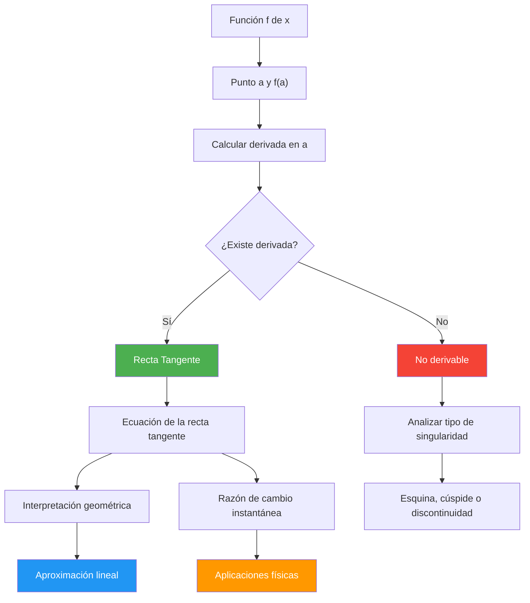

# Límite de la Razón de Cambio 📐

## Definición de Derivada como Límite

> [!tip] 🎯 Definición Fundamental de la Derivada
> 
> ### Definición formal usando límites
> 
> La **derivada** de una función $f(x)$ en el punto $x = a$ se define como: $$f'(a) = \lim_{h \to 0} \frac{f(a+h) - f(a)}{h}$$
> 
> **Notaciones equivalentes:** 📝
> 
> - $f'(a)$ (notación de Lagrange)
> - $\frac{df}{dx}\bigg|_{x=a}$ (notación de Leibniz)
> - $D_x f(a)$ (notación de operador)
> - $\dot{f}(a)$ (notación de Newton para tiempo)
> 
> **Interpretación del cociente:** 🔍 $$\frac{f(a+h) - f(a)}{h} = \frac{\text{Cambio en } f}{\text{Cambio en } x} = \text{Razón de cambio promedio}$$

> [!info] 📊 Formas Alternativas de la Definición
> 
> ### Variaciones equivalentes del límite
> 
> |Forma|Definición|Cuándo usar|
> |---|---|---|
> |**Estándar**|$\lim_{h \to 0} \frac{f(a+h) - f(a)}{h}$|Derivada en un punto específico 🎯|
> |**Variable móvil**|$\lim_{x \to a} \frac{f(x) - f(a)}{x - a}$|Análisis del comportamiento cerca de $a$ 📈|
> |**General**|$\lim_{h \to 0} \frac{f(x+h) - f(x)}{h}$|Función derivada $f'(x)$ 🌐|
> |**Bilateral**|Si existen y son iguales los límites laterales|Verificar derivabilidad ⚖️|
> 
> **Condición de existencia:** El límite debe existir y ser finito ✅
> 
> **Mnemotecnia:** "**C**ambio **D**ividido **T**iende = **CDT** (Cociente Diferencial al Tendiente)"

> [!warning] ⚠️ Formas Indeterminadas en Derivadas
> 
> ### Resolución de indeterminaciones
> 
> Cuando aplicamos la definición, frecuentemente obtenemos la forma $\frac{0}{0}$:
> 
> **Estrategias de resolución:**
> 
> 1. **Factorización:** $\frac{f(a+h) - f(a)}{h} = \frac{(h \cdot g(h))}{h} = g(h)$
> 2. **Conjugado:** Para raíces cuadradas
> 3. **Identidades trigonométricas:** Para funciones trigonométricas
> 4. **L'Hôpital:** Como verificación (no como definición)
> 
> **Ejemplo típico:** $f(x) = x^2$, $a = 3$ $$f'(3) = \lim_{h \to 0} \frac{(3+h)^2 - 9}{h} = \lim_{h \to 0} \frac{9 + 6h + h^2 - 9}{h} = \lim_{h \to 0} (6 + h) = 6$$

## Interpretación Geométrica

> [!info] 📐 Visualización Geométrica de la Derivada
> 
> ### De la secante a la tangente
> 
> ```mermaid
> graph TD
>    A[Puntos P y Q en la curva] --> B[Recta secante PQ]
>    B --> C[Q se acerca a P]
>    C --> D[Secante se convierte en tangente]
>    D --> E[Pendiente = f'(a)]
>    
>    F[Razón de cambio promedio] --> G[Razón de cambio instantánea]
>    
>    style D fill:#4caf50,color:#fff
>    style E fill:#4caf50,color:#fff
>    style G fill:#ff9800,color:#fff
> ```
> 
> **Proceso geométrico:** 🎪
> 
> 1. **Punto fijo:** $P = (a, f(a))$ en la curva
> 2. **Punto móvil:** $Q = (a+h, f(a+h))$ en la curva
> 3. **Recta secante:** Pasa por $P$ y $Q$
> 4. **Límite:** Cuando $h \to 0$, $Q \to P$ y la secante se convierte en **tangente**

> [!tip] 🎯 Pendiente de Rectas Secantes
> 
> ### Análisis del comportamiento límite
> 
> **Pendiente de la secante PQ:** $$m_{sec} = \frac{f(a+h) - f(a)}{(a+h) - a} = \frac{f(a+h) - f(a)}{h}$$
> 
> **Cuando $h \to 0$:** $$m_{tan} = \lim_{h \to 0} m_{sec} = f'(a)$$
> 
> |Valor de $h$|Interpretación|Tipo de recta|
> |---|---|---|
> |$h \neq 0$|Razón promedio|Secante 📏|
> |$h \to 0^+$|Límite derecho|Tangente derecha ↗️|
> |$h \to 0^-$|Límite izquierdo|Tangente izquierda ↖️|
> |$h = 0$|Razón instantánea|Tangente 🎯|
> 
> **Visualización del concepto:** La derivada es la "mejor aproximación lineal" de la función cerca del punto

> [!warning] 🚫 Casos Especiales Geométricos
> 
> ### Situaciones donde no existe la derivada
> 
> **1. Esquinas o vértices** ⚡
> 
> - Ejemplo: $f(x) = |x|$ en $x = 0$
> - Límites laterales diferentes: $f'_-(0) = -1$, $f'_+(0) = 1$
> 
> **2. Cúspides** 🗻
> 
> - Ejemplo: $f(x) = x^{2/3}$ en $x = 0$
> - Tangente vertical: $\lim_{h \to 0} \frac{f(h) - f(0)}{h} = \pm\infty$
> 
> **3. Discontinuidades** 💔
> 
> - La función debe ser continua para ser derivable
> - "Derivable implica continua" pero no viceversa
> 
> **4. Tangentes verticales** ↕️
> 
> - $f'(a) = \pm\infty$
> - La función no es derivable aunque sea continua

## Razones de Cambio Instantáneas

> [!tip] ⚡ Concepto de Razón de Cambio Instantánea
> 
> ### Definición y aplicaciones
> 
> La **razón de cambio instantánea** de $y = f(x)$ con respecto a $x$ en el punto $x = a$ es: $$\text{RCI} = f'(a) = \lim_{h \to 0} \frac{f(a+h) - f(a)}{h}$$
> 
> **Unidades físicas:** 📏 Si $f$ está en unidades $U_f$ y $x$ en unidades $U_x$, entonces: $$f'(a) \text{ tiene unidades } \frac{U_f}{U_x}$$
> 
> **Ejemplos de interpretación:**
> 
> - **Posición vs tiempo:** $s'(t) = $ velocidad instantánea $(m/s)$
> - **Velocidad vs tiempo:** $v'(t) = $ aceleración instantánea $(m/s^2)$
> - **Temperatura vs altura:** $T'(h) = $ gradiente térmico $(°C/m)$
> - **Costo vs producción:** $C'(x) = $ costo marginal $($/unidad)$

> [!info] 🔬 Aplicaciones en Ciencias
> 
> ### Contextos específicos de razones de cambio
> 
> |Campo|Variable dependiente|Variable independiente|Razón de cambio|
> |---|---|---|---|
> |**Física**|Posición $s(t)$|Tiempo $t$|Velocidad $v = s'(t)$ 🚗|
> |**Física**|Velocidad $v(t)$|Tiempo $t$|Aceleración $a = v'(t)$ 🏎️|
> |**Química**|Concentración $C(t)$|Tiempo $t$|Velocidad de reacción $C'(t)$ ⚗️|
> |**Economía**|Costo $C(x)$|Producción $x$|Costo marginal $C'(x)$ 💰|
> |**Biología**|Población $P(t)$|Tiempo $t$|Tasa de crecimiento $P'(t)$ 🦠|
> |**Medicina**|Dosis $D(m)$|Masa corporal $m$|Sensibilidad $D'(m)$ 💊|
> 
> **Regla mnemotécnica:** "**F**ísica **Q**uímica **E**conomía **B**iología **M**edicina = **FQEBM**"

> [!warning] 📈 Interpretación de Signos
> 
> ### Significado del signo de la derivada
> 
> **Si $f'(a) > 0$:** 📈
> 
> - La función está **creciendo** en $x = a$
> - La tangente tiene pendiente **positiva**
> - **Ejemplo:** Velocidad positiva = movimiento hacia adelante
> 
> **Si $f'(a) < 0$:** 📉
> 
> - La función está **decreciendo** en $x = a$
> - La tangente tiene pendiente **negativa**
> - **Ejemplo:** Velocidad negativa = movimiento hacia atrás
> 
> **Si $f'(a) = 0$:** ➡️
> 
> - La función tiene **tangente horizontal** en $x = a$
> - Posible máximo, mínimo o punto de inflexión
> - **Ejemplo:** Velocidad cero = objeto momentáneamente en reposo
> 
> **Ejemplo práctico:** 🎢 Si $h(t)$ es la altura de una pelota, entonces $h'(t)$ es su velocidad vertical:
> 
> - $h'(t) > 0$: La pelota sube ⬆️
> - $h'(t) < 0$: La pelota baja ⬇️
> - $h'(t) = 0$: La pelota está en el punto más alto 🎯

## Recta Tangente

> [!tip] 📏 Ecuación de la Recta Tangente
> 
> ### Fórmula punto-pendiente
> 
> La ecuación de la **recta tangente** a $y = f(x)$ en el punto $(a, f(a))$ es: $$y - f(a) = f'(a)(x - a)$$
> 
> **Forma explícita:** $$y = f'(a)(x - a) + f(a)$$ $$y = f'(a) \cdot x + [f(a) - a \cdot f'(a)]$$
> 
> **Componentes de la ecuación:** 🧩
> 
> - **Punto de tangencia:** $(a, f(a))$
> - **Pendiente:** $m = f'(a)$
> - **Ordenada al origen:** $b = f(a) - a \cdot f'(a)$

> [!info] 🎯 Construcción Paso a Paso
> 
> ### Algoritmo para encontrar la recta tangente
> 
> **Pasos sistemáticos:**
> 
> 1. **Identificar el punto:** $(a, f(a))$ donde se quiere la tangente
> 2. **Calcular la derivada:** $f'(x)$ usando la definición o reglas
> 3. **Evaluar la pendiente:** $m = f'(a)$
> 4. **Aplicar punto-pendiente:** $y - f(a) = f'(a)(x - a)$
> 5. **Simplificar:** Despejar $y$ si es necesario
> 
> **Ejemplo completo:** $f(x) = x^2$, tangente en $x = 2$
> 
> - **Punto:** $(2, f(2)) = (2, 4)$
> - **Derivada:** $f'(x) = 2x$
> - **Pendiente:** $f'(2) = 4$
> - **Ecuación:** $y - 4 = 4(x - 2)$
> - **Simplificado:** $y = 4x - 4$

> [!warning] 🔍 Recta Normal
> 
> ### Perpendicular a la tangente
> 
> La **recta normal** es perpendicular a la tangente en el punto de contacto:
> 
> **Si la pendiente de la tangente es $m = f'(a)$, entonces:**
> 
> - **Pendiente de la normal:** $m_n = -\frac{1}{f'(a)}$ (si $f'(a) \neq 0$)
> - **Ecuación de la normal:** $y - f(a) = -\frac{1}{f'(a)}(x - a)$
> 
> **Casos especiales:** ⚠️
> 
> - Si $f'(a) = 0$ (tangente horizontal) → Normal vertical: $x = a$
> - Si $f'(a) = \pm\infty$ (tangente vertical) → Normal horizontal: $y = f(a)$
> 
> |Tangente|Normal|Relación|
> |---|---|---|
> |Pendiente $m$|Pendiente $-\frac{1}{m}$|Producto = $-1$ ⊥|
> |Horizontal|Vertical|Perpendiculares 📐|
> |Vertical|Horizontal|Perpendiculares 📐|

> [!info] 🎨 Aplicaciones Geométricas
> 
> ### Usos prácticos de la recta tangente
> 
> **1. Aproximación lineal (Linearización)** 📊 Para valores cerca de $a$: $$f(x) \approx f(a) + f'(a)(x - a)$$
> 
> **2. Análisis de errores** 🎯 Si $x = a + \Delta x$ donde $\Delta x$ es pequeño: $$\Delta f \approx f'(a) \cdot \Delta x$$
> 
> **3. Optimización visual** 📈 La tangente ayuda a identificar:
> 
> - Máximos y mínimos (tangente horizontal)
> - Puntos de inflexión (cambio de concavidad)
> - Comportamiento local de la función
> 
> **4. Diseño y construcción** 🏗️
> 
> - Diseño de rampas con pendiente específica
> - Análisis de trayectorias en ingeniería
> - Optimización de formas aerodinámicas



## Técnica de Estudio: Método DELTA

> [!tip] 📚 Estrategia DELTA para Razones de Cambio
> 
> - **D**efinición: Aplica la definición formal del límite
> - **E**valuación: Calcula el límite paso a paso
> - **L**inealización: Encuentra la recta tangente
> - **T**angente: Interpreta geométricamente
> - **A**plicación: Conecta con problemas físicos/reales
> 
> **Regla mnemotécnica para recordar la definición:** "**L**ímite **D**el **C**ociente **D**iferencial = **LDCD**"
> 
> **Para interpretación física:** "**V**elocidad **A**celeración **C**recimiento **M**arginal = **VACM**"

## Referencias

> [!quote] Enlaces a otras notas
> 
> - [[Límites de Funciones]] - Base conceptual para la definición de derivada
> - [[Reglas de Derivación]] - Técnicas para calcular derivadas
> - [[Aplicaciones de la Derivada]] - Usos en optimización y análisis
> - [[Continuidad]] - Relación entre continuidad y derivabilidad
> - [[Diferencial]] - Concepto relacionado con aproximaciones lineales
> - [[Cinemática]] - Aplicaciones físicas de razones de cambio

## Notas Recomendadas

> [!info] 🎓 Prerrequisitos y Complementos
> 
> **Prerrequisitos necesarios:**
> 
> - [[Límites Básicos]] - Para entender la definición como límite
> - [[Funciones y Gráficas]] - Interpretación geométrica
> - [[Álgebra de Límites]] - Manipulación de expresiones límite
> - [[Geometría Analítica]] - Ecuaciones de rectas
> 
> **Para profundizar:**
> 
> - [[Teoremas de Derivabilidad]] - Rolle, Valor Medio, etc.
> - [[Derivadas de Orden Superior]] - Segunda derivada y concavidad
> - [[Análisis de Funciones]] - Crecimiento, extremos, inflexión
> - [[Ecuaciones Diferenciales]] - Modelado con razones de cambio
> - [[Cálculo Numérico]] - Aproximación de derivadas
> - [[Física Matemática]] - Aplicaciones avanzadas en ciencias

---

**Tags:** #derivadas #limites #razon-cambio #tangente #geometria-analitica #calculo-diferencial #fisica-matematica #aproximacion-lineal #continuidad #derivabilidad