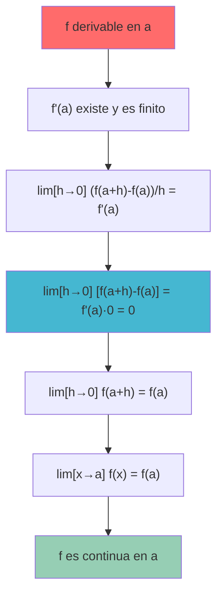
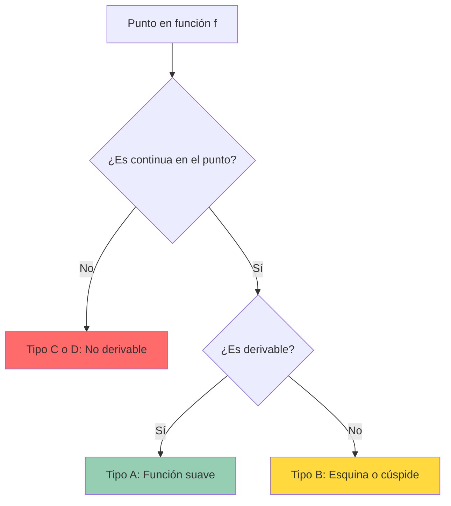

# 🔗 Derivabilidad y Continuidad

> [!info] 💡 **La Relación Fundamental**
> La relación entre derivabilidad y continuidad es uno de los conceptos más importantes del análisis matemático. Aunque están íntimamente conectados, no son equivalentes: toda función derivable es continua, pero no toda función continua es derivable.

## 🎯 Definiciones Fundamentales

### 📐 Repaso: Continuidad

> [!tip] 🔧 **Definición de Continuidad**
> Una función $f(x)$ es **continua en $x = a$** si se cumplen tres condiciones:
> 
> 1. **$f(a)$ existe** (la función está definida en $a$)
> 2. **$\lim_{x \to a} f(x)$ existe** (el límite existe)
> 3. **$\lim_{x \to a} f(x) = f(a)$** (el límite igual al valor de la función)
> 
> **Equivalentemente**: $\lim_{x \to a} f(x) = f(a)$

### 📏 Repaso: Derivabilidad

> [!tip] 🔧 **Definición de Derivabilidad**
> Una función $f(x)$ es **derivable (diferenciable) en $x = a$** si existe el límite:
> 
> $$f'(a) = \lim_{h \to 0} \frac{f(a+h) - f(a)}{h}$$
> 
> y este límite es **finito**.

## ⚡ Teorema Principal: Derivabilidad ⟹ Continuidad

### 🏆 Enunciado del Teorema

> [!warning] 📋 **Teorema Fundamental**
> Si $f$ es derivable en $x = a$, entonces $f$ es continua en $x = a$.
> 
> **En símbolos**: $f'(a) \text{ existe} \Rightarrow f \text{ es continua en } a$

### 🔬 Demostración

> [!tip] 🎯 **Demostración del Teorema**
> 
> **Queremos probar**: $\lim_{x \to a} f(x) = f(a)$
> 
> **Dado**: $f'(a)$ existe, es decir, $\lim_{h \to 0} \frac{f(a+h) - f(a)}{h} = f'(a)$
> 
> **Demostración**:
> $$\lim_{h \to 0} [f(a+h) - f(a)] = \lim_{h \to 0} \left[\frac{f(a+h) - f(a)}{h} \cdot h\right]$$
> 
> $$= \lim_{h \to 0} \frac{f(a+h) - f(a)}{h} \cdot \lim_{h \to 0} h = f'(a) \cdot 0 = 0$$
> 
> Por lo tanto:
> $$\lim_{h \to 0} f(a+h) = \lim_{h \to 0} [f(a+h) - f(a)] + f(a) = 0 + f(a) = f(a)$$
> 
> Sustituyendo $x = a + h$ (cuando $h \to 0$, entonces $x \to a$):
> $$\lim_{x \to a} f(x) = f(a)$$
> 
> **Conclusión**: $f$ es continua en $a$ ✓



## 🚫 El Recíproco NO es Cierto

### ❌ Contraejemplo Clásico: $f(x) = |x|$

> [!warning] 🔴 **Ejemplo**: La función $f(x) = |x|$ en $x = 0$
> 
> **Verificar continuidad en $x = 0$**:
> - $f(0) = |0| = 0$ ✓
> - $\lim_{x \to 0} |x| = 0$ ✓
> - $\lim_{x \to 0} |x| = 0 = f(0)$ ✓
> 
> **Por lo tanto**: $f(x) = |x|$ es continua en $x = 0$
> 
> **Verificar derivabilidad en $x = 0$**:
> $$f'(0) = \lim_{h \to 0} \frac{|0+h| - |0|}{h} = \lim_{h \to 0} \frac{|h|}{h}$$
> 
> **Límite por la derecha**: $\lim_{h \to 0^+} \frac{|h|}{h} = \lim_{h \to 0^+} \frac{h}{h} = 1$
> 
> **Límite por la izquierda**: $\lim_{h \to 0^-} \frac{|h|}{h} = \lim_{h \to 0^-} \frac{-h}{h} = -1$
> 
> Como $1 \neq -1$, el límite no existe.
> 
> **Conclusión**: $f(x) = |x|$ es continua pero NO derivable en $x = 0$

### 🎨 Interpretación Geométrica

> [!info] 📊 **Significado Visual**
> - **Continuidad**: La gráfica no tiene "saltos" ni "huecos"
> - **No derivabilidad**: La gráfica tiene un "pico" o "esquina" donde no se puede trazar una tangente única

## 🔍 Clasificación de Puntos

### 📋 Tipos de Puntos según Continuidad y Derivabilidad

> [!tip] 🎯 **Clasificación Completa**

| Tipo | Continua | Derivable | Ejemplo | Descripción |
|------|----------|-----------|---------|-------------|
| **Tipo A** | ✅ | ✅ | $f(x) = x^2$ en $x = 1$ | Función suave |
| **Tipo B** | ✅ | ❌ | $f(x) = \|x\|$ en $x = 0$ | Esquina/pico |
| **Tipo C** | ❌ | ❌ | Discontinuidad de salto | Salto finito |
| **Tipo D** | ❌ | ❌ | $f(x) = \frac{1}{x}$ en $x = 0$ | Discontinuidad infinita |



## 🧪 Ejemplos Detallados

### 🔬 Ejemplo 1: Función Suave (Tipo A)

> [!tip] 📈 **Ejemplo**: $f(x) = x^3 - 2x + 1$ en $x = 1$
> 
> **Continuidad**:
> $$\lim_{x \to 1} (x^3 - 2x + 1) = 1 - 2 + 1 = 0 = f(1)$$ ✅
> 
> **Derivabilidad** (usando [[Derivadas y Definición Formal]]):
> $$f'(1) = \lim_{h \to 0} \frac{(1+h)^3 - 2(1+h) + 1 - 0}{h}$$
> $$= \lim_{h \to 0} \frac{1 + 3h + 3h^2 + h^3 - 2 - 2h + 1}{h}$$
> $$= \lim_{h \to 0} \frac{h + 3h^2 + h^3}{h} = \lim_{h \to 0} (1 + 3h + h^2) = 1$$
> 
> **Conclusión**: Continua ✅ y derivable ✅ en $x = 1$

### 🔬 Ejemplo 2: Esquina (Tipo B)

> [!tip] 🔺 **Ejemplo**: $f(x) = |x - 2|$ en $x = 2$
> 
> **Continuidad**:
> $$\lim_{x \to 2} |x - 2| = 0 = f(2)$$ ✅
> 
> **Derivabilidad**:
> $$f'(2) = \lim_{h \to 0} \frac{|2+h-2| - |2-2|}{h} = \lim_{h \to 0} \frac{|h|}{h}$$
> 
> - **Por la derecha**: $\lim_{h \to 0^+} \frac{h}{h} = 1$
> - **Por la izquierda**: $\lim_{h \to 0^-} \frac{-h}{h} = -1$
> 
> Como $1 \neq -1$, no es derivable ❌
> 
> **Conclusión**: Continua ✅ pero no derivable ❌ en $x = 2$

### 🔬 Ejemplo 3: Discontinuidad de Salto (Tipo C)

> [!tip] 📊 **Ejemplo**: $f(x) = \begin{cases} x+1 & \text{si } x < 0 \\ x-1 & \text{si } x \geq 0 \end{cases}$ en $x = 0$
> 
> **Continuidad**:
> - $f(0) = 0 - 1 = -1$
> - $\lim_{x \to 0^-} f(x) = \lim_{x \to 0^-} (x+1) = 1$
> - $\lim_{x \to 0^+} f(x) = \lim_{x \to 0^+} (x-1) = -1$
> 
> Como $\lim_{x \to 0^-} f(x) \neq \lim_{x \to 0^+} f(x)$, no es continua ❌
> 
> **Derivabilidad**: Si no es continua, no puede ser derivable ❌
> 
> **Conclusión**: Ni continua ❌ ni derivable ❌ en $x = 0$

### 🔬 Ejemplo 4: Tangente Vertical

> [!tip] 🌿 **Ejemplo**: $f(x) = \sqrt[3]{x}$ en $x = 0$
> 
> **Continuidad**:
> $$\lim_{x \to 0} \sqrt[3]{x} = 0 = f(0)$$ ✅
> 
> **Derivabilidad**:
> $$f'(0) = \lim_{h \to 0} \frac{\sqrt[3]{h} - 0}{h} = \lim_{h \to 0} \frac{1}{h^{2/3}}$$
> 
> Este límite es $+\infty$ (tangente vertical)
> 
> **Conclusión**: Continua ✅ pero no derivable ❌ (derivada infinita)

## 🎪 Casos Especiales y Sutilezas

### 🌊 Derivadas Laterales

> [!info] 📐 **Definición**
> - **Derivada por la derecha**: $f'_+(a) = \lim_{h \to 0^+} \frac{f(a+h) - f(a)}{h}$
> - **Derivada por la izquierda**: $f'_-(a) = \lim_{h \to 0^-} \frac{f(a+h) - f(a)}{h}$
> 
> **Condición**: $f'(a)$ existe ⟺ $f'_+(a) = f'_-(a) =$ valor finito

### 🧪 Ejemplo con Derivadas Laterales

> [!tip] 🔬 **Ejemplo**: $f(x) = \begin{cases} x^2 & \text{si } x \leq 1 \\ 2x - 1 & \text{si } x > 1 \end{cases}$ en $x = 1$
> 
> **Continuidad**:
> - $f(1) = 1^2 = 1$
> - $\lim_{x \to 1^-} f(x) = 1^2 = 1$
> - $\lim_{x \to 1^+} f(x) = 2(1) - 1 = 1$
> 
> Por lo tanto, es continua ✅
> 
> **Derivadas laterales**:
> - $f'_-(1) = \lim_{h \to 0^-} \frac{(1+h)^2 - 1}{h} = \lim_{h \to 0^-} (2 + h) = 2$
> - $f'_+(1) = \lim_{h \to 0^+} \frac{2(1+h) - 1 - 1}{h} = \lim_{h \to 0^+} 2 = 2$
> 
> Como $f'_-(1) = f'_+(1) = 2$, es derivable ✅ con $f'(1) = 2$

## 🔧 Condiciones Suficientes para Derivabilidad

### 📋 Criterios Prácticos

> [!tip] 🎯 **Condiciones Útiles**
> 
> 1. **Funciones elementales**: Polinomios, exponenciales, logaritmos, trigonométricas son derivables en su dominio
> 
> 2. **Composición**: Si $f$ y $g$ son derivables, entonces $f \circ g$ es derivable ([[Regla de la cadena]])
> 
> 3. **Operaciones**: Si $f$ y $g$ son derivables, entonces $f \pm g$, $f \cdot g$, $\frac{f}{g}$ (con $g \neq 0$) son derivables
> 
> 4. **Funciones definidas por partes**: Verificar continuidad + igualdad de derivadas laterales

## ⚠️ Errores Conceptuales Comunes

### 🔴 Malentendidos Típicos

> [!warning] 🚨 **Errores Frecuentes**

#### Error 1: Confundir la Implicación
**Incorrecto**: "Continua ⟹ Derivable"
**Correcto**: "Derivable ⟹ Continua"

#### Error 2: Asumir Derivabilidad sin Verificar
**Problema**: Asumir que funciones "suaves" siempre son derivables
**Ejemplo**: $f(x) = x^{2/3}$ no es derivable en $x = 0$ (tangente vertical)

#### Error 3: Ignorar Puntos de Frontera
**Problema**: No verificar derivabilidad en puntos donde cambia la definición
**Solución**: Siempre verificar derivadas laterales en estos puntos

#### Error 4: Confundir "Suavidad" Visual con Derivabilidad
**Problema**: Confiar solo en la apariencia gráfica
**Solución**: Verificar analíticamente la existencia de derivadas

## 🧠 Método de Estudio: "VERIFICA"

> [!tip] 🎓 **Mnemotecnia "VERIFICA" para Derivabilidad y Continuidad**
> 
> ### 🔤 V - Verificar continuidad primero
> - Si no es continua, no puede ser derivable
> - Usar definición de continuidad: $\lim_{x \to a} f(x) = f(a)$
> - Identificar posibles discontinuidades
> 
> ### 🔤 E - Examinar la función cerca del punto
> - ¿Hay esquinas, picos, o cúspides?
> - ¿Hay cambios abruptos en la pendiente?
> - ¿La función está definida por partes?
> 
> ### 🔤 R - Revisar definición por partes
> - Si la función tiene diferentes expresiones, verificar en los puntos de unión
> - Calcular límites laterales
> - Verificar igualdad en el punto de transición
> 
> ### 🔤 I - Investigar derivadas laterales
> - Calcular $f'_+(a)$ y $f'_-(a)$ si es necesario
> - Verificar si son iguales y finitas
> - Usar la definición de derivada
> 
> ### 🔤 F - Formular conclusión
> - Decidir si es continua únicamente o también derivable
> - Identificar el tipo de punto (A, B, C, o D)
> - Explicar geométricamente el resultado
> 
> ### 🔤 I - Interpretar geométrica y físicamente
> - ¿Qué significa el resultado para la gráfica?
> - ¿Hay interpretación física relevante?
> - ¿Cómo afecta a problemas de aplicación?
> 
> ### 🔤 C - Comprobar con ejemplos similares
> - Verificar la lógica con casos conocidos
> - Comparar con funciones elementales
> - Asegurar consistencia del razonamiento
> 
> ### 🔤 A - Anotar casos especiales
> - Documentar patrones observados
> - Identificar tipos comunes de no derivabilidad
> - Crear lista de verificación personal

### 🎯 Aplicación del Método VERIFICA

> [!info] 🔬 **Ejemplo con VERIFICA**: Analizar $f(x) = x|x|$ en $x = 0$
> 
> **V - Verificar continuidad**:
> $f(x) = x|x| = \begin{cases} x^2 & \text{si } x \geq 0 \\ -x^2 & \text{si } x < 0 \end{cases}$
> 
> $\lim_{x \to 0} f(x) = 0 = f(0)$ → Continua ✅
> 
> **E - Examinar cerca del punto**:
> La función parece "suave" en $x = 0$, sin esquinas visibles
> 
> **R - Revisar definición por partes**:
> Hay cambio de expresión en $x = 0$, necesario verificar derivabilidad
> 
> **I - Investigar derivadas laterales**:
> - $f'_+(0) = \lim_{h \to 0^+} \frac{h^2 - 0}{h} = \lim_{h \to 0^+} h = 0$
> - $f'_-(0) = \lim_{h \to 0^-} \frac{-h^2 - 0}{h} = \lim_{h \to 0^-} (-h) = 0$
> 
> **F - Formular conclusión**:
> $f'_+(0) = f'_-(0) = 0$ → Derivable con $f'(0) = 0$ ✅
> 
> **I - Interpretar**:
> La función tiene tangente horizontal en el origen
> 
> **C - Comprobar**:
> Similar a $f(x) = x^2$ pero "refleja" la parte negativa
> 
> **A - Anotar**:
> Caso especial donde $|x|$ multiplicado por $x$ elimina la esquina

## 🌟 Aplicaciones y Consecuencias

### 🎯 Implicaciones Teóricas

> [!info] 🌐 **Consecuencias Importantes**
> 
> 1. **Teoremas de valor medio**: Requieren derivabilidad
> 2. **Optimización**: Los extremos ocurren donde $f'(x) = 0$ o $f'(x)$ no existe
> 3. **Aproximaciones lineales**: Solo posibles en puntos derivables
> 4. **Ecuaciones diferenciales**: Requieren funciones derivables

### ⚡ Aplicaciones Prácticas

> [!tip] 🔧 **Usos Prácticos**
> - **Análisis de funciones**: Identificar puntos críticos
> - **Modelado físico**: Verificar si un modelo es "suave"
> - **Optimización**: Determinar dónde buscar extremos
> - **Aproximaciones**: Saber dónde aplicar métodos lineales

```mermaid
mindmap
  root((Derivabilidad vs Continuidad))
    Teorema Principal
      Derivable → Continua
      Demostración formal
      No hay recíproco
    Clasificación Puntos
      Tipo A: ambas
      Tipo B: solo continua
      Tipo C,D: ninguna
    Ejemplos Clave
      |x| esquina clásica
      x^(2/3) tangente vertical
      Funciones por partes
    Métodos Verificación
      Derivadas laterales
      Límites
      Definición formal
    Aplicaciones
      Teoremas valor medio
      Optimización
      Ecuaciones diferenciales
      Aproximaciones
```

---

## 📚 Referencias y Conexiones

### 🔗 Notas Relacionadas
- [[Derivadas y Definición Formal]] - Definición formal de derivabilidad
- [[Límites]] - Fundamento matemático de continuidad
- [[Reglas fundamentales de Derivación]] - Aplicación práctica
- [[Interpretación Geométrica de la Derivada]] - Visualización de conceptos
- [[Análisis Completo de Funciones]] - Aplicación en graficación

### 📖 Para Profundizar
- [[Teoremas de Valor Medio]] - Aplicación de la derivabilidad
- [[Funciones de Clase C^n]] - Grados de suavidad
- [[Análisis Real]] - Tratamiento riguroso
- [[Topología]] - Conceptos de continuidad generalizados

### 🎯 Aplicaciones Inmediatas
- [[Problemas de Optimización]] - Búsqueda de extremos
- [[Aproximaciones Lineales]] - Uso de tangentes
- [[Razones de Cambio Relacionadas]] - Aplicaciones dinámicas
- [[Ecuaciones Diferenciales Básicas]] - Modelado con derivadas

### 🏷️ Tags
#matematicas/calculo/derivadas
#continuidad/derivabilidad
#teoremas/fundamentales
#clasificacion/puntos
#ejemplos/contraejemplos
#verificacion/metodos
#aplicaciones/teoricas