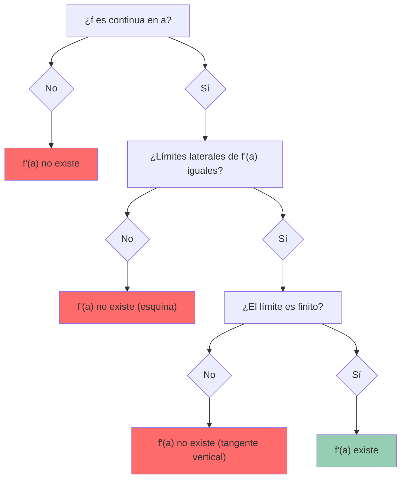
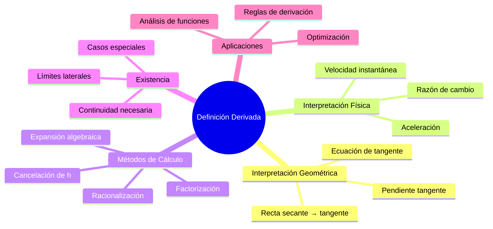

# Derivadas 📈

> [!quote] _"La derivada es el concepto más importante de todo el cálculo. Es la velocidad instantánea, la pendiente de la tangente, la razón de cambio... es el lenguaje con el que la naturaleza describe el cambio."_ - Gilbert Strang

---

## 📋 Conceptos Fundamentales

> [!info]- 🎯 **Definición de Derivada** La derivada de una función f(x) en un punto x es el límite de la razón de cambio promedio cuando el intervalo se aproxima a cero.
> 
> $$f'(x) = \lim_{h \to 0} \frac{f(x+h) - f(x)}{h}$$
> 
> **Interpretaciones principales:**
> 
> - 📐 **Geométrica:** Pendiente de la recta tangente
> - 🏃 **Física:** Velocidad instantánea (razón de cambio)
> - 📊 **Algebraica:** Límite de cocientes de diferencias

## 🔢 Notaciones de la Derivada

> [!tip]- ✍️ **Diferentes Formas de Escribir Derivadas** Para una función y = f(x):
> 
> |Notación|Descripción|Uso Principal|
> |---|---|---|
> |f'(x)|Notación de Lagrange|Matemáticas puras|
> |$\frac{dy}{dx}$|Notación de Leibniz|Física y aplicaciones|
> |$\dot{y}$|Notación de Newton|Física (tiempo)|
> |Df(x)|Notación de operador|Análisis funcional|
> |$D_x f$|Derivada respecto a x|Derivadas parciales|
> 
> **Derivadas de orden superior:**
> 
> - Segunda: f''(x), $\frac{d^2y}{dx^2}$, $\ddot{y}$
> - n-ésima: f⁽ⁿ⁾(x), $\frac{d^ny}{dx^n}$

## 📊 Reglas Fundamentales de Derivación

> [!warning]- 🧮 **Reglas Básicas**
> 
> **Reglas algebraicas:**
> 
> ```
> • Constante: (c)' = 0
> • Identidad: (x)' = 1  
> • Potencia: (x^n)' = nx^(n-1)
> • Constante por función: (cf)' = cf'
> ```
> 
> **Reglas de combinación:**
> 
> ```
> • Suma: (f + g)' = f' + g'
> • Diferencia: (f - g)' = f' - g'  
> • Producto: (fg)' = f'g + fg'
> • Cociente: (f/g)' = (f'g - fg')/g²
> ```
> 
> **Regla de la cadena:**
> 
> ```
> (f(g(x)))' = f'(g(x)) · g'(x)
> ```

## 📈 Derivadas de Funciones Especiales

> [!info]- 🔢 **Funciones Elementales**
> 
> **Funciones exponenciales y logarítmicas:**
> 
> ```mermaid
> graph TD
>    A[Funciones Especiales] --> B[Exponenciales]
>    A --> C[Logarítmicas]
>    A --> D[Trigonométricas]
>    
>    B --> E["(e^x)' = e^x"]
>    B --> F["(a^x)' = a^x ln(a)"]
>    
>    C --> G["(ln x)' = 1/x"]
>    C --> H["(log_a x)' = 1/(x ln a)"]
>    
>    D --> I["(sin x)' = cos x"]
>    D --> J["(cos x)' = -sin x"]
>    D --> K["(tan x)' = sec²x"]
>    
>    style A fill:#e1f5fe
>    style B fill:#f3e5f5
>    style C fill:#fff3e0
>    style D fill:#e8f5e8
> ```
> 
> **Funciones trigonométricas inversas:**
> 
> - $(arcsin x)' = \frac{1}{\sqrt{1-x^2}}$
> - $(arccos x)' = -\frac{1}{\sqrt{1-x^2}}$
> - $(arctan x)' = \frac{1}{1+x^2}$

## 🧠 Técnica de Estudio: Método DERIVAR

> [!tip]- 🎓 **Estrategia de Aprendizaje: Mnemotecnia DERIVAR**
> 
> **D - Detectar** el tipo de función **E - Elegir** la regla apropiada  
> **R - Recordar** la fórmula base **I - Identificar** funciones compuestas **V - Verificar** aplicando la regla de la cadena **A - Aplicar** las reglas algebraicas **R - Revisar** y simplificar el resultado
> 
> **Pasos para resolver derivadas:**
> 
> 1. 🎯 **Identifica** la estructura: ¿Es suma, producto, composición?
> 2. 🔍 **Clasifica** las funciones: polinomial, exponencial, trigonométrica...
> 3. ⚙️ **Aplica** las reglas en el orden correcto
> 4. 🧹 **Simplifica** algebraicamente
> 5. ✅ **Verifica** derivando hacia atrás si es posible

## 📋 Tipos de Derivación

> [!info]- 🔄 **Clasificación de Métodos**
> 
> **1. Derivación Explícita**
> 
> - Función en forma y = f(x)
> - Aplicación directa de reglas
> 
> **2. Derivación Implícita**
> 
> - Ecuación F(x,y) = 0
> - Derivar ambos lados respecto a x
> - Despejar dy/dx
> 
> **3. Derivación Logarítmica**
> 
> - Para funciones de la forma f(x)^g(x)
> - Aplicar ln a ambos lados
> - Derivar implícitamente
> 
> **4. Derivación Paramétrica**
> 
> - x = f(t), y = g(t)
> - $\frac{dy}{dx} = \frac{dy/dt}{dx/dt}$

## 🧪 Ejemplos Resueltos

> [!example]- 💡 **Problema 1: Regla del Producto** Derivar: f(x) = x² · sin(x)
> 
> **Solución:** Usando (fg)' = f'g + fg':
> 
> - f = x², f' = 2x
> - g = sin(x), g' = cos(x)
> 
> f'(x) = 2x · sin(x) + x² · cos(x)

> [!example]- 💡 **Problema 2: Regla de la Cadena** Derivar: h(x) = sin(x³ + 2x)
> 
> **Solución:** h'(x) = cos(x³ + 2x) · (3x² + 2)
> 
> **Explicación:**
> 
> - Función externa: sin(u), derivada: cos(u)
> - Función interna: u = x³ + 2x, derivada: 3x² + 2

## 🎯 Aplicaciones de las Derivadas

> [!warning]- 🔬 **Principales Aplicaciones**
> 
> **En Física:**
> 
> - Velocidad: v(t) = x'(t)
> - Aceleración: a(t) = v'(t) = x''(t)
> - Corriente eléctrica: I = dQ/dt
> 
> **En Geometría:**
> 
> - Pendiente de tangentes
> - Razón de cambio del área/volumen
> - Curvatura de curvas
> 
> **En Optimización:**
> 
> - Máximos y mínimos
> - Puntos críticos: f'(x) = 0
> - Análisis de concavidad: f''(x)

## 🔍 Referencias y Conexiones

> [!quote]- 📚 **Referencias a otras notas**
> 
> - [[Definición Formal del Límite]] - Base fundamental para la definición
> - [[Regla de L'Hôpital]] - Aplicación de derivadas a límites
> - [[Problemas de Optimización]] - Aplicación principal de derivadas
> - [[Antiderivadas (Primitivas)]] - Proceso inverso de la derivación
> - [[Análisis Completo de Funciones]] - Uso de derivadas para estudiar comportamiento

## 📖 Notas Recomendadas para Complementar

> [!info]- 🎯 **Prerrequisitos y Temas Relacionados**
> 
> **Prerrequisitos esenciales:**
> 
> - [[Derivadas y Definición Formal]] - Definición formal de derivada
> - [[Funciones]] - Conceptos básicos de funciones
> - [[Álgebra]] - Manipulación algebraica
> - [[Trigonometría]] - Para derivadas trigonométricas
> 
> **Temas complementarios:**
> 
> - [[Derivación Implícita]] - Técnica avanzada
> - [[Derivadas de Orden Superior]] - Extensión del concepto
> - [[Aproximaciones Lineales]] - Aplicación geométrica
> - [[Razones de Cambio Relacionadas]] - Aplicaciones físicas

## 🔧 Técnicas de Verificación

> [!tip]- ✅ **Cómo Verificar tu Derivada**
> 
> **Método 1: Derivación numérica**
> 
> - Usa la definición: $\frac{f(x+h)-f(x)}{h}$ con h muy pequeño
> - Compara con tu resultado analítico
> 
> **Método 2: Integración**
> 
> - Si F'(x) = f(x), entonces ∫f(x)dx debe darte F(x) + C
> 
> **Método 3: Graficación**
> 
> - Grafica f(x) y f'(x)
> - Verifica que donde f'(x) = 0, f(x) tenga extremos

---

**Tags:** #calculo #derivadas #limites #regla-cadena #optimizacion #fisica-matematica #razones-cambio

# 📏 Límite y Definición de Derivada

> [!info] 💡 **El Concepto Fundamental**
> La derivada es uno de los conceptos más importantes del cálculo, definida como el límite de la razón de cambio instantáneo. Conecta la geometría (pendiente de tangente) con la física (velocidad instantánea) de manera elegante y poderosa.

## 🎯 Definición Formal de la Derivada

### 📐 Definición por Límite

> [!tip] 🏆 **Definición Principal**
> Sea $f(x)$ una función definida en un intervalo que contiene a $x = a$. La **derivada de $f$ en $x = a$** se define como:
> 
> $$f'(a) = \lim_{h \to 0} \frac{f(a+h) - f(a)}{h}$$
> 
> **siempre que este límite exista y sea finito**.

### 🔄 Definiciones Equivalentes

> [!info] 📊 **Formas Alternativas**
> 
> #### Usando incremento $\Delta x$
> $$f'(a) = \lim_{\Delta x \to 0} \frac{f(a + \Delta x) - f(a)}{\Delta x}$$
> 
> #### Usando variable $x$ que tiende a $a$
> $$f'(a) = \lim_{x \to a} \frac{f(x) - f(a)}{x - a}$$
> 
> #### Para derivada en punto general $x$
> $$f'(x) = \lim_{h \to 0} \frac{f(x+h) - f(x)}{h}$$
> 
> ```mermaid
> graph TD
>     A["Función f(x)"] --> B["Dos puntos cercanos"]
>     B --> C["(a, f(a)) y (a+h, f(a+h))"]
>     C --> D["Pendiente secante"]
>     D --> E["m = [f(a+h) - f(a)]/h"]
>     E --> F["Límite cuando h → 0"]
>     F --> G["Pendiente tangente = f'(a)"]
>     
>     style G fill:#45b7d1
>     style F fill:#96ceb4
> ```
> 
## 🎨 Interpretación Geométrica

### 📈 De Secante a Tangente

> [!tip] 🎯 **Proceso Visual**
> 1. **Recta secante**: Une dos puntos $(a, f(a))$ y $(a+h, f(a+h))$
> 2. **Pendiente secante**: $m_{sec} = \frac{f(a+h) - f(a)}{h}$  
> 3. **Límite**: Cuando $h \to 0$, el punto $(a+h, f(a+h))$ se acerca a $(a, f(a))$
> 4. **Recta tangente**: La secante se convierte en la tangente
> 5. **Derivada**: $f'(a) =$ pendiente de la recta tangente

#### 🧪 Ejemplo Visual

> [!tip] 🔬 **Ejemplo**: $f(x) = x^2$ en $x = 2$
> 
> **Pendientes secantes para diferentes valores de $h$**:
> 
> | $h$ | $f(2+h) = (2+h)^2$ | $\frac{f(2+h) - f(2)}{h} = \frac{(2+h)^2 - 4}{h}$ | Pendiente |
> |-----|---------------------|---------------------------------------------------|-----------|
> | 1 | 9 | $\frac{9-4}{1} = 5$ | 5 |
> | 0.1 | 4.41 | $\frac{4.41-4}{0.1} = 4.1$ | 4.1 |
> | 0.01 | 4.0401 | $\frac{4.0401-4}{0.01} = 4.01$ | 4.01 |
> | 0.001 | 4.004001 | $\frac{4.004001-4}{0.001} = 4.001$ | 4.001 |
> 
> **Observación**: Las pendientes se acercan a 4, por lo tanto $f'(2) = 4$

### 🎭 Ecuación de la Recta Tangente

> [!warning] 📐 **Ecuación de la Tangente**
> Si $f'(a)$ existe, la ecuación de la recta tangente a $y = f(x)$ en el punto $(a, f(a))$ es:
> 
> $$y - f(a) = f'(a)(x - a)$$
> 
> o equivalentemente:
> $$y = f(a) + f'(a)(x - a)$$

## ⚡ Interpretación Física

### 🚗 Velocidad Instantánea

> [!info] 🎯 **Concepto Físico**
> Si $s(t)$ representa la posición de un objeto en el tiempo $t$, entonces:
> 
> - **Velocidad promedio** en $[t, t+h]$: $v_{prom} = \frac{s(t+h) - s(t)}{h}$
> - **Velocidad instantánea** en $t$: $v(t) = s'(t) = \lim_{h \to 0} \frac{s(t+h) - s(t)}{h}$

#### 🧪 Ejemplo Físico

> [!tip] 🔬 **Ejemplo**: Caída libre $s(t) = -\frac{1}{2}gt^2 + v_0 t + s_0$
> 
> **Para $g = 9.8$ m/s², $v_0 = 10$ m/s, $s_0 = 0$**:
> $s(t) = -4.9t^2 + 10t$
> 
> **Velocidad instantánea en $t = 2$ segundos**:
> $$v(2) = \lim_{h \to 0} \frac{s(2+h) - s(2)}{h}$$
> 
> $$= \lim_{h \to 0} \frac{[-4.9(2+h)^2 + 10(2+h)] - [-4.9(4) + 20]}{h}$$
> 
> $$= \lim_{h \to 0} \frac{-4.9(4 + 4h + h^2) + 20 + 10h + 19.6 - 20}{h}$$
> 
> $$= \lim_{h \to 0} \frac{-19.6h - 4.9h^2 + 10h}{h} = \lim_{h \to 0} (-9.6 - 4.9h) = -9.6 \text{ m/s}$$

## 🔢 Notaciones para la Derivada

### 📝 Diferentes Símbolos

> [!info] 📋 **Tabla de Notaciones**

| Notación        | Nombre               | Uso Principal                        |
| --------------- | -------------------- | ------------------------------------ |
| $f'(x)$         | Notación de Lagrange | Funciones generales                  |
| $\frac{dy}{dx}$ | Notación de Leibniz  | Énfasis en variables                 |
| $\frac{df}{dx}$ | Notación de Leibniz  | Funciones específicas                |
| $D_x[f(x)]$     | Notación de operador | Operaciones algebraicas              |
| $\dot{y}$       | Notación de Newton   | Física (derivada respecto al tiempo) |

### 🌊 Significado de la Notación de Leibniz

> [!warning] 🎯 **Interpretación de $\frac{dy}{dx}$**
> - **NO** es una fracción literal
> - **SÍ** representa el límite de $\frac{\Delta y}{\Delta x}$ cuando $\Delta x \to 0$
> - **Útil** para recordar reglas como la regla de la cadena
> - **Flexible** para manipulaciones algebraicas en ecuaciones diferenciales

## 🧮 Cálculo de Derivadas usando la Definición

### 🎯 Metodología Paso a Paso

> [!tip] 📋 **Proceso General**
> 1. **Escribir** la definición: $f'(x) = \lim_{h \to 0} \frac{f(x+h) - f(x)}{h}$
> 2. **Sustituir** $f(x+h)$ y $f(x)$
> 3. **Simplificar** la expresión algebraicamente
> 4. **Factorizar** para cancelar $h$ del denominador
> 5. **Evaluar** el límite cuando $h \to 0$

### 🧪 Ejemplos Detallados

#### 🔬 Ejemplo 1: Función Lineal

> [!tip] 📈 **Calcular**: $f'(x)$ si $f(x) = 3x + 2$
> 
> **Paso 1**: Aplicar definición
> $$f'(x) = \lim_{h \to 0} \frac{f(x+h) - f(x)}{h}$$
> 
> **Paso 2**: Sustituir
> $$= \lim_{h \to 0} \frac{[3(x+h) + 2] - [3x + 2]}{h}$$
> 
> **Paso 3**: Simplificar
> $$= \lim_{h \to 0} \frac{3x + 3h + 2 - 3x - 2}{h} = \lim_{h \to 0} \frac{3h}{h}$$
> 
> **Paso 4**: Cancelar
> $$= \lim_{h \to 0} 3 = 3$$
> 
> **Conclusión**: $f'(x) = 3$ (derivada constante = pendiente de la recta)

#### 🔬 Ejemplo 2: Función Cuadrática

> [!tip] 📊 **Calcular**: $f'(x)$ si $f(x) = x^2$
> 
> **Paso 1**: Aplicar definición
> $$f'(x) = \lim_{h \to 0} \frac{f(x+h) - f(x)}{h}$$
> 
> **Paso 2**: Sustituir
> $$= \lim_{h \to 0} \frac{(x+h)^2 - x^2}{h}$$
> 
> **Paso 3**: Expandir $(x+h)^2$
> $$= \lim_{h \to 0} \frac{x^2 + 2xh + h^2 - x^2}{h}$$
> 
> **Paso 4**: Simplificar y factorizar
> $$= \lim_{h \to 0} \frac{2xh + h^2}{h} = \lim_{h \to 0} \frac{h(2x + h)}{h}$$
> 
> **Paso 5**: Cancelar y evaluar
> $$= \lim_{h \to 0} (2x + h) = 2x$$
> 
> **Conclusión**: $f'(x) = 2x$

#### 🔬 Ejemplo 3: Función con Raíz

> [!tip] 🌿 **Calcular**: $f'(x)$ si $f(x) = \sqrt{x}$ para $x > 0$
> 
> **Paso 1**: Aplicar definición
> $$f'(x) = \lim_{h \to 0} \frac{\sqrt{x+h} - \sqrt{x}}{h}$$
> 
> **Paso 2**: Racionalizar multiplicando por el conjugado
> $$= \lim_{h \to 0} \frac{\sqrt{x+h} - \sqrt{x}}{h} \cdot \frac{\sqrt{x+h} + \sqrt{x}}{\sqrt{x+h} + \sqrt{x}}$$
> 
> **Paso 3**: Simplificar numerador
> $$= \lim_{h \to 0} \frac{(x+h) - x}{h(\sqrt{x+h} + \sqrt{x})} = \lim_{h \to 0} \frac{h}{h(\sqrt{x+h} + \sqrt{x})}$$
> 
> **Paso 4**: Cancelar y evaluar
> $$= \lim_{h \to 0} \frac{1}{\sqrt{x+h} + \sqrt{x}} = \frac{1}{\sqrt{x} + \sqrt{x}} = \frac{1}{2\sqrt{x}}$$
> 
> **Conclusión**: $f'(x) = \frac{1}{2\sqrt{x}}$

## ⚠️ Existencia y No Existencia de la Derivada

### 🔍 Condiciones para que Exista $f'(a)$

> [!warning] 📋 **Requisitos**
> 1. **$f$ debe estar definida** en un entorno de $a$
> 2. **El límite debe existir** (límites laterales iguales)
> 3. **El límite debe ser finito**

### 🚫 Casos donde NO Existe la Derivada

#### Caso 1: Discontinuidad
> [!info] 🔴 **Ejemplo**: $f(x) = \begin{cases} x & \text{si } x < 1 \\ x+1 & \text{si } x \geq 1 \end{cases}$
> 
> En $x = 1$: La función es discontinua, por lo tanto no es derivable.

#### Caso 2: Esquina o Cúspide
> [!info] 🔴 **Ejemplo**: $f(x) = |x|$ en $x = 0$
> 
> **Derivada por la izquierda**: $\lim_{h \to 0^-} \frac{|0+h| - |0|}{h} = \lim_{h \to 0^-} \frac{-h}{h} = -1$
> 
> **Derivada por la derecha**: $\lim_{h \to 0^+} \frac{|0+h| - |0|}{h} = \lim_{h \to 0^+} \frac{h}{h} = 1$
> 
> Como $-1 \neq 1$, $f'(0)$ no existe.

#### Caso 3: Tangente Vertical
> [!info] 🔴 **Ejemplo**: $f(x) = \sqrt[3]{x}$ en $x = 0$
> 
> $$f'(0) = \lim_{h \to 0} \frac{\sqrt[3]{h} - 0}{h} = \lim_{h \to 0} \frac{1}{h^{2/3}} = +\infty$$
> 
> El límite es infinito, por lo tanto la derivada no existe (tangente vertical).



## 🧠 Método de Estudio: "DELTA"

> [!tip] 🎓 **Mnemotecnia "DELTA" para Definición de Derivada**
> 
> ### 🔤 D - Definir el límite
> - Escribir $f'(a) = \lim_{h \to 0} \frac{f(a+h) - f(a)}{h}$
> - Identificar la función $f$ y el punto $a$
> - Verificar que la función esté definida cerca de $a$
> 
> ### 🔤 E - Expandir y sustituir
> - Calcular $f(a+h)$ expandiendo algebraicamente
> - Sustituir $f(a+h)$ y $f(a)$ en la expresión
> - Simplificar el numerador
> 
> ### 🔤 L - Limpiar la expresión
> - Factorizar el numerador
> - Cancelar el factor $h$ del denominador
> - Asegurar que no quede $h$ en el denominador
> 
> ### 🔤 T - Tomar el límite
> - Evaluar $\lim_{h \to 0}$ de la expresión simplificada
> - Verificar que el límite sea finito
> - Escribir el resultado final
> 
> ### 🔤 A - Asegurar e interpretar
> - **Verificar**: ¿El resultado tiene sentido?
> - **Interpretar**: ¿Qué significa geométrica o físicamente?
> - **Aplicar**: ¿Cómo se usa en problemas posteriores?

### 🎯 Aplicación del Método DELTA

> [!info] 🔬 **Ejemplo con DELTA**: Encontrar $f'(x)$ si $f(x) = x^3$
> 
> **D - Definir el límite**:
> $$f'(x) = \lim_{h \to 0} \frac{f(x+h) - f(x)}{h}$$
> 
> **E - Expandir y sustituir**:
> $$f(x+h) = (x+h)^3 = x^3 + 3x^2h + 3xh^2 + h^3$$
> $$f'(x) = \lim_{h \to 0} \frac{x^3 + 3x^2h + 3xh^2 + h^3 - x^3}{h}$$
> 
> **L - Limpiar la expresión**:
> $$= \lim_{h \to 0} \frac{3x^2h + 3xh^2 + h^3}{h} = \lim_{h \to 0} \frac{h(3x^2 + 3xh + h^2)}{h}$$
> $$= \lim_{h \to 0} (3x^2 + 3xh + h^2)$$
> 
> **T - Tomar el límite**:
> $$= 3x^2 + 3x(0) + 0^2 = 3x^2$$
> 
> **A - Asegurar e interpretar**:
> - **Resultado**: $f'(x) = 3x^2$
> - **Interpretación**: La pendiente de $y = x^3$ en cualquier punto $x$ es $3x^2$
> - **Verificación**: En $x = 2$, pendiente = $3(4) = 12$ ✓

## 🌟 Conexiones y Aplicaciones

### 🔗 Relación con Otros Conceptos

> [!info] 🌐 **Conexiones Importantes**
> - **[[Continuidad y Límites]]**: Fundamento matemático de la definición
> - **[[Derivabilidad y Continuidad]]**: Condición necesaria para derivabilidad
> - **[[Tabla de Derivadas Básicas (Referencia Rápida)]]**: Métodos más eficientes desarrollados a partir de esta definición
> - **[[Interpretación Geométrica de la Derivada]]**: Aplicación visual del concepto

### ⚡ Preparación para Conceptos Avanzados

> [!warning] 🎯 **Importancia Futura**
> Esta definición es la base para:
> - Demostración de todas las reglas de derivación
> - Derivadas de orden superior
> - Derivadas parciales en cálculo multivariable
> - Análisis real y teoría de funciones



---

## 📚 Referencias y Conexiones

>[!quote] 🔗 Notas Relacionadas
> - [[Continuidad y Límites]] - Fundamento matemático esencial
> - [[Derivabilidad y Continuidad]] - Condiciones de existencia
> - [[Interpretación Geométrica de la Derivada]] - Aplicación visual
> - [[Reglas fundamentales de Derivación]] - Métodos eficientes
> - [[Regla de la cadena]] - Extensión para funciones compuestas
> 

>[!success] 📖 Para Profundizar
> - [[Interpretación Geométrica de la Derivada]] - Análisis detallado de no derivabilidad
> - [[Derivabilidad y Continuidad]] - Relaciones teóricas


> [!NOTE] 🎯 Aplicaciones Inmediatas
> 
> - [[Razones de Cambio Relacionadas]] - Problemas dinámicos
> - [[Aproximaciones Lineales y Diferenciales]] - Uso de la tangente
> - [[Análisis Completo de Funciones]] - Comportamiento local

### 🏷️ Tags
#matematicas/calculo/derivadas #fundamentos/limites #definicion/formal #interpretacion/geometrica #interpretacion/fisica #metodos/calculo #existencia/derivada