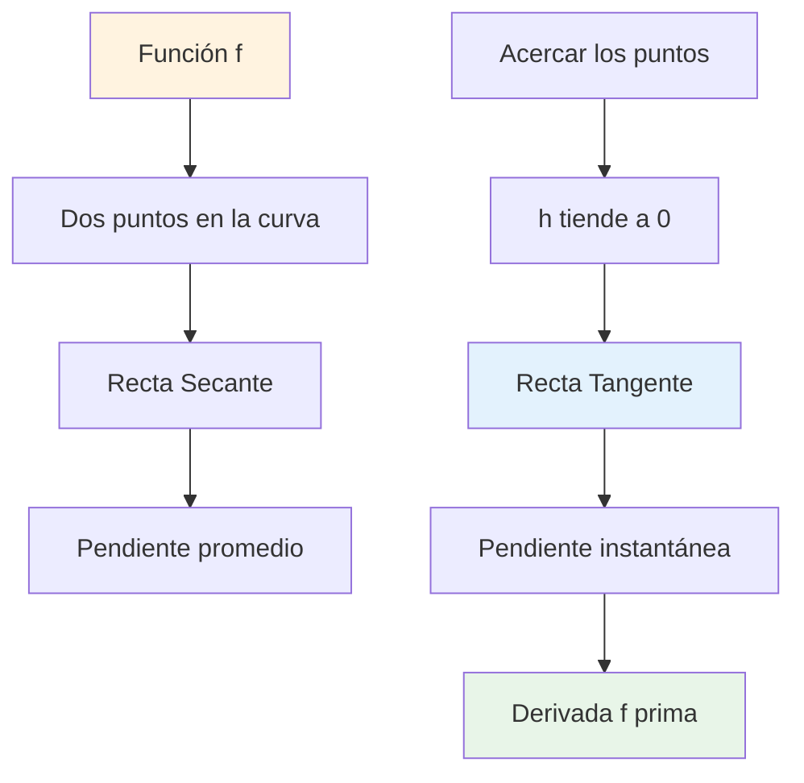
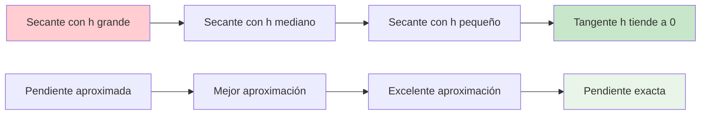
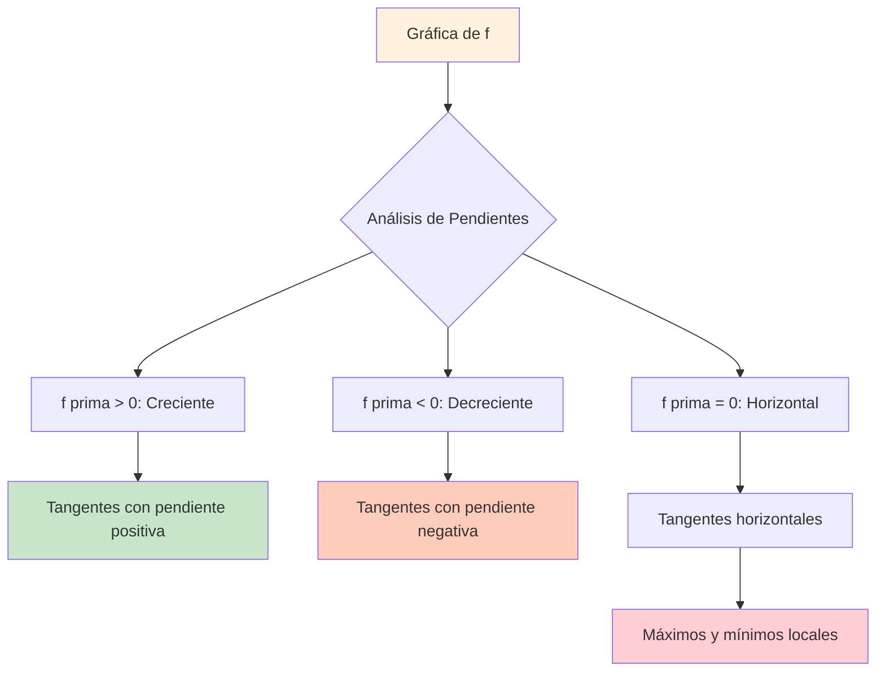
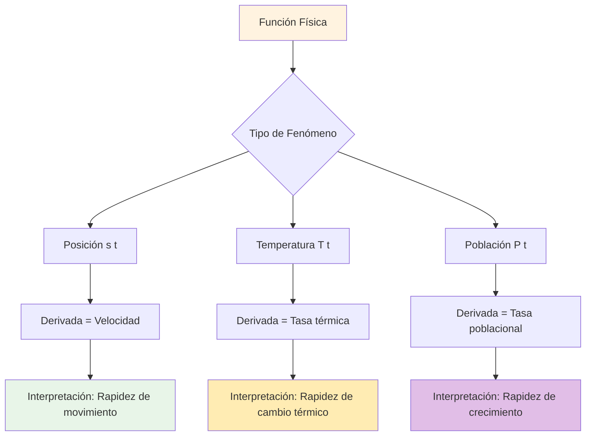
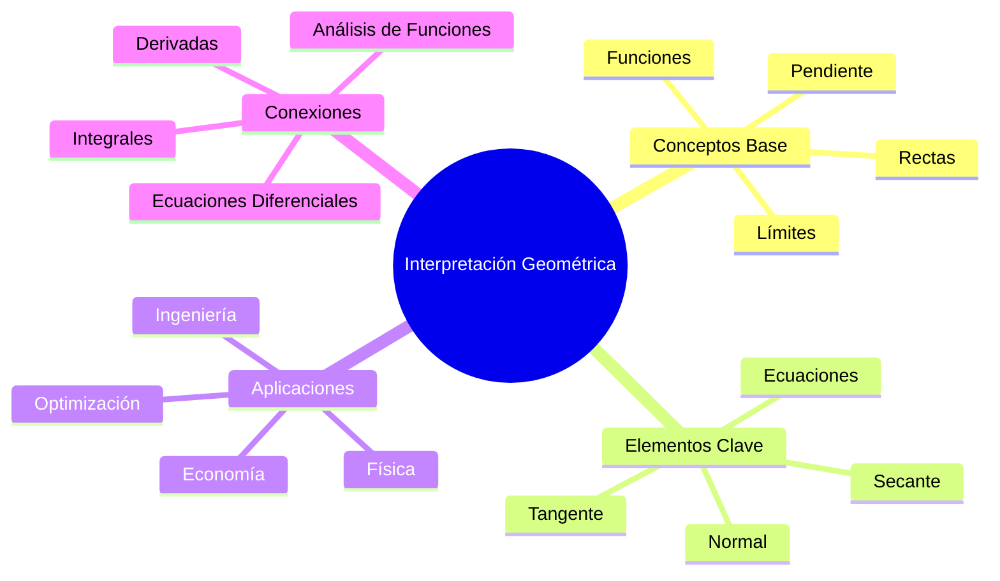

# 📐 Interpretación Geométrica de la Derivada

## 📖 Introducción

> [!info] 💡 Concepto Fundamental
> La **interpretación geométrica de la derivada** establece que la derivada de una función en un punto específico representa la **pendiente de la recta tangente** a la curva en ese punto. Esta conexión entre el álgebra y la geometría es uno de los conceptos más fundamentales del cálculo diferencial.

> [!tip] 🎯 ¿Por qué es importante?
> 
> - Conecta el **concepto abstracto** de límite con la **geometría visual**
> - Permite **visualizar** las tasas de cambio instantáneas
> - Es fundamental para **optimización** y **análisis gráfico**
> - Proporciona **intuición geométrica** para resolver problemas
> - Base para entender **máximos**, **mínimos** y **puntos de inflexión**

---

## 🔤 Definiciones y Conceptos Clave

> [!note] 📝 **Definiciones Fundamentales**
> 
> **Pendiente de Recta Secante**:
> • Entre dos puntos $(x, f(x))$ y $(x+h, f(x+h))$
> • Fórmula: $m_{sec} = \frac{f(x+h) - f(x)}{h}$
> • Representa la **tasa de cambio promedio**
> 
> **Pendiente de Recta Tangente**:
> • En el punto $(x, f(x))$
> • Fórmula: $m_{tan} = \lim_{h \to 0} \frac{f(x+h) - f(x)}{h} = f'(x)$
> • Representa la **tasa de cambio instantánea**
> 
> **Recta Tangente**:
> • Ecuación: $y - f(a) = f'(a)(x - a)$
> • Donde $a$ es el punto de tangencia
> • **Mejor aproximación lineal** a la función en ese punto

> [!warning] ⚠️ **Elementos clave para recordar**
> 
> - **Secante**: Une dos puntos de la curva (promedio)
> - **Tangente**: Toca la curva en un solo punto (instantáneo)
> - **Derivada**: Pendiente de la tangente = límite de pendientes de secantes
> - **Punto de tangencia**: Donde la recta tangente toca la curva

---

## 📐 Desarrollo del Concepto

> [!info] 🔍 **De la Secante a la Tangente**
> 
> ### 📊 **Proceso de Aproximación**
> 
> **Paso 1: Recta Secante**
> • Dados dos puntos: $P(x, f(x))$ y $Q(x+h, f(x+h))$
> • Pendiente secante: $m_{sec} = \frac{\Delta y}{\Delta x} = \frac{f(x+h) - f(x)}{h}$
> • Representa cambio promedio en el intervalo $[x, x+h]$
> 
> **Paso 2: Reducir la Distancia**
> • Hacer $h$ cada vez más pequeño: $h \to 0$
> • El punto $Q$ se acerca al punto $P$
> • La secante se aproxima a la tangente
> 
> **Paso 3: Límite (Tangente)**
> • $m_{tan} = \lim_{h \to 0} \frac{f(x+h) - f(x)}{h} = f'(x)$
> • La recta secante "converge" a la recta tangente
> • Obtenemos la pendiente instantánea

---

## 📏 Ecuación de la Recta Tangente

> [!tip] 📋 **Fórmulas de la Recta Tangente**
> 
> ### 🧮 **Forma Punto-Pendiente**
> 
> **Ecuación General**:
> • $y - y_1 = m(x - x_1)$
> • Donde $(x_1, y_1) = (a, f(a))$ es el punto de tangencia
> • Y $m = f'(a)$ es la pendiente de la tangente
> 
> **Para función $f(x)$ en punto $x = a$**:
> • $y - f(a) = f'(a)(x - a)$
> • $y = f'(a)(x - a) + f(a)$
> • $y = f'(a) \cdot x - f'(a) \cdot a + f(a)$
> 
> ### 📐 **Casos Especiales**
> 
> **Tangente Horizontal**: $f'(a) = 0$
> • Ecuación: $y = f(a)$ (línea horizontal)
> • Indica posible máximo/mínimo local
> 
> **Tangente Vertical**: $f'(a)$ no existe (infinita)
> • Ecuación: $x = a$ (línea vertical)
> • Ocurre en cúspides o puntos angulosos

---

## 💡 Ejemplos Desarrollados

> [!example] 🎯 **Ejemplo 1**: Parábola básica
> **Encontrar la ecuación de la recta tangente a $f(x) = x^2$ en $x = 3$**
> 
> **Paso 1**: Calcular la derivada
> • $f'(x) = 2x$
> 
> **Paso 2**: Evaluar derivada en el punto
> • $f'(3) = 2(3) = 6$ (pendiente de la tangente)
> 
> **Paso 3**: Calcular el punto de tangencia
> • $f(3) = 3^2 = 9$
> • Punto: $(3, 9)$
> 
> **Paso 4**: Escribir ecuación de la tangente
> • $y - 9 = 6(x - 3)$
> • $y = 6x - 18 + 9$
> • $y = 6x - 9$

> [!example] 🎯 **Ejemplo 2**: Función trigonométrica
> **Encontrar la tangente a $f(x) = \sin x$ en $x = \frac{\pi}{4}$**
> 
> **Desarrollo**:
> • $f'(x) = \cos x$
> • $f'(\frac{\pi}{4}) = \cos(\frac{\pi}{4}) = \frac{\sqrt{2}}{2}$
> • $f(\frac{\pi}{4}) = \sin(\frac{\pi}{4}) = \frac{\sqrt{2}}{2}$
> • Punto: $(\frac{\pi}{4}, \frac{\sqrt{2}}{2})$
> 
> **Ecuación**:
> • $y - \frac{\sqrt{2}}{2} = \frac{\sqrt{2}}{2}(x - \frac{\pi}{4})$
> • $y = \frac{\sqrt{2}}{2}x - \frac{\sqrt{2}\pi}{8} + \frac{\sqrt{2}}{2}$

> [!example] 🎯 **Ejemplo 3**: Función racional
> **Tangente a $f(x) = \frac{1}{x}$ en $x = 2$**
> 
> **Cálculos**:
> • $f'(x) = -\frac{1}{x^2}$
> • $f'(2) = -\frac{1}{4}$
> • $f(2) = \frac{1}{2}$
> • Punto: $(2, \frac{1}{2})$
> 
> **Ecuación**:
> • $y - \frac{1}{2} = -\frac{1}{4}(x - 2)$
> • $y = -\frac{1}{4}x + \frac{1}{2} + \frac{1}{2}$
> • $y = -\frac{1}{4}x + 1$

---

## 📊 Interpretación Visual y Gráfica

> [!info] 📈 **Análisis Gráfico de Derivadas**
> 
> ### 🎨 **Relación entre $f(x)$ y $f'(x)$**
> 
> **Donde $f'(x) > 0$**:
> • La función $f(x)$ es **creciente**
> • Las tangentes tienen **pendiente positiva**
> • La gráfica "sube" de izquierda a derecha
> 
> **Donde $f'(x) < 0$**:
> • La función $f(x)$ es **decreciente**
> • Las tangentes tienen **pendiente negativa**
> • La gráfica "baja" de izquierda a derecha
> 
> **Donde $f'(x) = 0$**:
> • Tangentes **horizontales**
> • Posibles **máximos** o **mínimos** locales
> • Puntos críticos de la función
> 
> ### 📐 **Tipos de Tangentes Especiales**
> 
> **Tangente Horizontal**: $y = k$
> • Pendiente = 0
> • Función tiene máximo/mínimo local
> • Derivada se anula: $f'(x) = 0$
> 
> **Tangente con Pendiente Pronunciada**:
> • $|f'(x)|$ es grande
> • Función cambia rápidamente
> • Curva es "empinada"
> 
> **Tangente con Pendiente Suave**:
> • $|f'(x)|$ es pequeño
> • Función cambia lentamente
> • Curva es "plana"

---

## 🔍 Rectas Normales

> [!info] 📐 **Concepto de Recta Normal**
> 
> ### 📋 **Definición y Propiedades**
> 
> **Recta Normal**:
> • **Perpendicular** a la recta tangente en el punto de tangencia
> • Pasa por el mismo punto $(a, f(a))$
> • Su pendiente es $m_n = -\frac{1}{f'(a)}$ (recíproco negativo)
> 
> **Condición de Perpendicularidad**:
> • Si $m_1 \cdot m_2 = -1$, entonces las rectas son perpendiculares
> • $m_{tangente} \cdot m_{normal} = f'(a) \cdot \left(-\frac{1}{f'(a)}\right) = -1$
> 
> ### 🧮 **Ecuación de la Recta Normal**
> 
> **Fórmula General**:
> • $y - f(a) = -\frac{1}{f'(a)}(x - a)$
> • Válida cuando $f'(a) \neq 0$
> 
> **Caso Especial**:
> • Si $f'(a) = 0$ (tangente horizontal)
> • Entonces la normal es vertical: $x = a$

> [!example] 🧪 **Ejemplo de Recta Normal**
> **Para $f(x) = x^2$ en $x = 1$**
> 
> **Cálculos**:
> • $f'(x) = 2x$, entonces $f'(1) = 2$
> • $f(1) = 1$, punto: $(1, 1)$
> • Pendiente tangente: $m_t = 2$
> • Pendiente normal: $m_n = -\frac{1}{2}$
> 
> **Ecuaciones**:
> • **Tangente**: $y - 1 = 2(x - 1)$ → $y = 2x - 1$
> • **Normal**: $y - 1 = -\frac{1}{2}(x - 1)$ → $y = -\frac{1}{2}x + \frac{3}{2}$

---

## 🎯 Aplicaciones Prácticas

> [!note] 🌐 **Aplicaciones en Diferentes Áreas**
> 
> ### 🚗 **Física y Movimiento**
> 
> **Cinemática**:
> • **Posición** $s(t)$ vs **Tiempo** $t$
> • **Velocidad instantánea**: $v(t) = s'(t)$ (pendiente de la tangente)
> • La tangente a la curva $s(t)$ indica qué tan rápido cambia la posición
> 
> **Ejemplo**: Si $s(t) = 5t^2 + 2t$, entonces $v(t) = 10t + 2$
> • En $t = 3$: $v(3) = 32$ m/s (pendiente de tangente en ese instante)
> 
> ### 📈 **Economía y Optimización**
> 
> **Función de Costo**:
> • **Costo marginal**: $C'(x)$ (derivada del costo total)
> • Representa el costo de producir una unidad adicional
> • Pendiente de la tangente a la curva de costo
> 
> **Función de Beneficio**:
> • **Beneficio máximo**: donde $B'(x) = 0$ (tangente horizontal)
> • Optimización usando puntos donde la derivada se anula
> 
> ### 🏗️ **Ingeniería y Diseño**
> 
> **Diseño de Curvas**:
> • **Carreteras**: Tangentes suaves para cambios graduales de dirección
> • **Puentes**: Análisis de pendientes para estabilidad estructural
> • **Aerodinámica**: Tangentes a perfiles alares para flujo óptimo

---

## 🧠 Método de Estudio con Mnemotecnia

> [!tip] 🎯 **Estrategias de Memorización y Comprensión**
> 
> ### 📝 **Mnemotecnias para Interpretación Geométrica**
> 
> **Tangente vs Secante - "TOCA vs UNE"**:
> • **T**angente **TOCA** en un punto (instantáneo)
> • **S**ecante **UNE** dos puntos (promedio)
> • Mnemotecnia: "La **T**angente **T**oca, la **S**ecante **S**epara"
> 
> **Ecuación de Tangente - "PUMA"**:
> • **P**unto de tangencia: $(a, f(a))$
> • **U**sa la derivada: $f'(a)$
> • **M**étodo punto-pendiente: $y - y_1 = m(x - x_1)$
> • **A**plica: $y - f(a) = f'(a)(x - a)$
> 
> **Signos de la Derivada - "SUBE BAJA PLANO"**:
> • $f'(x) > 0$: **SUBE** (función creciente)
> • $f'(x) < 0$: **BAJA** (función decreciente)
> • $f'(x) = 0$: **PLANO** (tangente horizontal)
> 
> **Recta Normal - "DALE LA VUELTA"**:
> • **D**erivada de la función
> • **A**plica recíproco negativo: $-\frac{1}{f'(a)}$
> • **L**a pendiente normal es perpendicular
> • **E**scribe ecuación punto-pendiente
> 
> ### 🎨 **Métodos de Estudio Visual**
> 
> **Técnica del "Zoom Geométrico"**:
> 1. Dibuja la función con dos puntos distantes (secante)
> 2. Acerca gradualmente los puntos
> 3. Observa cómo la secante se convierte en tangente
> 4. Visualiza el límite como "zoom infinito"
> 
> **Método de "Storytelling Matemático"**:
> • Imagina una montaña rusa (función)
> • La tangente es la dirección instantánea del carrito
> • La pendiente indica qué tan empinada es la subida/bajada
> • Los puntos horizontales son las "cimas" y "valles"
> 
> **Tarjetas de Patrones Visuales**:
> • Anverso: Gráfica de función
> • Reverso: Puntos clave, tangentes, y valores de derivada
> • Código de colores: Verde (creciente), Rojo (decreciente), Azul (horizontal)

---

## 🎭 Interpretación Física

> [!info] ⚡ **Significado Físico de la Derivada**
> 
> ### 🚀 **Velocidad y Aceleración**
> 
> **Posición → Velocidad**:
> • Si $s(t)$ es posición vs tiempo
> • Entonces $v(t) = s'(t)$ es velocidad instantánea
> • **Interpretación**: Pendiente de la tangente a la curva posición-tiempo
> 
> **Velocidad → Aceleración**:
> • Si $v(t)$ es velocidad vs tiempo
> • Entonces $a(t) = v'(t) = s''(t)$ es aceleración
> • **Interpretación**: Pendiente de la tangente a la curva velocidad-tiempo
> 
> ### 🌡️ **Tasas de Cambio en Fenómenos Naturales**
> 
> **Temperatura vs Tiempo**:
> • $T'(t)$ = rapidez de calentamiento/enfriamiento
> • Tangente empinada = cambio térmico rápido
> • Tangente horizontal = temperatura estable
> 
> **Población vs Tiempo**:
> • $P'(t)$ = tasa de crecimiento poblacional
> • $P'(t) > 0$: población creciendo
> • $P'(t) < 0$: población disminuyendo
> • $P'(t) = 0$: población estable

---

## ⚠️ Errores Comunes y Cómo Evitarlos

> [!warning] 🚨 **Errores Frecuentes**
> 
> **1. Confundir secante con tangente**
> • ❌ Incorrecto: "La tangente une dos puntos"
> • ✅ Correcto: "La secante une dos puntos, la tangente toca en uno"
> 
> **2. Error en ecuación de recta tangente**
> • ❌ Incorrecto: $y = f'(a) \cdot x + f(a)$
> • ✅ Correcto: $y - f(a) = f'(a)(x - a)$
> 
> **3. Olvidar evaluar la derivada en el punto**
> • ❌ Incorrecto: Usar $f'(x)$ directamente
> • ✅ Correcto: Usar $f'(a)$ donde $a$ es el punto específico
> 
> **4. Confundir pendiente de normal**
> • ❌ Incorrecto: $m_{normal} = \frac{1}{f'(a)}$
> • ✅ Correcto: $m_{normal} = -\frac{1}{f'(a)}$ (recíproco negativo)
> 
> **5. Malinterpretar el signo de la derivada**
> • ❌ Incorrecto: "$f'(x) > 0$ significa que la función es positiva"
> • ✅ Correcto: "$f'(x) > 0$ significa que la función es creciente"

> [!tip] 💡 **Estrategias para Evitar Errores**
> 
> **Verificación Sistemática**:
> 1. **Identifica** el punto de tangencia correctamente
> 2. **Calcula** la derivada de la función
> 3. **Evalúa** la derivada en el punto específico
> 4. **Aplica** la fórmula punto-pendiente correctamente
> 5. **Verifica** sustituyendo el punto en tu ecuación
> 
> **Regla de los "Tres Pasos"**:
> 6. **PUNTO**: Encuentra $(a, f(a))$
> 7. **PENDIENTE**: Calcula $f'(a)$
> 8. **ECUACIÓN**: Usa $y - f(a) = f'(a)(x - a)$

---

## 🔗 Conexiones con Otros Temas

> [!info] 🌐 **Temas Relacionados y Conexiones**
> 
> **Fundamentos Previos**:
> • **Límites** - Base para definir la derivada como límite
> • **Funciones** - Conocimiento de diferentes tipos de funciones
> • **Geometría Analítica** - Ecuaciones de rectas y pendientes
> • **Trigonometría** - Para funciones trigonométricas
> 
> **Desarrollos Posteriores**:
> • **Aplicaciones de Derivadas** - Optimización y análisis de funciones
> • **Regla de la Cadena** - Derivación de funciones compuestas
> • **Derivadas de Orden Superior** - Segunda derivada y concavidad
> • **Integrales** - Proceso inverso, Teorema Fundamental del Cálculo
> • **Ecuaciones Diferenciales** - Modelado de fenómenos dinámicos

---

## 📚 Referencias

> [!quote] 📖 **Notas relacionadas**
> 
> - [[Límites y Continuidad]] - Base teórica para la definición de derivada
> - [[Definición de Derivada por Límites]] - Fundamento algebraico
> - [[Reglas de Derivación]] - Técnicas para calcular derivadas
> - [[Funciones y sus Gráficas]] - Conocimiento previo de funciones

---

## 🔍 Notas Recomendadas

> [!info] 📚 **Para profundizar y complementar**
> 
> - [[Aplicaciones de la Derivada]] - Usos prácticos en optimización
> - [[Análisis de Funciones con Derivadas]] - Crecimiento, máximos y mínimos
> - [[Derivadas de Orden Superior]] - Segunda derivada y concavidad
> - [[Aproximaciones Lineales]] - Uso de tangentes para aproximar funciones
> - [[Regla de L'Hôpital]] - Aplicación de derivadas en límites indeterminados
> - [[Cinemática y Derivadas]] - Aplicaciones físicas específicas
> - [[Optimización en Economía]] - Aplicaciones en ciencias económicas
> - [[Ecuaciones de Curvas Paramétricas]] - Tangentes en curvas paramétricas

---

## 🏷️ Tags

#matemáticas #cálculo #derivadas #interpretación-geométrica #tangente #secante #normal #pendiente #límites #geometría-analítica #aplicaciones-físicas #optimización #análisis-funciones #universidad #visualización-matemática