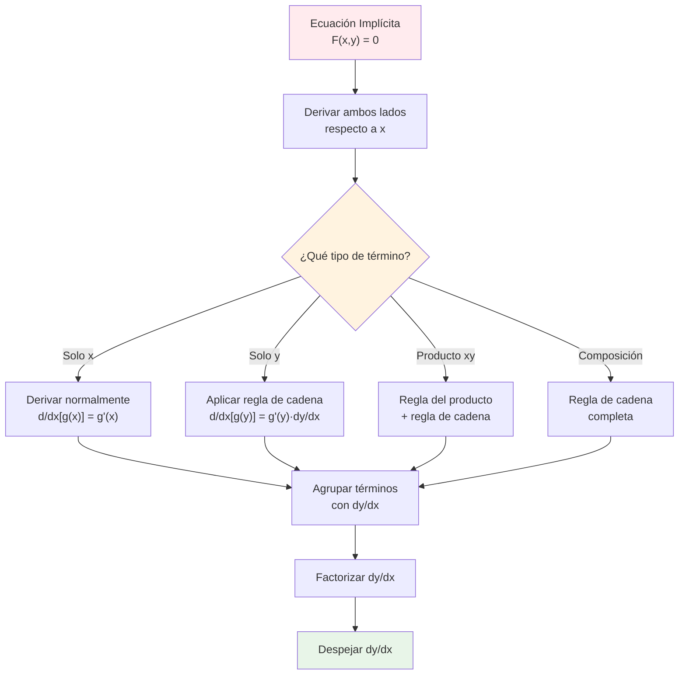

# 🔄 Derivación Implícita

> [!tip] 💡 Concepto Clave
> La derivación implícita es una técnica que permite encontrar la derivada de una función cuando está definida implícitamente por una ecuación, sin necesidad de despejar explícitamente y en términos de x. Es fundamental para curvas complejas y relaciones entre variables.

## 📐 Concepto Fundamental

> [!info] 🎯 Diferencia entre Explícita e Implícita
> 
> ### Función Explícita:
> $y = f(x)$ → $y$ está despejada en términos de $x$
> **Ejemplo**: $y = x^2 + 3x$
> 
> ### Función Implícita:
> $F(x,y) = 0$ → $y$ no está despejada
> **Ejemplo**: $x^2 + y^2 = 25$ (círculo)
> 
> ### Principio Clave:
> Si $y$ es función de $x$, entonces $\frac{d}{dx}[y] = \frac{dy}{dx}$

## 🧠 Métodos de Estudio y Mnemotecnias

> [!tip] 🎓 Mnemotecnia: "DERIVA TODO, MULTIPLICA Y"
> **D**eriva **E**n **R**elación **I**mplícita **V**ariables **A**mbas **T**odo **O**perando **D**iferencial **O**ptimo
> 
> ### Pasos del Método:
> 1. **D**eriva ambos lados de la ecuación respecto a $x$
> 2. **E**n cada término con $y$, multiplica por $\frac{dy}{dx}$
> 3. **R**ecuerda: $\frac{d}{dx}[y] = \frac{dy}{dx}$
> 4. **I**dentifica todos los términos con $\frac{dy}{dx}$
> 5. **V**e agrupando los términos con $\frac{dy}{dx}$ a un lado
> 6. **A**grupa términos sin $\frac{dy}{dx}$ al otro lado
> 7. **D**espeja $\frac{dy}{dx}$ factorizando

> [!example] 🧠 Método Visual: "La Cadena Invisible"
> Imagina que $y$ tiene una "cadena invisible" conectada a $x$:
> - Cada vez que derivas algo con $y$, la cadena "tira" y aparece $\frac{dy}{dx}$
> - La regla de la cadena actúa automáticamente: $\frac{d}{dx}[g(y)] = g'(y) \cdot \frac{dy}{dx}$

> [!note] 📝 Técnica de Identificación: "BUSCA Y MARCA"
> 1. **BUSCA**: Términos que contienen solo $x$ → derivan normal
> 2. **BUSCA**: Términos que contienen solo $y$ → derivan con $\frac{dy}{dx}$
> 3. **BUSCA**: Términos con productos $xy$ → regla del producto + cadena
> 4. **MARCA**: Todos los $\frac{dy}{dx}$ para agruparlos después

## 🧮 Ejemplos Básicos

### 🔵 Círculos

> [!example] 🔢 Ejemplo 1: Círculo
> **Resolver**: Si $x^2 + y^2 = 25$, encuentra $\frac{dy}{dx}$
> 
> **Paso 1**: Derivar ambos lados respecto a $x$
> $\frac{d}{dx}[x^2 + y^2] = \frac{d}{dx}[25]$
> 
> **Paso 2**: Aplicar reglas de derivación
> $\frac{d}{dx}[x^2] + \frac{d}{dx}[y^2] = 0$
> $2x + 2y\frac{dy}{dx} = 0$
> 
> **Paso 3**: Despejar $\frac{dy}{dx}$
> $2y\frac{dy}{dx} = -2x$
> $\frac{dy}{dx} = \frac{-2x}{2y} = -\frac{x}{y}$

### 🥚 Elipses

> [!example] 🔢 Ejemplo 1b: Elipse
> **Resolver**: Si $\frac{x^2}{16} + \frac{y^2}{9} = 1$, encuentra $\frac{dy}{dx}$
> 
> **Paso 1**: Derivar ambos lados respecto a $x$
> $\frac{d}{dx}\left[\frac{x^2}{16} + \frac{y^2}{9}\right] = \frac{d}{dx}[1]$
> 
> **Paso 2**: Aplicar reglas de derivación
> $\frac{2x}{16} + \frac{2y}{9}\frac{dy}{dx} = 0$
> $\frac{x}{8} + \frac{2y}{9}\frac{dy}{dx} = 0$
> 
> **Paso 3**: Despejar $\frac{dy}{dx}$
> $\frac{2y}{9}\frac{dy}{dx} = -\frac{x}{8}$
> $\frac{dy}{dx} = -\frac{x}{8} \cdot \frac{9}{2y} = -\frac{9x}{16y}$
> 
> **Interpretación**: Para elipses $\frac{x^2}{a^2} + \frac{y^2}{b^2} = 1$, la fórmula general es $\frac{dy}{dx} = -\frac{b^2x}{a^2y}$

> [!example] 🔢 Ejemplo 2: Ecuación con Productos
> **Resolver**: Si $x^2y + xy^2 = 6$, encuentra $\frac{dy}{dx}$
> 
> **Paso 1**: Derivar ambos lados
> $\frac{d}{dx}[x^2y + xy^2] = \frac{d}{dx}[6]$
> 
> **Paso 2**: Aplicar regla del producto en cada término
> - Para $x^2y$: $\frac{d}{dx}[x^2y] = 2xy + x^2\frac{dy}{dx}$
> - Para $xy^2$: $\frac{d}{dx}[xy^2] = y^2 + x \cdot 2y\frac{dy}{dx} = y^2 + 2xy\frac{dy}{dx}$
> 
> **Paso 3**: Escribir la ecuación completa
> $2xy + x^2\frac{dy}{dx} + y^2 + 2xy\frac{dy}{dx} = 0$
> 
> **Paso 4**: Agrupar términos con $\frac{dy}{dx}$
> $(x^2 + 2xy)\frac{dy}{dx} = -2xy - y^2$
> 
> **Paso 5**: Despejar
> $\frac{dy}{dx} = \frac{-2xy - y^2}{x^2 + 2xy} = \frac{-y(2x + y)}{x(x + 2y)}$

## 🔗 Ejemplos con Funciones Trigonométricas

> [!example] 🔢 Ejemplo 3: Trigonométricas Implícitas
> **Resolver**: Si $\sin(xy) + \cos(y) = x$, encuentra $\frac{dy}{dx}$
> 
> **Paso 1**: Derivar ambos lados
> $\frac{d}{dx}[\sin(xy)] + \frac{d}{dx}[\cos(y)] = \frac{d}{dx}[x]$
> 
> **Paso 2**: Aplicar regla de cadena
> - $\frac{d}{dx}[\sin(xy)] = \cos(xy) \cdot \frac{d}{dx}[xy] = \cos(xy)(y + x\frac{dy}{dx})$
> - $\frac{d}{dx}[\cos(y)] = -\sin(y) \cdot \frac{dy}{dx}$
> 
> **Paso 3**: Escribir ecuación completa
> $\cos(xy)(y + x\frac{dy}{dx}) - \sin(y)\frac{dy}{dx} = 1$
> 
> **Paso 4**: Expandir y agrupar
> $y\cos(xy) + x\cos(xy)\frac{dy}{dx} - \sin(y)\frac{dy}{dx} = 1$
> $(x\cos(xy) - \sin(y))\frac{dy}{dx} = 1 - y\cos(xy)$
> 
> **Paso 5**: Despejar
> $\frac{dy}{dx} = \frac{1 - y\cos(xy)}{x\cos(xy) - \sin(y)}$

## 📈 Ejemplos con Exponenciales y Logaritmos

> [!example] 🔢 Ejemplo 4: Exponenciales Implícitas
> **Resolver**: Si $e^{xy} + \ln(x + y) = 2$, encuentra $\frac{dy}{dx}$
> 
> **Paso 1**: Derivar ambos lados
> $\frac{d}{dx}[e^{xy}] + \frac{d}{dx}[\ln(x + y)] = \frac{d}{dx}[2]$
> 
> **Paso 2**: Aplicar regla de cadena
> - $\frac{d}{dx}[e^{xy}] = e^{xy} \cdot (y + x\frac{dy}{dx})$
> - $\frac{d}{dx}[\ln(x + y)] = \frac{1}{x + y} \cdot (1 + \frac{dy}{dx})$
> 
> **Paso 3**: Escribir ecuación
> $e^{xy}(y + x\frac{dy}{dx}) + \frac{1 + \frac{dy}{dx}}{x + y} = 0$
> 
> **Paso 4**: Expandir y agrupar
> $ye^{xy} + xe^{xy}\frac{dy}{dx} + \frac{1}{x + y} + \frac{1}{x + y}\frac{dy}{dx} = 0$
> 
> $(xe^{xy} + \frac{1}{x + y})\frac{dy}{dx} = -ye^{xy} - \frac{1}{x + y}$
> 
> **Paso 5**: Despejar
> $\frac{dy}{dx} = \frac{-ye^{xy} - \frac{1}{x + y}}{xe^{xy} + \frac{1}{x + y}}$

## 🎯 Derivadas de Orden Superior

> [!warning] 🚨 Segunda Derivada Implícita
> Para encontrar $\frac{d^2y}{dx^2}$, deriva la expresión de $\frac{dy}{dx}$ respecto a $x$:
> 
> ### Método para Funciones Implícitas:
> 1. Encuentra $\frac{dy}{dx}$ por derivación implícita
> 2. Deriva la expresión de $\frac{dy}{dx}$ respecto a $x$
> 3. Sustituye la expresión conocida de $\frac{dy}{dx}$
> 
> ### Método para Curvas Paramétricas:
> $$\frac{d^2y}{dx^2} = \frac{\frac{d}{dt}\left[\frac{dy}{dx}\right]}{\frac{dx}{dt}}$$

### 📐 Ejemplos de Segundas Derivadas

> [!example] 🔢 Segunda Derivada - Círculo
> **Del círculo**: $x^2 + y^2 = 25$, donde $\frac{dy}{dx} = -\frac{x}{y}$
> 
> **Encontrar** $\frac{d^2y}{dx^2}$:
> 
> $\frac{d^2y}{dx^2} = \frac{d}{dx}\left[-\frac{x}{y}\right]$
> 
> **Aplicando regla del cociente**:
> $\frac{d^2y}{dx^2} = -\frac{y \cdot 1 - x \cdot \frac{dy}{dx}}{y^2} = -\frac{y - x \cdot (-\frac{x}{y})}{y^2}$
> 
> $= -\frac{y + \frac{x^2}{y}}{y^2} = -\frac{\frac{y^2 + x^2}{y}}{y^2} = -\frac{y^2 + x^2}{y^3}$
> 
> **Como** $x^2 + y^2 = 25$:
> $\frac{d^2y}{dx^2} = -\frac{25}{y^3}$

> [!example] 🔢 Segunda Derivada - Elipse
> **De la elipse**: $\frac{x^2}{16} + \frac{y^2}{9} = 1$, donde $\frac{dy}{dx} = -\frac{9x}{16y}$
> 
> **Encontrar** $\frac{d^2y}{dx^2}$:
> 
> $\frac{d^2y}{dx^2} = \frac{d}{dx}\left[-\frac{9x}{16y}\right]$
> 
> **Aplicando regla del cociente**:
> $\frac{d^2y}{dx^2} = -\frac{9}{16} \cdot \frac{y \cdot 1 - x \cdot \frac{dy}{dx}}{y^2}$
> 
> $= -\frac{9}{16} \cdot \frac{y - x \cdot (-\frac{9x}{16y})}{y^2} = -\frac{9}{16} \cdot \frac{y + \frac{9x^2}{16y}}{y^2}$
> 
> $= -\frac{9}{16} \cdot \frac{\frac{16y^2 + 9x^2}{16y}}{y^2} = -\frac{9(16y^2 + 9x^2)}{16^2 y^3}$

> [!example] 🔢 Segunda Derivada - Paramétrica (Parábola)
> **De la parábola**: $x = t^2$, $y = 2t$, donde $\frac{dy}{dx} = \frac{1}{t}$
> 
> **Método paramétrico**:
> $\frac{d^2y}{dx^2} = \frac{\frac{d}{dt}\left[\frac{1}{t}\right]}{\frac{dx}{dt}} = \frac{-\frac{1}{t^2}}{2t} = -\frac{1}{2t^3}$
> 
> **Interpretación**: 
> - Cuando $t > 0$: $\frac{d^2y}{dx^2} < 0$ (cóncava hacia abajo)
> - Cuando $t < 0$: $\frac{d^2y}{dx^2} > 0$ (cóncava hacia arriba)

### 🔍 Análisis de Concavidad

> [!info] 📊 Interpretación de la Segunda Derivada
> 
> ### Para Curvas Implícitas:
> - $\frac{d^2y}{dx^2} > 0$: Curva cóncava hacia arriba
> - $\frac{d^2y}{dx^2} < 0$: Curva cóncava hacia abajo
> - $\frac{d^2y}{dx^2} = 0$: Posible punto de inflexión
> 
> ### Para Curvas Paramétricas:
> La concavidad se relaciona con la "curvatura" de la trayectoria
> 
> ### Puntos de Inflexión:
> Donde $\frac{d^2y}{dx^2} = 0$ y cambia de signo

## 🔄 Derivación Implícita con Curvas Paramétricas

> [!info] 📐 Curvas Paramétricas: Definición Completa
> Una curva paramétrica está definida por un conjunto de ecuaciones:
> - $x = f(t)$ (función posición horizontal)
> - $y = g(t)$ (función posición vertical)
> 
> donde $t$ es el **parámetro** (usualmente tiempo)
> 
> ### Fórmulas Fundamentales:
> $$\frac{dy}{dx} = \frac{\frac{dy}{dt}}{\frac{dx}{dt}} = \frac{g'(t)}{f'(t)}$$ (siempre que $f'(t) \neq 0$)
> 
> ### Segunda derivada:
> $$\frac{d^2y}{dx^2} = \frac{d}{dx}\left[\frac{dy}{dx}\right] = \frac{\frac{d}{dt}\left[\frac{dy}{dx}\right]}{\frac{dx}{dt}}$$

### 🎯 Ejemplos de Curvas Paramétricas

> [!example] 🔢 Ejemplo Paramétrico 1: Círculo Parametrizado
> **Curva**: $x = 5\cos(t)$, $y = 5\sin(t)$ (círculo de radio 5)
> 
> **Encontrar** $\frac{dy}{dx}$:
> 
> **Paso 1**: Calcular las derivadas respecto a $t$
> - $\frac{dx}{dt} = -5\sin(t)$
> - $\frac{dy}{dt} = 5\cos(t)$
> 
> **Paso 2**: Aplicar la fórmula
> $\frac{dy}{dx} = \frac{\frac{dy}{dt}}{\frac{dx}{dt}} = \frac{5\cos(t)}{-5\sin(t)} = -\frac{\cos(t)}{\sin(t)} = -\cot(t)$
> 
> **Verificación**: Si eliminamos el parámetro: $x^2 + y^2 = 25$
> Por derivación implícita: $\frac{dy}{dx} = -\frac{x}{y} = -\frac{5\cos(t)}{5\sin(t)} = -\cot(t)$ ✓

> [!example] 🔢 Ejemplo Paramétrico 2: Parábola
> **Curva**: $x = t^2$, $y = 2t$ (parábola)
> 
> **Encontrar** $\frac{dy}{dx}$ y $\frac{d^2y}{dx^2}$:
> 
> **Primera derivada**:
> - $\frac{dx}{dt} = 2t$
> - $\frac{dy}{dt} = 2$
> - $\frac{dy}{dx} = \frac{2}{2t} = \frac{1}{t}$ (para $t \neq 0$)
> 
> **Segunda derivada**:
> $\frac{d^2y}{dx^2} = \frac{d}{dx}\left[\frac{1}{t}\right] = \frac{\frac{d}{dt}\left[\frac{1}{t}\right]}{\frac{dx}{dt}} = \frac{-\frac{1}{t^2}}{2t} = -\frac{1}{2t^3}$

> [!example] 🔢 Ejemplo Paramétrico 3: Cicloide
> **Curva**: $x = r(t - \sin t)$, $y = r(1 - \cos t)$ (cicloide)
> 
> **Encontrar** $\frac{dy}{dx}$:
> 
> **Paso 1**: Derivadas respecto a $t$
> - $\frac{dx}{dt} = r(1 - \cos t)$
> - $\frac{dy}{dt} = r\sin t$
> 
> **Paso 2**: Primera derivada
> $\frac{dy}{dx} = \frac{r\sin t}{r(1 - \cos t)} = \frac{\sin t}{1 - \cos t}$
> 
> **Simplificación usando identidades**:
> $\frac{dy}{dx} = \frac{\sin t}{1 - \cos t} = \frac{2\sin(\frac{t}{2})\cos(\frac{t}{2})}{2\sin^2(\frac{t}{2})} = \cot\left(\frac{t}{2}\right)$

### 📊 Interpretación Geométrica de Paramétricas

> [!info] 📐 Significado Geométrico
> 
> ### Tangente Horizontal:
> $\frac{dy}{dx} = 0$ cuando $\frac{dy}{dt} = 0$ y $\frac{dx}{dt} \neq 0$
> 
> ### Tangente Vertical:
> $\frac{dy}{dx}$ indefinida cuando $\frac{dx}{dt} = 0$ y $\frac{dy}{dt} \neq 0$
> 
> ### Puntos Singulares:
> Cuando $\frac{dx}{dt} = 0$ y $\frac{dy}{dt} = 0$ simultáneamente
> 
> ### Velocidad del Punto:
> $v = \sqrt{\left(\frac{dx}{dt}\right)^2 + \left(\frac{dy}{dt}\right)^2}$

## ⚠️ Errores Comunes y Cómo Evitarlos

> [!warning] 🚨 Errores Frecuentes
> 
> ### Error 1: Olvidar $\frac{dy}{dx}$ en términos con $y$
> ❌ **Incorrecto**: $\frac{d}{dx}[y^2] = 2y$
> ✅ **Correcto**: $\frac{d}{dx}[y^2] = 2y \frac{dy}{dx}$
> 
> ### Error 2: No aplicar regla del producto correctamente
> ❌ **Incorrecto**: $\frac{d}{dx}[xy] = y\frac{dy}{dx}$
> ✅ **Correcto**: $\frac{d}{dx}[xy] = y + x\frac{dy}{dx}$
> 
> ### Error 3: Errores algebraicos al despejar
> ❌ **Incorrecto**: No factorizar correctamente $\frac{dy}{dx}$
> ✅ **Correcto**: Agrupar todos los términos con $\frac{dy}{dx}$ antes de factorizar
> 
> ### Error 4: No verificar que $y$ es función de $x$
> ❌ **Problema**: Asumir que siempre existe $\frac{dy}{dx}$
> ✅ **Correcto**: Verificar que la curva pasa la prueba de línea vertical

> [!tip] 💡 Estrategias Anti-Error
> 
> 1. **Marca cada $y$**: Cuando veas $y$, recuerda que necesita $\frac{dy}{dx}$
> 2. **Usa paréntesis**: Para productos como $(x)(y)$ clarifica la regla del producto
> 3. **Verifica dimensionalmente**: $\frac{dy}{dx}$ debe tener las dimensiones correctas
> 4. **Sustituye valores**: Verifica tu respuesta con puntos conocidos de la curva
> 5. **Deriva paso a paso**: No trates de hacer varios pasos mentalmente

## 📊 Aplicaciones Geométricas

> [!example] 🔢 Tangente a una Curva
> **Problema**: Encuentra la ecuación de la recta tangente a $x^2 + y^2 = 25$ en el punto $(3, 4)$.
> 
> **Paso 1**: Verificar que el punto está en la curva
> $3^2 + 4^2 = 9 + 16 = 25$ ✓
> 
> **Paso 2**: Encontrar la pendiente usando derivación implícita
> De antes: $\frac{dy}{dx} = -\frac{x}{y}$
> 
> **Paso 3**: Evaluar en el punto $(3, 4)$
> $\frac{dy}{dx}\Big|_{(3,4)} = -\frac{3}{4}$
> 
> **Paso 4**: Ecuación de la recta tangente
> $y - 4 = -\frac{3}{4}(x - 3)$
> $y = -\frac{3}{4}x + \frac{9}{4} + 4 = -\frac{3}{4}x + \frac{25}{4}$

## 🌊 Razones de Cambio Relacionadas

> [!info] 🔄 Aplicación en Problemas de Razones Relacionadas
> La derivación implícita es fundamental para resolver problemas donde varias cantidades cambian simultáneamente.
> 
> ### Método General:
> 1. Establecer la relación entre las variables
> 2. Derivar implícitamente respecto al tiempo $t$
> 3. Sustituir los valores conocidos
> 4. Resolver para la razón de cambio deseada

> [!example] 🔢 Ejemplo de Razones Relacionadas
> **Problema**: Un globo esférico se infla a razón de 50 cm³/min. ¿A qué velocidad aumenta el radio cuando el radio es 10 cm?
> 
> **Paso 1**: Relación entre variables
> $V = \frac{4}{3}\pi r^3$
> 
> **Paso 2**: Derivar respecto al tiempo
> $\frac{dV}{dt} = \frac{4}{3}\pi \cdot 3r^2 \frac{dr}{dt} = 4\pi r^2 \frac{dr}{dt}$
> 
> **Paso 3**: Sustituir valores conocidos
> $50 = 4\pi (10)^2 \frac{dr}{dt} = 400\pi \frac{dr}{dt}$
> 
> **Paso 4**: Resolver
> $\frac{dr}{dt} = \frac{50}{400\pi} = \frac{1}{8\pi}$ cm/min

## 📋 Tabla de Patrones Comunes

> [!note] 🚀 Derivadas Implícitas Frecuentes
> 
> | Expresión | Derivada Implícita |
> |-----------|-------------------|
> | $y^n$ | $ny^{n-1}\frac{dy}{dx}$ |
> | $xy$ | $y + x\frac{dy}{dx}$ |
> | $x^2y$ | $2xy + x^2\frac{dy}{dx}$ |
> | $\sin(y)$ | $\cos(y)\frac{dy}{dx}$ |
> | $e^y$ | $e^y\frac{dy}{dx}$ |
> | $\ln(y)$ | $\frac{1}{y}\frac{dy}{dx}$ |
> | $\sin(xy)$ | $\cos(xy)(y + x\frac{dy}{dx})$ |
> | $e^{xy}$ | $e^{xy}(y + x\frac{dy}{dx})$ |

## 🔗 Conexiones con Otros Temas

> [!quote] 📚 Relaciones Importantes
> 
> ### Prerequisitos:
> - [[Regla de la cadena]] - Base fundamental de la técnica
> - [[Derivadas de Funciones Trigonométricas]] - Para casos trigonométricos
> - [[Derivadas de funciones Exponenciales y Logarítmicas]] - Para casos exponenciales
> - [[Reglas de Derivación]] - Todas las reglas básicas
> 
> ### Aplicaciones:
> - [[Interpretación Geométrica de la Derivada]] - Rectas tangentes a curvas
> - **Razones de Cambio Relacionadas** - Problemas de aplicación
> - [[Optimización]] - Extremos en curvas implícitas
> 
> ### Extensiones:
> - **Ecuaciones Diferenciales** - Casos más avanzados
> - **Curvas Paramétricas** - Representaciones alternativas

## 🎲 Ejercicios de Práctica Graduados

> [!note] 🏋️ Para Dominar la Derivación Implícita
> 
> **Nivel Básico - Círculos y Elipses:**
> - $x^2 + y^2 = 16$, encuentra $\frac{dy}{dx}$
> - $\frac{x^2}{9} + \frac{y^2}{4} = 1$, encuentra $\frac{dy}{dx}$
> - $xy = 8$, encuentra $\frac{dy}{dx}$
> - $x^3 + y^3 = 27$, encuentra $\frac{dy}{dx}$
> 
> **Nivel Intermedio - Productos y Composiciones:**
> - $x^2y + xy^2 = 12$, encuentra $\frac{dy}{dx}$
> - $\sin(x + y) = x$, encuentra $\frac{dy}{dx}$
> - $e^{x+y} = xy$, encuentra $\frac{dy}{dx}$
> 
> **Nivel Avanzado - Casos Complejos:**
> - $\cos(xy) + \sin(y) = 1$, encuentra $\frac{dy}{dx}$
> - $x^y = y^x$, encuentra $\frac{dy}{dx}$
> - $\ln(x^2 + y^2) = \arctan(\frac{y}{x})$, encuentra $\frac{dy}{dx}$
> 
> **Curvas Paramétricas:**
> - $x = 3\cos(t)$, $y = 3\sin(t)$, encuentra $\frac{dy}{dx}$
> - $x = t^3$, $y = t^2$, encuentra $\frac{dy}{dx}$ y $\frac{d^2y}{dx^2}$
> - $x = e^t$, $y = t^2$, encuentra $\frac{dy}{dx}$
> 
> **Segundas Derivadas:**
> - Para $x^2 + y^2 = 25$, encuentra $\frac{d^2y}{dx^2}$
> - Para $xy = 1$, encuentra $\frac{d^2y}{dx^2}$
> - Para $x = t^2$, $y = 2t$, encuentra $\frac{d^2y}{dx^2}$
> 
> **Aplicaciones Geométricas:**
> - Ecuación de la tangente a $x^2 + 4y^2 = 20$ en $(2, 2)$
> - Ecuación de la tangente a $x = t^2 + 1$, $y = t^3 - t$ en $t = 1$
> - Puntos de tangente horizontal en $x^2 + xy + y^2 = 3$
> 
> **Razones de Cambio:**
> - Si $x^2 + y^2 = 100$ y $\frac{dx}{dt} = 3$, encuentra $\frac{dy}{dt}$ cuando $x = 6$
> - Para una elipse $\frac{x^2}{25} + \frac{y^2}{16} = 1$, si $\frac{dx}{dt} = 2$, encuentra $\frac{dy}{dt}$ cuando $x = 3$

## 📖 Técnicas de Verificación

> [!note] 🎓 Métodos para Verificar Respuestas
> 
> ### Verificación Algebraica:
> 1. **Sustituye tu resultado** en la ecuación original derivada
> 2. **Verifica que se cumple** la igualdad
> 
> ### Verificación Numérica:
> 3. **Elige un punto** específico en la curva
> 4. **Calcula la pendiente** usando tu fórmula
> 5. **Compara** con la pendiente geométrica aproximada
> 
> ### Verificación por Casos Especiales:
> 6. **Busca puntos** donde $\frac{dy}{dx} = 0$ (tangentes horizontales)
> 7. **Busca puntos** donde $\frac{dy}{dx}$ es indefinida (tangentes verticales)
> 8. **Verifica** que tiene sentido geométrico

---

**Tags**: #calculo #derivadas #derivacion-implicita #regla-cadena #curvas-implicitas #rectas-tangentes #razones-relacionadas #geometria-analitica