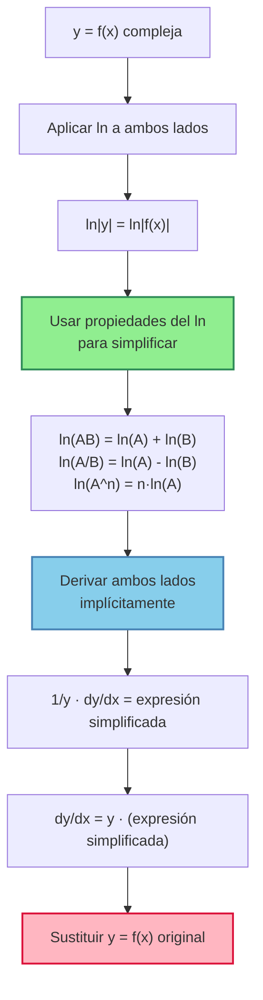
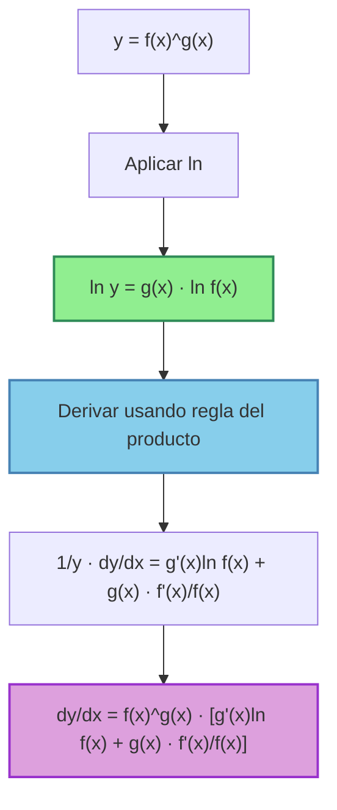
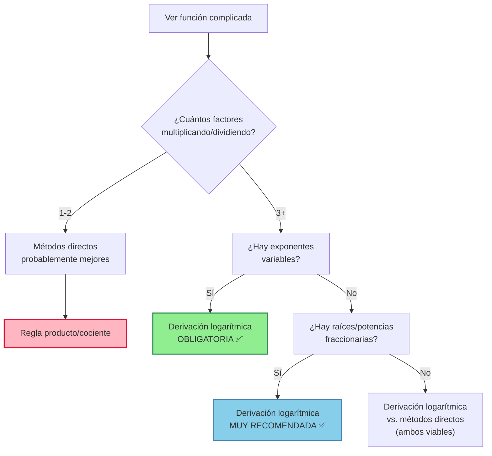

# 🔄 Derivación Logarítmica

> [!tip] 💡 Concepto Clave
> La derivación logarítmica es una técnica poderosa que usa las propiedades del logaritmo natural para simplificar el cálculo de derivadas de funciones complejas, especialmente productos, cocientes y funciones de la forma $f(x)^{g(x)}$.

## 🎯 Fundamento Teórico

### 🔑 Principio Base

> [!info] 📊 Fórmula Fundamental
> Si $y = f(x)$, entonces:
> $$\frac{d}{dx}[\ln|y|] = \frac{1}{y} \cdot \frac{dy}{dx}$$
> 
> Por lo tanto: $$\frac{dy}{dx} = y \cdot \frac{d}{dx}[\ln|y|]$$



## 📊 Casos de Aplicación

### 1️⃣ Técnica $\ln$ para Productos Complejos

> [!info] 🧮 Método Logarítmico para Productos
> **Problema**: Derivar productos como $y = f_1(x) \cdot f_2(x) \cdot f_3(x) \cdots f_n(x)$
> 
> **Solución tradicional** (regla del producto):
> - $\frac{dy}{dx} = f_1'f_2f_3\cdots f_n + f_1f_2'f_3\cdots f_n + f_1f_2f_3'\cdots f_n + \cdots$ (n términos)
> 
> **Solución con $\ln$**:
> - $\ln|y| = \ln|f_1(x)| + \ln|f_2(x)| + \ln|f_3(x)| + \cdots + \ln|f_n(x)|$
> - $\frac{1}{y}\frac{dy}{dx} = \frac{f_1'}{f_1} + \frac{f_2'}{f_2} + \frac{f_3'}{f_3} + \cdots + \frac{f_n'}{f_n}$
> - $\frac{dy}{dx} = y\left[\frac{f_1'}{f_1} + \frac{f_2'}{f_2} + \frac{f_3'}{f_3} + \cdots + \frac{f_n'}{f_n}\right]$
> 
> **Ventaja**: Un solo término elegante vs. n términos complicados

> [!example] 🔢 Ejemplo 1: Producto de Múltiples Funciones
> **Encontrar**: $\frac{d}{dx}\left[x^2(x+1)^3\sqrt{x-2}\right]$ para $x > 2$
> 
> **Solución**:
> - Sea $y = x^2(x+1)^3\sqrt{x-2}$
> - $\ln y = 2\ln x + 3\ln(x+1) + \frac{1}{2}\ln(x-2)$
> - Derivando: $\frac{1}{y}\frac{dy}{dx} = \frac{2}{x} + \frac{3}{x+1} + \frac{1}{2(x-2)}$
> - **Resultado**: $\frac{dy}{dx} = x^2(x+1)^3\sqrt{x-2}\left[\frac{2}{x} + \frac{3}{x+1} + \frac{1}{2(x-2)}\right]$

### 2️⃣ Cocientes Complejos

> [!example] 🔢 Ejemplo 2: Cociente Complejo
> **Encontrar**: $\frac{d}{dx}\left[\frac{x^3(x+1)^2}{\sqrt{x-1}(2x+3)^4}\right]$ para $x > 1$
> 
> **Solución**:
> - Sea $y = \frac{x^3(x+1)^2}{\sqrt{x-1}(2x+3)^4}$
> - $\ln y = 3\ln x + 2\ln(x+1) - \frac{1}{2}\ln(x-1) - 4\ln(2x+3)$
> - $\frac{1}{y}\frac{dy}{dx} = \frac{3}{x} + \frac{2}{x+1} - \frac{1}{2(x-1)} - \frac{8}{2x+3}$
> - **Resultado**: $\frac{dy}{dx} = y \cdot \left[\frac{3}{x} + \frac{2}{x+1} - \frac{1}{2(x-1)} - \frac{8}{2x+3}\right]$

### 3️⃣ Funciones de la Forma $f(x)^{g(x)}$

> [!info] 🧮 Caso Especial: Exponente Variable
> **El problema único**: Cuando tanto la base como el exponente dependen de $x$
> 
> **¿Por qué es especial?**
> - La regla de potencias $\frac{d}{dx}[x^n] = nx^{n-1}$ NO aplica (exponente variable)
> - La regla exponencial $\frac{d}{dx}[a^x] = a^x \ln a$ NO aplica (base variable)
> - ¡Necesitamos una técnica especial!
> 
> **Solución logarítmica**:
> Para $y = f(x)^{g(x)}$:
> 1. $\ln y = g(x) \ln f(x)$ 
> 2. $\frac{1}{y}\frac{dy}{dx} = g'(x)\ln f(x) + g(x) \cdot \frac{f'(x)}{f(x)}$
> 3. $\frac{dy}{dx} = f(x)^{g(x)} \left[g'(x)\ln f(x) + g(x) \cdot \frac{f'(x)}{f(x)}\right]$
> 
> **Patrón de memoria**: *"g prima por ln de f, más g por f prima sobre f"*



> [!example] 🔢 Ejemplo 3: $x^x$
> **Encontrar**: $\frac{d}{dx}[x^x]$ para $x > 0$
> 
> **Solución**:
> - Sea $y = x^x$, entonces $\ln y = x \ln x$
> - $\frac{1}{y}\frac{dy}{dx} = \ln x + 1$
> - **Resultado**: $\frac{dy}{dx} = x^x(\ln x + 1)$

> [!example] 🔢 Ejemplo 4: Base y Exponente Variables
> **Encontrar**: $\frac{d}{dx}[(x^2+1)^{\sin x}]$
> 
> **Solución**:
> - Sea $y = (x^2+1)^{\sin x}$, entonces $\ln y = \sin x \cdot \ln(x^2+1)$
> - $\frac{1}{y}\frac{dy}{dx} = \cos x \cdot \ln(x^2+1) + \sin x \cdot \frac{2x}{x^2+1}$
> - **Resultado**: $\frac{dy}{dx} = (x^2+1)^{\sin x}\left[\cos x \cdot \ln(x^2+1) + \frac{2x\sin x}{x^2+1}\right]$

## 🧮 Simplificación de Derivadas Complicadas

### ¿Cuándo Usar la Técnica Logarítmica?

> [!info] 📈 Criterios de Decisión
> 
> **✅ SÍ usar derivación logarítmica cuando:**
> - **Productos de 3+ funciones**: $x^2(x+1)^3\sqrt{x-2}(x+5)^4$
> - **Cocientes complejos**: $\frac{x^3(x+1)^2\sqrt{x-5}}{(x-1)^4(x+3)^2}$
> - **Exponentes variables**: $x^x$, $(x^2+1)^{\sin x}$, $(\ln x)^{\cos x}$
> - **Raíces múltiples**: $\sqrt{x}\sqrt[3]{x+1}\sqrt[4]{x-2}$
> - **Mezcla de todo lo anterior**
> 
> **❌ NO usar (métodos directos son mejores):**
> - Productos simples de 2 funciones: $x^2 \sin x$
> - Funciones con exponente constante: $x^3$, $(\sin x)^2$
> - Funciones exponenciales simples: $e^x$, $2^x$

### Comparación Práctica: Eficiencia del Método

> [!example] 🔢 Comparación Directa: $\frac{d}{dx}[x(x+1)(x+2)(x+3)]$
> 
> **Método 1 - Regla del Producto Tradicional**:
> - Expandir primero: $x(x+1)(x+2)(x+3) = x^4 + 6x^3 + 11x^2 + 6x$
> - Derivar: $\frac{d}{dx} = 4x^3 + 18x^2 + 22x + 6$
> - **Tiempo**: Medio, requiere expansión algebraica
> 
> **Método 2 - Regla del Producto Directa**:
> - $(x+1)(x+2)(x+3) + x(x+2)(x+3) + x(x+1)(x+3) + x(x+1)(x+2)$
> - **Tiempo**: Largo, 4 términos complicados
> 
> **Método 3 - Derivación Logarítmica**:
> - $\ln y = \ln x + \ln(x+1) + \ln(x+2) + \ln(x+3)$
> - $\frac{1}{y}\frac{dy}{dx} = \frac{1}{x} + \frac{1}{x+1} + \frac{1}{x+2} + \frac{1}{x+3}$
> - $\frac{dy}{dx} = x(x+1)(x+2)(x+3)\left[\frac{1}{x} + \frac{1}{x+1} + \frac{1}{x+2} + \frac{1}{x+3}\right]$
> - **Tiempo**: Rápido, patrón claro y sistemático ✅

### Estrategia para Casos Extremadamente Complicados

> [!example] 🔢 Ejemplo Complejo: Simplificación Radical
> **Encontrar**: $\frac{d}{dx}\left[\frac{x^3(x^2+1)^2\sqrt[3]{x-1}\sqrt{x+2}}{(x-3)^4\sqrt[5]{x+4}(x^2-4)^3}\right]$ para $x > 3$
> 
> **Análisis**: Sin logaritmos sería un desastre absoluto
> 
> **Solución sistemática**:
> - $\ln y = 3\ln|x| + 2\ln(x^2+1) + \frac{1}{3}\ln|x-1| + \frac{1}{2}\ln(x+2)$
>   $\phantom{\ln y =} - 4\ln|x-3| - \frac{1}{5}\ln(x+4) - 3\ln|x^2-4|$
> 
> - $\frac{1}{y}\frac{dy}{dx} = \frac{3}{x} + \frac{4x}{x^2+1} + \frac{1}{3(x-1)} + \frac{1}{2(x+2)}$
>   $\phantom{\frac{1}{y}\frac{dy}{dx} =} - \frac{4}{x-3} - \frac{1}{5(x+4)} - \frac{6x}{x^2-4}$
> 
> - **Resultado**: $\frac{dy}{dx} = y \times [\text{expresión anterior}]$
> 
> **Ventaja clave**: Convertimos un problema de cálculo pesado en simple aritmética algebraica

### Patrones de Reconocimiento Visual



### Casos Donde la Simplificación es Dramática

> [!example] 🔢 Antes vs. Después de $\ln$
> 
> **Caso 1**: $y = \sqrt{x}\sqrt[3]{x+1}\sqrt[4]{x+2}\sqrt[5]{x+3}$
> - **Sin logaritmos**: Regla del producto aplicada 3 veces, cada término tiene múltiples raíces
> - **Con logaritmos**: $\ln y = \frac{1}{2}\ln x + \frac{1}{3}\ln(x+1) + \frac{1}{4}\ln(x+2) + \frac{1}{5}\ln(x+3)$
> - **Simplicidad**: De pesadilla a trivial
> 
> **Caso 2**: $y = x^{\sin x}$
> - **Sin logaritmos**: ¡Imposible con reglas básicas!
> - **Con logaritmos**: $\ln y = \sin x \cdot \ln x$, derivar con regla del producto
> - **Posibilidad**: De imposible a rutinario

> [!example] 🔢 Ejemplo 5: Múltiples Raíces
> **Encontrar**: $\frac{d}{dx}\left[\frac{\sqrt[3]{x^2+1}\sqrt{x-1}}{\sqrt[4]{x+3}}\right]$ para $x > 1$
> 
> **Solución**:
> - Sea $y = \frac{(x^2+1)^{1/3}(x-1)^{1/2}}{(x+3)^{1/4}}$
> - $\ln y = \frac{1}{3}\ln(x^2+1) + \frac{1}{2}\ln(x-1) - \frac{1}{4}\ln(x+3)$
> - $\frac{1}{y}\frac{dy}{dx} = \frac{2x}{3(x^2+1)} + \frac{1}{2(x-1)} - \frac{1}{4(x+3)}$
> - **Resultado**: $\frac{dy}{dx} = y \cdot \left[\frac{2x}{3(x^2+1)} + \frac{1}{2(x-1)} - \frac{1}{4(x+3)}\right]$

## ⚠️ Consideraciones Importantes

> [!warning] 🚨 Cuidados y Limitaciones
> 
> ### Dominio y Signos
> - **Verificar que $f(x) > 0$** en el intervalo
> - **Usar $\ln|f(x)|$** cuando $f(x)$ puede ser negativa
> - **Considerar discontinuidades** donde $f(x) = 0$
> 
> ### Casos Problemáticos
> - **$0^0$, $\infty^0$, $1^\infty$**: Formas indeterminadas
> - **Bases negativas**: Análisis especial requerido
> - **Cambios de signo**: Análisis por intervalos

> [!tip] 💡 Estrategias de Éxito
> 
> ### Reconocimiento de Patrones
> **"¿PCEF?"** - Lista de verificación:
> - **P**roducto de muchas funciones → ✅
> - **C**ociente complejo → ✅  
> - **E**xponente variable $f(x)^{g(x)}$ → ✅
> - **F**unción simple → Métodos directos mejor ❌

## 🧠 Técnicas de Estudio Recomendadas

> [!tip] 🎓 Mnemotecnias y Estrategias
> 
> ### 🔤 Pasos Clave: "LDP-S"
> - **L**ogaritmo natural a ambos lados
> - **D**escomponer usando propiedades del ln
> - **P**roducto/Cociente → suma/resta
> - **S**ustituir y al final
> 
> ### 🧮 Propiedades del Logaritmo
> ```
> ln(AB) = ln(A) + ln(B)    [× → +]
> ln(A/B) = ln(A) - ln(B)   [÷ → -]
> ln(A^n) = n·ln(A)         [potencia baja]
> ```
> 
> ### 📝 Plantilla Mental
> 1. "¿Vale la pena el logaritmo?"
> 2. "Aplicar ln y expandir"
> 3. "Derivar implícitamente"
> 4. "Multiplicar por y original"
> 5. "Simplificar resultado"

## 📊 Tabla de Referencia Rápida

> [!info] 📋 Casos Fundamentales
> 
> |Tipo de Función|Procedimiento|Resultado|
> |---|---|---|
> |$y = f_1 \cdot f_2 \cdot f_3$|$\ln y = \ln f_1 + \ln f_2 + \ln f_3$|$\frac{dy}{dx} = y\left[\frac{f_1'}{f_1} + \frac{f_2'}{f_2} + \frac{f_3'}{f_3}\right]$|
> |$y = \frac{f_1 \cdot f_2}{g_1 \cdot g_2}$|$\ln y = \ln f_1 + \ln f_2 - \ln g_1 - \ln g_2$|$\frac{dy}{dx} = y\left[\frac{f_1'}{f_1} + \frac{f_2'}{f_2} - \frac{g_1'}{g_1} - \frac{g_2'}{g_2}\right]$|
> |$y = f(x)^{g(x)}$|$\ln y = g(x)\ln f(x)$|$\frac{dy}{dx} = f(x)^{g(x)}\left[g'(x)\ln f(x) + g(x)\frac{f'(x)}{f(x)}\right]$|

## 🔗 Conexiones con Otros Temas

> [!quote] 📚 Notas Relacionadas
> 
> ### Prerequisitos
> - [[Regla de la cadena]] - Fundamental para derivación implícita
> - [[Derivación Implícita]] - Base teórica del método
> - [[Propiedades de Logaritmos]] - Esencial para simplificación
> - [[Regla del Producto y Cociente]] - Para comparar eficiencia
> 
> ### Temas Relacionados
> - [[Integrales de Funciones Inversas]] 🔄 - Conexión con casos complejos
> - [[Funciones Exponenciales]] - Casos $a^{f(x)}$ y $f(x)^a$
> - [[Límites Indeterminados]] - Aplicación para formas $1^\infty$, $0^0$
> - [[Optimización]] - Derivadas complejas en máximos/mínimos

## 📝 Ejercicios Recomendados

> [!note] 🎓 Para Practicar
> 
> ### Nivel Básico
> 1. $\frac{d}{dx}[x^2(x+1)^3(x-2)^4]$
> 2. $\frac{d}{dx}\left[\frac{x^3\sqrt{x+1}}{(x-1)^2}\right]$
> 3. $\frac{d}{dx}[x^{\sin x}]$
> 
> ### Nivel Intermedio
> 4. $\frac{d}{dx}[(\cos x)^{\tan x}]$
> 5. $\frac{d}{dx}\left[\frac{(x^2\sin x)^x}{\sqrt{x+1}}\right]$
> 6. $\frac{d}{dx}[(\arcsin x)^{\ln x}]$
> 
> ### Nivel Avanzado
> 7. $\lim_{x \to 0^+} (\sin x)^x$ usando derivación logarítmica
> 8. $\frac{d}{dx}\left[\left(\frac{x+1}{x-1}\right)^{x^2}\right]$
> 9. $\frac{d}{dx}[(x^x)^x]$

---

**Tags**: #calculo #derivadas #derivacion-logaritmica #funciones-exponenciales #regla-cadena #productos-complejos #exponentes-variables