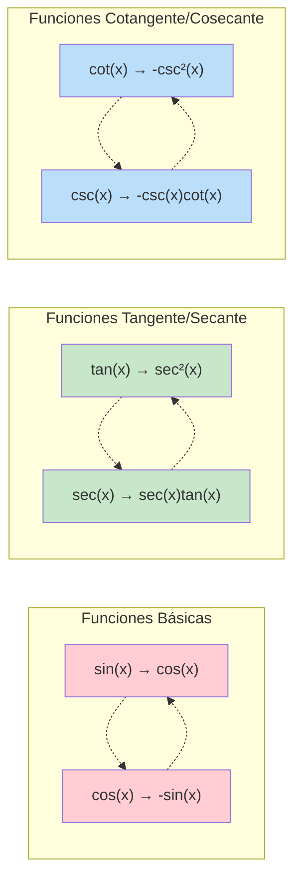

# 📐 Derivadas de Funciones Trigonométricas

> [!tip] 💡 Concepto Clave
> Las derivadas de funciones trigonométricas son fundamentales en cálculo y tienen patrones específicos que se pueden memorizar mediante técnicas mnemotécnicas. Estas derivadas aparecen frecuentemente en física, ingeniería y matemáticas aplicadas.

## 📋 Tabla de Derivadas Básicas

> [!info] 🎯 Derivadas de las 6 Funciones Trigonométricas Principales
> 
> | Función | Derivada | Mnemotecnia |
> |---------|----------|-------------|
> | $\sin(x)$ | $\cos(x)$ | "Seno se convierte en coseno" |
> | $\cos(x)$ | $-\sin(x)$ | "Coseno cambia signo y se vuelve seno" |
> | $\tan(x)$ | $\sec^2(x)$ | "Tangente al cuadrado secante" |
> | $\cot(x)$ | $-\csc^2(x)$ | "Cotangente negativa cosecante cuadrada" |
> | $\sec(x)$ | $\sec(x)\tan(x)$ | "Secante se multiplica por tangente" |
> | $\csc(x)$ | $-\csc(x)\cot(x)$ | "Cosecante negativa por cotangente" |

## 🧠 Métodos de Estudio y Mnemotecnias

> [!tip] 🎓 Mnemotecnia: "CÍRCULO TRIGONOMÉTRICO MENTAL"
> 
> ### Técnica del Círculo de Derivadas:
> ```
>     cos(x)
>       ↑
> sin(x) → -sin(x)
>       ↓
>    -cos(x)
> ```
> 
> **Regla**: Girando en sentido horario:
> - $\sin(x) \rightarrow \cos(x) \rightarrow -\sin(x) \rightarrow -\cos(x) \rightarrow \sin(x)$
> - Cada derivada es la siguiente función en el círculo

> [!example] 🧠 Mnemotecnia: "SOCOTA" (Signos)
> **S**eno → **O**k (positivo)
> **C**oseno → **O**puesta (negativo)  
> **T**angente → **A**lways positive (sec² siempre positivo)
> 
> **Para las recíprocas, recuerda**: "Las CO-funciones son negativas"
> - $\cot(x) \rightarrow -\csc^2(x)$ (negativo)
> - $\csc(x) \rightarrow -\csc(x)\cot(x)$ (negativo)

> [!note] 📝 Técnica Visual: "PAREJAS BAILANDO"
> - **Pareja 1**: $\sin$ y $\cos$ se turnan (uno se convierte en el otro)
> - **Pareja 2**: $\tan$ y $\sec$ bailan juntos ($\tan \rightarrow \sec^2$, $\sec \rightarrow \sec \tan$)
> - **Pareja 3**: $\cot$ y $\csc$ bailan juntos ($\cot \rightarrow -\csc^2$, $\csc \rightarrow -\csc \cot$)



## 🧮 Ejemplos con Regla de la Cadena

> [!example] 🔢 Ejemplo 1: Función Trigonométrica Simple
> **Resolver**: $\frac{d}{dx}[\sin(3x)]$
> 
> **Aplicando regla de la cadena**:
> - Función externa: $\sin(u)$ → derivada: $\cos(u)$
> - Función interna: $u = 3x$ → derivada: $3$
> - **Resultado**: $\frac{d}{dx}[\sin(3x)] = \cos(3x) \cdot 3 = 3\cos(3x)$

> [!example] 🔢 Ejemplo 2: Composición Más Compleja
> **Resolver**: $\frac{d}{dx}[\tan(x^2 + 1)]$
> 
> **Aplicando regla de la cadena**:
> - Función externa: $\tan(u)$ → derivada: $\sec^2(u)$
> - Función interna: $u = x^2 + 1$ → derivada: $2x$
> - **Resultado**: $\frac{d}{dx}[\tan(x^2 + 1)] = \sec^2(x^2 + 1) \cdot 2x = 2x\sec^2(x^2 + 1)$

> [!example] 🔢 Ejemplo 3: Producto de Funciones Trigonométricas
> **Resolver**: $\frac{d}{dx}[\sin(x)\cos(x)]$
> 
> **Aplicando regla del producto**:
> - $\frac{d}{dx}[\sin(x)\cos(x)] = \sin'(x)\cos(x) + \sin(x)\cos'(x)$
> - $= \cos(x)\cos(x) + \sin(x)(-\sin(x))$
> - $= \cos^2(x) - \sin^2(x) = \cos(2x)$

> [!example] 🔢 Ejemplo 4: Función Trigonométrica Elevada a una Potencia
> **Resolver**: $\frac{d}{dx}[\sin^3(x)]$
> 
> **Método**: Regla de la cadena + regla de la potencia
> - Reescribir: $[\sin(x)]^3$
> - Función externa: $u^3$ → derivada: $3u^2$
> - Función interna: $u = \sin(x)$ → derivada: $\cos(x)$
> - **Resultado**: $3[\sin(x)]^2 \cdot \cos(x) = 3\sin^2(x)\cos(x)$

## 📊 Patrones y Regularidades

> [!info] 🔍 Patrones Importantes a Recordar
> 
> ### Patrón 1: Alternancia de Signos
> - Las funciones **co-** (coseno, cotangente, cosecante) introducen signos negativos
> - $\cos(x) \rightarrow -\sin(x)$
> - $\cot(x) \rightarrow -\csc^2(x)$
> - $\csc(x) \rightarrow -\csc(x)\cot(x)$
> 
> ### Patrón 2: Funciones al Cuadrado
> - Derivadas de $\tan$ y $\cot$ involucran funciones al cuadrado
> - $\tan(x) \rightarrow \sec^2(x)$
> - $\cot(x) \rightarrow -\csc^2(x)$
> 
> ### Patrón 3: Productos en Derivadas de Secante y Cosecante
> - $\sec(x) \rightarrow \sec(x)\tan(x)$
> - $\csc(x) \rightarrow -\csc(x)\cot(x)$

## 🎯 Aplicaciones Comunes

> [!example] 📊 Casos Frecuentes en Problemas
> 
> ### Movimiento Armónico Simple
> **Posición**: $x(t) = A\sin(\omega t + \phi)$  
> **Velocidad**: $v(t) = A\omega\cos(\omega t + \phi)$  
> **Aceleración**: $a(t) = -A\omega^2\sin(\omega t + \phi)$
> 
> ### Ondas y Oscilaciones
> **Función de onda**: $y = A\sin(kx - \omega t)$  
> **Derivada espacial**: $\frac{\partial y}{\partial x} = Ak\cos(kx - \omega t)$  
> **Derivada temporal**: $\frac{\partial y}{\partial t} = -A\omega\cos(kx - \omega t)$

## 📈 Derivadas de Funciones Trigonométricas Inversas

> [!info] 🎯 Tabla de Funciones Inversas
>| Función        | Derivada                                               | Dominio                          |
|----------------|--------------------------------------------------------|-----------------------------------|
| arcsin(x)      | $\frac{1}{\sqrt{1 - x^2}}$                             | $(-1, 1)$                         |
| arccos(x)      | $\frac{-1}{\sqrt{1 - x^2}}$                            | $(-1, 1)$                         |
| arctan(x)      | $\frac{1}{1 + x^2}$                                    | $(-\infty, \infty)$               |
| arccot(x)      | $\frac{-1}{1 + x^2}$                                   | $(-\infty, \infty)$               |
| arcsec(x)      | $\frac{1}{\|x\| \sqrt{x^2 - 1}}$                       | $(-\infty, -1) \cup (1, \infty)$  |
| arccsc(x)      | $\frac{-1}{\|x\| \sqrt{x^2 - 1}}$                      | $(-\infty, -1) \cup (1, \infty)$  |


## ⚠️ Errores Comunes y Prevención

> [!warning] 🚨 Errores Frecuentes
> 
> ### Error 1: Olvidar el Signo Negativo
> ❌ **Incorrecto**: $\frac{d}{dx}[\cos(x)] = \sin(x)$  
> ✅ **Correcto**: $\frac{d}{dx}[\cos(x)] = -\sin(x)$
> 
> ### Error 2: Confundir las Funciones al Cuadrado
> ❌ **Incorrecto**: $\frac{d}{dx}[\tan(x)] = \tan^2(x)$  
> ✅ **Correcto**: $\frac{d}{dx}[\tan(x)] = \sec^2(x)$
> 
> ### Error 3: No Aplicar Regla de la Cadena
> ❌ **Incorrecto**: $\frac{d}{dx}[\sin(3x)] = \cos(3x)$  
> ✅ **Correcto**: $\frac{d}{dx}[\sin(3x)] = 3\cos(3x)$

> [!tip] 💡 Estrategias de Verificación
> 1. **Método del círculo**: Usa el círculo trigonométrico mental
> 2. **Verificación numérica**: Prueba con valores específicos
> 3. **Identidades**: Usa identidades para verificar ($\sin^2 + \cos^2 = 1$)
> 4. **Simetría**: Recuerda las propiedades de paridad de las funciones

## 🔗 Conexiones con Otros Temas

> [!quote] 📚 Relaciones con Otros Conceptos
> 
> ### Fundamentos Previos:
> - [[Regla de la cadena]] - Esencial para funciones compuestas
> - [[Reglas de Derivación]] - Reglas básicas del producto y cociente
> - [[Derivadas y Definición Formal]] - Demostración de las fórmulas
> 
> ### Aplicaciones:
> - [[Derivación Implícita]] - Para ecuaciones con funciones trigonométricas
> - [[Interpretación Geométrica de la Derivada]] - Pendientes de curvas trigonométricas
> - [[Optimización]] - Máximos y mínimos de funciones trigonométricas
> 
> ### Hacia Cálculo Integral:
> - [[Integrales Trigonométricas]] - Aplicación inversa
> - [[Cambio de Variable en Integrales]] - Sustituciones trigonométricas

## 🎲 Ejercicios de Práctica Graduados

> [!note] 🏋️ Para Dominar las Derivadas Trigonométricas
> 
> **Nivel Básico:**
> - $\frac{d}{dx}[\sin(2x)]$
> - $\frac{d}{dx}[\cos(x/2)]$
> - $\frac{d}{dx}[\tan(3x)]$
> 
> **Nivel Intermedio:**
> - $\frac{d}{dx}[\sin^2(x)]$
> - $\frac{d}{dx}[x\cos(x)]$
> - $\frac{d}{dx}[\sec(x^2)]$
> 
> **Nivel Avanzado:**
> - $\frac{d}{dx}[\sin(x)\cos(x)]$
> - $\frac{d}{dx}[\tan^3(2x+1)]$
> - $\frac{d}{dx}[\arcsin(x^2)]$
> 
> **Nivel Experto:**
> - $\frac{d}{dx}[\sin(\cos(x^2))]$
> - $\frac{d}{dx}[x^2\sin(x)\cos(x)]$
> - $\frac{d}{dx}[\arctan(\sqrt{1+x^2})]$

## 📊 Tabla de Referencia Rápida con Regla de la Cadena

> [!note] 🚀 Fórmulas Generales para $f(g(x))$
> 
> | Función Compuesta | Derivada |
> |-------------------|----------|
> | $\sin(g(x))$ | $\cos(g(x)) \cdot g'(x)$ |
> | $\cos(g(x))$ | $-\sin(g(x)) \cdot g'(x)$ |
> | $\tan(g(x))$ | $\sec^2(g(x)) \cdot g'(x)$ |
> | $\cot(g(x))$ | $-\csc^2(g(x)) \cdot g'(x)$ |
> | $\sec(g(x))$ | $\sec(g(x))\tan(g(x)) \cdot g'(x)$ |
> | $\csc(g(x))$ | $-\csc(g(x))\cot(g(x)) \cdot g'(x)$ |

## 📖 Técnicas de Memorización Avanzadas

> [!note] 🎓 Métodos de Estudio Especializados
> 
> ### Método de las "Familias":
> - **Familia Seno-Coseno**: Se intercambian (con cuidado en el signo del coseno)
> - **Familia Tangente-Secante**: Siempre aparecen juntas en las derivadas
> - **Familia Cotangente-Cosecante**: Siempre negativas y juntas
> 
> ### Técnica del "Espejo":
> - $\sin$ ↔ $\cos$ (se reflejan)
> - $\tan$ → $\sec^2$ (tangente ve su reflejo al cuadrado)
> - $\sec$ → $\sec \tan$ (secante se mira con tangente)
> 
> ### Método de Construcción:
> 1. **Identifica la función base**
> 2. **Aplica la regla específica**
> 3. **Multiplica por la derivada interna** (regla de la cadena)
> 4. **Simplifica usando identidades trigonométricas**

---

**Tags**: #calculo #derivadas #funciones-trigonometricas #regla-cadena #mnemotecnias #metodos-estudio #identidades-trigonometricas