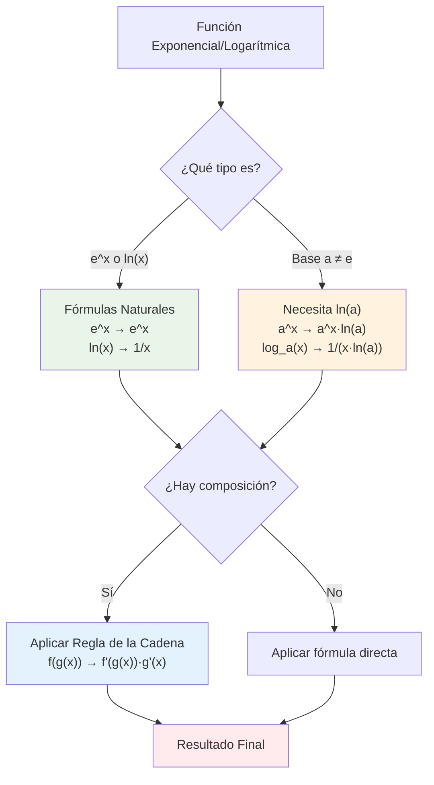

# 📈 Derivadas de Funciones Exponenciales y Logarítmicas

> [!tip] 💡 Concepto Clave
> Las funciones exponenciales y logarítmicas son inversas entre sí, y sus derivadas reflejan esta relación especial. Estas funciones modelan crecimiento y decaimiento en situaciones reales como poblaciones, finanzas, y procesos físicos.

## 📋 Tabla de Derivadas Fundamentales

> [!info] 🎯 Fórmulas Básicas
> 
> ### Funciones Exponenciales:
> | Función | Derivada | Dominio |
> |---------|----------|---------|
> | $e^x$ | $e^x$ | $\mathbb{R}$ |
> | $a^x$ | $a^x \ln(a)$ | $\mathbb{R}$, $a > 0, a \neq 1$ |
> | $e^{g(x)}$ | $e^{g(x)} \cdot g'(x)$ | Dominio de $g(x)$ |
> | $a^{g(x)}$ | $a^{g(x)} \ln(a) \cdot g'(x)$ | Dominio de $g(x)$ |
> 
> ### Funciones Logarítmicas:
> | Función | Derivada | Dominio |
> |---------|----------|---------|
> | $\ln(x)$ | $\frac{1}{x}$ | $(0, +\infty)$ |
> | $\log_a(x)$ | $\frac{1}{x \ln(a)}$ | $(0, +\infty)$, $a > 0, a \neq 1$ |
> | $\ln(g(x))$ | $\frac{g'(x)}{g(x)}$ | $g(x) > 0$ |
> | $\log_a(g(x))$ | $\frac{g'(x)}{g(x) \ln(a)}$ | $g(x) > 0$ |

## 🧠 Métodos de Estudio y Mnemotecnias

> [!tip] 🎓 Mnemotecnia: "EL EXPONENTE SE CLONA"
> **E**xponencial **L**o **E**special **X**que **P**ermanece **O**riginal **N**unca **E**s **N**ada **T**rivial **E**n **S**u **E**cuación
> 
> ### Para Exponenciales:
> - **$e^x$**: "La función que es su propia derivada" (se clona)
> - **$a^x$**: "Necesita su ADN logarítmico" (multiplica por $\ln(a)$)
> 
> ### Para Logarítmicos:
> - **$\ln(x)$**: "Uno sobre x" (reciproco simple)
> - **$\log_a(x)$**: "Necesita dividir por su ADN" (dividir por $\ln(a)$)

> [!example] 🧠 Método Visual: "La Pareja Inversa"
> Imagina que exponencial y logaritmo son pareja de baile:
> - **Exponencial**: Crece rápidamente hacia arriba (derivada es ella misma)
> - **Logarítmo**: Crece lentamente (derivada es $1/x$, cada vez más pequeña)
> - Cuando se combinan: "Se ayudan mutuamente" (regla de la cadena)

> [!note] 📝 Técnica del "ADN Logarítmico"
> Toda base $a \neq e$ necesita su "ADN" que es $\ln(a)$:
> - **Exponencial**: $a^x$ → $a^x \ln(a)$ (multiplica por ADN)
> - **Logarítmica**: $\log_a(x)$ → $\frac{1}{x \ln(a)}$ (divide por ADN)



## 🧮 Ejemplos Básicos

> [!example] 🔢 Ejemplo 1: Exponencial Natural
> **Resolver**: $\frac{d}{dx}[e^x]$
> 
> **Solución directa**:
> $\frac{d}{dx}[e^x] = e^x$
> 
> **Característica especial**: $e^x$ es la única función que es igual a su derivada.

> [!example] 🔢 Ejemplo 2: Exponencial con Base Diferente
> **Resolver**: $\frac{d}{dx}[2^x]$
> 
> **Aplicando la fórmula**:
> $\frac{d}{dx}[2^x] = 2^x \ln(2)$
> 
> **Verificación**: $\ln(2) \approx 0.693$, por lo que la derivada crece más lento que $e^x$.

> [!example] 🔢 Ejemplo 3: Logaritmo Natural
> **Resolver**: $\frac{d}{dx}[\ln(x)]$
> 
> **Solución directa**:
> $\frac{d}{dx}[\ln(x)] = \frac{1}{x}$, para $x > 0$

> [!example] 🔢 Ejemplo 4: Logaritmo con Base Diferente
> **Resolver**: $\frac{d}{dx}[\log_{10}(x)]$
> 
> **Aplicando la fórmula**:
> $\frac{d}{dx}[\log_{10}(x)] = \frac{1}{x \ln(10)}$
> 
> **Nota**: $\ln(10) \approx 2.303$, por lo que esta derivada es menor que la de $\ln(x)$.

## 🔗 Ejemplos con Regla de la Cadena

> [!example] 🔢 Ejemplo 5: Exponencial Compuesta
> **Resolver**: $\frac{d}{dx}[e^{3x^2 + 1}]$
> 
> **Identificación**:
> - Función externa: $e^u$ → derivada: $e^u$
> - Función interna: $u = 3x^2 + 1$ → derivada: $6x$
> 
> **Solución**:
> $\frac{d}{dx}[e^{3x^2 + 1}] = e^{3x^2 + 1} \cdot 6x = 6xe^{3x^2 + 1}$

> [!example] 🔢 Ejemplo 6: Logaritmo Compuesto
> **Resolver**: $\frac{d}{dx}[\ln(x^2 + 5x)]$
> 
> **Identificación**:
> - Función externa: $\ln(u)$ → derivada: $\frac{1}{u}$
> - Función interna: $u = x^2 + 5x$ → derivada: $2x + 5$
> 
> **Solución**:
> $\frac{d}{dx}[\ln(x^2 + 5x)] = \frac{1}{x^2 + 5x} \cdot (2x + 5) = \frac{2x + 5}{x^2 + 5x}$

> [!example] 🔢 Ejemplo 7: Exponencial con Base Variable
> **Resolver**: $\frac{d}{dx}[3^{x^2}]$
> 
> **Aplicando la fórmula con regla de la cadena**:
> $\frac{d}{dx}[3^{x^2}] = 3^{x^2} \ln(3) \cdot 2x = 2x \ln(3) \cdot 3^{x^2}$

## 🎯 Casos Especiales y Técnicas Avanzadas

> [!warning] 🚨 Derivación Logarítmica
> Para funciones de la forma $[g(x)]^{h(x)}$, usamos **derivación logarítmica**:
> 
> ### Método:
> 1. Tomar logaritmo: $\ln(y) = \ln([g(x)]^{h(x)}) = h(x) \ln(g(x))$
> 2. Derivar implícitamente: $\frac{1}{y} \frac{dy}{dx} = h'(x) \ln(g(x)) + h(x) \frac{g'(x)}{g(x)}$
> 3. Despejar: $\frac{dy}{dx} = y \left[ h'(x) \ln(g(x)) + h(x) \frac{g'(x)}{g(x)} \right]$
> 4. Sustituir $y$: $\frac{dy}{dx} = [g(x)]^{h(x)} \left[ h'(x) \ln(g(x)) + h(x) \frac{g'(x)}{g(x)} \right]$

> [!example] 🔢 Ejemplo de Derivación Logarítmica
> **Resolver**: $\frac{d}{dx}[x^x]$
> 
> **Paso 1**: $y = x^x$, entonces $\ln(y) = x \ln(x)$
> 
> **Paso 2**: Derivar implícitamente:
> $\frac{1}{y} \frac{dy}{dx} = 1 \cdot \ln(x) + x \cdot \frac{1}{x} = \ln(x) + 1$
> 
> **Paso 3**: Despejar:
> $\frac{dy}{dx} = y(\ln(x) + 1) = x^x(\ln(x) + 1)$

## 📊 Propiedades Importantes

> [!info] 🔍 Propiedades Clave
> 
> ### Relación Inversa:
> - Si $y = e^x$, entonces $x = \ln(y)$
> - $\frac{d}{dx}[e^x] = e^x$ y $\frac{d}{dx}[\ln(x)] = \frac{1}{x}$
> - Producto de derivadas: $e^x \cdot \frac{1}{e^x} = 1$ ✓
> 
> ### Cambio de Base:
> - $a^x = e^{x \ln(a)}$ (útil para derivar)
> - $\log_a(x) = \frac{\ln(x)}{\ln(a)}$ (útil para derivar)
> 
> ### Identidades Útiles:
> - $\frac{d}{dx}[\ln|x|] = \frac{1}{x}$ (para $x \neq 0$)
> - $\frac{d}{dx}[x^n] = nx^{n-1}$ vs $\frac{d}{dx}[n^x] = n^x \ln(n)$

## 🌱 Aplicaciones en Crecimiento y Decaimiento

> [!example] 🧬 Crecimiento Exponencial
> **Problema**: Una población de bacterias crece según $P(t) = 1000e^{0.05t}$. 
> Encuentra la tasa de crecimiento instantánea.
> 
> **Solución**:
> $P'(t) = 1000 \cdot e^{0.05t} \cdot 0.05 = 50e^{0.05t}$
> 
> **Interpretación**: La tasa de crecimiento es proporcional a la población actual.

> [!example] 💰 Interés Compuesto Continuo
> **Problema**: Una inversión crece según $A(t) = 5000e^{0.06t}$. 
> ¿Cuál es la tasa de crecimiento después de 10 años?
> 
> **Solución**:
> $A'(t) = 5000 \cdot e^{0.06t} \cdot 0.06 = 300e^{0.06t}$
> 
> En $t = 10$: $A'(10) = 300e^{0.6} \approx 300(1.822) = \$546.6$ por año

## 🔍 Derivación Implícita con Exponenciales y Logaritmos

> [!example] 🔢 Ejemplo de Derivación Implícita
> **Resolver**: Si $xe^y + \ln(xy) = 5$, encuentra $\frac{dy}{dx}$
> 
> **Derivando ambos lados**:
> $\frac{d}{dx}[xe^y] + \frac{d}{dx}[\ln(xy)] = \frac{d}{dx}[5]$
> 
> **Aplicando reglas**:
> - $\frac{d}{dx}[xe^y] = e^y + xe^y \frac{dy}{dx}$ (regla del producto)
> - $\frac{d}{dx}[\ln(xy)] = \frac{1}{xy} \cdot (y + x\frac{dy}{dx})$ (regla de cadena)
> 
> **Ecuación resultante**:
> $e^y + xe^y \frac{dy}{dx} + \frac{y + x\frac{dy}{dx}}{xy} = 0$
> 
> **Simplificando**:
> $e^y + xe^y \frac{dy}{dx} + \frac{1}{x} + \frac{1}{y}\frac{dy}{dx} = 0$
> 
> **Despejando** $\frac{dy}{dx}$:
> $\frac{dy}{dx}\left(xe^y + \frac{1}{y}\right) = -e^y - \frac{1}{x}$
> 
> $\frac{dy}{dx} = \frac{-e^y - \frac{1}{x}}{xe^y + \frac{1}{y}} = \frac{-\frac{xe^y + 1}{x}}{\frac{xye^y + 1}{y}} = \frac{-y(xe^y + 1)}{x(xye^y + 1)}$

## ⚠️ Errores Comunes y Cómo Evitarlos

> [!warning] 🚨 Errores Frecuentes
> 
> ### Error 1: Olvidar el $\ln(a)$ en bases diferentes de $e$
> ❌ **Incorrecto**: $\frac{d}{dx}[2^x] = 2^x$
> ✅ **Correcto**: $\frac{d}{dx}[2^x] = 2^x \ln(2)$
> 
> ### Error 2: Dominio del logaritmo
> ❌ **Incorrecto**: $\frac{d}{dx}[\ln(x)] = \frac{1}{x}$ para todo $x$
> ✅ **Correcto**: $\frac{d}{dx}[\ln(x)] = \frac{1}{x}$ solo para $x > 0$
> 
> ### Error 3: No aplicar regla de la cadena
> ❌ **Incorrecto**: $\frac{d}{dx}[\ln(x^2)] = \frac{1}{x^2}$
> ✅ **Correcto**: $\frac{d}{dx}[\ln(x^2)] = \frac{1}{x^2} \cdot 2x = \frac{2}{x}$
> 
> ### Error 4: Confundir $x^n$ con $n^x$
> ❌ **Confusión**: $\frac{d}{dx}[x^3] = 3^x \ln(3)$
> ✅ **Correcto**: $\frac{d}{dx}[x^3] = 3x^2$ y $\frac{d}{dx}[3^x] = 3^x \ln(3)$

> [!tip] 💡 Estrategias Anti-Error
> 
> 1. **Identifica la base**: ¿Es $e$ o otra base?
> 2. **Verifica el dominio**: Logaritmos requieren argumento positivo
> 3. **Busca composición**: ¿Hay función dentro de función?
> 4. **Usa derivación logarítmica**: Para exponentes variables
> 5. **Verifica con casos simples**: $\frac{d}{dx}[e^x] = e^x$

## 🎲 Casos Especiales Avanzados

> [!example] 🔢 Funciones Hiperbólicas
> Las funciones hiperbólicas están definidas en términos de exponenciales:
> 
> **Definiciones**:
> - $\sinh(x) = \frac{e^x - e^{-x}}{2}$
> - $\cosh(x) = \frac{e^x + e^{-x}}{2}$
> 
> **Derivadas**:
> - $\frac{d}{dx}[\sinh(x)] = \cosh(x)$
> - $\frac{d}{dx}[\cosh(x)] = \sinh(x)$

> [!example] 🔢 Logaritmo de Valor Absoluto
> **Para funciones que pueden ser negativas**:
> 
> $\frac{d}{dx}[\ln|g(x)|] = \frac{g'(x)}{g(x)}$
> 
> **Ejemplo**: $\frac{d}{dx}[\ln|x|] = \frac{1}{x}$ para $x \neq 0$

## 📊 Tabla de Referencia Completa

> [!note] 🚀 Guía de Consulta Rápida
> 
> ### Exponenciales Básicas:
> ```
> d/dx[e^x] = e^x
> d/dx[a^x] = a^x · ln(a)
> d/dx[e^(g(x))] = e^(g(x)) · g'(x)
> d/dx[a^(g(x))] = a^(g(x)) · ln(a) · g'(x)
> ```
> 
> ### Logarítmicas Básicas:
> ```
> d/dx[ln(x)] = 1/x
> d/dx[log_a(x)] = 1/(x·ln(a))
> d/dx[ln(g(x))] = g'(x)/g(x)
> d/dx[log_a(g(x))] = g'(x)/(g(x)·ln(a))
> ```
> 
> ### Casos Especiales:
> ```
> d/dx[x^x] = x^x(ln(x) + 1)
> d/dx[ln|x|] = 1/x (x ≠ 0)
> d/dx[(g(x))^(h(x))] = usa derivación logarítmica
> ```

## 🔗 Conexiones con Otros Temas

> [!quote] 📚 Relaciones Importantes
> 
> ### Prerequisitos:
> - [[Regla de la cadena]] - Esencial para funciones compuestas
> - [[Derivación Implícita]] - Para ecuaciones complejas
> - [[Reglas de Derivación]] - Fundamentos básicos
> 
> ### Aplicaciones:
> - [[Optimización]] - Crecimiento y decaimiento óptimo
> - [[Interpretación Geométrica de la Derivada]] - Pendientes de curvas exponenciales
> - **Modelos de Crecimiento** - Poblaciones, finanzas, física
> 
> ### Hacia Cálculo Integral:
> - [[Integración por Sustitución]] - Inversión del proceso
> - [[Aplicaciones de Integrales]] - Áreas bajo curvas exponenciales

## 🎲 Ejercicios de Práctica Graduados

> [!note] 🏋️ Para Dominar Exponenciales y Logarítmos
> 
> **Nivel Básico:**
> - $\frac{d}{dx}[e^{2x}]$
> - $\frac{d}{dx}[\ln(3x)]$
> - $\frac{d}{dx}[5^x]$
> 
> **Nivel Intermedio:**
> - $\frac{d}{dx}[xe^x]$
> - $\frac{d}{dx}[\frac{\ln(x)}{x}]$
> - $\frac{d}{dx}[e^{x^2} \ln(x)]$
> 
> **Nivel Avanzado:**
> - $\frac{d}{dx}[x^{\sin(x)}]$ (derivación logarítmica)
> - $\frac{d}{dx}[\ln(\cos(e^x))]$
> - $\frac{d}{dx}[(x^2 + 1)^x]$
> 
> **Derivación Implícita:**
> - $e^{xy} + \ln(x + y) = 1$, encuentra $\frac{dy}{dx}$
> - $x^y = y^x$, encuentra $\frac{dy}{dx}$

## 📖 Técnicas de Memorización Avanzadas

> [!note] 🎓 Métodos de Estudio Efectivos
> 
> ### Regla del "ADN":
> - Base $e$: No necesita ADN (es natural)
> - Base $a$: Necesita su ADN = $\ln(a)$
> 
> ### Patrón de Reciprocidad:
> - $e^x$ y $\ln(x)$ son inversos
> - Sus derivadas también: $e^x$ y $\frac{1}{x}$
> 
> ### Verificación Cruzada:
> Si $y = e^x$, entonces $x = \ln(y)$
> $\frac{dy}{dx} = e^x$ y $\frac{dx}{dy} = \frac{1}{y} = \frac{1}{e^x}$
> Producto: $e^x \cdot \frac{1}{e^x} = 1$ ✓

---

**Tags**: #calculo #derivadas #exponenciales #logaritmos #derivacion-logaritmica #crecimiento-exponencial #regla-cadena #aplicaciones-reales