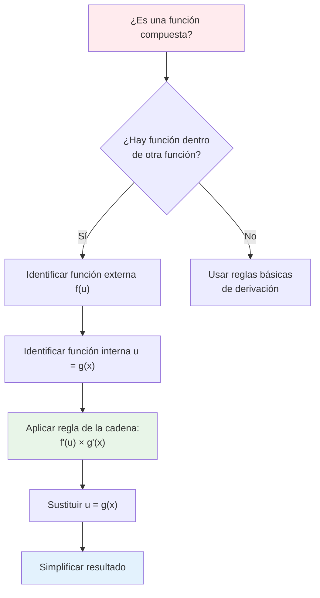

# ⛓️ Regla de la Cadena

> [!tip] 💡 Concepto Clave
> La regla de la cadena es una técnica fundamental para derivar funciones compuestas, donde una función está dentro de otra función. Es la base para entender cómo se relacionan las tasas de cambio en funciones complejas.

## 📐 Fórmula Principal

> [!info] 🎯 Fórmula de la Regla de la Cadena
> Para una función compuesta $f(g(x))$:
> 
> $$\frac{d}{dx}[f(g(x))] = f'(g(x)) \cdot g'(x)$$
> 
> **En notación de Leibniz**:
> $$\frac{dy}{dx} = \frac{dy}{du} \cdot \frac{du}{dx}$$
> 
> **Donde**:
> - $y = f(u)$ es la función externa
> - $u = g(x)$ es la función interna
> - Se deriva "de afuera hacia adentro"

## 🧠 Métodos de Estudio y Mnemotecnias

> [!tip] 🎓 Mnemotecnia: "CADENA"
> **C**omposición **A**fuera **D**entro **E**n **N**otación **A**decuada
> 
> 1. **C**omposición: Identifica las funciones compuestas
> 2. **A**fuera: Deriva la función externa primero
> 3. **D**entro: Multiplica por la derivada de la función interna
> 4. **E**valúa: Sustituye la función interna en la derivada externa
> 5. **N**otación: Mantén la notación clara
> 6. **A**decuada: Simplifica el resultado

> [!example] 🧠 Método Visual: "Cebolla Matemática"
> Imagina pelar una cebolla matemática:
> - **Capa externa**: $f(u)$ → deriva $f'(u)$
> - **Capa interna**: $u = g(x)$ → deriva $g'(x)$
> - **Resultado**: Multiplica las "cáscaras" derivadas

> [!note] 📝 Técnica de Identificación: "DENTRO-FUERA"
> 1. **DENTRO**: ¿Qué función está adentro de los paréntesis?
> 2. **FUERA**: ¿Qué operación se aplica a toda la expresión?
> 3. **DERIVA**: Exterior × Interior derivado

## 🔍 Identificación de Funciones Compuestas

> [!example] 📊 Patrones Comunes
> 
> ### Tipo 1: Potencias de Funciones
> $[g(x)]^n$ → Función interna elevada a una potencia
> 
> ### Tipo 2: Funciones Trigonométricas Compuestas
> $\sin(g(x))$, $\cos(g(x))$ → Trigonométrica de una función
> 
> ### Tipo 3: Exponenciales y Logaritmos
> $e^{g(x)}$, $\ln(g(x))$ → Exponencial/logaritmo de una función
> 
> ### Tipo 4: Composiciones Múltiples
> $f(g(h(x)))$ → Función dentro de función dentro de función

## 🧮 Ejemplos Resueltos

> [!example] 🔢 Ejemplo 1: Potencia de una Función
> **Resolver**: $\frac{d}{dx}[(3x + 1)^5]$
> 
> **Identificación**:
> - Función externa: $f(u) = u^5$
> - Función interna: $u = 3x + 1$
> 
> **Solución**:
> - $f'(u) = 5u^4$
> - $g'(x) = 3$
> - $\frac{d}{dx}[(3x + 1)^5] = 5(3x + 1)^4 \cdot 3 = 15(3x + 1)^4$

> [!example] 🔢 Ejemplo 2: Función Trigonométrica Compuesta
> **Resolver**: $\frac{d}{dx}[\sin(x^2)]$
> 
> **Identificación**:
> - Función externa: $f(u) = \sin(u)$
> - Función interna: $u = x^2$
> 
> **Solución**:
> - $f'(u) = \cos(u)$
> - $g'(x) = 2x$
> - $\frac{d}{dx}[\sin(x^2)] = \cos(x^2) \cdot 2x = 2x\cos(x^2)$

> [!example] 🔢 Ejemplo 3: Exponencial Compuesta
> **Resolver**: $\frac{d}{dx}[e^{x^3 + 2x}]$
> 
> **Identificación**:
> - Función externa: $f(u) = e^u$
> - Función interna: $u = x^3 + 2x$
> 
> **Solución**:
> - $f'(u) = e^u$
> - $g'(x) = 3x^2 + 2$
> - $\frac{d}{dx}[e^{x^3 + 2x}] = e^{x^3 + 2x} \cdot (3x^2 + 2)$

> [!example] 🔢 Ejemplo 4: Composición Triple
> **Resolver**: $\frac{d}{dx}[\sin(\cos(x^2))]$
> 
> **Método por capas**:
> - Capa 1: $h(x) = x^2$ → $h'(x) = 2x$
> - Capa 2: $g(x) = \cos(h(x))$ → $g'(x) = -\sin(h(x)) \cdot h'(x)$
> - Capa 3: $f(x) = \sin(g(x))$ → $f'(x) = \cos(g(x)) \cdot g'(x)$
> 
> **Resultado**:
> $\frac{d}{dx}[\sin(\cos(x^2))] = \cos(\cos(x^2)) \cdot (-\sin(x^2)) \cdot 2x = -2x\sin(x^2)\cos(\cos(x^2))$

## 🎯 Casos Especiales y Aplicaciones

> [!warning] 🚨 Derivación Implícita con Regla de la Cadena
> Cuando $y$ está definida implícitamente en términos de $x$:
> 
> **Ejemplo**: $x^2 + y^2 = 25$
> 
> Derivando ambos lados:
> $2x + 2y\frac{dy}{dx} = 0$
> 
> Aquí aplicamos regla de la cadena a $y^2$: $\frac{d}{dx}[y^2] = 2y \cdot \frac{dy}{dx}$

> [!info] 📐 Regla de la Cadena Generalizada
> Para $n$ funciones compuestas:
> 
> $$\frac{d}{dx}[f_1(f_2(f_3(...f_n(x)...)))] = f_1'(f_2(...)) \cdot f_2'(f_3(...)) \cdot ... \cdot f_n'(x)$$

## 📊 Tabla de Referencia Rápida

> [!note] 🚀 Derivadas Comunes con Regla de la Cadena
> 
> | Función | Derivada |
> |---------|----------|
> | $[g(x)]^n$ | $n[g(x)]^{n-1} \cdot g'(x)$ |
> | $\sin(g(x))$ | $\cos(g(x)) \cdot g'(x)$ |
> | $\cos(g(x))$ | $-\sin(g(x)) \cdot g'(x)$ |
> | $e^{g(x)}$ | $e^{g(x)} \cdot g'(x)$ |
> | $\ln(g(x))$ | $\frac{g'(x)}{g(x)}$ |
> | $\tan(g(x))$ | $\sec^2(g(x)) \cdot g'(x)$ |
> | $\sqrt{g(x)}$ | $\frac{g'(x)}{2\sqrt{g(x)}}$ |

## ⚠️ Errores Comunes y Cómo Evitarlos

> [!warning] 🚨 Errores Frecuentes
> 
> ### Error 1: Olvidar la Derivada Interna
> ❌ **Incorrecto**: $\frac{d}{dx}[(2x+1)^3] = 3(2x+1)^2$
> ✅ **Correcto**: $\frac{d}{dx}[(2x+1)^3] = 3(2x+1)^2 \cdot 2 = 6(2x+1)^2$
> 
> ### Error 2: Aplicar Mal el Orden
> ❌ **Incorrecto**: Derivar primero la función interna
> ✅ **Correcto**: Derivar primero la externa, luego multiplicar por la derivada de la interna
> 
> ### Error 3: Confundir Funciones Simples con Compuestas
> ❌ **Incorrecto**: Aplicar regla de la cadena a $\sin(x)$
> ✅ **Correcto**: Solo aplicar cuando hay composición real

> [!tip] 💡 Estrategias para Evitar Errores
> 
> 1. **Identifica claramente** qué es función externa e interna
> 2. **Escribe paso a paso** cada derivada por separado
> 3. **Verifica** que has incluido todas las derivadas necesarias
> 4. **Practica** con funciones simples antes de las complejas
> 5. **Usa paréntesis** para mantener clara la estructura

## 🔗 Conexiones con Otros Temas

> [!quote] 📚 Relaciones con Otros Conceptos
> 
> ### Hacia Adelante:
> - [[Derivación Implícita]] - Aplicación directa de la regla
> - [[Reglas fundamentales de Derivación]] - Combinación con otras reglas
> - [[Interpretación Geométrica de la Derivada]] - Significado geométrico
> - [[Derivadas y Definición Formal]] - Demostración formal
> 
> ### Hacia Adelante (Cálculo Integral):
> - [[Cambio de Variable en Integrales]] - Versión inversa para integración
> - [[Integración por Sustitución]] - Aplicación en sentido contrario

## 🎲 Ejercicios de Práctica Graduados

> [!note] 🏋️ Para Dominar la Técnica
> 
> **Nivel Básico:**
> - $\frac{d}{dx}[(x+1)^4]$
> - $\frac{d}{dx}[\sin(2x)]$
> - $\frac{d}{dx}[e^{3x}]$
> 
> **Nivel Intermedio:**
> - $\frac{d}{dx}[(x^2+1)^{3/2}]$
> - $\frac{d}{dx}[\cos(x^2+x)]$
> - $\frac{d}{dx}[\ln(x^2+1)]$
> 
> **Nivel Avanzado:**
> - $\frac{d}{dx}[\sin(\cos(x^2))]$
> - $\frac{d}{dx}[e^{\sin(x^3)}]$
> - $\frac{d}{dx}[(\ln(x^2+1))^5]$
> 
> **Nivel Experto:**
> - $\frac{d}{dx}[\tan(\sqrt{x^2+\sin(x)})]$
> - $\frac{d}{dx}[e^{x\cos(x^2)}]$

## 📖 Notas de Estudio Efectivas

> [!note] 🎓 Técnicas de Memorización
> 
> ### Método del "Peeling" (Pelado):
> 1. **Identifica las capas** de la función
> 2. **Pela una capa a la vez** (deriva la externa)
> 3. **Multiplica por lo que queda** (deriva la interna)
> 4. **Repite** hasta llegar al centro
> 
> ### Técnica de Colores:
> - **Rojo**: Función externa
> - **Azul**: Función interna  
> - **Verde**: Derivadas
> - Conecta visualmente los colores
> 
> ### Método de Verificación:
> Siempre verifica derivando un ejemplo simple como $(x+1)^2$ tanto:
> - Por regla de la cadena: $2(x+1) \cdot 1 = 2x+2$
> - Expandiendo primero: $(x+1)^2 = x^2+2x+1$ → $2x+2$ ✓

---

**Tags**: #calculo #derivadas #regla-cadena #funciones-compuestas #tecnicas-derivacion #mnemotecnias #metodos-estudio