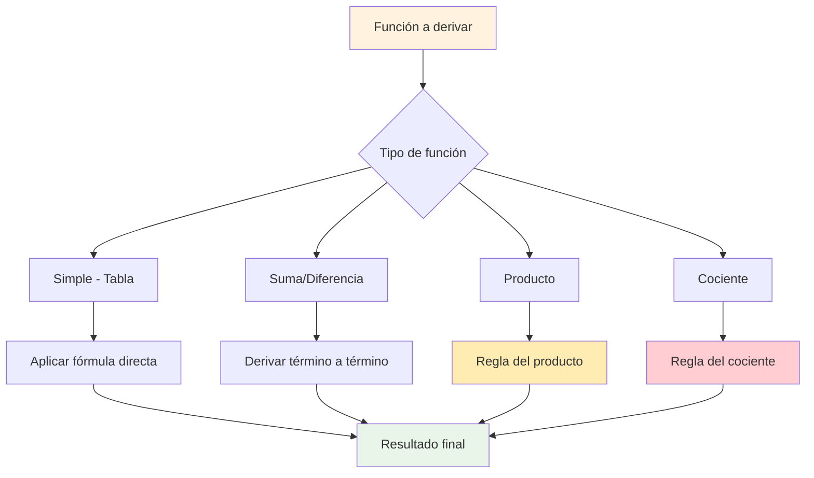
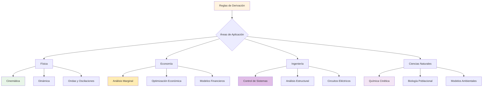
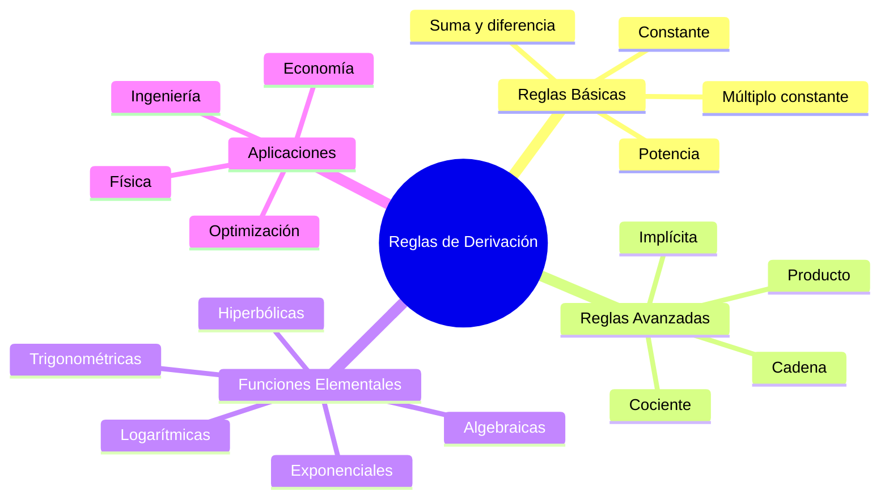

# ⚙️ Reglas Fundamentales de Derivación

## 📖 Introducción

> [!info] 💡 Concepto Fundamental
> Las **reglas fundamentales de derivación** son un conjunto de fórmulas y técnicas que nos permiten calcular derivadas de manera sistemática y eficiente, sin necesidad de recurrir constantemente a la definición por límites. Estas reglas forman la base del cálculo diferencial y son herramientas esenciales para cualquier aplicación matemática, física o ingenieril.

> [!tip] 🎯 ¿Por qué son importantes?
> 
> - Permiten **calcular derivadas rápidamente** sin usar límites
> - Son la **base** para técnicas más avanzadas de derivación
> - **Simplifican** enormemente los cálculos en aplicaciones
> - Facilitan el **análisis de funciones** complejas
> - Son **fundamentales** para optimización y modelado matemático
> - **Ahorran tiempo** y reducen errores en cálculos

---

## 🔤 Definiciones y Notación

> [!note] 📝 **Notación de Derivadas**
> 
> **Notación de Leibniz**:
> • $\frac{d}{dx}[f(x)]$ o $\frac{df}{dx}$
> • Énfasis en la variable de derivación
> 
> **Notación de Lagrange**:
> • $f'(x)$ (derivada primera)
> • $f''(x)$ (derivada segunda)
> • Más compacta para cálculos
> 
> **Notación de Newton**:
> • $\dot{f}$ (primera derivada respecto al tiempo)
> • $\ddot{f}$ (segunda derivada respecto al tiempo)
> • Común en física
> 
> **Notación Funcional**:
> • $D_x[f(x)]$ (operador derivada)
> • $(f \circ g)'(x)$ (derivada de composición)

> [!warning] ⚠️ **Elementos clave para recordar**
> 
> - La derivada es un **operador lineal**
> - Las reglas se aplican **sistemáticamente**
> - **Orden de operaciones** importa en reglas complejas
> - Siempre verificar el **dominio** de la función derivada

---

## 🧮 Reglas Básicas de Derivación

> [!tip] 📊 **Reglas Fundamentales - Funciones Básicas**
> 
> ### 🔹 **Regla de la Constante**
> 
> **Enunciado**: La derivada de una constante es cero
> • $\frac{d}{dx}[c] = 0$ donde $c$ es constante
> 
> **Ejemplos**:
> • $\frac{d}{dx}[5] = 0$
> • $\frac{d}{dx}[-\pi] = 0$
> • $\frac{d}{dx}[\sqrt{2}] = 0$
> 
> **Interpretación**: Una constante no cambia, por lo que su tasa de cambio es cero
> 
> ### 🔹 **Regla del Múltiplo Constante**
> 
> **Enunciado**: La derivada de una constante por una función
> • $\frac{d}{dx}[c \cdot f(x)] = c \cdot \frac{d}{dx}[f(x)] = c \cdot f'(x)$
> 
> **Ejemplos**:
> • $\frac{d}{dx}[3x^2] = 3 \cdot \frac{d}{dx}[x^2] = 3 \cdot 2x = 6x$
> • $\frac{d}{dx}[-4\sin x] = -4 \cdot \cos x$
> • $\frac{d}{dx}[\frac{1}{2}e^x] = \frac{1}{2} \cdot e^x$
> 
> ### 🔹 **Regla de la Potencia** 
> 
> **Enunciado**: Para cualquier número real $n$
> • $\frac{d}{dx}[x^n] = n \cdot x^{n-1}$
> 
> **Casos Importantes**:
> • $\frac{d}{dx}[x] = 1 \cdot x^0 = 1$
> • $\frac{d}{dx}[x^2] = 2x$
> • $\frac{d}{dx}[x^3] = 3x^2$
> • $\frac{d}{dx}[\sqrt{x}] = \frac{d}{dx}[x^{1/2}] = \frac{1}{2}x^{-1/2} = \frac{1}{2\sqrt{x}}$
> • $\frac{d}{dx}[\frac{1}{x}] = \frac{d}{dx}[x^{-1}] = -x^{-2} = -\frac{1}{x^2}$

---

## ➕ Reglas de Combinación

> [!tip] 📊 **Reglas para Combinar Funciones**
> 
> ### ➕ **Regla de la Suma**
> 
> **Enunciado**: La derivada de una suma es la suma de las derivadas
> • $\frac{d}{dx}[f(x) + g(x)] = f'(x) + g'(x)$
> 
> **Generalización**: 
> • $\frac{d}{dx}[f_1(x) + f_2(x) + \cdots + f_n(x)] = f_1'(x) + f_2'(x) + \cdots + f_n'(x)$
> 
> **Ejemplos**:
> • $\frac{d}{dx}[x^3 + 2x^2 - 5x + 7] = 3x^2 + 4x - 5$
> • $\frac{d}{dx}[\sin x + \cos x] = \cos x - \sin x$
> • $\frac{d}{dx}[e^x + \ln x] = e^x + \frac{1}{x}$
> 
> ### ➖ **Regla de la Diferencia**
> 
> **Enunciado**: La derivada de una diferencia es la diferencia de las derivadas
> • $\frac{d}{dx}[f(x) - g(x)] = f'(x) - g'(x)$
> 
> **Ejemplos**:
> • $\frac{d}{dx}[x^4 - 3x^2] = 4x^3 - 6x$
> • $\frac{d}{dx}[\tan x - \sec x] = \sec^2 x - \sec x \tan x$
> 
> ### ✖️ **Regla del Producto**
> 
> **Enunciado**: Para el producto de dos funciones
> • $\frac{d}{dx}[f(x) \cdot g(x)] = f'(x) \cdot g(x) + f(x) \cdot g'(x)$
> 
> **Mnemotecnia**: "**PRIMERO por segundo + primero por SEGUNDO**"
> 
> **Ejemplos**:
> • $\frac{d}{dx}[x^2 \cdot \sin x] = 2x \cdot \sin x + x^2 \cdot \cos x$
> • $\frac{d}{dx}[e^x \cdot \ln x] = e^x \cdot \ln x + e^x \cdot \frac{1}{x}$
> • $\frac{d}{dx}[(3x + 1)(x^2 - 2)] = 3(x^2 - 2) + (3x + 1)(2x)$
> 
> ### ➗ **Regla del Cociente**
> 
> **Enunciado**: Para el cociente de dos funciones
> • $\frac{d}{dx}\left[\frac{f(x)}{g(x)}\right] = \frac{f'(x) \cdot g(x) - f(x) \cdot g'(x)}{[g(x)]^2}$
> 
> **Mnemotecnia**: "**ABAJO por arriba MENOS arriba por ABAJO, todo sobre abajo al cuadrado**"
> 
> **Ejemplos**:
> • $\frac{d}{dx}\left[\frac{x^2}{x + 1}\right] = \frac{2x(x + 1) - x^2(1)}{(x + 1)^2} = \frac{x^2 + 2x}{(x + 1)^2}$
> • $\frac{d}{dx}\left[\frac{\sin x}{\cos x}\right] = \frac{\cos x \cdot \cos x - \sin x \cdot (-\sin x)}{\cos^2 x} = \frac{1}{\cos^2 x} = \sec^2 x$

---

## 📈 Derivadas de Funciones Elementales

> [!tip] 📊 **Tabla de Derivadas - Funciones Algebraicas**
> 
> **Función** ➜ **Derivada** ➜ **Observaciones**
> 
> • $f(x) = c$ ➜ $f'(x) = 0$ ➜ 🔹 Constante
> • $f(x) = x$ ➜ $f'(x) = 1$ ➜ 🔹 Identidad
> • $f(x) = x^n$ ➜ $f'(x) = nx^{n-1}$ ➜ 🔹 Regla de potencia
> • $f(x) = \sqrt{x}$ ➜ $f'(x) = \frac{1}{2\sqrt{x}}$ ➜ 🔹 Raíz cuadrada
> • $f(x) = \frac{1}{x}$ ➜ $f'(x) = -\frac{1}{x^2}$ ➜ ⚠️ $x \neq 0$

> [!tip] 📊 **Tabla de Derivadas - Funciones Exponenciales y Logarítmicas**
> 
> **Función** ➜ **Derivada** ➜ **Observaciones**
> 
> • $f(x) = e^x$ ➜ $f'(x) = e^x$ ➜ 🔹 Única función igual a su derivada
> • $f(x) = a^x$ ➜ $f'(x) = a^x \ln a$ ➜ 🔹 Base $a > 0, a \neq 1$
> • $f(x) = \ln x$ ➜ $f'(x) = \frac{1}{x}$ ➜ ⚠️ $x > 0$
> • $f(x) = \log_a x$ ➜ $f'(x) = \frac{1}{x \ln a}$ ➜ 🔹 Base $a > 0, a \neq 1$

> [!tip] 📊 **Tabla de Derivadas - Funciones Trigonométricas**
> 
> **Función** ➜ **Derivada** ➜ **Observaciones**
> 
> • $f(x) = \sin x$ ➜ $f'(x) = \cos x$ ➜ 🔹 Básica
> • $f(x) = \cos x$ ➜ $f'(x) = -\sin x$ ➜ ⚠️ Signo negativo
> • $f(x) = \tan x$ ➜ $f'(x) = \sec^2 x$ ➜ 🔹 Equivale a $\frac{1}{\cos^2 x}$
> • $f(x) = \cot x$ ➜ $f'(x) = -\csc^2 x$ ➜ ⚠️ Signo negativo
> • $f(x) = \sec x$ ➜ $f'(x) = \sec x \tan x$ ➜ 🔹 Producto
> • $f(x) = \csc x$ ➜ $f'(x) = -\csc x \cot x$ ➜ ⚠️ Signo negativo

> [!tip] 📊 **Tabla de Derivadas - Funciones Trigonométricas Inversas**
> 
> **Función** ➜ **Derivada** ➜ **Condiciones**
> 
> • $f(x) = \arcsin x$ ➜ $f'(x) = \frac{1}{\sqrt{1-x^2}}$ ➜ $|x| < 1$
> • $f(x) = \arccos x$ ➜ $f'(x) = -\frac{1}{\sqrt{1-x^2}}$ ➜ $|x| < 1$
> • $f(x) = \arctan x$ ➜ $f'(x) = \frac{1}{1+x^2}$ ➜ $x \in \mathbb{R}$
> • $f(x) = \text{arccot } x$ ➜ $f'(x) = -\frac{1}{1+x^2}$ ➜ $x \in \mathbb{R}$
> • $f(x) = \text{arcsec } x$ ➜ $f'(x) = \frac{1}{|x|\sqrt{x^2-1}}$ ➜ $|x| > 1$
> • $f(x) = \text{arccsc } x$ ➜ $f'(x) = -\frac{1}{|x|\sqrt{x^2-1}}$ ➜ $|x| > 1$

> [!tip] 📊 **Tabla de Derivadas - Funciones Hiperbólicas**
> 
> **Función** ➜ **Derivada** ➜ **Observaciones**
> 
> • $f(x) = \sinh x$ ➜ $f'(x) = \cosh x$ ➜ 🔹 Seno hiperbólico
> • $f(x) = \cosh x$ ➜ $f'(x) = \sinh x$ ➜ 🔹 Coseno hiperbólico
> • $f(x) = \tanh x$ ➜ $f'(x) = \text{sech}^2 x$ ➜ 🔹 Tangente hiperbólica
> • $f(x) = \text{coth } x$ ➜ $f'(x) = -\text{csch}^2 x$ ➜ ⚠️ Signo negativo
> • $f(x) = \text{sech } x$ ➜ $f'(x) = -\text{sech } x \tanh x$ ➜ ⚠️ Signo negativo
> • $f(x) = \text{csch } x$ ➜ $f'(x) = -\text{csch } x \coth x$ ➜ ⚠️ Signo negativo

## 💡 Ejemplos Desarrollados

> [!example] 🎯 **Ejemplo 1**: Aplicación de reglas básicas
> **Encontrar la derivada de $f(x) = 3x^4 - 2x^3 + 5x^2 - 7x + 9$**
> 
> **Aplicación de regla de suma y múltiplo constante**:
> • $f'(x) = \frac{d}{dx}[3x^4] - \frac{d}{dx}[2x^3] + \frac{d}{dx}[5x^2] - \frac{d}{dx}[7x] + \frac{d}{dx}[9]$
> • $f'(x) = 3(4x^3) - 2(3x^2) + 5(2x) - 7(1) + 0$
> • $f'(x) = 12x^3 - 6x^2 + 10x - 7$

> [!example] 🎯 **Ejemplo 2**: Regla del producto
> **Encontrar la derivada de $g(x) = x^3 \sin x$**
> 
> **Identificación**: $f(x) = x^3$, $g(x) = \sin x$
> • $f'(x) = 3x^2$, $g'(x) = \cos x$
> 
> **Aplicación de regla del producto**:
> • $h'(x) = f'(x) \cdot g(x) + f(x) \cdot g'(x)$
> • $h'(x) = 3x^2 \cdot \sin x + x^3 \cdot \cos x$
> • $h'(x) = 3x^2\sin x + x^3\cos x$

> [!example] 🎯 **Ejemplo 3**: Regla del cociente
> **Encontrar la derivada de $h(x) = \frac{2x + 1}{x^2 + 3}$**
> 
> **Identificación**: $f(x) = 2x + 1$, $g(x) = x^2 + 3$
> • $f'(x) = 2$, $g'(x) = 2x$
> 
> **Aplicación de regla del cociente**:
> • $h'(x) = \frac{f'(x) \cdot g(x) - f(x) \cdot g'(x)}{[g(x)]^2}$
> • $h'(x) = \frac{2(x^2 + 3) - (2x + 1)(2x)}{(x^2 + 3)^2}$
> • $h'(x) = \frac{2x^2 + 6 - 4x^2 - 2x}{(x^2 + 3)^2}$
> • $h'(x) = \frac{-2x^2 - 2x + 6}{(x^2 + 3)^2}$

> [!example] 🎯 **Ejemplo 4**: Combinación de reglas
> **Encontrar la derivada de $k(x) = \frac{x^2 e^x}{\ln x}$**
> 
> **Estrategia**: Usar regla del cociente, donde el numerador requiere regla del producto
> 
> **Numerador**: $u(x) = x^2 e^x$
> • $u'(x) = 2x \cdot e^x + x^2 \cdot e^x = e^x(2x + x^2)$
> 
> **Denominador**: $v(x) = \ln x$
> • $v'(x) = \frac{1}{x}$
> 
> **Aplicación**:
> • $k'(x) = \frac{e^x(2x + x^2) \cdot \ln x - x^2 e^x \cdot \frac{1}{x}}{(\ln x)^2}$
> • $k'(x) = \frac{e^x[(2x + x^2)\ln x - x]}{(\ln x)^2}$
> • $k'(x) = \frac{xe^x[(2 + x)\ln x - 1]}{(\ln x)^2}$

---

## 🧠 Método de Estudio con Mnemotecnia

> [!tip] 🎯 **Estrategias de Memorización y Comprensión**
> 
> ### 📝 **Mnemotecnias para Reglas de Derivación**
> 
> **Reglas Básicas - "CMP"**:
> • **C**onstante = 0
> • **M**últiplo constante sale afuera
> • **P**otencia: baja exponente, resta uno
> 
> **Regla del Producto - "PRIMERO + SEGUNDO"**:
> • **PRIMERO** derivado × segundo + primero × **SEGUNDO** derivado
> • Mnemotecnia visual: "👆🥇 × 🥈 + 🥇 × 👆🥈"
> 
> **Regla del Cociente - "ABAJO ARRIBA MENOS ARRIBA ABAJO"**:
> • $\frac{d}{dx}\left[\frac{f}{g}\right] = \frac{\text{ABAJO} × \text{ARRIBA}' - \text{ARRIBA} × \text{ABAJO}'}{(\text{ABAJO})^2}$
> • Mnemotecnia: "**BAM-AAB sobre B²**" (Bottom-A'M minus A-A'B over Bottom²)
> 
> **Funciones Trigonométricas - "SICO TANECO"**:
> • **SI**n → **CO**s (seno va a coseno)
> • **CO**s → **-SI**n (coseno va a menos seno)
> • **TAN** → **SEC²** (tangente va a secante cuadrada)
> • **COT** → **-CSC²** (cotangente va a menos cosecante cuadrada)
> 
> **Funciones Exponenciales - "LA E SE QUEDA"**:
> • $e^x$ derivada es $e^x$ (la única que se queda igual)
> • $a^x$ derivada es $a^x \ln a$ (se multiplica por ln de la base)
> 
> **Funciones Logarítmicas - "UNO SOBRE X"**:
> • $\ln x$ derivada es $\frac{1}{x}$
> • $\log_a x$ derivada es $\frac{1}{x \ln a}$ (dividido por ln de la base)
> 
> ### 🎨 **Métodos de Estudio Visual**
> 
> **Técnica de "Árbol de Derivación"**:
> 1. Dibuja la función como raíz
> 2. Identifica qué regla aplicar (ramas principales)
> 3. Descompón en subfunciones (ramas menores)
> 4. Deriva cada parte (hojas)
> 5. Combina según la regla (fruto final)
> 
> **Método de Colores por Reglas**:
> • **Verde**: Reglas básicas (constante, potencia, suma)
> • **Azul**: Regla del producto
> • **Rojo**: Regla del cociente
> • **Amarillo**: Funciones trigonométricas
> • **Naranja**: Funciones exponenciales/logarítmicas
> 
> **Tarjetas de Patrones**:
> • Anverso: Tipo de función o regla
> • Reverso: Fórmula + ejemplo + truco nemotécnico
> • Práctica diaria con reconocimiento de patrones

---

## 🔍 Estrategias de Resolución

> [!info] 💡 **Estrategias Sistemáticas para Derivar**
> 
> ### 🎯 **Algoritmo de Derivación**
> 
> **Paso 1: Identificación**
> • ¿Es suma/diferencia? → Deriva término a término
> • ¿Es producto? → Regla del producto
> • ¿Es cociente? → Regla del cociente
> • ¿Es función simple? → Busca en tabla de derivadas
> 
> **Paso 2: Descomposición**
> • Identifica la función "exterior" e "interior"
> • Separa constantes multiplicativas
> • Simplifica antes de derivar si es posible
> 
> **Paso 3: Aplicación**
> • Aplica la regla correspondiente
> • Deriva paso a paso, sin saltar
> • Mantén términos organizados
> 
> **Paso 4: Simplificación**
> • Factoriza cuando sea posible
> • Combina términos semejantes
> • Verifica el resultado
> 
> ### 🧮 **Casos Especiales y Trucos**
> 
> **Funciones Polinomiales**:
> • Deriva término por término
> • Las constantes desaparecen
> • El término de mayor grado determina el comportamiento
> 
> **Productos de Tres Funciones**:
> • $(fgh)' = f'gh + fg'h + fgh'$
> • O aplica regla del producto dos veces: $[(fg)h]'$
> 
> **Cocientes que se Simplifican**:
> • A veces es mejor simplificar antes de derivar
> • Ejemplo: $\frac{x^3}{x} = x^2$, entonces deriva $x^2$ directamente
> 
> **Reconocimiento de Patrones**:
> • $\frac{d}{dx}[\tan x] = \sec^2 x$ (memorizar, no derivar $\frac{\sin x}{\cos x}$ cada vez)
> • $\frac{d}{dx}[x^n e^x]$ aparece frecuentemente → patrón de producto

---

## ⚠️ Errores Comunes y Cómo Evitarlos

> [!warning] 🚨 **Errores Frecuentes**
> 
> **1. Error en regla del producto**
> • ❌ Incorrecto: $(fg)' = f'g'$
> • ✅ Correcto: $(fg)' = f'g + fg'$
> 
> **2. Error en regla del cociente - orden**
> • ❌ Incorrecto: $\left(\frac{f}{g}\right)' = \frac{f'g - fg'}{g^2}$
> • ✅ Correcto: $\left(\frac{f}{g}\right)' = \frac{f'g - fg'}{g^2}$ (numerador correcto)
> 
> **3. Olvidar signo negativo en trigonométricas**
> • ❌ Incorrecto: $\frac{d}{dx}[\cos x] = \sin x$
> • ✅ Correcto: $\frac{d}{dx}[\cos x] = -\sin x$
> 
> **4. Error en regla de potencia con exponentes negativos**
> • ❌ Incorrecto: $\frac{d}{dx}[x^{-2}] = -2x^{-3}$ (olvidar que es $-3$)
> • ✅ Correcto: $\frac{d}{dx}[x^{-2}] = -2x^{-3} = -\frac{2}{x^3}$
> 
> **5. No simplificar constantes multiplicativas**
> • ❌ Incorrecto: No factorizar constantes al inicio
> • ✅ Correcto: $\frac{d}{dx}[3x^2 + 6x] = 3 \frac{d}{dx}[x^2] + 6 \frac{d}{dx}[x] = 6x + 6$
> 
> **6. Confundir $\ln x$ con $\log x$**
> • ❌ Incorrecto: $\frac{d}{dx}[\log x] = \frac{1}{x}$
> • ✅ Correcto: $\frac{d}{dx}[\ln x] = \frac{1}{x}$, $\frac{d}{dx}[\log x] = \frac{1}{x \ln 10}$

> [!tip] 💡 **Estrategias para Evitar Errores**
> 
> **Lista de Verificación**:
> ✅ ¿Identifiqué correctamente el tipo de función?
> ✅ ¿Apliqué la regla correcta?
> ✅ ¿Mantuve todos los signos correctos?
> ✅ ¿Simplifiqué apropiadamente?
> ✅ ¿Verifiqué casos especiales (denominadores ≠ 0)?
> 
## 🎯 Aplicaciones y Contexto

> [!note] 🌐 **Aplicaciones de las Reglas de Derivación**
> 
> ### 🚀 **Física y Ciencias**
> 
> **Cinemática**:
> • **Posición**: $s(t) = 5t^3 - 2t^2 + t$
> • **Velocidad**: $v(t) = s'(t) = 15t^2 - 4t + 1$
> • **Aceleración**: $a(t) = v'(t) = s''(t) = 30t - 4$
> 
> **Crecimiento Poblacional**:
> • $P(t) = P_0 e^{rt}$ (crecimiento exponencial)
> • $P'(t) = rP_0 e^{rt} = rP(t)$ (tasa proporcional a población)
> 
> ### 📈 **Economía y Finanzas**
> 
> **Función de Costo**:
> • $C(x) = 1000 + 50x + 0.1x^2$ (costo total)
> • $C'(x) = 50 + 0.2x$ (costo marginal)
> • Indica el costo de producir una unidad adicional
> 
> **Función de Ingresos**:
> • $R(x) = 100x - 0.5x^2$ (ingresos por venta)
> • $R'(x) = 100 - x$ (ingreso marginal)
> • Determina política de precios óptima
> 
> **Función de Beneficio**:
> • $B(x) = R(x) - C(x) = 100x - 0.5x^2 - (1000 + 50x + 0.1x^2)$
> • $B'(x) = 50 - 0.6x$ (beneficio marginal)
> • $B'(x) = 0$ determina producción óptima
> 
> ### 🏗️ **Ingeniería**
> 
> **Análisis de Estructuras**:
> • Momento flector: $M(x) = \frac{1}{2}wx^2 - \frac{1}{6}wx^3$
> • Fuerza cortante: $V(x) = M'(x) = wx - \frac{1}{2}wx^2$
> • Carga distribuida: $q(x) = V'(x) = w - wx$
> 
> **Control de Procesos**:
> • Respuesta del sistema: $y(t) = e^{-t}(A\cos(\omega t) + B\sin(\omega t))$
> • Derivada para análisis de estabilidad y control
> 
> **Circuitos Eléctricos**:
> • Corriente en capacitor: $i(t) = C\frac{dv}{dt}$ (derivada del voltaje)
> • Voltaje en inductor: $v(t) = L\frac{di}{dt}$ (derivada de la corriente)
> 
> ### 🌡️ **Ciencias Naturales**
> 
> **Química - Cinética de Reacciones**:
> • Concentración: $[A](t) = [A]_0 e^{-kt}$
> • Velocidad de reacción: $r = -\frac{d[A]}{dt} = k[A]_0 e^{-kt}$
> 
> **Biología - Crecimiento de Poblaciones**:
> • Modelo logístico: $P(t) = \frac{K}{1 + ae^{-rt}}$
> • Tasa de crecimiento: $P'(t) = \frac{rKae^{-rt}}{(1 + ae^{-rt})^2}$

---

## 🔄 Verificación de Resultados

> [!success] ✅ **Métodos de Verificación**
> 
> ### 🧪 **Verificación por Sustitución**
> 
> **Método**:
> 1. Calcula la derivada usando reglas
> 2. Elige valores específicos de $x$
> 3. Evalúa tanto $f'(x)$ como $\lim_{h \to 0} \frac{f(x+h)-f(x)}{h}$
> 4. Compara los resultados
> 
> **Ejemplo**: Para $f(x) = x^2$, $f'(x) = 2x$
> • En $x = 3$: $f'(3) = 6$
> • Verificación: $\lim_{h \to 0} \frac{(3+h)^2 - 9}{h} = \lim_{h \to 0} \frac{6h + h^2}{h} = 6$ ✅
> 
> ### 📊 **Verificación Gráfica**
> 
> **Interpretación Visual**:
> • Grafica $f(x)$ y $f'(x)$ simultáneamente
> • Donde $f(x)$ crece, $f'(x) > 0$
> • Donde $f(x)$ decrece, $f'(x) < 0$
> • Máximos/mínimos de $f(x)$ corresponden a $f'(x) = 0$
> 
> ### 🔢 **Verificación Numérica**
> 
> **Aproximación por Diferencias**:
> • $f'(x) \approx \frac{f(x+h) - f(x-h)}{2h}$ con $h$ pequeño
> • Compara con resultado analítico
> • Útil para funciones complicadas
> 
> ### 🧮 **Verificación por Software**
> 
> **Herramientas Recomendadas**:
> • **Wolfram Alpha**: Verificación inmediata de derivadas
> • **GeoGebra**: Visualización gráfica de funciones y derivadas  
> • **Symbolab**: Paso a paso de cálculos
> • **Desmos**: Graficación de funciones para verificación visual

---

## 🔗 Conexiones con Otros Temas

> [!info] 🌐 **Temas Relacionados y Conexiones**
> 
> **Fundamentos Previos**:
> • **Límites** - Base para la definición de derivada
> • **Funciones** - Conocimiento de diferentes tipos de funciones
> • **Álgebra** - Manipulación de expresiones matemáticas
> • **Trigonometría** - Para derivadas de funciones trigonométricas
> 
> **Desarrollos Posteriores**:
> • **Regla de la Cadena** - Derivación de funciones compuestas
> • **Derivación Implícita** - Funciones definidas implícitamente
> • **Aplicaciones de Derivadas** - Optimización, análisis de funciones
> • **Integrales** - Proceso inverso, antiderivadas
> • **Ecuaciones Diferenciales** - Modelado de sistemas dinámicos
> • **Cálculo Multivariable** - Derivadas parciales
> 
> **Conexiones Interdisciplinarias**:
> • **Física** - Velocidad, aceleración, fuerzas
> • **Economía** - Análisis marginal, optimización
> • **Ingeniería** - Control, análisis de sistemas
> • **Biología** - Modelos de crecimiento poblacional
> • **Química** - Cinética de reacciones

---

## 📚 Referencias

> [!quote] 📖 **Notas relacionadas**
> 
> - [[Derivadas y Definición Formal]] - Fundamento teórico de las reglas
> - [[Interpretación Geométrica de la Derivada]] - Significado visual de las derivadas  
> - [[Límites y Continuidad]] - Base matemática previa
> - [[Funciones y sus Propiedades]] - Conocimiento de funciones elementales
> - [[Antiderivadas (Primitivas)]] - Proceso inverso de la derivación

---

## 🔍 Notas Recomendadas

> [!info] 📚 **Para profundizar y complementar**
> 
> - [[Regla de la cadena]] - Derivación de funciones compuestas
> - [[Derivación Implícita]] - Técnica para funciones implícitas
> - [[Aplicaciones de la Derivada]] - Optimización y análisis de funciones
> - [[Derivadas de Orden Superior]] - Segunda derivada y análisis de concavidad
> - [[Aproximaciones Lineales y Diferenciales]] - Uso práctico de derivadas
> - [[Teoremas del Valor Medio]] - Teoremas fundamentales del cálculo
> - [[Análisis de Funciones]] - Uso conjunto de derivadas para estudiar funciones
> - [[Optimización en Cálculo]] - Aplicaciones en problemas de máximos y mínimos
> - [[Modelado Matemático con Derivadas]] - Aplicaciones en ciencias e ingeniería
> - [[L'Hôpital y Formas Indeterminadas]] - Uso avanzado de derivadas en límites

---

## 🏷️ Tags

#matemáticas #cálculo #derivadas #reglas-derivación #funciones-elementales #regla-producto #regla-cociente #regla-potencia #trigonométricas #exponenciales #logarítmicas #aplicaciones #física #economía #ingeniería #universidad #análisis-matemático #verificación #mnemotecnia #optimización #modelado-matemático
