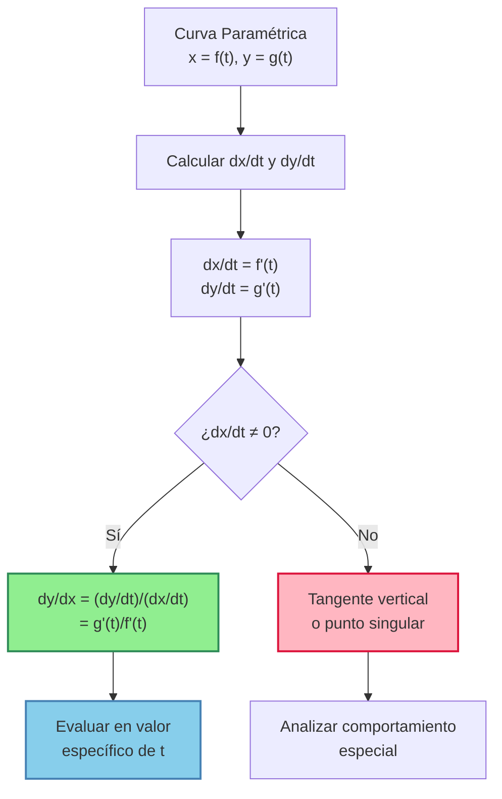
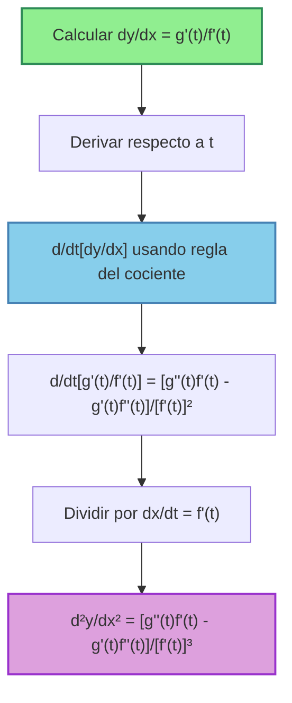

# 🎯 Derivadas Paramétricas

> [!tip] 💡 Concepto Clave
> Las derivadas paramétricas permiten encontrar la pendiente de curvas definidas por ecuaciones paramétricas $x = f(t)$, $y = g(t)$. En lugar de tener $y$ como función directa de $x$, ambas variables dependen de un parámetro $t$.

## 🎯 Fundamento Teórico

### 🔑 Fórmula Fundamental

> [!info] 📊 Regla de la Cadena Paramétrica
> Para curvas paramétricas $x = f(t)$, $y = g(t)$:
> 
> $$\frac{dy}{dx} = \frac{\frac{dy}{dt}}{\frac{dx}{dt}} = \frac{g'(t)}{f'(t)}$$
> 
> **Condición**: $\frac{dx}{dt} \neq 0$
> 
> **Interpretación**: La pendiente de la curva en el punto $(x, y)$ correspondiente al parámetro $t$



### 🧮 Justificación Matemática

> [!info] 🔍 ¿Por qué funciona esta fórmula?
> 
> Por la regla de la cadena:
> - $\frac{dy}{dx} = \frac{dy}{dt} \cdot \frac{dt}{dx}$
> - Como $\frac{dt}{dx} = \frac{1}{\frac{dx}{dt}}$
> - Entonces: $\frac{dy}{dx} = \frac{dy}{dt} \cdot \frac{1}{\frac{dx}{dt}} = \frac{\frac{dy}{dt}}{\frac{dx}{dt}}$

## 📊 Ejemplos Fundamentales

### 1️⃣ Curvas Básicas

> [!example] 🔢 Ejemplo 1: Parábola Paramétrica
> **Encontrar** $\frac{dy}{dx}$ para: $x = t^2$, $y = 2t$
> 
> **Solución**:
> - $\frac{dx}{dt} = 2t$
> - $\frac{dy}{dt} = 2$
> - $\frac{dy}{dx} = \frac{dy/dt}{dx/dt} = \frac{2}{2t} = \frac{1}{t}$ (para $t \neq 0$)
> 
> **Verificación**: Eliminando el parámetro: $t = \frac{y}{2}$, entonces $x = \left(\frac{y}{2}\right)^2 = \frac{y^2}{4}$
> 
> Derivando implícitamente: $1 = \frac{2y}{4}\frac{dy}{dx} = \frac{y}{2}\frac{dy}{dx}$
> 
> Por tanto: $\frac{dy}{dx} = \frac{2}{y} = \frac{2}{2t} = \frac{1}{t}$ ✅

> [!example] 🔢 Ejemplo 2: Círculo Paramétrico
> **Encontrar** $\frac{dy}{dx}$ para: $x = r\cos(t)$, $y = r\sin(t)$
> 
> **Solución**:
> - $\frac{dx}{dt} = -r\sin(t)$
> - $\frac{dy}{dt} = r\cos(t)$
> - $\frac{dy}{dx} = \frac{r\cos(t)}{-r\sin(t)} = -\frac{\cos(t)}{\sin(t)} = -\cot(t)$
> 
> **Interpretación geométrica**: La pendiente de la tangente al círculo en el punto correspondiente al ángulo $t$

### 2️⃣ Curvas Trigonométricas

> [!example] 🔢 Ejemplo 3: Cicloide
> **Encontrar** $\frac{dy}{dx}$ para la cicloide: $x = a(t - \sin t)$, $y = a(1 - \cos t)$
> 
> **Solución**:
> - $\frac{dx}{dt} = a(1 - \cos t)$
> - $\frac{dy}{dt} = a\sin t$
> - $\frac{dy}{dx} = \frac{a\sin t}{a(1 - \cos t)} = \frac{\sin t}{1 - \cos t}$
> 
> **Simplificación usando identidades**:
> - $\frac{\sin t}{1 - \cos t} = \frac{2\sin(t/2)\cos(t/2)}{2\sin^2(t/2)} = \frac{\cos(t/2)}{\sin(t/2)} = \cot(t/2)$
> 
> **Resultado**: $\frac{dy}{dx} = \cot(t/2)$

### 3️⃣ Curvas Exponenciales y Logarítmicas

> [!example] 🔢 Ejemplo 4: Curva Exponencial Paramétrica
> **Encontrar** $\frac{dy}{dx}$ para: $x = e^t$, $y = t^2$
> 
> **Solución**:
> - $\frac{dx}{dt} = e^t$
> - $\frac{dy}{dt} = 2t$
> - $\frac{dy}{dx} = \frac{2t}{e^t}$
> 
> **En términos de x**: Como $x = e^t$, entonces $t = \ln x$
> 
> Por tanto: $\frac{dy}{dx} = \frac{2\ln x}{x}$

## 🔄 Derivadas de Orden Superior

### Segunda Derivada Paramétrica

> [!info] 🧮 Fórmula para la Segunda Derivada
> $$\frac{d^2y}{dx^2} = \frac{d}{dx}\left(\frac{dy}{dx}\right) = \frac{\frac{d}{dt}\left(\frac{dy}{dx}\right)}{\frac{dx}{dt}}$$
> 
> **Pasos**:
> 1. Calcular $\frac{dy}{dx} = \frac{g'(t)}{f'(t)}$
> 2. Derivar respecto a $t$: $\frac{d}{dt}\left(\frac{dy}{dx}\right)$
> 3. Dividir por $\frac{dx}{dt} = f'(t)$



> [!example] 🔢 Ejemplo 5: Segunda Derivada del Círculo
> **Encontrar** $\frac{d^2y}{dx^2}$ para: $x = r\cos(t)$, $y = r\sin(t)$
> 
> **Solución**:
> - Ya sabemos: $\frac{dy}{dx} = -\cot(t)$
> - $\frac{d}{dt}\left(-\cot(t)\right) = -(-\csc^2(t)) = \csc^2(t)$
> - $\frac{dx}{dt} = -r\sin(t)$
> - $\frac{d^2y}{dx^2} = \frac{\csc^2(t)}{-r\sin(t)} = \frac{1}{\sin^2(t)} \cdot \frac{1}{-r\sin(t)} = -\frac{1}{r\sin^3(t)}$
> 
> **Interpretación**: Curvatura del círculo (siempre negativa, convexa hacia abajo)

### Método Directo para Segunda Derivada

> [!info] 📊 Fórmula Directa
> $$\frac{d^2y}{dx^2} = \frac{g''(t)f'(t) - g'(t)f''(t)}{[f'(t)]^3}$$
> 
> Donde:
> - $f'(t) = \frac{dx}{dt}$, $f''(t) = \frac{d^2x}{dt^2}$
> - $g'(t) = \frac{dy}{dt}$, $g''(t) = \frac{d^2y}{dt^2}$

> [!example] 🔢 Ejemplo 6: Segunda Derivada Directa
> **Encontrar** $\frac{d^2y}{dx^2}$ para: $x = t^3$, $y = t^2$
> 
> **Solución**:
> - $f'(t) = 3t^2$, $f''(t) = 6t$
> - $g'(t) = 2t$, $g''(t) = 2$
> - $\frac{d^2y}{dx^2} = \frac{2 \cdot 3t^2 - 2t \cdot 6t}{(3t^2)^3} = \frac{6t^2 - 12t^2}{27t^6} = \frac{-6t^2}{27t^6} = -\frac{2}{9t^4}$
> 
> (para $t \neq 0$)

## 🎪 Casos Especiales y Singularidades

### Tangentes Verticales y Horizontales

> [!info] 🧮 Análisis de Casos Especiales
> 
> **Tangente Horizontal**: $\frac{dy}{dx} = 0$
> - Ocurre cuando $\frac{dy}{dt} = 0$ y $\frac{dx}{dt} \neq 0$
> 
> **Tangente Vertical**: $\frac{dy}{dx} = \pm\infty$
> - Ocurre cuando $\frac{dx}{dt} = 0$ y $\frac{dy}{dt} \neq 0$
> 
> **Punto Singular**: Ambas derivadas son cero
> - $\frac{dx}{dt} = 0$ y $\frac{dy}{dt} = 0$ simultáneamente
> - Requiere análisis con L'Hôpital o derivadas superiores

> [!example] 🔢 Ejemplo 7: Análisis de Singularidades
> **Analizar**: $x = t^3 - 3t$, $y = t^2$
> 
> **Solución**:
> - $\frac{dx}{dt} = 3t^2 - 3 = 3(t^2 - 1)$
> - $\frac{dy}{dt} = 2t$
> - $\frac{dy}{dx} = \frac{2t}{3(t^2 - 1)}$
> 
> **Puntos críticos**:
> - **Tangente horizontal**: $\frac{dy}{dt} = 0 \Rightarrow t = 0$
>   - En $t = 0$: $x = 0$, $y = 0$, $\frac{dx}{dt} = -3 \neq 0$
>   - Tangente horizontal en $(0, 0)$
> 
> - **Tangente vertical**: $\frac{dx}{dt} = 0 \Rightarrow t = \pm 1$
>   - En $t = 1$: $x = -2$, $y = 1$, $\frac{dy}{dt} = 2 \neq 0$
>   - En $t = -1$: $x = 2$, $y = 1$, $\frac{dy}{dt} = -2 \neq 0$
>   - Tangentes verticales en $(-2, 1)$ y $(2, 1)$

## 🔢 Aplicaciones Geométricas

### Longitud de Arco

> [!info] 🧮 Fórmula de Longitud de Arco Paramétrica
> $$L = \int_{t_1}^{t_2} \sqrt{\left(\frac{dx}{dt}\right)^2 + \left(\frac{dy}{dt}\right)^2} \, dt$$
> 
> **Conexión con derivadas**: La derivada nos da la pendiente, pero para longitud necesitamos la "velocidad" total del movimiento

> [!example] 🔢 Ejemplo 8: Longitud del Círculo
> **Calcular** la longitud de un semicírculo: $x = r\cos(t)$, $y = r\sin(t)$, $t \in [0, \pi]$
> 
> **Solución**:
> - $\frac{dx}{dt} = -r\sin(t)$, $\frac{dy}{dt} = r\cos(t)$
> - $\sqrt{\left(\frac{dx}{dt}\right)^2 + \left(\frac{dy}{dt}\right)^2} = \sqrt{r^2\sin^2(t) + r^2\cos^2(t)} = r$
> - $L = \int_0^\pi r \, dt = r\pi$ ✅

### Área bajo Curvas Paramétricas

> [!info] 🧮 Área bajo Curva Paramétrica
> $$A = \int_{t_1}^{t_2} y \frac{dx}{dt} \, dt$$
> 
> **Condición**: La curva no debe intersectarse a sí misma en el intervalo

> [!example] 🔢 Ejemplo 9: Área de un Lazo
> **Calcular** el área encerrada por: $x = t - \sin(t)$, $y = 1 - \cos(t)$, $t \in [0, 2\pi]$ (cicloide)
> 
> **Solución**:
> - $\frac{dx}{dt} = 1 - \cos(t)$
> - $A = \int_0^{2\pi} (1 - \cos(t))(1 - \cos(t)) \, dt = \int_0^{2\pi} (1 - \cos(t))^2 \, dt$
> - $= \int_0^{2\pi} (1 - 2\cos(t) + \cos^2(t)) \, dt$
> - $= \left[t - 2\sin(t) + \frac{t}{2} + \frac{\sin(2t)}{4}\right]_0^{2\pi} = 3\pi$

## ⚠️ Errores Comunes y Cuidados

> [!warning] 🚨 Errores Frecuentes
> 
> ### Errores Conceptuales
> - **Confundir $\frac{dx}{dy}$ con $\frac{dy}{dx}$**: Son recíprocos, no iguales
> - **Olvidar verificar $\frac{dx}{dt} \neq 0$**: División por cero
> - **No simplificar usando identidades**: Especialmente en casos trigonométricos
> 
> ### Errores de Cálculo
> - **Derivar incorrectamente funciones compuestas**: Aplicar mal la regla de la cadena
> - **Confundir el parámetro**: Derivar respecto a $x$ en lugar de $t$
> - **Signos incorrectos**: Especialmente en funciones trigonométricas
> 
> ### Errores en Derivadas Superiores
> - **Usar fórmulas incorrectas**: No aplicar correctamente la regla del cociente
> - **No simplificar adecuadamente**: Dejar expresiones innecesariamente complicadas

> [!tip] 💡 Estrategias de Éxito
> 
> ### Verificación
> - **Eliminar el parámetro** cuando sea posible y comparar resultados
> - **Verificar casos particulares**: Evaluar en valores específicos de $t$
> - **Graficar la curva**: Visualizar el comportamiento
> 
> ### Simplificación
> - **Usar identidades trigonométricas**: Especialmente de medio ángulo
> - **Factorizar cuando sea posible**: Buscar cancelaciones
> - **Expresar en términos de $x$ o $y$**: Si es útil para la interpretación

## 🧠 Técnicas de Estudio Recomendadas

> [!tip] 🎓 Estrategias de Memorización
> 
> ### 🔤 Mnemotecnia Principal: "Di-Ye sobre De-Xe"
> $$\frac{dy}{dx} = \frac{\text{dy}/\text{dt}}{\text{dx}/\text{dt}}$$
> 
> ### 🎯 Pasos Sistemáticos: "CDDD"
> - **C**alcular $\frac{dx}{dt}$ y $\frac{dy}{dt}$
> - **D**ividir: $\frac{dy}{dx} = \frac{dy/dt}{dx/dt}$
> - **D**eterminar puntos especiales ($dx/dt = 0$ o $dy/dt = 0$)
> - **D**erivadas superiores si es necesario
> 
> ### 🧮 Casos Especiales - Recordatorio Visual
> ```
> dy/dt = 0, dx/dt ≠ 0  →  Tangente horizontal  ⟵
> dy/dt ≠ 0, dx/dt = 0  →  Tangente vertical    ⟵
> dy/dt = 0, dx/dt = 0  →  Punto singular       ⟵
> ```
> 
> ### 🎪 Analogía Útil
> **Parametrización = GPS de la curva**: El parámetro $t$ es como el "tiempo", y nos dice dónde estamos en cada momento. La derivada paramétrica nos dice la "dirección" en que nos movemos.

## 📊 Tabla de Referencias Rápidas

> [!info] 📋 Curvas Paramétricas Comunes
> 
> |Curva|Ecuaciones Paramétricas|$\frac{dy}{dx}$|Casos Especiales|
> |---|---|---|---|
> |**Círculo**|$x = r\cos(t)$, $y = r\sin(t)$|$-\cot(t)$|Tangente vertical en $t = 0, \pi$|
> |**Elipse**|$x = a\cos(t)$, $y = b\sin(t)$|$-\frac{b}{a}\cot(t)$|Vértices en $t = 0, \pi/2, \pi, 3\pi/2$|
> |**Parábola**|$x = t^2$, $y = 2at$|$\frac{a}{t}$|Tangente vertical en $t = 0$|
> |**Cicloide**|$x = a(t-\sin t)$, $y = a(1-\cos t)$|$\cot(t/2)$|Cúspides en $t = 2\pi k$|
> |**Hipérbola**|$x = a\sec(t)$, $y = b\tan(t)$|$\frac{b}{a}\sin(t)$|Asíntotas verticales|

## 🔗 Conexiones con Otros Temas

> [!quote] 📚 Notas Relacionadas
> 
> ### Prerequisitos
> - [[Regla de la cadena]] - Base fundamental del método
> - [[Derivación Implícita]] - Conceptos relacionados
> - [[Funciones Trigonométricas]] - Para curvas trigonométricas
> - [[Derivadas Básicas]] - Necesarias para $dx/dt$ y $dy/dt$
> 
> ### Temas Relacionados
> - [[Ecuaciones Paramétricas]] - Definición de las curvas
> - [[Coordenadas Polares]] - Otro sistema de coordenadas
> - [[Longitud de Arco]] - Aplicación directa
> - [[Curvatura]] - Usa segunda derivada paramétrica
> 
> ### Aplicaciones Avanzadas
> - **Física** - Movimiento en el plano, trayectorias
> - **Ingeniería** - Diseño de curvas, CAD/CAM
> - **Geometría Diferencial** - Curvas en el espacio
> - **Animación** - Movimiento suave de objetos

## 📝 Ejercicios Recomendados

> [!note] 🎓 Para Practicar
> 
> ### Nivel Básico
> 1. $x = 3t$, $y = t^2$ - Encontrar $\frac{dy}{dx}$
> 2. $x = \cos(2t)$, $y = \sin(2t)$ - Encontrar $\frac{dy}{dx}$
> 3. $x = e^t$, $y = e^{2t}$ - Encontrar $\frac{dy}{dx}$
> 
> ### Nivel Intermedio
> 4. $x = t^3 - 3t$, $y = t^2$ - Encontrar tangentes horizontales y verticales
> 5. $x = 2\cos(t)$, $y = 3\sin(t)$ - Encontrar $\frac{d^2y}{dx^2}$
> 6. $x = \ln(t)$, $y = t^2$ - Expresar $\frac{dy}{dx}$ en términos de $x$
> 
> ### Nivel Avanzado
> 7. $x = a(t - \sin t)$, $y = a(1 - \cos t)$ - Analizar toda la familia de cicloides
> 8. $x = t^2 - 2t$, $y = t^3 - 3t$ - Encontrar puntos de inflexión
> 9. Curva de Lissajous: $x = \sin(3t)$, $y = \cos(2t)$ - Comportamiento completo

---

**Tags**: #calculo #derivadas #parametricas #ecuaciones-parametricas #regla-cadena #tangentes #curvatura #longitud-arco