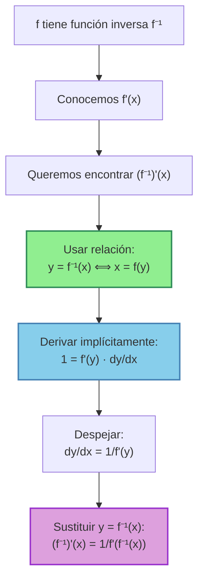
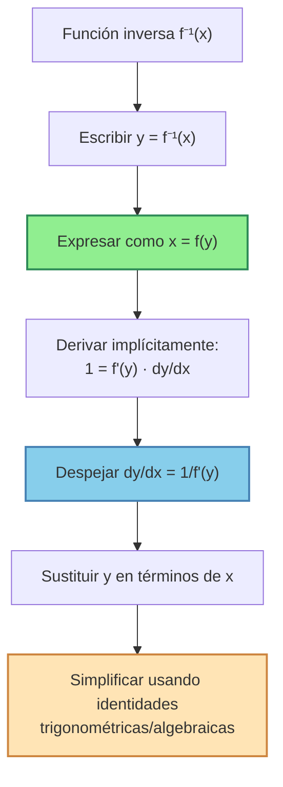

# 🔄 Derivadas de Funciones Inversas

> [!tip] 💡 Concepto Clave
> Las derivadas de funciones inversas nos permiten encontrar la derivada de $f^{-1}(x)$ conociendo la derivada de $f(x)$. Esta técnica es fundamental para derivar funciones como $\arcsin(x)$, $\arctan(x)$, $\ln(x)$, y muchas otras funciones inversas.

## 🎯 Fundamento Teórico

### 🔑 Teorema Fundamental

> [!info] 📊 Fórmula de la Derivada de la Función Inversa
> Si $y = f^{-1}(x)$, entonces:
> $$\frac{d}{dx}[f^{-1}(x)] = \frac{1}{f'(f^{-1}(x))}$$
> 
> **Condiciones**:
> - $f$ es derivable y $f'(f^{-1}(x)) \neq 0$
> - $f$ tiene función inversa (es biyectiva)
> 
> **Forma alternativa**: Si $y = f^{-1}(x)$, entonces $x = f(y)$
> $$\frac{dy}{dx} = \frac{1}{\frac{dx}{dy}} = \frac{1}{f'(y)}$$



### 🧮 Justificación Geométrica

> [!info] 🔍 Interpretación Geométrica
> 
> **Pendientes recíprocas**: Si $(a, b)$ está en la gráfica de $f$, entonces $(b, a)$ está en la gráfica de $f^{-1}$.
> 
> - La pendiente de $f$ en $(a, b)$ es $f'(a)$
> - La pendiente de $f^{-1}$ en $(b, a)$ es $(f^{-1})'(b)$
> - Como las gráficas son simétricas respecto a $y = x$: $(f^{-1})'(b) = \frac{1}{f'(a)}$

## 📊 Derivadas de Funciones Inversas Fundamentales

### 1️⃣ Función Logarítmica

> [!example] 🔢 Ejemplo 1: Derivada de $\ln(x)$
> **Encontrar**: $\frac{d}{dx}[\ln(x)]$
> 
> **Solución**:
> - Sea $y = \ln(x)$, entonces $x = e^y$
> - $f(y) = e^y$, por tanto $f'(y) = e^y$
> - $\frac{dy}{dx} = \frac{1}{f'(y)} = \frac{1}{e^y} = \frac{1}{x}$
> 
> **Resultado**: $\frac{d}{dx}[\ln(x)] = \frac{1}{x}$ ✅

> [!example] 🔢 Ejemplo 2: Derivada de $\log_a(x)$
> **Encontrar**: $\frac{d}{dx}[\log_a(x)]$ donde $a > 0, a \neq 1$
> 
> **Solución**:
> - Sea $y = \log_a(x)$, entonces $x = a^y$
> - $f(y) = a^y$, por tanto $f'(y) = a^y \ln(a)$
> - $\frac{dy}{dx} = \frac{1}{f'(y)} = \frac{1}{a^y \ln(a)} = \frac{1}{x \ln(a)}$
> 
> **Resultado**: $\frac{d}{dx}[\log_a(x)] = \frac{1}{x \ln(a)}$ ✅

### 2️⃣ Funciones Trigonométricas Inversas

> [!example] 🔢 Ejemplo 3: Derivada de $\arcsin(x)$
> **Encontrar**: $\frac{d}{dx}[\arcsin(x)]$
> 
> **Solución**:
> - Sea $y = \arcsin(x)$, entonces $x = \sin(y)$ donde $y \in [-\frac{\pi}{2}, \frac{\pi}{2}]$
> - $f(y) = \sin(y)$, por tanto $f'(y) = \cos(y)$
> - $\frac{dy}{dx} = \frac{1}{\cos(y)}$
> 
> **Expresar en términos de x**:
> - Como $x = \sin(y)$ y $y \in [-\frac{\pi}{2}, \frac{\pi}{2}]$, tenemos $\cos(y) \geq 0$
> - $\cos^2(y) = 1 - \sin^2(y) = 1 - x^2$
> - $\cos(y) = \sqrt{1 - x^2}$ (positivo en el rango)
> 
> **Resultado**: $\frac{d}{dx}[\arcsin(x)] = \frac{1}{\sqrt{1-x^2}}$ ✅

> [!example] 🔢 Ejemplo 4: Derivada de $\arctan(x)$
> **Encontrar**: $\frac{d}{dx}[\arctan(x)]$
> 
> **Solución**:
> - Sea $y = \arctan(x)$, entonces $x = \tan(y)$ donde $y \in (-\frac{\pi}{2}, \frac{\pi}{2})$
> - $f(y) = \tan(y)$, por tanto $f'(y) = \sec^2(y)$
> - $\frac{dy}{dx} = \frac{1}{\sec^2(y)}$
> 
> **Expresar en términos de x**:
> - $\sec^2(y) = 1 + \tan^2(y) = 1 + x^2$
> 
> **Resultado**: $\frac{d}{dx}[\arctan(x)] = \frac{1}{1+x^2}$ ✅

### 3️⃣ Tabla Completa de Derivadas de Inversas Trigonométricas

> [!info] 📋 Derivadas de Funciones Trigonométricas Inversas
> 
> |Función|Derivada|Dominio|Observaciones|
> |---|---|---|---|
> |$\arcsin(x)$|$\frac{1}{\sqrt{1-x^2}}$|$(-1, 1)$|Indefinida en $x = \pm 1$|
> |$\arccos(x)$|$-\frac{1}{\sqrt{1-x^2}}$|$(-1, 1)$|Nota el signo negativo|
> |$\arctan(x)$|$\frac{1}{1+x^2}$|$\mathbb{R}$|Definida para todo real|
> |$\text{arccot}(x)$|$-\frac{1}{1+x^2}$|$\mathbb{R}$|Nota el signo negativo|
> |$\text{arcsec}(x)$|$\frac{1}{\|x\|\sqrt{x^2-1}}$|$(-\infty,-1) \cup (1,\infty)$|Valor absoluto importante|
> |$\text{arccsc}(x)$|$-\frac{1}{\|x\|\sqrt{x^2-1}}$|$(-\infty,-1) \cup (1,\infty)$|Valor absoluto y signo negativo|

## 🔧 Método General y Aplicaciones

### Proceso Sistemático



> [!example] 🔢 Ejemplo 5: Derivada de $\text{arcsec}(x)$
> **Encontrar**: $\frac{d}{dx}[\text{arcsec}(x)]$
> 
> **Solución**:
> - Sea $y = \text{arcsec}(x)$, entonces $x = \sec(y)$ donde $y \in [0, \pi], y \neq \frac{\pi}{2}$
> - $f(y) = \sec(y)$, por tanto $f'(y) = \sec(y)\tan(y)$
> - $\frac{dy}{dx} = \frac{1}{\sec(y)\tan(y)}$
> 
> **Expresar en términos de x**:
> - $\sec(y) = x$
> - $\tan^2(y) = \sec^2(y) - 1 = x^2 - 1$
> - $\tan(y) = \pm\sqrt{x^2 - 1}$
> 
> **Determinar el signo**:
> - Para $y \in [0, \frac{\pi}{2})$: $\tan(y) \geq 0$
> - Para $y \in (\frac{\pi}{2}, \pi]$: $\tan(y) \leq 0$
> - Pero $\sec(y) > 0$ en $[0, \frac{\pi}{2})$ y $\sec(y) < 0$ en $(\frac{\pi}{2}, \pi]$
> - Por tanto: $\sec(y)\tan(y) = |x|\sqrt{x^2-1}$
> 
> **Resultado**: $\frac{d}{dx}[\text{arcsec}(x)] = \frac{1}{|x|\sqrt{x^2-1}}$ ✅

### Funciones Inversas Definidas por Usuario

> [!example] 🔢 Ejemplo 6: Función Inversa General
> **Encontrar**: $\frac{d}{dx}[f^{-1}(x)]$ si $f(x) = x^3 + 2x + 1$
> 
> **Solución**:
> - $f'(x) = 3x^2 + 2$
> - Sea $y = f^{-1}(x)$, entonces $f(y) = x$
> - $\frac{d}{dx}[f^{-1}(x)] = \frac{1}{f'(f^{-1}(x))} = \frac{1}{f'(y)}$
> - $= \frac{1}{3y^2 + 2} = \frac{1}{3[f^{-1}(x)]^2 + 2}$
> 
> **Resultado**: $\frac{d}{dx}[f^{-1}(x)] = \frac{1}{3[f^{-1}(x)]^2 + 2}$
> 
> **Nota**: No podemos simplificar más sin conocer la forma explícita de $f^{-1}(x)$

## 🔄 Aplicaciones y Casos Especiales

### Composiciones con Funciones Inversas

> [!example] 🔢 Ejemplo 7: Regla de la Cadena con Inversas
> **Encontrar**: $\frac{d}{dx}[\arcsin(2x)]$
> 
> **Solución**:
> - Usar regla de la cadena: $\frac{d}{dx}[\arcsin(u)] = \frac{1}{\sqrt{1-u^2}} \cdot \frac{du}{dx}$
> - Aquí $u = 2x$, entonces $\frac{du}{dx} = 2$
> - $\frac{d}{dx}[\arcsin(2x)] = \frac{1}{\sqrt{1-(2x)^2}} \cdot 2 = \frac{2}{\sqrt{1-4x^2}}$
> 
> **Dominio**: $1-4x^2 > 0 \Rightarrow x \in (-\frac{1}{2}, \frac{1}{2})$

> [!example] 🔢 Ejemplo 8: Función Inversa Compuesta
> **Encontrar**: $\frac{d}{dx}[\ln(\sin(x))]$
> 
> **Solución**:
> - Usar regla de la cadena: $\frac{d}{dx}[\ln(u)] = \frac{1}{u} \cdot \frac{du}{dx}$
> - Aquí $u = \sin(x)$, entonces $\frac{du}{dx} = \cos(x)$
> - $\frac{d}{dx}[\ln(\sin(x))] = \frac{1}{\sin(x)} \cdot \cos(x) = \frac{\cos(x)}{\sin(x)} = \cot(x)$
> 
> **Dominio**: $\sin(x) > 0$

### Derivación Implícita con Funciones Inversas

> [!example] 🔢 Ejemplo 9: Ecuación Implícita con Inversas
> **Encontrar** $\frac{dy}{dx}$ si: $\arctan(xy) + \ln(x^2 + y^2) = \frac{\pi}{4}$
> 
> **Solución**:
> - Derivar ambos lados respecto a $x$:
> - $\frac{d}{dx}[\arctan(xy)] + \frac{d}{dx}[\ln(x^2 + y^2)] = 0$
> - $\frac{1}{1+(xy)^2} \cdot (y + x\frac{dy}{dx}) + \frac{1}{x^2+y^2} \cdot (2x + 2y\frac{dy}{dx}) = 0$
> - $\frac{y + x\frac{dy}{dx}}{1+x^2y^2} + \frac{2x + 2y\frac{dy}{dx}}{x^2+y^2} = 0$
> 
> **Resolver para $\frac{dy}{dx}$**:
> - Agrupar términos con $\frac{dy}{dx}$: $\left(\frac{x}{1+x^2y^2} + \frac{2y}{x^2+y^2}\right)\frac{dy}{dx} = -\frac{y}{1+x^2y^2} - \frac{2x}{x^2+y^2}$
> - $\frac{dy}{dx} = -\frac{\frac{y}{1+x^2y^2} + \frac{2x}{x^2+y^2}}{\frac{x}{1+x^2y^2} + \frac{2y}{x^2+y^2}}$

## ⚠️ Consideraciones Importantes

> [!warning] 🚨 Errores Comunes y Cuidados
> 
> ### Errores Conceptuales
> - **Confundir función e inversa**: $(f^{-1})'(x) \neq \frac{1}{f'(x)}$
> - **Olvidar dominios**: Las funciones inversas tienen dominios restringidos
> - **Signos incorrectos**: Especialmente en $\arccos(x)$ y $\text{arccot}(x)$
> 
> ### Errores de Cálculo
> - **No usar valor absoluto**: En $\text{arcsec}(x)$ y $\text{arccsc}(x)$
> - **Identidades trigonométricas mal aplicadas**: $\cos^2(y) + \sin^2(y) = 1$
> - **Rangos incorrectos**: Cada función inversa tiene su rango específico
> 
> ### Verificación
> - **Comprobar dominios**: Donde la derivada está definida
> - **Verificar continuidad**: En los extremos del dominio
> - **Usar calculadora**: Para valores numéricos específicos

> [!tip] 💡 Estrategias de Éxito
> 
> ### Reconocimiento de Patrones
> - **Memorizar las 6 derivadas** de funciones trigonométricas inversas
> - **Recordar los signos**: arcseno y arctangente positivos, arcocoseno y arcocotangente negativos
> - **Dominios**: Funciones con raíz cuadrada tienen dominios restringidos
> 
> ### Aplicación del Método
> 1. **Identificar la función directa** $f(x)$
> 2. **Calcular $f'(x)$**
> 3. **Aplicar la fórmula**: $(f^{-1})'(x) = \frac{1}{f'(f^{-1}(x))}$
> 4. **Simplificar usando identidades**

## 🧠 Técnicas de Estudio Recomendadas

> [!tip] 🎓 Estrategias de Memorización
> 
> ### 🔤 Mnemotecnia para Signos: "ASAC-TCTC-SC"
> - **A**rcsin: $+\frac{1}{\sqrt{1-x^2}}$ ✅
> - **S**ec: $+\frac{1}{|x|\sqrt{x^2-1}}$ ✅  
> - **A**rccos: $-\frac{1}{\sqrt{1-x^2}}$ ❌
> - **C**sc: $-\frac{1}{|x|\sqrt{x^2-1}}$ ❌
> - **T**an: $+\frac{1}{1+x^2}$ ✅
> - **C**ot: $-\frac{1}{1+x^2}$ ❌
> 
> ### 🎯 Fórmula Maestra: "Uno sobre F prima de F inversa"
> $(f^{-1})'(x) = \frac{1}{f'(f^{-1}(x))}$
> 
> ### 🧮 Identidades Clave para Recordar
> **Para derivadas de inversas trigonométricas**:
> ```
> sin²(θ) + cos²(θ) = 1  →  cos(θ) = √(1 - sin²(θ))
> 1 + tan²(θ) = sec²(θ)  →  sec(θ) = √(1 + tan²(θ))
> sec²(θ) - 1 = tan²(θ)  →  tan(θ) = √(sec²(θ) - 1)
> ```
> 
> ### 📝 Plantilla Mental
> 1. "¿Es una función inversa estándar?"
> 2. "Si sí → usar tabla de derivadas"
> 3. "Si no → aplicar teorema general"
> 4. "Verificar dominio y simplificar"
> 
> ### 🎪 Analogía del Espejo
> Si $f$ y $f^{-1}$ son "funciones espejo", sus pendientes también están relacionadas como "pendientes espejo": una es el recíproco de la otra.

## 📊 Tabla de Referencia Completa

> [!info] 📋 Derivadas de Funciones Inversas Fundamentales
> 
> ### Logarítmicas y Exponenciales
> |Función|Derivada|Dominio|
> |---|---|---|
> |$\ln(x)$|$\frac{1}{x}$|$(0, \infty)$|
> |$\log_a(x)$|$\frac{1}{x \ln(a)}$|$(0, \infty)$|
> 
> ### Trigonométricas Inversas
> |Función|Derivada|Dominio de la Derivada|
> |---|---|---|
> |$\arcsin(x)$|$\frac{1}{\sqrt{1-x^2}}$|$(-1, 1)$|
> |$\arccos(x)$|$-\frac{1}{\sqrt{1-x^2}}$|$(-1, 1)$|
> |$\arctan(x)$|$\frac{1}{1+x^2}$|$\mathbb{R}$|
> |$\text{arccot}(x)$|$-\frac{1}{1+x^2}$|$\mathbb{R}$|
> |$\text{arcsec}(x)$|$\frac{1}{|x|\sqrt{x^2-1}}$|$(-\infty,-1) \cup (1,\infty)$|
> |$\text{arccsc}(x)$|$-\frac{1}{|x|\sqrt{x^2-1}}$|$(-\infty,-1) \cup (1,\infty)$|

## 🔗 Conexiones con Otros Temas

> [!quote] 📚 Notas Relacionadas
> 
> ### Prerequisitos
> - [[Funciones Inversas]] - Definición y propiedades básicas
> - [[Regla de la cadena]] - Para composiciones con inversas
> - [[Derivación Implícita]] - Base del método teórico
> - [[Identidades Trigonométricas]] - Para simplificar derivadas
> 
> ### Temas Relacionados
> - [[Integrales de Funciones Inversas]] 🔄 - Proceso inverso
> - [[Derivación Logarítmica]] 🔄 - Usa derivada de ln(x)
> - [[Límites Indeterminados]] - Para verificar comportamiento límite
> - [[Funciones Trigonométricas]] - Para entender las inversas
> 
> ### Aplicaciones
> - **Cálculo de límites** - Usando derivadas de inversas
> - **Optimización** - Problemas con funciones inversas
> - **Ecuaciones diferenciales** - Aparecen naturalmente
> - **Análisis numérico** - Métodos de aproximación

## 📝 Ejercicios Recomendados

> [!note] 🎓 Para Practicar
> 
> ### Nivel Básico - Derivadas Directas
> 1. $\frac{d}{dx}[\arcsin(3x)]$
> 2. $\frac{d}{dx}[\ln(x^2 + 1)]$
> 3. $\frac{d}{dx}[\arctan(\sqrt{x})]$
> 
> ### Nivel Intermedio - Composiciones
> 4. $\frac{d}{dx}[\text{arcsec}(e^x)]$
> 5. $\frac{d}{dx}[\ln(\arcsin(x))]$
> 6. $\frac{d}{dx}[(\arccos(x))^2]$
> 
> ### Nivel Avanzado - Casos Complejos
> 7. Derivación implícita: $\arctan(x/y) = \ln(x^2 + y^2)$
> 8. $\frac{d}{dx}[\arcsin(x) + \arccos(x)]$ y verificar que es constante
> 9. Si $f(x) = x^5 + 3x^3 + x$, encontrar $(f^{-1})'(5)$

---

**Tags**: #calculo #derivadas #funciones-inversas #arcsin #arctan #logaritmo #derivacion-implicita #regla-cadena #identidades-trigonometricas