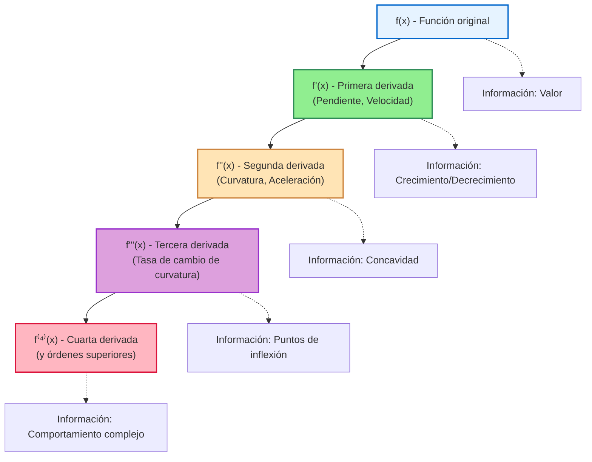
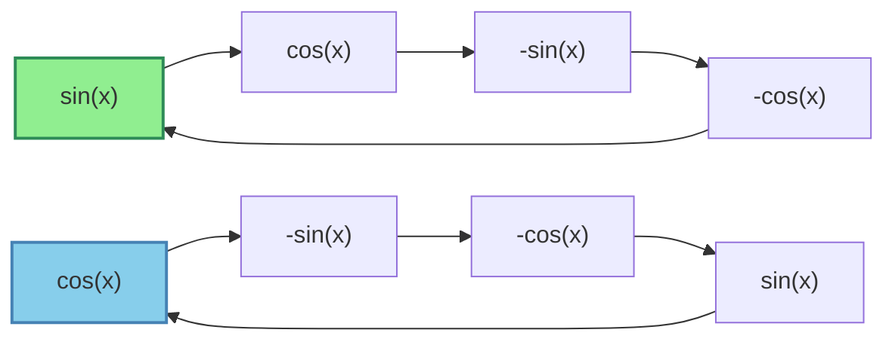

# 📈 Derivadas de Orden Superior

> [!tip] 💡 Concepto Clave
> Las derivadas de orden superior son derivadas de derivadas. Mientras que la primera derivada nos da la tasa de cambio instantánea, las derivadas superiores revelan información sobre la curvatura, puntos de inflexión, y el comportamiento local de las funciones.

## 🎯 Fundamentos y Notación

### 🔑 Definición y Notación

> [!info] 📊 Notaciones para Derivadas de Orden Superior
> Para una función $y = f(x)$:
> 
> |Orden|Notación de Leibniz|Notación de Lagrange|Notación de Newton|Nombre|
> |---|---|---|---|---|
> |1ª|$\frac{dy}{dx}, \frac{df}{dx}$|$f'(x), y'$|$\dot{f}$ (física)|Primera derivada|
> |2ª|$\frac{d^2y}{dx^2}, \frac{d^2f}{dx^2}$|$f''(x), y''$|$\ddot{f}$ (física)|Segunda derivada|
> |3ª|$\frac{d^3y}{dx^3}, \frac{d^3f}{dx^3}$|$f'''(x), y'''$|$\dddot{f}$|Tercera derivada|
> |nª|$\frac{d^ny}{dx^n}, \frac{d^nf}{dx^n}$|$f^{(n)}(x), y^{(n)}$|---|n-ésima derivada|
> 
> **Interpretación**:
> - $f'(x)$: Tasa de cambio (velocidad)
> - $f''(x)$: Tasa de cambio de la tasa de cambio (aceleración)
> - $f'''(x)$: Tasa de cambio de la aceleración



## 📊 Cálculo de Derivadas de Orden Superior

### 1️⃣ Funciones Polinómicas

> [!example] 🔢 Ejemplo 1: Polinomio Completo
> **Encontrar** todas las derivadas de: $f(x) = 2x^5 - 3x^4 + x^3 - 2x^2 + 5x - 1$
> 
> **Solución**:
> - $f(x) = 2x^5 - 3x^4 + x^3 - 2x^2 + 5x - 1$
> - $f'(x) = 10x^4 - 12x^3 + 3x^2 - 4x + 5$
> - $f''(x) = 40x^3 - 36x^2 + 6x - 4$
> - $f'''(x) = 120x^2 - 72x + 6$
> - $f^{(4)}(x) = 240x - 72$
> - $f^{(5)}(x) = 240$
> - $f^{(6)}(x) = 0$
> - $f^{(n)}(x) = 0$ para $n \geq 6$
> 
> **Observación**: Los polinomios de grado $n$ tienen derivada cero para órdenes $> n$

### 2️⃣ Funciones Exponenciales

> [!example] 🔢 Ejemplo 2: Función Exponencial Natural
> **Encontrar** $f^{(n)}(x)$ para: $f(x) = e^x$
> 
> **Solución**:
> - $f(x) = e^x$
> - $f'(x) = e^x$
> - $f''(x) = e^x$
> - $f'''(x) = e^x$
> - $\vdots$
> - $f^{(n)}(x) = e^x$ para todo $n \geq 0$
> 
> **Resultado general**: $\frac{d^n}{dx^n}[e^x] = e^x$

> [!example] 🔢 Ejemplo 3: Exponencial con Base Diferente
> **Encontrar** $f^{(n)}(x)$ para: $f(x) = e^{ax}$ donde $a$ es constante
> 
> **Solución**:
> - $f(x) = e^{ax}$
> - $f'(x) = ae^{ax}$
> - $f''(x) = a^2e^{ax}$
> - $f'''(x) = a^3e^{ax}$
> - $\vdots$
> - $f^{(n)}(x) = a^ne^{ax}$
> 
> **Resultado general**: $\frac{d^n}{dx^n}[e^{ax}] = a^ne^{ax}$

### 3️⃣ Funciones Trigonométricas

> [!example] 🔢 Ejemplo 4: Seno y Coseno
> **Encontrar** las derivadas de orden superior de $\sin(x)$ y $\cos(x)$
> 
> **Para $f(x) = \sin(x)$**:
> - $f(x) = \sin(x)$
> - $f'(x) = \cos(x)$
> - $f''(x) = -\sin(x)$
> - $f'''(x) = -\cos(x)$
> - $f^{(4)}(x) = \sin(x)$ (regresa al original)
> 
> **Patrón cíclico**: Se repite cada 4 derivadas
> 
> **Fórmula general**: $\frac{d^n}{dx^n}[\sin(x)] = \sin\left(x + \frac{n\pi}{2}\right)$
> 
> **Para $g(x) = \cos(x)$**:
> - $g(x) = \cos(x)$
> - $g'(x) = -\sin(x)$
> - $g''(x) = -\cos(x)$
> - $g'''(x) = \sin(x)$
> - $g^{(4)}(x) = \cos(x)$ (regresa al original)
> 
> **Fórmula general**: $\frac{d^n}{dx^n}[\cos(x)] = \cos\left(x + \frac{n\pi}{2}\right)$



### 4️⃣ Logaritmos y Potencias

> [!example] 🔢 Ejemplo 5: Logaritmo Natural
> **Encontrar** $f^{(n)}(x)$ para: $f(x) = \ln(x)$
> 
> **Solución**:
> - $f(x) = \ln(x)$
> - $f'(x) = \frac{1}{x} = x^{-1}$
> - $f''(x) = -x^{-2} = -\frac{1}{x^2}$
> - $f'''(x) = 2x^{-3} = \frac{2}{x^3}$
> - $f^{(4)}(x) = -6x^{-4} = -\frac{6}{x^4}$
> - $f^{(5)}(x) = 24x^{-5} = \frac{24}{x^5}$
> 
> **Patrón observado**: $f^{(n)}(x) = \frac{(-1)^{n+1}(n-1)!}{x^n}$ para $n \geq 1$
> 
> **Resultado general**: $\frac{d^n}{dx^n}[\ln(x)] = \frac{(-1)^{n+1}(n-1)!}{x^n}$

> [!example] 🔢 Ejemplo 6: Potencias Generales
> **Encontrar** $f^{(n)}(x)$ para: $f(x) = x^m$ donde $m$ es constante
> 
> **Solución**:
> - $f(x) = x^m$
> - $f'(x) = mx^{m-1}$
> - $f''(x) = m(m-1)x^{m-2}$
> - $f'''(x) = m(m-1)(m-2)x^{m-3}$
> - $\vdots$
> - $f^{(n)}(x) = \frac{m!}{(m-n)!}x^{m-n}$ para $n \leq m$
> 
> **Casos especiales**:
> - Si $m$ es entero positivo y $n > m$: $f^{(n)}(x) = 0$
> - Si $m$ no es entero: la fórmula se extiende usando factoriales generalizados

## 🔄 Reglas para Derivadas de Orden Superior

### Linealidad

> [!info] 🧮 Propiedad de Linealidad
> $\frac{d^n}{dx^n}[af(x) + bg(x)] = a\frac{d^n}{dx^n}[f(x)] + b\frac{d^n}{dx^n}[g(x)]$
> 
> **Aplicación**: Las derivadas de orden superior respetan la linealidad

### Regla de Leibniz (Producto)

> [!info] 🧮 Fórmula de Leibniz para Productos
> $$\frac{d^n}{dx^n}[f(x)g(x)] = \sum_{k=0}^{n} \binom{n}{k} f^{(k)}(x) g^{(n-k)}(x)$$
> 
> **Similitud con binomio**: $(a+b)^n = \sum_{k=0}^{n} \binom{n}{k} a^k b^{n-k}$
> 
> **Para órdenes bajos**:
> - $n=1$: $(fg)' = f'g + fg'$ (regla del producto usual)
> - $n=2$: $(fg)'' = f''g + 2f'g' + fg''$
> - $n=3$: $(fg)''' = f'''g + 3f''g' + 3f'g'' + fg'''$

> [!example] 🔢 Ejemplo 7: Aplicación de Leibniz
> **Encontrar** $\frac{d^3}{dx^3}[x^2 e^x]$
> 
> **Solución**:
> - $f(x) = x^2$: $f'(x) = 2x$, $f''(x) = 2$, $f'''(x) = 0$
> - $g(x) = e^x$: $g'(x) = e^x$, $g''(x) = e^x$, $g'''(x) = e^x$
> 
> Aplicando Leibniz con $n=3$:
> - $(x^2 e^x)''' = \binom{3}{0}(0)(e^x) + \binom{3}{1}(2)(e^x) + \binom{3}{2}(2x)(e^x) + \binom{3}{3}(x^2)(e^x)$
> - $= 0 + 3(2)(e^x) + 3(2x)(e^x) + 1(x^2)(e^x)$
> - $= 6e^x + 6xe^x + x^2e^x = e^x(x^2 + 6x + 6)$

### Regla de la Cadena para Órdenes Superiores

> [!info] 🧮 Fórmula de Faà di Bruno
> Para $y = f(g(x))$:
> $$\frac{d^n y}{dx^n} = \sum f^{(k)}(g(x)) \cdot B_{n,k}(g'(x), g''(x), \ldots, g^{(n-k+1)}(x))$$
> 
> Donde $B_{n,k}$ son los polinomios de Bell.
> 
> **Para casos simples**:
> - $n=1$: $\frac{dy}{dx} = f'(g(x)) \cdot g'(x)$
> - $n=2$: $\frac{d^2y}{dx^2} = f''(g(x)) \cdot [g'(x)]^2 + f'(g(x)) \cdot g''(x)$

> [!example] 🔢 Ejemplo 8: Segunda Derivada con Regla de la Cadena
> **Encontrar** $\frac{d^2}{dx^2}[\sin(x^2)]$
> 
> **Solución**:
> - $f(u) = \sin(u)$, $g(x) = x^2$
> - $f'(u) = \cos(u)$, $f''(u) = -\sin(u)$
> - $g'(x) = 2x$, $g''(x) = 2$
> 
> Aplicando la fórmula:
> - $\frac{d^2}{dx^2}[\sin(x^2)] = f''(g(x)) \cdot [g'(x)]^2 + f'(g(x)) \cdot g''(x)$
> - $= -\sin(x^2) \cdot (2x)^2 + \cos(x^2) \cdot 2$
> - $= -4x^2\sin(x^2) + 2\cos(x^2)$

## 🎪 Aplicaciones e Interpretaciones

### Análisis de Funciones

> [!info] 📈 Interpretación Geométrica y Física
> 
> ### Segunda Derivada
> - **$f''(x) > 0$**: Función cóncava hacia arriba (∪)
> - **$f''(x) < 0$**: Función cóncava hacia abajo (∩)
> - **$f''(x) = 0$**: Posible punto de inflexión
> 
> ### En Física
> - **Posición**: $s(t)$
> - **Velocidad**: $v(t) = s'(t)$
> - **Aceleración**: $a(t) = s''(t) = v'(t)$
> - **Jerk**: $j(t) = s'''(t) = a'(t)$ (tasa de cambio de aceleración)

> [!example] 🔢 Ejemplo 9: Análisis Completo de Función
> **Analizar** $f(x) = x^4 - 4x^3 + 6x^2$
> 
> **Solución**:
> - $f(x) = x^4 - 4x^3 + 6x^2$
> - $f'(x) = 4x^3 - 12x^2 + 12x = 4x(x^2 - 3x + 3)$
> - $f''(x) = 12x^2 - 24x + 12 = 12(x^2 - 2x + 1) = 12(x-1)^2$
> - $f'''(x) = 24x - 24 = 24(x-1)$
> 
> **Análisis**:
> - **Puntos críticos**: $f'(x) = 0 \Rightarrow x = 0$ (discriminante de $x^2-3x+3$ es negativo)
> - **Concavidad**: $f''(x) = 12(x-1)^2 \geq 0$ siempre, con $f''(1) = 0$
> - **Punto de inflexión**: En $x = 1$, ya que $f'''(1) = 0$ pero cambia de signo
> - **Interpretación**: Función siempre cóncava hacia arriba, con punto de inflexión en $(1, f(1)) = (1, 3)$

### Polinomios de Taylor

> [!info] 🧮 Conexión con Series de Taylor
> $$f(x) = f(a) + f'(a)(x-a) + \frac{f''(a)}{2!}(x-a)^2 + \frac{f'''(a)}{3!}(x-a)^3 + \cdots$$
> 
> Las derivadas de orden superior son los **coeficientes** de la serie de Taylor

> [!example] 🔢 Ejemplo 10: Serie de Taylor de $e^x$
> **Desarrollar** $e^x$ alrededor de $x = 0$
> 
> **Solución**:
> - $f^{(n)}(0) = e^0 = 1$ para todo $n$
> - $e^x = 1 + x + \frac{x^2}{2!} + \frac{x^3}{3!} + \frac{x^4}{4!} + \cdots = \sum_{n=0}^{\infty} \frac{x^n}{n!}$

## 📊 Patrones y Fórmulas Generales

### Tabla de Derivadas de Orden Superior

> [!info] 📋 Fórmulas Generales Importantes
> 
> |Función|n-ésima Derivada|Observaciones|
> |---|---|---|
> |$x^m$|$\frac{m!}{(m-n)!}x^{m-n}$ si $n \leq m$, $0$ si $n > m$|Para $m$ entero positivo|
> |$e^{ax}$|$a^n e^{ax}$|Siempre no cero|
> |$\sin(ax)$|$a^n \sin(ax + \frac{n\pi}{2})$|Período 4 en $n$|
> |$\cos(ax)$|$a^n \cos(ax + \frac{n\pi}{2})$|Período 4 en $n$|
> |$\ln(x)$|$\frac{(-1)^{n+1}(n-1)!}{x^n}$ para $n \geq 1$|Factorial en numerador|
> |$(1+x)^m$|$\frac{m!}{(m-n)!}(1+x)^{m-n}$ si $n \leq m$|Binomio generalizado|

### Casos Especiales Útiles

> [!example] 🔢 Ejemplo 11: Función Racional Simple
> **Encontrar** $f^{(n)}(x)$ para: $f(x) = \frac{1}{1-x}$
> 
> **Solución**:
> - Método 1 - Serie geométrica: $\frac{1}{1-x} = \sum_{k=0}^{\infty} x^k = 1 + x + x^2 + x^3 + \cdots$
> - $f^{(n)}(x) = n! + \text{términos de orden superior}$
> - Por tanto: $f^{(n)}(0) = n!$
> 
> - Método 2 - Derivación directa:
>   - $f(x) = (1-x)^{-1}$
>   - $f'(x) = (1-x)^{-2}$
>   - $f''(x) = 2(1-x)^{-3}$
>   - $f'''(x) = 6(1-x)^{-4}$
>   - **Patrón**: $f^{(n)}(x) = \frac{n!}{(1-x)^{n+1}}$

## ⚠️ Consideraciones y Errores Comunes

> [!warning] 🚨 Errores Frecuentes
> 
> ### Errores de Cálculo
> - **Confundir notaciones**: $f^{(n)}(x) \neq [f(x)]^n$
> - **Errores en combinatorios**: Al aplicar la regla de Leibniz
> - **Signos incorrectos**: Especialmente en funciones trigonométricas
> - **Olvidar factoriales**: En fórmulas como la de $\ln(x)$
> 
> ### Errores Conceptuales
> - **Asumir patrones sin verificar**: No toda función tiene patrón simple
> - **Confundir orden de derivación**: En derivadas parciales mixtas
> - **No verificar dominios**: Las derivadas pueden tener dominios diferentes
> 
> ### Errores en Aplicaciones
> - **Mal interpretar la concavidad**: Confundir $f''(x) > 0$ con máximo
> - **No verificar puntos de inflexión**: $f''(x) = 0$ no garantiza inflexión
> - **Ignorar discontinuidades**: En las derivadas de orden superior

> [!tip] 💡 Estrategias de Éxito
> 
> ### Cálculo Sistemático
> 1. **Empezar con derivadas básicas** y construir paso a paso
> 2. **Buscar patrones** después de calcular algunos términos
> 3. **Verificar con casos conocidos** (polinomios, exponenciales)
> 4. **Usar software** para verificar cálculos complejos
> 
> ### Reconocimiento de Patrones
> - **Funciones exponenciales**: Se mantienen
> - **Polinomios**: Se reducen y eventualmente se anulan
> - **Trigonométricas**: Patrones cíclicos cada 4 derivadas
> - **Logaritmos**: Factoriales con signos alternados

## 🧠 Técnicas de Estudio Recomendadas

> [!tip] 🎓 Estrategias de Memorización
> 
> ### 🔤 Patrones Cíclicos: "SCRC" para $\sin(x)$
> - **S**in(x) → **C**os(x) → **-S**in(x) → **-C**os(x) → **S**in(x)...
> 
> ### 🎯 Fórmulas Clave para Memorizar
> ```
> (e^ax)^(n) = a^n e^ax        [Exponencial]
> (ln x)^(n) = (-1)^(n+1)(n-1)!/x^n   [Logaritmo]
> (x^m)^(n) = m!/(m-n)! x^(m-n)       [Potencia]
> ```
> 
> ### 🧮 Regla de Leibniz - Analogía Binomial
> **Recuerda**: $(fg)^{(n)}$ se expande como $(a+b)^n$ pero con derivadas
> 
> ### 📝 Proceso de Verificación
> 1. **Calcular primeras 3-4 derivadas** manualmente
> 2. **Buscar patrón** o usar fórmula conocida
> 3. **Verificar** con un caso particular
> 4. **Expresar** la fórmula general
> 
> ### 🎪 Analogías Físicas
> - **Primera derivada = Velocidad** (qué tan rápido cambia)
> - **Segunda derivada = Aceleración** (qué tan rápido cambia la velocidad)
> - **Tercera derivada = Jerk** (qué tan rápido cambia la aceleración)

## 🔗 Conexiones con Otros Temas

> [!quote] 📚 Notas Relacionadas
> 
> ### Prerequisitos
> - [[Derivadas Básicas]] - Base fundamental
> - [[Regla del Producto]] - Para la regla de Leibniz
> - [[Regla de la cadena]] - Para composiciones complejas
> - [[Factoriales y Combinaciones]] - Para fórmulas con combinatorios
> 
> ### Temas Relacionados
> - [[Derivadas Paramétricas]] 🔄 - Segunda derivada paramétrica
> - [[Series de Taylor]] - Usan todas las derivadas de orden superior
> - [[Análisis de Funciones]] - Concavidad y puntos de inflexión
> - [[Optimización]] - Criterios de segunda derivada
> 
> ### Aplicaciones Avanzadas
> - **Ecuaciones Diferenciales** - Órdenes superiores frecuentes
> - **Física Matemática** - Jerk, snap, crackle, pop...
> - **Análisis Numérico** - Métodos de aproximación
> - **Geometría Diferencial** - Curvatura y torsión

## 📝 Ejercicios Recomendados

> [!note] 🎓 Para Practicar
> 
> ### Nivel Básico - Cálculo Directo
> 1. Encontrar $f^{(4)}(x)$ para $f(x) = x^6 - 2x^4 + 3x^2$
> 2. Calcular $\frac{d^3}{dx^3}[e^{2x}]$
> 3. Determinar $\frac{d^2}{dx^2}[\sin(3x)]$
> 
> ### Nivel Intermedio - Reglas Avanzadas
> 4. Usar Leibniz para encontrar $(x^2 \sin x)'''$
> 5. Calcular $\frac{d^3}{dx^3}[\ln(1+x^2)]$
> 6. Encontrar la segunda derivada de $\arctan(x^2)$
> 
> ### Nivel Avanzado - Patrones Generales
> 7. Demostrar que $\frac{d^n}{dx^n}[(1+x)^m] = \frac{m!}{(m-n)!}(1+x)^{m-n}$
> 8. Encontrar $f^{(n)}(0)$ para $f(x) = \frac{x}{1-x^2}$
> 9. Análisis completo: puntos críticos, inflexión y concavidad de $f(x) = xe^{-x^2}$

---

**Tags**: #calculo #derivadas #orden-superior #segunda-derivada #concavidad #regla-leibniz #series-taylor #puntos-inflexion #analisis-funciones