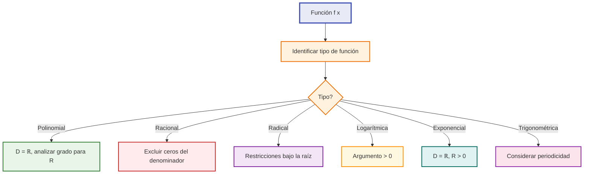
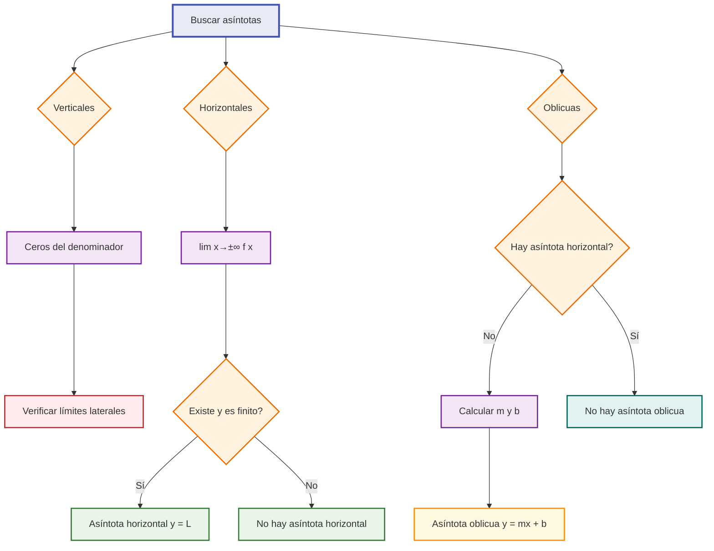
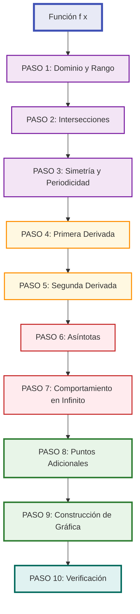

# Análisis Completo de Funciones 🎨

## Dominio y Rango 🏠

> [!info] Conceptos Fundamentales
> 
> - **Dominio (D)**: Conjunto de todos los valores de x para los cuales la función está definida
> - **Rango (R)**: Conjunto de todos los valores de y que la función puede tomar

### Determinación del Dominio

> [!tip] Casos Comunes de Restricción **Funciones Racionales:** ≠ 0 en el denominador
> 
> ```
> f(x) = 1/(x-2) → D: x ≠ 2 → D = ℝ - {2}
> ```
> 
> **Funciones con Raíz:** ≥ 0 bajo raíz par
> 
> ```
> f(x) = √(x-3) → x-3 ≥ 0 → D: x ≥ 3 → D = [3,∞)
> ```
> 
> **Funciones Logarítmicas:** > 0 en el argumento
> 
> ```
> f(x) = ln(x+1) → x+1 > 0 → D: x > -1 → D = (-1,∞)
> ```

### Determinación del Rango

> [!warning] Métodos para Encontrar el Rango
> 
> 1. **Análisis gráfico** - Observar valores en el eje y
> 2. **Algebra** - Despejar x en términos de y
> 3. **Cálculo** - Usar derivadas para encontrar extremos
> 4. **Transformaciones** - Aplicar cambios a funciones conocidas



## Asíntotas 📏

> [!info] Definición Las **asíntotas** son rectas que la función se aproxima indefinidamente sin llegar a tocarlas (en la mayoría de los casos).

### Asíntotas Verticales

> [!warning] Identificación Ocurren cuando **lim[x→a] f(x) = ±∞**
> 
> **Procedimiento:**
> 
> 1. Encontrar valores que hacen **f(x) → ±∞**
> 2. Verificar que **x = a** no esté en el dominio
> 3. Calcular límites laterales

> [!example] Ejemplo: f(x) = 1/(x-2)
> 
> - x = 2 no está en el dominio
> - lim[x→2⁻] f(x) = -∞
> - lim[x→2⁺] f(x) = +∞
> - **Asíntota vertical: x = 2**

### Asíntotas Horizontales

> [!tip] Identificación Ocurren cuando **lim[x→±∞] f(x) = L** (L es constante)
> 
> **Para funciones racionales P(x)/Q(x):**
> 
> - Si grado(P) < grado(Q) → y = 0
> - Si grado(P) = grado(Q) → y = coef. principal P / coef. principal Q
> - Si grado(P) > grado(Q) → No hay asíntota horizontal

> [!example] Ejemplo: f(x) = (2x+1)/(x-3)
> 
> - Grados iguales: grado = 1
> - Coeficientes principales: 2/1 = 2
> - **Asíntota horizontal: y = 2**

### Asíntotas Oblicuas

> [!info] Identificación Ocurren cuando **no hay asíntota horizontal** y **lim[x→±∞] [f(x) - mx] = b**
> 
> **Fórmulas:**
> 
> - m = lim[x→±∞] f(x)/x
> - b = lim[x→±∞] [f(x) - mx]
> 
> **Asíntota oblicua: y = mx + b**

> [!example] Ejemplo: f(x) = (x² + 1)/x = x + 1/x
> 
> - m = lim[x→±∞] (x² + 1)/(x²) = 1
> - b = lim[x→±∞] [(x² + 1)/x - x] = lim[x→±∞] 1/x = 0
> - **Asíntota oblicua: y = x**



## Intersecciones con Ejes 📍

> [!info] Puntos Clave Las intersecciones nos dan **puntos específicos** por donde pasa la gráfica de la función.

### Intersección con el Eje Y

> [!tip] Procedimiento **Evaluar f(0)** si 0 está en el dominio
> 
> **Punto de intersección: (0, f(0))**

> [!warning] Casos Especiales
> 
> - Si x = 0 no está en el dominio → **No hay intersección con eje y**
> - Una función puede tener **máximo una** intersección con el eje y

### Intersección con el Eje X

> [!tip] Procedimiento **Resolver f(x) = 0**
> 
> **Puntos de intersección: (x₁, 0), (x₂, 0), ..., (xₙ, 0)**

> [!info] Interpretación
> 
> - También llamados **ceros** o **raíces** de la función
> - Una función puede tener **múltiples** intersecciones con el eje x
> - Pueden ser **racionales, irracionales o complejas**

### Métodos para Encontrar Ceros

> [!example] Técnicas Comunes **Factorización:**
> 
> ```
> f(x) = x² - 5x + 6 = (x-2)(x-3)
> Ceros: x = 2, x = 3
> ```
> 
> **Fórmula Cuadrática:**
> 
> ```
> f(x) = ax² + bx + c
> x = (-b ± √(b²-4ac))/(2a)
> ```
> 
> **Métodos Numéricos:**
> 
> - Método de Newton-Raphson
> - Método de bisección
> - Calculadoras gráficas

## Comportamiento en el Infinito ∞

> [!info] Análisis Asintótico Estudiar qué ocurre con f(x) cuando x → +∞ y x → -∞ nos da información sobre el **comportamiento global** de la función.

### Tipos de Comportamiento

> [!tip] Clasificación por Límites **Comportamiento Polinomial:**
> 
> - **Grado par, coef. positivo**: +∞ en ambos extremos
> - **Grado par, coef. negativo**: -∞ en ambos extremos
> - **Grado impar, coef. positivo**: -∞ a la izquierda, +∞ a la derecha
> - **Grado impar, coef. negativo**: +∞ a la izquierda, -∞ a la derecha

### Análisis para Funciones Racionales

> [!warning] Reglas Generales Para f(x) = P(x)/Q(x) donde P y Q son polinomios:
> 
> **Si grado(P) < grado(Q):**
> 
> ```
> lim[x→±∞] f(x) = 0
> ```
> 
> **Si grado(P) = grado(Q):**
> 
> ```
> lim[x→±∞] f(x) = coef_P/coef_Q
> ```
> 
> **Si grado(P) > grado(Q):**
> 
> ```
> lim[x→±∞] f(x) = ±∞ (según signos y paridad)
> ```

### Funciones Especiales

> [!example] Casos Particulares **Exponenciales:**
> 
> - f(x) = eˣ: lim[x→-∞] = 0, lim[x→+∞] = +∞
> - f(x) = e⁻ˣ: lim[x→-∞] = +∞, lim[x→+∞] = 0
> 
> **Logarítmicas:**
> 
> - f(x) = ln(x): lim[x→0⁺] = -∞, lim[x→+∞] = +∞
> 
> **Trigonométricas:**
> 
> - f(x) = sen(x), cos(x): Oscilan entre -1 y 1 (no tienen límite)

## Esquema Completo de Graficación 🎯

> [!info] Metodología Sistemática Un **análisis completo** requiere integrar toda la información recopilada para construir una gráfica precisa y completa.

### Checklist Completo

> [!tip] Lista de Verificación Completa **1. Análisis Algebraico:**
> 
> - ✅ Dominio y rango
> - ✅ Intersecciones con ejes
> - ✅ Simetría (par, impar, ninguna)
> - ✅ Periodicidad (si aplica)
> 
> **2. Análisis con Derivadas:**
> 
> - ✅ Puntos críticos (f'(x) = 0)
> - ✅ Intervalos de crecimiento/decrecimiento
> - ✅ Máximos y mínimos locales/absolutos
> - ✅ Puntos de inflexión (f''(x) = 0)
> - ✅ Intervalos de concavidad
> 
> **3. Análisis Asintótico:**
> 
> - ✅ Asíntotas verticales
> - ✅ Asíntotas horizontales
> - ✅ Asíntotas oblicuas
> - ✅ Comportamiento en el infinito

### Proceso de Graficación



### Orden de Prioridad en el Análisis

> [!warning] Jerarquía de Información **Alta Prioridad (Siempre incluir):**
> 
> 1. Dominio y puntos de discontinuidad
> 2. Intersecciones con ejes
> 3. Asíntotas verticales
> 4. Comportamiento en infinito
> 
> **Media Prioridad (Muy importante):** 5. Puntos críticos y extremos 6. Asíntotas horizontales/oblicuas 7. Puntos de inflexión
> 
> **Baja Prioridad (Complementario):** 8. Simetrías específicas 9. Puntos adicionales para precisión 10. Detalles de curvatura fina

### Técnica de Construcción

> [!example] Estrategia de Dibujo **1. Marco de Referencia:**
> 
> - Dibujar ejes coordenados
> - Marcar escala apropiada
> - Identificar región de interés
> 
> **2. Elementos Fijos:**
> 
> - Trazar asíntotas (líneas punteadas)
> - Marcar intersecciones con ejes
> - Señalar puntos críticos
> 
> **3. Comportamiento Global:**
> 
> - Comenzar desde comportamiento en infinito
> - Respetar asíntotas
> - Conectar mediante curvas suaves
> 
> **4. Refinamiento:**
> 
> - Verificar concavidad en cada región
> - Ajustar curvatura en puntos de inflexión
> - Validar con puntos adicionales

## Técnicas de Estudio Efectivas 🧠

> [!tip] Mnemotecnia: "DACIA-GRAPH" **D**ominio y rango **A**síntotas  
> **C**eros (intersecciones con eje x) **I**ntersección con eje y **A**nálisis de derivadas (crecimiento y concavidad) **G**ráfica final **R**evisión y puntos adicionales **A**justes finales **P**resentación limpia **H**abilidades de verificación

> [!tip] Método de las "5W + 1H"
> 
> - **What** (Qué): ¿Qué tipo de función es?
> - **Where** (Dónde): ¿Dónde está definida? (dominio)
> - **When** (Cuándo): ¿Cuándo tiene comportamientos especiales?
> - **Why** (Por qué): ¿Por qué tiene esas características?
> - **Who** (Quién): ¿Qué elementos intervienen? (derivadas, límites)
> - **How** (Cómo): ¿Cómo construir la gráfica?

### Tabla de Referencia Rápida

|Elemento|Pregunta Clave|Método|Resultado|
|---|---|---|---|
|Dominio|¿Dónde existe f(x)?|Restricciones algebraicas|Intervalo(s)|
|Asínt. Vertical|¿Dónde f(x) → ±∞?|Ceros denominador|x = a|
|Asínt. Horizontal|¿lim f(x) finito?|Comportamiento infinito|y = L|
|Intersec. Ejes|¿f(0) y f(x)=0?|Evaluación y resolución|Puntos (a,0), (0,b)|
|Extremos|¿Dónde f'(x)=0?|Primera derivada|Máx/Mín locales|
|Inflexión|¿Dónde f''(x)=0?|Segunda derivada|Cambio concavidad|

## Ejemplos Prácticos 📚

> [!example] Ejemplo Completo: f(x) = (x²-1)/(x²-4)
> 
> **1. Dominio:** x ≠ ±2, D = ℝ - {-2, 2}
> 
> **2. Intersecciones:**
> 
> - Con eje y: f(0) = (-1)/(-4) = 1/4 → (0, 1/4)
> - Con eje x: x²-1 = 0 → x = ±1 → (-1,0), (1,0)
> 
> **3. Asíntotas:**
> 
> - Verticales: x = -2, x = 2
> - Horizontal: y = 1 (grados iguales, coef: 1/1)
> 
> **4. Primera derivada:** f'(x) = -6x/(x²-4)²
> 
> - Punto crítico: x = 0
> - f'(x) > 0 si x < 0, f'(x) < 0 si x > 0
> - Máximo local en (0, 1/4)
> 
> **5. Segunda derivada:** f''(x) = 6(3x²+4)/(x²-4)³
> 
> - f''(x) = 0 cuando 3x²+4 = 0 (sin solución real)
> - Análisis de signos según denominador

## Referencias 🔗

> [!quote] [[Límites y Continuidad]] Fundamentos para entender asíntotas y comportamiento

> [!quote] [[Primera Derivada y Monotonía]] Análisis de crecimiento y puntos críticos

> [!quote] [[Concavidad y Puntos de Inflexión]] Segunda derivada y curvatura de funciones

> [!quote] [[Optimización de Funciones]] Aplicaciones prácticas del análisis completo

> [!quote] [[Funciones Racionales]] Casos específicos y técnicas especializadas

## Notas Recomendadas para Complementar 📖

- [[Teorema del Valor Medio]] - Fundamentos teóricos de derivadas
- [[Regla de L'Hôpital]] - Resolución de límites indeterminados
- [[Series de Taylor]] - Aproximaciones locales de funciones
- [[Funciones Trigonométricas]] - Casos especiales de periodicidad
- [[Funciones Exponenciales y Logarítmicas]] - Comportamientos característicos
- [[Transformaciones de Funciones]] - Efectos de modificaciones algebraicas
- [[Ecuaciones Paramétricas]] - Representaciones alternativas
- [[Coordenadas Polares]] - Sistemas de coordenadas diferentes

---

**Tags:** #calculo #analisis-funciones #graficacion #dominio #rango #asintotas #intersecciones #comportamiento-infinito #derivadas #matematicas #funciones