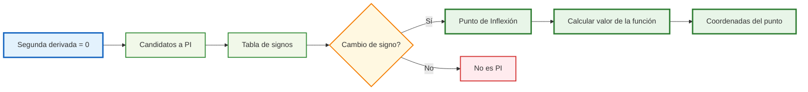
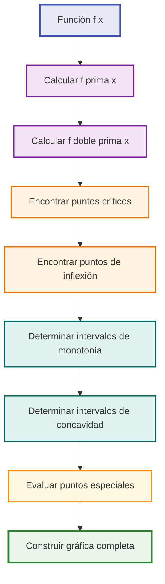

# Concavidad y Puntos de Inflexión 📈

## Definición de Concavidad 🔄

> [!info] Concepto Fundamental La **concavidad** describe la curvatura de una función en un intervalo determinado. Es una propiedad geométrica que nos indica si la gráfica se "curva hacia arriba" o "hacia abajo".

### Tipos de Concavidad

> [!tip] Concavidad Hacia Arriba (Cóncava Arriba) ⬆️
> 
> - La gráfica tiene forma de "U"
> - La segunda derivada es **positiva**: f''(x) > 0
> - Cualquier recta secante queda por **encima** de la curva
> - Los puntos se alejan de la tangente hacia arriba

> [!tip] Concavidad Hacia Abajo (Cóncava Abajo) ⬇️
> 
> - La gráfica tiene forma de "∩" (U invertida)
> - La segunda derivada es **negativa**: f''(x) < 0
> - Cualquier recta secante queda por **debajo** de la curva
> - Los puntos se alejan de la tangente hacia abajo

## Criterio de la Segunda Derivada 🧮

> [!warning] Regla Principal Para determinar la concavidad de f(x) en un intervalo:
> 
> - **Si f''(x) > 0** → La función es **cóncava hacia arriba**
> - **Si f''(x) < 0** → La función es **cóncava hacia abajo**
> - **Si f''(x) = 0** → Posible **punto de inflexión**

### Interpretación del Criterio

> [!info] Significado Geométrico La segunda derivada mide la **tasa de cambio de la pendiente**:
> 
> - **f''(x) > 0**: La pendiente está **aumentando** → curva hacia arriba
> - **f''(x) < 0**: La pendiente está **disminuyendo** → curva hacia abajo
> - **f''(x) = 0**: La pendiente **no cambia** (momentáneamente) → posible inflexión

### Relación con Derivadas

> [!tip] Conexión Conceptual
> 
> |Derivada|Información|Interpretación|
> |---|---|---|
> |f'(x)|Pendiente|Crecimiento/decrecimiento|
> |f''(x)|Curvatura|Concavidad|
> |f'''(x)|Cambio de curvatura|Validación de inflexión|

## Intervalos de Concavidad 📊

> [!info] Definición Los **intervalos de concavidad** son los rangos de valores de x donde la función mantiene el mismo tipo de curvatura (hacia arriba o hacia abajo).

### Proceso para Determinar Intervalos

> [!tip] Método Paso a Paso
> 
> 1. **Encontrar** los puntos críticos de f''(x)
> 2. **Resolver** f''(x) = 0 y puntos de discontinuidad
> 3. **Dividir** el dominio en intervalos usando estos puntos
> 4. **Evaluar** el signo de f''(x) en cada intervalo
> 5. **Clasificar** cada intervalo según su concavidad

### Tabla de Signos para Intervalos

> [!example] Ejemplo de Análisis Para f(x) = x³ - 6x² + 9x + 1:
> 
> - f''(x) = 6x - 12 = 6(x - 2)
> - Punto crítico: x = 2
> 
> |Intervalo|x < 2|x = 2|x > 2|
> |---|---|---|---|
> |f''(x)|(-)|0|(+)|
> |Concavidad|⬇️ Abajo|Inflexión|⬆️ Arriba|

## Puntos de Inflexión 🎯

> [!info] Definición Un **punto de inflexión** es aquel donde la función cambia su concavidad. En este punto, la curva pasa de cóncava hacia arriba a cóncava hacia abajo, o viceversa.

### Condiciones para Puntos de Inflexión

> [!warning] Condición Necesaria **f''(x) = 0** o **f''(x) no existe**

> [!warning] Condición Suficiente La segunda derivada debe **cambiar de signo** al pasar por el punto candidato.

### Proceso para Encontrar Puntos de Inflexión

> [!tip] Algoritmo Paso a Paso
> 
> 1. **Calcular** f''(x)
> 2. **Resolver** f''(x) = 0
> 3. **Identificar** puntos donde f''(x) no existe
> 4. **Verificar** cambio de signo usando tabla de signos
> 5. **Calcular** f(x) en los puntos confirmados

## Interpretación Geométrica 📐

> [!info] Visualización En un punto de inflexión:
> 
> - La **tangente cruza** la curva
> - La **curvatura cambia** de dirección
> - La **velocidad de cambio** de la pendiente es cero

## Técnicas de Estudio Efectivas 🧠

> [!tip] Mnemotecnia: "COCA-COLA" **CO**ncavidad **C**on **A**rriba → f''(x) > 0 (forma de **C**opa) **CO**ncavidad **L**leva **A**bajo → f''(x) < 0 (**L**oma invertida)

> [!tip] Método de Estudio: Regla de las Manos ✋
> 
> - **Mano derecha hacia arriba** (dedos apuntan arriba) = Cóncava arriba
> - **Mano izquierda hacia abajo** (dedos apuntan abajo) = Cóncava abajo
> - **Punto donde cambias de mano** = Punto de inflexión

### Tabla Resumen para Memorizar

|f''(x)|Signo|Concavidad|Forma Visual|Ejemplo|
|---|---|---|---|---|
|> 0|+|Hacia arriba|U|x²|
|< 0|-|Hacia abajo|∩|-x²|
|= 0|0|Cambio posible|Transición|x³ en x=0|

## Ejemplos Prácticos 📚

> [!example] Ejemplo 1: f(x) = x³
> 
> - f'(x) = 3x²
> - f''(x) = 6x
> - f''(x) = 0 → x = 0
> - Cambio de signo: (-,0,+)
> - **Punto de inflexión: (0,0)**

> [!example] Ejemplo 2: f(x) = x⁴
> 
> - f'(x) = 4x³
> - f''(x) = 12x²
> - f''(x) = 0 → x = 0
> - **No hay cambio de signo** (siempre ≥ 0)
> - **No es punto de inflexión**

## Gráficas de Funciones 📈

> [!info] Análisis Visual Completo Para realizar un **estudio completo de una función**, debemos combinar información de la primera y segunda derivada para obtener una gráfica precisa.

### Elementos Clave en el Análisis Gráfico

> [!tip] Checklist para Graficar
> 
> - ✅ **Dominio y rango** de la función
> - ✅ **Intersecciones** con ejes (x=0, y=0)
> - ✅ **Puntos críticos** (f'(x) = 0)
> - ✅ **Intervalos de crecimiento** (f'(x) > 0, f'(x) < 0)
> - ✅ **Puntos de inflexión** (f''(x) = 0 con cambio de signo)
> - ✅ **Intervalos de concavidad** (f''(x) > 0, f''(x) < 0)
> - ✅ **Asíntotas** (verticales, horizontales, oblicuas)
> - ✅ **Comportamiento en infinito**

### Pasos para Construir la Gráfica

### Información que Proporciona cada Derivada

> [!warning] Interpretación Combinada
> 
> **Primera Derivada f'(x):**
> 
> - Pendiente de la recta tangente
> - Crecimiento y decrecimiento
> - Máximos y mínimos locales
> 
> **Segunda Derivada f''(x):**
> 
> - Curvatura de la función
> - Concavidad hacia arriba/abajo
> - Puntos de inflexión
> - Naturaleza de puntos críticos

### Casos Especiales en Gráficas

> [!example] Situaciones Importantes
> 
> **Punto de Inflexión Horizontal:**
> 
> - f'(x₀) = 0 y f''(x₀) = 0 con cambio de signo
> - La tangente es horizontal y la curva cambia concavidad
> 
> **Inflexión con Tangente Vertical:**
> 
> - f'(x₀) no existe pero f''(x) cambia de signo
> - Común en funciones con raíces fraccionarias
> 
> **Falsos Puntos de Inflexión:**
> 
> - f''(x₀) = 0 pero sin cambio de signo
> - Ej: f(x) = x⁴ en x = 0

## Referencias 🔗

> [!quote] [[Criterios de Optimización]] Aprende sobre máximos y mínimos usando derivadas

> [!quote] [[Análisis Completo de Funciones]] Estudio completo del comportamiento de funciones

> [!quote] [[Aplicaciones de Derivadas]] Casos prácticos del uso de derivadas en problemas reales

## Notas Recomendadas para Complementar 📖

- [[Límites y Continuidad]] - Base para entender derivadas
- [[Primera Derivada y Monotonía]] - Crecimiento y decrecimiento
- [[Teorema del Valor Medio para Derivadas]] - Fundamentos teóricos
- [[Optimización con Restricciones]] - Aplicaciones avanzadas
- [[Series de Taylor]] - Aproximaciones usando derivadas
- [[Ecuaciones Diferenciales]] - Aplicaciones dinámicas

---

**Tags:** #calculo #derivadas #concavidad #puntos-inflexion #segunda-derivada #analisis-funciones #matematicas #optimizacion