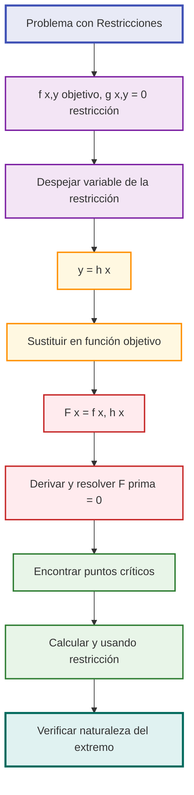
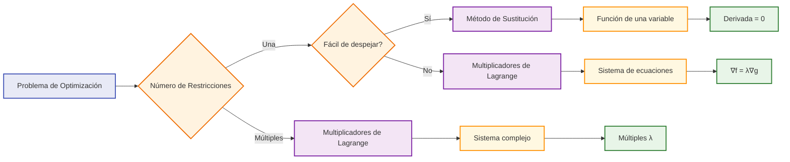
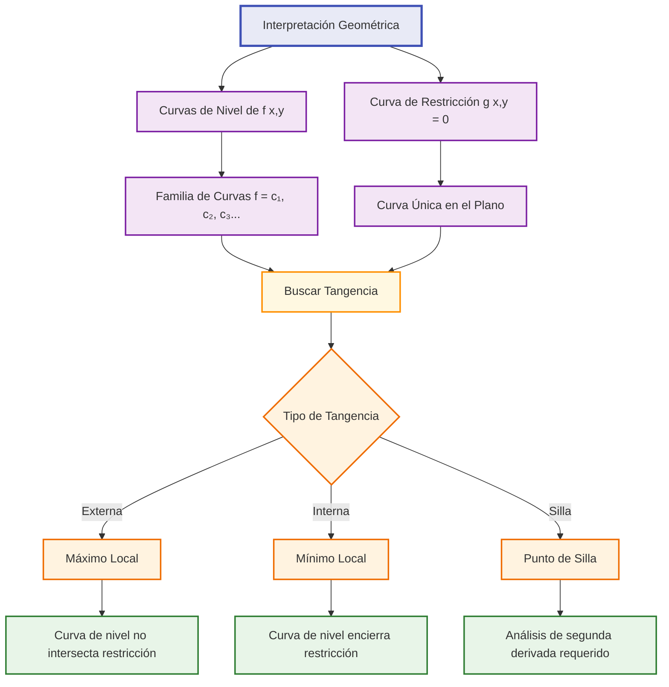

# Optimización con Restricciones 🔒

## Método de Sustitución 🔄

> [!info] Concepto Fundamental El **método de sustitución** es la técnica más directa para resolver problemas de optimización con restricciones de igualdad. Consiste en usar la restricción para eliminar una variable y convertir el problema a optimización sin restricciones.

### Procedimiento del Método

> [!tip] Pasos del Método de Sustitución
> 
> 1. **Identificar** la función objetivo f(x, y) y la restricción g(x, y) = 0
> 2. **Despejar** una variable de la restricción: y = h(x)
> 3. **Sustituir** en la función objetivo: f(x, h(x)) = F(x)
> 4. **Optimizar** la función de una variable: F'(x) = 0
> 5. **Encontrar** el valor de la otra variable usando la restricción
> 6. **Verificar** que sea máximo o mínimo



### Ventajas y Limitaciones

> [!warning] Cuándo Usar Sustitución **✅ Ideal cuando:**
> 
> - La restricción es **fácil de despejar**
> - Resulta en una función **simple de una variable**
> - Hay **pocas restricciones** (preferiblemente una)
> 
> **❌ Evitar cuando:**
> 
> - El despeje es **muy complejo**
> - Se obtienen **expresiones irracionales complicadas**
> - Hay **múltiples restricciones** de igualdad

### Ejemplo Detallado

> [!example] Problema: Rectángulo de Área Máxima con Perímetro Fijo **Enunciado:** Encontrar las dimensiones del rectángulo de área máxima cuyo perímetro es 20.
> 
> **Solución paso a paso:**
> 
> **1. Definir variables:** x = largo, y = ancho **2. Función objetivo:** A(x,y) = xy (maximizar área) **3. Restricción:** 2x + 2y = 20 → x + y = 10 **4. Despejar:** y = 10 - x **5. Sustituir:** A(x) = x(10-x) = 10x - x² **6. Dominio:** 0 < x < 10 (dimensiones positivas) **7. Derivar:** A'(x) = 10 - 2x **8. Punto crítico:** 10 - 2x = 0 → x = 5 **9. Calcular y:** y = 10 - 5 = 5 **10. Verificar:** A''(x) = -2 < 0 → Máximo
> 
> **Respuesta:** Cuadrado de 5×5 unidades

> [!example] Problema: Minimización de Distancia **Enunciado:** Encontrar el punto de la recta x + y = 1 más cercano al origen.
> 
> **Solución:**
> 
> - Función objetivo: d²(x,y) = x² + y² (minimizar distancia al cuadrado)
> - Restricción: x + y = 1 → y = 1 - x
> - Sustituir: d²(x) = x² + (1-x)² = x² + 1 - 2x + x² = 2x² - 2x + 1
> - Derivar: d²'(x) = 4x - 2 = 0 → x = 1/2
> - Calcular y: y = 1 - 1/2 = 1/2
> - Verificar: d²''(x) = 4 > 0 → Mínimo
> 
> **Respuesta:** Punto (1/2, 1/2), distancia = √2/2

## Multiplicadores de Lagrange (Introducción) ⚖️

> [!info] Filosofía del Método Los **multiplicadores de Lagrange** proporcionan una técnica sistemática para optimizar funciones sujetas a restricciones sin necesidad de eliminar variables explícitamente.

### Fundamento Teórico

> [!warning] Idea Central En el **punto óptimo**, el gradiente de la función objetivo es **proporcional** al gradiente de la restricción.
> 
> **Condición necesaria:** ∇f = λ∇g
> 
> Donde λ (lambda) es el **multiplicador de Lagrange**

### Formulación del Método

> [!tip] Sistema de Ecuaciones de Lagrange Para optimizar f(x,y) sujeto a g(x,y) = 0:
> 
> **Función de Lagrange:** L(x,y,λ) = f(x,y) - λg(x,y)
> 
> **Sistema a resolver:**
> 
> ```
> ∂L/∂x = ∂f/∂x - λ∂g/∂x = 0
> ∂L/∂y = ∂f/∂y - λ∂g/∂y = 0  
> ∂L/∂λ = -g(x,y) = 0
> ```

### Interpretación del Multiplicador λ

> [!info] Significado Económico **λ representa la tasa de cambio del valor óptimo** respecto a cambios en la restricción.
> 
> - **λ > 0:** Relajar la restricción **aumentaría** el valor óptimo
> - **λ < 0:** Relajar la restricción **disminuiría** el valor óptimo
> - **|λ|:** Magnitud del **precio sombra** de la restricción

### Ejemplo Introductorio

> [!example] Problema: Optimización con Lagrange **Enunciado:** Maximizar f(x,y) = xy sujeto a x + y = 10
> 
> **Solución con Lagrange:**
> 
> **1. Función de Lagrange:** L(x,y,λ) = xy - λ(x + y - 10)
> 
> **2. Sistema de ecuaciones:**
> 
> ```
> ∂L/∂x = y - λ = 0  →  y = λ
> ∂L/∂y = x - λ = 0  →  x = λ  
> ∂L/∂λ = -(x + y - 10) = 0  →  x + y = 10
> ```
> 
> **3. Resolver:** De las dos primeras: x = y = λ Sustituyendo en la tercera: λ + λ = 10 → λ = 5
> 
> **4. Solución:** x = 5, y = 5, λ = 5
> 
> **Interpretación:** Si aumentamos la "restricción de recursos" de 10 a 11, el valor máximo aumentaría aproximadamente en 5 unidades.

### Comparación: Sustitución vs Lagrange

> [!tip] Tabla Comparativa
> 
> |Aspecto|Sustitución|Lagrange|
> |---|---|---|
> |**Complejidad algebraica**|Variable|Constante|
> |**Número de ecuaciones**|1|n + m|
> |**Información adicional**|No|Sí (λ)|
> |**Múltiples restricciones**|Difícil|Natural|
> |**Elegancia**|Directa|Sistemática|
> |**Interpretación económica**|Limitada|Rica|



## Problemas Prácticos 🛠️

> [!info] Aplicaciones del Mundo Real La optimización con restricciones aparece constantemente en **ingeniería, economía, física** y otras disciplinas aplicadas.

### Problemas de Diseño

> [!example] Problema: Diseño de Tanque Cilíndrico **Enunciado:** Diseñar un tanque cilíndrico cerrado de volumen 1000 m³ que minimice la superficie total (costo de material).
> 
> **Planteamiento:**
> 
> - Variables: r = radio, h = altura
> - Función objetivo: S = 2πr² + 2πrh (minimizar superficie)
> - Restricción: πr²h = 1000 (volumen fijo)
> 
> **Solución por Sustitución:**
> 
> 1. Despejar: h = 1000/(πr²)
> 2. Sustituir: S(r) = 2πr² + 2πr[1000/(πr²)] = 2πr² + 2000/r
> 3. Derivar: S'(r) = 4πr - 2000/r²
> 4. Punto crítico: 4πr - 2000/r² = 0 → 4πr³ = 2000 → r³ = 500/π
> 5. r = ∛(500/π) ≈ 5.42 m
> 6. h = 1000/(π × 5.42²) ≈ 10.84 m
> 
> **Solución por Lagrange:**
> 
> ```
> L = 2πr² + 2πrh - λ(πr²h - 1000)
> ∂L/∂r = 4πr + 2πh - 2λπrh = 0
> ∂L/∂h = 2πr - λπr² = 0
> ∂L/∂λ = -(πr²h - 1000) = 0
> ```
> 
> **Resultado:** h = 2r (altura = diámetro)

### Problemas Económicos

> [!example] Problema: Optimización de Producción **Enunciado:** Una empresa produce dos bienes (x, y) con función de utilidad U(x,y) = x^0.4 y^0.6 y restricción presupuestaria 2x + 3y = 100.
> 
> **Solución con Lagrange:**
> 
> ```
> L = x^0.4 y^0.6 - λ(2x + 3y - 100)
> 
> ∂L/∂x = 0.4x^(-0.6) y^0.6 - 2λ = 0
> ∂L/∂y = 0.6x^0.4 y^(-0.4) - 3λ = 0
> ∂L/∂λ = -(2x + 3y - 100) = 0
> ```
> 
> **De las dos primeras ecuaciones:**
> 
> ```
> 0.4x^(-0.6) y^0.6 / 2 = 0.6x^0.4 y^(-0.4) / 3
> 0.2 y/x = 0.2 x/y
> y² = x²  →  y = x (asumiendo positivo)
> ```
> 
> **Sustituyendo en la restricción:** 2x + 3x = 100 → x = 20, y = 20
> 
> **Interpretación:** El consumidor óptimo gasta igual en ambos bienes.

### Problemas de Ingeniería

> [!warning] Problema: Viga de Resistencia Máxima **Enunciado:** De un tronco cilíndrico de radio R, cortar una viga rectangular que tenga máximo momento de resistencia.
> 
> **Datos:** Momento de resistencia = k × ancho × altura² **Restricción:** ancho² + altura² = (2R)² (inscrita en círculo)
> 
> **Planteamiento:**
> 
> - Variables: w = ancho, h = altura
> - Objetivo: M = kwh² (maximizar)
> - Restricción: w² + h² = 4R²
> 
> **Solución:** h = w√2, es decir, altura = √2 × ancho

### Problemas de Física

> [!example] Problema: Principio de Fermat **Enunciado:** Un rayo de luz viaja del punto A(0,a) al punto B(d,b) reflejándose en el eje x. Encontrar el punto de reflexión que minimiza el tiempo.
> 
> **Planteamiento:**
> 
> - Variable: x = punto de reflexión en eje x
> - Función objetivo: T = (distancia₁ + distancia₂)/velocidad
> - T(x) = [√(x² + a²) + √((d-x)² + b²)]/c
> 
> **Solución:**
> 
> ```
> dT/dx = [x/√(x² + a²) - (d-x)/√((d-x)² + b²)]/c = 0
> ```
> 
> **Resultado:** sen(θ₁) = sen(θ₂) (ley de reflexión)

## Interpretación Geométrica 📐

> [!info] Visualización Conceptual La **interpretación geométrica** proporciona intuición profunda sobre por qué funcionan estos métodos y cuándo aplicarlos.

### Curvas de Nivel

> [!tip] Concepto de Curvas de Nivel Las **curvas de nivel** de f(x,y) = c son conjuntos donde la función tiene valor constante.
> 
> **En el punto óptimo:** La curva de nivel de la función objetivo es **tangente** a la curva de restricción.

> [!warning] Condición de Tangencia Dos curvas son tangentes cuando tienen la **misma recta tangente**, lo que ocurre cuando sus **vectores normales son paralelos**.
> 
> **Vector normal a f(x,y) = c:** ∇f = (∂f/∂x, ∂f/∂y) **Vector normal a g(x,y) = 0:** ∇g = (∂g/∂x, ∂g/∂y)
> 
> **Condición:** ∇f = λ∇g (vectores paralelos)

### Visualización Gráfica



### Casos Especiales Geométricos

> [!example] Análisis de Casos **Caso 1: Máximo Interior**
> 
> - Las curvas de nivel rodean completamente el punto óptimo
> - La restricción "corta" a través de las curvas de nivel
> - El punto de tangencia corresponde al valor máximo alcanzable
> 
> **Caso 2: Mínimo Interior**
> 
> - El punto óptimo está en el "centro" de las curvas de nivel
> - La restricción pasa por el valor mínimo de la función
> 
> **Caso 3: Máximo/Mínimo en Frontera**
> 
> - El óptimo puede estar en los extremos del dominio de la restricción
> - Requiere análisis adicional de los puntos extremos

### Interpretación del Multiplicador λ

> [!info] Significado Geométrico de λ **λ > 0:** Los gradientes ∇f y ∇g apuntan en la **misma dirección**
> 
> - La función crece en la dirección que "relaja" la restricción
> - Típico en problemas de **maximización**
> 
> **λ < 0:** Los gradientes ∇f y ∇g apuntan en **direcciones opuestas**
> 
> - La función decrece cuando se relaja la restricción
> - Típico en problemas de **minimización**

### Intuición del Gradiente

> [!tip] Interpretación Vectorial **∇f:** Vector que apunta hacia el **mayor crecimiento** de f **∇g:** Vector **perpendicular** a la curva de restricción
> 
> **En el óptimo:** No es posible moverse a lo largo de la restricción para mejorar el valor de la función objetivo.

### Ejemplo Visual

> [!example] Problema Geométrico: Maximizar xy sujeto a x + y = 10
> 
> **Curvas de nivel:** xy = c → hipérbolas **Restricción:** x + y = 10 → recta
> 
> **Análisis:**
> 
> 1. Para c pequeño: hipérbolas no tocan la recta
> 2. Aumentando c: las hipérbolas se acercan a la recta
> 3. En c = 25: la hipérbola xy = 25 es **tangente** a x + y = 10
> 4. Para c > 25: no hay intersección
> 
> **Conclusión:** El máximo es 25, alcanzado en (5,5)

### Restricciones Múltiples

> [!warning] Extensión Geométrica Con **múltiples restricciones** g₁(x,y) = 0, g₂(x,y) = 0:
> 
> **Condición:** ∇f = λ₁∇g₁ + λ₂∇g₂
> 
> **Interpretación:** El gradiente de f es combinación lineal de los gradientes de las restricciones.
> 
> **Geométricamente:** El punto óptimo está en la **intersección** de las curvas de restricción, donde ∇f es combinación de los vectores normales a cada restricción.

## Técnicas de Estudio Efectivas 🧠

> [!tip] Mnemotecnia: "LAGRANGE" **L**ocaliza la función objetivo y restricciones **A**naliza si usar sustitución o Lagrange **G**radientes: calcula ∇f y ∇g **R**esuelve el sistema ∇f = λ∇g **A**plica la restricción g = 0 **N**aturaleza: verifica si es máximo o mínimo **G**eometría: interpreta el resultado **E**valúa el significado de λ

> [!tip] Método de Decisión: "SUSTLAG" **SU**stitución si:
> 
> - **S**imple despeje de la restricción
> - **T**ranscendental evitable
> 
> **LAG**range si:
> 
> - **L**arga expresión al despejar
> - **A**bundantes restricciones
> - **G**radientes fáciles de calcular

### Checklist de Resolución

> [!example] Lista de Verificación **□ PLANTEAMIENTO:**
> 
> - ¿Están claras todas las variables?
> - ¿La función objetivo es correcta?
> - ¿Todas las restricciones están identificadas?
> 
> **□ MÉTODO:**
> 
> - ¿Sustitución es viable?
> - ¿Los gradientes son manejables?
> - ¿El sistema resultante es resoluble?
> 
> **□ SOLUCIÓN:**
> 
> - ¿Los puntos críticos son válidos?
> - ¿Se verificó la naturaleza del extremo?
> - ¿Se evaluaron los puntos de frontera?
> 
> **□ INTERPRETACIÓN:**
> 
> - ¿El resultado tiene sentido físico?
> - ¿Qué significa el valor de λ?
> - ¿La solución responde la pregunta original?

### Errores Comunes y Cómo Evitarlos

> [!warning] Trampas Frecuentes **En Sustitución:**
> 
> - ✗ No considerar el dominio después de sustituir
> - ✗ Errores algebraicos al despejar
> - ✗ No verificar que el despeje sea válido
> 
> **En Lagrange:**
> 
> - ✗ Olvidar incluir la restricción en el sistema
> - ✗ Confundir el signo del multiplicador
> - ✗ No verificar todas las soluciones del sistema
> 
> **En General:**
> 
> - ✗ No considerar puntos de frontera
> - ✗ Asumir que todo punto crítico es óptimo global
> - ✗ Ignorar el contexto físico del problema

## Referencias 🔗

> [!quote] [[Problemas de Optimización]] Métodos generales sin restricciones y modelado

> [!quote] [[Análisis Completo de Funciones]] Herramientas para verificar naturaleza de extremos

> [!quote] [[Gradiente y Derivadas Direccionales]] Fundamentos vectoriales del método de Lagrange

> [!quote] [[Aplicaciones de Derivadas]] Contexto más amplio de optimización aplicada

> [!quote] [[Cálculo de Varias Variables]] Extensión completa del método de Lagrange

## Notas Recomendadas para Complementar 📖

- [[Derivadas Parciales]] - Fundamento para gradientes
- [[Matriz Hessiana]] - Criterios de segunda derivada en varias variables
- [[Programación Lineal]] - Optimización con restricciones lineales
- [[Cálculo de Variaciones]] - Optimización de funciones
- [[Teoría de Optimización]] - Marco teórico avanzado
- [[Aplicaciones en Economía]] - Contexto específico de utilidad y producción
- [[Geometría Analítica]] - Interpretación geométrica avanzada
- [[Álgebra Lineal]] - Manejo de sistemas de ecuaciones

---

**Tags:** #calculo #optimizacion #restricciones #lagrange #sustitucion #aplicaciones #geometria #economia #gradientes #multiplicadores