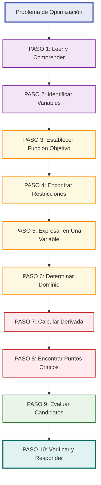
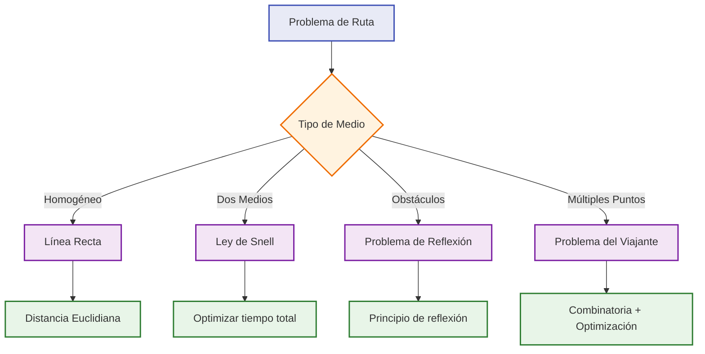
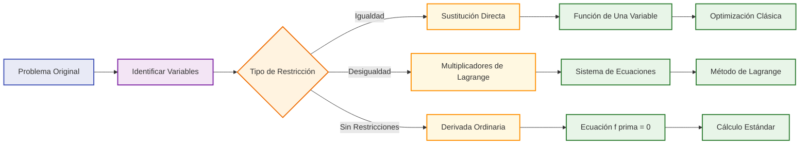

# Problemas de Optimización 🎯

## Metodología General 🔧

> [!info] Concepto Fundamental Los **problemas de optimización** buscan encontrar el valor **máximo** o **mínimo** de una función objetivo sujeta a ciertas restricciones o condiciones.

### Proceso Sistemático de Resolución

> [!tip] Metodología MODELO (Técnica de Memorización) **M**odelado - Identificar variables y función objetivo **O**rganizar - Establecer restricciones y dominio **D**erivar - Calcular la primera derivada **E**cuacionar - Resolver f'(x) = 0 **L**ocalizar - Encontrar puntos críticos **O**ptimizar - Verificar máximos/mínimos

### Tipos de Puntos Candidatos

> [!warning] Lugares Donde Buscar Extremos **1. Puntos Críticos Interiores:** f'(x) = 0 **2. Puntos de Frontera:** Extremos del dominio **3. Puntos de Discontinuidad:** f'(x) no existe **4. Puntos de Esquina:** En problemas con restricciones angulares

### Criterios de Verificación

> [!tip] Métodos de Confirmación **Test de la Primera Derivada:**
> 
> - f'(x) cambia de + a - → Máximo local
> - f'(x) cambia de - a + → Mínimo local
> 
> **Test de la Segunda Derivada:**
> 
> - f''(x) < 0 → Máximo local
> - f''(x) > 0 → Mínimo local
> - f''(x) = 0 → Test inconcluso
> 
> **Evaluación Directa:**
> 
> - Comparar valores de f(x) en todos los candidatos

## Problemas Geométricos 📐

> [!info] Características Involucran **optimización de medidas geométricas** como área, volumen, perímetro, superficie, etc.

### Problemas de Área

> [!example] Problema Clásico: Rectángulo de Área Máxima **Enunciado:** Con 200 m de cerca, encontrar las dimensiones del rectángulo de área máxima.
> 
> **Solución:**
> 
> - Variables: largo = x, ancho = y
> - Restricción: 2x + 2y = 200 → y = 100 - x
> - Función objetivo: A(x) = x·y = x(100-x) = 100x - x²
> - Dominio: 0 < x < 100
> - A'(x) = 100 - 2x = 0 → x = 50
> - A''(x) = -2 < 0 → Máximo
> - **Respuesta:** Cuadrado de 50×50 m

> [!tip] Estrategias Comunes en Problemas de Área **Rectángulos:** A = base × altura **Triángulos:** A = ½ × base × altura  
> **Círculos:** A = πr² **Sectores:** A = ½r²θ **Figuras Compuestas:** Suma/resta de áreas simples

### Problemas de Volumen

> [!example] Problema: Caja de Volumen Máximo **Enunciado:** De una lámina cuadrada de 12 cm de lado, cortar cuadrados en las esquinas para formar una caja. ¿Qué tamaño deben tener los cuadrados cortados?
> 
> **Solución:**
> 
> - Variable: lado del cuadrado cortado = x
> - Dimensiones de la caja: (12-2x) × (12-2x) × x
> - Función objetivo: V(x) = x(12-2x)² = x(144-48x+4x²) = 144x-48x²+4x³
> - Dominio: 0 < x < 6
> - V'(x) = 144 - 96x + 12x² = 12(12 - 8x + x²)
> - V'(x) = 12(x-2)(x-6) = 0 → x = 2 (x = 6 no válido)
> - V''(2) = 24(2) - 96 = -48 < 0 → Máximo
> - **Respuesta:** Cortar cuadrados de 2×2 cm

> [!warning] Fórmulas de Volumen Importantes **Prisma rectangular:** V = largo × ancho × alto **Cilindro:** V = πr²h **Cono:** V = ⅓πr²h **Esfera:** V = ⅘πr³ **Pirámide:** V = ⅓ × área_base × altura

### Problemas de Superficie

> [!tip] Consideraciones Especiales
> 
> - **Superficie total** vs **superficie lateral**
> - **Costos por unidad de área** diferentes
> - **Restricciones de material disponible**
> - **Formas que minimizan pérdida de calor**

## Problemas de Distancia 📏

> [!info] Tipos Principales Optimización de **distancias mínimas** entre puntos, rectas, curvas, o **tiempos mínimos** de recorrido.

### Distancia Punto-Curva

> [!example] Problema: Punto más Cercano a una Parábola **Enunciado:** Encontrar el punto de y = x² más cercano al punto (0, 1).
> 
> **Solución:**
> 
> - Punto en la parábola: P(t, t²)
> - Distancia: d(t) = √[(t-0)² + (t²-1)²] = √[t² + (t²-1)²]
> - Para simplificar: d²(t) = t² + (t²-1)² = t² + t⁴ - 2t² + 1 = t⁴ - t² + 1
> - Derivada: 2d(t)d'(t) = 4t³ - 2t = 2t(2t² - 1)
> - d'(t) = 0 → t = 0 o t² = ½ → t = ±√2/2
> - Evaluando: d²(0) = 1, d²(±√2/2) = 1/4 - 1/2 + 1 = 3/4
> - **Respuesta:** Puntos (±√2/2, 1/2) están más cerca

### Principio de Fermat (Tiempo Mínimo)

> [!warning] Ley de Snell y Reflexión **Problema tipo:** Luz viaja de A a B reflejándose en una superficie.
> 
> **Principio:** La luz toma el camino que minimiza el tiempo total. **Resultado:** Ángulo de incidencia = Ángulo de reflexión

> [!example] Problema de Refracción La luz viaja más lento en agua que en aire. Encontrar la trayectoria de tiempo mínimo.
> 
> **Ley de Snell:** n₁ sen(θ₁) = n₂ sen(θ₂) donde n₁, n₂ son índices de refracción

### Problemas de Ruta Óptima

## Aplicaciones Económicas 💰

> [!info] Contexto Los problemas económicos buscan **maximizar beneficios**, **minimizar costos**, o **optimizar la utilidad** en diferentes escenarios comerciales.

### Maximización de Beneficios

> [!tip] Conceptos Clave **Ingreso:** I(x) = precio × cantidad = p(x) × x **Costo:** C(x) = costos fijos + costos variables **Beneficio:** B(x) = I(x) - C(x) **Condición de óptimo:** Ingreso Marginal = Costo Marginal

> [!example] Problema de Empresa **Enunciado:** Una empresa tiene costos C(x) = 100 + 2x + 0.01x² y puede vender x unidades a precio p = 10 - 0.02x. Encontrar la producción óptima.
> 
> **Solución:**
> 
> - Ingreso: I(x) = x(10 - 0.02x) = 10x - 0.02x²
> - Beneficio: B(x) = 10x - 0.02x² - (100 + 2x + 0.01x²) = 8x - 0.03x² - 100
> - B'(x) = 8 - 0.06x = 0 → x = 8/0.06 ≈ 133.33
> - Como x debe ser entero: evaluar x = 133 y x = 134
> - B''(x) = -0.06 < 0 → Máximo
> - **Respuesta:** Producir 133 unidades

### Minimización de Costos

> [!warning] Tipos de Costos **Costos Fijos:** No dependen de la producción **Costos Variables:** Proporcionales a la producción **Costos Marginales:** Derivada del costo total **Costos de Inventario:** Almacenamiento vs pedidos frecuentes

> [!example] Modelo EOQ (Economic Order Quantity) **Variables:**
> 
> - D = demanda anual
> - K = costo por pedido
> - h = costo de mantener inventario por unidad/año
> 
> **Función de costo:** C(x) = (D/x)K + (x/2)h **Cantidad óptima:** x* = √(2DK/h)

### Problemas de Elasticidad

> [!info] Elasticidad Precio-Demanda **Definición:** E = (dp/dx)/(p/x) = elasticidad de la demanda
> 
> **Interpretación:**
> 
> - |E| > 1: Demanda elástica
> - |E| < 1: Demanda inelástica
> - |E| = 1: Elasticidad unitaria (ingreso máximo)

### Análisis de Inversión

> [!tip] Valor Presente Neto (VPN) **Fórmula:** VPN = Σ[CFₜ/(1+r)ᵗ] - Inversión Inicial
> 
> **Optimización:** Encontrar la tasa de descuento o el momento óptimo de inversión

## Estrategias de Modelado 🎨

> [!info] Enfoque Sistemático El **modelado efectivo** es la clave para resolver problemas de optimización complejos.

### Identificación de Variables

> [!tip] Tipos de Variables **Variables de Decisión:** Lo que podemos controlar **Variables de Estado:** Describen el sistema **Variables Auxiliares:** Facilitan los cálculos **Parámetros:** Valores fijos del problema

> [!warning] Errores Comunes en Variables
> 
> - **Confundir** variables independientes con dependientes
> - **No identificar** todas las restricciones
> - **Usar más variables** de las necesarias
> - **No definir claramente** el dominio

### Construcción de la Función Objetivo

> [!example] Estrategias de Construcción **1. Directa:** La función se deriva inmediatamente del problema **2. Por partes:** Combinar diferentes componentes del sistema **3. Paramétrica:** Usar parámetros que luego se optimizan **4. Por analogía:** Usar modelos similares conocidos

### Manejo de Restricciones

> [!tip] Clasificación de Restricciones **Explícitas:** Claramente establecidas en el problema **Implícitas:** Se derivan del contexto físico/lógico **Activas:** Afectan la solución óptima **Inactivas:** No limitan el óptimo

### Técnicas de Simplificación

> [!tip] Métodos de Reducción **Simetría:** Explotar simetrías para reducir variables **Escalamiento:** Usar unidades adecuadas para simplificar números **Normalización:** Convertir a forma estándar **Substitución:** Cambio de variables para simplificar

### Validación del Modelo

> [!warning] Verificaciones Necesarias **1. Coherencia Dimensional:** Unidades correctas en toda la ecuación **2. Casos Límite:** Comportamiento en situaciones extremas **3. Sentido Físico:** ¿El resultado es lógicamente razonable? **4. Sensibilidad:** ¿Cómo cambia la solución con los parámetros?

## Técnicas de Estudio Efectivas 🧠

> [!tip] Mnemotecnia: "OPTIMIZA" **O**bjetivo - Define claramente qué optimizar **P**arámetros - Identifica variables y constantes  
> **T**ipo - Clasifica el problema (geométrico, económico, etc.) **I**dentifica - Encuentra restricciones **M**odela - Construye la función objetivo **I**gualación - Resuelve f'(x) = 0 **Z**ona - Determina el dominio válido **A**naliza - Verifica que sea máximo/mínimo

> [!tip] Método de Verificación "SPEC" **S**ignificado - ¿Tiene sentido la respuesta? **P**untos críticos - ¿Se encontraron todos? **E**xtremos - ¿Se evaluaron los bordes del dominio? **C**riterio - ¿Se aplicó el test correcto (1ª o 2ª derivada)?

### Plantilla de Resolución

> [!example] Formato Estándar **1. DATOS:**
> 
> - Variables: _____
> - Restricciones: _____
> - Objetivo: Maximizar/Minimizar _____
> 
> **2. MODELADO:**
> 
> - Función objetivo: f(x) = _____
> - Dominio: x ∈ _____
> 
> **3. CÁLCULO:**
> 
> - f'(x) = _____
> - Puntos críticos: _____
> - Evaluación en candidatos: _____
> 
> **4. VERIFICACIÓN:**
> 
> - Criterio aplicado: _____
> - Respuesta: _____

## Ejemplos Integrados 📚

> [!example] Problema Complejo: Diseño de Envase **Enunciado:** Una empresa de bebidas quiere diseñar una lata cilíndrica que contenga 355 ml y minimice la cantidad de material usado.
> 
> **Solución Completa:**
> 
> **1. Variables:** r = radio, h = altura **2. Restricción:** πr²h = 355 → h = 355/(πr²) **3. Función objetivo:** Área = 2πr² + 2πrh (tapas + lateral) **4. Sustitución:** A(r) = 2πr² + 2πr[355/(πr²)] = 2πr² + 710/r **5. Dominio:** r > 0 **6. Derivada:** A'(r) = 4πr - 710/r² **7. Punto crítico:** 4πr - 710/r² = 0 → 4πr³ = 710 → r³ = 710/(4π) → r ≈ 3.84 cm **8. Segunda derivada:** A''(r) = 4π + 1420/r³ > 0 → Mínimo **9. Altura óptima:** h = 355/(π × 3.84²) ≈ 7.67 cm
> 
> **Respuesta:** r ≈ 3.84 cm, h ≈ 7.67 cm

> [!example] Problema Económico: Precio Óptimo **Enunciado:** Un monopolista tiene función de demanda p = 100 - 2x y costos C(x) = 20x + 1000. ¿Cuál es el precio y cantidad que maximizan el beneficio?
> 
> **Solución:**
> 
> - Ingreso: I(x) = x(100 - 2x) = 100x - 2x²
> - Beneficio: B(x) = 100x - 2x² - 20x - 1000 = 80x - 2x² - 1000
> - B'(x) = 80 - 4x = 0 → x = 20
> - Precio óptimo: p = 100 - 2(20) = 60
> - Beneficio máximo: B(20) = 80(20) - 2(400) - 1000 = 600
> 
> **Respuesta:** Vender 20 unidades a $60 cada una

## Referencias 🔗

> [!quote] [[Análisis Completo de Funciones]] Herramientas fundamentales para el análisis de candidatos

> [!quote] [[Concavidad y Puntos de Inflexión]] Criterios de segunda derivada para verificar extremos

> [!quote] [[Multiplicadores de Lagrange]] Técnica para optimización con restricciones de igualdad

> [!quote] [[Aplicaciones de Derivadas]] Contexto más amplio de usos prácticos del cálculo

> [!quote] [[Modelado Matemático]] Principios generales para convertir problemas reales en matemáticos

## Notas Recomendadas para Complementar 📖

- [[Límites y Continuidad]] - Fundamentos para entender extremos
- [[Teorema del Valor Medio]] - Base teórica de la optimización
- [[Funciones de Varias Variables]] - Extensión a problemas multidimensionales
- [[Ecuaciones Diferenciales]] - Optimización dinámica
- [[Programación Lineal]] - Métodos para problemas con restricciones lineales
- [[Cálculo de Variaciones]] - Optimización de funcionesCompleta
- [[Teoría de Juegos]] - Optimización en contextos competitivos
- [[Estadística]] - Optimización estocástica y regresión

---

**Tags:** #calculo #optimizacion #aplicaciones #maximos-minimos #modelado-matematico #problemas-aplicados #economia #geometria #ingenieria #derivadas