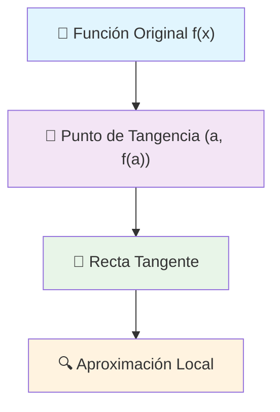
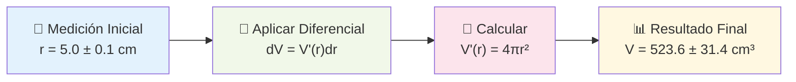

# Aproximaciones Lineales y Diferenciales 📏

> [!tip] 🎯 Concepto Central Las aproximaciones lineales nos permiten **estimar valores** de funciones complicadas usando la **recta tangente** como aproximación local. Es como usar una "lupa matemática" para ver de cerca el comportamiento de una función.

## Diferencial de una Función 🔄

> [!info] 📐 Definición del Diferencial Para una función $f(x)$ derivable en $x = a$, el **diferencial** se define como:
> 
> $$dy = f'(x)dx$$
> 
> Donde:
> 
> - $dy$ = cambio aproximado en $y$
> - $f'(x)$ = derivada de la función
> - $dx$ = cambio pequeño en $x$

> [!example] 🌟 Ejemplo Práctico Para $f(x) = x^2$ en $x = 3$:
> 
> - $f'(x) = 2x$, entonces $f'(3) = 6$
> - El diferencial: $dy = 6dx$
> - Si $dx = 0.1$, entonces $dy = 0.6$
> 
> **Verificación:**
> 
> - Valor real: $f(3.1) = 9.61$, $f(3) = 9$ → $\Delta y = 0.61$
> - Aproximación: $dy = 0.6$ ✨ ¡Muy cercano!

## Aproximaciones Locales 🔍

> [!tip] 🎯 Fórmula de Aproximación Lineal Para aproximar $f(a + h)$ donde $h$ es pequeño:
> 
> $$f(a + h) \approx f(a) + f'(a) \cdot h$$
> 
> Esta es la **ecuación de la recta tangente** en el punto $(a, f(a))$.

> [!warning] ⚠️ Limitaciones de la Aproximación
> 
> - Solo es **precisa para valores cercanos** al punto de tangencia
> - El error aumenta conforme nos alejamos del punto $a$
> - Para funciones muy curvadas, la aproximación puede ser pobre

## Propagación de Errores 📊

> [!info] 🔬 Análisis de Errores Cuando medimos magnitudes físicas, siempre hay **incertidumbre**. Si $x$ tiene un error $\Delta x$, entonces el error en $f(x)$ es aproximadamente:
> 
> $$\Delta f \approx |f'(x)| \cdot \Delta x$$

### Tabla de Propagación de Errores Comunes

> [!note] 📋 Fórmulas de Propagación
> 
> |Función|$f(x)$|Error Propagado $\Delta f$|
> |---|---|---|
> |Potencia|$x^n$|$\|n x^{n-1}\| \Delta x$|
> |Exponencial|$e^x$|$e^x \Delta x$|
> |Logaritmo|$\ln x$|$\frac{\Delta x}{\|x\|}$|
> |Seno|$\sin x$|$\|\cos x\| \Delta x$|
> |Coseno|$\cos x$|$\|\sin x\| \Delta x$|

## Aplicaciones en Mediciones 🔬

> [!example] 🧪 Ejemplo: Volumen de una Esfera Una esfera tiene radio $r = 5.0 \pm 0.1$ cm. ¿Cuál es el error en el volumen?
> 
> **Solución:**
> 
> - $V(r) = \frac{4}{3}\pi r^3$
> - $V'(r) = 4\pi r^2$
> - $\Delta V \approx V'(5) \cdot \Delta r = 4\pi(25)(0.1) = 10\pi \approx 31.4 \text{ cm}^3$
> 
> Por tanto: $V = 523.6 \pm 31.4 \text{ cm}^3$ 📐

> [!tip] 🎓 Técnica de Estudio: Mnemotecnia "DALE" Para recordar el proceso de aproximaciones lineales:
> 
> - **D**iferencial: $dy = f'(x)dx$
> - **A**proximación: $f(a+h) \approx f(a) + f'(a)h$
> - **L**ineal: Usamos la recta tangente
> - **E**rror: $\Delta f \approx |f'(x)|\Delta x$

## Referencias 📚

> [!quote] 🔗 Notas Relacionadas
> 
> - [[Derivadas y sus Aplicaciones]] - Fundamentos necesarios
> - [[Recta Tangente]] - Base geométrica de las aproximaciones
> - [[Análisis de Errores Experimentales]] - Aplicaciones prácticas
> - [[Funciones y Continuidad]] - Conceptos previos importantes

## Notas Recomendadas 💡

> [!note] 📖 Para Profundizar
> 
> - [[Diferencial Total]] - Extensión a funciones de varias variables
> - [[Series de Taylor]] - Aproximaciones de orden superior
> - [[Métodos Numéricos]] - Implementación computacional
> - [[Física Experimental]] - Aplicaciones en laboratorio
> - [[Estadística de Errores]] - Análisis más avanzado de incertidumbre

---

**Tags:** #calculo #aproximaciones #diferenciales #errores #mediciones #derivadas #matematicas #fisica-experimental #analisis-numerico