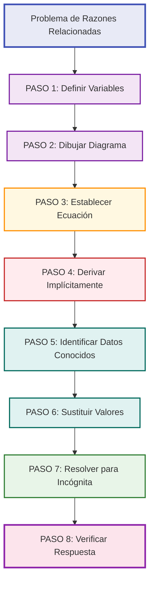
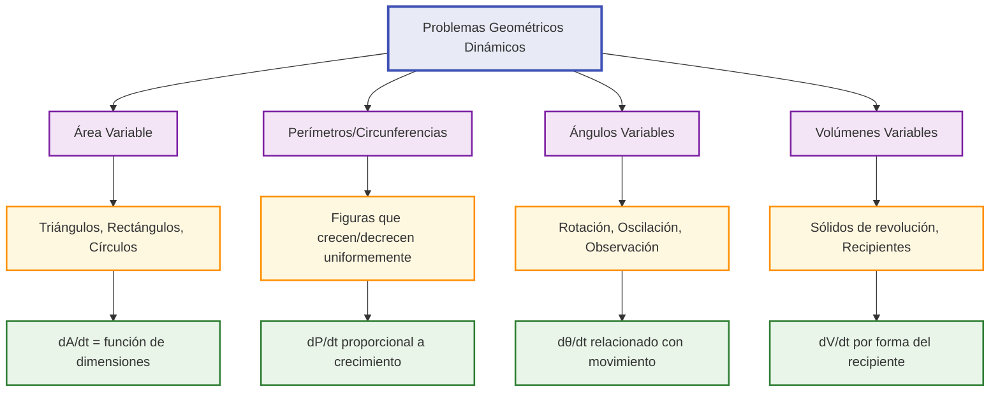

# Razones de Cambio Relacionadas 🔗

## Metodología Paso a Paso 📋

> [!info] Concepto Fundamental Las **razones de cambio relacionadas** estudian cómo la velocidad de cambio de una variable se relaciona con la velocidad de cambio de otra variable a través de una ecuación que las vincula.

### Definición Matemática

> [!warning] Fundamento Teórico Si dos variables x e y están relacionadas por una ecuación f(x,y) = 0, y ambas cambian con respecto al tiempo t, entonces:
> 
> **Regla de la Cadena:** d/dt[f(x,y)] = (∂f/∂x)(dx/dt) + (∂f/∂y)(dy/dt) = 0

### Metodología Universal "DERIVA"

> [!tip] Proceso Sistemático DERIVA **D**efinir todas las variables y sus unidades **E**stablecer la ecuación que relaciona las variables **R**elacionar mediante derivación implícita respecto al tiempo **I**dentificar los datos conocidos y lo que se busca **V**alores: sustituir los datos en el momento específico **A**nálisis: resolver para la incógnita y verificar unidades



### Tipos de Variables Comunes

> [!example] Clasificación de Variables **Variables Espaciales:**
> 
> - x, y, z: posiciones
> - r: radio, h: altura
> - A: área, V: volumen
> - θ: ángulo, s: longitud de arco
> 
> **Variables de Cambio (derivadas):**
> 
> - dx/dt, dy/dt: velocidades lineales
> - dA/dt: razón de cambio de área
> - dV/dt: razón de cambio de volumen
> - dθ/dt: velocidad angular

### Ejemplo Guía Completo

> [!example] Problema: Escalera Deslizante **Enunciado:** Una escalera de 10 m se apoya contra una pared vertical. Si la base se aleja de la pared a 2 m/s, ¿a qué velocidad baja la parte superior cuando la base está a 6 m de la pared?
> 
> **Solución paso a paso:**
> 
> **1. Variables:**
> 
> - x = distancia de la base a la pared
> - y = altura de la parte superior
> - L = 10 m (longitud constante)
> 
> **2. Diagrama:** Triángulo rectángulo con hipotenusa L
> 
> **3. Ecuación:** x² + y² = L² = 100
> 
> **4. Derivación implícita:**
> 
> ```
> d/dt(x² + y²) = d/dt(100)
> 2x(dx/dt) + 2y(dy/dt) = 0
> x(dx/dt) + y(dy/dt) = 0
> ```
> 
> **5. Datos conocidos:**
> 
> - dx/dt = 2 m/s (base se aleja)
> - En t específico: x = 6 m
> - y = √(100 - 36) = 8 m
> - Buscar: dy/dt
> 
> **6. Sustitución:**
> 
> ```
> 6(2) + 8(dy/dt) = 0
> 12 + 8(dy/dt) = 0
> dy/dt = -12/8 = -1.5 m/s
> ```
> 
> **7. Respuesta:** La parte superior baja a 1.5 m/s (signo negativo indica descenso)

### Errores Comunes y Prevención

> [!warning] Trampas Frecuentes **❌ Error 1:** Sustituir valores numéricos ANTES de derivar **✅ Correcto:** Derivar la ecuación general primero
> 
> **❌ Error 2:** Confundir signos (dirección del movimiento) **✅ Correcto:** Establecer convención clara desde el inicio
> 
> **❌ Error 3:** Usar valores de variables en momento incorrecto **✅ Correcto:** Usar valores en el instante específico del problema

## Problemas de Velocidad 🏃‍♂️

> [!info] Características Involucran objetos en movimiento donde necesitamos encontrar velocidades o aceleraciones relacionadas a través de restricciones geométricas o físicas.

### Problemas de Persecución

> [!example] Problema: Persecución en Línea Recta **Enunciado:** Dos autos se acercan a una intersección. El auto A va hacia el este a 60 km/h y está a 200 m de la intersección. El auto B va hacia el norte a 80 km/h y está a 150 m de la intersección. ¿A qué velocidad se acercan?
> 
> **Solución:**
> 
> - Variables: xₐ = distancia de A a intersección, xᵦ = distancia de B a intersección
> - Distancia entre autos: d = √(xₐ² + xᵦ²)
> - Datos: dxₐ/dt = -60 km/h, dxᵦ/dt = -80 km/h (negativos porque se acercan)
> - En el momento dado: xₐ = 200 m = 0.2 km, xᵦ = 150 m = 0.15 km
> 
> **Derivación:**
> 
> ```
> d² = xₐ² + xᵦ²
> 2d(dd/dt) = 2xₐ(dxₐ/dt) + 2xᵦ(dxᵦ/dt)
> dd/dt = [xₐ(dxₐ/dt) + xᵦ(dxᵦ/dt)]/d
> ```
> 
> **Cálculo:**
> 
> - d = √(0.2² + 0.15²) = 0.25 km
> - dd/dt = [0.2(-60) + 0.15(-80)]/0.25 = [-12 - 12]/0.25 = -96 km/h
> 
> **Respuesta:** Los autos se acercan a 96 km/h

### Problemas de Sombras

> [!example] Problema: Sombra de Persona Caminando **Enunciado:** Una persona de 1.8 m camina a 1.5 m/s alejándose de un poste de luz de 6 m. ¿A qué velocidad crece la punta de su sombra?
> 
> **Solución:**
> 
> - Variables: x = distancia de persona a poste, s = longitud de sombra
> - Por triángulos semejantes: 6/(x+s) = 1.8/s
> - Simplificando: 6s = 1.8(x+s) → 6s = 1.8x + 1.8s → 4.2s = 1.8x → s = (1.8/4.2)x = (3/7)x
> 
> **Derivación:**
> 
> ```
> ds/dt = (3/7)(dx/dt) = (3/7)(1.5) = 0.64 m/s
> ```
> 
> **Para la punta de la sombra:** velocidad = dx/dt + ds/dt = 1.5 + 0.64 = 2.14 m/s

### Problemas de Fluidos

> [!tip] Características de Problemas de Fluidos
> 
> - **Conservación de volumen:** lo que entra = lo que sale
> - **Relaciones geométricas:** forma del recipiente
> - **Velocidades de flujo:** dV/dt constante o variable

> [!example] Problema: Tanque Cónico **Enunciado:** Un tanque cónico invertido (vértice hacia abajo) tiene radio superior 3 m y altura 6 m. Se llena con agua a 2 m³/min. ¿A qué velocidad sube el nivel cuando el agua tiene 4 m de profundidad?
> 
> **Solución:**
> 
> - Variables: h = altura del agua, r = radio de superficie
> - Por triángulos semejantes: r/h = 3/6 = 1/2 → r = h/2
> - Volumen del cono: V = (1/3)πr²h = (1/3)π(h/2)²h = πh³/12
> 
> **Derivación:**
> 
> ```
> dV/dt = (π/12)(3h²)(dh/dt) = (πh²/4)(dh/dt)
> ```
> 
> **Sustitución:** 2 = (π·16/4)(dh/dt) = 4π(dh/dt) **Respuesta:** dh/dt = 2/(4π) = 1/(2π) ≈ 0.159 m/min

## Problemas Geométricos Dinámicos 📐

> [!info] Naturaleza de los Problemas Involucran figuras geométricas que cambian de forma o tamaño con el tiempo, manteniendo ciertas relaciones o propiedades.

### Problemas de Área Variable

> [!example] Problema: Área de Triángulo Variable **Enunciado:** Los lados de un triángulo equilátero aumentan a razón de 3 cm/min. ¿A qué velocidad aumenta el área cuando el lado mide 10 cm?
> 
> **Solución:**
> 
> - Variable: s = lado del triángulo
> - Área: A = (√3/4)s² (fórmula para triángulo equilátero)
> - Dato: ds/dt = 3 cm/min
> 
> **Derivación:**
> 
> ```
> dA/dt = (√3/4)(2s)(ds/dt) = (√3s/2)(ds/dt)
> ```
> 
> **En s = 10 cm:**
> 
> ```
> dA/dt = (√3·10/2)(3) = 15√3 ≈ 25.98 cm²/min
> ```

### Problemas de Perímetro y Circunferencia

> [!example] Problema: Globo Esférico **Enunciado:** Un globo esférico se infla y su radio aumenta a 5 cm/min. ¿A qué velocidad aumenta la superficie cuando el radio es 20 cm?
> 
> **Solución:**
> 
> - Variables: r = radio, S = superficie
> - Superficie esfera: S = 4πr²
> - Dato: dr/dt = 5 cm/min
> 
> **Derivación:**
> 
> ```
> dS/dt = 4π(2r)(dr/dt) = 8πr(dr/dt)
> ```
> 
> **En r = 20 cm:**
> 
> ```
> dS/dt = 8π(20)(5) = 800π ≈ 2513.3 cm²/min
> ```

### Problemas de Ángulos Variables



> [!example] Problema: Observador y Avión **Enunciado:** Un avión vuela horizontalmente a 150 m/s y a 1000 m de altura. Un observador en tierra lo sigue con binoculares. ¿A qué velocidad angular giran los binoculares cuando el avión está a 1200 m horizontalmente del observador?
> 
> **Solución:**
> 
> - Variables: x = distancia horizontal, θ = ángulo de elevación
> - Relación: tan(θ) = 1000/x
> - Dato: dx/dt = 150 m/s
> 
> **Derivación:**
> 
> ```
> sec²(θ)(dθ/dt) = -1000/x²(dx/dt)
> dθ/dt = -1000(dx/dt)/(x² sec²(θ))
> ```
> 
> **En x = 1200:** sec²(θ) = 1 + tan²(θ) = 1 + (1000/1200)² = 1 + 25/36 = 61/36
> 
> ```
> dθ/dt = -1000(150)/(1200² × 61/36) = -150000 × 36/(1440000 × 61) ≈ -0.061 rad/s
> ```

## Aplicaciones en Física e Ingeniería ⚙️

> [!info] Contexto Profesional Las razones de cambio relacionadas son fundamentales en **modelado dinámico**, **control de procesos** y **análisis de sistemas** en ingeniería y física.

### Aplicaciones en Termodinámica

> [!example] Problema: Ley de Boyle-Mariotte **Enunciado:** Para un gas ideal a temperatura constante: PV = k (constante). Si la presión disminuye a 50 Pa/s cuando V = 20 m³ y P = 100 Pa, ¿a qué velocidad cambia el volumen?
> 
> **Solución:**
> 
> - Ecuación: PV = k = 100 × 20 = 2000
> - Derivación: P(dV/dt) + V(dP/dt) = 0
> - Datos: dP/dt = -50 Pa/s, P = 100 Pa, V = 20 m³
> - Cálculo: 100(dV/dt) + 20(-50) = 0 → dV/dt = 1000/100 = 10 m³/s

### Aplicaciones en Mecánica de Fluidos

> [!warning] Ecuación de Continuidad **Principio:** A₁v₁ = A₂v₂ (conservación de masa)
> 
> **Aplicación:** En tuberías de sección variable, si conocemos cómo cambia el área y la velocidad en un punto, podemos encontrar la velocidad en otro punto.

> [!example] Problema: Flujo en Tubería Cónica **Enunciado:** Agua fluye por una tubería que se estrecha linealmente. En el extremo ancho (r₁ = 5 cm) la velocidad es 2 m/s y aumenta a 0.1 m/s². En el extremo angosto (r₂ = 2 cm), ¿cuál es la aceleración del agua?
> 
> **Solución:**
> 
> - Ecuación de continuidad: A₁v₁ = A₂v₂ → π(0.05)²v₁ = π(0.02)²v₂
> - Relación de velocidades: v₂ = (0.05/0.02)²v₁ = 6.25v₁
> - En t dado: v₂ = 6.25(2) = 12.5 m/s
> - Derivando: dv₂/dt = 6.25(dv₁/dt) = 6.25(0.1) = 0.625 m/s²

### Aplicaciones en Electricidad

> [!example] Problema: Circuito RC **Enunciado:** En un circuito RC, la carga Q satisface: Q/C + R(dQ/dt) = V₀. Si C = 0.01 F, R = 100 Ω, V₀ = 12 V y en t = 0 la corriente es 0.1 A, ¿a qué velocidad cambia la corriente inicialmente?
> 
> **Solución:**
> 
> - Corriente: I = dQ/dt
> - Ecuación: Q/0.01 + 100I = 12 → 100Q + I = 0.12
> - Derivando: 100(dQ/dt) + dI/dt = 0 → 100I + dI/dt = 0
> - En t = 0: 100(0.1) + dI/dt = 0 → dI/dt = -10 A/s

### Aplicaciones en Óptica

> [!tip] Ley de Snell Dinámica **Refracción:** n₁sen(θ₁) = n₂sen(θ₂)
> 
> **Si el ángulo de incidencia cambia:** n₁cos(θ₁)(dθ₁/dt) = n₂cos(θ₂)(dθ₂/dt)

> [!example] Problema: Prisma Rotatorio **Enunciado:** Un rayo de luz incide en un prisma de índice n = 1.5. Si el prisma rota de modo que el ángulo de incidencia aumenta a 0.02 rad/s cuando θ₁ = 30°, ¿a qué velocidad cambia el ángulo de refracción?
> 
> **Solución:**
> 
> - Ley de Snell: 1×sen(30°) = 1.5×sen(θ₂) → sen(θ₂) = 1/3
> - θ₂ = arcsen(1/3) ≈ 19.47°
> - Derivando: cos(30°)(0.02) = 1.5cos(θ₂)(dθ₂/dt)
> - cos(θ₂) = √(1 - sen²(θ₂)) = √(1 - 1/9) = 2√2/3
> - (√3/2)(0.02) = 1.5(2√2/3)(dθ₂/dt)
> - dθ₂/dt = (√3/2)(0.02)/(√2) = 0.01√(3/2) ≈ 0.0122 rad/s

### Aplicaciones en Mecánica

> [!example] Problema: Péndulo Simple **Enunciado:** Un péndulo de longitud L = 2 m oscila. Cuando θ = 0.5 rad y dθ/dt = -0.3 rad/s, ¿cuál es la velocidad del extremo del péndulo?
> 
> **Solución:**
> 
> - Posición del extremo: x = L sen(θ), y = L cos(θ)
> - Velocidades: dx/dt = L cos(θ)(dθ/dt), dy/dt = -L sen(θ)(dθ/dt)
> - En el instante dado:
> - dx/dt = 2 cos(0.5)(-0.3) = -2(0.878)(0.3) ≈ -0.527 m/s
> - dy/dt = -2 sen(0.5)(-0.3) = 2(0.479)(0.3) ≈ 0.287 m/s
> - Velocidad total: v = √[(dx/dt)² + (dy/dt)²] = √[0.527² + 0.287²] ≈ 0.6 m/s

## Técnicas de Estudio Efectivas 🧠

> [!tip] Mnemotecnia: "RELACIONA" **R**ecurre al diagrama siempre **E**cuación que vincule las variables **L**a derivada implícita aplicar **A**ntes de sustituir, derivar **C**uidado con los signos de dirección **I**dentifica lo conocido y lo buscado **O**rganiza los datos por momento **N**o sustituyas números al principio **A**naliza si la respuesta tiene sentido

> [!tip] Estrategia de Resolución "RAPID" **R**ead - Leer cuidadosamente e identificar qué cambia **A**ssign - Asignar variables a todas las cantidades **P**icture - Dibujar diagrama con variables etiquetadas **I**mplicit - Derivar implícitamente la ecuación de relación **D**etermine - Determinar la respuesta sustituyendo valores

### Plantilla de Análisis

> [!example] Formato Estándar **🎯 OBJETIVO:** ¿Qué razón de cambio busco?
> 
> **📋 VARIABLES:**
> 
> - Variable 1: _____ (unidades: _____)
> - Variable 2: _____ (unidades: _____)
> - Razón conocida: d___/dt = _____
> - Razón buscada: d___/dt = ?
> 
> **📐 DIAGRAMA:** [Esquema con variables etiquetadas]
> 
> **⚖️ ECUACIÓN RELACIONANTE:** _____
> 
> **🔄 DERIVACIÓN IMPLÍCITA:** d/dt[ecuación] = _____
> 
> **📊 DATOS EN EL INSTANTE:**
> 
> - Valor de variables: _____
> - Razones conocidas: _____
> 
> **✅ VERIFICACIÓN:**
> 
> - Unidades correctas: _____
> - Signo lógico: _____
> - Orden de magnitud razonable: _____

### Trucos de Memorización

> [!warning] Patrones Comunes de Derivación **Teorema de Pitágoras:** x² + y² = c² → x(dx/dt) + y(dy/dt) = 0
> 
> **Área del triángulo:** A = (1/2)bh → dA/dt = (1/2)[b(dh/dt) + h(db/dt)]
> 
> **Volumen del cilindro:** V = πr²h → dV/dt = π[2rh(dr/dt) + r²(dh/dt)]
> 
> **Ley de cosenos:** c² = a² + b² - 2ab cos(C) → 2c(dc/dt) = 2a(da/dt) + 2b(db/dt) - 2[ab(-sen(C))(dC/dt) + cos(C)[a(db/dt) + b(da/dt)]]

### Verificación de Respuestas

> [!tip] Checklist de Verificación **□ Análisis Dimensional:** ¿Las unidades son correctas? **□ Análisis de Signos:** ¿El signo indica la dirección correcta? **□ Casos Límite:** ¿Qué pasa cuando una variable es 0 o muy grande? **□ Simetría:** ¿El problema tiene simetrías que debo considerar? **□ Sentido Físico:** ¿La respuesta es físicamente razonable?

## Referencias 🔗

> [!quote] [[Aplicaciones de Derivadas]] Marco general de aplicaciones del cálculo diferencial

> [!quote] [[Regla de la cadena]] Fundamento matemático de la derivación implícita

> [!quote] [[Derivación Implícita]] Técnicas para derivar ecuaciones no despejadas

> [!quote] [[Problemas de Optimización]] Otros tipos de problemas aplicados de cálculo

> [!quote] [[Modelado Matemático]] Principios para traducir problemas reales a matemáticas

## Notas Recomendadas para Complementar 📖

- [[Cinemática]] - Fundamentos físicos de velocidad y aceleración
- [[Geometría Analítica]] - Relaciones geométricas fundamentales
- [[Trigonometría]] - Para problemas con ángulos y rotación
- [[Física General]] - Contexto físico de las aplicaciones
- [[Ecuaciones Diferenciales]] - Modelado dinámico avanzado
- [[Cálculo Vectorial]] - Extensión a movimiento en múltiples dimensiones
- [[Mecánica de Fluidos]] - Aplicaciones específicas en flujos
- [[Termodinámica]] - Relaciones entre variables de estado

---

**Tags:** #calculo #razones-cambio #derivacion-implicita #aplicaciones #velocidad #fisica #ingenieria #geometria-dinamica #modelado #problemas-aplicados