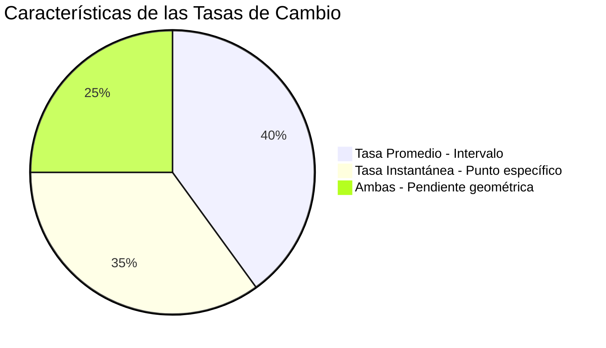

# 📊 Tasas de Cambio

## 🎯 Tasa de Cambio Promedio vs Instantánea

> [!info] 💡 Definición Fundamental Las **tasas de cambio** miden qué tan rápido cambia una cantidad con respecto a otra. Representan la **pendiente** de una función y son la base conceptual de la **derivada**.
> 
> **Dos tipos principales:**
> 
> - **Tasa de Cambio Promedio:** Entre dos puntos específicos
> - **Tasa de Cambio Instantánea:** En un punto específico (derivada)

### 📈 Tasa de Cambio Promedio

> [!success] ✅ Fórmula de Tasa de Cambio Promedio Para una función $f(x)$ en el intervalo $[a, b]$: $$\text{Tasa de Cambio Promedio} = \frac{f(b) - f(a)}{b - a} = \frac{\Delta y}{\Delta x}$$
> 
> **Interpretación geométrica:** Es la **pendiente de la recta secante** que une los puntos $(a, f(a))$ y $(b, f(b))$

```mermaid
graph TD
    A[Tasa de Cambio] --> B[Promedio]
    A --> C[Instantánea]
    B --> D[Recta Secante]
    B --> E[Intervalo [a,b]]
    C --> F[Recta Tangente]
    C --> G[Punto específico]
    D --> H[Pendiente = Δy/Δx]
    F --> I[Pendiente = f'(a)]
    
    style A fill:#e1f5fe
    style B fill:#e8f5e8
    style C fill:#fff3e0
    style H fill:#f3e5f5
    style I fill:#f3e5f5
```

### 🔢 Ejemplos de Tasa de Cambio Promedio

> [!example] 📝 Ejemplo 1: Función Cuadrática **Función:** $f(x) = x^2 + 2x - 1$ **Intervalo:** $[1, 4]$
> 
> **Cálculo:**
> 
> - $f(1) = 1 + 2 - 1 = 2$
> - $f(4) = 16 + 8 - 1 = 23$
> - $\text{Tasa} = \frac{23 - 2}{4 - 1} = \frac{21}{3} = 7$
> 
> **Interpretación:** La función crece en promedio 7 unidades por cada unidad de $x$

> [!example] 🚗 Ejemplo 2: Aplicación Física (Velocidad) **Posición:** $s(t) = -16t^2 + 64t + 80$ (altura en pies) **Intervalo de tiempo:** $[1, 3]$ segundos
> 
> **Cálculo:**
> 
> - $s(1) = -16 + 64 + 80 = 128$ pies
> - $s(3) = -144 + 192 + 80 = 128$ pies
> - $\text{Velocidad promedio} = \frac{128 - 128}{3 - 1} = 0$ pies/seg
> 
> **Interpretación:** El objeto regresa a la misma altura, velocidad promedio = 0

|Tipo de Aplicación|Variable Independiente|Variable Dependiente|Tasa de Cambio|
|---|---|---|---|
|Velocidad|Tiempo (t)|Posición (s)|Velocidad (m/s)|
|Densidad poblacional|Área (A)|Población (P)|Personas/km²|
|Costo marginal|Cantidad (q)|Costo (C)|$/unidad|
|Temperatura|Tiempo (t)|Temperatura (T)|°C/hora|

### ⚡ Tasa de Cambio Instantánea

> [!tip] 🎯 Concepto de Instantaneidad La **tasa de cambio instantánea** es el límite de las tasas de cambio promedio cuando el intervalo se hace infinitesimalmente pequeño:
> 
> $$f'(a) = \lim_{h \to 0} \frac{f(a+h) - f(a)}{h}$$
> 
> **Esto es exactamente la definición de la derivada!**

> [!success] 📐 Interpretación Geométrica La tasa de cambio instantánea en $x = a$ es:
> 
> - La **pendiente de la recta tangente** a la curva en el punto $(a, f(a))$
> - El **límite de las pendientes de las rectas secantes**
> - La **derivada** $f'(a)$ evaluada en el punto

```mermaid
flowchart LR
    A[Recta Secante] --> B[h → 0]
    B --> C[Recta Tangente]
    A --> D[Tasa Promedio]
    C --> E[Tasa Instantánea]
    D --> F[Δy/Δx]
    E --> G[f'(a)]
    
    style A fill:#ffebee
    style C fill:#e8f5e8
    style E fill:#f3e5f5
    style G fill:#e3f2fd
```

### 🧮 Cálculo de Tasas Instantáneas

> [!example] 🔍 Ejemplo: Usando la Definición de Derivada **Función:** $f(x) = x^2 + 3x$ **Encontrar:** Tasa de cambio instantánea en $x = 2$
> 
> **Método 1 - Definición de límite:** $$f'(2) = \lim_{h \to 0} \frac{f(2+h) - f(2)}{h}$$
> 
> **Paso a paso:**
> 
> 1. $f(2) = 4 + 6 = 10$
> 2. $f(2+h) = (2+h)^2 + 3(2+h) = 4 + 4h + h^2 + 6 + 3h = 10 + 7h + h^2$
> 3. $\frac{f(2+h) - f(2)}{h} = \frac{(10 + 7h + h^2) - 10}{h} = \frac{7h + h^2}{h} = 7 + h$
> 4. $\lim_{h \to 0} (7 + h) = 7$
> 
> **Resultado:** $f'(2) = 7$

> [!example] ⚡ Método 2 - Reglas de Derivación Para $f(x) = x^2 + 3x$:
> 
> - $f'(x) = 2x + 3$
> - $f'(2) = 2(2) + 3 = 7$ ✅
> 
> **¡Mismo resultado, más eficiente!**

### 🌍 Aplicaciones Prácticas

> [!success] 🚀 Física - Velocidad y Aceleración **Posición:** $s(t) = t^3 - 6t^2 + 9t + 5$
> 
> **Velocidad instantánea:** $v(t) = s'(t) = 3t^2 - 12t + 9$ **Aceleración:** $a(t) = v'(t) = 6t - 12$
> 
> **En t = 2:**
> 
> - Velocidad: $v(2) = 12 - 24 + 9 = -3$ m/s
> - Aceleración: $a(2) = 12 - 12 = 0$ m/s²

> [!success] 💰 Economía - Costo Marginal **Función de costo:** $C(q) = 100 + 50q + 0.1q^2$
> 
> **Costo marginal:** $C'(q) = 50 + 0.2q$
> 
> **Interpretación:**
> 
> - En $q = 100$ unidades: $C'(100) = 50 + 20 = 70$ $/unidad
> - Producir la unidad 101 cuesta aproximadamente $70 adicionales

|Área|Función Original|Derivada (Tasa)|Interpretación|
|---|---|---|---|
|Física|Posición s(t)|Velocidad v(t) = s'(t)|Rapidez de cambio de posición|
|Física|Velocidad v(t)|Aceleración a(t) = v'(t)|Rapidez de cambio de velocidad|
|Economía|Costo C(q)|Costo Marginal C'(q)|Costo de una unidad adicional|
|Biología|Población P(t)|Tasa de crecimiento P'(t)|Individuos por unidad de tiempo|

### 📊 Comparación Visual: Promedio vs Instantánea



> [!warning] ⚠️ Diferencias Clave **Tasa de Cambio Promedio:**
> 
> - Requiere **dos puntos** o un **intervalo**
> - Proporciona información **general** sobre el comportamiento
> - **Fácil de calcular** con aritmética básica
> 
> **Tasa de Cambio Instantánea:**
> 
> - Se calcula en **un punto específico**
> - Proporciona información **precisa** en ese momento
> - Requiere **cálculo diferencial** (límites/derivadas)

## 🧠 Técnica de Estudio: Mnemotecnia "PATI"

> [!tip] 🎓 Método "PATI" para Tasas de Cambio
> 
> **P** - **P**romedio o Puntual (instantánea) **A** - **A**plicar fórmula correspondiente  
> **T** - **T**iempo/variable de referencia **I** - **I**nterpretar el resultado
> 
> **Frase nemotécnica:** _"Para Aplicaciones, Tiempo e Interpretación"_
> 
> **Proceso:**
> 
> 1. 🤔 Identificar si es promedio (intervalo) o instantánea (punto)
> 2. 📐 Aplicar $\frac{\Delta y}{\Delta x}$ o $f'(x)$
> 3. ⏰ Considerar las unidades y contexto
> 4. 💡 Interpretar el resultado en el contexto del problema

## 📊 Algoritmo de Decisión

```mermaid
flowchart TD
    A[Problema de Tasa de Cambio] --> B{Intervalo o Punto?}
    B -->|Intervalo [a,b]| C[Tasa Promedio]
    B -->|Punto específico x=a| D[Tasa Instantánea]
    C --> E[Usar Δy/Δx]
    D --> F{Conoces f'(x)?}
    F -->|Sí| G[Evaluar f'(a)]
    F -->|No| H[Definición de límite]
    E --> I[Calcular f(b)-f(a)/b-a]
    G --> J[Resultado e interpretación]
    H --> K[Límite h→0]
    I --> J
    K --> J
    
    style A fill:#e3f2fd
    style C fill:#e8f5e8  
    style D fill:#fff3e0
    style J fill:#f3e5f5
```

## 🔗 Conexiones Conceptuales

> [!quote] 📚 Relación con Otros Temas Las tasas de cambio son el **puente** entre:
> 
> **Fundamentos previos:**
> 
> - [[Límites por Sustitución Directa]] - Base para calcular derivadas
> - [[Función Lineal]] - Pendiente constante vs variable
> - [[Geometría Analítica]] - Pendientes de rectas
> 
> **Aplicaciones futuras:**
> 
> - [[Derivadas]] - Formalización matemática
> - [[Aplicaciones de la Derivada]] - Optimización y análisis
> - [[Integrales]] - Proceso inverso (acumulación)

## 📖 Notas Recomendadas para Estudio Complementario

> [!info] 📝 Ruta de Aprendizaje Sugerida
> 
> **Prerrequisitos:**
> 
> 1. **[[Funciones y sus Gráficas]]** - Visualización
> 2. **[[Límites por Sustitución Directa]]** - Técnicas de cálculo
> 
> **Temas Paralelos:** 3. **[[Rectas Secantes y Tangentes]]** - Interpretación geométrica 4. **[[Aplicaciones de Funciones]]** - Modelado matemático
> 
> **Siguientes Pasos:** 5. **[[Definición de Derivada]]** - Formalización 6. **[[Reglas de Derivación]]** - Herramientas de cálculo

## 🎯 Ejercicios de Práctica Progresiva

> [!example] 💪 Secuencia de Entrenamiento
> 
> **Nivel 1 - Tasas Promedio Básicas:** 🟢
> 
> - $f(x) = x^2$, intervalo $[1, 3]$
> - $g(x) = 2x + 1$, intervalo $[0, 5]$
> 
> **Nivel 2 - Aplicaciones Físicas:** 🟡
> 
> - Posición: $s(t) = 16t^2$, velocidad promedio en $[2, 4]$
> - Temperatura: $T(h) = 20 + 5h - h^2$, cambio en $[1, 6]$ horas
> 
> **Nivel 3 - Tasas Instantáneas:** 🟠
> 
> - $f(x) = x^3 - 2x$, tasa instantánea en $x = 1$
> - $h(t) = \sqrt{t + 1}$, usando definición de límite en $t = 3$
> 
> **Nivel 4 - Problemas Mixtos:** 🔴
> 
> - Comparar tasa promedio vs instantánea en el mismo punto
> - Problemas de optimización básicos usando tasas de cambio

## 🎨 Casos Especiales y Curiosidades

> [!info] 🌟 Situaciones Interesantes
> 
> **Tasa de cambio cero:**
> 
> - Función constante: $f'(x) = 0$ siempre
> - Máximos y mínimos locales: $f'(a) = 0$
> 
> **Tasas de cambio negativas:**
> 
> - Función decreciente
> - Desaceleración en física
> - Reducción de costos en economía
> 
> **Interpretación de unidades:**
> 
> - Velocidad: metros/segundo
> - Aceleración: metros/segundo²
> - Costo marginal: $/unidad

---

**Tags:** #matemáticas #cálculo #tasas-cambio #derivadas #límites #aplicaciones #física #economía #velocidad #pendiente #secante #tangente #instantánea #promedio #university #calculus-applications