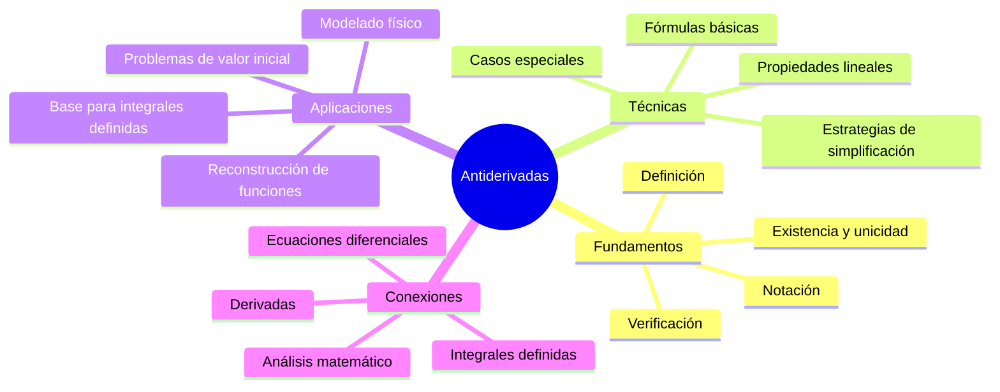
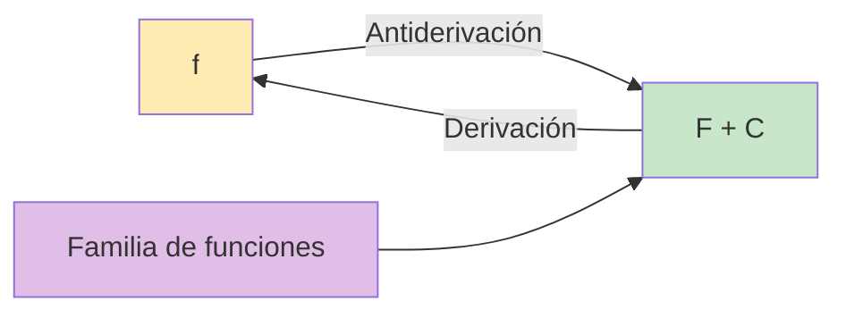
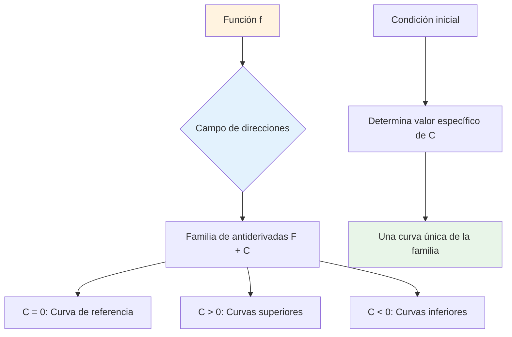

# 🔄 Antiderivadas (Primitivas)

## 📖 Introducción

> [!info] 💡 Concepto Fundamental Una **antiderivada** (o primitiva) de una función $f(x)$ es cualquier función $F(x)$ tal que $F'(x) = f(x)$. Es el proceso inverso de la derivación y constituye la base fundamental de la **integración indefinida**.

> [!tip] 🎯 ¿Por qué son importantes?
> 
> - Son la **base conceptual** de las integrales indefinidas
> - Resuelven problemas de **acumulación** y **reconstrucción de funciones**
> - Permiten **recuperar funciones originales** a partir de sus tasas de cambio
> - Son esenciales para resolver **ecuaciones diferenciales**
> - Modelan fenómenos físicos como **velocidad-posición**, **aceleración-velocidad**, **flujo-cantidad**
> - Permiten calcular **áreas bajo curvas** mediante integrales definidas

## 🔗 Conexiones con Otros Temas

> [!info] 🌐 Temas Relacionados y Conexiones
> 
> **Fundamentos Previos**: • **Límites** - Base conceptual para definir derivadas • **Derivadas** - Proceso inverso de las antiderivadas • **Reglas de derivación** - Esenciales para verificar antiderivadas • **Continuidad** - Condición para la existencia de antiderivadas
> 
> **Desarrollos Posteriores**: • **Integrales definidas** - Aplicación del Teorema Fundamental del Cálculo • **Métodos de integración** - Técnicas avanzadas (sustitución, por partes, etc.) • **Aplicaciones de la integral** - Áreas, volúmenes, trabajo, etc. • **Ecuaciones diferenciales** - Uso directo de antiderivadas • **Series de potencias** - Integración término a término

---

## 🔤 Definiciones y Notación

> [!note] 📝 Definición formal Si $F'(x) = f(x)$ para todo $x$ en un intervalo $I$, entonces:
> 
> - $F(x)$ es una **antiderivada** (o primitiva) de $f(x)$ en $I$
> - La **integral indefinida** se denota: $\int f(x) , dx = F(x) + C$
> - $C$ es la **constante de integración**
> - El conjunto de todas las antiderivadas forma una **familia de funciones**

> [!warning] ⚠️ Elementos clave de la notación
> 
> - **$f(x)$**: Función integrando (función de la que buscamos la antiderivada)
> - **$F(x)$**: Una antiderivada específica o primitiva
> - **$C$**: Constante de integración (¡nunca olvidarla en integrales indefinidas!)
> - **$dx$**: Diferencial de $x$ (indica la variable de integración)
> - **$\int$**: Símbolo de integral (del latín "summa")

> [!example] 🧪 Ejemplo de familia de antiderivadas Si $f(x) = 2x$, entonces:
> 
> - $F_1(x) = x^2$ es una antiderivada
> - $F_2(x) = x^2 + 5$ es otra antiderivada
> - $F_3(x) = x^2 - 3$ es otra antiderivada
> - En general: $F(x) = x^2 + C$ representa toda la familia

---

## 🏗️ Existencia y Unicidad de Antiderivadas

> [!info] 📋 Teorema de Existencia Si $f(x)$ es **continua** en un intervalo $I$, entonces $f(x)$ tiene al menos una antiderivada en $I$.

> [!info] 📋 Teorema de Unicidad Si $F(x)$ y $G(x)$ son dos antiderivadas de $f(x)$ en un intervalo $I$, entonces: $$G(x) = F(x) + C$$ donde $C$ es una constante.

> [!note] 🔍 Implicaciones importantes
> 
> - Las antiderivadas de una función difieren únicamente por una constante
> - La constante $C$ puede tomar cualquier valor real
> - Una condición inicial permite determinar el valor específico de $C$
> - Las funciones discontinuas pueden no tener antiderivadas en ciertos intervalos

---

## 🧮 Fórmulas Básicas de Antiderivadas

![[bc93763d-46e7-4187-9f53-1bd5847dcd28 1.jpg]]
## 📏 Propiedades de las Antiderivadas

> [!tip] 📋 Propiedades Lineales
> 
> 1. **Linealidad de la suma**: $\int [f(x) + g(x)] , dx = \int f(x) , dx + \int g(x) , dx$
> 2. **Linealidad del múltiplo**: $\int k \cdot f(x) , dx = k \int f(x) , dx$ (donde $k$ es constante)
> 3. **Diferencia**: $\int [f(x) - g(x)] , dx = \int f(x) , dx - \int g(x) , dx$

> [!info] 🔍 Propiedades Adicionales
> 
> - **No distributiva para productos**: $\int f(x) \cdot g(x) , dx \neq \int f(x) , dx \cdot \int g(x) , dx$
> - **No distributiva para cocientes**: $\int \frac{f(x)}{g(x)} , dx \neq \frac{\int f(x) , dx}{\int g(x) , dx}$
> - **Constante de integración**: Solo una constante $C$ para toda la expresión, no una por cada término

---

## 🔍 Métodos de Verificación

> [!success] ✅ Método Principal: Derivación Para verificar que $F(x)$ es antiderivada de $f(x)$:
> 
> 1. Calcula $F'(x)$
> 2. Verifica que $F'(x) = f(x)$
> 3. Si es correcto, entonces $F(x) + C$ es la antiderivada general

> [!example] 🧪 Ejemplo de Verificación Completa **Problema**: Verificar que $F(x) = \frac{x^4}{4} - 2x^3 + 5x^2 - 7x$ es antiderivada de $f(x) = x^3 - 6x^2 + 10x - 7$
> 
> **Verificación**: $$F'(x) = \frac{d}{dx}\left(\frac{x^4}{4} - 2x^3 + 5x^2 - 7x\right)$$ $$= \frac{4x^3}{4} - 6x^2 + 10x - 7$$ $$= x^3 - 6x^2 + 10x - 7 = f(x)$$ ✅
> 
> **Conclusión**: $F(x) + C$ es la antiderivada general de $f(x)$

---

## 💡 Ejemplos Desarrollados

> [!example] 🎯 Ejemplo 1: Polinomio complejo **Encontrar**: $\int (4x^3 - 6x^2 + 2x - 8) , dx$
> 
> **Desarrollo paso a paso**: $$\int (4x^3 - 6x^2 + 2x - 8) , dx$$ $$= \int 4x^3 , dx - \int 6x^2 , dx + \int 2x , dx - \int 8 , dx$$ $$= 4 \int x^3 , dx - 6 \int x^2 , dx + 2 \int x , dx - 8 \int 1 , dx$$ $$= 4 \cdot \frac{x^4}{4} - 6 \cdot \frac{x^3}{3} + 2 \cdot \frac{x^2}{2} - 8x + C$$ $$= x^4 - 2x^3 + x^2 - 8x + C$$

> [!example] 🎯 Ejemplo 2: Función con radicales **Encontrar**: $\int \left(3\sqrt{x} - \frac{4}{\sqrt{x}} + 2\sqrt[3]{x^2}\right) , dx$
> 
> **Reescribir con exponentes**: $$\int (3x^{1/2} - 4x^{-1/2} + 2x^{2/3}) , dx$$
> 
> **Aplicar regla de potencia**: $$= 3 \cdot \frac{x^{3/2}}{3/2} - 4 \cdot \frac{x^{1/2}}{1/2} + 2 \cdot \frac{x^{5/3}}{5/3} + C$$ $$= 2x^{3/2} - 8x^{1/2} + \frac{6x^{5/3}}{5} + C$$ $$= 2x\sqrt{x} - 8\sqrt{x} + \frac{6x\sqrt[3]{x^2}}{5} + C$$

> [!example] 🎯 Ejemplo 3: Función racional **Encontrar**: $\int \frac{2x^4 - 3x^2 + 5}{x^3} , dx$
> 
> **Separar fracciones**: $$\int \frac{2x^4 - 3x^2 + 5}{x^3} , dx = \int \left(\frac{2x^4}{x^3} - \frac{3x^2}{x^3} + \frac{5}{x^3}\right) , dx$$ $$= \int (2x - 3x^{-1} + 5x^{-3}) , dx$$
> 
> **Integrar término a término**: $$= 2 \cdot \frac{x^2}{2} - 3 \ln|x| + 5 \cdot \frac{x^{-2}}{-2} + C$$ $$= x^2 - 3\ln|x| - \frac{5}{2x^2} + C$$

> [!example] 🎯 Ejemplo 4: Funciones trigonométricas **Encontrar**: $\int (2\sin x - 3\cos x + 4\sec^2 x) , dx$
> 
> **Solución directa**: $$= 2(-\cos x) - 3(\sin x) + 4(\tan x) + C$$ $$= -2\cos x - 3\sin x + 4\tan x + C$$

---

## 🧩 Problemas de Valor Inicial

> [!tip] 🎯 Definición y Método Un **problema de valor inicial (PVI)** busca encontrar una función específica $F(x)$ tal que:
> 
> - $F'(x) = f(x)$ (condición diferencial)
> - $F(x_0) = y_0$ (condición inicial)
> 
> **Método de solución**:
> 
> 1. Encontrar la antiderivada general: $F(x) = \int f(x) , dx$
> 2. Usar la condición inicial para determinar $C$
> 3. Escribir la solución particular

> [!example] 🧪 Ejemplo Completo con Verificación **Problema**: Encuentra $F(x)$ tal que $F'(x) = 3x^2 - 4x + 1$ y $F(2) = 10$
> 
> **Paso 1**: Antiderivada general $$F(x) = \int (3x^2 - 4x + 1) , dx = x^3 - 2x^2 + x + C$$
> 
> **Paso 2**: Aplicar condición inicial $$F(2) = 2^3 - 2(2^2) + 2 + C = 10$$ $$8 - 8 + 2 + C = 10$$ $$2 + C = 10 \Rightarrow C = 8$$
> 
> **Paso 3**: Solución particular $$F(x) = x^3 - 2x^2 + x + 8$$
> 
> **Verificación**:
> 
> - $F'(x) = 3x^2 - 4x + 1$ ✅
> - $F(2) = 8 - 8 + 2 + 8 = 10$ ✅

---

## 🎭 Interpretación Geométrica

> [!info] 📊 Significado Geométrico de las Antiderivadas
> 
> - **Familia de curvas**: Todas las antiderivadas de $f(x)$ forman una familia de curvas que se diferencian por traslaciones verticales
> - **Constante $C$**: Representa el desplazamiento vertical entre las curvas de la familia
> - **Pendientes comunes**: En cualquier punto $x = a$, todas las curvas de la familia tienen la misma pendiente $f(a)$
> - **Campo de pendientes**: $f(x)$ define un campo de direcciones que las antiderivadas "siguen"

> [!example] 🎨 Interpretación Visual Para $f(x) = 2x$:
> 
> - Las antiderivadas son $F(x) = x^2 + C$
> - Esto representa una familia de parábolas desplazadas verticalmente
> - Todas tienen la misma forma, solo cambia su posición vertical
> - En $x = 1$, todas tienen pendiente $f(1) = 2$

---

## 🔗 Aplicaciones Prácticas

> [!note] 🌐 Aplicaciones en Física **Cinemática**:
> 
> - **Velocidad desde aceleración**: $v(t) = \int a(t) , dt$
> - **Posición desde velocidad**: $s(t) = \int v(t) , dt$
> - **Ejemplo**: Si $a(t) = -9.8$ m/s², entonces $v(t) = -9.8t + v_0$
> 
> **Trabajo y Energía**:
> 
> - **Trabajo**: $W = \int F(x) , dx$ donde $F(x)$ es la fuerza
> - **Energía potencial**: $U(x) = -\int F(x) , dx$
> 
> **Crecimiento y Decaimiento**:
> 
> - **Población**: Si $\frac{dP}{dt} = kP$, entonces $P(t) = \int kP , dt$
> - **Desintegración radioactiva**: $N(t) = \int -\lambda N , dt$

> [!note] 🔬 Aplicaciones en Matemáticas **Ecuaciones Diferenciales**:
> 
> - Resolver $\frac{dy}{dx} = f(x)$ mediante $y = \int f(x) , dx$
> - Ecuaciones separables: $\int g(y) , dy = \int f(x) , dx$
> 
> **Análisis de Funciones**:
> 
> - Reconstruir funciones a partir de información sobre sus derivadas
> - Encontrar funciones que satisfagan ciertas propiedades de crecimiento
> 
> **Geometría**:
> 
> - Base teórica para el cálculo de áreas mediante integrales definidas
> - Longitud de arco, volúmenes de revolución (aplicaciones futuras)

---

## 🧠 Estrategias de Resolución

> [!tip] 💡 Estrategias Generales **Antes de integrar**:
> 
> 1. **Simplificar** la expresión (expandir, factorizar, separar fracciones)
> 2. **Reescribir** usando exponentes cuando sea necesario ($\sqrt{x} = x^{1/2}$)
> 3. **Separar** sumas y diferencias en integrales individuales
> 4. **Factorizar** constantes fuera de la integral
> 
> **Durante la integración**: 5. **Reconocer** patrones de las fórmulas básicas 6. **Aplicar** la regla de potencia cuando sea posible 7. **Recordar** casos especiales ($\int x^{-1} , dx = \ln|x| + C$) 8. **No olvidar** la constante de integración $C$
> 
> **Después de integrar**: 9. **Verificar** derivando el resultado 10. **Simplificar** la expresión final si es posible 11. **Aplicar** condiciones iniciales si las hay

> [!example] 🎯 Estrategia para funciones complejas **Problema**: $\int \frac{x^3 + 2x - 1}{x^2} , dx$
> 
> **Estrategia - Separar la fracción**: $$\frac{x^3 + 2x - 1}{x^2} = \frac{x^3}{x^2} + \frac{2x}{x^2} - \frac{1}{x^2} = x + 2x^{-1} - x^{-2}$$
> 
> **Integrar**: $\int (x + 2x^{-1} - x^{-2}) , dx = \frac{x^2}{2} + 2\ln \lvert x \rvert + x^{-1} + C$

---

## ⚠️ Errores Comunes y Cómo Evitarlos

> [!warning] 🚨 Errores Frecuentes **1. Olvidar la constante de integración**
> 
> - ❌ Incorrecto: $\int 2x , dx = x^2$
> - ✅ Correcto: $\int 2x , dx = x^2 + C$
> 
> **2. Error en la regla de potencia**
> 
> - ❌ Incorrecto: $\int x^3 , dx = 3x^2 + C$
> - ✅ Correcto: $\int x^3 , dx = \frac{x^4}{4} + C$
> 
> **3. Confundir el caso $n = -1$**
> 
> - ❌ Incorrecto: $\int x^{-1} , dx = \frac{x^0}{0} + C$
> - ✅ Correcto: $\int x^{-1} , dx = \ln|x| + C$
> 
> **4. Signos en funciones trigonométricas**
> 
> - ❌ Incorrecto: $\int \sin x , dx = \cos x + C$
> - ✅ Correcto: $\int \sin x , dx = -\cos x + C$
> 
> **5. Múltiples constantes de integración**
> 
> - ❌ Incorrecto: $\int (x + 1) , dx = \frac{x^2}{2} + C_1 + x + C_2$
> - ✅ Correcto: $\int (x + 1) , dx = \frac{x^2}{2} + x + C$

> [!tip] 💡 Consejos para el Éxito **Verificación sistemática**:
> 
> - Siempre deriva tu resultado para verificar
> - Comprueba casos especiales (como $x = 0, 1, -1$)
> - Verifica que las constantes estén correctas
> 
> **Práctica regular**:
> 
> - Memoriza las fórmulas básicas
> - Practica reconocimiento de patrones
> - Resuelve problemas variados diariamente
> 
> **Organización**:
> 
> - Escribe cada paso claramente
> - Mantén un formato consistente
> - Revisa tu trabajo antes de considerarlo terminado

---

## 📚 Referencias

> [!quote] 📖 Notas relacionadas
> 
> - [[Reglas de Derivación]] - Fundamento para verificar antiderivadas
> - [[Límites y Continuidad]] - Base teórica para la existencia de antiderivadas
> - [[Funciones y sus Propiedades]] - Conocimiento previo esencial
> - [[Cálculo Diferencial]] - Contexto matemático general

---

## 🔍 Notas Recomendadas

> [!info] 📚 Para profundizar y complementar
> 
> - [[Integración por Sustitución]] - Siguiente método de integración
> - [[Integración por Partes]] - Técnica avanzada de integración
> - [[Aplicaciones de la Integral]] - Usos prácticos de antiderivadas
> - [[Ecuaciones Diferenciales Básicas]] - Aplicación directa de antiderivadas
> - [[Cinemática y Antiderivadas]] - Aplicaciones en física
> - [[Funciones Definidas por Integrales]] - Extensión del concepto
> - [[Tabla Completa de Integrales]] - Referencia exhaustiva
> - [[Métodos de Integración Avanzados]] - Técnicas más complejas

---

## 🏷️ Tags

#matemáticas #cálculo #antiderivadas #integración #primitivas #integral-indefinida #derivación-inversa #análisis-matemático #universidad #física-matemática #PVI #problemas-valor-inicial #funciones #verificación #fórmulas-básicas #propiedades-lineales #métodos-resolución