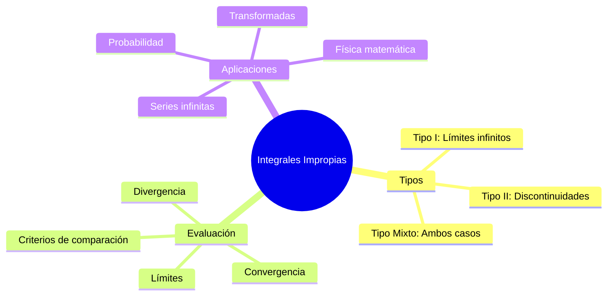

# 🚀 Integrales Impropias

## 📖 Introducción

> [!info] 💡 Concepto Fundamental
> Una **integral impropia** es una integral definida que tiene una o más de las siguientes características:
> - **Límites de integración infinitos** (uno o ambos)
> - **Integrandos con discontinuidades infinitas** en el intervalo de integración
> - **Combinación de ambas** situaciones
> 
> Se evalúan como **límites de integrales definidas** para determinar si **convergen** o **divergen**.

> [!tip] 🎯 ¿Por qué son importantes?
> - Permiten calcular **áreas infinitas** bajo curvas
> - Fundamentales en **análisis de series** y **transformadas**
> - Aplicaciones en **probabilidad** (distribuciones continuas)
> - Modelan fenómenos **físicos ilimitados** (campos, ondas)
> - Base teórica para **análisis de Fourier**
> - Esenciales en **ecuaciones diferenciales** avanzadas

## 🔗 Conexiones con Otros Temas

> [!info] 🌐 Temas Relacionados y Conexiones
> 
> **Fundamentos Previos**:
> • **Integrales definidas** - Base conceptual fundamental
> • **Límites** - Herramienta principal para evaluar integrales impropias
> • **Antiderivadas** - Necesarias para calcular las integrales
> • **Continuidad** - Para identificar puntos problemáticos
> • **Teorema Fundamental del Cálculo** - Marco teórico
> 
> **Desarrollos Posteriores**:
> • **Series infinitas** - Criterios de convergencia similares
> • **Transformadas de Laplace** - Aplicación directa
> • **Análisis de Fourier** - Series y transformadas
> • **Distribuciones de probabilidad** - Funciones de densidad
> • **Ecuaciones diferenciales** - Soluciones con condiciones de frontera
> • **Análisis complejo** - Integrales de contorno

---

## 📝 Clasificación de Integrales Impropias

> [!note] 🔍 **Definición Formal**
> Una integral $\int_a^b f(x) dx$ es **impropia** si:
> 1. Uno o ambos límites de integración son infinitos
> 2. La función $f(x)$ tiene discontinuidades infinitas en $[a,b]$
> 3. Ambas condiciones se presentan simultáneamente

### Tipo I: Límites de Integración Infinitos

> [!tip] 📊 **Definiciones del Tipo I**
> 
> **Caso 1**: Límite superior infinito
> $$\int_a^{\infty} f(x) dx = \lim_{t \to \infty} \int_a^t f(x) dx$$
> 
> **Caso 2**: Límite inferior infinito
> $$\int_{-\infty}^b f(x) dx = \lim_{t \to -\infty} \int_t^b f(x) dx$$
> 
> **Caso 3**: Ambos límites infinitos
> $$\int_{-\infty}^{\infty} f(x) dx = \int_{-\infty}^c f(x) dx + \int_c^{\infty} f(x) dx$$
> donde $c$ es cualquier número real, y **ambas integrales deben converger**.

> [!example] 🧪 **Ejemplo Tipo I - Convergente**
> **Evaluar**: $\int_1^{\infty} \frac{1}{x^2} dx$
> 
> **Solución**:
> $$\int_1^{\infty} \frac{1}{x^2} dx = \lim_{t \to \infty} \int_1^t x^{-2} dx$$
> $$= \lim_{t \to \infty} \left[-x^{-1}\right]_1^t$$
> $$= \lim_{t \to \infty} \left(-\frac{1}{t} + 1\right)$$
> $$= 0 + 1 = 1$$
> 
> **Conclusión**: La integral **converge** a 1.

> [!example] 🧪 **Ejemplo Tipo I - Divergente**
> **Evaluar**: $\int_1^{\infty} \frac{1}{x} dx$
> 
> **Solución**:
> $$\int_1^{\infty} \frac{1}{x} dx = \lim_{t \to \infty} \int_1^t x^{-1} dx$$
> $$= \lim_{t \to \infty} [\ln x]_1^t$$
> $$= \lim_{t \to \infty} (\ln t - \ln 1)$$
> $$= \lim_{t \to \infty} \ln t = \infty$$
> 
> **Conclusión**: La integral **diverge**.

### Tipo II: Discontinuidades Infinitas

> [!tip] 📊 **Definiciones del Tipo II**
> 
> **Caso 1**: Discontinuidad en el límite inferior
> Si $f(x)$ tiene discontinuidad infinita en $x = a$:
> $$\int_a^b f(x) dx = \lim_{t \to a^+} \int_t^b f(x) dx$$
> 
> **Caso 2**: Discontinuidad en el límite superior
> Si $f(x)$ tiene discontinuidad infinita en $x = b$:
> $$\int_a^b f(x) dx = \lim_{t \to b^-} \int_a^t f(x) dx$$
> 
> **Caso 3**: Discontinuidad interior
> Si $f(x)$ tiene discontinuidad infinita en $x = c$ donde $a < c < b$:
> $$\int_a^b f(x) dx = \int_a^c f(x) dx + \int_c^b f(x) dx$$
> donde **ambas integrales deben converger**.

> [!example] 🧪 **Ejemplo Tipo II - Convergente**
> **Evaluar**: $\int_0^1 \frac{1}{\sqrt{x}} dx$
> 
> **Análisis**: $f(x) = x^{-1/2}$ tiene discontinuidad infinita en $x = 0$
> 
> **Solución**:
> $$\int_0^1 x^{-1/2} dx = \lim_{t \to 0^+} \int_t^1 x^{-1/2} dx$$
> $$= \lim_{t \to 0^+} [2x^{1/2}]_t^1$$
> $$= \lim_{t \to 0^+} (2\sqrt{1} - 2\sqrt{t})$$
> $$= 2 - 0 = 2$$
> 
> **Conclusión**: La integral **converge** a 2.

> [!example] 🧪 **Ejemplo Tipo II - Divergente**
> **Evaluar**: $\int_0^1 \frac{1}{x} dx$
> 
> **Análisis**: $f(x) = x^{-1}$ tiene discontinuidad infinita en $x = 0$
> 
> **Solución**:
> $$\int_0^1 x^{-1} dx = \lim_{t \to 0^+} \int_t^1 x^{-1} dx$$
> $$= \lim_{t \to 0^+} [\ln x]_t^1$$
> $$= \lim_{t \to 0^+} (\ln 1 - \ln t)$$
> $$= \lim_{t \to 0^+} (-\ln t) = \infty$$
> 
> **Conclusión**: La integral **diverge**.

### Tipo Mixto: Combinación de Ambos Casos

> [!warning] ⚠️ **Integrales Mixtas**
> Cuando una integral tiene **tanto límites infinitos como discontinuidades**, debe separarse en partes donde cada una tenga solo un tipo de impropiedad.
> 
> **Ejemplo**: $\int_0^{\infty} \frac{1}{\sqrt{x}} dx$
> - Discontinuidad en $x = 0$ (Tipo II)
> - Límite superior infinito (Tipo I)
> 
> **Separación**: $\int_0^{\infty} \frac{1}{\sqrt{x}} dx = \int_0^1 \frac{1}{\sqrt{x}} dx + \int_1^{\infty} \frac{1}{\sqrt{x}} dx$

---

## 🧠 Mnemotecnia para el Estudio Eficaz

> [!success] 🎭 **Método Mnemotécnico: "LÍMITE"**
> 
> Para recordar el proceso de evaluación de integrales impropias:
> 
> **L** - **Localiza** el problema (¿infinito o discontinuidad?)
> **Í** - **Identifica** el tipo (I, II, o mixto)
> **M** - **Modifica** la integral usando límites apropiados
> **I** - **Integra** la función (encuentra la antiderivada)
> **T** - **Toma** el límite hacia el valor problemático
> **E** - **Evalúa** si converge o diverge

> [!tip] 💡 **Reglas Nemotécnicas Rápidas**
> 
> **Para $\int_1^{\infty} \frac{1}{x^p} dx$**:
> - "**P**equeño **p** (p ≤ 1)**: **D**iverge"
> - "**G**rande **p** (p > 1)**: **C**onverge"
> 
> **Para $\int_0^1 \frac{1}{x^p} dx$**:
> - "**P**equeño **p** (p < 1)**: **C**onverge"
> - "**G**rande **p** (p ≥ 1)**: **D**iverge"
> 
> **Frase mnemotécnica**: "En infinito, **p** grande converge; en cero, **p** pequeño converge"

---

## 🔍 Criterios de Convergencia

### Criterio de Comparación Directa

> [!info] 📋 **Teorema de Comparación Directa**
> Sean $f(x)$ y $g(x)$ funciones tales que $0 \leq f(x) \leq g(x)$ para $x \geq a$.
> 
> **Para integrales del Tipo I**:
> - Si $\int_a^{\infty} g(x) dx$ **converge**, entonces $\int_a^{\infty} f(x) dx$ **converge**
> - Si $\int_a^{\infty} f(x) dx$ **diverge**, entonces $\int_a^{\infty} g(x) dx$ **diverge**

> [!example] 🧪 **Ejemplo de Comparación Directa**
> **Evaluar**: $\int_1^{\infty} \frac{1}{x^2 + 1} dx$
> 
> **Comparación**: Para $x \geq 1$, tenemos $x^2 + 1 \geq x^2$, por lo tanto:
> $$\frac{1}{x^2 + 1} \leq \frac{1}{x^2}$$
> 
> Como $\int_1^{\infty} \frac{1}{x^2} dx = 1$ (converge), entonces $\int_1^{\infty} \frac{1}{x^2 + 1} dx$ **converge**.

### Criterio de Comparación Límite

> [!info] 📋 **Teorema de Comparación Límite**
> Sean $f(x)$ y $g(x)$ funciones positivas. Si:
> $$\lim_{x \to \infty} \frac{f(x)}{g(x)} = L$$
> donde $0 < L < \infty$, entonces $\int_a^{\infty} f(x) dx$ y $\int_a^{\infty} g(x) dx$ tienen el **mismo comportamiento de convergencia**.

> [!example] 🧪 **Ejemplo de Comparación Límite**
> **Evaluar**: $\int_1^{\infty} \frac{2x + 1}{x^3 - x + 1} dx$
> 
> **Comparación**: Para $x$ grande, el comportamiento está dominado por los términos de mayor grado:
> $$\lim_{x \to \infty} \frac{\frac{2x + 1}{x^3 - x + 1}}{\frac{2x}{x^3}} = \lim_{x \to \infty} \frac{\frac{2x + 1}{x^3 - x + 1}}{\frac{2}{x^2}} = 1$$
> 
> Como $\int_1^{\infty} \frac{2}{x^2} dx$ converge, entonces la integral original **converge**.

---

## 🎯 Integrales Importantes y Patrones

### Integrales de Referencia Tipo I

> [!tip] 📊 **Tabla de Integrales de Referencia - Tipo I**
> 
> | Integral | Convergencia | Valor (si converge) | Condición |
> |----------|--------------|-------------------|-----------|
> | $\int_1^{\infty} \frac{1}{x^p} dx$ | $p > 1$ | $\frac{1}{p-1}$ | $p > 1$ |
> | $\int_1^{\infty} \frac{1}{x^p} dx$ | Diverge | - | $p \leq 1$ |
> | $\int_1^{\infty} \frac{1}{x(\ln x)^p} dx$ | $p > 1$ | $\frac{1}{p-1}$ | $p > 1$ |
> | $\int_1^{\infty} e^{-ax} dx$ | Converge | $\frac{1}{a}$ | $a > 0$ |
> | $\int_0^{\infty} e^{-ax^2} dx$ | Converge | $\frac{1}{2}\sqrt{\frac{\pi}{a}}$ | $a > 0$ |

### Integrales de Referencia Tipo II

> [!tip] 📊 **Tabla de Integrales de Referencia - Tipo II**
> 
> | Integral | Convergencia | Valor (si converge) | Condición |
> |----------|--------------|-------------------|-----------|
> | $\int_0^1 \frac{1}{x^p} dx$ | $p < 1$ | $\frac{1}{1-p}$ | $p < 1$ |
> | $\int_0^1 \frac{1}{x^p} dx$ | Diverge | - | $p \geq 1$ |
> | $\int_0^1 x^p dx$ | Converge | $\frac{1}{p+1}$ | $p > -1$ |
> | $\int_0^1 \frac{1}{x^p (\ln x)^q} dx$ | Complejo | - | Depende de $p$ y $q$ |

---

## 💡 Ejemplos Desarrollados

> [!example] 🎯 **Ejemplo 1: Integral Tipo I con parámetro**
> **Evaluar**: $\int_0^{\infty} xe^{-ax} dx$ donde $a > 0$
> 
> **Solución usando integración por partes**:
> Sea $u = x$, $dv = e^{-ax} dx$
> Entonces $du = dx$, $v = -\frac{1}{a}e^{-ax}$
> 
> $$\int_0^{\infty} xe^{-ax} dx = \lim_{t \to \infty} \int_0^t xe^{-ax} dx$$
> $$= \lim_{t \to \infty} \left[-\frac{x}{a}e^{-ax} + \frac{1}{a}\int e^{-ax} dx\right]_0^t$$
> $$= \lim_{t \to \infty} \left[-\frac{x}{a}e^{-ax} - \frac{1}{a^2}e^{-ax}\right]_0^t$$
> $$= \lim_{t \to \infty} \left(-\frac{t}{a}e^{-at} - \frac{1}{a^2}e^{-at} + \frac{1}{a^2}\right)$$
> 
> Como $\lim_{t \to \infty} te^{-at} = 0$ y $\lim_{t \to \infty} e^{-at} = 0$ (para $a > 0$):
> $$= 0 - 0 + \frac{1}{a^2} = \frac{1}{a^2}$$

> [!example] 🎯 **Ejemplo 2: Integral Tipo II**
> **Evaluar**: $\int_0^4 \frac{1}{\sqrt{4-x}} dx$
> 
> **Análisis**: Discontinuidad en $x = 4$
> 
> **Solución**:
> $$\int_0^4 \frac{1}{\sqrt{4-x}} dx = \lim_{t \to 4^-} \int_0^t (4-x)^{-1/2} dx$$
> 
> Sea $u = 4-x$, entonces $du = -dx$:
> $$= \lim_{t \to 4^-} \int_{4}^{4-t} u^{-1/2} (-du) = \lim_{t \to 4^-} \int_{4-t}^{4} u^{-1/2} du$$
> $$= \lim_{t \to 4^-} [2u^{1/2}]_{4-t}^{4}$$
> $$= \lim_{t \to 4^-} (2\sqrt{4} - 2\sqrt{4-t})$$
> $$= 4 - 0 = 4$$

> [!example] 🎯 **Ejemplo 3: Integral Mixta**
> **Evaluar**: $\int_0^{\infty} \frac{1}{\sqrt{x}(1+x)} dx$
> 
> **Análisis**: Discontinuidad en $x = 0$ y límite superior infinito
> 
> **Separación**: $\int_0^{\infty} \frac{1}{\sqrt{x}(1+x)} dx = \int_0^1 \frac{1}{\sqrt{x}(1+x)} dx + \int_1^{\infty} \frac{1}{\sqrt{x}(1+x)} dx$
> 
> **Evaluación de cada parte**:
> 
> **Parte 1** ($\int_0^1$): Tipo II
> Para $x$ cerca de 0: $\frac{1}{\sqrt{x}(1+x)} \sim \frac{1}{\sqrt{x}}$
> Como $\int_0^1 \frac{1}{\sqrt{x}} dx$ converge, esta parte converge.
> 
> **Parte 2** ($\int_1^{\infty}$): Tipo I
> Para $x$ grande: $\frac{1}{\sqrt{x}(1+x)} \sim \frac{1}{x^{3/2}}$
> Como $\int_1^{\infty} \frac{1}{x^{3/2}} dx$ converge (p = 3/2 > 1), esta parte converge.
> 
> **Conclusión**: Ambas partes convergen, por lo tanto la integral original converge.

---

## 🔗 Aplicaciones Prácticas

> [!note] 🌐 **Aplicaciones en Probabilidad**
> **Distribuciones de Probabilidad Continuas**:
> - **Distribución Exponencial**: $f(x) = \lambda e^{-\lambda x}$ para $x \geq 0$
>   $$\int_0^{\infty} \lambda e^{-\lambda x} dx = 1$$
> - **Distribución Normal**: $f(x) = \frac{1}{\sigma\sqrt{2\pi}} e^{-\frac{(x-\mu)^2}{2\sigma^2}}$
>   $$\int_{-\infty}^{\infty} f(x) dx = 1$$

> [!note] 🔬 **Aplicaciones en Física**
> **Transformadas de Laplace**:
> $$\mathcal{L}\{f(t)\} = \int_0^{\infty} f(t) e^{-st} dt$$
> 
> **Energía de una partícula**:
> $$E = \int_0^{\infty} \frac{1}{2}mv^2 \rho(v) dv$$
> donde $\rho(v)$ es la distribución de velocidades.

> [!note] 🎵 **Aplicaciones en Análisis de Fourier**
> **Transformada de Fourier**:
> $$\hat{f}(\omega) = \int_{-\infty}^{\infty} f(t) e^{-i\omega t} dt$$
> 
> **Condición de convergencia**: $\int_{-\infty}^{\infty} \lvert f(t) \rvert dt < \infty$

---

## 🧠 Estrategias de Resolución

> [!tip] 💡 **Estrategia General**
> **Paso 1**: **Identificar** el tipo de impropiedad
> - ¿Límites infinitos? → Tipo I
> - ¿Discontinuidades? → Tipo II
> - ¿Ambos? → Mixto
> 
> **Paso 2**: **Localizar** puntos problemáticos
> - Para Tipo I: donde los límites son $\pm\infty$
> - Para Tipo II: donde $f(x) \to \pm\infty$
> 
> **Paso 3**: **Separar** si hay múltiples problemas
> - Una integral por cada punto problemático
> 
> **Paso 4**: **Formar** los límites apropiados
> - Reemplazar cada problema con una variable que tiende al valor problemático
> 
> **Paso 5**: **Evaluar** usando técnicas estándar
> - Antiderivadas, integración por partes, sustitución, etc.
> 
> **Paso 6**: **Calcular** los límites
> - Determinar si existen (convergencia) o no (divergencia)

> [!warning] ⚠️ **Errores Comunes y Cómo Evitarlos**
> 
> **Error 1**: No identificar todas las impropiedades
> - ✅ **Solución**: Examinar cuidadosamente tanto los límites como la función
> 
> **Error 2**: No separar correctamente las integrales mixtas
> - ✅ **Solución**: Cada punto problemático requiere su propio límite
> 
> **Error 3**: Evaluar incorrectamente los límites
> - ✅ **Solución**: Usar formas indeterminadas y regla de L'Hôpital cuando sea necesario
> 
> **Error 4**: Confundir convergencia con el valor de la integral
> - ✅ **Solución**: Recordar que convergencia significa que el límite existe y es finito
> 
> **Error 5**: No verificar las condiciones de los criterios de comparación
> - ✅ **Solución**: Asegurar que las funciones sean positivas y que la comparación sea válida

---
## 📚 Referencias

> [!quote] 📖 Notas relacionadas
> 
>
> - [[Integral de Riemann]] - Fundamento teórico de las integrales definidas
> - [[Propiedades de la Integral Definida]] - Propiedades fundamentales de integración
> - [[Teorema fundamental del cálculo]] - Marco teórico principal
> - [[Teoremas de comparación y desigualdades]] - Criterios de convergencia

---

## 🔍 Notas Recomendadas

> [!info] 📚 Para profundizar y complementar
> - [[Área bajo la Curva]] - Base conceptual de integrales definidas
> - [[Métodos de Integración Definida]] - Técnicas avanzadas de integración
> - [[Integración Numérica]] - Métodos computacionales
> - [[Teorema de Simetría y Teorema de la Periodicidad.]] - Técnicas especiales de evaluación
> - [[Teorema del Valor Medio para Integrales]] - Teoremas fundamentales del cálculo

## 🏷️ Tags

#matemáticas #cálculo #integrales-impropias #convergencia #divergencia #límites #integración #análisis-matemático #universidad #probabilidad #transformadas #física-matemática #criterios-comparación #mnemotecnia #métodos-estudio