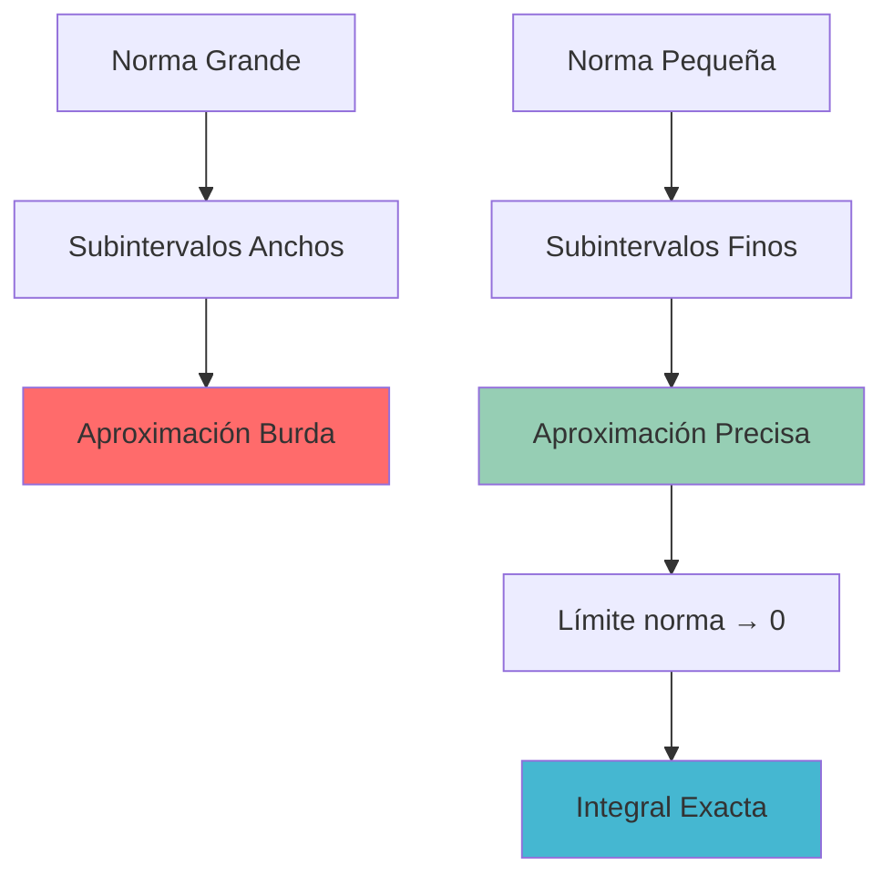
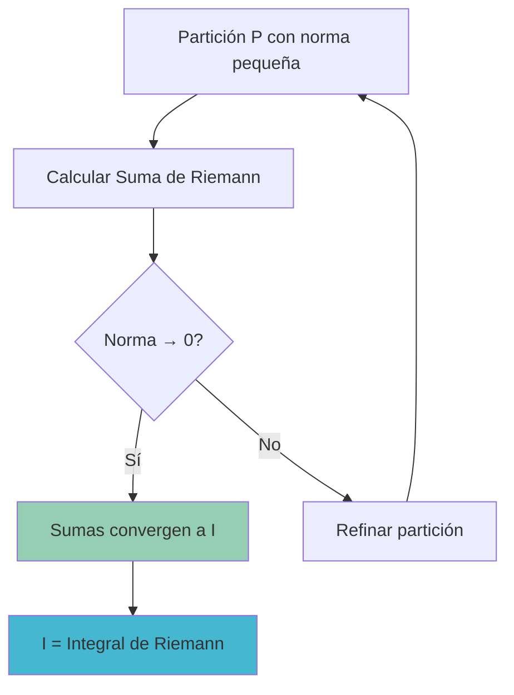
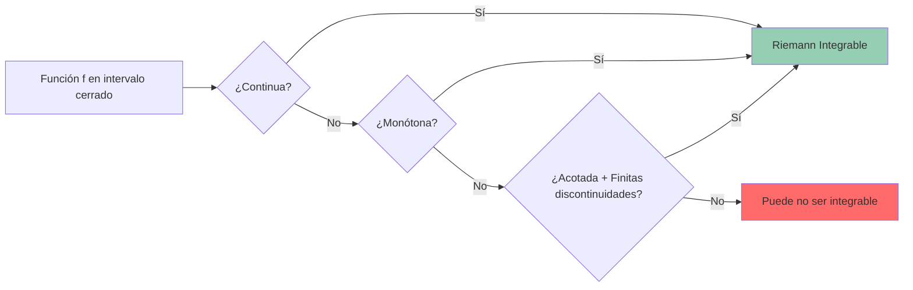
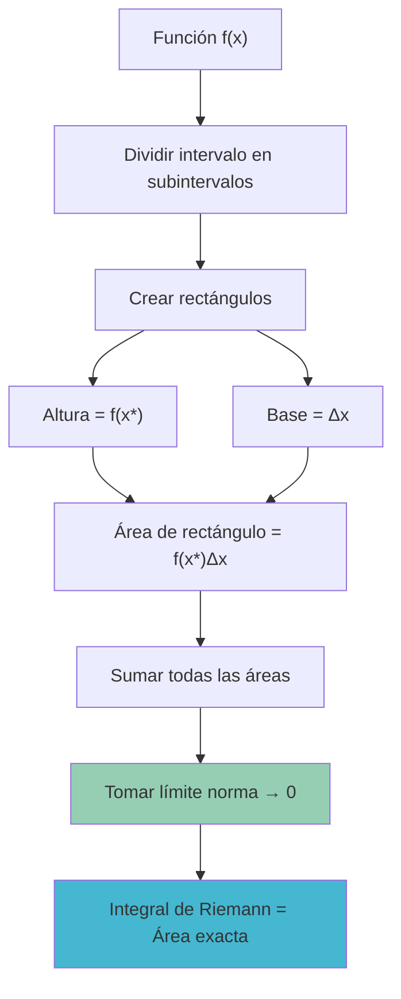

# 🎯 Integral de Riemann

> [!info] 💡 **Concepto Central**
> La Integral de Riemann es la definición formal del área bajo una curva, construida a partir del límite de sumas de aproximaciones rectangulares cuando el número de subdivisiones tiende al infinito.

## 📏 Partición de un Intervalo

> [!tip] 🔧 **Definición de Partición**
> Una **partición** $P$ del intervalo $[a,b]$ es un conjunto finito de puntos:
> 
> $$P = \{x_0, x_1, x_2, \ldots, x_n\}$$
> 
> donde $a = x_0 < x_1 < x_2 < \cdots < x_n = b$

### 🎯 Tipos de Particiones

#### 📐 Partición Regular
Todos los subintervalos tienen la misma longitud:
$$\Delta x = \frac{b-a}{n} \quad \text{y} \quad x_i = a + i \cdot \Delta x$$

#### 📊 Partición Irregular  
Los subintervalos pueden tener diferentes longitudes:
$$\Delta x_i = x_i - x_{i-1} \quad \text{(puede variar para cada } i\text{)}$$

### 🔄 Refinamiento de Particiones
> [!info] 📈 **Refinamiento**
> Una partición $P'$ es un **refinamiento** de $P$ si $P \subseteq P'$ (contiene todos los puntos de $P$ y posiblemente más).

## 📊 Norma de una Partición

> [!warning] 🎯 **Definición Crucial**
> La **norma** (o **malla**) de una partición $P$ se define como:
> 
> $$\|P\| = \max_{1 \leq i \leq n} \Delta x_i = \max_{1 \leq i \leq n} (x_i - x_{i-1})$$
> 
> Es decir, la longitud del subintervalo más largo.

### ⚡ Importancia de la Norma

> [!info] 🔍 **¿Por qué es importante?**
> - **Control de precisión**: A menor norma, mejor aproximación
> - **Condición de límite**: Para que exista la integral, necesitamos $\|P\| \to 0$
> - **Independencia de $n$**: No basta con $n \to \infty$, debe cumplirse $\|P\| \to 0$

## 🧮 Notación Sigma y Suma de Riemann

### 📐 Definición de Suma de Riemann

> [!tip] 🎯 **Notación Sigma Completa**
> Dada una función $f(x)$ en $[a,b]$ y una partición $P$, la **Suma de Riemann** es:
> 
> $$S(f,P) = \sum_{i=1}^{n} f(x_i^*) \Delta x_i$$
> 
> donde:
> - $\sum_{i=1}^{n}$ indica sumar desde $i=1$ hasta $i=n$
> - $f(x_i^*)$ es el valor de la función en un punto $x_i^* \in [x_{i-1}, x_i]$
> - $\Delta x_i = x_i - x_{i-1}$ es el ancho del $i$-ésimo subintervalo

### 🎨 Variantes de la Suma según el Punto de Muestra

#### 📍 Suma por la Izquierda
$$L_n = \sum_{i=1}^{n} f(x_{i-1}) \Delta x_i$$
Punto de muestra: $x_i^* = x_{i-1}$

#### 📍 Suma por la Derecha
$$R_n = \sum_{i=1}^{n} f(x_i) \Delta x_i$$
Punto de muestra: $x_i^* = x_i$

#### 📍 Suma del Punto Medio
$$M_n = \sum_{i=1}^{n} f\left(\frac{x_{i-1} + x_i}{2}\right) \Delta x_i$$
Punto de muestra: $x_i^* = \frac{x_{i-1} + x_i}{2}$

### 🔢 Caso Especial: Partición Regular

Para partición regular con $\Delta x = \frac{b-a}{n}$:

> [!info] ⚡ **Fórmulas Simplificadas**
> - **Izquierda**: $L_n = \frac{b-a}{n} \sum_{i=0}^{n-1} f\left(a + i \cdot \frac{b-a}{n}\right)$
> - **Derecha**: $R_n = \frac{b-a}{n} \sum_{i=1}^{n} f\left(a + i \cdot \frac{b-a}{n}\right)$
> - **Punto Medio**: $M_n = \frac{b-a}{n} \sum_{i=1}^{n} f\left(a + \left(i-\frac{1}{2}\right) \cdot \frac{b-a}{n}\right)$

## 🎯 Definición Formal de la Integral de Riemann

> [!warning] 🏆 **Definición Fundamental**
> Una función $f$ es **Riemann integrable** en $[a,b]$ si existe un número $I$ tal que para cualquier $\varepsilon > 0$, existe $\delta > 0$ donde:
> 
> $$\text{Si } \|P\| < \delta \text{, entonces } \left|\sum_{i=1}^{n} f(x_i^*) \Delta x_i - I\right| < \varepsilon$$
> 
> En este caso, escribimos:
> $$\int_a^b f(x) dx = I = \lim_{\|P\| \to 0} \sum_{i=1}^{n} f(x_i^*) \Delta x_i$$

### 🔍 Interpretación del Límite

## 🧪 Ejemplo Detallado

> [!tip] 🔬 **Ejemplo: $f(x) = x^2$ en $[0,2]$**
> 
> **Paso 1: Partición regular con $n=4$**
> $$\Delta x = \frac{2-0}{4} = 0.5$$
> $$P = \{0, 0.5, 1, 1.5, 2\}$$
> $$\|P\| = 0.5$$
> 
> **Paso 2: Suma por la derecha**
> $$R_4 = \sum_{i=1}^{4} f(x_i) \Delta x_i = \sum_{i=1}^{4} f(i \cdot 0.5) \cdot 0.5$$
> $$= 0.5[f(0.5) + f(1) + f(1.5) + f(2)]$$
> $$= 0.5[(0.5)^2 + 1^2 + (1.5)^2 + 2^2]$$
> $$= 0.5[0.25 + 1 + 2.25 + 4] = 0.5 \times 7.5 = 3.75$$
> 
> **Paso 3: Comparación con valor exacto**
> $$\int_0^2 x^2 dx = \left[\frac{x^3}{3}\right]_0^2 = \frac{8}{3} \approx 2.667$$
> 
> **Error**: $|3.75 - 2.667| = 1.083$

### 📈 Mejorando la Aproximación

| $n$ | $\|P\|$ | $R_n$ | Error |
|-----|---------|-------|-------|
| 4   | 0.5     | 3.75  | 1.083 |
| 8   | 0.25    | 3.21  | 0.543 |
| 16  | 0.125   | 2.94  | 0.273 |
| 32  | 0.0625  | 2.80  | 0.133 |

> [!info] 📊 **Observación**: Conforme $\|P\| \to 0$, la suma converge a $\frac{8}{3}$

## ⚡ Condiciones de Integrabilidad

> [!warning] 🔍 **Teoremas Fundamentales**

### 🎯 Teorema 1: Funciones Continuas
Si $f$ es continua en $[a,b]$, entonces $f$ es Riemann integrable en $[a,b]$.

### 🎯 Teorema 2: Funciones Monótonas  
Si $f$ es monótona en $[a,b]$, entonces $f$ es Riemann integrable en $[a,b]$.

### 🎯 Teorema 3: Discontinuidades Finitas
Si $f$ es acotada en $[a,b]$ y tiene un número finito de discontinuidades, entonces $f$ es Riemann integrable en $[a,b]$.

## 🛠️ Propiedades Fundamentales

> [!info] 📋 **Propiedades Algebraicas**

### 🔢 Linealidad
$$\int_a^b [c_1f(x) + c_2g(x)] dx = c_1\int_a^b f(x) dx + c_2\int_a^b g(x) dx$$

### 🔄 Aditividad en el Dominio
Si $a < c < b$:
$$\int_a^b f(x) dx = \int_a^c f(x) dx + \int_c^b f(x) dx$$

### 📊 Comparación
Si $f(x) \leq g(x)$ en $[a,b]$:
$$\int_a^b f(x) dx \leq \int_a^b g(x) dx$$

## ⚠️ Errores Comunes y Conceptos Clave

> [!warning] 🚨 **Errores Frecuentes**
> 
> 1. **Confundir $n \to \infty$ con $\|P\| \to 0$**: No es lo mismo
> 2. **Olvidar el $\Delta x_i$**: Siempre multiplicar por el ancho
> 3. **Índices incorrectos**: En suma izquierda usar $f(x_{i-1})$
> 4. **Ignorar discontinuidades**: Verificar integrabilidad primero
> 5. **Signos**: Si $f(x) < 0$, la integral es negativa

## 🌐 Interpretación Geométrica

> [!tip] 🏔️ **Significado Visual**
> - **Área positiva**: Cuando $f(x) \geq 0$, la integral representa el área bajo la curva
> - **Área con signo**: Cuando $f(x)$ cambia de signo, se obtiene el área neta
> - **Aproximación**: Los rectángulos aproximan cada vez mejor la región curva

---

## 📚 Referencias y Conexiones

### 🔗 Notas Relacionadas
- [[Teorema fundamental del cálculo]] - Conexión integral-derivada
- [[Área bajo la Curva]] - Interpretación geométrica
- [[Propiedades de la Integral Definida]] - Operaciones con integrales
- [[Métodos de Integración Definida]] - Técnicas de cálculo
- [[Integrales Impropias]] - Extensión del concepto

### 📖 Para Profundizar
- [[Historia de la Integración]] - Desarrollo histórico del concepto
- [[Integral de Lebesgue]] - Generalización moderna
- [[Métodos Numéricos de Integración]] - Aplicaciones computacionales

### 🏷️ Tags
`#matematicas/calculo/integrales` `#teoria/riemann` `#definiciones/fundamentales` `#limites/infinitos` `#geometria/areas` `#analisis/real`