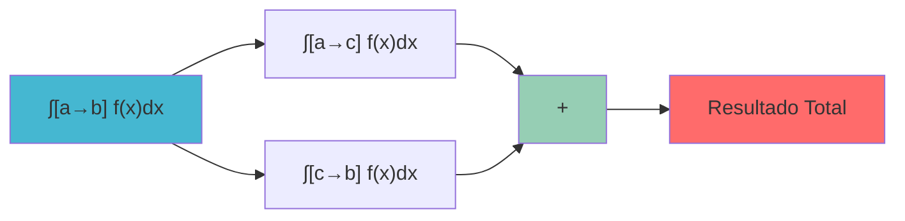
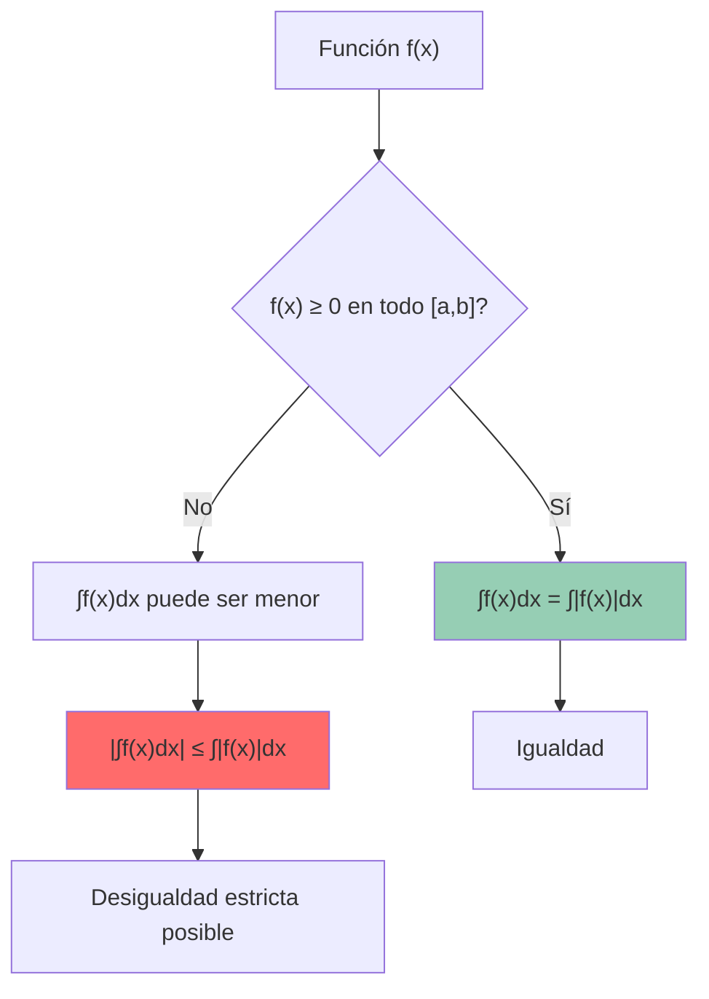
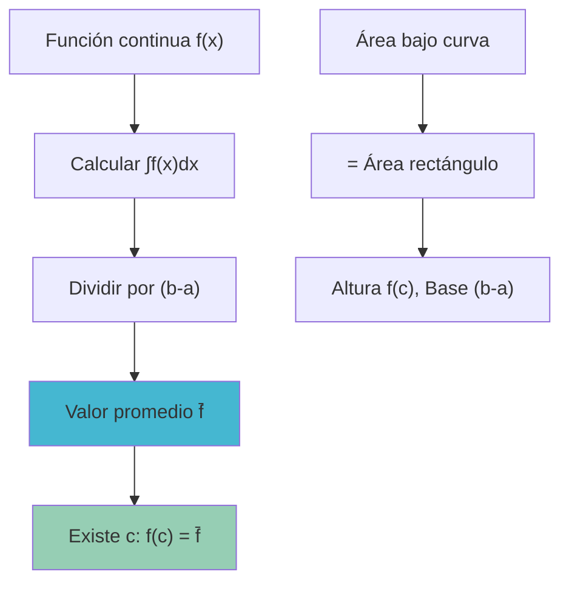
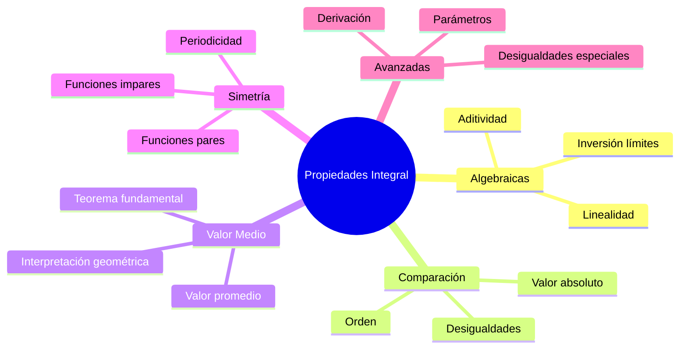

# 🛠️ Propiedades de la Integral Definida

> [!info] 💡 **Herramientas Fundamentales**
> Las propiedades de la integral definida son las reglas algebraicas y geométricas que nos permiten manipular, simplificar y evaluar integrales de manera eficiente. Son la base para todos los cálculos avanzados.

## ⚡ Propiedades Algebraicas Básicas

### 🔢 Linealidad de la Integral

> [!tip] 🎯 **Propiedad 1: Linealidad Completa**
> Para funciones integrables $f(x)$ y $g(x)$ en $[a,b]$ y constantes $c_1, c_2$:
> 
> $$\int_a^b [c_1 f(x) + c_2 g(x)] dx = c_1 \int_a^b f(x) dx + c_2 \int_a^b g(x) dx$$

#### 📊 Casos Particulares

**Constante multiplicativa:**
$$\int_a^b c \cdot f(x) dx = c \int_a^b f(x) dx$$

**Suma de funciones:**
$$\int_a^b [f(x) + g(x)] dx = \int_a^b f(x) dx + \int_a^b g(x) dx$$

**Diferencia de funciones:**
$$\int_a^b [f(x) - g(x)] dx = \int_a^b f(x) dx - \int_a^b g(x) dx$$

> [!warning] ⚠️ **Importante**
> La linealidad **NO** se aplica a productos o cocientes:
> $$\int_a^b f(x) \cdot g(x) dx \neq \left(\int_a^b f(x) dx\right) \cdot \left(\int_a^b g(x) dx\right)$$

### 🧪 Ejemplo de Linealidad

> [!tip] 🔬 **Ejemplo**: Evaluar $\int_0^2 [3x^2 - 2x + 5] dx$
> 
> **Aplicando linealidad:**
> $$\int_0^2 [3x^2 - 2x + 5] dx = 3\int_0^2 x^2 dx - 2\int_0^2 x dx + 5\int_0^2 1 dx$$
> 
> **Evaluando cada integral:**
> $$= 3 \left[\frac{x^3}{3}\right]_0^2 - 2 \left[\frac{x^2}{2}\right]_0^2 + 5[x]_0^2$$
> $$= 3 \cdot \frac{8}{3} - 2 \cdot 2 + 5 \cdot 2 = 8 - 4 + 10 = 14$$

## 🔄 Propiedades de Dominio

### 📏 Aditividad en el Intervalo

> [!tip] 🎯 **Propiedad 2: Aditividad**
> Si $a < c < b$ y $f$ es integrable en $[a,b]$:
> 
> $$\int_a^b f(x) dx = \int_a^c f(x) dx + \int_c^b f(x) dx$$

#### 🌟 Interpretación Geométrica

> [!info] 🏔️ **Significado Visual**
> El área total bajo la curva de $a$ a $b$ es igual a la suma de las áreas de $a$ a $c$ más de $c$ a $b$.

### 🔄 Propiedades de Orientación

> [!warning] 🎯 **Propiedad 3: Inversión de Límites**
> $$\int_a^b f(x) dx = -\int_b^a f(x) dx$$

> [!info] 🎯 **Propiedad 4: Integral Nula**
> $$\int_a^a f(x) dx = 0$$

### 🧪 Ejemplo de Aditividad

> [!tip] 🔬 **Ejemplo**: Si $\int_0^3 f(x) dx = 10$ y $\int_0^1 f(x) dx = 2$, encontrar $\int_1^3 f(x) dx$
> 
> **Aplicando aditividad:**
> $$\int_0^3 f(x) dx = \int_0^1 f(x) dx + \int_1^3 f(x) dx$$
> $$10 = 2 + \int_1^3 f(x) dx$$
> $$\int_1^3 f(x) dx = 8$$

## 📊 Propiedades de Comparación

### 🔍 Propiedad de Orden

> [!tip] 🎯 **Propiedad 5: Preservación del Orden**
> Si $f(x) \leq g(x)$ para todo $x \in [a,b]$ con $a \leq b$:
> 
> $$\int_a^b f(x) dx \leq \int_a^b g(x) dx$$

#### 📈 Casos Especiales

**Función no negativa:**
Si $f(x) \geq 0$ en $[a,b]$ con $a \leq b$:
$$\int_a^b f(x) dx \geq 0$$

**Función no positiva:**
Si $f(x) \leq 0$ en $[a,b]$ con $a \leq b$:
$$\int_a^b f(x) dx \leq 0$$

### 🎯 Desigualdad del Valor Absoluto

> [!warning] 🎯 **Propiedad 6: Desigualdad Triangular**
> $$\left|\int_a^b f(x) dx\right| \leq \int_a^b |f(x)| dx$$

### 🧪 Ejemplo de Comparación

> [!tip] 🔬 **Ejemplo**: Comparar $\int_0^1 x^2 dx$ y $\int_0^1 x^3 dx$
> 
> **Análisis**: En $[0,1]$, tenemos $x^3 \leq x^2$ (ya que $0 \leq x \leq 1$)
> 
> **Por la propiedad de orden:**
> $$\int_0^1 x^3 dx \leq \int_0^1 x^2 dx$$
> 
> **Verificación numérica:**
> $$\int_0^1 x^3 dx = \left[\frac{x^4}{4}\right]_0^1 = \frac{1}{4}$$
> $$\int_0^1 x^2 dx = \left[\frac{x^3}{3}\right]_0^1 = \frac{1}{3}$$
> 
> Efectivamente: $\frac{1}{4} < \frac{1}{3}$ ✓

## 🎯 Teoremas de Valor Medio

### 📊 Teorema del Valor Medio para Integrales

> [!warning] 🏆 **Teorema del Valor Medio**
> Si $f$ es continua en $[a,b]$, entonces existe $c \in [a,b]$ tal que:
> 
> $$\int_a^b f(x) dx = f(c)(b-a)$$
> 
> **Interpretación**: El área bajo la curva es igual al área de un rectángulo de altura $f(c)$ y base $(b-a)$.

#### 🎨 Valor Promedio de una Función

> [!info] 📈 **Definición**
> El **valor promedio** de $f$ en $[a,b]$ es:
> 
> $$\bar{f} = \frac{1}{b-a} \int_a^b f(x) dx$$
> 
> Por el teorema del valor medio: $\bar{f} = f(c)$ para algún $c \in [a,b]$

### 🧪 Ejemplo del Valor Medio

> [!tip] 🔬 **Ejemplo**: Encontrar el valor promedio de $f(x) = x^2$ en $[0,3]$
> 
> **Cálculo del valor promedio:**
> $$\bar{f} = \frac{1}{3-0} \int_0^3 x^2 dx = \frac{1}{3} \left[\frac{x^3}{3}\right]_0^3 = \frac{1}{3} \cdot \frac{27}{3} = 3$$
> 
> **Encontrar $c$ tal que $f(c) = 3$:**
> $$c^2 = 3 \Rightarrow c = \sqrt{3} \approx 1.73$$
> 
> Como $\sqrt{3} \in [0,3]$, el teorema se verifica ✓

## 🔧 Propiedades Especiales

### 🎪 Funciones Pares e Impares

> [!tip] 🎯 **Propiedad 7: Simetría**

**Función par**: Si $f(-x) = f(x)$:
$$\int_{-a}^a f(x) dx = 2\int_0^a f(x) dx$$

**Función impar**: Si $f(-x) = -f(x)$:
$$\int_{-a}^a f(x) dx = 0$$

#### 🧪 Ejemplos de Simetría

> [!info] 🔬 **Ejemplos**
> 
> **Función par**: $\int_{-2}^2 x^2 dx = 2\int_0^2 x^2 dx = 2 \cdot \frac{8}{3} = \frac{16}{3}$
> 
> **Función impar**: $\int_{-1}^1 x^3 dx = 0$ (sin necesidad de calcular)

### 🔄 Periodicidad

> [!warning] 🎯 **Propiedad 8: Funciones Periódicas**
> Si $f$ tiene período $T$ (es decir, $f(x+T) = f(x)$):
> 
> $$\int_a^{a+T} f(x) dx = \int_0^T f(x) dx$$
> 
> para cualquier valor de $a$.

### 🌊 Sustituciones Especiales

> [!info] 🎯 **Propiedad 9: Cambio de Variable Lineal**
> $$\int_a^b f(cx + d) dx = \frac{1}{c} \int_{ca+d}^{cb+d} f(u) du$$

## 📈 Propiedades Avanzadas

### 🎯 Integrales con Parámetros

> [!warning] 🔧 **Derivación bajo el Signo Integral**
> Si $F(t) = \int_a^b f(x,t) dx$ y se cumplen ciertas condiciones de continuidad:
> 
> $$\frac{dF}{dt} = \int_a^b \frac{\partial f}{\partial t}(x,t) dx$$

### 🌟 Desigualdades Importantes

> [!tip] 🏆 **Desigualdad de Hölder**
> Para $p, q > 1$ con $\frac{1}{p} + \frac{1}{q} = 1$:
> 
> $$\int_a^b |f(x)g(x)| dx \leq \left(\int_a^b |f(x)|^p dx\right)^{1/p} \left(\int_a^b |g(x)|^q dx\right)^{1/q}$$

> [!tip] 🏆 **Desigualdad de Cauchy-Schwarz**
> Caso especial con $p = q = 2$:
> 
> $$\int_a^b |f(x)g(x)| dx \leq \sqrt{\int_a^b |f(x)|^2 dx} \sqrt{\int_a^b |g(x)|^2 dx}$$

## ⚠️ Errores Comunes

> [!warning] 🚨 **Errores Frecuentes**

### 🔴 Error 1: Linealidad Mal Aplicada
**Incorrecto**: $\int_a^b f(x) \cdot g(x) dx = \int_a^b f(x) dx \cdot \int_a^b g(x) dx$

**Correcto**: La linealidad solo aplica a sumas y diferencias

### 🔴 Error 2: Límites de Integración
**Incorrecto**: Olvidar cambiar límites en sustituciones

**Correcto**: Siempre verificar que los límites correspondan a la nueva variable

### 🔴 Error 3: Signos en Comparaciones
**Incorrecto**: Asumir que $\int_a^b f(x) dx > 0$ solo porque $f(x) > 0$

**Correcto**: Verificar que $a < b$ para mantener el signo

### 🔴 Error 4: Valor Absoluto
**Incorrecto**: $\int_a^b |f(x)| dx = \left|\int_a^b f(x) dx\right|$

**Correcto**: En general, $\left|\int_a^b f(x) dx\right| \leq \int_a^b |f(x)| dx$

## 🎪 Aplicaciones Prácticas

### 🔧 Simplificación de Cálculos

> [!tip] 💡 **Estrategias de Uso**

1. **Usar linealidad**: Separar términos complejos
2. **Aplicar simetría**: Reducir el dominio de integración
3. **Comparar funciones**: Estimar resultados sin calcular
4. **Dividir intervalos**: Manejar discontinuidades o cambios de comportamiento

### 🧪 Ejemplo Combinado

> [!tip] 🔬 **Ejemplo**: Evaluar $\int_{-1}^3 (x^3 + 2x^2 - x + 1) dx$
> 
> **Estrategia**: Usar linealidad y simetría cuando sea posible
> 
> $$\int_{-1}^3 (x^3 + 2x^2 - x + 1) dx = \int_{-1}^3 x^3 dx + 2\int_{-1}^3 x^2 dx - \int_{-1}^3 x dx + \int_{-1}^3 1 dx$$
> 
> **Para términos impares**: Dividir en $[-1,0]$ y $[0,3]$
> **Para términos pares**: Calcular directamente
> 
> Resultado más eficiente que calcular la integral completa de una vez.

## 🌐 Conexiones Conceptuales

---

## 📚 Referencias y Conexiones

### 🔗 Notas Relacionadas
- [[Integral de Riemann]] - Definición formal que sustenta estas propiedades
- [[Teorema fundamental del cálculo]] - Herramienta principal para evaluar integrales
- [[Métodos de Integración Definida]] - Aplicación práctica de estas propiedades
- [[Área bajo la Curva]] - Interpretación geométrica de las propiedades
- [[Integrales Impropias]] - Extensión de estas propiedades

### 📖 Para Profundizar
- [[Teorema del Valor Medio]] - Fundamento teórico del valor promedio
- [[Desigualdades Integrales]] - Estudio detallado de comparaciones
- [[Funciones de Distribución]] - Aplicación en probabilidad
- [[Análisis de Fourier]] - Uso de propiedades de simetría

### 🎯 Aplicaciones Prácticas
- [[Cálculo de Áreas Complejas]] - Uso de aditividad y comparación
- [[Valores Promedio en Física]] - Aplicación del teorema del valor medio
- [[Optimización con Integrales]] - Uso de propiedades para simplificar

### 🏷️ Tags
#matematicas/calculo/propiedades
#integrales/herramientas
#teoremas/fundamentales
#aplicaciones/calculo
#algebra/integrales 
#comparacion/funciones