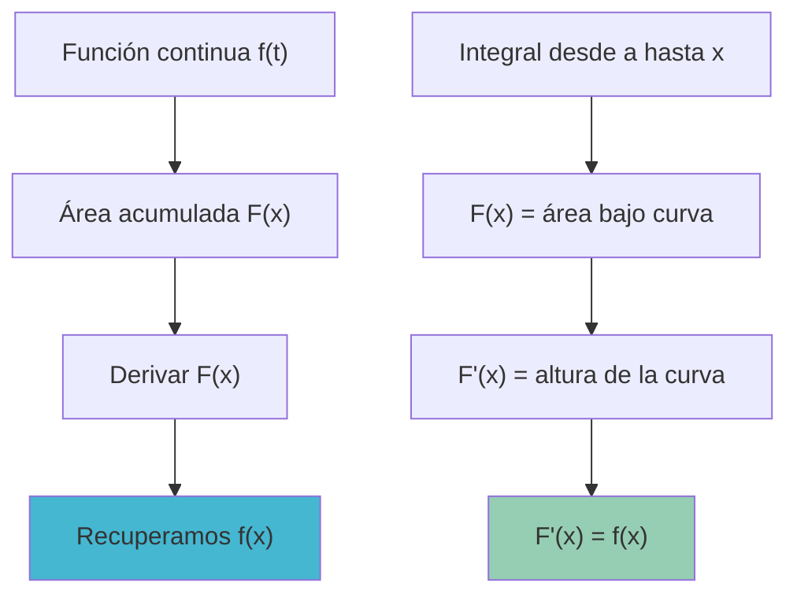
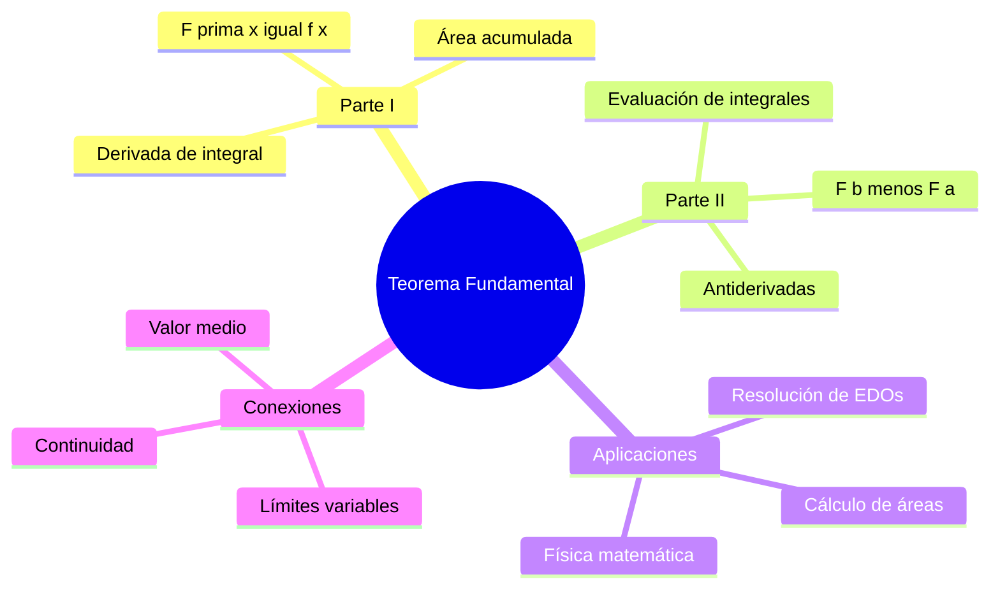
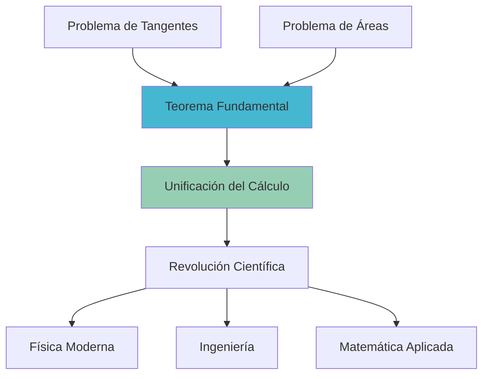

# ⚡ Teorema Fundamental del Cálculo

> [!info] 💡 **El Puente Conceptual**
> El Teorema Fundamental del Cálculo establece la conexión profunda entre derivación e integración, demostrando que son operaciones inversas y proporcionando una herramienta poderosa para evaluar integrales definidas.

## 🎯 Primera Parte del Teorema Fundamental

> [!tip] 🏆 **Teorema Fundamental del Cálculo - Parte I**
> Si $f$ es continua en $[a,b]$ y definimos:
> 
> $$F(x) = \int_a^x f(t) dt$$
> 
> entonces $F$ es diferenciable en $(a,b)$ y:
> 
> $$F'(x) = f(x)$$
> 
> Es decir: $\frac{d}{dx}\left[\int_a^x f(t) dt\right] = f(x)$

### 🔍 Interpretación Geométrica

> [!info] 📊 **Significado Visual**
> - $F(x)$ representa el **área acumulada** desde $a$ hasta $x$
> - $F'(x) = f(x)$ significa que la **tasa de cambio** del área acumulada es igual al **valor de la función** en ese punto
> - La "altura" de la función determina qué tan rápido crece el área

### 🧮 Demostración (Esquema)

> [!warning] 🔬 **Idea de la Demostración**
> 
> **Paso 1**: Usar definición de derivada
> $$F'(x) = \lim_{h \to 0} \frac{F(x+h) - F(x)}{h}$$
> 
> **Paso 2**: Expresar con integrales
> $$F'(x) = \lim_{h \to 0} \frac{\int_a^{x+h} f(t)dt - \int_a^x f(t)dt}{h}$$
> 
> **Paso 3**: Usar aditividad de la integral
> $$F'(x) = \lim_{h \to 0} \frac{\int_x^{x+h} f(t)dt}{h}$$
> 
> **Paso 4**: Aplicar Teorema del Valor Medio para integrales
> $$F'(x) = \lim_{h \to 0} \frac{f(c) \cdot h}{h} = \lim_{h \to 0} f(c) = f(x)$$

## 🎯 Segunda Parte del Teorema Fundamental

> [!tip] 🏆 **Teorema Fundamental del Cálculo - Parte II**
> Si $f$ es continua en $[a,b]$ y $F$ es cualquier antiderivada de $f$ (es decir, $F'(x) = f(x)$), entonces:
> 
> $$\int_a^b f(x) dx = F(b) - F(a)$$
> 
> **Notación**: $\int_a^b f(x) dx = [F(x)]_a^b = F(b) - F(a)$

### 🔧 Metodología de Evaluación

> [!info] 📋 **Proceso de Evaluación**
> 
> **Paso 1**: Encontrar una antiderivada $F(x)$ de $f(x)$
> 
> **Paso 2**: Evaluar $F$ en los límites de integración
> 
> **Paso 3**: Calcular $F(b) - F(a)$

## 🧪 Ejemplos Detallados

### 🔬 Ejemplo 1: Aplicación Directa

> [!tip] 📈 **Evaluar**: $\int_1^4 2x dx$
> 
> **Paso 1**: Encontrar antiderivada
> $F(x) = x^2$ (ya que $\frac{d}{dx}[x^2] = 2x$)
> 
> **Paso 2**: Aplicar el teorema
> $$\int_1^4 2x dx = [x^2]_1^4 = 4^2 - 1^2 = 16 - 1 = 15$$
> 
> **Verificación**: El área del trapecio de altura $2$ a $8$ y base $3$ es $\frac{(2+8) \cdot 3}{2} = 15$ ✓

### 🔬 Ejemplo 2: Con Funciones Trigonométricas

> [!tip] 📐 **Evaluar**: $\int_0^{\pi/2} \cos(x) dx$
> 
> **Paso 1**: Antiderivada de $\cos(x)$ es $\sin(x)$
> 
> **Paso 2**: Aplicar el teorema
> $$\int_0^{\pi/2} \cos(x) dx = [\sin(x)]_0^{\pi/2} = \sin(\pi/2) - \sin(0) = 1 - 0 = 1$$

### 🔬 Ejemplo 3: Primera Parte del Teorema

> [!tip] 🧮 **Derivar**: $\frac{d}{dx}\left[\int_2^x t^3 dt\right]$
> 
> **Aplicando la Primera Parte directamente**:
> $$\frac{d}{dx}\left[\int_2^x t^3 dt\right] = x^3$$
> 
> **Verificación por Segunda Parte**:
> $\int_2^x t^3 dt = \left[\frac{t^4}{4}\right]_2^x = \frac{x^4}{4} - \frac{16}{4} = \frac{x^4 - 16}{4}$
> 
> $\frac{d}{dx}\left[\frac{x^4 - 16}{4}\right] = \frac{4x^3}{4} = x^3$ ✓

## 🌐 Casos Especiales y Variaciones

### 🔄 Límites Variables

> [!warning] 🎯 **Caso General**: $\frac{d}{dx}\left[\int_{g(x)}^{h(x)} f(t) dt\right]$
> 
> **Regla de la Cadena aplicada**:
> $$\frac{d}{dx}\left[\int_{g(x)}^{h(x)} f(t) dt\right] = f(h(x)) \cdot h'(x) - f(g(x)) \cdot g'(x)$$

#### 📊 Ejemplos de Límites Variables

> [!info] 🔬 **Ejemplo**: $\frac{d}{dx}\left[\int_{x^2}^{x^3} \sin(t) dt\right]$
> 
> Aplicando la fórmula:
> - $h(x) = x^3$, $h'(x) = 3x^2$
> - $g(x) = x^2$, $g'(x) = 2x$
> - $f(t) = \sin(t)$
> 
> $$\frac{d}{dx}\left[\int_{x^2}^{x^3} \sin(t) dt\right] = \sin(x^3) \cdot 3x^2 - \sin(x^2) \cdot 2x$$

### 🔀 Funciones Definidas por Integrales

> [!tip] 📈 **Funciones Integrales**
> Las funciones de la forma $F(x) = \int_a^x f(t) dt$ tienen propiedades especiales:
> 
> 1. **Continuidad**: Si $f$ es continua, entonces $F$ es continua
> 2. **Diferenciabilidad**: $F'(x) = f(x)$
> 3. **Condición inicial**: $F(a) = 0$

## 🛠️ Propiedades y Corolarios

### 📋 Propiedades Fundamentales

> [!info] 🔧 **Propiedades Derivadas**

#### 🎯 Corolario 1: Valor Medio para Integrales
Si $f$ es continua en $[a,b]$, existe $c \in [a,b]$ tal que:
$$\int_a^b f(x) dx = f(c)(b-a)$$

#### 🎯 Corolario 2: Caracterización de Antiderivadas
Si $F'(x) = G'(x) = f(x)$ en un intervalo, entonces $F(x) = G(x) + C$ para alguna constante $C$.

## 🎨 Aplicaciones Importantes

### 🏔️ Cálculo de Áreas

> [!tip] 📊 **Área bajo curvas**
> El área entre $f(x)$ y el eje $x$ desde $x = a$ hasta $x = b$:
> $$\text{Área} = \int_a^b |f(x)| dx$$

### ⚡ Física y Movimiento

> [!info] 🚀 **Cinemática**
> - **Velocidad**: $v(t) = \frac{ds}{dt}$ ⟹ $s(t) = \int v(t) dt$
> - **Aceleración**: $a(t) = \frac{dv}{dt}$ ⟹ $v(t) = \int a(t) dt$
> 
> **Desplazamiento total**: $\int_{t_1}^{t_2} v(t) dt = s(t_2) - s(t_1)$

### 🔋 Trabajo y Energía

> [!tip] ⚡ **Trabajo con fuerza variable**
> Si la fuerza varía según $F(x)$, el trabajo desde $x = a$ hasta $x = b$:
> $$W = \int_a^b F(x) dx$$

## ⚠️ Errores Comunes y Precauciones

> [!warning] 🚨 **Errores Frecuentes**
> 
> 1. **Confundir las dos partes**: La Parte I da la derivada de una integral, la Parte II evalúa integrales
> 
> 2. **Olvidar la variable de integración**: En $\int_a^x f(t) dt$, la variable es $t$, no $x$
> 
> 3. **Límites variables mal manejados**: Aplicar incorrectamente la regla de la cadena
> 
> 4. **Antiderivadas incorrectas**: Verificar siempre que $F'(x) = f(x)$
> 
> 5. **Signos en la evaluación**: Recordar que es $F(b) - F(a)$, no $F(a) - F(b)$

### 🔍 Verificaciones Útiles

> [!info] ✅ **Cómo verificar resultados**
> - **Derivar el resultado**: Si evaluaste $\int_a^b f(x)dx$, verifica derivando
> - **Casos especiales**: Probar con funciones simples conocidas
> - **Continuidad**: El resultado debe ser continuo respecto a los límites

## 🌟 Importancia Histórica y Conceptual

> [!tip] 📜 **Contexto Histórico**
> - **Newton y Leibniz** (siglo XVII): Desarrollaron independientemente el cálculo
> - **Conexión fundamental**: Unificó dos problemas aparentemente distintos:
>   - **Problema de tangentes** (derivadas)
>   - **Problema de cuadraturas** (áreas/integrales)

### 🧠 Impacto Conceptual

---

## 📚 Referencias y Conexiones

### 🔗 Notas Relacionadas
- [[Integral de Riemann]] - Definición formal de la integral definida
- [[Propiedades de la Integral Definida]] - Herramientas para manipular integrales
- [[Métodos de Integración Definida]] - Técnicas para encontrar antiderivadas
- [[Área bajo la Curva]] - Aplicación geométrica principal
- [[Ecuaciones Diferenciales]] - Aplicación del teorema para resolver EDOs

### 📖 Para Profundizar
- [[Teorema del Valor Medio]] - Base teórica de la demostración
- [[Funciones Definidas por Integrales]] - Estudio detallado de funciones integrales
- [[Historia del Cálculo]] - Desarrollo histórico del teorema
- [[Cálculo de Variaciones]] - Generalización avanzada

### 🎯 Aplicaciones Especializadas
- [[Trabajo y Energía con Integrales]] - Aplicaciones en física
- [[Volúmenes de Revolución]] - Aplicaciones geométricas
- [[Longitud de Arco]] - Más aplicaciones geométricas

### 🏷️ Tags
`#matematicas/calculo/teoremas` `#fundamental/conexiones` `#derivadas/integrales` `#aplicaciones/fisica` `#historia/matematicas` `#evaluacion/integrales`