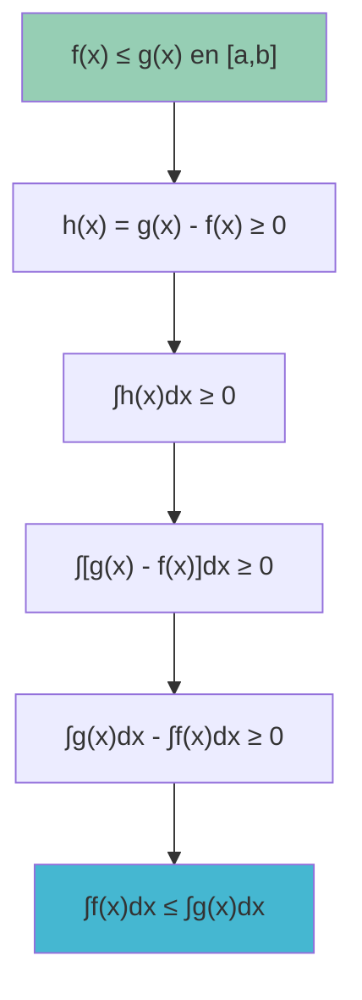
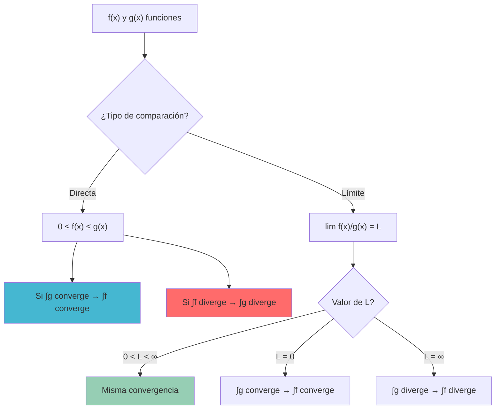

# ⚖️ Teoremas de Comparación y Desigualdades para Integrales

>[!info] 💡 **Concepto Central**
>Los teoremas de comparación y desigualdades proporcionan herramientas poderosas para estimar, acotar y comparar integrales definidas sin necesidad de evaluarlas exactamente. Son fundamentales para el análisis de convergencia de integrales impropias y la estimación de valores integrales.

## 🎯 Teorema Fundamental de Comparación

>[!tip] 🏆 **Teorema de Comparación Básico**
>Si $f(x) \leq g(x)$ para todo $x \in [a,b]$ y ambas funciones son integrables en $[a,b]$, entonces:
>
>$$\int_a^b f(x) dx \leq \int_a^b g(x) dx$$
>
>**Interpretación**: "La integral de la función menor es menor o igual que la integral de la función mayor"

>[!warning] ⚠️ **Condiciones Necesarias**
>- Ambas funciones deben ser **integrables** en $[a,b]$
>- La desigualdad $f(x) \leq g(x)$ debe cumplirse para **todo** $x \in [a,b]$
>- Si la desigualdad es estricta ($f(x) < g(x)$) excepto en un conjunto finito de puntos, entonces $\int_a^b f(x) dx < \int_a^b g(x) dx$

## 🧮 Demostración del Teorema Básico

>[!warning] 🔬 **Esquema de la Demostración**
>
>**Paso 1**: Definir $h(x) = g(x) - f(x) \geq 0$ para todo $x \in [a,b]$
>
>**Paso 2**: Como $h(x) \geq 0$, tenemos:
>$$\int_a^b h(x) dx \geq 0$$
>
>**Paso 3**: Por linealidad de la integral:
>$$\int_a^b h(x) dx = \int_a^b [g(x) - f(x)] dx = \int_a^b g(x) dx - \int_a^b f(x) dx$$
>
>**Paso 4**: Por tanto:
>$$\int_a^b g(x) dx - \int_a^b f(x) dx \geq 0$$
>
>**Conclusión**: $\int_a^b f(x) dx \leq \int_a^b g(x) dx$ ✓

## 📊 Corolarios Importantes

### 🔢 Corolario 1: Desigualdad Triangular para Integrales

>[!tip] 📐 **Desigualdad Triangular**
>Si $f$ es integrable en $[a,b]$, entonces:
>
>$$\left|\int_a^b f(x) dx\right| \leq \int_a^b |f(x)| dx$$
>
>**Interpretación**: "El valor absoluto de la integral es menor o igual que la integral del valor absoluto"

### 🔢 Corolario 2: Acotación por Constantes

>[!info] 📏 **Acotación Constante**
>Si $m \leq f(x) \leq M$ para todo $x \in [a,b]$, entonces:
>
>$$m(b-a) \leq \int_a^b f(x) dx \leq M(b-a)$$
>
>**Aplicación**: Proporciona cotas inmediatas para integrales

### 🔢 Corolario 3: Comparación con Funciones Elementales

>[!warning] ⚡ **Funciones de Referencia**
>Para estimar integrales complejas, se compara con:
>- **Polinomios**: $x^n$, especialmente para $x$ grande o pequeño
>- **Exponenciales**: $e^{-x}$, $e^{x}$ para comportamiento asintótico  
>- **Funciones potencia**: $\frac{1}{x^p}$ para singularidades
>- **Funciones trigonométricas acotadas**: $|\sin(x)| \leq 1$, $|\cos(x)| \leq 1$

## 🧪 Ejemplos Fundamentales

### 🔬 Ejemplo 1: Comparación Básica

>[!tip] 📈 **Comparar $\int_1^2 \frac{1}{x^2} dx$ y $\int_1^2 \frac{1}{x} dx$**
>
>**Análisis**: Para $x \in [1,2]$, ¿cuál es mayor: $\frac{1}{x^2}$ o $\frac{1}{x}$?
>
>Como $x \geq 1$, tenemos $x^2 \geq x$, por tanto $\frac{1}{x^2} \leq \frac{1}{x}$
>
>**Aplicación del teorema**:
>$$\int_1^2 \frac{1}{x^2} dx \leq \int_1^2 \frac{1}{x} dx$$
>
>**Verificación numérica**:
>- $\int_1^2 \frac{1}{x^2} dx = \left[-\frac{1}{x}\right]_1^2 = -\frac{1}{2} + 1 = \frac{1}{2}$
>- $\int_1^2 \frac{1}{x} dx = [\ln(x)]_1^2 = \ln(2) \approx 0.693$
>
>✅ Efectivamente: $0.5 < 0.693$

### 🔬 Ejemplo 2: Acotación por Constantes

>[!tip] 📐 **Estimar $\int_0^{\pi} x \sin(x) dx$**
>
>**Paso 1**: Encontrar cotas para $x \sin(x)$ en $[0,\pi]$
>- Como $0 \leq \sin(x) \leq 1$ para $x \in [0,\pi]$
>- Y $0 \leq x \leq \pi$ en el intervalo
>- Entonces: $0 \leq x \sin(x) \leq \pi \cdot 1 = \pi$
>
>**Paso 2**: Aplicar acotación constante
>$$0 \cdot (\pi - 0) \leq \int_0^{\pi} x \sin(x) dx \leq \pi \cdot (\pi - 0)$$
>$$0 \leq \int_0^{\pi} x \sin(x) dx \leq \pi^2$$
>
>**Verificación**: El valor exacto es $\pi$ (por integración por partes)
>✅ Efectivamente: $0 < \pi < \pi^2 \approx 9.87$

### 🔬 Ejemplo 3: Desigualdad Triangular

>[!warning] 📊 **Analizar $\int_{-1}^1 x^3 \sin(x^2) dx$**
>
>**Aplicación directa**: Sabemos que $|\sin(x^2)| \leq 1$, entonces:
>$$\left|\int_{-1}^1 x^3 \sin(x^2) dx\right| \leq \int_{-1}^1 |x^3 \sin(x^2)| dx \leq \int_{-1}^1 |x^3| dx$$
>
>**Evaluación**: Como la función $x^3 \sin(x^2)$ es impar:
>$$\int_{-1}^1 x^3 \sin(x^2) dx = 0$$
>
>**Verificación de cota**: $\int_{-1}^1 |x^3| dx = 2\int_0^1 x^3 dx = 2 \cdot \frac{1}{4} = \frac{1}{2}$
>✅ Efectivamente: $|0| = 0 \leq \frac{1}{2}$

## ⚖️ Teoremas de Comparación Avanzados

### 🎯 Teorema de Comparación en el Límite

>[!tip] 🔬 **Criterio de Comparación Límite**
>Sean $f(x) \geq 0$ y $g(x) > 0$ funciones continuas en $[a,b)$ donde $b$ puede ser infinito. Si:
>
>$$\lim_{x \to b^-} \frac{f(x)}{g(x)} = L$$
>
>donde $0 < L < \infty$, entonces:
>- $\int_a^b f(x) dx$ y $\int_a^b g(x) dx$ **convergen o divergen juntas**

>[!info] 🎯 **Casos Especiales del Límite**
>- Si $L = 0$ y $\int_a^b g(x) dx$ converge → $\int_a^b f(x) dx$ converge
>- Si $L = \infty$ y $\int_a^b g(x) dx$ diverge → $\int_a^b f(x) dx$ diverge

### 🔄 Criterio de Comparación Directa

>[!warning] ⚡ **Para Integrales Impropias**
>Sean $0 \leq f(x) \leq g(x)$ para $x \geq a$ (o cerca de una singularidad):
>
>**Convergencia**: Si $\int g(x) dx$ converge → $\int f(x) dx$ converge
>**Divergencia**: Si $\int f(x) dx$ diverge → $\int g(x) dx$ diverge

## 🌟 Funciones de Referencia Estándar

### 📚 Tabla de Funciones de Comparación Comunes

>[!info] 📋 **Funciones de Referencia para Comparación**

| **Tipo** | **Función** | **Comportamiento** | **Uso Principal** |
|----------|-------------|-------------------|------------------|
| **Potencias** | $\frac{1}{x^p}$ | $p > 1$: converge en $[1,\infty)$ | Integrales con singularidades |
| **Exponenciales** | $e^{-ax}$ $(a > 0)$ | Converge rápidamente | Funciones que decrecen exponencialmente |
| **Logarítmicas** | $\frac{1}{x \ln^p(x)}$ | $p > 1$: converge en $[2,\infty)$ | Funciones con decrecimiento logarítmico |
| **Trigonométricas** | $\frac{\sin(x)}{x^p}$ | Comportamiento oscilatorio acotado | Integrales oscilatorias |
| **Racionales** | $\frac{P(x)}{Q(x)}$ | Depende del grado | Funciones racionales complejas |

### 🎯 Estrategias de Selección de Función de Referencia

>[!tip] 💡 **Cómo Elegir la Función de Comparación**
>
>**Para $x \to \infty$**:
>1. Identificar el **término dominante** del numerador y denominador
>2. Simplificar a la forma más básica posible
>3. Comparar con funciones de referencia conocidas
>
>**Para $x \to a$ (singularidad)**:
>4. Analizar el **comportamiento local** cerca del punto singular
>5. Expandir en series si es necesario
>6. Comparar con $\frac{1}{(x-a)^p}$ o similar
>
>**Para funciones oscilatorias**:
>7. Usar **cotas** del tipo $|\sin(x)| \leq 1$, $|\cos(x)| \leq 1$
>8. Comparar con la **envolvente** de la función

## 🧪 Ejemplos de Criterios Avanzados

### 🔬 Ejemplo 4: Comparación en el Límite

>[!tip] 🔍 **Analizar la convergencia de $\int_1^{\infty} \frac{x^2 + 1}{x^4 + x^2 + 1} dx$**
>
>**Paso 1**: Identificar comportamiento para $x \to \infty$
>$$f(x) = \frac{x^2 + 1}{x^4 + x^2 + 1} \sim \frac{x^2}{x^4} = \frac{1}{x^2} \text{ cuando } x \to \infty$$
>
>**Paso 2**: Función de comparación $g(x) = \frac{1}{x^2}$
>$$\lim_{x \to \infty} \frac{f(x)}{g(x)} = \lim_{x \to \infty} \frac{\frac{x^2 + 1}{x^4 + x^2 + 1}}{\frac{1}{x^2}} = \lim_{x \to \infty} \frac{x^2(x^2 + 1)}{x^4 + x^2 + 1} = 1$$
>
>**Paso 3**: Como $\int_1^{\infty} \frac{1}{x^2} dx = 1$ (converge) y $L = 1$
>**Conclusión**: $\int_1^{\infty} \frac{x^2 + 1}{x^4 + x^2 + 1} dx$ **converge** ✅

### 🔬 Ejemplo 5: Comparación Directa

>[!warning] ⚡ **Determinar convergencia de $\int_0^1 \frac{\sin(x)}{\sqrt{x}} dx$**
>
>**Análisis del comportamiento cerca de $x = 0$**:
>- Sabemos que $\sin(x) \sim x$ cuando $x \to 0^+$
>- Entonces $\frac{\sin(x)}{\sqrt{x}} \sim \frac{x}{\sqrt{x}} = \sqrt{x}$ cerca de $x = 0$
>
>**Comparación directa**: Para $x$ pequeño:
>$$0 \leq \frac{\sin(x)}{\sqrt{x}} \leq \frac{x}{\sqrt{x}} = \sqrt{x}$$
>
>**Función de referencia**: $\int_0^1 \sqrt{x} dx = \int_0^1 x^{1/2} dx = \frac{2}{3}$ (converge)
>
>**Conclusión**: Por comparación directa, $\int_0^1 \frac{\sin(x)}{\sqrt{x}} dx$ **converge** ✅

## 🧠 Técnica de Estudio: Método COMPAR

>[!tip] 🎓 **Mnemotecnia COMPAR para Teoremas de Comparación**
>
>**C**omparar funciones y establecer desigualdades
>**O**rdenar las funciones (mayor, menor, igual)
>**M**ayorar o minorar según convenga
>**P**robar convergencia/divergencia de función de referencia
>**A**plicar el criterio de comparación apropiado
>**R**evisar y verificar el resultado

### 📋 Desarrollo Detallado del Método COMPAR

#### **C - Comparar Funciones** 🔍
- Identificar las funciones involucradas
- Establecer el dominio de comparación
- Determinar puntos problemáticos (singularidades, infinitos)

#### **O - Ordenar las Funciones** 📊
- Decidir cuál función es mayor/menor
- Verificar la desigualdad en todo el intervalo relevante
- Considerar comportamiento asintótico

#### **M - Mayorar o Minorar** ⚖️
- **Mayorar**: Encontrar función más grande que converja
- **Minorar**: Encontrar función más pequeña que diverja
- Elegir funciones de referencia apropiadas

#### **P - Probar Convergencia de Referencia** ✅
- Evaluar integral de la función de comparación
- Usar criterios conocidos (p-integrales, exponenciales, etc.)
- Verificar convergencia/divergencia

#### **A - Aplicar Criterio** ⚡
- **Comparación directa**: Si $0 \leq f \leq g$
- **Comparación límite**: Si $\lim \frac{f}{g} = L$
- Deducir resultado para la función original

#### **R - Revisar Resultado** 🔄
- Verificar coherencia del resultado
- Comprobar casos límite si es posible
- Validar con intuición física/geométrica

### 🎯 Ejemplo Aplicando COMPAR

>[!example] 📈 **Problema**: Analizar $\int_2^{\infty} \frac{1}{x \ln(x)} dx$

**C** - Comparar: Función problemática en infinito, comportamiento $\sim \frac{1}{x \ln(x)}$
**O** - Ordenar: Comparar con $\frac{1}{x}$ y $\frac{1}{x^2}$
**M** - Mayorar: Para $x \geq 2$, $\ln(x) \geq \ln(2) > 0$, entonces $\frac{1}{x \ln(x)} \leq \frac{1}{x \ln(2)}$
**P** - Probar: $\int_2^{\infty} \frac{1}{x} dx = \infty$ (diverge), pero necesitamos mayorante que converja
**A** - Aplicar: Mejor usar comparación límite con $\frac{1}{x}$: $\lim_{x \to \infty} \frac{\frac{1}{x \ln(x)}}{\frac{1}{x}} = \frac{1}{\ln(x)} \to 0$
**R** - Revisar: En realidad, $\int_2^{\infty} \frac{1}{x \ln(x)} dx = [\ln(\ln(x))]_2^{\infty} = \infty$ (diverge)

## ⚠️ Errores Comunes y Precauciones

>[!warning] 🚨 **Errores Frecuentes**
>
>1. **Desigualdad en sentido incorrecto**:
>   - ❌ Para probar convergencia, mayorar con función divergente
>   - ✅ Para probar convergencia, mayorar con función convergente
>
>2. **Intervalos de validez**:
>   - ❌ Aplicar desigualdad fuera del dominio donde es válida
>   - ✅ Verificar desigualdad en todo el intervalo de integración
>
>3. **Confundir criterios**:
>   - ❌ Usar comparación directa cuando el límite es 0 o ∞
>   - ✅ Elegir el criterio apropiado según el valor del límite
>
>4. **Funciones de referencia incorrectas**:
>   - ❌ Comparar $\frac{1}{x^2}$ con $\frac{1}{x}$ para probar divergencia
>   - ✅ Usar jerarquía correcta de funciones de referencia
>
>5. **Signos de las funciones**:
>   - ❌ Aplicar criterios sin verificar que $f(x) \geq 0$
>   - ✅ Asegurar positividad o usar valor absoluto

### 🔍 Casos Problemáticos

>[!info] ⚠️ **Situaciones que Requieren Cuidado Especial**
>
>**Funciones que cambian de signo**: Usar desigualdad triangular primero
>**Múltiples singularidades**: Dividir el intervalo y analizar cada parte
>**Comportamiento oscilatorio**: Distinguir entre oscilación acotada y no acotada
>**Funciones definidas por partes**: Verificar continuidad en los puntos de transición

## 🌟 Aplicaciones Especiales

### 🎯 Estimación de Integrales Definidas

>[!tip] 💡 **Uso Práctico para Estimaciones**
>Cuando no podemos evaluar $\int_a^b f(x) dx$ exactamente:
>
>1. **Encontrar cotas**: $m \leq f(x) \leq M$ en $[a,b]$
>2. **Aplicar desigualdad**: $m(b-a) \leq \int_a^b f(x) dx \leq M(b-a)$
>3. **Refinar estimación**: Dividir intervalo para cotas más precisas

### ⚡ Preparación para Integrales Impropias

>[!info] 🚀 **Base para Análisis de Convergencia**
>Los teoremas de comparación son **esenciales** para:
>- Determinar convergencia sin calcular la integral
>- Clasificar comportamiento asintótico
>- Establecer criterios de convergencia uniforme
>- Analizar series infinitas relacionadas

### 🌊 Aplicaciones en Análisis de Fourier

>[!warning] 📊 **Convergencia de Series de Fourier**
>Para determinar convergencia de coeficientes:
>$$a_n = \int_{-\pi}^{\pi} f(x) \cos(nx) dx$$
>
>Se usa comparación con $\frac{1}{n^p}$ según el comportamiento de $f(x)$.

---

## 📚 Referencias y Conexiones

### 🔗 Notas Relacionadas
- [[Propiedades de la Integral Definida]] - Base algebraica para las desigualdades
- [[Teorema del Valor Medio para Integrales]] - Herramienta para acotaciones
- [[Integral de Riemann]] - Definición formal subyacente
- [[Teorema fundamental del cálculo]] - Evaluación exacta cuando es posible

### 📖 Para Profundizar
- [[Integrales Impropias]] - Aplicación principal de estos teoremas
- [[Criterios de Convergencia]] - Extensión de los conceptos de comparación
- [[Series Infinitas]] - Análisis de convergencia análogo
- [[Análisis Asintótico]] - Comportamiento de funciones en límites

### 🎯 Notas Recomendadas
- [[Funciones de Referencia Estándar]] - Catálogo de funciones para comparación
- [[Estimación de Integrales]] - Aplicaciones prácticas de acotación
- [[Métodos de Aproximación]] - Técnicas numéricas complementarias
- [[Desigualdades Clásicas]] - Herramientas auxiliares (Cauchy-Schwarz, Hölder, etc.)

### 🧮 Aplicaciones Especializadas
- [[Análisis de Fourier]] - Convergencia de series trigonométricas
- [[Teoría de Probabilidades]] - Acotación de funciones de densidad
- [[Ecuaciones Diferenciales]] - Estimación de soluciones integrales
- [[Análisis Numérico]] - Control de errores en aproximaciones

---

### 🏷️ Tags
`#matematicas/calculo/teoremas` `#comparacion/integrales` `#desigualdades/analisis` `#convergencia/criterios` `#estimacion/valores` `#preparacion/impropias` `#herramientas/teoricas`