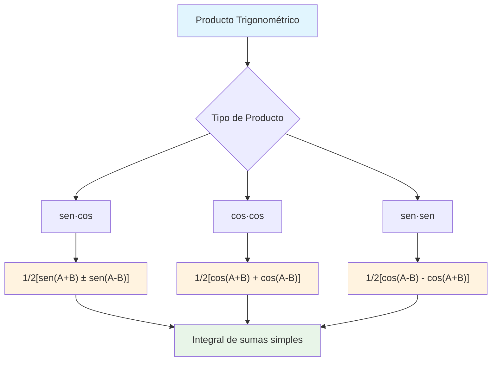
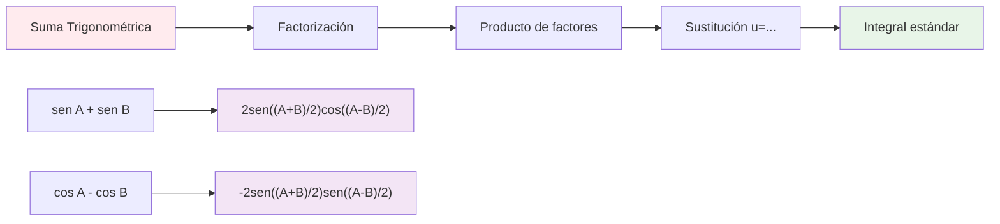
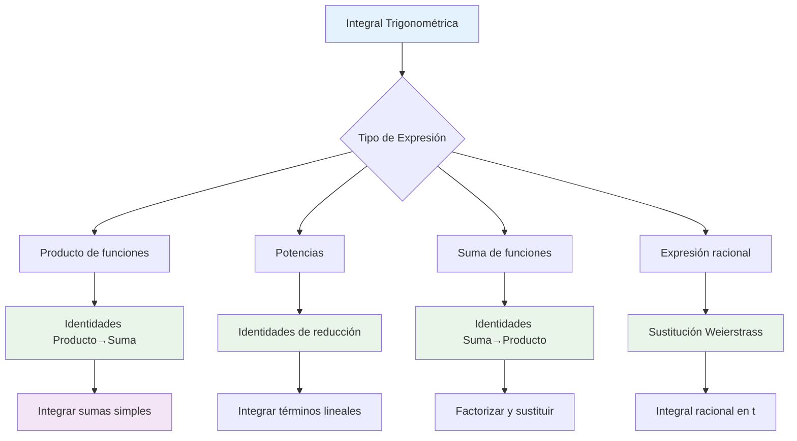

# 🌊 Identidades Trigonométricas para Integrales

## 🎯 Transformaciones Trigonométricas en Integración

> [!info] 💡 Concepto Fundamental Las **identidades trigonométricas** son herramientas poderosas que **simplifican integrales complejas** transformando productos en sumas, potencias en múltiples ángulos, y expresiones complicadas en formas integrables estándar.
> 
> **Filosofía clave:** _"Lo que parece imposible de integrar, a menudo solo necesita la identidad correcta"_

### 📐 Identidades de Producto a Suma

> [!success] ✅ Fórmulas de Producto a Suma Estas identidades **convierten productos de funciones trigonométricas en sumas**, facilitando enormemente la integración:
> 
> $$\sin A \cos B = \frac{1}{2}[\sin(A+B) + \sin(A-B)]$$ $$\cos A \sin B = \frac{1}{2}[\sin(A+B) - \sin(A-B)]$$ $$\cos A \cos B = \frac{1}{2}[\cos(A+B) + \cos(A-B)]$$ $$\sin A \sin B = \frac{1}{2}[\cos(A-B) - \cos(A+B)]$$

> [!example] 🔍 Ejemplo Clásico: Producto sen·cos **Integral:** $\int \sin(3x)\cos(5x) , dx$
> 
> **Aplicando la identidad:** $$\sin(3x)\cos(5x) = \frac{1}{2}[\sin(3x+5x) + \sin(3x-5x)]$$ $$= \frac{1}{2}[\sin(8x) + \sin(-2x)]$$ $$= \frac{1}{2}[\sin(8x) - \sin(2x)]$$
> 
> **Integrando:** $$\int \sin(3x)\cos(5x) , dx = \frac{1}{2}\int [\sin(8x) - \sin(2x)] , dx$$ $$= \frac{1}{2}\left[-\frac{\cos(8x)}{8} + \frac{\cos(2x)}{2}\right] + C$$ $$= -\frac{\cos(8x)}{16} + \frac{\cos(2x)}{4} + C$$

### ⚡ Identidades de Potencias

> [!tip] 🎯 Reducción de Potencias Para integrar **potencias de funciones trigonométricas**, usamos identidades que las expresan en términos de **múltiples ángulos**:
> 
> $$\sin^2 x = \frac{1 - \cos(2x)}{2}$$ $$\cos^2 x = \frac{1 + \cos(2x)}{2}$$ $$\tan^2 x = \sec^2 x - 1$$ $$\sin^3 x = \frac{3\sin x - \sin(3x)}{4}$$ $$\cos^3 x = \frac{3\cos x + \cos(3x)}{4}$$

|Potencia|Identidad de Reducción|Forma Integrable|
|---|---|---|
|$\sin^2 x$|$\frac{1 - \cos(2x)}{2}$|$\frac{1}{2}(x - \frac{\sin(2x)}{2})$|
|$\cos^2 x$|$\frac{1 + \cos(2x)}{2}$|$\frac{1}{2}(x + \frac{\sin(2x)}{2})$|
|$\sin^4 x$|$\frac{3 - 4\cos(2x) + \cos(4x)}{8}$|Términos lineales en $x$|

> [!example] 📊 Ejemplo: Integral de sen²(x) **Integral:** $\int \sin^2(x) , dx$
> 
> **Usando identidad de potencia:** $$\int \sin^2(x) , dx = \int \frac{1 - \cos(2x)}{2} , dx$$ $$= \frac{1}{2}\int (1 - \cos(2x)) , dx$$ $$= \frac{1}{2}\left[x - \frac{\sin(2x)}{2}\right] + C$$ $$= \frac{x}{2} - \frac{\sin(2x)}{4} + C$$

### 🔄 Identidades de Suma a Producto

> [!success] 🔄 Conversión Suma ↔ Producto Útiles para **factorizar** expresiones trigonométricas complejas:
> 
> $$\sin A + \sin B = 2\sin\left(\frac{A+B}{2}\right)\cos\left(\frac{A-B}{2}\right)$$ $$\sin A - \sin B = 2\cos\left(\frac{A+B}{2}\right)\sin\left(\frac{A-B}{2}\right)$$ $$\cos A + \cos B = 2\cos\left(\frac{A+B}{2}\right)\cos\left(\frac{A-B}{2}\right)$$ $$\cos A - \cos B = -2\sin\left(\frac{A+B}{2}\right)\sin\left(\frac{A-B}{2}\right)$$

### 🎭 Identidades de Ángulo Doble y Mitad

> [!info] ⚡ Ángulo Doble **Expansión hacia ángulos simples:** $$\sin(2x) = 2\sin x \cos x$$ $$\cos(2x) = \cos^2 x - \sin^2 x = 2\cos^2 x - 1 = 1 - 2\sin^2 x$$ $$\tan(2x) = \frac{2\tan x}{1 - \tan^2 x}$$

> [!info] 🔄 Ángulo Mitad **Reducción hacia ángulos dobles:** $$\sin^2\left(\frac{x}{2}\right) = \frac{1 - \cos x}{2}$$ $$\cos^2\left(\frac{x}{2}\right) = \frac{1 + \cos x}{2}$$ $$\tan^2\left(\frac{x}{2}\right) = \frac{1 - \cos x}{1 + \cos x}$$

> [!example] 🌟 Ejemplo Combinado: Integral Compleja **Integral:** $\int \sin^2(x)\cos^2(x) , dx$
> 
> **Estrategia múltiple:**
> 
> 1. **Reconocer patrón:** $\sin^2(x)\cos^2(x) = (\sin x \cos x)^2$
> 2. **Ángulo doble:** $\sin x \cos x = \frac{\sin(2x)}{2}$
> 3. **Por tanto:** $\sin^2(x)\cos^2(x) = \frac{\sin^2(2x)}{4}$
> 4. **Reducir potencia:** $\sin^2(2x) = \frac{1 - \cos(4x)}{2}$
> 
> **Resultado final:** $$\int \sin^2(x)\cos^2(x) , dx = \frac{1}{4}\int \frac{1 - \cos(4x)}{2} , dx$$ $$= \frac{1}{8}\int (1 - \cos(4x)) , dx$$ $$= \frac{1}{8}\left[x - \frac{\sin(4x)}{4}\right] + C$$ $$= \frac{x}{8} - \frac{\sin(4x)}{32} + C$$

### 🧮 Sustituciones Trigonométricas Específicas

> [!tip] 🎯 Sustitución de Weierstrass Para integrales **racionales en funciones trigonométricas**: $$t = \tan\left(\frac{x}{2}\right)$$
> 
> **Conversiones resultantes:** $$\sin x = \frac{2t}{1+t^2}, \quad \cos x = \frac{1-t^2}{1+t^2}, \quad dx = \frac{2}{1+t^2}dt$$

|Tipo de Integral|Sustitución Recomendada|Resultado|
|---|---|---|
|$\int \frac{dx}{a + b\cos x}$|$t = \tan(x/2)$|Integral racional en $t$|
|$\int \frac{dx}{a + b\sin x}$|$t = \tan(x/2)$|Integral racional en $t$|
|$\int R(\sin x, \cos x)dx$|$t = \tan(x/2)$|Función racional|

> [!example] 🔥 Ejemplo: Integral Racional Trigonométrica **Integral:** $\int \frac{dx}{2 + \cos x}$
> 
> **Sustitución de Weierstrass:** $t = \tan(x/2)$
> 
> - $\cos x = \frac{1-t^2}{1+t^2}$
> - $dx = \frac{2}{1+t^2}dt$
> 
> **Transformación:** $$\int \frac{dx}{2 + \cos x} = \int \frac{\frac{2}{1+t^2}dt}{2 + \frac{1-t^2}{1+t^2}}$$ $$= \int \frac{2dt}{2(1+t^2) + (1-t^2)} = \int \frac{2dt}{3+t^2}$$ $$= \frac{2}{\sqrt{3}}\arctan\left(\frac{t}{\sqrt{3}}\right) + C$$ $$= \frac{2}{\sqrt{3}}\arctan\left(\frac{\tan(x/2)}{\sqrt{3}}\right) + C$$

## 🎯 Estrategias de Selección de Identidades

## 🧠 Técnica de Estudio: Mnemotecnia "PRISA"

> [!tip] 🎓 Método "PRISA" para Identidades Trigonométricas
> 
> **P** - **P**roducto o Potencia (identificar el tipo) **R** - **R**econocer la identidad aplicable  
> **I** - **I**mplementar la transformación **S** - **S**implificar la expresión resultante **A** - **A**plicar técnicas estándar de integración
> 
> **Frase nemotécnica:** _"Para Resolver Integrales, Siempre Aplicar identidades"_

## 📋 Tabla de Referencia Rápida

> [!info] 🚀 Guía de Identidades por Situación

|Situación|Identidad Clave|Cuándo Usar|Resultado|
|---|---|---|---|
|$\int \sin(ax)\cos(bx)dx$|Producto→Suma|$a \neq b$|Suma de cosenos|
|$\int \sin^2(x)dx$|$\frac{1-\cos(2x)}{2}$|Potencias pares|Lineal en $x$|
|$\int \sin^n(x)\cos^m(x)dx$|Reducir el par|$n$ o $m$ par|Potencias menores|
|$\int \frac{dx}{a+b\cos x}$|$t=\tan(x/2)$|Racional|Integral en $t$|

### 🌟 Casos Especiales y Trucos Avanzados

> [!success] 💎 Identidades Menos Conocidas **Para potencias altas:** $$\sin^4 x = \frac{3 - 4\cos(2x) + \cos(4x)}{8}$$ $$\cos^4 x = \frac{3 + 4\cos(2x) + \cos(4x)}{8}$$
> 
> **Para productos de tres factores:** $$\sin A \sin B \sin C = \frac{1}{4}[\sin(A+B-C) + \sin(B+C-A) + \sin(C+A-B) - \sin(A+B+C)]$$

> [!warning] ⚠️ Errores Comunes a Evitar
> 
> **❌ Error frecuente:** Confundir signos en identidades
> 
> - $\cos A \cos B = \frac{1}{2}[\cos(A+B) + \cos(A-B)]$ ✅
> - $\cos A \cos B = \frac{1}{2}[\cos(A+B) - \cos(A-B)]$ ❌
> 
> **❌ Error frecuente:** Olvidar el factor $\frac{1}{2}$ **❌ Error frecuente:** No simplificar completamente antes de integrar

## 🎯 Ejercicios de Práctica Progresiva

> [!example] 💪 Secuencia de Entrenamiento
> 
> **Nivel 1 - Productos Básicos:** 🟢
> 
> - $\int \sin(2x)\cos(3x) , dx$
> - $\int \cos(4x)\cos(x) , dx$
> 
> **Nivel 2 - Potencias Simples:** 🟡
> 
> - $\int \sin^2(3x) , dx$
> - $\int \cos^4(x) , dx$
> 
> **Nivel 3 - Productos de Potencias:** 🟠
> 
> - $\int \sin^3(x)\cos^2(x) , dx$
> - $\int \sin^2(x)\cos^4(x) , dx$
> 
> **Nivel 4 - Racionales Trigonométricas:** 🔴
> 
> - $\int \frac{dx}{1 + \sin x}$
> - $\int \frac{\cos x}{2 + \sin x} , dx$

## 🔗 Conexiones con Otros Temas

> [!quote] 📚 Enlaces Conceptuales
> 
> **Prerrequisitos:**
> 
> - [[Identidades Trigonométricas Básicas]] - Fundamento teórico
> - [[Técnicas de Integración]] - Métodos generales
> - [[Sustitución Trigonométrica]] - Contexto más amplio
> 
> **Aplicaciones posteriores:**
> 
> - [[Series de Fourier]] - Análisis armónico
> - [[Ecuaciones Diferenciales]] - Soluciones trigonométricas
> - [[Análisis Complejo]] - Funciones trigonométricas complejas

## 📖 Referencias y Estudio Complementario

> [!info] 📝 Materiales Recomendados
> 
> **Temas relacionados:**
> 
> 1. **[[Integración por Partes]]** - Combinación de técnicas
> 2. **[[Fracciones Parciales]]** - Para expresiones racionales
> 3. **[[Completar el Cuadrado]]** - Preparación de formas estándar
> 
> **Aplicaciones avanzadas:** 4. **[[Integrales Definidas]]** - Evaluación numérica 5. **[[Aplicaciones Físicas]]** - Ondas y oscilaciones

---

**Tags:** #matemáticas #cálculo #integrales #trigonometría #identidades-trigonométricas #producto-suma #reducción-potencias #sustitución-weierstrass #técnicas-integración #análisis #university #calculus-advanced #trigonometric-integrals