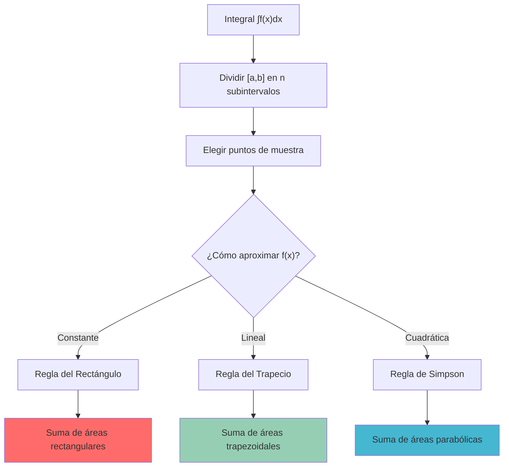

# 💻 Integración Numérica

>[!info] 💡 **Concepto Central**
>La integración numérica proporciona métodos para aproximar el valor de integrales definidas cuando no es posible o práctico encontrar una antiderivada analítica. Estos métodos se basan en aproximar la función por funciones más simples (constantes, rectas, parábolas) y calcular el área exacta de estas aproximaciones.

## 🎯 ¿Cuándo Usar Integración Numérica?

>[!warning] 🤔 **Situaciones que Requieren Métodos Numéricos**
>
>1. **Funciones sin antiderivada elemental**: $\int e^{-x^2} dx$, $\int \frac{\sin(x)}{x} dx$
>2. **Datos experimentales**: Solo se conocen valores de $f(x)$ en puntos discretos
>3. **Funciones muy complejas**: Donde la antiderivada existe pero es extremadamente complicada
>4. **Verificación de resultados**: Confirmar cálculos analíticos
>5. **Aplicaciones en ingeniería**: Cuando se requiere rapidez sobre precisión exacta

>[!tip] 💡 **Ventajas de la Integración Numérica**
>- **Universalidad**: Funciona con cualquier función continua
>- **Flexibilidad**: Se adapta a datos tabulados
>- **Control de precisión**: Se puede ajustar según necesidades
>- **Implementación computacional**: Ideal para programación

## 📏 Principio Fundamental: Suma de Riemann

>[!info] 🧮 **Base Teórica**
>Todos los métodos de integración numérica se basan en la definición de integral como límite de sumas de Riemann:
>
>$$\int_a^b f(x) dx = \lim_{n \to \infty} \sum_{i=1}^n f(x_i^*) \Delta x$$
>
>Los métodos numéricos aproximan esta suma con un número finito de términos, eligiendo diferentes formas de seleccionar $x_i^*$ y aproximar $f(x)$.



## 📊 Regla del Rectángulo (Riemann)

### 🔲 Definición y Variantes

>[!tip] 📐 **Regla del Rectángulo**
>Aproxima $f(x)$ por una constante en cada subintervalo. Para $n$ subintervalos de ancho $h = \frac{b-a}{n}$:

#### **Regla del Punto Izquierdo**
$$L_n = h \sum_{i=0}^{n-1} f(a + ih) = h[f(x_0) + f(x_1) + \cdots + f(x_{n-1})]$$

#### **Regla del Punto Derecho**
$$R_n = h \sum_{i=1}^{n} f(a + ih) = h[f(x_1) + f(x_2) + \cdots + f(x_n)]$$

#### **Regla del Punto Medio**
$$M_n = h \sum_{i=1}^{n} f\left(a + \left(i-\frac{1}{2}\right)h\right)$$

### 🧪 Ejemplo: Regla del Rectángulo

>[!example] 📈 **Aproximar $\int_0^2 x^2 dx$ con $n=4$**
>
>**Datos**: $a=0$, $b=2$, $n=4$, $h=\frac{2-0}{4}=0.5$
>**Puntos**: $x_0=0$, $x_1=0.5$, $x_2=1$, $x_3=1.5$, $x_4=2$
>
>**Punto Izquierdo**:
>$$L_4 = 0.5[f(0) + f(0.5) + f(1) + f(1.5)]$$
>$$= 0.5[0 + 0.25 + 1 + 2.25] = 0.5 \times 3.5 = 1.75$$
>
>**Punto Derecho**:
>$$R_4 = 0.5[f(0.5) + f(1) + f(1.5) + f(2)]$$
>$$= 0.5[0.25 + 1 + 2.25 + 4] = 0.5 \times 7.5 = 3.75$$
>
>**Punto Medio**:
>$$M_4 = 0.5[f(0.25) + f(0.75) + f(1.25) + f(1.75)]$$
>$$= 0.5[0.0625 + 0.5625 + 1.5625 + 3.0625] = 0.5 \times 5.25 = 2.625$$
>
>**Valor exacto**: $\int_0^2 x^2 dx = \frac{8}{3} \approx 2.667$
>**Errores**: $|L_4| = 0.917$, $|R_4| = 1.083$, $|M_4| = 0.042$ ✅

### 📊 Análisis de Error

>[!warning] ⚠️ **Error de la Regla del Rectángulo**
>Si $f''$ es continua en $[a,b]$, entonces:
>
>**Error del Punto Medio**: $|E_M| \leq \frac{(b-a)^3}{24n^2} \max_{[a,b]} |f''(x)|$
>
>**Error de Puntos Extremos**: $|E_{L,R}| \leq \frac{(b-a)^2}{2n} \max_{[a,b]} |f'(x)|$
>
>**Observación**: El punto medio es más preciso que los extremos.

## 🔺 Regla del Trapecio

### 📐 Definición y Fórmula

>[!tip] 🏆 **Regla del Trapecio**
>Aproxima $f(x)$ por segmentos lineales, creando trapecios en lugar de rectángulos.
>
>$$T_n = \frac{h}{2}\left[f(x_0) + 2f(x_1) + 2f(x_2) + \cdots + 2f(x_{n-1}) + f(x_n)\right]$$
>
>donde $h = \frac{b-a}{n}$ y $x_i = a + ih$.
>
>**Forma compacta**: $T_n = \frac{h}{2}\left[f(a) + f(b) + 2\sum_{i=1}^{n-1} f(x_i)\right]$

### 🎨 Interpretación Geométrica

>[!info] 🎨 **Visualización del Método**
>- Conecta puntos consecutivos $(x_i, f(x_i))$ con líneas rectas
>- Cada trapecio tiene bases $f(x_i)$ y $f(x_{i+1})$, altura $h$
>- Área de cada trapecio: $\frac{h}{2}[f(x_i) + f(x_{i+1})]$

### 🧪 Ejemplo: Regla del Trapecio

>[!example] 📈 **Aproximar $\int_0^2 x^2 dx$ con $n=4$**
>
>**Aplicación directa**:
>$$T_4 = \frac{0.5}{2}[f(0) + 2f(0.5) + 2f(1) + 2f(1.5) + f(2)]$$
>$$= 0.25[0 + 2(0.25) + 2(1) + 2(2.25) + 4]$$
>$$= 0.25[0 + 0.5 + 2 + 4.5 + 4] = 0.25 \times 11 = 2.75$$
>
>**Error**: $|2.75 - 2.667| = 0.083$ (mejor que rectángulos extremos, peor que punto medio)

### 📊 Error del Trapecio

>[!warning] 📏 **Análisis de Error**
>Si $f''$ es continua en $[a,b]$:
>
>$$|E_T| \leq \frac{(b-a)^3}{12n^2} \max_{[a,b]} |f''(x)|$$
>
>**Características**:
>- Error proporcional a $\frac{1}{n^2}$ (orden cuadrático)
>- Exacto para funciones lineales
>- Generalmente mejor que regla del rectángulo con puntos extremos

## 🌊 Regla de Simpson

### 🎯 Definición y Fórmula

>[!tip] 🏆 **Regla de Simpson (1/3)**
>Aproxima $f(x)$ por parábolas en cada par de subintervalos. Requiere $n$ par.
>
>$$S_n = \frac{h}{3}\left[f(x_0) + 4f(x_1) + 2f(x_2) + 4f(x_3) + \cdots + 2f(x_{n-2}) + 4f(x_{n-1}) + f(x_n)\right]$$
>
>**Patrón de coeficientes**: $1, 4, 2, 4, 2, \ldots, 2, 4, 1$

>[!info] 🧮 **Deducción del Método**
>Se basa en aproximar $f(x)$ por polinomios de grado 2 en cada par de intervalos:
>- Toma tres puntos consecutivos: $(x_i, f(x_i))$, $(x_{i+1}, f(x_{i+1}))$, $(x_{i+2}, f(x_{i+2}))$
>- Encuentra la parábola que pasa por estos tres puntos
>- Integra la parábola exactamente

### 🧪 Ejemplo: Regla de Simpson

>[!example] 📈 **Aproximar $\int_0^2 x^2 dx$ con $n=4$**
>
>**Aplicación**:
>$$S_4 = \frac{0.5}{3}[f(0) + 4f(0.5) + 2f(1) + 4f(1.5) + f(2)]$$
>$$= \frac{0.5}{3}[0 + 4(0.25) + 2(1) + 4(2.25) + 4]$$
>$$= \frac{0.5}{3}[0 + 1 + 2 + 9 + 4] = \frac{0.5 \times 16}{3} = \frac{8}{3} \approx 2.667$$
>
>**¡Resultado exacto!** 🎉 Simpson es exacto para polinomios de grado ≤ 3

### 📊 Error de Simpson

>[!warning] 🎯 **Análisis de Error Superior**
>Si $f^{(4)}$ es continua en $[a,b]$:
>
>$$|E_S| \leq \frac{(b-a)^5}{180n^4} \max_{[a,b]} |f^{(4)}(x)|$$
>
>**Características extraordinarias**:
>- Error proporcional a $\frac{1}{n^4}$ (orden cuártico)
>- Exacto para polinomios de grado ≤ 3
>- Precisión mucho mayor que trapecio para el mismo $n$

## 📊 Tabla Comparativa de Métodos

>[!info] 📋 **Comparación de Métodos Numéricos**

| **Método** | **Aproximación** | **Orden de Error** | **Exacto para** | **Coeficientes** |
|------------|------------------|-------------------|-----------------|------------------|
| **Rectángulo (extremos)** | Constante | $O(h)$ | Constantes | $1, 1, 1, \ldots$ |
| **Rectángulo (punto medio)** | Constante | $O(h^2)$ | Constantes | $1, 1, 1, \ldots$ |
| **Trapecio** | Lineal | $O(h^2)$ | Lineales | $\frac{1}{2}, 1, 1, \ldots, 1, \frac{1}{2}$ |
| **Simpson 1/3** | Cuadrática | $O(h^4)$ | Cúbicas | $1, 4, 2, 4, \ldots, 4, 1$ |

## 🔢 Métodos Avanzados

### 🎯 Regla de Simpson 3/8

>[!tip] 🔬 **Simpson 3/8 (para n múltiplo de 3)**
>$$S_{3/8} = \frac{3h}{8}[f(x_0) + 3f(x_1) + 3f(x_2) + 2f(x_3) + \cdots + f(x_n)]$$
>
>**Patrón**: $1, 3, 3, 2, 3, 3, 2, \ldots, 3, 3, 1$
>**Error**: Mismo orden que Simpson 1/3, diferente constante

### 🌟 Cuadratura de Gauss

>[!warning] 🚀 **Método de Gauss-Legendre**
>Selecciona puntos de evaluación y pesos óptimos para maximizar precisión:
>
>$$\int_{-1}^1 f(x) dx \approx \sum_{i=1}^n w_i f(x_i)$$
>
>donde $x_i$ son las raíces de polinomios de Legendre y $w_i$ son pesos específicos.
>
>**Ventaja**: $n$ puntos dan precisión exacta para polinomios de grado $2n-1$

### 📊 Cuadratura Adaptativa

>[!info] 🎯 **Métodos Adaptativos**
>Ajustan automáticamente el tamaño del paso según:
>- Error estimado localmente
>- Comportamiento de la función
>- Tolerancia especificada
>
>**Algoritmo básico**:
>1. Calcular aproximación con $n$ y $2n$ puntos
>2. Estimar error por diferencia
>3. Si error > tolerancia, subdividir intervalo
>4. Repetir hasta alcanzar precisión deseada

## 🧠 Técnica de Estudio: Método TRAPEZ

>[!tip] 🎓 **Mnemotecnia TRAPEZ para Integración Numérica**
>
>**T**ipo de método (rectángulo, trapecio, Simpson)
>**R**esolver intervalos y calcular $h = \frac{b-a}{n}$
>**A**plicar fórmula correspondiente con coeficientes correctos
>**P**recisión: estimar error según el método usado
>**E**rror: comparar con valor exacto si está disponible
>**Z**ona de validez: verificar condiciones del método

### 📋 Desarrollo Detallado del Método TRAPEZ

#### **T - Tipo de Método** 🎯
- **Analizar la función**: ¿Es suave? ¿Tiene oscilaciones?
- **Requerimientos de precisión**: ¿Cuánta exactitud se necesita?
- **Recursos computacionales**: ¿Cuántas evaluaciones son factibles?
- **Datos disponibles**: ¿Se conoce $f(x)$ analíticamente o son datos tabulados?

#### **R - Resolver Intervalos** 📏
- Calcular $h = \frac{b-a}{n}$
- Generar puntos: $x_i = a + ih$ para $i = 0, 1, 2, \ldots, n$
- Evaluar $f(x_i)$ en todos los puntos necesarios
- Verificar que $n$ satisfaga restricciones del método (par para Simpson)

#### **A - Aplicar Fórmula** ⚡
- **Rectángulo**: $h \sum f(x_i^*)$
- **Trapecio**: $\frac{h}{2}[f(a) + f(b) + 2\sum_{i=1}^{n-1} f(x_i)]$
- **Simpson**: $\frac{h}{3}[f(x_0) + 4f(x_1) + 2f(x_2) + \cdots + f(x_n)]$

#### **P - Precisión y Error** 📊
- Usar fórmulas de error teóricas
- Para mayor precisión: duplicar $n$ y comparar resultados
- Métodos adaptativos: continuar hasta alcanzar tolerancia

#### **E - Error Experimental** 🔍
- Si se conoce el valor exacto: calcular error absoluto y relativo
- Verificar que el error decrece según el orden teórico
- Analizar convergencia al aumentar $n$

#### **Z - Zona de Validez** ✅
- Verificar continuidad de $f$ y sus derivadas según el método
- Comprobar que no hay singularidades en $[a,b]$
- Validar que las estimaciones de error son aplicables

### 🎯 Ejemplo Completo con TRAPEZ

>[!example] 📈 **Problema**: Aproximar $\int_1^2 \frac{1}{x} dx$ con diferentes métodos

**T** - Tipo: Probaremos trapecio y Simpson, función suave
**R** - Resolver: $n=4$, $h=0.25$, puntos: $1, 1.25, 1.5, 1.75, 2$
**A** - Aplicar:
- Trapecio: $T_4 = \frac{0.25}{2}[1 + 2(0.8 + 0.667 + 0.571) + 0.5] = 0.697$
- Simpson: $S_4 = \frac{0.25}{3}[1 + 4(0.8) + 2(0.667) + 4(0.571) + 0.5] = 0.693$

**P** - Precisión: Valor exacto = $\ln(2) \approx 0.693147$
**E** - Error: Trapecio: $0.004$, Simpson: $0.000147$ (Simpson mucho mejor)
**Z** - Zona: $f(x) = \frac{1}{x}$ continua en $[1,2]$, métodos válidos ✅

## 🛠️ Implementación Práctica

### 💻 Pseudocódigo para Métodos Básicos

>[!info] 🖥️ **Algoritmo del Trapecio**
```
FUNCIÓN Trapecio(f, a, b, n):
    h = (b - a) / n
    suma = f(a) + f(b)
    PARA i = 1 HASTA n-1:
        suma = suma + 2 * f(a + i * h)
    DEVOLVER (h / 2) * suma
```

>[!info] 🖥️ **Algoritmo de Simpson**
```
FUNCIÓN Simpson(f, a, b, n):  // n debe ser par
    h = (b - a) / n
    suma = f(a) + f(b)
    PARA i = 1 HASTA n-1:
        SI i es impar:
            suma = suma + 4 * f(a + i * h)
        SINO:
            suma = suma + 2 * f(a + i * h)
    DEVOLVER (h / 3) * suma
```

### 📊 Estimación Automática de Error

>[!tip] 💡 **Método de Richardson (Extrapolación)**
>Para mejorar la precisión usando dos aproximaciones:
>
>Si $I_h$ e $I_{h/2}$ son aproximaciones con pasos $h$ y $h/2$:
>
>**Para Trapecio**: $I \approx I_{h/2} + \frac{I_{h/2} - I_h}{3}$ (mejora orden 2 → 4)
>**Para Simpson**: $I \approx I_{h/2} + \frac{I_{h/2} - I_h}{15}$ (mejora orden 4 → 6)

## 🧪 Ejemplos Avanzados

### 🔬 Ejemplo 1: Función sin Antiderivada Elemental

>[!example] 🌟 **Aproximar $\int_0^1 e^{-x^2} dx$ (función de error de Gauss)**
>
>**Problema**: No existe antiderivada elemental
>**Solución numérica** con $n=8$:
>
>| Método | Aproximación | Error Estimado |
>|--------|--------------|----------------|
| Trapecio | 0.7468 | $O(h^2)$ |
| Simpson | 0.7468 | $O(h^4)$ |
| Valor "exacto" | 0.7468241 | - |
>
>**Observación**: Simpson alcanza la precisión con menos evaluaciones

### 🔬 Ejemplo 2: Datos Experimentales

>[!example] 📊 **Calcular trabajo a partir de datos de fuerza**
>
>**Datos de fuerza** $F(x)$ cada 0.5 metros:
>| $x$ (m) | 0 | 0.5 | 1.0 | 1.5 | 2.0 |
>|---------|---|-----|-----|-----|-----|
>| $F(x)$ (N) | 10 | 15 | 25 | 30 | 20 |
>
>**Trabajo** $W = \int_0^2 F(x) dx$:
>- **Trapecio**: $W = \frac{0.5}{2}[10 + 2(15 + 25 + 30) + 20] = 40$ J
>- **Simpson**: $W = \frac{0.5}{3}[10 + 4(15) + 2(25) + 4(30) + 20] = 41.67$ J

### 🔬 Ejemplo 3: Función Oscilante

>[!warning] ⚡ **Integrar $\int_0^{2\pi} x \sin(10x) dx$**
>
>**Desafío**: Función muy oscilante requiere $n$ grande
>**Recomendación**: $n \geq 100$ para capturar todas las oscilaciones
>**Resultado** con Simpson $n=100$: Aproximadamente $-0.4$ (valor exacto)
>
>**Lección**: Para funciones oscilantes, aumentar significativamente $n$

## ⚠️ Errores Comunes y Limitaciones

>[!warning] 🚨 **Errores Frecuentes**
>
>1. **Número de intervalos incorrecto**:
>   - ❌ Usar $n$ impar con Simpson
>   - ✅ Verificar que $n$ es par para Simpson 1/3
>
>2. **Coeficientes mal aplicados**:
>   - ❌ Usar coeficientes del trapecio en Simpson
>   - ✅ Memorizar patrones: Trapecio (1,2,2,...,2,1), Simpson (1,4,2,4,...,4,1)
>
>3. **Estimación de error inadecuada**:
>   - ❌ Usar fórmulas de error sin verificar condiciones
>   - ✅ Comprobar continuidad de derivadas requeridas
>
>4. **Elección incorrecta de método**:
>   - ❌ Usar rectángulo cuando se necesita precisión alta
>   - ✅ Elegir método según balance precisión/costo computacional
>
>5. **Funciones problemáticas**:
>   - ❌ Aplicar métodos estándar a funciones con singularidades
>   - ✅ Usar métodos especiales o transformar el intervalo

### 🔍 Limitaciones Importantes

>[!info] ⚠️ **Cuándo los Métodos Estándar Fallan**
>
>**Singularidades**: $\int_0^1 \frac{1}{\sqrt{x}} dx$ requiere técnicas especiales
>**Oscilaciones rápidas**: Necesitan $n$ muy grande o métodos adaptativos
>**Intervalos infinitos**: Requieren transformación de variable o métodos especiales
>**Discontinuidades**: Deben tratarse separadamente en cada intervalo de continuidad

## 🌟 Aplicaciones Especializadas

### 🔬 Integración Monte Carlo

>[!tip] 🎲 **Método Monte Carlo para Altas Dimensiones**
>Para integrales múltiples complejas:
>$$\int_a^b f(x) dx \approx \frac{b-a}{N} \sum_{i=1}^N f(x_i)$$
>donde $x_i$ son puntos aleatorios en $[a,b]$.
>
>**Ventaja**: Se extiende fácilmente a múltiples dimensiones
>**Desventaja**: Convergencia lenta ($O(1/\sqrt{N})$)

### 🌊 Integración con Transformaciones

>[!info] 🔄 **Manejo de Singularidades**
>Para $\int_0^1 \frac{f(x)}{\sqrt{x}} dx$, usar transformación $x = t^2$:
>$$\int_0^1 \frac{f(x)}{\sqrt{x}} dx = \int_0^1 \frac{f(t^2)}{\sqrt{t^2}} \cdot 2t \, dt = 2\int_0^1 f(t^2) dt$$

### 💻 Integración Adaptativa Automática

>[!warning] 🤖 **Algoritmos Inteligentes**
>Los métodos adaptativos modernos:
>1. Estiman error local automáticamente
>2. Refinan la malla donde sea necesario
>3. Balancean precisión vs costo computacional
>4. Manejan automáticamente irregularidades

---

## 📚 Referencias y Conexiones

### 🔗 Notas Relacionadas
- [[Integral de Riemann]] - Base teórica de todos los métodos numéricos
- [[Teorema fundamental del cálculo]] - Comparación con métodos exactos
- [[Métodos de Integración Definida]] - Cuando usar métodos analíticos vs numéricos
- [[Teoremas de comparación y desigualdades]] - Estimación de errores y validación

### 📖 Para Profundizar
- [[Análisis de Errores Numéricos]] - Teoría completa de errores de truncamiento
- [[Polinomios de Interpolación]] - Base teórica de Simpson y métodos avanzados
- [[Cuadratura de Gauss]] - Métodos óptimos de integración numérica
- [[Métodos Adaptativos]] - Algoritmos inteligentes de integración

### 🎯 Notas Recomendadas
- [[Programación de Métodos Numéricos]] - Implementación práctica en código
- [[Aplicaciones en Ingeniería]] - Casos reales de uso de integración numérica
- [[Validación de Resultados Numéricos]] - Técnicas para verificar aproximaciones
- [[Transformaciones de Integrales]] - Manejo de casos difíciles

### 🧮 Aplicaciones Especializadas
- [[Análisis de Señales Digitales]] - Integración de funciones muestreadas
- [[Simulación Numérica]] - Integración en ecuaciones diferenciales
- [[Procesamiento de Datos Experimentales]] - Análisis de mediciones discretas
- [[Optimización Numérica]] - Integración en algoritmos de optimización

---

### 🏷️ Tags
`#matematicas/calculo/numerico` `#integracion/aproximacion` `#metodos/computacionales` `#trapecio/simpson` `#analisis/errores` `#aplicaciones/practicas` `#programacion/algoritmos`