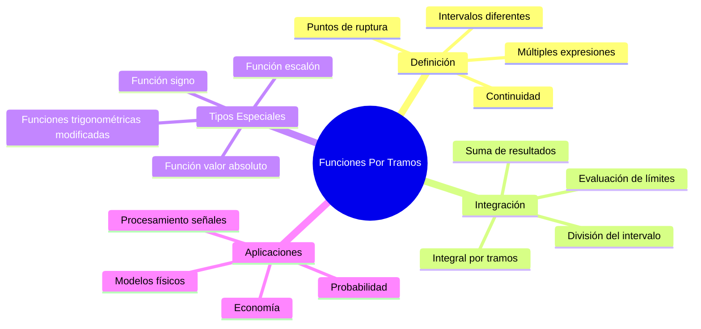

# 🧩 Integral de Funciones Por Tramos

## 📖 Introducción

> [!info] 💡 Concepto Fundamental
> Una **función por tramos** (o función definida a trozos) es una función que se define mediante diferentes expresiones en diferentes intervalos de su dominio. La integración de estas funciones requiere dividir el intervalo de integración según los puntos donde cambia la definición de la función.

> [!tip] 🎯 ¿Por qué son importantes?
> - Modelan **situaciones reales** con comportamientos diferentes en distintos rangos
> - Aparecen en **física** (leyes que cambian según condiciones)
> - Son fundamentales en **procesamiento de señales**
> - Esenciales en **economía** (funciones de costo, impuestos progresivos)
> - Base para **funciones especiales** (función escalón, función signo)
> - Importantes en **probabilidad** (distribuciones mixtas)

## 🔗 Conexiones con Otros Temas

> [!info] 🌐 Temas Relacionados y Conexiones
> 
> **Fundamentos Previos**:
> • **Integrales Definidas** - Base conceptual fundamental
> • **Propiedades de la Integral Definida** - Aditividad respecto al intervalo
> • **Teorema fundamental del cálculo** - Evaluación de cada tramo
> • **Continuidad** - Análisis de puntos de ruptura
> • **Límites laterales** - Comportamiento en puntos de cambio
> 
> **Desarrollos Posteriores**:
> • **Area bajo la Curva** - Cálculo de áreas con diferentes reglas
> • **Aplicaciones Geometricas** - Problemas con condiciones variables
> • **Integrales Impropias** - Cuando hay discontinuidades infinitas
> • **Transformadas** - Fourier de funciones por tramos
> • **Ecuaciones diferenciales** - Con coeficientes por tramos



---

## 🔤 Definición y Notación

> [!note] 📝 Definición Formal
> Una función $f(x)$ está **definida por tramos** en el intervalo $[a,b]$ si existen puntos:
> $$a = x_0 < x_1 < x_2 < \cdots < x_n = b$$
> 
> tal que en cada subintervalo $(x_{i-1}, x_i)$, la función tiene una expresión específica:
> 
> $$f(x) = \begin{cases}
> f_1(x) & \text{si } x \in [x_0, x_1) \\
> f_2(x) & \text{si } x \in [x_1, x_2) \\
> \vdots & \vdots \\
> f_n(x) & \text{si } x \in [x_{n-1}, x_n]
> \end{cases}$$

> [!warning] ⚠️ Elementos clave
> - **Puntos de ruptura**: $x_1, x_2, \ldots, x_{n-1}$ donde cambia la definición
> - **Intervalos**: Cada tramo tiene su propia expresión
> - **Inclusión de extremos**: Cuidado con intervalos abiertos/cerrados
> - **Continuidad**: Puede ser continua o discontinua en los puntos de ruptura
> - **Integrabilidad**: Generalmente integrable si cada tramo es continuo

---

## 🧮 Teorema Fundamental para Funciones Por Tramos

> [!success] ✅ Teorema de Integración Por Tramos
> Si $f(x)$ está definida por tramos en $[a,b]$ con puntos de ruptura $x_1, x_2, \ldots, x_{n-1}$, y cada tramo es integrable, entonces:
> 
> $$\int_a^b f(x) \, dx = \sum_{i=1}^{n} \int_{x_{i-1}}^{x_i} f_i(x) \, dx$$
> 
> donde $f_i(x)$ es la expresión de $f(x)$ en el intervalo $[x_{i-1}, x_i]$.

> [!info] 🔍 Condiciones de Aplicabilidad
> 1. **Cada tramo** debe ser **integrable** (generalmente continuo)
> 2. **Número finito** de puntos de ruptura en cualquier intervalo cerrado
> 3. **Discontinuidades** en puntos de ruptura no afectan la integral (medida cero)
> 4. **Valores en puntos de ruptura** pueden definirse arbitrariamente

---

## 🛠️ Proceso Paso a Paso

> [!tip] 📋 Método Sistemático
> 
> **Paso 1**: **Identificar** los puntos de ruptura en el intervalo $[a,b]$
> 
> **Paso 2**: **Dividir** el intervalo de integración según estos puntos
> 
> **Paso 3**: **Escribir** la integral como suma de integrales en cada subintervalo
> 
> **Paso 4**: **Integrar** cada tramo usando la expresión correspondiente
> 
> **Paso 5**: **Sumar** todos los resultados parciales
> 
> **Paso 6**: **Verificar** el resultado (continuidad, comportamiento esperado)

---

## 💡 Ejemplos Desarrollados

> [!example] 🎯 Ejemplo 1: Función Valor Absoluto
> **Evaluar**: $\int_{-2}^{3} \lvert x \rvert \, dx$
> 
> **Paso 1**: Identificar la definición por tramos
> $$\lvert x \rvert = \begin{cases}
> -x & \text{si } x < 0 \\
> x & \text{si } x \geq 0
> \end{cases}$$
> 
> **Paso 2**: Punto de ruptura en $x = 0$, dividir el intervalo
> $$\int_{-2}^{3} \lvert x \rvert \, dx = \int_{-2}^{0} \lvert x \rvert \, dx + \int_{0}^{3} \lvert x \rvert \, dx$$
> 
> **Paso 3**: Aplicar definiciones en cada tramo
> $$= \int_{-2}^{0} (-x) \, dx + \int_{0}^{3} x \, dx$$
> 
> **Paso 4**: Integrar cada parte
> $$= \left[-\frac{x^2}{2}\right]_{-2}^{0} + \left[\frac{x^2}{2}\right]_{0}^{3}$$
> 
> **Paso 5**: Evaluar límites
> $$= \left(0 - \left(-\frac{4}{2}\right)\right) + \left(\frac{9}{2} - 0\right)$$
> $$= 2 + \frac{9}{2} = \frac{13}{2}$$

> [!example] 🎯 Ejemplo 2: Función Escalón Modificada
> **Evaluar**: $\int_{0}^{4} f(x) \, dx$ donde:
> $$f(x) = \begin{cases}
> x^2 & \text{si } 0 \leq x < 1 \\
> 2 & \text{si } 1 \leq x < 3 \\
> 5-x & \text{si } 3 \leq x \leq 4
> \end{cases}$$
> 
> **Paso 1**: Puntos de ruptura: $x = 1$ y $x = 3$
> 
> **Paso 2**: Dividir la integral
> $$\int_{0}^{4} f(x) \, dx = \int_{0}^{1} f(x) \, dx + \int_{1}^{3} f(x) \, dx + \int_{3}^{4} f(x) \, dx$$
> 
> **Paso 3**: Aplicar cada definición
> $$= \int_{0}^{1} x^2 \, dx + \int_{1}^{3} 2 \, dx + \int_{3}^{4} (5-x) \, dx$$
> 
> **Paso 4**: Integrar término a término
> $$= \left[\frac{x^3}{3}\right]_{0}^{1} + [2x]_{1}^{3} + \left[5x - \frac{x^2}{2}\right]_{3}^{4}$$
> 
> **Paso 5**: Evaluar cada integral
> $$= \left(\frac{1}{3} - 0\right) + (6 - 2) + \left(\left(20 - 8\right) - \left(15 - \frac{9}{2}\right)\right)$$
> $$= \frac{1}{3} + 4 + \left(12 - \frac{21}{2}\right)$$
> $$= \frac{1}{3} + 4 + \frac{24 - 21}{2} = \frac{1}{3} + 4 + \frac{3}{2}$$
> $$= \frac{2 + 24 + 9}{6} = \frac{35}{6}$$

> [!example] 🎯 Ejemplo 3: Función Trigonométrica Por Tramos
> **Evaluar**: $\int_{0}^{2\pi} g(x) \, dx$ donde:
> $$g(x) = \begin{cases}
> \sin x & \text{si } 0 \leq x \leq \pi \\
> 0 & \text{si } \pi < x \leq 2\pi
> \end{cases}$$
> 
> **Paso 1**: Punto de ruptura en $x = \pi$
> 
> **Paso 2**: Dividir la integral
> $$\int_{0}^{2\pi} g(x) \, dx = \int_{0}^{\pi} g(x) \, dx + \int_{\pi}^{2\pi} g(x) \, dx$$
> 
> **Paso 3**: Aplicar definiciones
> $$= \int_{0}^{\pi} \sin x \, dx + \int_{\pi}^{2\pi} 0 \, dx$$
> 
> **Paso 4**: Evaluar
> $$= [-\cos x]_{0}^{\pi} + 0$$
> $$= (-\cos \pi - (-\cos 0)) = -(-1) - (-1) = 1 + 1 = 2$$

> [!example] 🎯 Ejemplo 4: Función Cuadrática Por Tramos
> **Evaluar**: $\int_{-1}^{2} h(x) \, dx$ donde:
> $$h(x) = \begin{cases}
> x^2 + 1 & \text{si } -1 \leq x < 0 \\
> 2x & \text{si } 0 \leq x < 1 \\
> x^3 & \text{si } 1 \leq x \leq 2
> \end{cases}$$
> 
> **Paso 1**: Puntos de ruptura: $x = 0$ y $x = 1$
> 
> **Paso 2**: Dividir la integral
> $$\int_{-1}^{2} h(x) \, dx = \int_{-1}^{0} (x^2 + 1) \, dx + \int_{0}^{1} 2x \, dx + \int_{1}^{2} x^3 \, dx$$
> 
> **Paso 3**: Integrar cada parte
> $$= \left[\frac{x^3}{3} + x\right]_{-1}^{0} + [x^2]_{0}^{1} + \left[\frac{x^4}{4}\right]_{1}^{2}$$
> 
> **Paso 4**: Evaluar límites
> $$= \left(0 - \left(-\frac{1}{3} - 1\right)\right) + (1 - 0) + \left(\frac{16}{4} - \frac{1}{4}\right)$$
> $$= \frac{4}{3} + 1 + \frac{15}{4} = \frac{16 + 12 + 45}{12} = \frac{73}{12}$$

---

## 🎯 Casos Especiales Importantes

### Función Signo

> [!tip] 📊 Función Signo
> $$\text{sgn}(x) = \begin{cases}
> -1 & \text{si } x < 0 \\
> 0 & \text{si } x = 0 \\
> 1 & \text{si } x > 0
> \end{cases}$$
> 
> **Integral**: $\int_{-a}^{a} \text{sgn}(x) \, dx = 0$ para cualquier $a > 0$

### Función Escalón Unitario (Heaviside)

> [!tip] 📊 Función de Heaviside
> $$H(x) = \begin{cases}
> 0 & \text{si } x < 0 \\
> 1 & \text{si } x \geq 0
> \end{cases}$$
> 
> **Integral**: $\int_{-a}^{b} H(x) \, dx = b$ para $a > 0, b > 0$

### Función Parte Entera

> [!tip] 📊 Función Floor
> $$\lfloor x \rfloor = \max\{n \in \mathbb{Z} : n \leq x\}$$
> 
> **En intervalo $[0,3]$**:
> $$\lfloor x \rfloor = \begin{cases}
> 0 & \text{si } 0 \leq x < 1 \\
> 1 & \text{si } 1 \leq x < 2 \\
> 2 & \text{si } 2 \leq x < 3 \\
> 3 & \text{si } x = 3
> \end{cases}$$

### Función Diente de Sierra

> [!tip] 📊 Función Sawtooth
> $$\text{saw}(x) = x - \lfloor x \rfloor$$
> 
> **Periódica** con período 1, valores en $[0,1)$

---

## 🧠 Estrategias de Resolución

> [!success] 🎯 Estrategias Generales
> 
> **1. Análisis previo**:
> - Identifica **todos** los puntos de ruptura en el intervalo
> - Verifica la **continuidad** en cada punto
> - Determina si hay **discontinuidades removibles**
> 
> **2. División sistemática**:
> - Ordena los puntos de ruptura
> - Divide el intervalo en subintervalos apropiados
> - Asegúrate de que no se omita ningún subintervalo
> 
> **3. Integración cuidadosa**:
> - Usa la expresión correcta en cada subintervalo
> - Verifica los límites de integración
> - Mantén track de los signos
> 
> **4. Verificación**:
> - Comprueba que la suma de intervalos cubra todo $[a,b]$
> - Verifica el comportamiento esperado (monotonía, signos)
> - Usa métodos alternativos cuando sea posible

> [!tip] 💡 Trucos y Técnicas Especiales
> 
> **Para funciones simétricas**:
> - Usa propiedades de simetría para simplificar
> - $\int_{-a}^{a} f(x) \, dx = 2\int_{0}^{a} f(x) \, dx$ si $f$ es par
> 
> **Para funciones periódicas**:
> - Calcula la integral en un período y multiplica
> - $\int_{0}^{nT} f(x) \, dx = n \int_{0}^{T} f(x) \, dx$
> 
> **Para optimizar cálculos**:
> - Busca patrones en los resultados parciales
> - Usa linealidad para factorizar términos comunes

---

## 📊 Visualización e Interpretación Geométrica

> [!info] 📈 Interpretación Geométrica
> 
> La integral de una función por tramos representa la **suma algebraica de áreas** bajo cada tramo de la curva:
> 
> - **Áreas positivas**: Donde $f(x) > 0$
> - **Áreas negativas**: Donde $f(x) < 0$
> - **Puntos de ruptura**: No afectan el valor de la integral
> - **Discontinuidades de salto**: Se manejan automáticamente

```mermaid
graph TD
    A[Función por tramos] --> B[División en intervalos]
    B --> C[Cálculo de área en cada tramo]
    C --> D[Suma algebraica de áreas]
    
    E[Tramo 1: Área A₁] --> F[Suma total]
    G[Tramo 2: Área A₂] --> F
    H[Tramo 3: Área A₃] --> F
    I[...] --> F
    J[Tramo n: Área Aₙ] --> F
    
    F --> K[∫f(x)dx = A₁ + A₂ + A₃ + ... + Aₙ]
    
    style A fill:#ffecb3
    style F fill:#c8e6c9
    style K fill:#e8f5e8
```

---

## ⚠️ Errores Comunes y Cómo Evitarlos

> [!warning] 🚨 Errores Frecuentes
> 
> **1. Omitir puntos de ruptura**
> - ❌ No identificar todos los cambios en la definición
> - ✅ Graficar la función o analizarla sistemáticamente
> 
> **2. Límites de integración incorrectos**
> - ❌ Usar intervalos que se solapan o dejan huecos
> - ✅ Verificar que $\bigcup_{i=1}^{n} [x_{i-1}, x_i] = [a,b]$
> 
> **3. Expresión incorrecta en intervalos**
> - ❌ Usar la expresión equivocada en un subintervalo
> - ✅ Verificar cada expresión con valores de prueba
> 
> **4. Manejo incorrecto de extremos**
> - ❌ Confundir intervalos abiertos y cerrados
> - ✅ Los valores en puntos de ruptura no afectan la integral
> 
> **5. Errores aritméticos en la suma final**
> - ❌ Sumar incorrectamente los resultados parciales
> - ✅ Verificar cada suma parcial antes del resultado final

> [!tip] 💡 Mejores Prácticas
> 
> **Organización sistemática**:
> - Haz una tabla con intervalos y expresiones correspondientes
> - Calcula cada integral parcial por separado
> - Suma al final con cuidado
> 
> **Verificación**:
> - Grafica la función para visualizar los tramos
> - Verifica que el resultado tenga sentido geométricamente
> - Usa software cuando sea posible para comparar
> 
> **Documentación clara**:
> - Escribe claramente cada paso de la división
> - Identifica explícitamente cada expresión usada
> - Mantén organizado el trabajo

---

## 🔗 Aplicaciones Prácticas

> [!note] 🌐 Aplicaciones en Ingeniería
> 
> **Procesamiento de Señales**:
> - **Señales digitales**: Funciones escalón y pulsos rectangulares
> - **Filtros**: Respuesta en frecuencia por tramos
> - **Modulación**: Señales que cambian comportamiento
> 
> **Control de Sistemas**:
> - **Controladores**: Diferentes estrategias según el error
> - **Saturación**: Sistemas con límites operativos
> - **Histéresis**: Comportamiento dependiente de la historia

> [!note] 💰 Aplicaciones en Economía
> 
> **Funciones de Costo**:
> - **Costos fijos y variables**: Diferentes estructuras de costo
> - **Economías de escala**: Costos unitarios decrecientes por tramos
> - **Impuestos progresivos**: Diferentes tasas según el ingreso
> 
> **Demanda y Oferta**:
> - **Precios con descuentos**: Diferentes precios por cantidad
> - **Mercados segmentados**: Comportamiento diferente por segmento

> [!note] 🔬 Aplicaciones en Física
> 
> **Mecánica**:
> - **Fuerzas variables**: Diferentes leyes según la posición
> - **Fricción**: Estática vs cinética
> - **Colisiones**: Comportamiento antes, durante y después
> 
> **Termodinámica**:
> - **Transiciones de fase**: Propiedades que cambian abruptamente
> - **Calor específico**: Diferentes valores según la temperatura

---

## 📚 Referencias

> [!quote] 📖 Notas relacionadas
>
> - [[Propiedades de la Integral Definida]] - Aditividad respecto al intervalo
> - [[Teorema fundamental del cálculo]] - Evaluación en cada tramo
> - [[Área bajo la Curva]] - Interpretación geométrica

---

## 🔍 Notas Recomendadas

> [!info] 📚 Para profundizar y complementar
> - [[Continuidad y Discontinuidades]] - Análisis de puntos de ruptura
> - [[Funciones Especiales]] - Heaviside, Dirac, escalón
> - [[Aplicaciones Geometricas]] - Problemas con condiciones variables
> - [[Integrales Impropias]] - Cuando hay discontinuidades infinitas
> - [[Métodos de Integració...]] - Técnicas para cada tramo
> - [[Transformadas]] - Fourier y Laplace de funciones por tramos
> - [[Ecuaciones Diferenciales]] - Con coeficientes por tramos
> - [[Fundamentos teóricos]] - Base teórica de integrabilidad

---

## 🏷️ Tags

#matemáticas #cálculo #integrales-definidas #funciones-por-tramos #funciones-a-trozos #función-escalón #función-valor-absoluto #aditividad-intervalo #discontinuidades #aplicaciones-ingeniería #procesamiento-señales #universidad