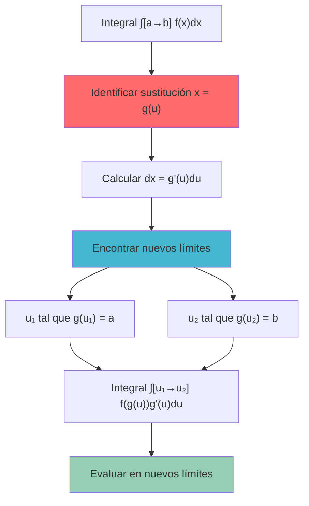
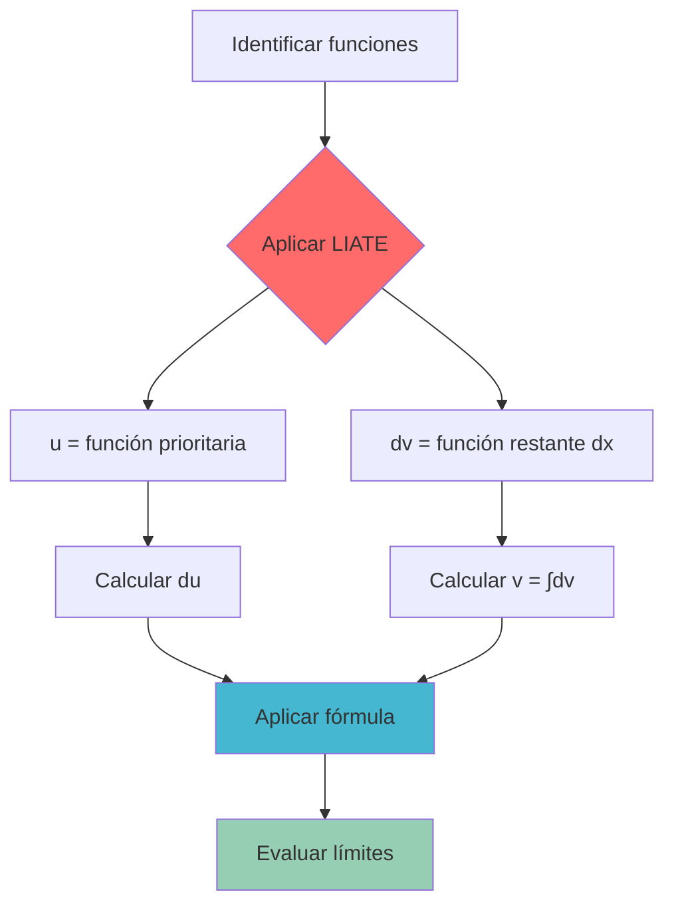
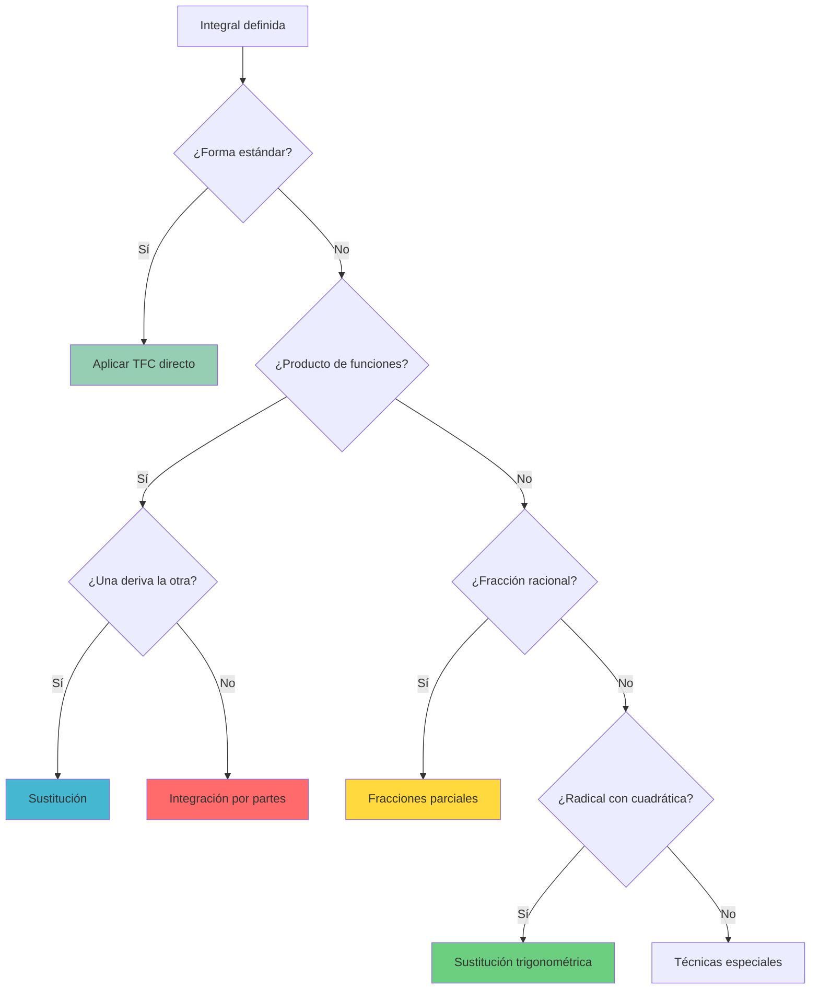
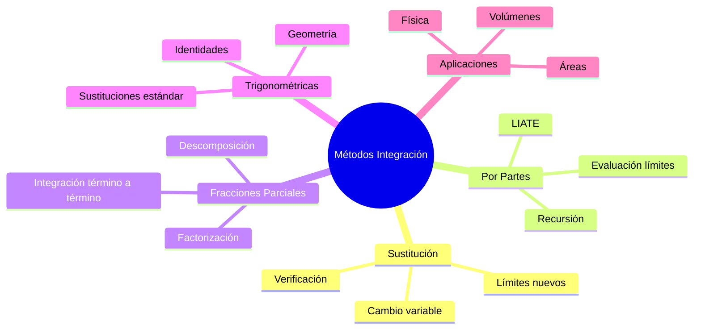

# 🎨 Métodos de Integración Definida

> [!info] 💡 **Arsenal de Técnicas**
> Los métodos de integración definida son las herramientas sistemáticas para evaluar integrales cuando el [[Teorema fundamental del cálculo]] requiere técnicas más sofisticadas que la antiderivación directa.

## ⚡ Método de Sustitución (Cambio de Variable)

### 🎯 Teorema de Sustitución para Integrales Definidas

> [!tip] 🏆 **Teorema de Cambio de Variable**
> Si $g$ es diferenciable en $[\alpha, \beta]$, $g(\alpha) = a$, $g(\beta) = b$, y $f$ es continua en $[a,b]$:
> 
> $$\int_a^b f(x) dx = \int_{\alpha}^{\beta} f(g(u)) g'(u) du$$
> 
> **Equivalentemente**: Si $x = g(u)$, entonces $dx = g'(u) du$

### 🔧 Metodología Paso a Paso

### 🧪 Ejemplos de Sustitución

#### 🔬 Ejemplo 1: Sustitución Trigonométrica Inversa

> [!tip] 📈 **Evaluar**: $\int_0^1 \frac{1}{\sqrt{1-x^2}} dx$
> 
> **Paso 1**: Sustitución $x = \sin(u)$, $dx = \cos(u) du$
> 
> **Paso 2**: Nuevos límites
> - Cuando $x = 0$: $\sin(u) = 0 \Rightarrow u = 0$
> - Cuando $x = 1$: $\sin(u) = 1 \Rightarrow u = \frac{\pi}{2}$
> 
> **Paso 3**: Transformar la integral
> $$\int_0^1 \frac{1}{\sqrt{1-x^2}} dx = \int_0^{\pi/2} \frac{\cos(u)}{\sqrt{1-\sin^2(u)}} du = \int_0^{\pi/2} \frac{\cos(u)}{\cos(u)} du$$
> 
> **Paso 4**: Evaluar
> $$= \int_0^{\pi/2} 1 du = [u]_0^{\pi/2} = \frac{\pi}{2}$$

#### 🔬 Ejemplo 2: Sustitución Algebraica

> [!tip] 📊 **Evaluar**: $\int_1^4 \frac{x}{\sqrt{x-1}} dx$
> 
> **Paso 1**: Sustitución $u = x - 1$, entonces $x = u + 1$, $dx = du$
> 
> **Paso 2**: Nuevos límites
> - Cuando $x = 1$: $u = 0$
> - Cuando $x = 4$: $u = 3$
> 
> **Paso 3**: Transformar
> $$\int_1^4 \frac{x}{\sqrt{x-1}} dx = \int_0^3 \frac{u+1}{\sqrt{u}} du = \int_0^3 \left(\sqrt{u} + \frac{1}{\sqrt{u}}\right) du$$
> 
> **Paso 4**: Evaluar
> $$= \left[\frac{2u^{3/2}}{3} + 2\sqrt{u}\right]_0^3 = \frac{2 \cdot 3\sqrt{3}}{3} + 2\sqrt{3} = 2\sqrt{3} + 2\sqrt{3} = 4\sqrt{3}$$

## 🔄 Integration by Parts (Integración por Partes)

### 🎯 Fórmula para Integrales Definidas

> [!tip] 🏆 **Integración por Partes**
> Si $u$ y $v$ son funciones diferenciables:
> 
> $$\int_a^b u \, dv = [uv]_a^b - \int_a^b v \, du$$
> 
> **Equivalentemente**: 
> $$\int_a^b u(x)v'(x) dx = [u(x)v(x)]_a^b - \int_a^b u'(x)v(x) dx$$

### 🧠 Estrategia LIATE

> [!warning] 📋 **Orden de Prioridad para elegir $u$**
> 1. **L**ogarítmicas: $\ln(x)$, $\log(x)$
> 2. **I**nversas trigonométricas: $\arcsin(x)$, $\arctan(x)$
> 3. **A**lgebraicas: $x^n$, polinomios
> 4. **T**rigonométricas: $\sin(x)$, $\cos(x)$
> 5. **E**xponenciales: $e^x$, $a^x$

### 🧪 Ejemplos de Integración por Partes

#### 🔬 Ejemplo 1: Logaritmo por Polinomio

> [!tip] 📈 **Evaluar**: $\int_1^e x \ln(x) dx$
> 
> **Aplicando LIATE**: $u = \ln(x)$ (logarítmica), $dv = x dx$ (algebraica)
> 
> **Paso 1**: Calcular derivadas e integrales
> - $du = \frac{1}{x} dx$
> - $v = \frac{x^2}{2}$
> 
> **Paso 2**: Aplicar fórmula
> $$\int_1^e x \ln(x) dx = \left[\frac{x^2}{2} \ln(x)\right]_1^e - \int_1^e \frac{x^2}{2} \cdot \frac{1}{x} dx$$
> 
> **Paso 3**: Simplificar la segunda integral
> $$= \left[\frac{x^2}{2} \ln(x)\right]_1^e - \int_1^e \frac{x}{2} dx$$
> 
> **Paso 4**: Evaluar
> $$= \left[\frac{x^2}{2} \ln(x)\right]_1^e - \left[\frac{x^2}{4}\right]_1^e$$
> $$= \left(\frac{e^2}{2} \cdot 1 - \frac{1}{2} \cdot 0\right) - \left(\frac{e^2}{4} - \frac{1}{4}\right)$$
> $$= \frac{e^2}{2} - \frac{e^2}{4} + \frac{1}{4} = \frac{e^2}{4} + \frac{1}{4}$$

#### 🔬 Ejemplo 2: Exponencial por Trigonométrica

> [!tip] 🌊 **Evaluar**: $\int_0^{\pi} e^x \sin(x) dx$
> 
> **Primera aplicación**: $u = \sin(x)$, $dv = e^x dx$
> - $du = \cos(x) dx$, $v = e^x$
> 
> $$\int_0^{\pi} e^x \sin(x) dx = [e^x \sin(x)]_0^{\pi} - \int_0^{\pi} e^x \cos(x) dx$$
> $$= (e^{\pi} \cdot 0 - e^0 \cdot 0) - \int_0^{\pi} e^x \cos(x) dx = -\int_0^{\pi} e^x \cos(x) dx$$
> 
> **Segunda aplicación**: $u = \cos(x)$, $dv = e^x dx$
> - $du = -\sin(x) dx$, $v = e^x$
> 
> $$-\int_0^{\pi} e^x \cos(x) dx = -[e^x \cos(x)]_0^{\pi} - \int_0^{\pi} e^x \sin(x) dx$$
> $$= -(-e^{\pi} - 1) - \int_0^{\pi} e^x \sin(x) dx = e^{\pi} + 1 - \int_0^{\pi} e^x \sin(x) dx$$
> 
> **Resolver para la integral original**:
> $$\int_0^{\pi} e^x \sin(x) dx = e^{\pi} + 1 - \int_0^{\pi} e^x \sin(x) dx$$
> $$2\int_0^{\pi} e^x \sin(x) dx = e^{\pi} + 1$$
> $$\int_0^{\pi} e^x \sin(x) dx = \frac{e^{\pi} + 1}{2}$$

## 🔢 Fracciones Parciales en Integrales Definidas

### 🎯 Metodología General

> [!info] 🔧 **Proceso para Integrales Definidas**
> 1. Descomponer la fracción en fracciones parciales
> 2. Integrar cada fracción por separado
> 3. Aplicar el Teorema Fundamental del Cálculo
> 4. Evaluar en los límites de integración

### 📊 Tipos de Factores

> [!tip] 📋 **Casos de Descomposición**

| Tipo de Factor | Forma de Fracción Parcial |
|----------------|---------------------------|
| $(ax + b)$ | $\frac{A}{ax + b}$ |
| $(ax + b)^n$ | $\frac{A_1}{ax + b} + \frac{A_2}{(ax + b)^2} + \cdots + \frac{A_n}{(ax + b)^n}$ |
| $(ax^2 + bx + c)$ | $\frac{Ax + B}{ax^2 + bx + c}$ |

### 🧪 Ejemplo de Fracciones Parciales

> [!tip] 🔬 **Evaluar**: $\int_0^1 \frac{2x + 1}{x^2 + x} dx$
> 
> **Paso 1**: Factorizar denominador
> $$x^2 + x = x(x + 1)$$
> 
> **Paso 2**: Descomponer
> $$\frac{2x + 1}{x(x + 1)} = \frac{A}{x} + \frac{B}{x + 1}$$
> 
> **Paso 3**: Encontrar constantes
> $$2x + 1 = A(x + 1) + Bx$$
> 
> Método de valores convenientes:
> - $x = 0$: $1 = A \Rightarrow A = 1$
> - $x = -1$: $-1 = -B \Rightarrow B = 1$
> 
> **Paso 4**: Integrar
> $$\int_0^1 \frac{2x + 1}{x^2 + x} dx = \int_0^1 \left(\frac{1}{x} + \frac{1}{x + 1}\right) dx$$
> 
> > [!warning] ⚠️ **Problema**: La integral tiene una discontinuidad en $x = 0$
> > Esta integral es **impropia** y requiere tratamiento especial.

## 🌊 Sustituciones Trigonométricas

### 🎯 Casos Estándar

> [!tip] 📐 **Sustituciones Trigonométricas Estándar**

| Expresión | Sustitución | Identidad Útil |
|-----------|-------------|----------------|
| $\sqrt{a^2 - x^2}$ | $x = a\sin(\theta)$ | $\sqrt{a^2 - a^2\sin^2(\theta)} = a\cos(\theta)$ |
| $\sqrt{a^2 + x^2}$ | $x = a\tan(\theta)$ | $\sqrt{a^2 + a^2\tan^2(\theta)} = a\sec(\theta)$ |
| $\sqrt{x^2 - a^2}$ | $x = a\sec(\theta)$ | $\sqrt{a^2\sec^2(\theta) - a^2} = a\tan(\theta)$ |

### 🧪 Ejemplo de Sustitución Trigonométrica

> [!tip] 🔬 **Evaluar**: $\int_0^{a} \sqrt{a^2 - x^2} dx$ (área de semicírculo)
> 
> **Paso 1**: Sustitución $x = a\sin(\theta)$, $dx = a\cos(\theta) d\theta$
> 
> **Paso 2**: Nuevos límites
> - $x = 0$: $\sin(\theta) = 0 \Rightarrow \theta = 0$
> - $x = a$: $\sin(\theta) = 1 \Rightarrow \theta = \frac{\pi}{2}$
> 
> **Paso 3**: Transformar
> $$\int_0^{a} \sqrt{a^2 - x^2} dx = \int_0^{\pi/2} \sqrt{a^2 - a^2\sin^2(\theta)} \cdot a\cos(\theta) d\theta$$
> $$= \int_0^{\pi/2} a\cos(\theta) \cdot a\cos(\theta) d\theta = a^2 \int_0^{\pi/2} \cos^2(\theta) d\theta$$
> 
> **Paso 4**: Usar identidad $\cos^2(\theta) = \frac{1 + \cos(2\theta)}{2}$
> $$= a^2 \int_0^{\pi/2} \frac{1 + \cos(2\theta)}{2} d\theta = \frac{a^2}{2} \left[\theta + \frac{\sin(2\theta)}{2}\right]_0^{\pi/2}$$
> 
> **Paso 5**: Evaluar
> $$= \frac{a^2}{2} \left[\frac{\pi}{2} + 0 - 0 - 0\right] = \frac{\pi a^2}{4}$$

## 🎪 Técnicas Especiales

### 🔄 Integrales de Funciones Pares e Impares

> [!tip] 🎯 **Aprovechando Simetría**
> 
> **Función par**: $f(-x) = f(x)$
> $$\int_{-a}^a f(x) dx = 2\int_0^a f(x) dx$$
> 
> **Función impar**: $f(-x) = -f(x)$
> $$\int_{-a}^a f(x) dx = 0$$

### 🌊 Integral de Wallis

> [!info] 🏆 **Fórmula de Wallis**
> Para $n$ entero no negativo:
> 
> $$\int_0^{\pi/2} \sin^n(x) dx = \int_0^{\pi/2} \cos^n(x) dx = \begin{cases}
> \frac{(n-1)!!}{n!!} & \text{si } n \text{ es par} \\
> \frac{(n-1)!!}{n!!} \cdot \frac{\pi}{2} & \text{si } n \text{ es impar}
> \end{cases}$$

### 🧪 Ejemplo con Simetría

> [!tip] 🔬 **Evaluar**: $\int_{-2}^2 (x^4 - 3x^2 + 1) dx$
> 
> **Análisis de paridad**:
> - $x^4$ es par
> - $-3x^2$ es par  
> - $1$ es par
> - La función completa es par
> 
> **Aplicando simetría**:
> $$\int_{-2}^2 (x^4 - 3x^2 + 1) dx = 2\int_0^2 (x^4 - 3x^2 + 1) dx$$
> 
> **Evaluando**:
> $$= 2\left[\frac{x^5}{5} - x^3 + x\right]_0^2 = 2\left(\frac{32}{5} - 8 + 2\right) = 2 \cdot \frac{-6}{5} = -\frac{12}{5}$$

## ⚠️ Errores Comunes y Precauciones

> [!warning] 🚨 **Errores Frecuentes**

### 🔴 Error 1: Límites en Sustitución
**Problema**: No cambiar los límites de integración al hacer sustitución

**Solución**: Siempre convertir los límites originales a la nueva variable

### 🔴 Error 2: Signos en Integración por Partes
**Problema**: Errores de signo en la fórmula

**Recordatorio**: $\int u \, dv = uv - \int v \, du$

### 🔴 Error 3: Fracciones Parciales Incorrectas
**Problema**: Descomposición incorrecta de la fracción

**Verificación**: Multiplicar la descomposición para recuperar la fracción original

### 🔴 Error 4: Dominios de Sustituciones Trigonométricas
**Problema**: No verificar que la sustitución sea válida en el intervalo

**Cuidado**: $\sqrt{a^2 - x^2}$ requiere $|x| \leq a$

## 🔧 Estrategias de Selección

### 🎯 Algoritmo de Decisión

### 📋 Lista de Verificación

> [!info] ✅ **Antes de Integrar**
> 1. ¿La función es continua en el intervalo?
> 2. ¿Hay discontinuidades que hagan la integral impropia?
> 3. ¿Se puede simplificar usando propiedades (simetría, linealidad)?
> 4. ¿Qué método es más eficiente?
> 5. ¿Los límites de integración están en el dominio?

## 🌐 Conexiones y Aplicaciones

---

## 📚 Referencias y Conexiones

### 🔗 Notas Relacionadas
- [[Teorema fundamental del cálculo]] - Base teórica para evaluación
- [[Propiedades de la Integral Definida]] - Herramientas para simplificar
- [[Integral de Riemann]] - Definición formal subyacente
- [[Área bajo la Curva]] - Aplicación geométrica principal
- [[Volúmenes de Revolución]] - Aplicación de estas técnicas

### 📖 Técnicas Relacionadas
- [[Integrales Impropias]] - Extensión a límites infinitos
- [[Integración Numérica]] - Métodos aproximados
- [[Funciones Especiales]] - Integrales no elementales
- [[Cálculo de Variaciones]] - Técnicas avanzadas

### 🎯 Aplicaciones Prácticas
- [[Trabajo y Energía con Integrales]] - Uso en física
- [[Probabilidad y Estadística]] - Funciones de densidad
- [[Ecuaciones Diferenciales]] - Resolución de EDOs
- [[Transformadas]] - Fourier, Laplace

### 🏷️ Tags
`#matematicas/calculo/metodos` `#integracion/tecnicas` `#sustitucion/cambiovariable` `#partes/LIATE` `#fracciones/parciales` `#trigonometricas/sustitucion` `#aplicaciones/calculo`