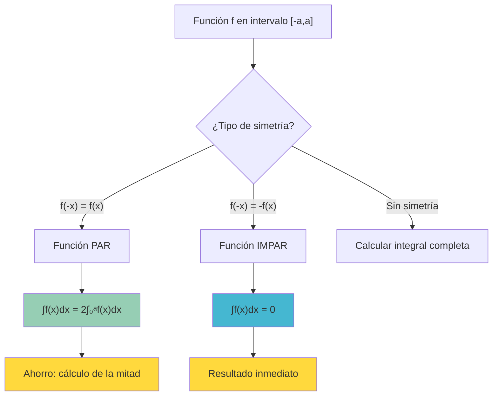
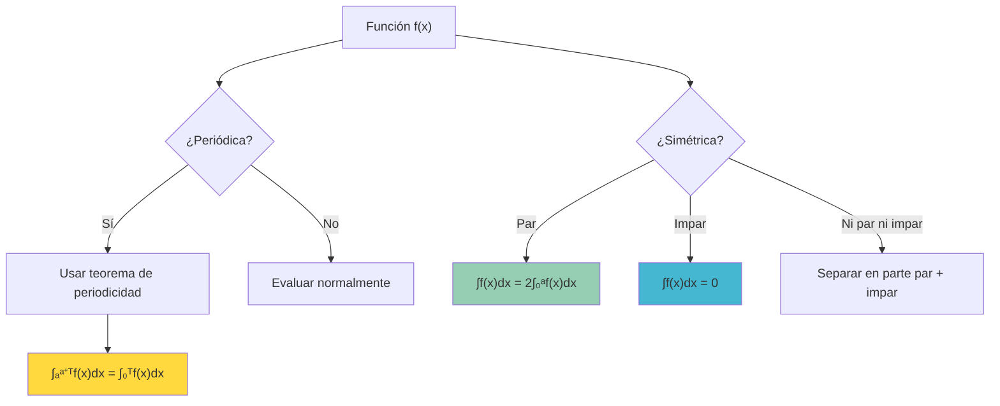

# 🪞 Propiedades de Simetría y Periodicidad en Integrales

> [!info] 💡 **Conceptos Centrales** Las propiedades de simetría y periodicidad permiten simplificar el cálculo de integrales definidas aprovechando patrones geométricos y algebraicos de las funciones. Estas herramientas son especialmente útiles para funciones pares, impares y periódicas.

## 🎯 Teorema de Simetría para Funciones Pares e Impares

### 📐 Funciones Pares

> [!tip] 🏆 **Teorema para Funciones Pares** Si $f$ es una función **par** (es decir, $f(-x) = f(x)$ para todo $x$) y continua en $[-a,a]$, entonces:
> 
> $$\int_{-a}^a f(x) dx = 2\int_0^a f(x) dx$$

> [!info] 🎨 **Interpretación Geométrica** La gráfica de una función par es **simétrica respecto al eje y**. Por tanto, el área bajo la curva desde $-a$ hasta $0$ es igual al área desde $0$ hasta $a$.

### 📐 Funciones Impares

> [!tip] 🏆 **Teorema para Funciones Impares**  
> Si $f$ es una función **impar** (es decir, $f(-x) = -f(x)$ para todo $x$) y continua en $[-a,a]$, entonces:
> 
> $$\int_{-a}^a f(x) dx = 0$$

> [!info] 🎨 **Interpretación Geométrica** La gráfica de una función impar tiene **simetría puntual respecto al origen**. Las áreas positiva y negativa se cancelan exactamente.

## 🧮 Demostraciones

### 🔬 Demostración para Funciones Pares

> [!warning] 🔬 **Demostración del Teorema de Funciones Pares**
> 
> **Paso 1**: Dividir la integral $$\int_{-a}^a f(x) dx = \int_{-a}^0 f(x) dx + \int_0^a f(x) dx$$
> 
> **Paso 2**: En la primera integral, hacer la sustitución $u = -x$
> 
> - Cuando $x = -a$, $u = a$
> - Cuando $x = 0$, $u = 0$
> - $dx = -du$
> 
> $$\int_{-a}^0 f(x) dx = \int_a^0 f(-u)(-du) = \int_0^a f(-u) du$$
> 
> **Paso 3**: Como $f$ es par, $f(-u) = f(u)$ $$\int_{-a}^0 f(x) dx = \int_0^a f(u) du = \int_0^a f(x) dx$$
> 
> **Paso 4**: Sustituir en la integral original $$\int_{-a}^a f(x) dx = \int_0^a f(x) dx + \int_0^a f(x) dx = 2\int_0^a f(x) dx$$

### 🔬 Demostración para Funciones Impares

> [!warning] 🔬 **Demostración del Teorema de Funciones Impares**
> 
> Siguiendo los mismos pasos que para funciones pares, pero en el **Paso 3**:
> 
> Como $f$ es impar, $f(-u) = -f(u)$ $$\int_{-a}^0 f(x) dx = \int_0^a (-f(u)) du = -\int_0^a f(x) dx$$
> 
> Por tanto: $$\int_{-a}^a f(x) dx = -\int_0^a f(x) dx + \int_0^a f(x) dx = 0$$

## 🧪 Ejemplos de Simetría

### 🔬 Ejemplo 1: Función Par $f(x) = x^2$

> [!tip] 📈 **Evaluar $\int_{-2}^2 x^2 dx$**
> 
> **Verificación de paridad**: $f(-x) = (-x)^2 = x^2 = f(x)$ ✓
> 
> **Aplicación del teorema**: $$\int_{-2}^2 x^2 dx = 2\int_0^2 x^2 dx = 2\left[\frac{x^3}{3}\right]_0^2 = 2 \cdot \frac{8}{3} = \frac{16}{3}$$
> 
> **Verificación directa**: $$\int_{-2}^2 x^2 dx = \left[\frac{x^3}{3}\right]_{-2}^2 = \frac{8}{3} - \frac{(-8)}{3} = \frac{16}{3}$$ ✓

### 🔬 Ejemplo 2: Función Impar $f(x) = x^3$

> [!tip] 📈 **Evaluar $\int_{-3}^3 x^3 dx$**
> 
> **Verificación de imparidad**: $f(-x) = (-x)^3 = -x^3 = -f(x)$ ✓
> 
> **Aplicación del teorema**: $$\int_{-3}^3 x^3 dx = 0$$
> 
> **Verificación directa**: $$\int_{-3}^3 x^3 dx = \left[\frac{x^4}{4}\right]_{-3}^3 = \frac{81}{4} - \frac{81}{4} = 0$$ ✓

### 🔬 Ejemplo 3: Función Trigonométrica $f(x) = \sin(x)\cos(x)$

> [!tip] 📐 **Evaluar $\int_{-\pi}^{\pi} \sin(x)\cos(x) dx$**
> 
> **Verificación de imparidad**: $$f(-x) = \sin(-x)\cos(-x) = (-\sin(x))(\cos(x)) = -\sin(x)\cos(x) = -f(x)$$ ✓
> 
> **Resultado inmediato**: $\int_{-\pi}^{\pi} \sin(x)\cos(x) dx = 0$

### 🔬 Ejemplo 4: Función Mixta $f(x) = x^2 + x^3$

> [!warning] ⚡ **Separación de partes par e impar** $$f(x) = x^2 + x^3 = \underbrace{x^2}_{\text{par}} + \underbrace{x^3}_{\text{impar}}$$
> 
> $$\int_{-2}^2 (x^2 + x^3) dx = \int_{-2}^2 x^2 dx + \int_{-2}^2 x^3 dx = \frac{16}{3} + 0 = \frac{16}{3}$$

## 🌊 Teorema de Periodicidad

### 📋 Propiedades Básicas de Funciones Periódicas

> [!info] 🔄 **Definición de Función Periódica** Una función $f$ es **periódica** con período $T > 0$ si: $$f(x + T) = f(x) \text{ para todo } x \text{ en el dominio}$$

> [!tip] 🏆 **Teorema Fundamental de Periodicidad** Si $f$ es continua y periódica con período $T$, entonces para cualquier número real $a$:
> 
> $$\int_a^{a+T} f(x) dx = \int_0^T f(x) dx$$
> 
> **Corolario**: $\int_0^{nT} f(x) dx = n \int_0^T f(x) dx$ para cualquier entero positivo $n$.

### 🔬 Demostración del Teorema de Periodicidad

> [!warning] 🔬 **Demostración**
> 
> **Paso 1**: Hacer la sustitución $u = x - a$
> 
> - Cuando $x = a$, $u = 0$
> - Cuando $x = a + T$, $u = T$
> - $dx = du$
> 
> $$\int_a^{a+T} f(x) dx = \int_0^T f(u + a) du$$
> 
> **Paso 2**: Como $f$ es periódica con período $T$: $$f(u + a) = f(u + a + nT) \text{ para cualquier entero } n$$
> 
> **Paso 3**: Elegir $n$ tal que $a + nT = 0$, entonces $n = -\frac{a}{T}$
> 
> En la práctica, usamos la periodicidad para "desplazar" el argumento: $$f(u + a) = f(u)$$
> 
> **Paso 4**: Por tanto: $$\int_a^{a+T} f(x) dx = \int_0^T f(u) du = \int_0^T f(x) dx$$

## 🧪 Ejemplos de Periodicidad

### 🔬 Ejemplo 1: Función Seno

> [!tip] 📐 **$f(x) = \sin(x)$ con período $T = 2\pi$**
> 
> **Cálculo base**: $$\int_0^{2\pi} \sin(x) dx = [-\cos(x)]_0^{2\pi} = -\cos(2\pi) + \cos(0) = -1 + 1 = 0$$
> 
> **Aplicaciones**:
> 
> - $\int_{\pi}^{3\pi} \sin(x) dx = \int_0^{2\pi} \sin(x) dx = 0$
> - $\int_{-\pi}^{\pi} \sin(x) dx = \int_0^{2\pi} \sin(x) dx = 0$
> - $\int_0^{4\pi} \sin(x) dx = 2 \int_0^{2\pi} \sin(x) dx = 2 \cdot 0 = 0$

### 🔬 Ejemplo 2: Función Coseno

> [!tip] 📐 **$f(x) = \cos(x)$ con período $T = 2\pi$**
> 
> **Cálculo base**: $$\int_0^{2\pi} \cos(x) dx = [\sin(x)]_0^{2\pi} = \sin(2\pi) - \sin(0) = 0 - 0 = 0$$
> 
> **Aplicación**: $$\int_{5\pi}^{7\pi} \cos(x) dx = \int_0^{2\pi} \cos(x) dx = 0$$

### 🔬 Ejemplo 3: Función Cuadrada Periódica

> [!warning] 📊 **Función escalón periódica** Definimos $f(x)$ con período $T = 2$ como: $$f(x) = \begin{cases} 1 & \text{si } 0 \leq x < 1 \ -1 & \text{si } 1 \leq x < 2 \end{cases}$$
> 
> **Cálculo base**: $$\int_0^2 f(x) dx = \int_0^1 1 , dx + \int_1^2 (-1) dx = 1 - 1 = 0$$
> 
> **Aplicación**: $$\int_{10}^{12} f(x) dx = \int_0^2 f(x) dx = 0$$

## 🎨 Combinaciones de Simetría y Periodicidad

### 🌟 Funciones Trigonométricas en Intervalos Simétricos

> [!tip] 🎯 **Casos Especiales Importantes**

#### Funciones Pares y Periódicas

- $\cos(x)$ es par y periódica
- $\int_{-\pi}^{\pi} \cos(x) dx = 2\int_0^{\pi} \cos(x) dx = 2[0] = 0$

#### Funciones Impares y Periódicas

- $\sin(x)$ es impar y periódica
- $\int_{-\pi}^{\pi} \sin(x) dx = 0$ (por imparidad)

### 🔄 Funciones con Múltiples Propiedades

> [!info] 🧮 **Ejemplo Complejo: $f(x) = x\sin(x^2)$**
> 
> **En intervalo simétrico $[-a,a]$**:
> 
> - Verificar paridad: $f(-x) = (-x)\sin((-x)^2) = -x\sin(x^2) = -f(x)$ (impar)
> - Por tanto: $\int_{-a}^a x\sin(x^2) dx = 0$

## 🛠️ Estrategias y Técnicas de Aplicación

### 🧠 Técnica de Estudio: Método SIPEM

> [!tip] 🎓 **Mnemotecnia SIPEM para análisis sistemático**
> 
> **S**imetría: ¿Es par, impar o ninguna? **I**ntervalo: ¿Es simétrico respecto al origen? **P**eriodicidad: ¿Tiene período conocido? **E**strategia: ¿Qué teorema aplicar? **M**odificación: ¿Se puede simplificar la integral?

### 📋 Lista de Verificación

> [!info] ✅ **Pasos para aplicar teoremas de simetría y periodicidad**
> 
> 1. **Identificar el tipo de función**:
> 
> - Verificar $f(-x)$ vs $f(x)$
>     
> - Buscar patrones periódicos
>     
> 
> 2. **Analizar el intervalo de integración**:
> 
> - ¿Es simétrico respecto al origen?
>     
> - ¿Abarca períodos completos?
>     
> 
> 3. **Aplicar el teorema correspondiente**:
> 
> - Funciones pares: duplicar integral de 0 a a
>     
> - Funciones impares: resultado cero
>     
> - Funciones periódicas: desplazar intervalo
>     
> 
> 4. **Verificar el resultado**:
> 
> - Comprobar dimensionalmente
> - Verificar con casos simples

## 🎯 Aplicaciones Prácticas

### ⚡ Análisis de Fourier

> [!tip] 🌊 **Series de Fourier** Los teoremas de simetría son fundamentales en el análisis de Fourier:
> 
> **Funciones pares**: Solo términos coseno (coeficientes $a_n$) $$a_n = \frac{2}{L} \int_0^L f(x) \cos\left(\frac{n\pi x}{L}\right) dx$$
> 
> **Funciones impares**: Solo términos seno (coeficientes $b_n$)  
> $$b_n = \frac{2}{L} \int_0^L f(x) \sin\left(\frac{n\pi x}{L}\right) dx$$

### 🔌 Ingeniería Eléctrica

> [!info] ⚡ **Análisis de Señales AC** Para señales periódicas $v(t)$ con período $T$:
> 
> **Potencia promedio**: $$P = \frac{1}{T} \int_0^T [v(t)]^2 dt$$
> 
> La periodicidad permite calcular sobre cualquier intervalo de longitud $T$.

### 🎵 Acústica y Vibraciones

> [!warning] 🎵 **Ondas Sonoras** Las ondas sonoras son típicamente funciones periódicas. Para una onda $f(t) = A\sin(\omega t + \phi)$:
> 
> **Energía por período**: $$E = \int_0^{2\pi/\omega} [f(t)]^2 dt$$
> 
> Usando periodicidad, podemos calcular sobre cualquier período completo.

## ⚠️ Errores Comunes y Precauciones

> [!warning] 🚨 **Errores Frecuentes**
> 
> 1. **Verificación incompleta de simetría**:
> 
> - ❌ Asumir paridad sin verificar $f(-x) = f(x)$
>     
> - ✅ Siempre verificar algebraicamente la condición
>     
> 
> 2. **Intervalos no simétricos**:
> 
> - ❌ Aplicar teoremas de simetría en $[0,a]$
>     
> - ✅ Solo aplicar en intervalos simétricos $[-a,a]$
>     
> 
> 3. **Confundir período fundamental**:
> 
> - ❌ Usar período incorrecto (ej: $\pi$ para $\sin(x)$)
>     
> - ✅ Identificar período mínimo (ej: $2\pi$ para $\sin(x)$)
>     
> 
> 4. **Funciones definidas por partes**:
> 
> - ❌ Ignorar discontinuidades en la verificación
>     
> - ✅ Verificar simetría/periodicidad en todo el dominio
>     
> 
> 5. **Composición de funciones**:
> 
> - ❌ Asumir que $f(g(x))$ hereda propiedades de $f$ y $g$
> - ✅ Verificar propiedades de la composición directamente

### 🔍 Casos Ambiguos

> [!info] ⚠️ **Situaciones que requieren cuidado especial**
> 
> **Funciones casi periódicas**: $f(x) = \sin(x) + \sin(\sqrt{2}x)$ no es periódica
> 
> **Simetría local vs global**: Una función puede ser par en un intervalo pero no en su dominio completo
> 
> **Periodicidad extendida**: $f(x) = x\sin(x)$ no es periódica aunque $\sin(x)$ sí lo sea

## 🌟 Extensiones Avanzadas

### 🎯 Teoremas Generalizados

> [!tip] 🔬 **Extensiones del Concepto**

#### Simetría Generalizada

Para función $f$ con simetría respecto a $x = c$: $$\int_{c-a}^{c+a} f(x) dx = 2\int_c^{c+a} f(x) dx \text{ si } f(c+x) = f(c-x)$$

#### Cuasi-periodicidad

Para funciones cuasi-periódicas $f(x+T) = kf(x)$: $$\int_0^{nT} f(x) dx = \frac{1-k^n}{1-k} \int_0^T f(x) dx \text{ si } k \neq 1$$

### 🌀 Aplicaciones en Cálculo Multivariable

> [!info] 🌐 **Extensión a Múltiples Variables**
> 
> **Simetría en 2D**: Para $f(x,y) = f(-x,y)$ (par en $x$): $$\iint_{R} f(x,y) , dA = 2\iint_{R^+} f(x,y) , dA$$ donde $R^+$ es la parte de $R$ con $x \geq 0$.

---

## 📚 Referencias y Conexiones

### 🔗 Notas Relacionadas

- [[Teorema fundamental del cálculo]] - Base teórica para todas las integrales definidas
- [[Teorema del Valor Medio para Integrales]] - Propiedades complementarias de integrales
- [[Propiedades de la Integral Definida]] - Linealidad y aditividad
- [[Funciones Trigonométricas]] - Ejemplos principales de funciones periódicas
- [[Integral de Riemann]] - Definición formal subyacente

### 📖 Para Profundizar

- [[Series de Fourier]] - Aplicación directa de propiedades de simetría
- [[Análisis de Señales]] - Aplicaciones en ingeniería
- [[Funciones Especiales]] - Más ejemplos de funciones con simetrías
- [[Transformadas Integrales]] - Uso avanzado de propiedades de simetría

### 🎯 Notas Recomendadas

- [[Métodos de Integración]] - Técnicas que se benefician de estas propiedades
- [[Aplicaciones Físicas de Integrales]] - Contexto real de funciones periódicas
- [[Geometría de Curvas]] - Interpretación visual de simetrías

### 🧮 Aplicaciones Especializadas

- [[Análisis Armónico]] - Estudio profundo de funciones periódicas
- [[Mecánica Ondulatoria]] - Física de sistemas periódicos
- [[Procesamiento de Señales Digitales]] - Aplicaciones computacionales

---

### 🏷️ Tags

`#matematicas/calculo/propiedades` `#simetria/funciones` `#periodicidad/integrales` `#optimizacion/calculo` `#aplicaciones/fisica` `#teoremas/fundamentales` `#funciones-especiales`