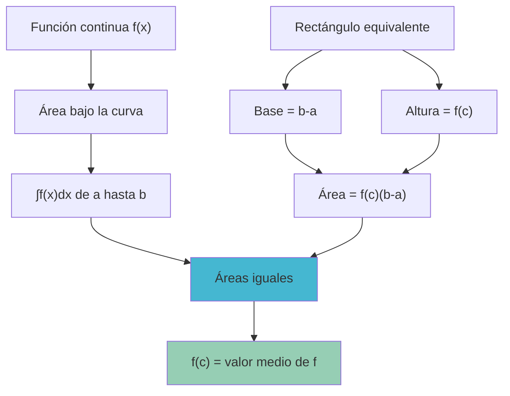
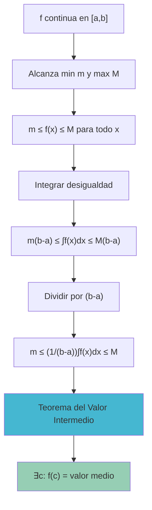
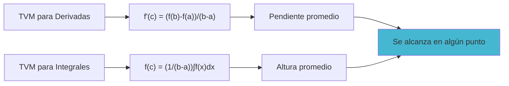

# 📊 Teorema del Valor Medio para Integrales

> [!info] 💡 **Concepto Central** El Teorema del Valor Medio para Integrales establece que para cualquier función continua en un intervalo cerrado, existe al menos un punto donde el valor de la función multiplicado por la longitud del intervalo es igual a la integral definida de la función.

## 🎯 Enunciado del Teorema

> [!tip] 🏆 **Teorema del Valor Medio para Integrales** Si $f$ es continua en el intervalo cerrado $[a,b]$, entonces existe al menos un número $c$ en el intervalo abierto $(a,b)$ tal que:
> 
> $$\int_a^b f(x) dx = f(c)(b-a)$$
> 
> Equivalentemente: $$f(c) = \frac{1}{b-a}\int_a^b f(x) dx$$

> [!warning] 📋 **Condiciones Necesarias**
> 
> - $f$ debe ser **continua** en $[a,b]$
> - $a \neq b$ (el intervalo debe tener longitud positiva)
> - $c \in (a,b)$ (el punto está en el interior del intervalo)

## 🔍 Interpretación Geométrica

> [!info] 🎨 **Significado Visual** El teorema garantiza la existencia de un **rectángulo** con:
> 
> - **Base**: $b-a$ (longitud del intervalo)
> - **Altura**: $f(c)$ (valor de la función en algún punto $c$)
> - **Área**: igual al área bajo la curva $y = f(x)$ desde $a$ hasta $b$

> [!tip] 🎯 **Interpretación del Valor Medio** El número $\frac{1}{b-a}\int_a^b f(x) dx$ se llama el **valor medio** (o **promedio**) de $f$ en $[a,b]$.
> 
> El teorema dice que este valor medio se alcanza realmente en algún punto $c$ del intervalo.

## 🧮 Demostración

> [!warning] 🔬 **Esquema de la Demostración**
> 
> **Paso 1**: Como $f$ es continua en $[a,b]$, alcanza su máximo $M$ y mínimo $m$ en el intervalo.
> 
> **Paso 2**: Por la propiedad de comparación de integrales: $$m(b-a) \leq \int_a^b f(x) dx \leq M(b-a)$$
> 
> **Paso 3**: Dividiendo por $(b-a) > 0$: $$m \leq \frac{1}{b-a}\int_a^b f(x) dx \leq M$$
> 
> **Paso 4**: Por el **Teorema del Valor Intermedio**, existe $c \in [a,b]$ tal que: $$f(c) = \frac{1}{b-a}\int_a^b f(x) dx$$

## 🧪 Ejemplos Detallados

### 🔬 Ejemplo 1: Función Cuadrática

> [!tip] 📈 **Encontrar el valor medio de $f(x) = x^2$ en $[0,3]$**
> 
> **Paso 1**: Calcular la integral $$\int_0^3 x^2 dx = \left[\frac{x^3}{3}\right]_0^3 = \frac{27}{3} - 0 = 9$$
> 
> **Paso 2**: Calcular el valor medio $$\text{Valor medio} = \frac{1}{3-0} \cdot 9 = \frac{9}{3} = 3$$
> 
> **Paso 3**: Encontrar $c$ tal que $f(c) = 3$ $$c^2 = 3 \Rightarrow c = \sqrt{3} \approx 1.732$$
> 
> **Verificación**: $c = \sqrt{3} \in (0,3)$ ✓ y $f(\sqrt{3}) = 3$ ✓

### 🔬 Ejemplo 2: Función Trigonométrica

> [!tip] 📐 **Encontrar el valor medio de $f(x) = \sin(x)$ en $[0,\pi]$**
> 
> **Paso 1**: Calcular la integral $$\int_0^\pi \sin(x) dx = [-\cos(x)]_0^\pi = -\cos(\pi) + \cos(0) = 1 + 1 = 2$$
> 
> **Paso 2**: Calcular el valor medio $$\text{Valor medio} = \frac{1}{\pi-0} \cdot 2 = \frac{2}{\pi}$$
> 
> **Paso 3**: Encontrar $c$ tal que $\sin(c) = \frac{2}{\pi}$ $$c = \arcsin\left(\frac{2}{\pi}\right) \approx 0.69 \text{ radianes}$$
> 
> **Verificación**: $c \approx 0.69 \in (0,\pi)$ ✓

### 🔬 Ejemplo 3: Función Lineal

> [!tip] 📏 **Verificar con $f(x) = 2x + 1$ en $[1,4]$**
> 
> **Intuición**: Para funciones lineales, el valor medio debería estar en el punto medio del intervalo.
> 
> **Paso 1**: Calcular la integral $$\int_1^4 (2x + 1) dx = \left[x^2 + x\right]_1^4 = (16 + 4) - (1 + 1) = 18$$
> 
> **Paso 2**: Valor medio $$\text{Valor medio} = \frac{18}{4-1} = \frac{18}{3} = 6$$
> 
> **Paso 3**: Encontrar $c$ $$2c + 1 = 6 \Rightarrow c = 2.5$$
> 
> **Observación**: $c = 2.5$ es exactamente el punto medio de $[1,4]$ ✓

## 🎨 Casos Especiales y Propiedades

### 📐 Funciones Lineales

> [!info] ⚡ **Propiedad Especial** Para funciones lineales $f(x) = mx + b$, el punto $c$ donde se alcanza el valor medio es siempre el **punto medio** del intervalo: $$c = \frac{a+b}{2}$$

### 🔄 Funciones Simétricas

> [!tip] 🪞 **Funciones Pares e Impares**
> 
> **Funciones pares** ($f(-x) = f(x)$) en intervalos simétricos $[-a,a]$:
> 
> - El valor medio se alcanza en $c = 0$ si $f$ es constante en el intervalo
> - Para $f(x) = x^2$ en $[-1,1]$: $c = 0$ y valor medio = $\frac{1}{3}$
> 
> **Funciones impares** ($f(-x) = -f(x)$) en intervalos simétricos $[-a,a]$:
> 
> - El valor medio es siempre $0$
> - Se alcanza en cualquier punto donde $f(c) = 0$

### 🌊 Funciones Periódicas

> [!warning] 🔄 **Funciones Periódicas** Para una función periódica $f$ con período $T$, el valor medio en cualquier intervalo de longitud $T$ es el mismo:
> 
> $$\frac{1}{T}\int_a^{a+T} f(x) dx = \frac{1}{T}\int_0^T f(x) dx$$

## 🌐 Aplicaciones Importantes

### ⚡ Valor RMS (Root Mean Square)

> [!tip] 🔌 **Aplicación en Ingeniería Eléctrica** Para una función $f(t)$ que representa voltaje o corriente alterna:
> 
> **Valor cuadrático medio**: $$\text{RMS} = \sqrt{\frac{1}{b-a}\int_a^b [f(t)]^2 dt}$$
> 
> El teorema garantiza que existe $c$ donde $[f(c)]^2$ igual al valor cuadrático medio.

### 🌡️ Temperatura Promedio

> [!info] 🌡️ **Aplicación Meteorológica** Si $T(t)$ representa la temperatura en función del tiempo durante un día:
> 
> $$T_{\text{promedio}} = \frac{1}{24}\int_0^{24} T(t) dt$$
> 
> El teorema garantiza que existe al menos un momento $c$ donde $T(c) = T_{\text{promedio}}$.

### 🚗 Velocidad Promedio vs Velocidad Instantánea

> [!warning] 🚗 **Distinción Importante**
> 
> **Velocidad promedio**: $v_{\text{prom}} = \frac{\text{desplazamiento}}{\text{tiempo}} = \frac{s(b) - s(a)}{b-a}$
> 
> **Teorema del valor medio para integrales**: Existe $c$ tal que $v(c) = v_{\text{prom}}$
> 
> **Diferencia**: La velocidad promedio se calcula directamente, pero el teorema garantiza que esa velocidad promedio se alcanza realmente en algún instante.

## 🔗 Conexión con Otros Teoremas

### 🌟 Relación con el Teorema del Valor Medio para Derivadas

> [!info] 🔄 **Conexión Profunda** Si aplicamos el Segundo Teorema Fundamental del Cálculo a una función $F(x) = \int_a^x f(t)dt$:
> 
> $$F(b) - F(a) = \int_a^b f(x)dx$$
> 
> Por TVM para derivadas: $F'(c) = \frac{F(b)-F(a)}{b-a}$ para algún $c \in (a,b)$
> 
> Como $F'(c) = f(c)$: $f(c) = \frac{\int_a^b f(x)dx}{b-a}$ ✓

### 🧮 Técnica de Estudio: Método VMAP

> [!tip] 🎓 **Mnemotecnia VMAP para recordar el proceso**
> 
> **V**erificar continuidad de la función **M**edir la integral definida 
> **A**plicar la fórmula del valor medio **P**oner igualación y resolver para encontrar $c$
> 
> **Ejemplo rápido**:
> 
> 1. **V**: ¿$f(x) = x^2$ continua en $[0,2]$? ✓
> 2. **M**: $\int_0^2 x^2 dx = \frac{8}{3}$
> 3. **A**: Valor medio = $\frac{8/3}{2} = \frac{4}{3}$
> 4. **P**: $c^2 = \frac{4}{3} \Rightarrow c = \frac{2}{\sqrt{3}}$

## ⚠️ Errores Comunes y Precauciones

> [!warning] 🚨 **Errores Frecuentes**
> 
> 1. **Olvido de continuidad**: El teorema NO aplica a funciones discontinuas
>     
> 2. **Confundir con valor medio aritmético**:
>     
> 
> - ❌ $\frac{f(a) + f(b)}{2}$ (promedio de extremos)
>     
> - ✅ $\frac{1}{b-a}\int_a^b f(x)dx$ (valor medio integral)
>     
> 
> 3. **Asumir unicidad de $c$**: Puede haber múltiples valores de $c$
>     
> 4. **Intervalos degenerados**: Si $a = b$, el teorema no aplica
>     
> 5. **Confundir con TVM para derivadas**: Son teoremas diferentes con conclusiones diferentes
>     

### 🔍 Verificaciones Útiles

> [!info] ✅ **Cómo verificar resultados**
> 
> - **Comprobar continuidad**: Verificar que $f$ sea continua en $[a,b]$
> - **Verificar que $c \in (a,b)$**: El punto debe estar en el interior
> - **Comprobar la ecuación**: $f(c) \stackrel{?}{=} \frac{1}{b-a}\int_a^b f(x)dx$
> - **Interpretación geométrica**: El rectángulo debe tener la misma área que la región bajo la curva

## 🌟 Extensiones y Generalizaciones

### 🎯 Teorema del Valor Medio Generalizado

> [!tip] 🔬 **Versión con Función Peso** Si $f$ y $g$ son continuas en $[a,b]$ y $g(x) \geq 0$ para todo $x \in [a,b]$, entonces existe $c \in (a,b)$ tal que:
> 
> $$\int_a^b f(x)g(x)dx = f(c)\int_a^b g(x)dx$$

### 🌀 Aplicación a Integrales Múltiples

> [!info] 🌐 **Extensión 2D** Para funciones de dos variables continuas en una región $R$:
> 
> $$\iint_R f(x,y) dA = f(x_0,y_0) \cdot \text{Área}(R)$$
> 
> para algún punto $(x_0,y_0)$ en el interior de $R$.

---

## 📚 Referencias y Conexiones

### 🔗 Notas Relacionadas

- [[Teorema fundamental del cálculo]] - Base teórica para la demostración
- [[Teorema del Valor Medio para Derivadas]] - Teorema análogo para derivadas
- [[Propiedades de la Integral Definida]] - Propiedades utilizadas en la demostración
- [[Integral de Riemann]] - Definición formal de la integral
- [[Funciones Continuas]] - Condición necesaria para el teorema

### 📖 Para Profundizar

- [[Teorema del Valor Intermedio]] - Herramienta clave en la demostración
- [[Aplicaciones de Integrales en Física]] - Uso del valor medio en problemas físicos
- [[Valor RMS y Aplicaciones Eléctricas]] - Aplicación específica del concepto
- [[Promedio de Funciones]] - Interpretación estadística del valor medio

### 🎯 Notas Recomendadas

- [[Interpretación Geométrica de Integrales]] - Para visualizar mejor el concepto
- [[Métodos de Aproximación Numérica]] - Cálculo computacional de valores medios
- [[Funciones Periódicas y sus Propiedades]] - Casos especiales del teorema

---

### 🏷️ Tags

`#matematicas/calculo/teoremas` `#valor-medio/integrales` `#continuidad/funciones` `#aplicaciones/fisica` `#geometria/areas` `#demostraciones/fundamentales`