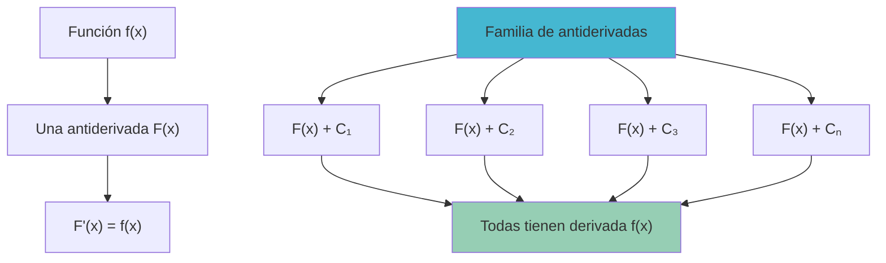
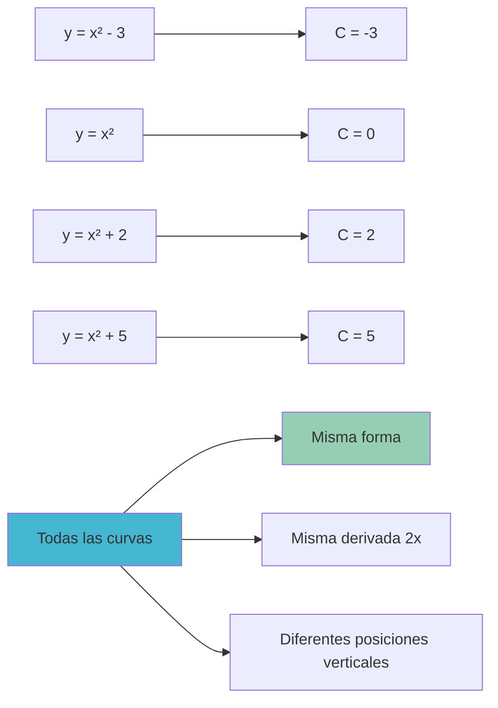
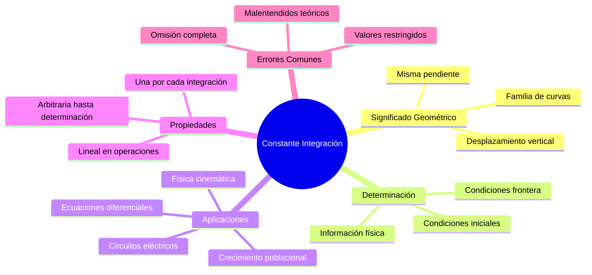

# 🔑 Constante de Integración y su Significado

> [!info] 💡 **El Elemento Crucial**
> La constante de integración es el factor que distingue entre una antiderivada particular y la familia completa de todas las antiderivadas posibles. Su comprensión es fundamental para el manejo correcto de integrales indefinidas y ecuaciones diferenciales.

## 🎯 Definición y Origen

### 📐 ¿Qué es la Constante de Integración?

> [!tip] 🏆 **Definición**
> La **constante de integración** $C$ es una constante arbitraria que se añade al resultado de una integral indefinida para representar todas las posibles antiderivadas de una función.
> 
> $$\int f(x) dx = F(x) + C$$
> 
> donde $F(x)$ es una antiderivada particular de $f(x)$.

### 🔍 ¿Por qué existe?

> [!warning] 🎯 **Razón Fundamental**
> Si $F'(x) = f(x)$, entonces para cualquier constante $C$:
> 
> $$\frac{d}{dx}[F(x) + C] = F'(x) + 0 = f(x)$$
> 
> Por tanto, $F(x) + C$ también es antiderivada de $f(x)$.

## 🌊 Interpretación Geométrica

### 📊 Familia de Curvas

> [!info] 🎨 **Visualización Geométrica**
> La constante $C$ genera una **familia infinita de curvas paralelas**:
> - Todas tienen la **misma forma**
> - Están **desplazadas verticalmente** por la constante $C$
> - Todas tienen la **misma pendiente** en cualquier punto $x$ dado

#### 🧪 Ejemplo Visual

> [!tip] 🔬 **Ejemplo**: $\int 2x dx = x^2 + C$
> 
> **Diferentes valores de $C$**:
> - $C = 0$: $y = x^2$ (parábola estándar)
> - $C = 2$: $y = x^2 + 2$ (desplazada 2 unidades hacia arriba)
> - $C = -3$: $y = x^2 - 3$ (desplazada 3 unidades hacia abajo)
> - $C = k$: $y = x^2 + k$ (desplazada $k$ unidades)
> 
> **Observación**: Todas tienen pendiente $2x$ en cualquier punto $x$.

## 🔧 Determinación de la Constante

### 🎯 Condiciones Iniciales

> [!tip] 🏆 **Método Principal**
> Para determinar el valor específico de $C$, necesitamos **información adicional**, típicamente:
> 
> - **Condición inicial**: Un punto $(x_0, y_0)$ por el que pasa la curva
> - **Condición de frontera**: Valor específico en algún punto
> - **Condición física**: Interpretación del problema

### 🧪 Ejemplos de Determinación

#### 🔬 Ejemplo 1: Problema de Valor Inicial

> [!tip] 📈 **Resolver**: $\frac{dy}{dx} = 3x^2 - 2x$ con $y(1) = 5$
> 
> **Paso 1**: Integrar la ecuación diferencial
> $$y = \int (3x^2 - 2x) dx = x^3 - x^2 + C$$
> 
> **Paso 2**: Aplicar la condición inicial $y(1) = 5$
> $$5 = 1^3 - 1^2 + C = 1 - 1 + C = C$$
> 
> **Paso 3**: Solución particular
> $$y = x^3 - x^2 + 5$$
> 
> **Verificación**: $y(1) = 1 - 1 + 5 = 5$ ✓

#### 🔬 Ejemplo 2: Interpretación Física

> [!tip] 🚗 **Problema**: Un objeto tiene aceleración $a(t) = 6t$ m/s². En $t = 0$ su velocidad es $v_0 = 10$ m/s.
> 
> **Paso 1**: Relación aceleración-velocidad
> $$v(t) = \int a(t) dt = \int 6t dt = 3t^2 + C$$
> 
> **Paso 2**: Condición inicial $v(0) = 10$
> $$10 = 3(0)^2 + C = C$$
> 
> **Paso 3**: Función velocidad específica
> $$v(t) = 3t^2 + 10$$
> 
> **Interpretación física**: $C = 10$ representa la velocidad inicial.

## ⚠️ Importancia de No Olvidar la Constante

### 🔴 Consecuencias de Omitir $C$

> [!warning] 🚨 **Errores Graves**

#### Error 1: Pérdida de Generalidad
**Problema**: Sin $C$, solo obtenemos una antiderivada particular
**Ejemplo**: $\int 2x dx = x^2$ (incompleto) vs $\int 2x dx = x^2 + C$ (correcto)

#### Error 2: Ecuaciones Diferenciales Incorrectas
**Problema**: Las soluciones de EDOs requieren todas las constantes
**Consecuencia**: Perder soluciones válidas del problema físico

#### Error 3: Problemas de Continuidad
**Problema**: Al unir soluciones en diferentes intervalos
**Necesidad**: La constante permite ajustar continuidad

### ✅ Verificación Sistemática

> [!info] 📋 **Lista de Control**
> 1. **¿Incluí la constante $C$?**
> 2. **¿Es necesario determinar $C$ con condiciones adicionales?**
> 3. **¿El resultado representa todas las soluciones posibles?**
> 4. **¿La verificación por derivación funciona?**

## 🎭 Casos Especiales y Variaciones

### 🔢 Múltiples Constantes

> [!tip] 🎯 **Integrales Sucesivas**
> Cuando integramos múltiples veces, aparecen múltiples constantes:
> 
> $$\int \int f(x) dx dx = \int [F(x) + C_1] dx = G(x) + C_1 x + C_2$$

#### 🧪 Ejemplo con Doble Integración

> [!tip] 🔬 **Ejemplo**: Si $\frac{d^2y}{dx^2} = 6$
> 
> **Primera integración**:
> $$\frac{dy}{dx} = \int 6 dx = 6x + C_1$$
> 
> **Segunda integración**:
> $$y = \int (6x + C_1) dx = 3x^2 + C_1 x + C_2$$
> 
> **Interpretación**: 
> - $C_1$ relacionada con la velocidad inicial
> - $C_2$ relacionada con la posición inicial

### 🌐 Constantes en Diferentes Contextos

> [!info] 🔧 **Contextos Específicos**

| Contexto | Significado de $C$ | Determinación |
|----------|-------------------|---------------|
| **Ecuaciones Diferenciales** | Condición inicial | $y(x_0) = y_0$ |
| **Física - Posición** | Posición inicial | $s(0) = s_0$ |
| **Física - Velocidad** | Velocidad inicial | $v(0) = v_0$ |
| **Economía** | Capital inicial | $K(0) = K_0$ |
| **Biología** | Población inicial | $P(0) = P_0$ |

## 🧮 Propiedades Algebraicas

### 🔄 Operaciones con Constantes

> [!tip] 📊 **Reglas de Manipulación**

#### Suma de Integrales
$$\int f(x) dx + \int g(x) dx = F(x) + C_1 + G(x) + C_2 = F(x) + G(x) + C$$
donde $C = C_1 + C_2$ (nueva constante)

#### Múltiplo Escalar
$$k \int f(x) dx = k(F(x) + C_1) = kF(x) + kC_1 = kF(x) + C$$
donde $C = kC_1$ (nueva constante)

#### Combinación Lineal
$$a \int f(x) dx + b \int g(x) dx = aF(x) + bG(x) + C$$
donde $C$ absorbe todas las constantes particulares.

### 🧪 Ejemplo de Simplificación

> [!tip] 🔬 **Ejemplo**: Simplificar $3\int x dx - 2\int x^2 dx + 5\int 1 dx$
> 
> **Desarrollo completo**:
> $$3\left(\frac{x^2}{2} + C_1\right) - 2\left(\frac{x^3}{3} + C_2\right) + 5(x + C_3)$$
> 
> $$= \frac{3x^2}{2} + 3C_1 - \frac{2x^3}{3} - 2C_2 + 5x + 5C_3$$
> 
> **Simplificación**:
> $$= \frac{3x^2}{2} - \frac{2x^3}{3} + 5x + C$$
> 
> donde $C = 3C_1 - 2C_2 + 5C_3$ (constante combinada)

## 🎪 Aplicaciones Físicas Específicas

### 🚗 Cinemática

> [!info] ⚡ **Secuencia de Integración**
> 
> **Aceleración → Velocidad → Posición**
> 
> $$a(t) \xrightarrow{\int} v(t) = \int a(t) dt + C_1 \xrightarrow{\int} s(t) = \int v(t) dt + C_2$$

#### 🧪 Ejemplo Cinemático Completo

> [!tip] 🔬 **Problema**: Objeto con $a(t) = -9.8$ m/s² (gravedad), $v(0) = 20$ m/s, $s(0) = 100$ m
> 
> **Paso 1**: Velocidad
> $$v(t) = \int (-9.8) dt = -9.8t + C_1$$
> 
> Condición: $v(0) = 20 \Rightarrow C_1 = 20$
> $$v(t) = -9.8t + 20$$
> 
> **Paso 2**: Posición
> $$s(t) = \int (-9.8t + 20) dt = -4.9t^2 + 20t + C_2$$
> 
> Condición: $s(0) = 100 \Rightarrow C_2 = 100$
> $$s(t) = -4.9t^2 + 20t + 100$$

### 💡 Circuitos Eléctricos

> [!tip] ⚡ **Ejemplo**: Carga en un capacitor
> 
> Si la corriente es $i(t) = 0.5e^{-t}$ A, encontrar la carga $q(t)$ sabiendo que $q(0) = 2$ C.
> 
> **Relación**: $i(t) = \frac{dq}{dt}$
> 
> **Integración**: $q(t) = \int 0.5e^{-t} dt = -0.5e^{-t} + C$
> 
> **Condición inicial**: $q(0) = 2 \Rightarrow 2 = -0.5 + C \Rightarrow C = 2.5$
> 
> **Solución**: $q(t) = -0.5e^{-t} + 2.5$

## 🧠 Método de Estudio: "CLAVE"

> [!tip] 🎓 **Mnemotecnia "CLAVE" para la Constante de Integración**
> 
> ### 🔤 C - Constante siempre presente
> - Nunca omitir $+ C$ en integrales indefinidas
> - Representa infinitas antiderivadas
> - Es la diferencia entre general y particular
> 
> ### 🔤 L - Localizar información adicional
> - ¿Hay condiciones iniciales?
> - ¿Hay condiciones de frontera?
> - ¿Hay información física del problema?
> 
> ### 🔤 A - Aplicar la condición
> - Sustituir valores conocidos
> - Resolver para $C$
> - Verificar que sea consistente
> 
> ### 🔤 V - Verificar la solución
> - Derivar para comprobar
> - Verificar condiciones iniciales
> - Comprobar que tenga sentido físico
> 
> ### 🔤 E - Expresar claramente
> - Escribir la solución final
> - Indicar el significado de $C$
> - Especificar el dominio si es necesario

### 🎯 Aplicación del Método CLAVE

> [!info] 🔬 **Ejemplo con CLAVE**: Resolver $\frac{dy}{dx} = e^x$ con $y(0) = 3$
> 
> **C - Constante siempre presente**:
> $$y = \int e^x dx = e^x + C$$
> 
> **L - Localizar información adicional**:
> Tenemos la condición inicial $y(0) = 3$
> 
> **A - Aplicar la condición**:
> $$3 = e^0 + C = 1 + C \Rightarrow C = 2$$
> 
> **V - Verificar la solución**:
> - Derivada: $\frac{d}{dx}[e^x + 2] = e^x$ ✓
> - Condición: $y(0) = e^0 + 2 = 3$ ✓
> 
> **E - Expresar claramente**:
> $$y = e^x + 2$$
> donde $C = 2$ representa el valor inicial de $y$ desplazado por la función exponencial base.

## 🌟 Errores Conceptuales Profundos

### 🔴 Malentendidos Comunes

> [!warning] 🚨 **Conceptos Erróneos**

#### Error Conceptual 1: "La constante es opcional"
**Incorrecto**: Pensar que $C$ se puede omitir
**Realidad**: $C$ es esencial para la completitud matemática

#### Error Conceptual 2: "Todas las constantes son iguales"
**Problema**: $\int f(x) dx + \int g(x) dx = F(x) + C_1 + G(x) + C_2$
**Corrección**: Se combinan en una sola $C = C_1 + C_2$

#### Error Conceptual 3: "La constante es siempre positiva"
**Realidad**: $C$ puede ser cualquier número real (positivo, negativo, cero)

#### Error Conceptual 4: "Una vez determinada, $C$ no cambia"
**Matiz**: En un problema específico $C$ es fija, pero cada problema puede tener diferente $C$

## 🌐 Conexiones Avanzadas

### 🔧 Teoría de Ecuaciones Diferenciales

> [!info] 🎯 **Orden y Constantes**
> - **EDO de orden 1**: Una constante $C$
> - **EDO de orden 2**: Dos constantes $C_1, C_2$  
> - **EDO de orden $n$**: $n$ constantes $C_1, C_2, \ldots, C_n$

### 🌊 Análisis Funcional

> [!warning] 🎓 **Concepto Avanzado**
> La constante de integración está relacionada con el **espacio nulo** del operador derivada:
> 
> $$\ker(D) = \{f : Df = 0\} = \{\text{funciones constantes}\}$$

---

## 📚 Referencias y Conexiones

### 🔗 Notas Relacionadas
- [[Teorema Fundamental del Cálculo para Integrales Indefinidas]] - Base teórica
- [[Antiderivadas Primitivas]] - Tabla de fórmulas con constantes
- [[Técnicas de Integración]] - Manejo de constantes en métodos avanzados
- [[Ecuaciones Diferenciales Básicas]] - Aplicación principal
- [[Problemas de Valor Inicial]] - Determinación práctica de constantes

### 📖 Para Profundizar
- [[Espacios Vectoriales de Funciones]] - Fundamento teórico avanzado
- [[Condiciones de Frontera]] - Otros métodos de determinación
- [[Unicidad de Soluciones]] - Teoremas de existencia y unicidad
- [[Análisis de Estabilidad]] - Comportamiento de soluciones

### 🎯 Aplicaciones Especializadas
- [[Mecánica Clásica]] - Leyes de Newton y movimiento
- [[Circuitos RLC]] - Análisis de corriente y voltaje
- [[Modelos de Crecimiento]] - Poblaciones y economía
- [[Sistemas Dinámicos]] - Evolución temporal

### 🏷️ Tags
`#matematicas/calculo/constantes` `#integrales/indefinidas` `#ecuaciones/diferenciales` `#condiciones/iniciales` `#aplicaciones/fisica` `#teoria/fundamental` `#errores/comunes` `#metodos/estudio`